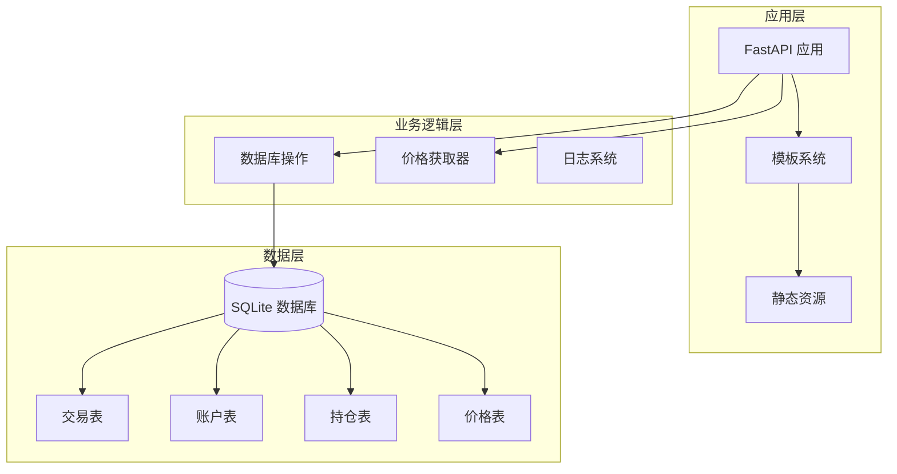
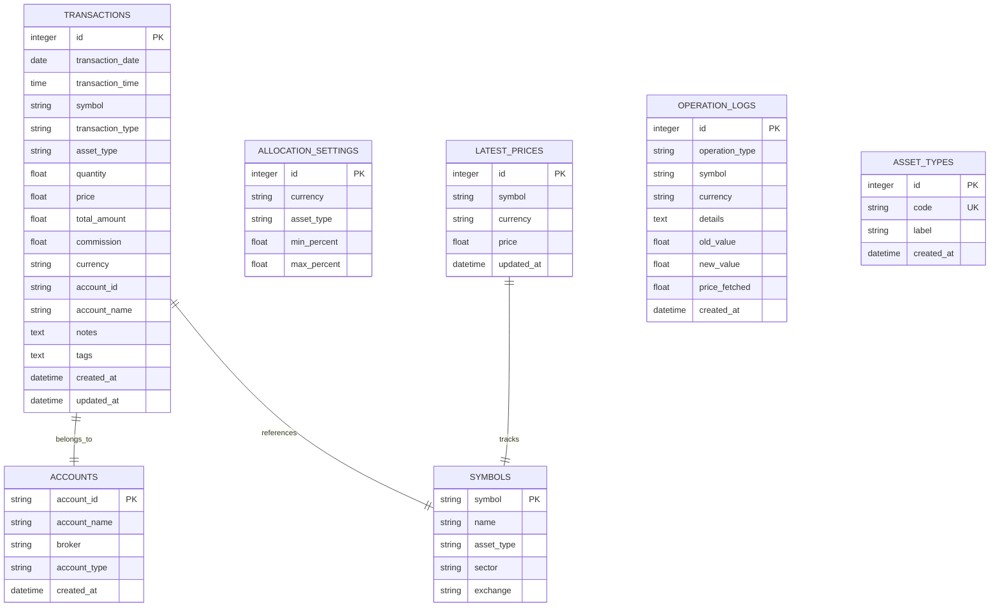
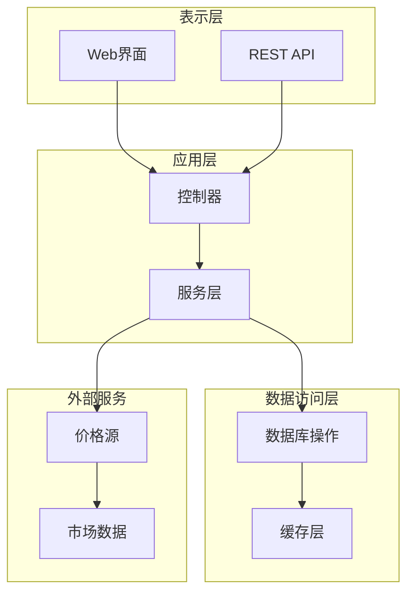
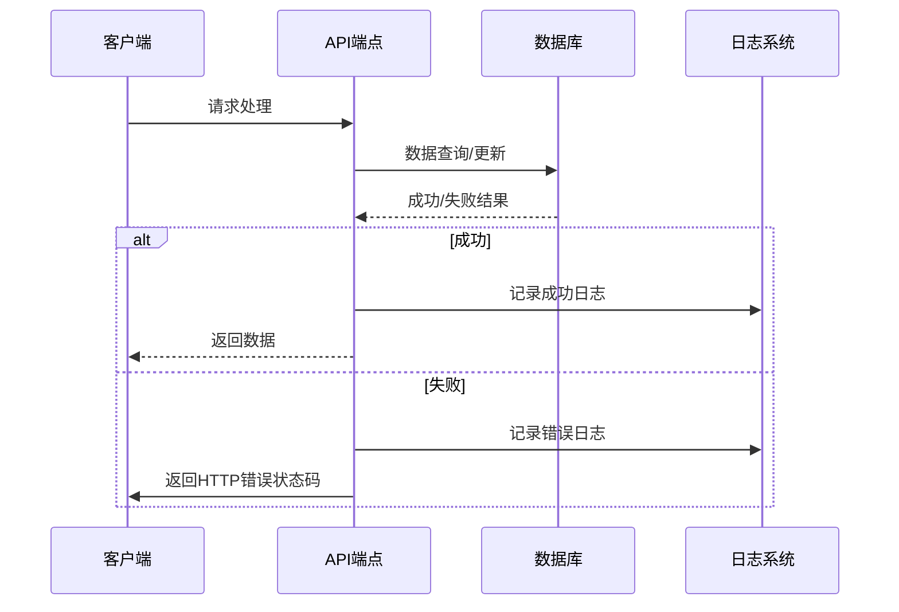
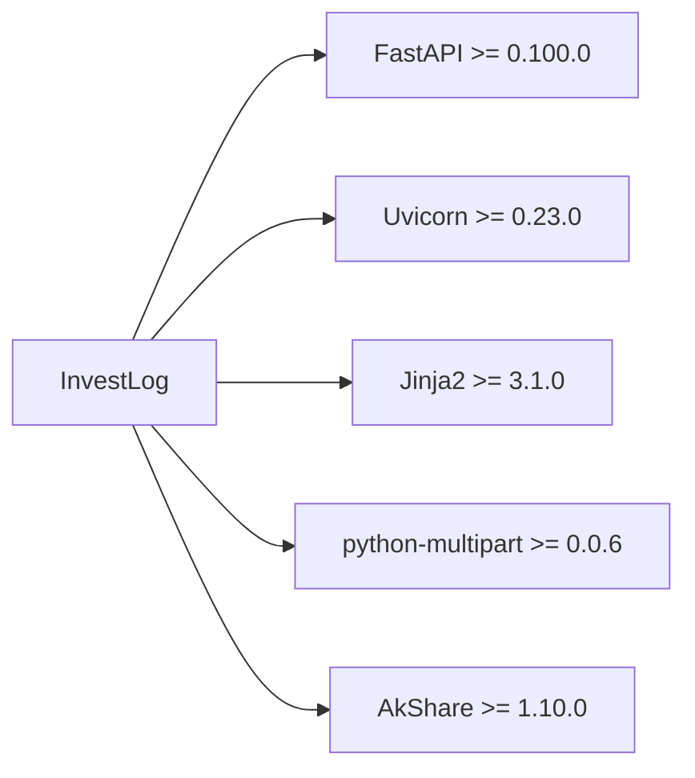
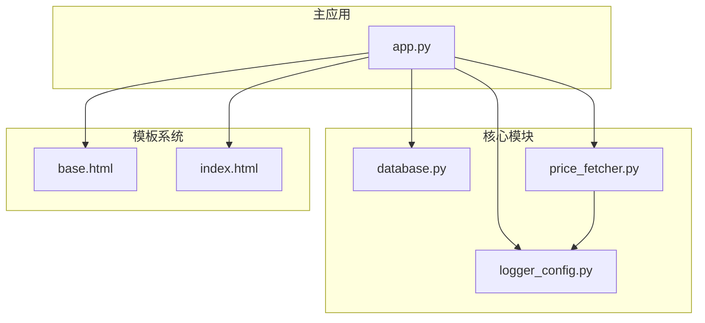
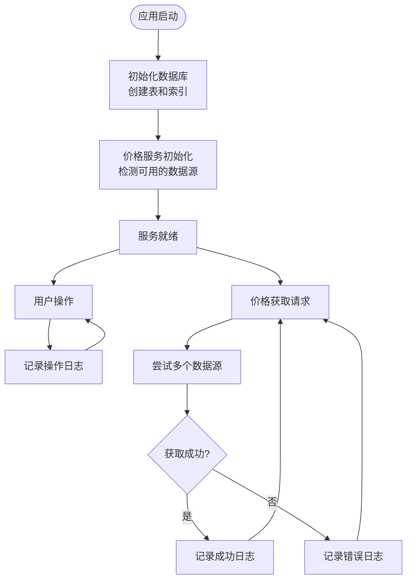

# API参考文档

<cite>
**本文档中引用的文件**
- [app.py](file://app.py)
- [database.py](file://database.py)
- [price_fetcher.py](file://price_fetcher.py)
- [logger_config.py](file://logger_config.py)
- [requirements.txt](file://requirements.txt)
- [base.html](file://templates/base.html)
- [index.html](file://templates/index.html)
</cite>

## 目录
1. [简介](#简介)
2. [项目结构](#项目结构)
3. [核心组件](#核心组件)
4. [架构概览](#架构概览)
5. [详细组件分析](#详细组件分析)
6. [依赖关系分析](#依赖关系分析)
7. [性能考虑](#性能考虑)
8. [故障排除指南](#故障排除指南)
9. [结论](#结论)

## 简介

Invest Log 是一个基于 FastAPI 的投资交易日志管理系统。该项目提供了完整的投资组合管理功能，包括交易记录、持仓跟踪、价格更新、图表分析等。系统采用SQLite数据库存储数据，支持多币种（CNY、USD、HKD）和多种资产类型（股票、债券、贵金属、现金）。

## 项目结构

Invest Log 采用模块化设计，主要包含以下核心组件：

**图表来源**
- [app.py](file://app.py#L19-L29)
- [database.py](file://database.py#L20-L149)

**章节来源**
- [app.py](file://app.py#L1-L444)
- [database.py](file://database.py#L1-L944)

## 核心组件

### API端点概述

系统提供RESTful API端点，主要分为以下几类：

1. **HTML页面端点**：提供Web界面访问
2. **API端点**：提供JSON数据接口
3. **表单提交端点**：处理用户输入

### 数据模型

系统使用以下核心数据模型：

**图表来源**
- [database.py](file://database.py#L25-L147)

**章节来源**
- [database.py](file://database.py#L1-L944)

## 架构概览

Invest Log 采用分层架构设计，确保关注点分离和代码可维护性：

**图表来源**
- [app.py](file://app.py#L36-L444)
- [price_fetcher.py](file://price_fetcher.py#L321-L398)

## 详细组件分析

### API端点详细说明

#### 持仓相关API

**GET /api/holdings**
- **功能**：获取当前持仓信息
- **参数**：
  - `account_id` (可选): 账户ID过滤
- **响应**：持仓列表，包含符号、数量、成本等信息

**GET /api/holdings-by-currency**
- **功能**：按货币分组的持仓信息，包含配置警告
- **参数**：无
- **响应**：按货币分组的持仓详情

**GET /api/portfolio-history**
- **功能**：获取投资组合历史价值
- **参数**：无
- **响应**：时间序列的历史价值数据

#### 交易相关API

**GET /api/transactions**
- **功能**：获取交易记录
- **参数**：
  - `symbol` (可选): 股票符号过滤
  - `account_id` (可选): 账户ID过滤
  - `transaction_type` (可选): 交易类型过滤
  - `limit` (默认: 100): 结果限制
- **响应**：交易记录列表

**DELETE /api/transactions/{transaction_id}**
- **功能**：删除指定交易记录
- **路径参数**：
  - `transaction_id`: 交易记录ID
- **响应**：删除成功状态或HTTP 404错误

#### 价格相关API

**POST /api/holdings/update-price**
- **功能**：更新资产价格
- **表单参数**：
  - `symbol`: 资产符号
  - `currency`: 币种
- **响应**：重定向到持仓页面

**POST /api/holdings/quick-trade**
- **功能**：快速交易
- **表单参数**：
  - `symbol`: 资产符号
  - `currency`: 币种
  - `account_id`: 账户ID
  - `asset_type`: 资产类型
  - `transaction_type`: 交易类型
  - `quantity`: 数量
  - `price`: 价格
  - `commission`: 手续费 (默认: 0)
  - `notes`: 备注 (默认: 空字符串)
- **响应**：重定向到持仓页面

#### 设置相关API

**GET /api/settings**
- **功能**：获取配置设置
- **参数**：无
- **响应**：配置设置详情

**POST /api/settings**
- **功能**：更新配置设置
- **表单参数**：动态生成的设置项
- **响应**：重定向到设置页面

**POST /api/settings/add-asset-type**
- **功能**：添加资产类型
- **表单参数**：
  - `code`: 类型代码
  - `label`: 显示标签
- **响应**：重定向到设置页面

**POST /api/settings/delete-asset-type/{code}**
- **功能**：删除资产类型
- **路径参数**：
  - `code`: 资产类型代码
- **响应**：重定向到设置页面

### 错误处理机制

系统采用统一的错误处理策略：

**图表来源**
- [app.py](file://app.py#L431-L439)
- [logger_config.py](file://logger_config.py#L14-L54)

**章节来源**
- [app.py](file://app.py#L376-L444)
- [database.py](file://database.py#L156-L256)

## 依赖关系分析

### 外部依赖

系统依赖以下主要第三方库：

**图表来源**
- [requirements.txt](file://requirements.txt#L1-L6)

### 内部模块依赖

**图表来源**
- [app.py](file://app.py#L15-L17)
- [price_fetcher.py](file://price_fetcher.py#L20-L21)

**章节来源**
- [requirements.txt](file://requirements.txt#L1-L6)
- [app.py](file://app.py#L1-L444)

## 性能考虑

### 数据库优化

1. **索引策略**：为常用查询字段建立索引
   - `symbol`: 股票符号查询
   - `transaction_date`: 时间范围查询
   - `account_id`: 账户过滤
   - `transaction_type`: 交易类型过滤
   - `currency`: 币种过滤
   - `asset_type`: 资产类型过滤

2. **查询优化**：使用参数化查询防止SQL注入
3. **连接池**：使用SQLite连接工厂模式

### 缓存策略

1. **价格缓存**：最新的市场价格存储在`latest_prices`表中
2. **操作日志**：记录所有重要操作便于审计
3. **会话管理**：基于浏览器会话的状态管理

### API性能优化建议

1. **分页查询**：交易列表默认限制100条记录
2. **条件过滤**：支持多维度查询过滤
3. **批量操作**：支持一次性处理多个交易
4. **异步处理**：价格获取使用异步模式

## 故障排除指南

### 常见问题及解决方案

**数据库连接问题**
- 检查数据库文件权限
- 验证SQLite版本兼容性
- 确认数据库文件完整性

**价格获取失败**
- 检查网络连接
- 验证数据源可用性
- 查看日志文件获取详细错误信息

**API访问错误**
- 检查FastAPI服务器状态
- 验证请求格式和参数
- 查看服务器日志

### 日志分析

系统提供详细的日志记录功能：

**图表来源**
- [logger_config.py](file://logger_config.py#L14-L54)
- [price_fetcher.py](file://price_fetcher.py#L321-L398)

**章节来源**
- [logger_config.py](file://logger_config.py#L1-L54)
- [price_fetcher.py](file://price_fetcher.py#L1-L398)

## 结论

Invest Log 提供了一个完整、可扩展的投资交易管理解决方案。系统采用现代Web技术栈，具有良好的架构设计和完善的错误处理机制。通过RESTful API接口，用户可以方便地集成各种客户端应用进行数据访问和操作。

系统的主要优势包括：
- 清晰的分层架构设计
- 完善的错误处理和日志记录
- 支持多币种和多资产类型的灵活配置
- 友好的Web界面和API接口
- 可扩展的价格数据源支持

对于生产环境部署，建议：
1. 配置适当的服务器资源和监控
2. 实施备份策略保护数据库
3. 考虑添加用户认证和授权机制
4. 实施API限流和安全防护措施