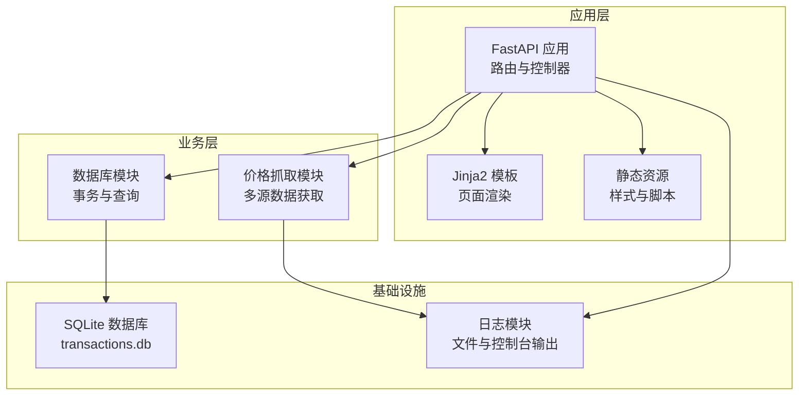
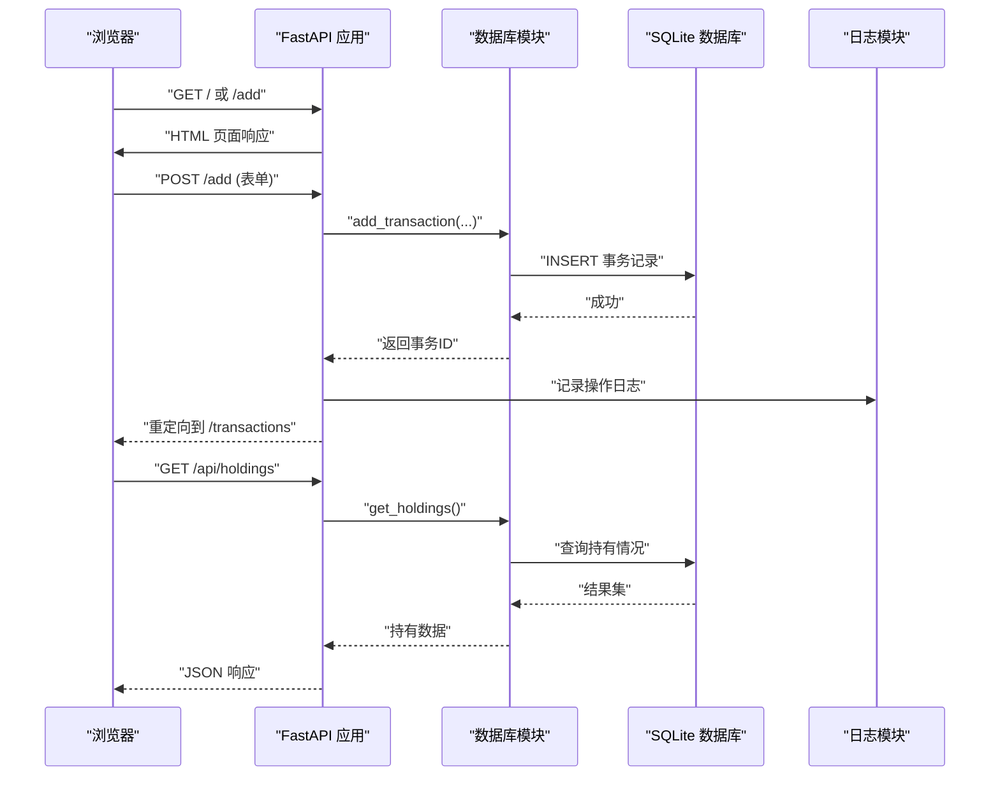
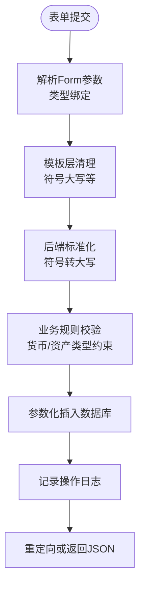
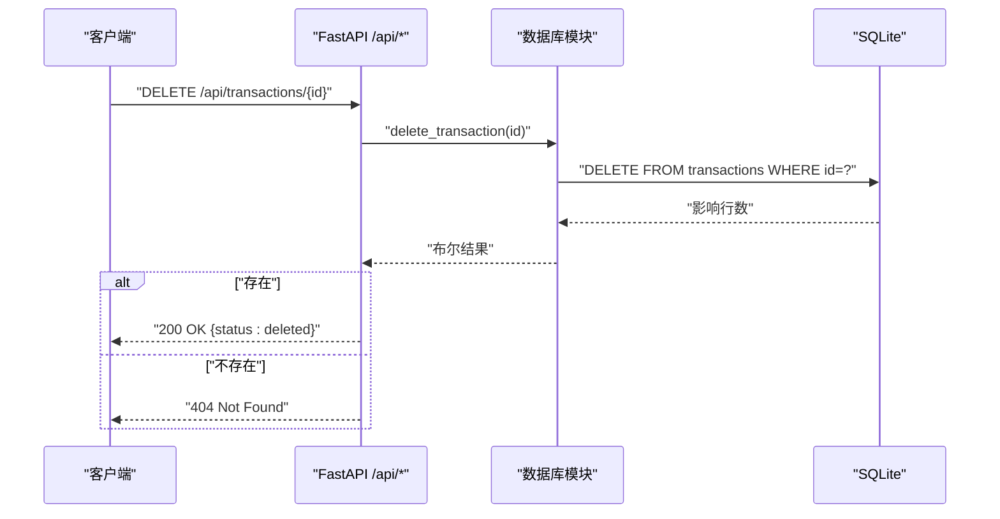
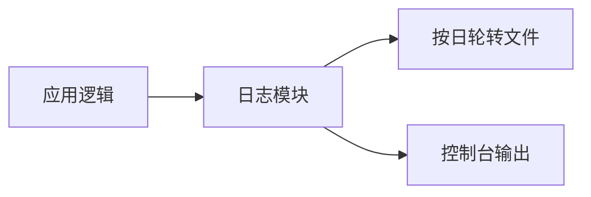
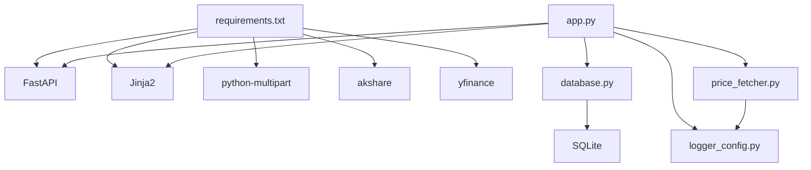

# API认证与安全

<cite>
**本文档引用的文件**
- [app.py](file://app.py)
- [database.py](file://database.py)
- [logger_config.py](file://logger_config.py)
- [price_fetcher.py](file://price_fetcher.py)
- [requirements.txt](file://requirements.txt)
- [templates/base.html](file://templates/base.html)
- [templates/add.html](file://templates/add.html)
- [templates/settings.html](file://templates/settings.html)
- [templates/holdings.html](file://templates/holdings.html)
</cite>

## 目录
1. [简介](#简介)
2. [项目结构](#项目结构)
3. [核心组件](#核心组件)
4. [架构总览](#架构总览)
5. [详细组件分析](#详细组件分析)
6. [依赖关系分析](#依赖关系分析)
7. [性能考虑](#性能考虑)
8. [故障排除指南](#故障排除指南)
9. [结论](#结论)
10. [附录](#附录)

## 简介
本文件聚焦于invest-log项目的API认证与安全设计。尽管当前为单机应用，但项目已具备基础的数据库访问、模板渲染与日志记录能力。本文从认证与授权、输入验证与清理、CSRF防护、XSS防护、SQL注入防护、API使用安全建议以及日志与审计等方面进行系统化梳理，并结合现有代码实现给出可操作的安全加固建议。

## 项目结构
项目采用FastAPI作为Web框架，配合Jinja2模板引擎渲染页面，SQLite作为本地存储，内置日志模块用于运行时审计。前端通过静态资源与模板完成交互，后端提供REST风格的HTML页面与API接口。

**图表来源**
- [app.py](file://app.py#L1-L446)
- [database.py](file://database.py#L1-L944)
- [logger_config.py](file://logger_config.py#L1-L54)
- [price_fetcher.py](file://price_fetcher.py#L1-L398)

**章节来源**
- [app.py](file://app.py#L1-L446)
- [requirements.txt](file://requirements.txt#L1-L6)

## 核心组件
- 认证与会话：当前未实现用户认证与会话管理，所有操作均为匿名访问。
- 授权模型：无显式权限控制，所有用户对同一数据集具有相同访问范围。
- 输入处理：通过FastAPI的Form参数绑定接收表单数据；部分字段在模板中强制转换（如符号大写）。
- 数据持久化：SQLite数据库，使用参数化查询与约束保证数据一致性。
- 日志与审计：基于Python标准库的日志模块，按天轮转保留7天日志。
- 外部数据源：多源价格抓取，包含超时与错误处理逻辑。

**章节来源**
- [app.py](file://app.py#L83-L110)
- [database.py](file://database.py#L156-L193)
- [logger_config.py](file://logger_config.py#L14-L53)
- [price_fetcher.py](file://price_fetcher.py#L1-L200)

## 架构总览
下图展示请求从浏览器到数据库的典型流程，包括表单提交、API调用与日志记录：

**图表来源**
- [app.py](file://app.py#L83-L110)
- [app.py](file://app.py#L378-L381)
- [database.py](file://database.py#L156-L193)
- [database.py](file://database.py#L312-L358)
- [logger_config.py](file://logger_config.py#L14-L53)

## 详细组件分析

### 表单提交与输入验证
- 表单字段通过FastAPI的Form参数绑定，类型在路由签名中声明，便于基本类型校验。
- 模板层对部分字段进行前端约束（如符号输入强制大写），减少异常数据进入后端。
- 后端在插入数据库前统一将符号转换为大写，避免大小写不一致导致的数据重复或查询困难。

**图表来源**
- [app.py](file://app.py#L83-L110)
- [templates/add.html](file://templates/add.html#L14-L17)
- [database.py](file://database.py#L178-L188)

**章节来源**
- [app.py](file://app.py#L83-L110)
- [templates/add.html](file://templates/add.html#L14-L17)
- [database.py](file://database.py#L178-L188)

### API端点与访问控制
- 当前所有API端点未设置认证中间件，任何本地访问均可直接调用。
- 删除交易的API返回HTTP状态码并在未找到时抛出异常，便于客户端识别错误。

**图表来源**
- [app.py](file://app.py#L433-L440)
- [database.py](file://database.py#L247-L255)

**章节来源**
- [app.py](file://app.py#L378-L440)
- [database.py](file://database.py#L247-L255)

### 日志与审计
- 日志按天轮转，保留最近7天，同时输出到控制台，便于开发与运维监控。
- 关键操作（新增交易、价格更新、删除交易等）均记录到日志，形成基础审计轨迹。

**图表来源**
- [logger_config.py](file://logger_config.py#L14-L53)
- [app.py](file://app.py#L109-L110)
- [app.py](file://app.py#L244-L245)
- [app.py](file://app.py#L437-L440)

**章节来源**
- [logger_config.py](file://logger_config.py#L14-L53)
- [app.py](file://app.py#L109-L110)
- [app.py](file://app.py#L244-L245)
- [app.py](file://app.py#L437-L440)

### 外部数据源与安全
- 价格抓取模块支持多源回退，包含超时与异常处理，避免单点故障影响整体可用性。
- 抓取过程中设置了合理的超时时间与错误日志，有助于定位网络问题。

**章节来源**
- [price_fetcher.py](file://price_fetcher.py#L1-L200)
- [price_fetcher.py](file://price_fetcher.py#L219-L394)

## 依赖关系分析
- 应用依赖FastAPI、Jinja2、python-multipart等库，未引入专门的认证扩展。
- 数据库模块封装了SQLite连接与查询，使用参数化语句降低SQL注入风险。
- 日志模块独立于业务逻辑，提供统一的审计入口。

**图表来源**
- [requirements.txt](file://requirements.txt#L1-L6)
- [app.py](file://app.py#L1-L18)
- [database.py](file://database.py#L1-L11)
- [logger_config.py](file://logger_config.py#L1-L10)
- [price_fetcher.py](file://price_fetcher.py#L1-L20)

**章节来源**
- [requirements.txt](file://requirements.txt#L1-L6)
- [app.py](file://app.py#L1-L18)
- [database.py](file://database.py#L1-L11)
- [logger_config.py](file://logger_config.py#L1-L10)
- [price_fetcher.py](file://price_fetcher.py#L1-L20)

## 性能考虑
- 数据库查询使用索引（如symbol、date、account等），有助于提升分页与过滤性能。
- 价格抓取采用多源回退策略，提高成功率与稳定性。
- 日志按天轮转，避免单文件过大影响IO性能。

**章节来源**
- [database.py](file://database.py#L140-L146)
- [price_fetcher.py](file://price_fetcher.py#L1-L200)
- [logger_config.py](file://logger_config.py#L24-L32)

## 故障排除指南
- 404错误：删除交易API在未找到目标时返回404，客户端应捕获并提示用户。
- 价格获取失败：当所有数据源均不可用时，日志会记录错误摘要，可在日志目录查看具体原因。
- 表单提交异常：若前端字段未满足模板约束（如符号格式），可能导致后端入库失败，需检查模板与后端转换逻辑。

**章节来源**
- [app.py](file://app.py#L433-L440)
- [price_fetcher.py](file://price_fetcher.py#L384-L394)
- [templates/add.html](file://templates/add.html#L14-L17)

## 结论
当前项目在单机环境下提供了基础的交易记录与查询能力，安全方面主要体现在：
- 使用参数化查询与数据库约束降低SQL注入风险；
- 通过模板层与后端标准化减少输入异常；
- 内置日志模块提供基本审计能力。

为进一步强化安全，建议在保持单机部署的前提下增加认证与授权、CSRF防护、XSS防护与API限流等机制。

## 附录

### 安全最佳实践清单（针对单机应用）
- 认证与授权
  - 引入轻量级认证（如基于密码的登录与会话）或API密钥机制；
  - 对敏感端点（如删除、修改）实施细粒度授权检查。
- CSRF防护
  - 在表单提交中加入CSRF令牌，并在服务端验证；
  - 对于AJAX请求，确保同源策略与自定义头部校验。
- XSS防护
  - 模板渲染时默认转义非信任内容；
  - 对用户输入进行白名单清理或严格验证。
- SQL注入防护
  - 已使用参数化查询与约束，继续保持；
  - 避免动态拼接SQL，定期审查查询构造逻辑。
- API使用安全建议
  - 限制请求频率（速率限制），防止滥用；
  - 对外部数据源设置合理超时与重试策略；
  - 对敏感字段（如账户信息）进行脱敏输出。
- 日志与审计
  - 扩展操作日志表，记录用户、IP、时间戳与操作详情；
  - 将日志集中化存储与告警，便于追踪异常行为。

### 威胁防护策略
- 本地访问控制：仅监听127.0.0.1或通过反向代理暴露，避免直接公网访问；
- 文件与路径安全：静态资源与日志目录权限最小化，避免被恶意读取；
- 依赖安全：定期更新第三方库，关注安全公告与补丁。