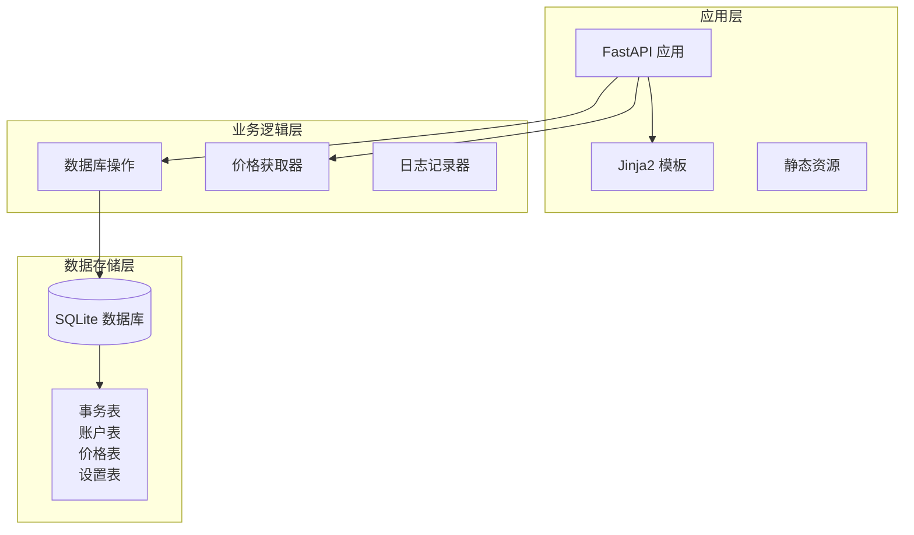
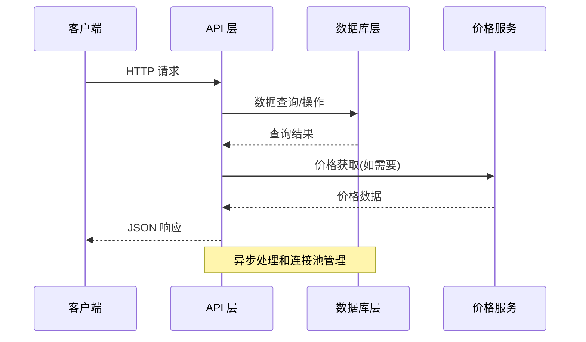
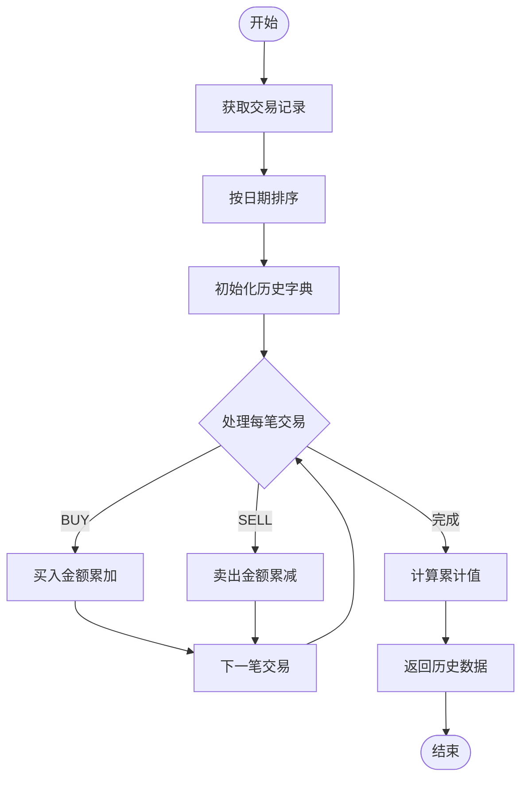
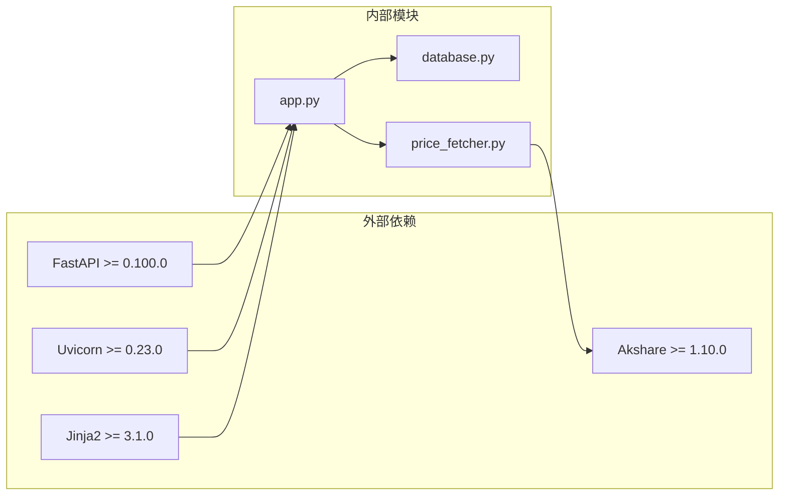

# RESTful API端点

<cite>
**本文档引用的文件**
- [app.py](file://app.py)
- [database.py](file://database.py)
- [price_fetcher.py](file://price_fetcher.py)
- [requirements.txt](file://requirements.txt)
</cite>

## 目录
1. [简介](#简介)
2. [项目结构](#项目结构)
3. [核心组件](#核心组件)
4. [架构概览](#架构概览)
5. [详细端点分析](#详细端点分析)
6. [依赖关系分析](#依赖关系分析)
7. [性能考虑](#性能考虑)
8. [故障排除指南](#故障排除指南)
9. [结论](#结论)

## 简介

Invest Log 是一个基于 FastAPI 的投资交易日志管理系统，提供了完整的 RESTful API 端点用于管理股票、债券、贵金属等各类资产的投资交易记录。该系统支持多币种（人民币、美元、港币）投资组合管理，具备实时价格获取、投资组合分析、资产分配监控等功能。

## 项目结构

项目采用模块化设计，主要包含以下核心组件：



**图表来源**
- [app.py](file://app.py#L19-L29)
- [database.py](file://database.py#L20-L149)

**章节来源**
- [app.py](file://app.py#L1-L446)
- [database.py](file://database.py#L1-L944)

## 核心组件

### API 应用程序
- 基于 FastAPI 构建，提供异步处理能力
- 集成 Jinja2 模板引擎用于 HTML 页面渲染
- 支持静态文件托管和响应式设计

### 数据库层
- 使用 SQLite 作为主要数据存储
- 提供完整的 CRUD 操作接口
- 支持复杂查询和数据分析功能

### 价格获取服务
- 多数据源支持：AKShare、Yahoo Finance、新浪、腾讯
- 自动故障转移机制
- 实时价格缓存和更新

**章节来源**
- [app.py](file://app.py#L19-L29)
- [database.py](file://database.py#L13-L18)
- [price_fetcher.py](file://price_fetcher.py#L1-L398)

## 架构概览

系统采用分层架构设计，API 层负责处理 HTTP 请求，业务逻辑层处理数据操作，数据访问层管理数据库连接。



**图表来源**
- [app.py](file://app.py#L378-L441)
- [database.py](file://database.py#L13-L18)
- [price_fetcher.py](file://price_fetcher.py#L321-L394)

## 详细端点分析

### /api/holdings 端点

**描述**: 获取当前投资组合持有情况

**HTTP 方法**: GET

**URL 模式**: `/api/holdings`

**请求参数**:
- `account_id` (可选): 账户ID过滤器

**响应格式**:
```json
[
  {
    "symbol": "AAPL",
    "account_id": "ACCOUNT001",
    "currency": "USD",
    "asset_type": "stock",
    "total_shares": 100,
    "total_cost": 15000.0,
    "avg_cost": 150.0
  }
]
```

**状态码**:
- 200: 成功
- 500: 数据库错误

**请求示例**:
```
GET /api/holdings?account_id=ACCOUNT001
Accept: application/json
```

**响应示例**:
```json
[
  {
    "symbol": "AAPL",
    "account_id": "ACCOUNT001",
    "currency": "USD",
    "asset_type": "stock",
    "total_shares": 100,
    "total_cost": 15000.0,
    "avg_cost": 150.0
  }
]
```

**参数验证规则**:
- `account_id`: 字符串类型，最大长度限制
- 返回空数组表示无匹配记录

**章节来源**
- [app.py](file://app.py#L378-L381)
- [database.py](file://database.py#L312-L358)

### /api/holdings-by-currency 端点

**描述**: 获取按货币分组的投资组合持有情况，包含资产配置警告

**HTTP 方法**: GET

**URL 模式**: `/api/holdings-by-currency`

**请求参数**: 无

**响应格式**:
```json
{
  "CNY": {
    "total": 100000.0,
    "allocations": [
      {
        "asset_type": "stock",
        "label": "股票",
        "amount": 60000.0,
        "percent": 60.0,
        "min_percent": 0,
        "max_percent": 100,
        "warning": null
      }
    ]
  }
}
```

**状态码**:
- 200: 成功
- 500: 数据库错误

**请求示例**:
```
GET /api/holdings-by-currency
Accept: application/json
```

**响应示例**:
```json
{
  "CNY": {
    "total": 100000.0,
    "allocations": [
      {
        "asset_type": "stock",
        "label": "股票",
        "amount": 60000.0,
        "percent": 60.0,
        "min_percent": 0,
        "max_percent": 100,
        "warning": null
      }
    ]
  }
}
```

**参数验证规则**:
- 无参数输入
- 自动计算百分比和配置警告

**章节来源**
- [app.py](file://app.py#L384-L387)
- [database.py](file://database.py#L673-L726)

### /api/transactions 端点

**描述**: 获取交易历史记录，支持多种过滤条件

**HTTP 方法**: GET

**URL 模式**: `/api/transactions`

**请求参数**:
- `symbol` (可选): 股票代码过滤器
- `account_id` (可选): 账户ID过滤器  
- `transaction_type` (可选): 交易类型过滤器
- `limit` (可选): 结果数量限制，默认 100

**响应格式**:
```json
[
  {
    "id": 1,
    "transaction_date": "2024-01-15",
    "transaction_type": "BUY",
    "symbol": "AAPL",
    "quantity": 10,
    "price": 150.0,
    "total_amount": 1500.0,
    "commission": 0,
    "currency": "USD",
    "account_id": "ACCOUNT001"
  }
]
```

**状态码**:
- 200: 成功
- 500: 数据库错误

**请求示例**:
```
GET /api/transactions?symbol=AAPL&limit=50
Accept: application/json
```

**响应示例**:
```json
[
  {
    "id": 1,
    "transaction_date": "2024-01-15",
    "transaction_type": "BUY",
    "symbol": "AAPL",
    "quantity": 10,
    "price": 150.0,
    "total_amount": 1500.0,
    "commission": 0,
    "currency": "USD",
    "account_id": "ACCOUNT001"
  }
]
```

**参数验证规则**:
- `symbol`: 字符串类型，自动转换为大写
- `limit`: 整数类型，最大值限制
- 支持多种交易类型：BUY、SELL、DIVIDEND、SPLIT、TRANSFER_IN、TRANSFER_OUT、ADJUST

**章节来源**
- [app.py](file://app.py#L390-L403)
- [database.py](file://database.py#L262-L309)

### /api/portfolio-history 端点

**描述**: 获取投资组合历史价值数据，用于图表展示

**HTTP 方法**: GET

**URL 模式**: `/api/portfolio-history`

**请求参数**: 无

**响应格式**:
```json
[
  {
    "date": "2024-01-01",
    "value": 100000.0
  },
  {
    "date": "2024-01-02", 
    "value": 102500.0
  }
]
```

**状态码**:
- 200: 成功
- 500: 数据库错误

**请求示例**:
```
GET /api/portfolio-history
Accept: application/json
```

**响应示例**:
```json
[
  {
    "date": "2024-01-01",
    "value": 100000.0
  },
  {
    "date": "2024-01-02",
    "value": 102500.0
  }
]
```

**参数验证规则**:
- 无参数输入
- 自动计算累计投资价值
- 仅处理 BUY 和 SELL 交易类型

**算法流程**:



**图表来源**
- [app.py](file://app.py#L406-L430)

**章节来源**
- [app.py](file://app.py#L406-L430)

### /api/transactions/{transaction_id} 端点

**描述**: 删除指定的交易记录

**HTTP 方法**: DELETE

**URL 模式**: `/api/transactions/{transaction_id}`

**路径参数**:
- `transaction_id` (必需): 交易记录ID

**响应格式**:
```json
{
  "status": "deleted"
}
```

**状态码**:
- 200: 成功删除
- 404: 交易记录不存在

**请求示例**:
```
DELETE /api/transactions/123
Accept: application/json
```

**响应示例**:
```json
{
  "status": "deleted"
}
```

**错误处理**:
- 404 错误：当交易ID不存在时返回详细错误信息

**参数验证规则**:
- `transaction_id`: 整数类型，必须大于0

**章节来源**
- [app.py](file://app.py#L433-L440)
- [database.py](file://database.py#L247-L255)

## 依赖关系分析

系统各组件之间的依赖关系如下：



**图表来源**
- [requirements.txt](file://requirements.txt#L1-L6)
- [app.py](file://app.py#L7-L17)

**章节来源**
- [requirements.txt](file://requirements.txt#L1-L6)
- [app.py](file://app.py#L7-L17)

## 性能考虑

### 数据库优化
- 使用索引优化常用查询字段
- 连接池管理减少连接开销
- 分页查询避免大数据量加载

### 缓存策略
- 最新价格缓存减少重复查询
- 模板渲染结果缓存
- API 响应缓存机制

### 并发处理
- 异步请求处理
- 非阻塞数据库操作
- 多线程价格获取

## 故障排除指南

### 常见错误及解决方案

**数据库连接错误**:
- 检查数据库文件权限
- 验证 SQLite 版本兼容性
- 确认数据库文件完整性

**价格获取失败**:
- 检查网络连接
- 验证数据源可用性
- 查看日志获取详细错误信息

**API 访问错误**:
- 确认 URL 路径正确
- 验证请求参数格式
- 检查认证和授权设置

**章节来源**
- [database.py](file://database.py#L13-L18)
- [price_fetcher.py](file://price_fetcher.py#L321-L394)

## 结论

Invest Log 提供了完整的投资组合管理 RESTful API，涵盖了从基础数据查询到高级分析的所有核心功能。系统采用现代化的技术栈，具有良好的扩展性和维护性。通过清晰的端点设计和完善的错误处理机制，为用户提供了可靠的 API 服务。

未来可以考虑的功能增强包括：
- API 版本控制机制
- 更细粒度的权限控制
- 实时数据推送
- 更丰富的分析报表