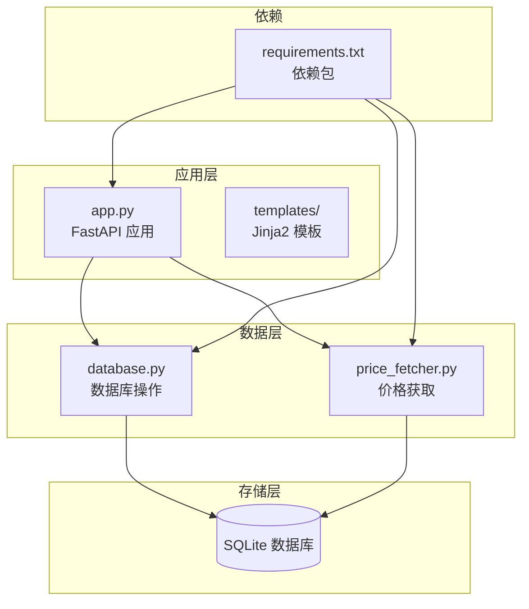
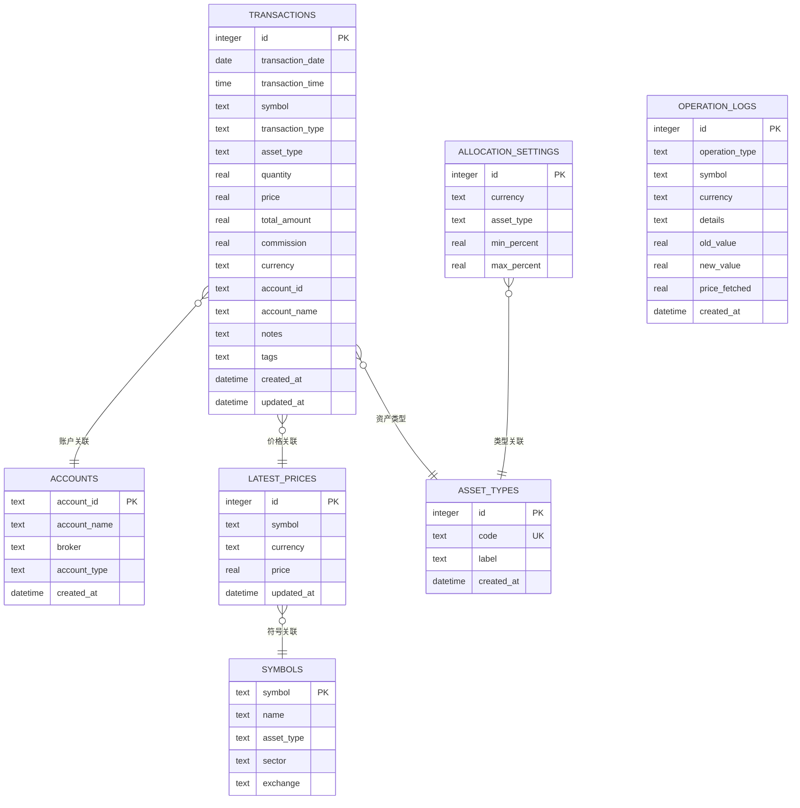
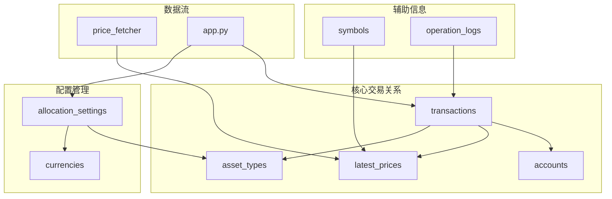
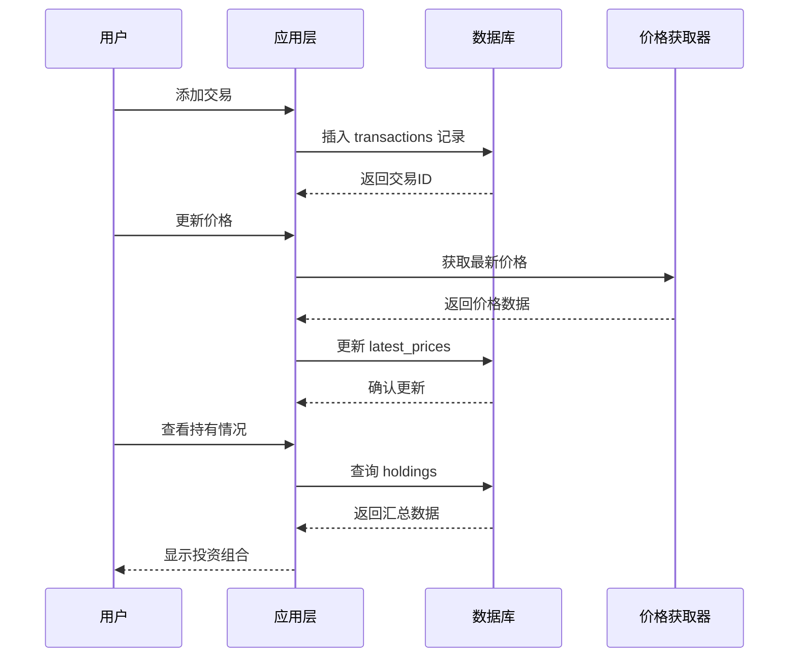
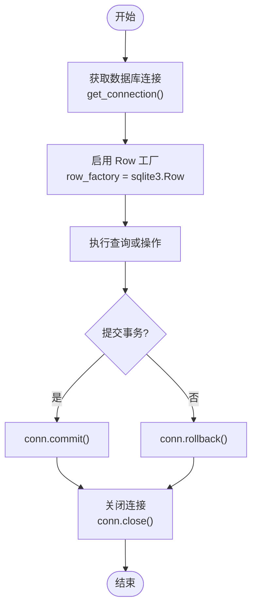

# 数据模型定义

<cite>
**本文档引用的文件**
- [app.py](file://app.py)
- [database.py](file://database.py)
- [price_fetcher.py](file://price_fetcher.py)
- [requirements.txt](file://requirements.txt)
- [templates/settings.html](file://templates/settings.html)
</cite>

## 目录
1. [简介](#简介)
2. [项目结构概览](#项目结构概览)
3. [核心数据模型](#核心数据模型)
4. [数据库表结构详解](#数据库表结构详解)
5. [实体关系图](#实体关系图)
6. [数据访问模式](#数据访问模式)
7. [缓存策略与性能优化](#缓存策略与性能优化)
8. [数据验证与业务规则](#数据验证与业务规则)
9. [数据生命周期管理](#数据生命周期管理)
10. [故障排除指南](#故障排除指南)
11. [总结](#总结)

## 简介

Invest Log 是一个基于 Python 和 FastAPI 的投资交易日志管理系统。该系统使用 SQLite 作为数据存储，提供了完整的投资组合跟踪功能，包括交易记录、资产估值、投资组合分析和配置管理。

本数据模型文档详细说明了系统中所有数据库表的结构、关系和约束条件，为开发者和用户提供全面的技术参考。

## 项目结构概览

**图表来源**
- [app.py](file://app.py#L1-L50)
- [database.py](file://database.py#L1-L30)
- [price_fetcher.py](file://price_fetcher.py#L1-L20)

**章节来源**
- [app.py](file://app.py#L1-L50)
- [database.py](file://database.py#L1-L30)
- [requirements.txt](file://requirements.txt#L1-L6)

## 核心数据模型

Invest Log 系统采用以下核心数据模型：

### 主要实体
- **transactions**: 交易记录表
- **accounts**: 账户信息表  
- **latest_prices**: 最新价格表
- **asset_types**: 资产类型表
- **allocation_settings**: 配置设置表
- **operation_logs**: 操作日志表
- **symbols**: 股票符号表

### 数据模型关系

**图表来源**
- [database.py](file://database.py#L25-L138)

## 数据库表结构详解

### transactions 表（交易记录）

**表结构定义**
- 主键：`id` (INTEGER, PRIMARY KEY AUTOINCREMENT)
- 交易日期：`transaction_date` (DATE, NOT NULL)
- 交易时间：`transaction_time` (TIME)
- 股票代码：`symbol` (TEXT, NOT NULL)
- 交易类型：`transaction_type` (TEXT, NOT NULL, CHECK约束)
- 资产类型：`asset_type` (TEXT, DEFAULT 'stock', CHECK约束)
- 数量：`quantity` (REAL, NOT NULL)
- 价格：`price` (REAL, NOT NULL)
- 总金额：`total_amount` (REAL, NOT NULL)
- 手续费：`commission` (REAL, DEFAULT 0)
- 货币：`currency` (TEXT, DEFAULT 'CNY', CHECK约束)
- 账户ID：`account_id` (TEXT, NOT NULL)
- 账户名称：`account_name` (TEXT)
- 备注：`notes` (TEXT)
- 标签：`tags` (TEXT)
- 创建时间：`created_at` (DATETIME, DEFAULT CURRENT_TIMESTAMP)
- 更新时间：`updated_at` (DATETIME)

**CHECK 约束**
- `transaction_type`: 必须在 ('BUY', 'SELL', 'DIVIDEND', 'SPLIT', 'TRANSFER_IN', 'TRANSFER_OUT', 'ADJUST') 中
- `asset_type`: 必须在 ('stock', 'bond', 'metal', 'cash') 中
- `currency`: 必须在 ('CNY', 'USD', 'HKD') 中

**索引设计**
- `idx_symbol`: 对 symbol 字段建立索引
- `idx_date`: 对 transaction_date 字段建立索引
- `idx_account`: 对 account_id 字段建立索引
- `idx_type`: 对 transaction_type 字段建立索引
- `idx_currency`: 对 currency 字段建立索引
- `idx_asset_type`: 对 asset_type 字段建立索引

**业务规则**
- 自动计算 `total_amount = quantity * price`
- 支持多种交易类型：买入、卖出、分红、拆分、转账、调整
- 支持多币种：人民币(CNY)、美元(USD)、港币(HKD)
- 支持多种资产类型：股票、债券、贵金属、现金

**章节来源**
- [database.py](file://database.py#L25-L46)
- [database.py](file://database.py#L140-L146)

### accounts 表（账户信息）

**表结构定义**
- 账户ID：`account_id` (TEXT, PRIMARY KEY)
- 账户名称：`account_name` (TEXT, NOT NULL)
- 经纪商：`broker` (TEXT)
- 账户类型：`account_type` (TEXT)
- 创建时间：`created_at` (DATETIME, DEFAULT CURRENT_TIMESTAMP)

**业务规则**
- 账户ID作为主键确保唯一性
- 支持不同类型的账户（普通账户、保证金账户等）
- 记录账户创建时间用于审计

**章节来源**
- [database.py](file://database.py#L54-L63)

### latest_prices 表（最新价格）

**表结构定义**
- 主键：`id` (INTEGER, PRIMARY KEY AUTOINCREMENT)
- 股票代码：`symbol` (TEXT, NOT NULL)
- 货币：`currency` (TEXT, NOT NULL)
- 价格：`price` (REAL, NOT NULL)
- 更新时间：`updated_at` (DATETIME, DEFAULT CURRENT_TIMESTAMP)

**UNIQUE 约束**
- `(symbol, currency)`: 确保每个股票在每种货币下只有一个最新价格记录

**业务规则**
- 存储从外部数据源获取的实时价格
- 使用 ON CONFLICT 子句处理重复插入
- 记录价格更新时间用于缓存失效判断

**章节来源**
- [database.py](file://database.py#L128-L138)

### asset_types 表（资产类型）

**表结构定义**
- 主键：`id` (INTEGER, PRIMARY KEY AUTOINCREMENT)
- 代码：`code` (TEXT, NOT NULL UNIQUE)
- 标签：`label` (TEXT, NOT NULL)
- 创建时间：`created_at` (DATETIME, DEFAULT CURRENT_TIMESTAMP)

**默认数据**
- 股票(stock) - 股票
- 债券(bond) - 债券  
- 贵金属(metal) - 贵金属
- 现金(cash) - 现金

**业务规则**
- 资产类型独立于货币存在
- 一个资产类型可应用于任何货币
- 提供国际化标签支持

**章节来源**
- [database.py](file://database.py#L88-L97)
- [database.py](file://database.py#L99-L112)

### allocation_settings 表（配置设置）

**表结构定义**
- 主键：`id` (INTEGER, PRIMARY KEY AUTOINCREMENT)
- 货币：`currency` (TEXT, NOT NULL, CHECK约束)
- 资产类型：`asset_type` (TEXT, NOT NULL)
- 最小百分比：`min_percent` (REAL, DEFAULT 0)
- 最大百分比：`max_percent` (REAL, DEFAULT 100)

**UNIQUE 约束**
- `(currency, asset_type)`: 确保每种货币和资产类型的组合唯一

**CHECK 约束**
- `currency`: 必须在 ('CNY', 'USD', 'HKD') 中

**业务规则**
- 设置投资组合目标配置范围
- 用于生成配置警告
- 支持多货币配置管理

**章节来源**
- [database.py](file://database.py#L76-L86)

### symbols 表（股票符号）

**表结构定义**
- 股票代码：`symbol` (TEXT, PRIMARY KEY)
- 名称：`name` (TEXT)
- 资产类型：`asset_type` (TEXT)
- 板块：`sector` (TEXT)
- 交易所：`exchange` (TEXT)

**业务规则**
- 作为股票信息的静态字典表
- 与外部数据源集成获取基本信息
- 支持股票分类和筛选

**章节来源**
- [database.py](file://database.py#L65-L74)

### operation_logs 表（操作日志）

**表结构定义**
- 主键：`id` (INTEGER, PRIMARY KEY AUTOINCREMENT)
- 操作类型：`operation_type` (TEXT, NOT NULL)
- 股票代码：`symbol` (TEXT)
- 货币：`currency` (TEXT)
- 详情：`details` (TEXT)
- 旧值：`old_value` (REAL)
- 新值：`new_value` (REAL)
- 获取价格：`price_fetched` (REAL)
- 创建时间：`created_at` (DATETIME, DEFAULT CURRENT_TIMESTAMP)

**业务规则**
- 记录所有重要操作的历史
- 支持价格更新、资产调整等操作追踪
- 用于审计和问题排查

**章节来源**
- [database.py](file://database.py#L113-L126)

## 实体关系图

### 完整关系图

**图表来源**
- [database.py](file://database.py#L25-L138)
- [app.py](file://app.py#L1-L50)

### 交易流程关系

**图表来源**
- [app.py](file://app.py#L83-L110)
- [app.py](file://app.py#L216-L261)
- [database.py](file://database.py#L156-L193)
- [database.py](file://database.py#L779-L800)

## 数据访问模式

### 连接管理模式

**图表来源**
- [database.py](file://database.py#L13-L17)
- [database.py](file://database.py#L175-L193)

### 查询构建模式

系统采用动态查询构建模式，支持灵活的过滤条件：

**主要查询函数**
- `get_transactions()`: 支持按符号、账户、类型、货币、年份等多条件过滤
- `get_holdings()`: 计算当前持仓，支持按账户分组
- `get_holdings_by_currency()`: 按货币和资产类型分组的投资组合分析
- `get_allocation_settings()`: 获取配置设置

**查询优化特性**
- 使用参数化查询防止 SQL 注入
- 动态 WHERE 子句构建
- 支持分页查询（LIMIT/OFFSET）
- SQLite 特定函数支持（strftime）

**章节来源**
- [database.py](file://database.py#L262-L309)
- [database.py](file://database.py#L312-L358)
- [database.py](file://database.py#L673-L726)

## 缓存策略与性能优化

### 内存缓存策略

**最新价格缓存**
- `get_all_latest_prices()`: 返回完整的价格查找表
- 缓存格式：`{(symbol, currency): row}` 键值对
- 用于避免重复数据库查询

**资产类型缓存**
- `get_asset_type_labels()`: 返回代码到标签的映射
- 减少重复查询成本

### 索引优化

**现有索引**
- `idx_symbol`: 优化按股票代码查询
- `idx_date`: 优化按日期范围查询
- `idx_account`: 优化按账户查询
- `idx_type`: 优化按交易类型查询
- `idx_currency`: 优化按货币查询
- `idx_asset_type`: 优化按资产类型查询

**查询性能建议**
- 对常用过滤条件建立索引
- 使用复合索引优化多条件查询
- 考虑分区策略处理大量历史数据

### 数据库优化

**SQLite 特定优化**
- 使用 `ON CONFLICT` 子句减少冲突处理开销
- 合理使用事务批量操作
- 优化查询计划和执行路径

**章节来源**
- [database.py](file://database.py#L815-L824)
- [database.py](file://database.py#L140-L146)

## 数据验证与业务规则

### 输入验证规则

**交易记录验证**
- 数量和价格必须为正数
- 交易类型必须在允许范围内
- 货币代码必须有效
- 账户ID必须存在

**配置设置验证**
- 百分比范围必须在 0-100 之间
- 最小值不能大于最大值
- 货币和资产类型必须有效

**资产类型管理验证**
- 代码必须唯一且符合格式要求
- 删除前检查是否有相关交易记录

### 业务逻辑规则

**持仓计算规则**
- 买入：增加数量和成本
- 卖出：减少数量和成本
- 分红：增加现金收入
- 拆分：按比例调整数量和价格
- 转账：内部转移不影响总值

**价格更新规则**
- 使用多源备份机制获取价格
- 支持手动和自动价格更新
- 记录价格变更历史

**章节来源**
- [database.py](file://database.py#L638-L641)
- [database.py](file://database.py#L434-L480)
- [price_fetcher.py](file://price_fetcher.py#L321-L394)

## 数据生命周期管理

### 数据保留策略

**交易记录保留**
- 建议长期保存以满足税务和审计需求
- 可根据法规要求确定具体保留期限
- 支持历史数据归档

**价格数据保留**
- 最新价格数据实时更新
- 历史价格数据可选择性保留
- 建议保留至少 1-2 年的历史价格

**日志数据保留**
- 操作日志建议保留 6-12 个月
- 重要事件日志永久保存
- 支持日志轮转和清理

### 归档规则

**自动归档**
- 基于时间的自动归档策略
- 按账户或资产类型分组归档
- 支持压缩和加密归档

**手动归档**
- 用户可选择特定时间段进行归档
- 支持导出为标准格式
- 归档后可选择性删除原始数据

### 数据清理策略

**过期数据清理**
- 定期清理过期的日志记录
- 清理无效的临时数据
- 优化数据库空间使用

**数据完整性检查**
- 定期检查数据一致性
- 验证外键约束完整性
- 监控数据质量指标

## 故障排除指南

### 常见问题诊断

**数据库连接问题**
- 检查数据库文件权限
- 验证 SQLite 版本兼容性
- 确认数据库文件未被其他进程锁定

**查询性能问题**
- 分析查询执行计划
- 检查索引使用情况
- 优化复杂查询语句

**数据一致性问题**
- 检查事务提交状态
- 验证外键约束
- 确认数据完整性约束

### 错误处理机制

**异常捕获**
- 数据库操作异常处理
- 网络请求异常处理
- 文件操作异常处理

**恢复策略**
- 自动重试机制
- 回滚事务保护
- 备份数据恢复

**章节来源**
- [database.py](file://database.py#L175-L193)
- [price_fetcher.py](file://price_fetcher.py#L376-L394)

## 总结

Invest Log 系统的数据模型设计体现了以下特点：

**架构优势**
- 基于 SQLite 的轻量级设计，易于部署和维护
- 清晰的实体关系和约束定义
- 完善的索引和查询优化策略
- 强大的数据验证和业务规则控制

**扩展性考虑**
- 支持多币种和多资产类型
- 灵活的配置管理和用户自定义
- 可扩展的价格数据源集成
- 完善的日志和审计功能

**性能优化**
- 合理的索引设计和查询优化
- 内存缓存策略减少数据库压力
- 批量操作和事务管理提升效率

该数据模型为投资组合管理提供了坚实的基础，既满足了当前的功能需求，又为未来的扩展和优化预留了空间。