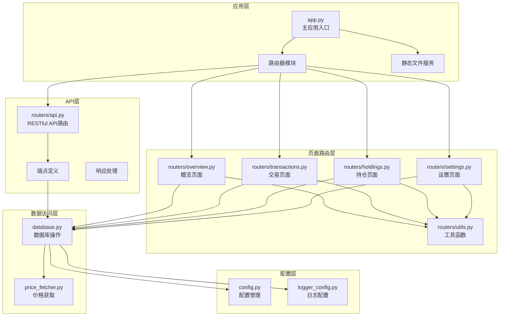
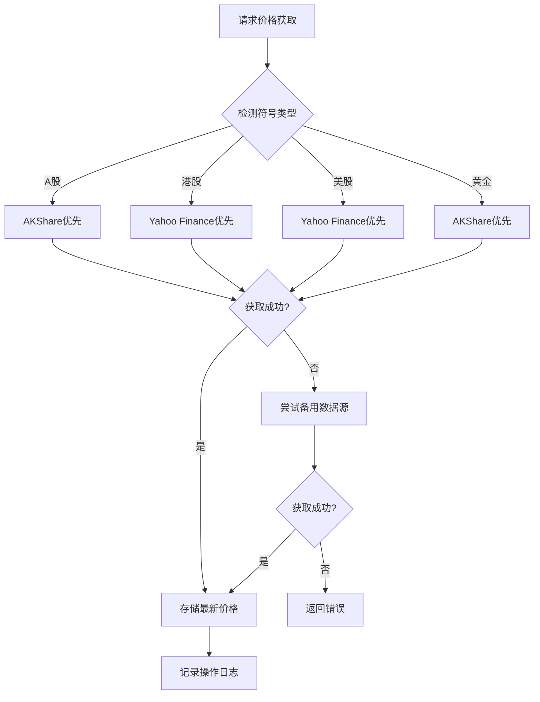

# API接口文档

<cite>
**本文档引用的文件**
- [app.py](file://app.py)
- [routers/api.py](file://routers/api.py)
- [routers/holdings.py](file://routers/holdings.py)
- [routers/transactions.py](file://routers/transactions.py)
- [routers/overview.py](file://routers/overview.py)
- [routers/settings.py](file://routers/settings.py)
- [routers/utils.py](file://routers/utils.py)
- [database.py](file://database.py)
- [price_fetcher.py](file://price_fetcher.py)
- [config.py](file://config.py)
- [logger_config.py](file://logger_config.py)
- [requirements.txt](file://requirements.txt)
- [templates/base.html](file://templates/base.html)
</cite>

## 更新摘要
**变更内容**
- 更新了API路由结构，反映了完整的RESTful API和HTML页面路由的双重架构
- 补充了价格获取服务的详细说明，包括多数据源支持
- 更新了数据库表结构和索引策略的说明
- 增加了配置管理和日志记录系统的详细说明
- 完善了错误处理和异常管理的文档

## 目录
1. [简介](#简介)
2. [项目架构](#项目架构)
3. [核心组件](#核心组件)
4. [API接口规范](#api接口规范)
5. [HTML页面路由](#html页面路由)
6. [数据库设计](#数据库设计)
7. [价格获取服务](#价格获取服务)
8. [配置管理](#配置管理)
9. [日志系统](#日志系统)
10. [性能优化](#性能优化)
11. [故障排除指南](#故障排除指南)
12. [最佳实践](#最佳实践)
13. [结论](#结论)

## 简介

投资日志管理系统是一个基于FastAPI构建的全栈Web应用程序，用于跟踪和管理个人或机构的投资交易记录。该系统提供了完整的RESTful API接口和HTML页面路由，支持投资组合管理、交易记录查询、实时价格获取、资产配置管理等功能。

系统采用SQLite作为数据存储，支持多币种（CNY、USD、HKD）和多种资产类型（股票、债券、贵金属、现金）。系统集成了多个金融数据源，包括AKShare、Yahoo Finance等，提供可靠的价格数据获取能力。

**章节来源**
- [app.py](file://app.py#L1-L34)
- [requirements.txt](file://requirements.txt#L1-L6)

## 项目架构

系统采用现代化的分层架构设计，结合RESTful API和传统Web页面路由，确保前后端分离和代码可维护性：



**图表来源**
- [app.py](file://app.py#L7-L29)
- [routers/api.py](file://routers/api.py#L1-L67)
- [routers/utils.py](file://routers/utils.py#L1-L14)

**章节来源**
- [app.py](file://app.py#L13-L29)
- [routers/api.py](file://routers/api.py#L6)

## 核心组件

### 应用程序入口

主应用程序通过FastAPI框架启动，配置静态文件服务和数据库初始化。应用在启动时自动初始化数据库表结构，并挂载所有路由器模块。

### 路由器模块

系统采用模块化的路由器设计，每个功能域都有独立的路由器模块：

- **API路由器** (`/api`前缀)：提供RESTful API接口
- **概览路由器** (`/`前缀)：主页和仪表板页面
- **交易路由器** (`/transactions`前缀)：交易记录管理页面
- **持仓路由器** (`/holdings`前缀)：持仓管理和价格更新页面
- **设置路由器** (`/settings`前缀)：系统配置和管理页面

### 静态文件服务

系统提供静态文件服务，包括CSS样式文件和JavaScript资源，支持响应式设计和图表可视化。

**章节来源**
- [app.py](file://app.py#L13-L29)
- [routers/utils.py](file://routers/utils.py#L1-L14)

## API接口规范

### 基础信息

- **基础URL**：`http://localhost:8000`
- **API前缀**：`/api`
- **数据格式**：JSON
- **编码**：UTF-8
- **认证**：无（本地开发环境）

### 持仓相关API

#### GET /api/holdings
**功能**：获取当前持仓信息
**请求参数**：
- `account_id` (可选)：账户ID过滤器

**响应格式**：
```json
[
  {
    "symbol": "AAPL",
    "account_id": "ACCOUNT001",
    "currency": "USD",
    "asset_type": "stock",
    "total_shares": 100,
    "total_cost": 15000.0,
    "avg_cost": 150.0
  }
]
```

#### GET /api/holdings-by-currency
**功能**：按货币分组的持仓信息，包含资产配置警告
**响应格式**：
```json
{
  "CNY": {
    "total": 100000.0,
    "allocations": [
      {
        "asset_type": "stock",
        "label": "股票",
        "amount": 60000.0,
        "percent": 60.0,
        "min_percent": 0,
        "max_percent": 100,
        "warning": null
      }
    ]
  }
}
```

### 交易相关API

#### GET /api/transactions
**功能**：获取交易记录，支持多种过滤条件
**请求参数**：
- `symbol` (可选)：股票代码过滤器
- `account_id` (可选)：账户ID过滤器  
- `transaction_type` (可选)：交易类型过滤器
- `limit` (可选，默认100)：结果数量限制

**响应格式**：
```json
[
  {
    "id": 1,
    "transaction_date": "2024-01-15",
    "transaction_type": "BUY",
    "symbol": "AAPL",
    "quantity": 100,
    "price": 150.0,
    "total_amount": 15000.0,
    "commission": 0,
    "currency": "USD",
    "account_id": "ACCOUNT001"
  }
]
```

#### DELETE /api/transactions/{transaction_id}
**功能**：删除指定交易记录
**路径参数**：
- `transaction_id`：交易记录ID

**响应格式**：
```json
{
  "status": "deleted"
}
```

### 投资组合历史API

#### GET /api/portfolio-history
**功能**：获取投资组合历史价值数据，用于图表展示
**响应格式**：
```json
[
  {
    "date": "2024-01-01",
    "value": 100000.0
  },
  {
    "date": "2024-01-02", 
    "value": 105000.0
  }
]
```

**章节来源**
- [routers/api.py](file://routers/api.py#L8-L67)

## HTML页面路由

### 概览页面

#### GET /
**功能**：仪表板页面，显示按货币分组的持仓概览
**响应**：HTML模板渲染

#### GET /charts
**功能**：图表和分析页面，按股票代码分组显示
**响应**：HTML模板渲染

### 持仓管理页面

#### GET /holdings
**功能**：详细的持仓页面，显示每只股票的持仓详情
**请求参数**：
- `msg` (可选)：消息内容
- `msg_type` (可选)：消息类型

**响应**：HTML模板渲染

#### GET /symbol/{symbol}
**功能**：特定股票的详细页面，包含交易历史
**请求参数**：
- `currency`：货币，默认CNY
- `year`：年份，默认当前年份

**响应**：HTML模板渲染

### 交易管理页面

#### GET /transactions
**功能**：交易记录列表，支持分页
**请求参数**：
- `page`：页码，默认1

**响应**：HTML模板渲染

#### GET /add
**功能**：添加新交易的表单页面
**响应**：HTML模板渲染

### 设置管理页面

#### GET /settings
**功能**：系统设置页面，管理资产配置、账户和资产类型
**请求参数**：
- `tab`：激活的标签页
- `msg`：消息内容
- `msg_type`：消息类型

**响应**：HTML模板渲染

**章节来源**
- [routers/overview.py](file://routers/overview.py#L8-L27)
- [routers/holdings.py](file://routers/holdings.py#L13-L76)
- [routers/transactions.py](file://routers/transactions.py#L10-L43)
- [routers/settings.py](file://routers/settings.py#L12-L64)

## 数据库设计

### 数据库架构

系统使用SQLite作为持久化存储，包含以下核心表：

#### 交易表 (transactions)
存储所有投资交易记录，支持多种交易类型：
- BUY：买入
- SELL：卖出  
- DIVIDEND：股息
- SPLIT：拆股
- TRANSFER_IN：转入
- TRANSFER_OUT：转出
- ADJUST：调整
- INCOME：收入

#### 账户表 (accounts)
存储投资账户信息，包括券商和账户类型。

#### 符号表 (symbols)
存储股票代码信息，包括资产类型、板块、交易所等元数据。

#### 资产类型表 (asset_types)
支持动态资产类型管理，独立于货币。

#### 分配设置表 (allocation_settings)
存储各货币下的资产配置范围设置。

#### 操作日志表 (operation_logs)
记录所有重要操作的日志信息。

#### 最新价格表 (latest_prices)
存储各符号的最新市场价格。

### 索引策略

系统为常用查询字段建立了索引，包括：
- `symbol`：股票代码查询
- `transaction_date`：日期范围查询
- `account_id`：账户过滤
- `transaction_type`：交易类型过滤
- `currency`：货币过滤
- `asset_type`：资产类型过滤

**章节来源**
- [database.py](file://database.py#L22-L195)

## 价格获取服务

### 多数据源支持

系统集成了四个主要数据源，按优先级顺序提供价格获取：

#### AKShare (主要数据源)
- **A股**：支持上交所(SH)和深交所(SZ)代码
- **港股**：支持香港交易所代码
- **美股**：支持美国交易所代码
- **黄金**：支持黄金价格获取

#### Yahoo Finance (备份数据源)
- **美股**：使用标准股票代码
- **港股**：支持.HK后缀格式
- **A股**：转换为.SS或.SZ后缀
- **黄金**：使用GC=F代码

#### Sina Finance API (备用数据源)
- **A股**：新浪实时行情
- **港股**：腾讯财经数据

#### Tencent Finance API (备用数据源)
- **A股**：腾讯财经行情
- **港股**：港股实时数据

### 价格获取流程



**图表来源**
- [price_fetcher.py](file://price_fetcher.py#L36-L66)
- [price_fetcher.py](file://price_fetcher.py#L73-L133)

**章节来源**
- [price_fetcher.py](file://price_fetcher.py#L1-L200)

## 配置管理

### 应用配置

系统采用JSON配置文件管理用户偏好设置：

#### 配置文件位置
- **默认路径**：`config.json`
- **iCloud同步**：可选择启用iCloud同步

#### 配置选项
- `db_name`：数据库文件名，默认`transactions.db`
- `use_icloud`：是否启用iCloud同步，默认`true`

### 数据库路径管理

系统支持灵活的数据库路径配置：
- **iCloud模式**：`~/Library/Mobile Documents/com~apple~CloudDocs/InvestLog/`
- **本地模式**：应用根目录
- **环境变量覆盖**：可通过`INVEST_LOG_DB_PATH`环境变量自定义

**章节来源**
- [config.py](file://config.py#L21-L55)

## 日志系统

### 日志配置

系统提供详细的日志记录功能，包括：

#### 日志级别
- **INFO**：应用启动、数据库初始化、操作完成
- **WARNING**：价格获取失败、交易删除不存在
- **ERROR**：数据库连接错误、配置保存失败

#### 日志轮转
- **按天轮转**：每天生成新的日志文件
- **保留7天**：自动清理7天前的日志文件
- **编码**：UTF-8支持中文字符

#### 日志格式
```
YYYY-MM-DD HH:MM:SS - logger_name - level - message
```

### 日志记录内容

系统记录以下类型的日志：
- **应用启动**：数据库初始化完成
- **价格获取**：成功/失败的报价尝试
- **交易操作**：添加、删除、修改交易记录
- **配置变更**：数据库设置更新
- **错误处理**：异常和错误信息

**章节来源**
- [logger_config.py](file://logger_config.py#L14-L54)

## 性能优化

### 数据库优化

1. **索引策略**：为常用查询字段建立了索引，包括symbol、transaction_date、account_id、transaction_type、currency、asset_type等字段。

2. **查询优化**：交易查询支持多种过滤条件，但默认限制返回100条记录，避免大数据量查询影响性能。

3. **连接池**：使用SQLite的连接工厂模式，确保线程安全的数据库连接管理。

### 缓存机制

1. **价格缓存**：最新的股价存储在latest_prices表中，避免重复网络请求。

2. **配置缓存**：资产类型和货币配置在内存中缓存，减少数据库查询次数。

### 网络优化

1. **多数据源降级**：价格获取支持多数据源，当主要数据源不可用时自动切换到备用数据源。

2. **超时控制**：网络请求设置了合理的超时时间，防止长时间阻塞。

3. **批量操作**：支持批量价格更新，减少网络请求次数。

**章节来源**
- [database.py](file://database.py#L186-L195)
- [price_fetcher.py](file://price_fetcher.py#L22-L34)

## 故障排除指南

### 常见问题

#### 数据库连接问题
- **症状**：应用启动时报数据库错误
- **解决方案**：检查数据库文件权限和路径配置

#### 价格获取失败
- **症状**：调用价格获取API返回错误
- **解决方案**：检查网络连接和数据源可用性

#### 交易记录查询异常
- **症状**：查询交易记录时出现SQL错误
- **解决方案**：验证查询参数格式和数据库表结构

#### 配置文件错误
- **症状**：应用无法读取配置文件
- **解决方案**：检查config.json格式和权限

### 错误处理机制

系统采用统一的错误处理机制：

1. **HTTP异常**：使用FastAPI的HTTPException处理API错误
2. **数据库异常**：捕获SQLite异常并记录详细信息
3. **网络异常**：处理价格获取过程中的网络错误
4. **参数验证**：验证请求参数的格式和范围

### 日志分析

系统提供了详细的日志记录功能，包括：
- 应用启动和关闭事件
- 数据库操作日志
- 价格获取尝试和结果
- 用户操作记录

**章节来源**
- [logger_config.py](file://logger_config.py#L14-L54)
- [routers/api.py](file://routers/api.py#L60-L66)

## 最佳实践

### API使用建议

1. **错误处理**：始终检查API响应状态码和错误信息
2. **数据验证**：在客户端进行基本的数据格式验证
3. **批量操作**：对于大量数据操作，使用分页和批量处理
4. **缓存策略**：合理利用缓存机制减少重复请求
5. **监控告警**：建立API使用监控和异常告警机制

### 数据库操作建议

1. **事务管理**：对涉及多个表的操作使用事务
2. **参数绑定**：使用参数绑定防止SQL注入
3. **索引优化**：为频繁查询的字段建立适当索引
4. **定期维护**：定期清理过期数据和重建索引

### 性能优化建议

1. **查询优化**：避免N+1查询问题
2. **连接复用**：复用数据库连接减少开销
3. **异步处理**：对耗时操作使用异步处理
4. **缓存策略**：合理使用Redis或其他缓存方案

### 安全建议

1. **输入验证**：对所有用户输入进行严格验证
2. **权限控制**：实现基于角色的访问控制
3. **数据加密**：敏感数据进行加密存储
4. **审计日志**：记录所有重要的操作行为

## 结论

投资日志管理系统提供了完整的企业级API接口和Web界面，具有以下特点：

1. **双模式架构**：同时支持RESTful API和HTML页面路由
2. **多数据源支持**：集成多个金融数据源，提高价格获取可靠性
3. **灵活的查询能力**：支持多种过滤条件和分页查询
4. **完整的资产管理**：涵盖交易、持仓、价格、配置等各个方面
5. **良好的扩展性**：模块化设计便于功能扩展和维护
6. **完善的日志系统**：提供详细的操作记录和错误追踪
7. **配置灵活性**：支持iCloud同步和自定义数据库路径

系统适合个人投资者和小型投资机构使用，提供了从基础交易记录到高级分析功能的完整解决方案。通过RESTful API和Web界面的双重设计，用户可以根据需要选择最适合的交互方式。