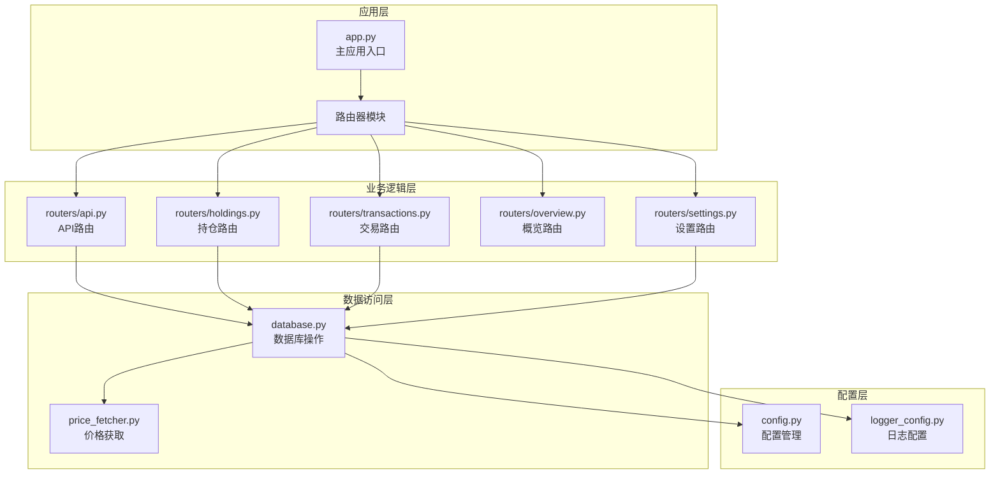
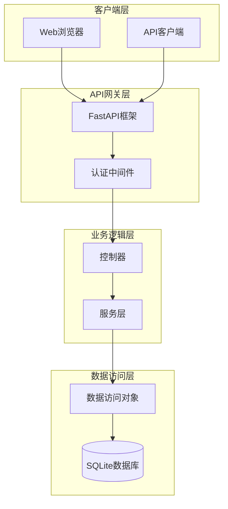
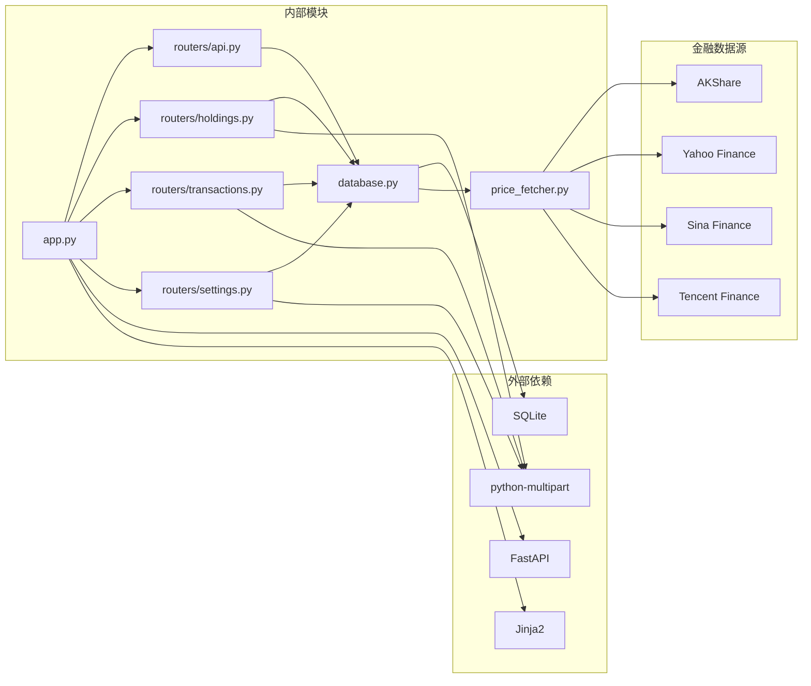

# API接口文档

<cite>
**本文档引用的文件**
- [app.py](file://app.py)
- [routers/api.py](file://routers/api.py)
- [routers/holdings.py](file://routers/holdings.py)
- [routers/transactions.py](file://routers/transactions.py)
- [routers/overview.py](file://routers/overview.py)
- [routers/settings.py](file://routers/settings.py)
- [database.py](file://database.py)
- [price_fetcher.py](file://price_fetcher.py)
- [config.py](file://config.py)
- [logger_config.py](file://logger_config.py)
- [requirements.txt](file://requirements.txt)
- [routers/utils.py](file://routers/utils.py)
- [templates/base.html](file://templates/base.html)
</cite>

## 目录
1. [简介](#简介)
2. [项目结构](#项目结构)
3. [核心组件](#核心组件)
4. [架构概览](#架构概览)
5. [详细组件分析](#详细组件分析)
6. [依赖关系分析](#依赖关系分析)
7. [性能考虑](#性能考虑)
8. [故障排除指南](#故障排除指南)
9. [结论](#结论)
10. [附录](#附录)

## 简介

投资日志管理系统是一个基于FastAPI构建的Web应用程序，用于跟踪和管理个人或机构的投资交易记录。该系统提供了完整的RESTful API接口，支持投资组合管理、交易记录查询、实时价格获取等功能。

本系统采用SQLite作为数据存储，支持多币种（CNY、USD、HKD）和多种资产类型（股票、债券、贵金属、现金）。系统集成了多个金融数据源，包括AKShare、Yahoo Finance等，提供可靠的价格数据获取能力。

## 项目结构

系统采用模块化的FastAPI架构设计，主要由以下组件构成：



**图表来源**
- [app.py](file://app.py#L13-L29)
- [routers/api.py](file://routers/api.py#L6)
- [database.py](file://database.py#L22-L151)

**章节来源**
- [app.py](file://app.py#L1-L34)
- [requirements.txt](file://requirements.txt#L1-L6)

## 核心组件

### 应用程序入口

主应用程序通过FastAPI框架启动，配置静态文件服务和数据库初始化。应用在启动时自动初始化数据库表结构，并挂载所有路由器模块。

### 数据库层

系统使用SQLite作为持久化存储，包含以下核心表：
- transactions：交易记录表
- accounts：账户信息表  
- symbols：股票代码信息表
- allocation_settings：资产配置设置表
- asset_types：资产类型表
- operation_logs：操作日志表
- latest_prices：最新价格表

### 价格获取服务

集成了多数据源的价格获取机制，支持A股、港股、美股和黄金等不同类型的资产价格获取，具备自动降级和错误处理能力。

**章节来源**
- [database.py](file://database.py#L22-L151)
- [price_fetcher.py](file://price_fetcher.py#L1-L405)

## 架构概览

系统采用分层架构设计，确保关注点分离和代码可维护性：



**图表来源**
- [app.py](file://app.py#L7-L11)
- [routers/api.py](file://routers/api.py#L1-L67)

## 详细组件分析

### API路由模块

API路由模块提供RESTful接口，所有API端点都位于`/api`前缀下，支持JSON格式的数据交换。

#### 持仓相关API

##### GET /api/holdings
**功能**：获取当前持仓信息
**请求参数**：
- account_id: 可选，账户ID过滤器

**响应格式**：
```json
[
  {
    "symbol": "AAPL",
    "account_id": "ACCOUNT001",
    "currency": "USD",
    "asset_type": "stock",
    "total_shares": 100,
    "total_cost": 15000.0,
    "avg_cost": 150.0
  }
]
```

##### GET /api/holdings-by-currency
**功能**：按货币分组的持仓信息，包含资产配置警告
**响应格式**：
```json
{
  "CNY": {
    "total": 100000.0,
    "allocations": [
      {
        "asset_type": "stock",
        "label": "股票",
        "amount": 60000.0,
        "percent": 60.0,
        "min_percent": 0,
        "max_percent": 100,
        "warning": null
      }
    ]
  }
}
```

#### 交易相关API

##### GET /api/transactions
**功能**：获取交易记录，支持多种过滤条件
**请求参数**：
- symbol: 可选，股票代码过滤器
- account_id: 可选，账户ID过滤器  
- transaction_type: 可选，交易类型过滤器
- limit: 默认100，结果数量限制

**响应格式**：
```json
[
  {
    "id": 1,
    "transaction_date": "2024-01-15",
    "transaction_type": "BUY",
    "symbol": "AAPL",
    "quantity": 100,
    "price": 150.0,
    "total_amount": 15000.0,
    "commission": 0,
    "currency": "USD",
    "account_id": "ACCOUNT001"
  }
]
```

##### DELETE /api/transactions/{transaction_id}
**功能**：删除指定交易记录
**路径参数**：
- transaction_id: 交易记录ID

**响应格式**：
```json
{
  "status": "deleted"
}
```

#### 投资组合历史API

##### GET /api/portfolio-history
**功能**：获取投资组合历史价值数据，用于图表展示
**响应格式**：
```json
[
  {
    "date": "2024-01-01",
    "value": 100000.0
  },
  {
    "date": "2024-01-02", 
    "value": 105000.0
  }
]
```

**图表来源**
- [routers/api.py](file://routers/api.py#L8-L67)

**章节来源**
- [routers/api.py](file://routers/api.py#L1-L67)

### 持仓管理模块

#### HTML页面路由

##### GET /holdings
**功能**：详细的持仓页面，显示每只股票的持仓详情
**响应**：HTML模板渲染

##### GET /symbol/{symbol}
**功能**：特定股票的详细页面，包含交易历史
**请求参数**：
- currency: 货币，默认CNY
- year: 年份，默认当前年份

##### POST /symbol/{symbol}/adjust
**功能**：调整资产价值
**表单参数**：
- new_value: 新的价值
- currency: 货币
- account_id: 账户ID
- asset_type: 资产类型，默认stock
- notes: 备注

#### 价格更新功能

##### POST /holdings/update-price
**功能**：从在线数据源获取最新价格
**表单参数**：
- symbol: 股票代码
- currency: 货币

##### POST /holdings/manual-update-price
**功能**：手动更新价格
**表单参数**：
- symbol: 股票代码
- currency: 货币
- price: 手动输入的价格

##### POST /holdings/quick-trade
**功能**：快速交易功能
**表单参数**：
- symbol: 股票代码
- currency: 货币
- account_id: 账户ID
- asset_type: 资产类型
- transaction_type: 交易类型(BUY/SELL)
- quantity: 数量
- price: 价格
- commission: 手续费
- notes: 备注
- link_cash: 是否关联现金交易

**章节来源**
- [routers/holdings.py](file://routers/holdings.py#L1-L207)

### 交易管理模块

#### 交易列表页面

##### GET /transactions
**功能**：交易记录列表，支持分页
**请求参数**：
- page: 页码，默认1

**响应**：HTML模板渲染

#### 添加交易页面

##### GET /add
**功能**：添加新交易的表单页面
**响应**：HTML模板渲染

##### POST /add
**功能**：提交新交易记录
**表单参数**：
- transaction_date: 交易日期
- symbol: 股票代码
- transaction_type: 交易类型
- asset_type: 资产类型
- currency: 货币
- quantity: 数量
- price: 价格
- account_id: 账户ID
- commission: 手续费
- notes: 备注
- link_cash: 是否关联现金交易

**章节来源**
- [routers/transactions.py](file://routers/transactions.py#L1-L75)

### 设置管理模块

#### 设置页面

##### GET /settings
**功能**：系统设置页面，管理资产配置、账户和资产类型
**请求参数**：
- tab: 激活的标签页
- msg: 消息内容
- msg_type: 消息类型

**响应**：HTML模板渲染

##### POST /settings
**功能**：保存资产配置设置
**表单参数**：动态生成的配置表单字段

##### POST /settings/add-asset-type
**功能**：添加新的资产类型
**表单参数**：
- code: 资产类型代码
- label: 显示标签

##### POST /settings/delete-asset-type/{code}
**功能**：删除资产类型
**路径参数**：
- code: 资产类型代码

##### POST /settings/add-account
**功能**：添加新账户
**表单参数**：
- account_id: 账户ID
- account_name: 账户名称
- broker: 券商
- account_type: 账户类型

##### POST /settings/delete-account/{account_id}
**功能**：删除账户
**路径参数**：
- account_id: 账户ID

**章节来源**
- [routers/settings.py](file://routers/settings.py#L1-L148)

### 概览模块

#### 主页

##### GET /
**功能**：仪表板页面，显示按货币分组的持仓概览
**响应**：HTML模板渲染

#### 图表页面

##### GET /charts
**功能**：图表和分析页面，按股票代码分组显示
**响应**：HTML模板渲染

**章节来源**
- [routers/overview.py](file://routers/overview.py#L1-L28)

## 依赖关系分析

系统的主要依赖关系如下：



**图表来源**
- [requirements.txt](file://requirements.txt#L1-L6)
- [price_fetcher.py](file://price_fetcher.py#L23-L34)

**章节来源**
- [requirements.txt](file://requirements.txt#L1-L6)
- [price_fetcher.py](file://price_fetcher.py#L1-L405)

## 性能考虑

### 数据库优化

1. **索引策略**：系统为常用查询字段建立了索引，包括symbol、transaction_date、account_id、transaction_type、currency、asset_type等字段。

2. **查询优化**：交易查询支持多种过滤条件，但默认限制返回100条记录，避免大数据量查询影响性能。

3. **连接池**：使用SQLite的连接工厂模式，确保线程安全的数据库连接管理。

### 缓存机制

1. **价格缓存**：最新的股价存储在latest_prices表中，避免重复网络请求。

2. **配置缓存**：资产类型和货币配置在内存中缓存，减少数据库查询次数。

### 网络优化

1. **多数据源降级**：价格获取支持多数据源，当主要数据源不可用时自动切换到备用数据源。

2. **超时控制**：网络请求设置了合理的超时时间，防止长时间阻塞。

## 故障排除指南

### 常见问题

#### 数据库连接问题
- **症状**：应用启动时报数据库错误
- **解决方案**：检查数据库文件权限和路径配置

#### 价格获取失败
- **症状**：调用价格获取API返回错误
- **解决方案**：检查网络连接和数据源可用性

#### 交易记录查询异常
- **症状**：查询交易记录时出现SQL错误
- **解决方案**：验证查询参数格式和数据库表结构

### 日志分析

系统提供了详细的日志记录功能，包括：
- 应用启动和关闭事件
- 数据库操作日志
- 价格获取尝试和结果
- 用户操作记录

**章节来源**
- [logger_config.py](file://logger_config.py#L1-L54)
- [database.py](file://database.py#L792-L831)

## 结论

投资日志管理系统提供了完整的企业级API接口，具有以下特点：

1. **RESTful设计**：遵循RESTful原则，接口清晰易用
2. **多数据源支持**：集成多个金融数据源，提高价格获取可靠性
3. **灵活的查询能力**：支持多种过滤条件和分页查询
4. **完整的资产管理**：涵盖交易、持仓、价格、配置等各个方面
5. **良好的扩展性**：模块化设计便于功能扩展和维护

系统适合个人投资者和小型投资机构使用，提供了从基础交易记录到高级分析功能的完整解决方案。

## 附录

### API版本控制策略

当前版本为1.0，采用语义化版本控制：
- 主版本号：重大变更
- 次版本号：功能新增
- 修订号：bug修复

### 向后兼容性保证

- 新增API不会破坏现有功能
- 参数变更时提供默认值
- 废弃功能会提前通知并提供迁移指南

### 安装和部署

1. **环境要求**：Python 3.7+
2. **安装依赖**：`pip install -r requirements.txt`
3. **启动应用**：`uvicorn app:app --host 127.0.0.1 --port 8000`

### 客户端集成示例

#### Python客户端示例
```python
import requests
import json

# 获取持仓信息
response = requests.get("http://localhost:8000/api/holdings")
holdings = response.json()

# 添加交易记录
transaction_data = {
    "transaction_date": "2024-01-15",
    "symbol": "AAPL",
    "transaction_type": "BUY",
    "quantity": 100,
    "price": 150.0,
    "account_id": "ACCOUNT001"
}

response = requests.post("http://localhost:8000/api/transactions", 
                       json=transaction_data)
```

#### JavaScript客户端示例
```javascript
// 获取交易历史
async function getTransactions() {
    const response = await fetch('/api/transactions?limit=50');
    const transactions = await response.json();
    return transactions;
}

// 删除交易记录
async function deleteTransaction(id) {
    const response = await fetch(`/api/transactions/${id}`, {
        method: 'DELETE'
    });
    return response.json();
}
```

### 最佳实践

1. **错误处理**：始终检查API响应状态码和错误信息
2. **数据验证**：在客户端进行基本的数据格式验证
3. **批量操作**：对于大量数据操作，使用分页和批量处理
4. **缓存策略**：合理利用缓存机制减少重复请求
5. **监控告警**：建立API使用监控和异常告警机制