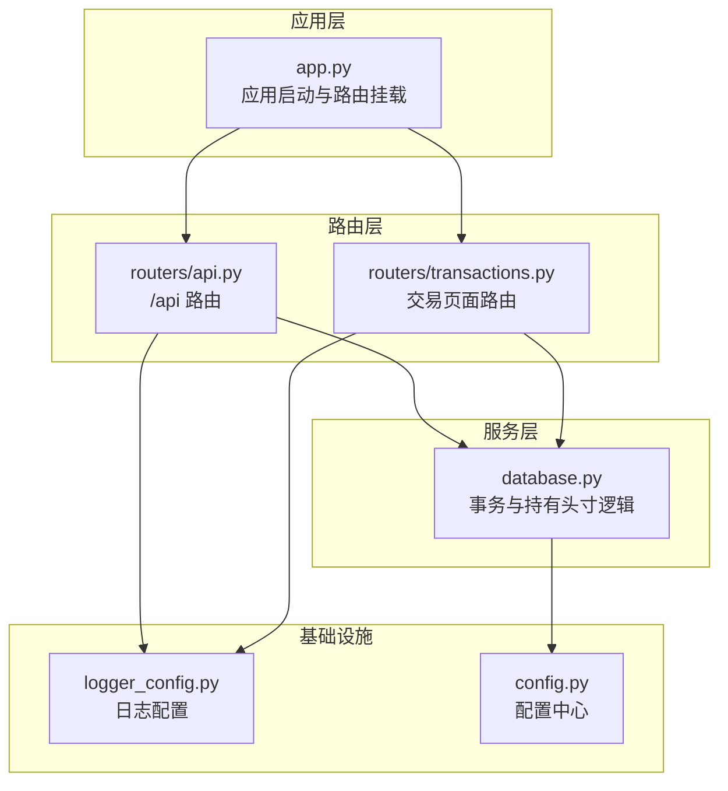
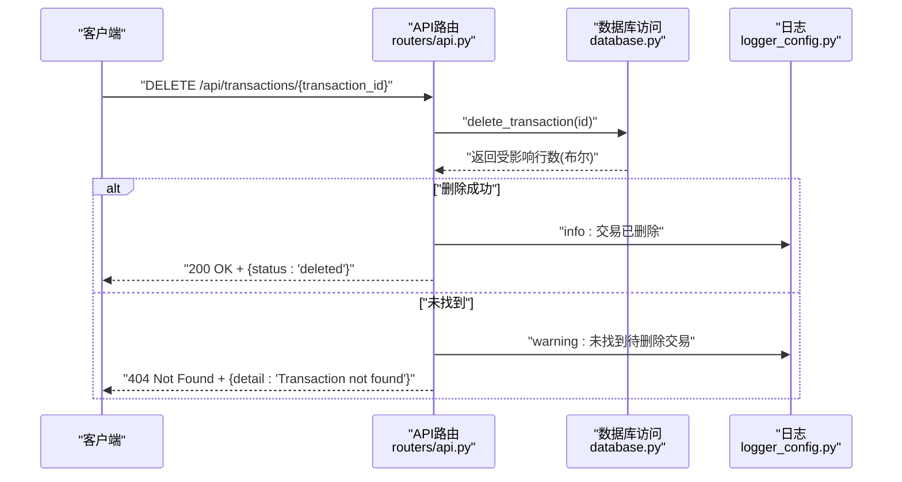
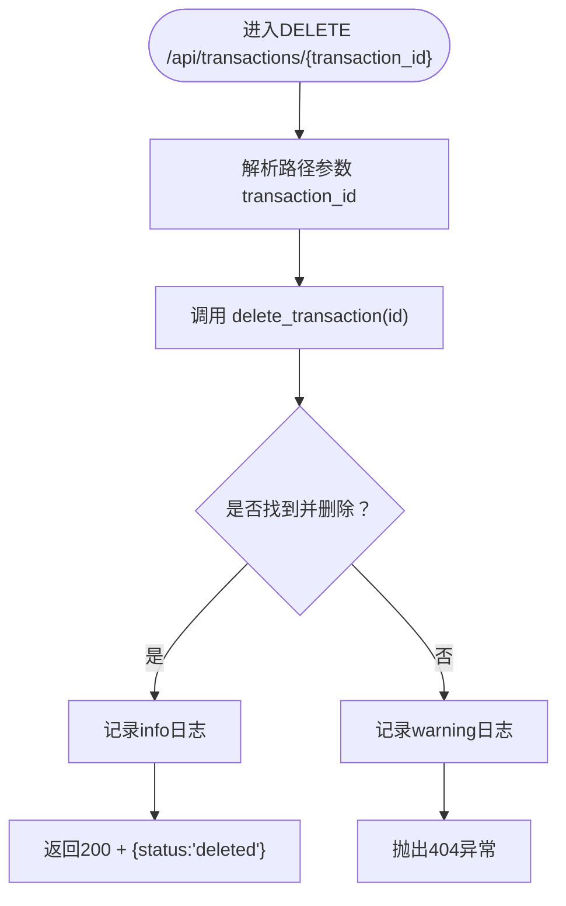
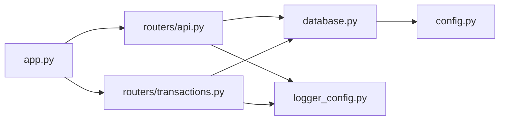

# CRUD操作API

<cite>
**本文引用的文件**
- [app.py](file://app.py)
- [routers/api.py](file://routers/api.py)
- [routers/transactions.py](file://routers/transactions.py)
- [database.py](file://database.py)
- [logger_config.py](file://logger_config.py)
- [config.py](file://config.py)
- [templates/transactions.html](file://templates/transactions.html)
</cite>

## 目录
1. [简介](#简介)
2. [项目结构](#项目结构)
3. [核心组件](#核心组件)
4. [架构总览](#架构总览)
5. [详细组件分析](#详细组件分析)
6. [依赖关系分析](#依赖关系分析)
7. [性能考量](#性能考量)
8. [故障排查指南](#故障排查指南)
9. [结论](#结论)
10. [附录](#附录)

## 简介
本文件为投资日志管理系统中“交易删除”（DELETE /transactions/{transaction_id}）API的完整接口文档。内容涵盖：
- 接口定义与请求/响应规范
- URL路径参数transaction_id的格式与校验规则
- 成功与失败响应状态码及语义
- 日志记录机制与安全注意事项
- 客户端调用最佳实践、错误处理与重试策略
- 删除操作对投资组合计算与数据一致性的潜在影响与保障

## 项目结构
系统采用FastAPI + SQLite的轻量级Web应用，核心模块如下：
- 应用入口与路由注册：app.py
- API路由：routers/api.py（包含DELETE /transactions/{transaction_id}）
- 交易页面路由：routers/transactions.py（用于网页端交易列表与新增）
- 数据访问层：database.py（事务增删改查、持有头寸计算等）
- 日志配置：logger_config.py
- 配置中心：config.py（数据库路径等）

图表来源
- [app.py](file://app.py#L13-L29)
- [routers/api.py](file://routers/api.py#L6-L66)
- [routers/transactions.py](file://routers/transactions.py#L1-L75)
- [database.py](file://database.py#L15-L188)
- [logger_config.py](file://logger_config.py#L14-L53)
- [config.py](file://config.py#L17-L24)

章节来源
- [app.py](file://app.py#L13-L29)
- [routers/api.py](file://routers/api.py#L6-L66)
- [routers/transactions.py](file://routers/transactions.py#L1-L75)
- [database.py](file://database.py#L15-L188)
- [logger_config.py](file://logger_config.py#L14-L53)
- [config.py](file://config.py#L17-L24)

## 核心组件
- 应用入口与生命周期
  - 启动时初始化数据库并记录日志
  - 挂载各路由模块
- API路由
  - /api 前缀下的REST接口，包含DELETE /transactions/{transaction_id}
- 数据访问层
  - 提供事务增删改查、持有头寸计算、历史汇总等
- 日志与配置
  - 统一日志配置（文件轮转、控制台输出）
  - 数据库存储路径配置（默认iCloud同步目录）

章节来源
- [app.py](file://app.py#L13-L29)
- [routers/api.py](file://routers/api.py#L6-L66)
- [database.py](file://database.py#L15-L188)
- [logger_config.py](file://logger_config.py#L14-L53)
- [config.py](file://config.py#L17-L24)

## 架构总览
下图展示DELETE /transactions/{transaction_id}的端到端调用链路与关键参与者。

图表来源
- [routers/api.py](file://routers/api.py#L59-L66)
- [database.py](file://database.py#L316-L324)
- [logger_config.py](file://logger_config.py#L14-L53)

## 详细组件分析

### DELETE /transactions/{transaction_id} 接口
- 方法与路径
  - 方法：DELETE
  - 路径：/api/transactions/{transaction_id}
  - 路由前缀：/api
- 请求参数
  - 路径参数：transaction_id（整型）
- 响应
  - 成功：200 OK，JSON对象包含状态字段
  - 失败：404 Not Found，JSON对象包含错误详情
- 行为说明
  - 调用数据库层删除指定ID的交易记录
  - 记录成功或失败的日志
  - 未找到时抛出HTTP异常

图表来源
- [routers/api.py](file://routers/api.py#L59-L66)
- [database.py](file://database.py#L316-L324)
- [logger_config.py](file://logger_config.py#L14-L53)

章节来源
- [routers/api.py](file://routers/api.py#L59-L66)

### URL路径参数 transaction_id 的格式与校验规则
- 类型与范围
  - 类型：整型（int）
  - 取值范围：正整数（SQLite主键自增）
- FastAPI自动校验
  - FastAPI会尝试将路径参数转换为整型；若无法转换，将直接返回422 Unprocessable Entity（在当前路由签名中未显式声明类型约束的情况下）
- 建议的客户端约束
  - 仅传递正整数ID
  - 对于不存在的ID，服务器将返回404
- 数据库约束
  - 事务表主键为自增整数，确保唯一性与连续性（删除后不复用）

章节来源
- [routers/api.py](file://routers/api.py#L59-L66)
- [database.py](file://database.py#L28-L48)

### 成功与失败响应状态码
- 成功
  - 状态码：200 OK
  - 响应体：包含状态字段的对象
- 失败
  - 状态码：404 Not Found
  - 响应体：包含错误详情的对象
- 日志记录
  - 成功：info级别
  - 失败：warning级别

章节来源
- [routers/api.py](file://routers/api.py#L62-L66)
- [logger_config.py](file://logger_config.py#L14-L53)

### 日志记录机制与安全考虑
- 日志配置
  - 文件轮转：按午夜滚动，保留7天
  - 控制台输出：便于开发调试
- 安全要点
  - 不在日志中泄露敏感信息（当前实现未包含敏感字段）
  - 建议：生产环境限制日志级别，避免在高并发场景下产生过多IO
- 与删除相关的日志
  - 成功删除：记录删除ID
  - 未找到：记录ID并标记warning

章节来源
- [logger_config.py](file://logger_config.py#L14-L53)
- [routers/api.py](file://routers/api.py#L62-L66)

### 客户端调用最佳实践、错误处理与重试策略
- 最佳实践
  - 先确认交易存在再发起删除请求
  - 在UI上增加二次确认对话框
  - 使用幂等性设计：重复删除同一ID应保持一致结果（当前实现非幂等，但不会造成破坏性后果）
- 错误处理
  - 200：删除成功
  - 404：交易不存在
  - 422：路径参数类型不匹配（FastAPI自动返回）
- 重试策略
  - 404：无需重试
  - 5xx：建议指数退避重试
  - 422：修正参数后重试

章节来源
- [templates/transactions.html](file://templates/transactions.html#L82-L89)
- [routers/api.py](file://routers/api.py#L59-L66)

### 事务删除对投资组合计算与数据一致性的影响
- 投资组合计算
  - 持有头寸通过聚合交易表计算，删除交易会直接影响头寸统计
  - 影响字段：总份额、成本基础、平均成本等
- 数据一致性
  - 单条删除操作在单连接内执行，提交后即持久化
  - 无外键约束的级联删除，删除不会影响其他表
- 建议
  - 删除前评估对收益/损失、分拆/调整等的影响
  - 如需撤销，可重新录入相同交易（注意时间戳与顺序）

章节来源
- [database.py](file://database.py#L381-L427)

## 依赖关系分析
- 组件耦合
  - API路由依赖数据库层
  - 日志模块被API与页面路由共享
  - 配置模块被数据库层使用
- 外部依赖
  - FastAPI（路由与HTTP异常）
  - SQLite（本地存储）
  - Python标准库（logging、sqlite3等）

图表来源
- [app.py](file://app.py#L13-L29)
- [routers/api.py](file://routers/api.py#L6-L66)
- [routers/transactions.py](file://routers/transactions.py#L1-L75)
- [database.py](file://database.py#L15-L188)
- [logger_config.py](file://logger_config.py#L14-L53)
- [config.py](file://config.py#L17-L24)

章节来源
- [app.py](file://app.py#L13-L29)
- [routers/api.py](file://routers/api.py#L6-L66)
- [routers/transactions.py](file://routers/transactions.py#L1-L75)
- [database.py](file://database.py#L15-L188)
- [logger_config.py](file://logger_config.py#L14-L53)
- [config.py](file://config.py#L17-L24)

## 性能考量
- 删除操作复杂度
  - 单表删除，索引覆盖主键，时间复杂度近似O(1)
- 并发与锁
  - SQLite在写入时加锁，建议避免高频连续删除
- 投资组合计算
  - 头寸聚合查询在删除后立即生效，适合小规模数据
  - 若交易量大，建议定期维护索引与统计表

## 故障排查指南
- 常见问题
  - 404：transaction_id不存在或类型不正确
  - 422：路径参数无法解析为整数
  - 5xx：数据库连接或写入异常
- 排查步骤
  - 检查日志（info/warning）
  - 验证ID是否存在
  - 确认数据库文件可写
- 修复建议
  - 修正ID或类型
  - 重试请求（幂等性不保证，谨慎使用）

章节来源
- [routers/api.py](file://routers/api.py#L59-L66)
- [logger_config.py](file://logger_config.py#L14-L53)

## 结论
DELETE /transactions/{transaction_id}是一个简洁高效的单条记录删除接口。其行为明确、日志完备，并与持有头寸计算紧密关联。建议在生产环境中配合严格的ID校验与二次确认机制，以确保数据安全与一致性。

## 附录
- 相关接口参考
  - GET /api/transactions：查询交易列表（用于确认ID存在）
  - GET /api/holdings：查看当前持有头寸（删除后验证变化）
- 前端集成示例（参考模板中的删除脚本）
  - 网页端通过fetch触发DELETE，成功后刷新页面

章节来源
- [routers/api.py](file://routers/api.py#L18-L31)
- [templates/transactions.html](file://templates/transactions.html#L82-L89)