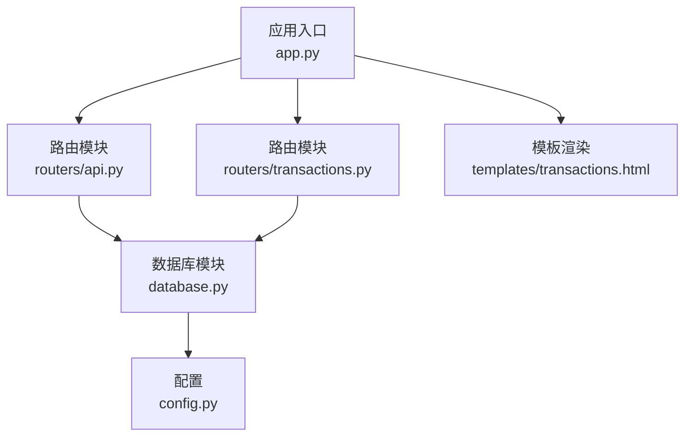
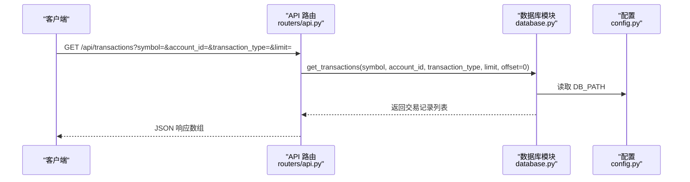
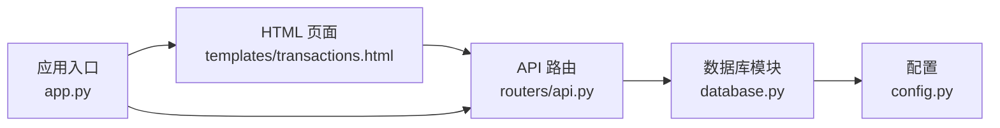

# 交易记录API

<cite>
**本文引用的文件**
- [app.py](file://app.py)
- [routers/api.py](file://routers/api.py)
- [routers/transactions.py](file://routers/transactions.py)
- [database.py](file://database.py)
- [config.py](file://config.py)
- [templates/transactions.html](file://templates/transactions.html)
</cite>

## 目录
1. [简介](#简介)
2. [项目结构](#项目结构)
3. [核心组件](#核心组件)
4. [架构总览](#架构总览)
5. [详细组件分析](#详细组件分析)
6. [依赖关系分析](#依赖关系分析)
7. [性能考量](#性能考量)
8. [故障排查指南](#故障排查指南)
9. [结论](#结论)
10. [附录](#附录)

## 简介
本文件为投资日志管理系统中“交易记录API”的完整接口文档，聚焦于 GET /api/transactions 端点。内容涵盖：
- 查询参数详解：symbol（股票代码）、account_id（账户ID）、transaction_type（交易类型）、limit（数量限制）
- 交易类型枚举值与含义
- 返回数据结构说明（时间戳、数量、价格、手续费等字段）
- 过滤条件组合使用示例与分页处理方案
- 排序规则与时间范围查询方法
- 与前端页面及数据库层的交互关系

## 项目结构
该系统采用 FastAPI + SQLite 的轻量级架构，路由通过模块化组织，数据库操作集中在单个模块中，便于统一维护与扩展。

图表来源
- [app.py](file://app.py#L13-L29)
- [routers/api.py](file://routers/api.py#L6-L6)
- [routers/transactions.py](file://routers/transactions.py#L8-L8)
- [database.py](file://database.py#L12-L12)
- [config.py](file://config.py#L17-L23)

章节来源
- [app.py](file://app.py#L13-L29)
- [routers/api.py](file://routers/api.py#L6-L6)
- [routers/transactions.py](file://routers/transactions.py#L8-L8)
- [database.py](file://database.py#L12-L12)
- [config.py](file://config.py#L17-L23)

## 核心组件
- 应用入口与路由注册：在应用启动时初始化数据库并注册各路由模块。
- API 路由：提供 /api/transactions 端点，支持按条件过滤与分页。
- 数据库层：提供事务查询、计数、删除等操作；定义交易表结构与约束。
- 前端页面：提供交易列表页面与分页导航，调用 /api/transactions 删除接口。

章节来源
- [app.py](file://app.py#L13-L29)
- [routers/api.py](file://routers/api.py#L18-L31)
- [database.py](file://database.py#L294-L341)
- [templates/transactions.html](file://templates/transactions.html#L82-L88)

## 架构总览
GET /api/transactions 的请求处理流程如下：

图表来源
- [routers/api.py](file://routers/api.py#L18-L31)
- [database.py](file://database.py#L294-L341)
- [config.py](file://config.py#L17-L23)

## 详细组件分析

### 端点定义与参数说明
- 端点路径：GET /api/transactions
- 功能：根据可选参数过滤交易记录，并返回指定数量的记录列表
- 默认行为：未传入参数时返回最近的记录，默认 limit=100

查询参数
- symbol（股票代码）
  - 类型：字符串
  - 作用：筛选特定股票/资产的交易
  - 处理：在数据库层转换为大写进行匹配
  - 示例：symbol=AAPL
- account_id（账户ID）
  - 类型：字符串
  - 作用：筛选特定账户下的交易
  - 示例：account_id=ACC001
- transaction_type（交易类型）
  - 类型：字符串
  - 作用：筛选特定类型的交易
  - 取值：详见下节“交易类型枚举”
  - 示例：transaction_type=BUY
- limit（数量限制）
  - 类型：整数
  - 作用：限制返回记录数量
  - 默认值：100
  - 示例：limit=50

返回数据结构
- 数组元素为交易记录对象，字段包括但不限于：
  - transaction_date：交易日期（YYYY-MM-DD）
  - transaction_time：交易时间（可选）
  - symbol：股票代码
  - transaction_type：交易类型
  - asset_type：资产类型
  - quantity：数量
  - price：价格
  - total_amount：总金额
  - commission：手续费
  - currency：货币
  - account_id：账户ID
  - account_name：账户名称（可选）
  - notes：备注（可选）
  - tags：标签（可选）
  - created_at：创建时间
  - updated_at：更新时间

章节来源
- [routers/api.py](file://routers/api.py#L18-L31)
- [database.py](file://database.py#L294-L341)

### 交易类型枚举与含义
数据库层定义了交易类型的约束，允许值包括：
- BUY：买入
- SELL：卖出
- DIVIDEND：股息
- SPLIT：拆分
- TRANSFER_IN：转入
- TRANSFER_OUT：转出
- ADJUST：调整
- INCOME：收入

这些类型用于区分不同业务场景，例如买入/卖出用于买卖股票，DIVIDEND 用于记录分红，SPLIT 用于记录股票拆分，TRANSFER_IN/TRANSFER_OUT 用于账户间转账，ADJUST 用于资产价值调整，INCOME 用于记录现金流入。

章节来源
- [database.py](file://database.py#L34-L34)

### 过滤条件组合与时间范围查询
- 组合使用
  - 可同时传入多个过滤参数以缩小结果集
  - 例如：同时指定 account_id 和 transaction_type，仅返回该账户下指定类型的交易
- 时间范围查询
  - 当前 API 实现不直接暴露 start_date/end_date/year 参数
  - 如需按时间范围过滤，请参考数据库层提供的 get_transactions 支持的参数（year/start_date/end_date），或在客户端自行处理
- 排序规则
  - 默认按交易日期降序、主键降序排列，确保最新记录优先展示

章节来源
- [routers/api.py](file://routers/api.py#L18-L31)
- [database.py](file://database.py#L294-L341)

### 分页处理方案
- 页面化策略
  - API 层未直接暴露 offset 参数，但数据库层支持 offset
  - 建议客户端通过 limit 控制每页数量，结合服务端默认排序进行滚动加载
- 前端页面分页
  - HTML 列表页面提供分页导航，内部通过 /api/transactions 删除接口进行删除操作
  - 前端页面的分页逻辑与 API 端点无直接耦合，可独立演进

章节来源
- [routers/api.py](file://routers/api.py#L18-L31)
- [templates/transactions.html](file://templates/transactions.html#L53-L80)

### 数据库层实现要点
- 表结构与索引
  - transactions 表包含多种字段，涵盖交易日期、时间、股票代码、类型、数量、价格、总金额、手续费、货币、账户ID等
  - 已建立多列索引以提升查询性能（symbol、date、account_id、type、currency、asset_type）
- 查询实现
  - get_transactions 支持 symbol、account_id、transaction_type、currency、year、start_date、end_date、limit、offset
  - 使用 ORDER BY transaction_date DESC, id DESC 实现稳定排序
- 计数实现
  - get_transaction_count 提供与查询相同的过滤能力，用于计算总数

章节来源
- [database.py](file://database.py#L27-L151)
- [database.py](file://database.py#L294-L341)
- [database.py](file://database.py#L962-L996)

## 依赖关系分析

图表来源
- [routers/api.py](file://routers/api.py#L6-L6)
- [database.py](file://database.py#L12-L12)
- [templates/transactions.html](file://templates/transactions.html#L82-L88)
- [app.py](file://app.py#L13-L29)
- [config.py](file://config.py#L17-L23)

章节来源
- [routers/api.py](file://routers/api.py#L6-L6)
- [database.py](file://database.py#L12-L12)
- [templates/transactions.html](file://templates/transactions.html#L82-L88)
- [app.py](file://app.py#L13-L29)
- [config.py](file://config.py#L17-L23)

## 性能考量
- 索引优化
  - 已建立多列索引，建议在高频查询字段上保持合理索引策略
- 查询复杂度
  - 过滤条件越多，查询成本越高；建议优先使用高选择性字段（如 account_id、symbol）
- 分页与缓存
  - 对于频繁访问的查询，可在应用层增加缓存策略（如 Redis）以减少数据库压力
- 批量查询
  - 建议限制单次 limit 上限，避免一次性返回过多数据导致响应缓慢

## 故障排查指南
- 404 错误（删除交易）
  - 若调用 DELETE /api/transactions/{id} 返回 404，表示交易不存在
  - 建议先通过 GET /api/transactions 验证目标交易是否存在
- 参数无效
  - transaction_type 必须为允许值之一，否则数据库约束会拒绝插入/更新
  - symbol 会被转换为大写，注意大小写一致性
- 排序与分页
  - 若发现排序异常，确认是否正确传递了 limit 与 offset（当前 API 不直接暴露 offset）
- 数据库路径
  - 确认 DB_PATH 指向正确的 SQLite 文件，避免权限或路径问题

章节来源
- [routers/api.py](file://routers/api.py#L59-L66)
- [database.py](file://database.py#L34-L34)
- [config.py](file://config.py#L17-L23)

## 结论
GET /api/transactions 提供了灵活的交易记录查询能力，支持按股票代码、账户ID、交易类型与数量限制进行过滤。配合数据库层的索引与约束，能够满足日常的投资记录管理需求。对于更复杂的分页与时间范围查询，建议结合数据库层的完整参数集或在客户端进行二次处理。

## 附录

### API 定义概览
- 方法：GET
- 路径：/api/transactions
- 查询参数：
  - symbol（可选）
  - account_id（可选）
  - transaction_type（可选）
  - limit（可选，默认100）

返回：交易记录数组（JSON）

章节来源
- [routers/api.py](file://routers/api.py#L18-L31)

### 交易类型枚举对照
- BUY：买入
- SELL：卖出
- DIVIDEND：股息
- SPLIT：拆分
- TRANSFER_IN：转入
- TRANSFER_OUT：转出
- ADJUST：调整
- INCOME：收入

章节来源
- [database.py](file://database.py#L34-L34)

### 数据模型字段说明
- transaction_date：交易日期
- transaction_time：交易时间
- symbol：股票代码
- transaction_type：交易类型
- asset_type：资产类型
- quantity：数量
- price：价格
- total_amount：总金额
- commission：手续费
- currency：货币
- account_id：账户ID
- account_name：账户名称
- notes：备注
- tags：标签
- created_at：创建时间
- updated_at：更新时间

章节来源
- [database.py](file://database.py#L29-L47)