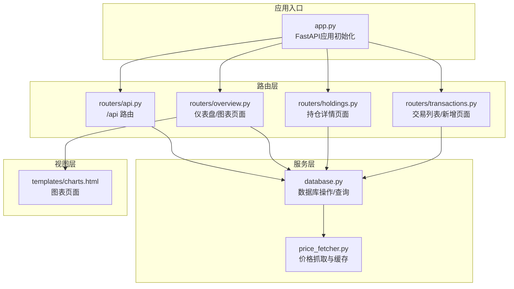
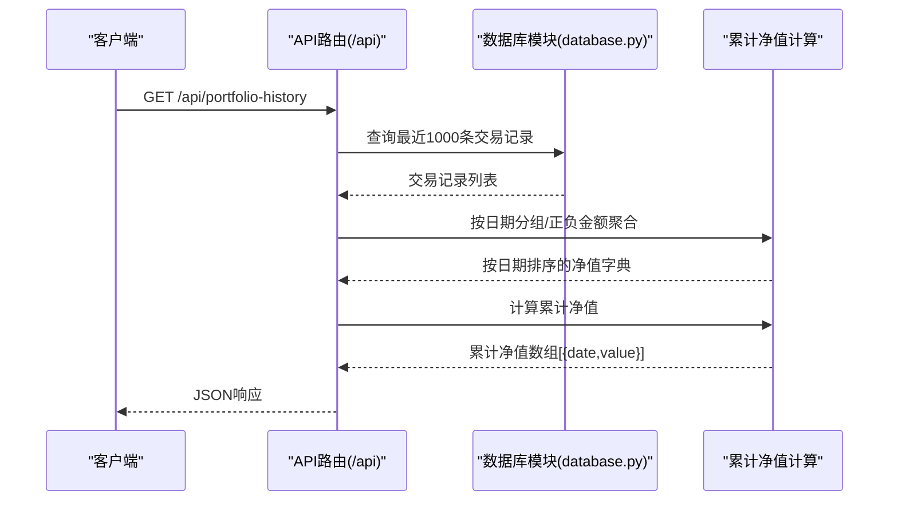
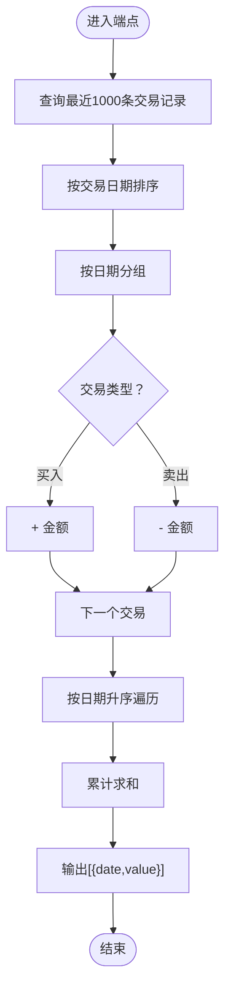
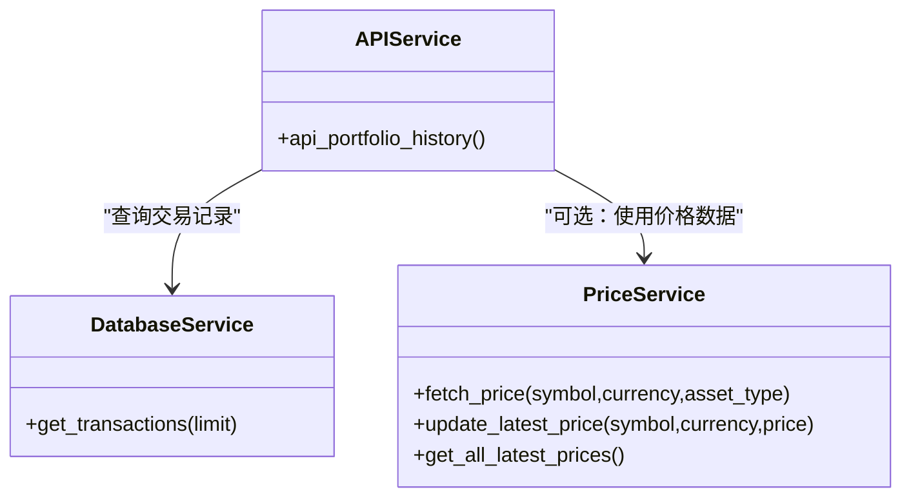
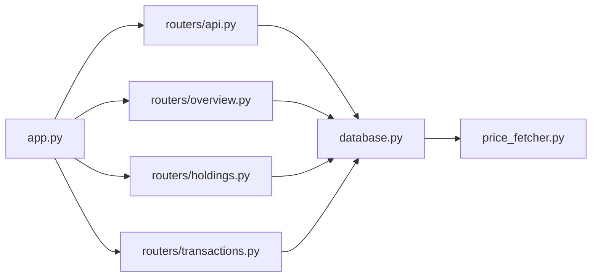

# 投资组合API

<cite>
**本文引用的文件**
- [app.py](file://app.py)
- [routers/api.py](file://routers/api.py)
- [database.py](file://database.py)
- [price_fetcher.py](file://price_fetcher.py)
- [templates/charts.html](file://templates/charts.html)
- [requirements.txt](file://requirements.txt)
</cite>

## 目录
1. [简介](#简介)
2. [项目结构](#项目结构)
3. [核心组件](#核心组件)
4. [架构总览](#架构总览)
5. [详细组件分析](#详细组件分析)
6. [依赖关系分析](#依赖关系分析)
7. [性能考量](#性能考量)
8. [故障排查指南](#故障排查指南)
9. [结论](#结论)
10. [附录](#附录)

## 简介
本文件为投资日志管理系统的“投资组合API”接口文档，重点聚焦于/get/portfolio-history端点，用于获取投资组合在时间维度上的累计价值变化曲线。该端点通过交易记录中的买入/卖出金额进行正负加减聚合，并以日期升序输出累计净值序列，便于前端图表展示与分析。

## 项目结构
系统采用FastAPI作为后端框架，使用SQLite作为本地存储，模板引擎用于渲染网页。API路由集中在routers子模块，数据库操作封装在database.py中，价格抓取逻辑在price_fetcher.py中。

**图表来源**
- [app.py](file://app.py#L13-L29)
- [routers/api.py](file://routers/api.py#L6-L67)
- [database.py](file://database.py#L15-L188)
- [price_fetcher.py](file://price_fetcher.py#L325-L402)
- [templates/charts.html](file://templates/charts.html#L1-L104)

**章节来源**
- [app.py](file://app.py#L13-L29)
- [routers/api.py](file://routers/api.py#L6-L67)
- [database.py](file://database.py#L15-L188)

## 核心组件
- FastAPI应用与路由挂载：在应用启动时初始化数据库并挂载各路由模块。
- API路由模块：提供/get/portfolio-history端点，负责聚合交易数据并返回累计净值序列。
- 数据库模块：提供交易查询、资产类型、账户、价格表等基础能力；为API提供数据支撑。
- 价格抓取模块：提供多数据源的价格获取与缓存能力，供持有分析与图表展示使用。

**章节来源**
- [app.py](file://app.py#L13-L29)
- [routers/api.py](file://routers/api.py#L6-L67)
- [database.py](file://database.py#L15-L188)
- [price_fetcher.py](file://price_fetcher.py#L325-L402)

## 架构总览
/get/portfolio-history端点的数据流如下：
- 客户端请求 /api/portfolio-history
- 后端路由调用数据库查询最近1000条交易记录
- 对交易按日期分组，买入金额计入正值，卖出金额计入负值
- 按日期升序累加，生成累计净值序列
- 返回JSON数组，每个元素包含日期与累计净值

**图表来源**
- [routers/api.py](file://routers/api.py#L33-L57)
- [database.py](file://database.py#L331-L378)

**章节来源**
- [routers/api.py](file://routers/api.py#L33-L57)
- [database.py](file://database.py#L331-L378)

## 详细组件分析

### /get/portfolio-history 端点
- 功能：返回投资组合在时间维度上的累计净值序列，用于图表展示。
- 请求方式：GET
- 请求路径：/api/portfolio-history
- 响应格式：数组，元素为对象，包含日期与累计净值字段
  - date：字符串或日期类型，表示交易日期
  - value：数值，表示该日累计净值
- 数据来源：数据库交易表的最近1000条记录
- 聚合逻辑：
  - 按交易日期分组
  - 买入交易：金额计入正值
  - 卖出交易：金额计入负值
  - 按日期升序累加，得到累计净值序列
- 默认数据量：1000条（来自查询参数）
- 错误处理：无显式异常抛出，若无交易则返回空数组

**图表来源**
- [routers/api.py](file://routers/api.py#L33-L57)

**章节来源**
- [routers/api.py](file://routers/api.py#L33-L57)

### 数据模型与字段说明
- 交易记录字段（部分）：
  - transaction_date：交易日期
  - transaction_type：交易类型（如BUY/SELL等）
  - total_amount：总金额
- 返回历史数据字段：
  - date：日期
  - value：累计净值

注意：上述字段定义来源于数据库表结构与端点实现逻辑。

**章节来源**
- [database.py](file://database.py#L28-L48)
- [routers/api.py](file://routers/api.py#L33-L57)

### 与其他组件的关系
- 与数据库模块的关系：端点直接调用交易查询函数，获取交易记录并进行聚合。
- 与价格抓取模块的关系：当前端点不依赖实时价格，仅使用交易金额进行累计；但系统具备价格抓取与缓存能力，可用于更复杂的估值分析（例如基于市价的净值计算）。

**图表来源**
- [routers/api.py](file://routers/api.py#L33-L57)
- [database.py](file://database.py#L331-L378)
- [price_fetcher.py](file://price_fetcher.py#L325-L402)

**章节来源**
- [routers/api.py](file://routers/api.py#L33-L57)
- [database.py](file://database.py#L331-L378)
- [price_fetcher.py](file://price_fetcher.py#L325-L402)

## 依赖关系分析
- 应用启动：FastAPI应用在启动事件中初始化数据库。
- 路由挂载：将各业务路由模块挂载到应用上。
- API路由：/api前缀下提供投资组合历史、交易、持仓等接口。
- 数据库：提供交易查询、资产类型、账户、价格表等能力。
- 价格抓取：提供多数据源价格获取与缓存，支持图表展示与估值分析。

**图表来源**
- [app.py](file://app.py#L13-L29)
- [routers/api.py](file://routers/api.py#L6-L67)
- [database.py](file://database.py#L15-L188)
- [price_fetcher.py](file://price_fetcher.py#L325-L402)

**章节来源**
- [app.py](file://app.py#L13-L29)
- [routers/api.py](file://routers/api.py#L6-L67)
- [database.py](file://database.py#L15-L188)
- [price_fetcher.py](file://price_fetcher.py#L325-L402)

## 性能考量
- 默认数据量限制：端点查询默认限制为1000条交易记录，避免一次性加载过多数据导致响应缓慢。
- 时间复杂度：聚合过程为O(n)，其中n为交易数量；排序与累计均为线性或近似线性。
- 数据库索引：已建立按symbol、date、account、type、currency、asset_type等索引，有助于查询优化。
- 建议：
  - 若需要更长的历史曲线，可在前端或调用方控制请求频率与分页策略。
  - 如需基于市价的净值计算，可结合价格抓取模块与持有分析，但需注意价格获取的网络开销与缓存命中率。
  - 对于高频图表刷新，建议前端做缓存与增量更新策略。

**章节来源**
- [routers/api.py](file://routers/api.py#L36-L57)
- [database.py](file://database.py#L179-L186)

## 故障排查指南
- 端点无数据返回：
  - 检查是否存在交易记录；若无交易，返回空数组属正常行为。
  - 确认数据库连接与初始化是否成功。
- 日期顺序异常：
  - 确保交易日期字段格式正确且可排序。
- 金额方向错误：
  - 确认交易类型为BUY/SELL，且金额字段为total_amount。
- 性能问题：
  - 检查数据库索引是否生效。
  - 调整limit参数或分页策略。
- 价格相关问题：
  - 若后续扩展为基于市价的净值计算，检查价格抓取模块可用性与缓存更新。

**章节来源**
- [routers/api.py](file://routers/api.py#L33-L57)
- [database.py](file://database.py#L179-L186)
- [price_fetcher.py](file://price_fetcher.py#L325-L402)

## 结论
/get/portfolio-history端点通过简洁的聚合逻辑，将交易记录转换为累计净值序列，满足图表展示与分析需求。其默认限制与现有索引设计兼顾了性能与实用性。若需进一步增强分析能力，可结合价格抓取与持有分析模块，构建更丰富的投资组合视图。

## 附录

### 接口定义
- 方法：GET
- 路径：/api/portfolio-history
- 查询参数：无
- 响应：数组，元素为对象，包含date与value字段
- 默认数据量：1000条（来自查询参数）

**章节来源**
- [routers/api.py](file://routers/api.py#L33-L57)

### 数据量与性能建议
- 默认限制：1000条交易记录
- 建议：前端按需请求、缓存结果、分页或时间窗口切片
- 数据库优化：确保相关索引存在并合理使用

**章节来源**
- [routers/api.py](file://routers/api.py#L36-L57)
- [database.py](file://database.py#L179-L186)

### 图表数据准备最佳实践
- 前端接收数组后，按日期升序绘制折线图
- 可叠加多账户或多币种的累计净值曲线
- 对缺失日期进行插值或空值处理，保证曲线连续性
- 使用缓存减少重复请求，提高交互流畅度

**章节来源**
- [templates/charts.html](file://templates/charts.html#L56-L96)

### 前端集成建议
- 使用fetch或axios请求 /api/portfolio-history
- 将返回的数组映射为图表库（如Chart.js）所需格式
- 在仪表盘或图表页面中展示累计净值曲线
- 提供时间范围选择器，配合后端查询参数扩展

**章节来源**
- [templates/charts.html](file://templates/charts.html#L56-L96)

### 实际投资组合分析场景示例
- 场景一：评估某账户自建仓以来的累计收益变化
  - 步骤：调用 /api/portfolio-history 获取累计净值序列，绘制折线图
- 场景二：对比不同账户在同一时间段内的表现
  - 步骤：分别请求各账户的历史数据，叠加在同一图表中
- 场景三：结合市价计算真实市值曲线
  - 步骤：使用价格抓取模块与持有分析模块，计算按市价的净值序列，再与累计金额曲线对比

**章节来源**
- [price_fetcher.py](file://price_fetcher.py#L325-L402)
- [database.py](file://database.py#L381-L427)