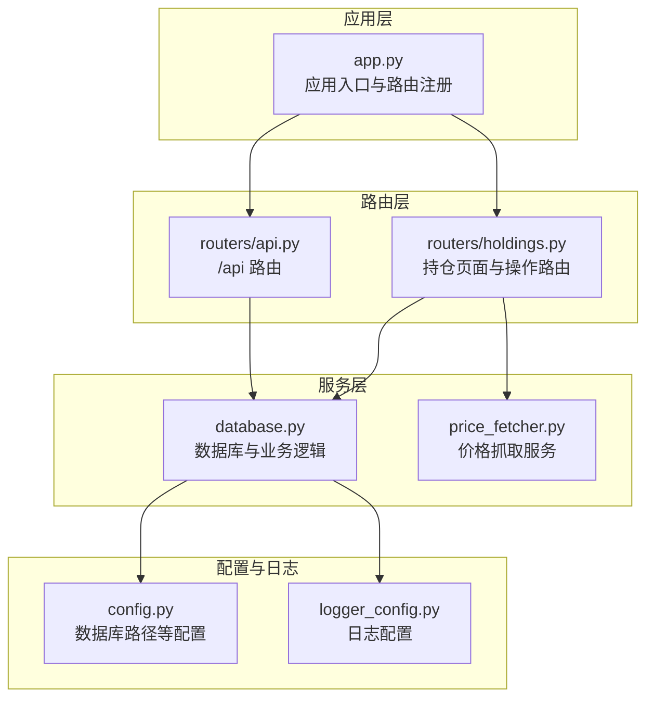
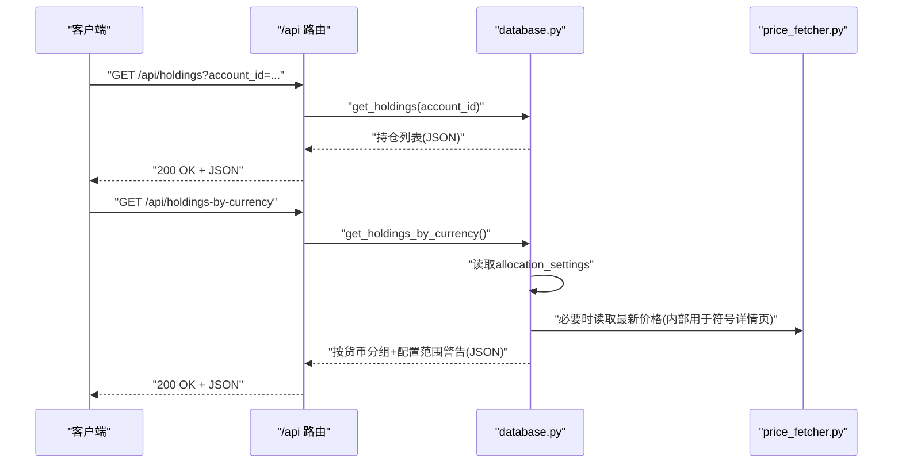
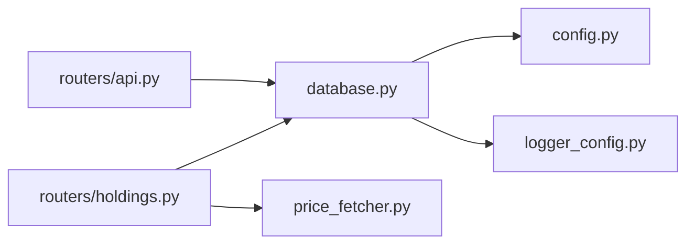
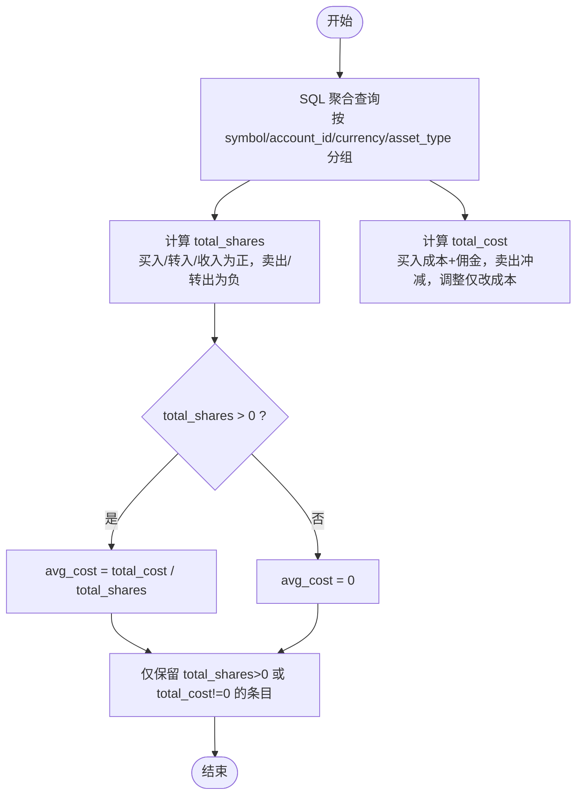

# 持仓相关API

<cite>
**本文引用的文件**
- [app.py](file://app.py)
- [routers/api.py](file://routers/api.py)
- [routers/holdings.py](file://routers/holdings.py)
- [database.py](file://database.py)
- [price_fetcher.py](file://price_fetcher.py)
- [config.py](file://config.py)
- [logger_config.py](file://logger_config.py)
- [templates/holdings.html](file://templates/holdings.html)
</cite>

## 目录
1. [简介](#简介)
2. [项目结构](#项目结构)
3. [核心组件](#核心组件)
4. [架构总览](#架构总览)
5. [详细组件分析](#详细组件分析)
6. [依赖关系分析](#依赖关系分析)
7. [性能考量](#性能考量)
8. [故障排查指南](#故障排查指南)
9. [结论](#结论)
10. [附录](#附录)

## 简介
本文件面向投资日志管理系统中与“持仓”相关的API，重点覆盖以下两个核心端点：
- GET /api/holdings：按账户维度返回当前持仓明细（可选 account_id 过滤）
- GET /api/holdings-by-currency：按货币分组显示持仓，并包含资产配置范围警告

文档将详细说明参数使用方法、返回的数据结构、货币分组逻辑、计算规则、多币种支持与汇率转换机制、请求示例、响应格式、错误处理以及最佳实践。

## 项目结构
系统采用 FastAPI 应用，通过路由器模块化组织业务接口；数据库操作集中在 database.py 中；价格抓取由 price_fetcher.py 提供；配置与日志分别在 config.py 和 logger_config.py 中定义。

图表来源
- [app.py](file://app.py#L13-L29)
- [routers/api.py](file://routers/api.py#L6-L16)
- [routers/holdings.py](file://routers/holdings.py#L1-L11)
- [database.py](file://database.py#L12-L151)
- [price_fetcher.py](file://price_fetcher.py#L1-L21)
- [config.py](file://config.py#L17-L23)
- [logger_config.py](file://logger_config.py#L14-L53)

章节来源
- [app.py](file://app.py#L13-L29)

## 核心组件
- API 路由器：提供 /api/holdings 与 /api/holdings-by-currency 两个端点，返回 JSON 数据。
- 数据库模块：封装交易、账户、价格、资产类型、配置设置等查询与写入逻辑。
- 价格抓取模块：支持多数据源（AKShare、Yahoo Finance、新浪、腾讯）自动回退。
- 配置与日志：统一数据库路径、日志轮转策略。

章节来源
- [routers/api.py](file://routers/api.py#L6-L16)
- [database.py](file://database.py#L344-L390)
- [database.py](file://database.py#L732-L785)
- [price_fetcher.py](file://price_fetcher.py#L325-L401)
- [config.py](file://config.py#L17-L23)
- [logger_config.py](file://logger_config.py#L14-L53)

## 架构总览
下图展示从客户端到数据库与价格服务的整体调用链路。

图表来源
- [routers/api.py](file://routers/api.py#L8-L16)
- [database.py](file://database.py#L344-L390)
- [database.py](file://database.py#L732-L785)
- [price_fetcher.py](file://price_fetcher.py#L325-L401)

## 详细组件分析

### GET /api/holdings
- 功能：返回当前持仓明细，支持按 account_id 过滤。
- 请求参数
  - account_id: 可选字符串，过滤指定账户的持仓
- 返回结构
  - 数组，每个元素代表一个持仓条目，字段包括：
    - symbol: 证券代码
    - account_id: 账户ID
    - currency: 币种（CNY/USD/HKD）
    - asset_type: 资产类型（stock/bond/metal/cash）
    - total_shares: 持有数量（含买入、转入、收入等正向累计，卖出、转出等负向累计后的净额）
    - total_cost: 成本金额（含买入成本+佣金，卖出冲减）
    - avg_cost: 平均成本 = total_cost / total_shares（当 total_shares>0 时）
- 计算逻辑
  - 按 symbol/account_id/currency/asset_type 分组
  - 买入/转入/收入：增加持有量与成本
  - 卖出/转出：减少持有量与成本
  - 调整：仅影响成本金额
  - 仅返回 total_shares>0 或 total_cost!=0 的条目
- 错误处理
  - 参数非法或查询异常会由底层数据库抛出异常，FastAPI 默认返回 500；若需更细粒度控制可在路由层捕获并返回 4xx/5xx。
- 使用建议
  - 若需要按账户聚合，传入 account_id；否则返回全量持仓
  - 结合 /api/holdings-by-currency 获取资产配置概览

章节来源
- [routers/api.py](file://routers/api.py#L8-L11)
- [database.py](file://database.py#L344-L390)

### GET /api/holdings-by-currency
- 功能：按货币分组显示持仓，并对每种资产类型检查配置范围警告。
- 请求参数：无
- 返回结构
  - 对象，键为币种（CNY/USD/HKD），值包含：
    - total: 该币种下的总成本
    - allocations: 该币种下各资产类型的统计与警告
      - asset_type: 资产类型代码
      - label: 资产类型中文标签
      - amount: 该资产类型在该币种下的成本金额
      - percent: 占该币种总成本的比例（百分比）
      - min_percent/max_percent: 配置的最小/最大比例
      - warning: 配置范围警告文本（低于最小或高于最大时出现）
- 配置范围警告逻辑
  - 从 allocation_settings 表读取每种币种-资产类型的 min_percent/max_percent
  - 计算 percent = amount / total * 100
  - 当 percent < min_percent 或 percent > max_percent 时生成 warning
- 多币种支持与汇率转换
  - 该端点返回的是成本金额（以币种计），不进行跨币种汇率换算
  - 若需跨币种汇总，应在上层应用自行根据实时汇率换算后合并
- 错误处理
  - 同样由底层数据库异常导致的错误默认返回 500

章节来源
- [routers/api.py](file://routers/api.py#L13-L16)
- [database.py](file://database.py#L732-L785)
- [database.py](file://database.py#L674-L730)

### 与前端页面的关系
虽然这两个端点返回 JSON，但系统也提供了 HTML 页面用于展示持仓详情与交互操作：
- HTML 页面：/holdings（返回按币种-符号分组的持仓详情，包含未实现的 P&L 计算与百分比）
- 价格更新与快速交易：通过 POST 接口完成，内部调用数据库与价格抓取模块

章节来源
- [routers/holdings.py](file://routers/holdings.py#L13-L30)
- [templates/holdings.html](file://templates/holdings.html#L15-L96)

## 依赖关系分析

图表来源
- [routers/api.py](file://routers/api.py#L1-L6)
- [routers/holdings.py](file://routers/holdings.py#L1-L9)
- [database.py](file://database.py#L12-L151)
- [price_fetcher.py](file://price_fetcher.py#L1-L21)
- [config.py](file://config.py#L17-L23)
- [logger_config.py](file://logger_config.py#L14-L53)

## 性能考量
- 查询优化
  - 交易表已建立多索引（symbol/date/account/type/currency/asset_type），有利于按条件过滤与排序
  - 持仓计算使用 SQL 聚合，避免在 Python 层做大量循环
- 数据库连接
  - 每次查询新建连接并在关闭，适合轻量并发；如需高并发可考虑连接池
- 价格抓取
  - fetch_price 支持多数据源回退，失败时记录日志并返回错误信息
  - 建议在上层缓存最近价格，避免频繁调用外部服务

章节来源
- [database.py](file://database.py#L142-L148)
- [price_fetcher.py](file://price_fetcher.py#L325-L401)

## 故障排查指南
- 404 删除交易
  - DELETE /api/transactions/{id}：若交易不存在，返回 404 并在日志中记录
- 价格更新失败
  - POST /holdings/update-price：失败时记录失败日志并重定向带错误消息
  - POST /holdings/manual-update-price：成功后记录日志并重定向带成功消息
- 日志定位
  - 日志目录 logs，按天轮转，保留 7 天
  - 关键日志包括价格抓取尝试、失败原因、操作日志等

章节来源
- [routers/api.py](file://routers/api.py#L59-L66)
- [routers/holdings.py](file://routers/holdings.py#L102-L147)
- [routers/holdings.py](file://routers/holdings.py#L149-L176)
- [logger_config.py](file://logger_config.py#L14-L53)

## 结论
- /api/holdings 提供灵活的账户级持仓明细，适合前端或外部系统集成
- /api/holdings-by-currency 提供资产配置概览与范围警告，便于快速评估投资组合健康度
- 系统具备良好的扩展性：新增资产类型、币种、价格源均可通过配置与数据库表扩展
- 建议在生产环境结合连接池、缓存与更完善的错误处理

## 附录

### 请求与响应示例

- GET /api/holdings
  - 请求示例：GET /api/holdings?account_id=ACC001
  - 响应示例（数组）：
    - [
        {
          "symbol": "AAPL",
          "account_id": "ACC001",
          "currency": "USD",
          "asset_type": "stock",
          "total_shares": 10.0,
          "total_cost": 15000.0,
          "avg_cost": 1500.0
        },
        ...
      ]

- GET /api/holdings-by-currency
  - 请求示例：GET /api/holdings-by-currency
  - 响应示例（对象）：
    - {
        "CNY": {
          "total": 100000.0,
          "allocations": [
            {
              "asset_type": "stock",
              "label": "股票",
              "amount": 60000.0,
              "percent": 60.0,
              "min_percent": 0.0,
              "max_percent": 100.0,
              "warning": null
            },
            {
              "asset_type": "bond",
              "label": "债券",
              "amount": 20000.0,
              "percent": 20.0,
              "min_percent": 10.0,
              "max_percent": 30.0,
              "warning": "低于最小配置 10%"
            },
            ...
          ]
        },
        ...
      }

### 数据模型与计算逻辑

图表来源
- [database.py](file://database.py#L344-L390)

### 最佳实践建议
- 在上层应用中：
  - 缓存最近价格，降低对外部服务依赖
  - 跨币种汇总前先获取实时汇率，再统一折算
  - 对于高频查询，考虑连接池与分页
- 在系统维护方面：
  - 定期检查 allocation_settings 的合理性
  - 利用 operation_logs 与日志追踪关键操作
  - 对于价格抓取失败，建议人工介入并记录原因