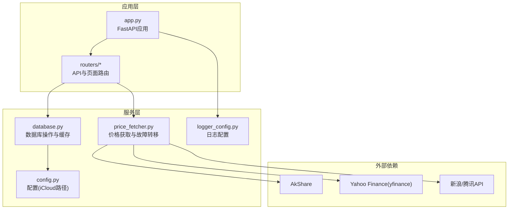
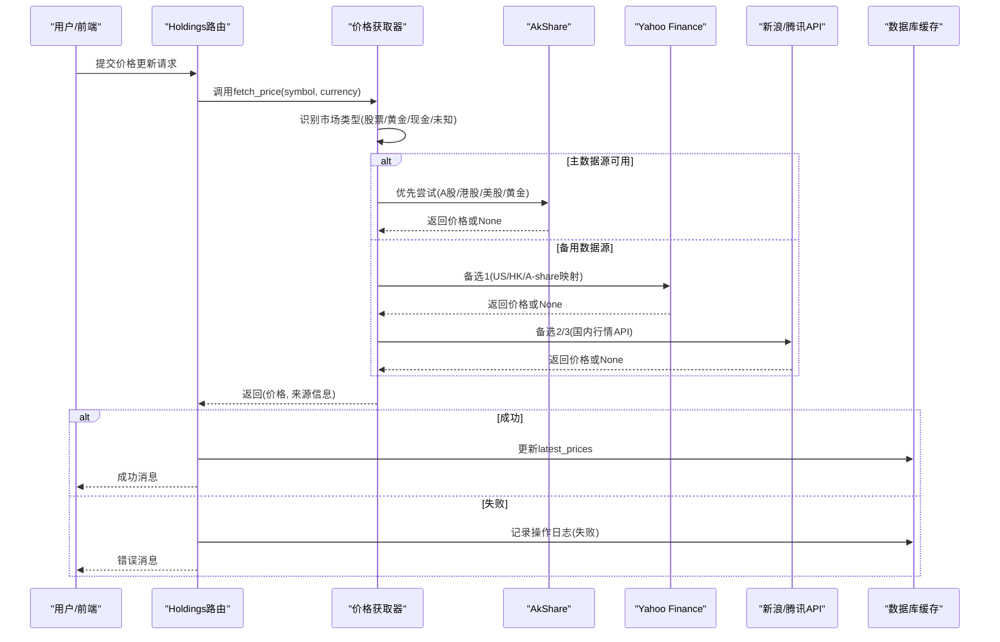
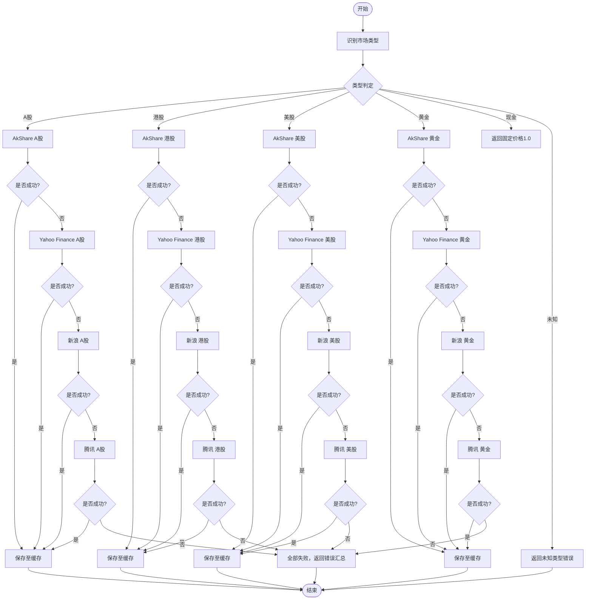
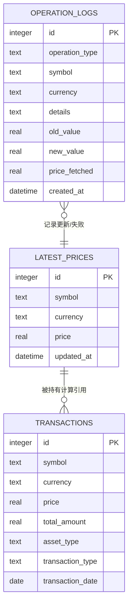
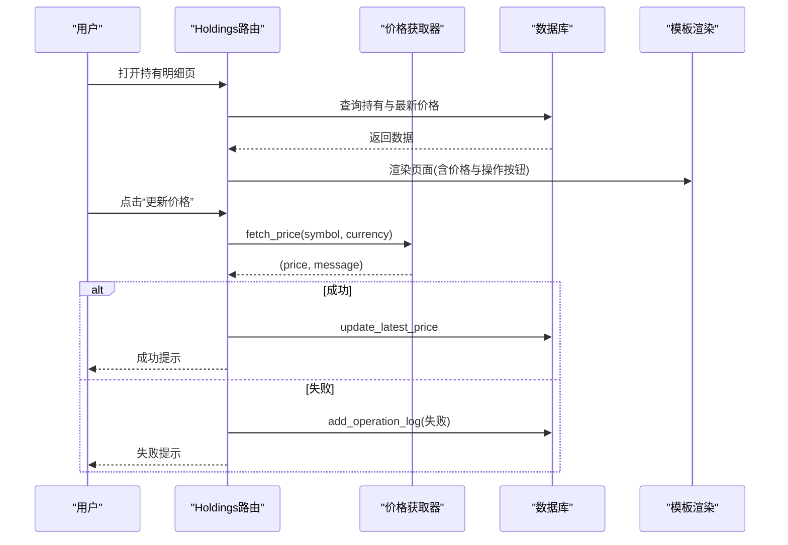
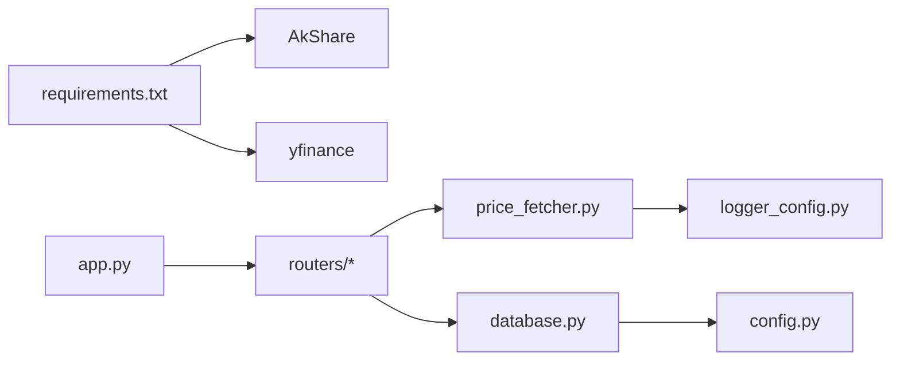

# 价格获取系统

<cite>
**本文引用的文件列表**
- [app.py](file://app.py)
- [price_fetcher.py](file://price_fetcher.py)
- [database.py](file://database.py)
- [config.py](file://config.py)
- [logger_config.py](file://logger_config.py)
- [requirements.txt](file://requirements.txt)
- [routers/api.py](file://routers/api.py)
- [routers/holdings.py](file://routers/holdings.py)
</cite>

## 目录
1. [简介](#简介)
2. [项目结构](#项目结构)
3. [核心组件](#核心组件)
4. [架构总览](#架构总览)
5. [详细组件分析](#详细组件分析)
6. [依赖关系分析](#依赖关系分析)
7. [性能与优化](#性能与优化)
8. [故障排查与监控](#故障排查与监控)
9. [结论](#结论)
10. [附录：扩展新数据源开发指南](#附录扩展新数据源开发指南)

## 简介
本系统为“投资日志管理系统”的价格获取子系统，负责从多数据源自动抓取A股、港股、美股、黄金等金融产品价格，并在主数据源不可用时进行自动故障转移。系统通过本地SQLite数据库缓存最新价格，结合Web接口提供手动更新与批量更新能力，并记录完整操作日志以便审计与排障。

## 项目结构
- 应用入口与路由：FastAPI应用启动、静态资源挂载、路由注册
- 价格获取模块：多数据源抓取、故障转移、价格解析与返回
- 数据库模块：交易、账户、资产类型、最新价格、操作日志等表结构与查询
- 配置模块：数据库路径（默认iCloud）与环境变量覆盖
- 日志模块：按日轮转的日志配置
- 路由器：Web接口，提供持有明细页面、价格更新、交易快速录入等

图表来源
- [app.py](file://app.py#L1-L34)
- [routers/holdings.py](file://routers/holdings.py#L1-L207)
- [price_fetcher.py](file://price_fetcher.py#L1-L405)
- [database.py](file://database.py#L1-L151)
- [config.py](file://config.py#L1-L24)
- [logger_config.py](file://logger_config.py#L1-L54)

章节来源
- [app.py](file://app.py#L1-L34)
- [routers/holdings.py](file://routers/holdings.py#L1-L207)
- [price_fetcher.py](file://price_fetcher.py#L1-L405)
- [database.py](file://database.py#L1-L151)
- [config.py](file://config.py#L1-L24)
- [logger_config.py](file://logger_config.py#L1-L54)

## 核心组件
- 价格获取器：根据符号与币种识别市场类型，按优先级调用多个数据源，返回价格与来源信息
- 数据库缓存：latest_prices表存储最新价格，支持唯一键冲突更新；提供批量读取用于组合计算
- Web接口：持有明细页、价格手动/自动更新、快速交易录入
- 操作日志：记录每次价格更新与失败原因，便于审计与监控
- 配置与日志：统一数据库路径与日志输出

章节来源
- [price_fetcher.py](file://price_fetcher.py#L325-L401)
- [database.py](file://database.py#L834-L884)
- [routers/holdings.py](file://routers/holdings.py#L102-L176)
- [logger_config.py](file://logger_config.py#L1-L54)
- [config.py](file://config.py#L1-L24)

## 架构总览
系统采用“Web路由 -> 价格获取器 -> 多数据源 -> 数据库缓存”的分层架构。价格获取器内置故障转移逻辑，确保在主数据源不可用时自动切换到备用数据源。数据库层提供latest_prices表作为缓存，避免重复抓取；同时通过operation_logs记录每次价格更新结果，便于问题定位。

图表来源
- [routers/holdings.py](file://routers/holdings.py#L102-L176)
- [price_fetcher.py](file://price_fetcher.py#L325-L401)
- [database.py](file://database.py#L838-L858)

## 详细组件分析

### 价格获取器（多数据源与故障转移）
- 市场类型识别：基于符号格式与币种判断A股、港股、美股、黄金、现金、债券等
- 数据源优先级：
  1) AkShare（主）：A股、港股、美股、黄金基准
  2) Yahoo Finance：US/HK/A-share映射
  3) 新浪/腾讯API：国内行情备份
- 故障转移流程：依次尝试各数据源，遇到异常或无数据则记录并继续下一个；全部失败则汇总错误信息返回
- 返回值：(价格, 来源信息)，若失败则返回None与错误摘要

图表来源
- [price_fetcher.py](file://price_fetcher.py#L325-L401)
- [price_fetcher.py](file://price_fetcher.py#L353-L381)

章节来源
- [price_fetcher.py](file://price_fetcher.py#L36-L66)
- [price_fetcher.py](file://price_fetcher.py#L73-L133)
- [price_fetcher.py](file://price_fetcher.py#L140-L189)
- [price_fetcher.py](file://price_fetcher.py#L196-L257)
- [price_fetcher.py](file://price_fetcher.py#L264-L318)
- [price_fetcher.py](file://price_fetcher.py#L325-L401)

### 数据库与缓存（latest_prices）
- 表结构：latest_prices(symbol, currency, price, updated_at)，唯一约束(symbol, currency)
- 写入策略：INSERT ... ON CONFLICT(唯一键) DO UPDATE，保证幂等性与时间戳更新
- 读取策略：单条查询与批量查询(get_all_latest_prices)，用于组合计算与展示
- 与其他模块协作：持有明细计算使用latest_prices中的价格，实现未实现收益等指标

图表来源
- [database.py](file://database.py#L130-L140)
- [database.py](file://database.py#L838-L883)
- [database.py](file://database.py#L115-L128)

章节来源
- [database.py](file://database.py#L838-L858)
- [database.py](file://database.py#L861-L883)
- [database.py](file://database.py#L393-L463)

### Web接口与工作流
- 持有明细页：展示按币种与符号分组的持仓、市值、未实现损益与百分比
- 价格更新：支持自动抓取与手动输入两种方式，均写入latest_prices并记录operation_logs
- 快速交易：直接在持有页发起买入/卖出等交易，联动现金交易（可选）

图表来源
- [routers/holdings.py](file://routers/holdings.py#L13-L30)
- [routers/holdings.py](file://routers/holdings.py#L102-L176)
- [price_fetcher.py](file://price_fetcher.py#L325-L401)
- [database.py](file://database.py#L838-L858)

章节来源
- [routers/holdings.py](file://routers/holdings.py#L13-L30)
- [routers/holdings.py](file://routers/holdings.py#L102-L176)
- [routers/api.py](file://routers/api.py#L1-L67)

## 依赖关系分析
- 运行时依赖：FastAPI、Uvicorn、Jinja2、python-multipart、AkShare
- 数据源依赖：AkShare（主）、yfinance（备选）、HTTP API（新浪/腾讯）
- 组件耦合：
  - 路由器依赖价格获取器与数据库模块
  - 价格获取器依赖日志模块与第三方库
  - 数据库模块依赖配置模块与日志模块

图表来源
- [requirements.txt](file://requirements.txt#L1-L6)
- [app.py](file://app.py#L1-L34)
- [routers/holdings.py](file://routers/holdings.py#L1-L207)
- [price_fetcher.py](file://price_fetcher.py#L1-L405)
- [database.py](file://database.py#L1-L151)
- [logger_config.py](file://logger_config.py#L1-L54)
- [config.py](file://config.py#L1-L24)

章节来源
- [requirements.txt](file://requirements.txt#L1-L6)
- [app.py](file://app.py#L1-L34)

## 性能与优化
- 缓存策略
  - 使用latest_prices表缓存最新价格，避免重复抓取
  - get_all_latest_prices提供批量读取，减少多次查询开销
- 并发与超时
  - HTTP抓取设置超时（约10秒），防止阻塞
  - 各数据源独立尝试，缩短整体等待时间
- 批量更新建议
  - 可在业务侧按需批量触发价格更新（例如定时任务或批量页面）
  - 对于大量符号，建议分批并发抓取并合并结果，再统一入库
- 数据库索引
  - 已建立常用查询索引，有助于交易查询与持有计算
- 实时同步
  - 当前为按需抓取与手动触发；如需实时，可在定时任务中周期性拉取热点标的

[本节为通用性能讨论，无需特定文件来源]

## 故障排查与监控
- 日志查看
  - 日志按日轮转，保留7天；可通过日志定位数据源失败原因
- 操作日志
  - operation_logs记录每次价格更新与失败详情，便于回溯
- 常见问题
  - AkShare/yfinance不可用：检查网络与依赖安装
  - 国内API解析失败：确认编码与字段位置
  - 价格为空：确认符号格式与币种匹配
- 排查步骤
  1) 查看日志目录中的app.log
  2) 在持有明细页执行“手动更新”，验证是否可写入缓存
  3) 使用API接口查询最新价格，核对返回值

章节来源
- [logger_config.py](file://logger_config.py#L1-L54)
- [database.py](file://database.py#L792-L831)
- [routers/holdings.py](file://routers/holdings.py#L102-L176)

## 结论
该价格获取系统以AkShare为主数据源，结合Yahoo Finance与国内API实现多数据源故障转移，通过数据库缓存latest_prices提升性能与稳定性。配合Web界面与操作日志，形成完整的“抓取-缓存-展示-审计”闭环。当前支持A股、港股、美股、黄金等主流资产类别，具备良好的扩展性与可维护性。

[本节为总结，无需特定文件来源]

## 附录：扩展新数据源开发指南
- 设计原则
  - 保持与现有接口一致：返回(价格, 来源信息)或(None, 错误信息)
  - 异常安全：捕获异常并记录日志，避免中断主流程
  - 符号标准化：尽量与现有detect_symbol_type规则兼容
- 开发步骤
  1) 新增数据源函数：参考现有akshare_*、yahoo_*、sina_*、tencent_*模式
  2) 在fetch_price的fetch_attempts中加入新数据源的尝试顺序
  3) 在templates或API中增加调用入口（可选）
  4) 单元测试：模拟网络与解析失败场景
- 最佳实践
  - 设置合理超时与重试次数
  - 统一编码处理（如GBK解码）
  - 记录详细日志，包含错误堆栈摘要
  - 避免硬编码URL，必要时使用配置项
  - 注意并发访问与速率限制

章节来源
- [price_fetcher.py](file://price_fetcher.py#L325-L401)
- [price_fetcher.py](file://price_fetcher.py#L73-L133)
- [price_fetcher.py](file://price_fetcher.py#L140-L189)
- [price_fetcher.py](file://price_fetcher.py#L196-L257)
- [price_fetcher.py](file://price_fetcher.py#L264-L318)