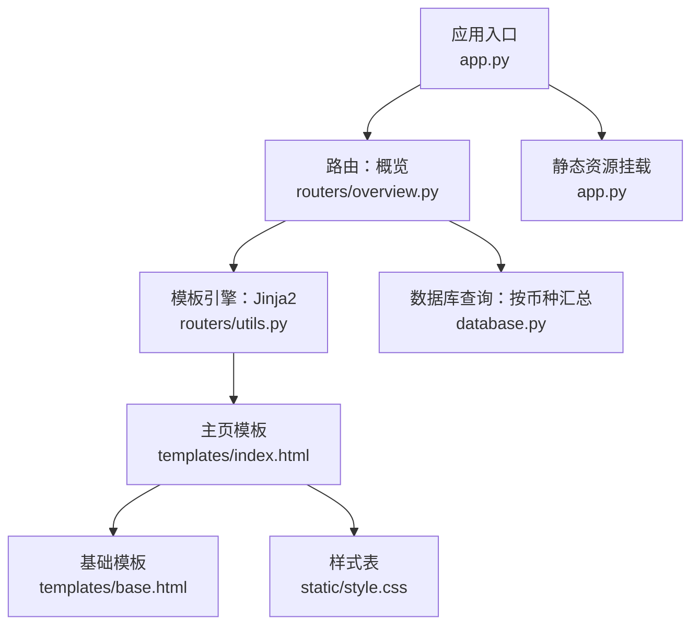
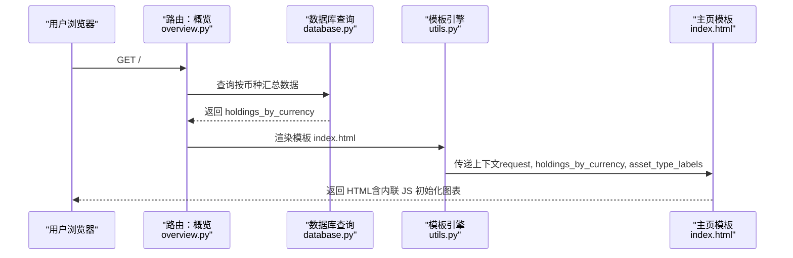
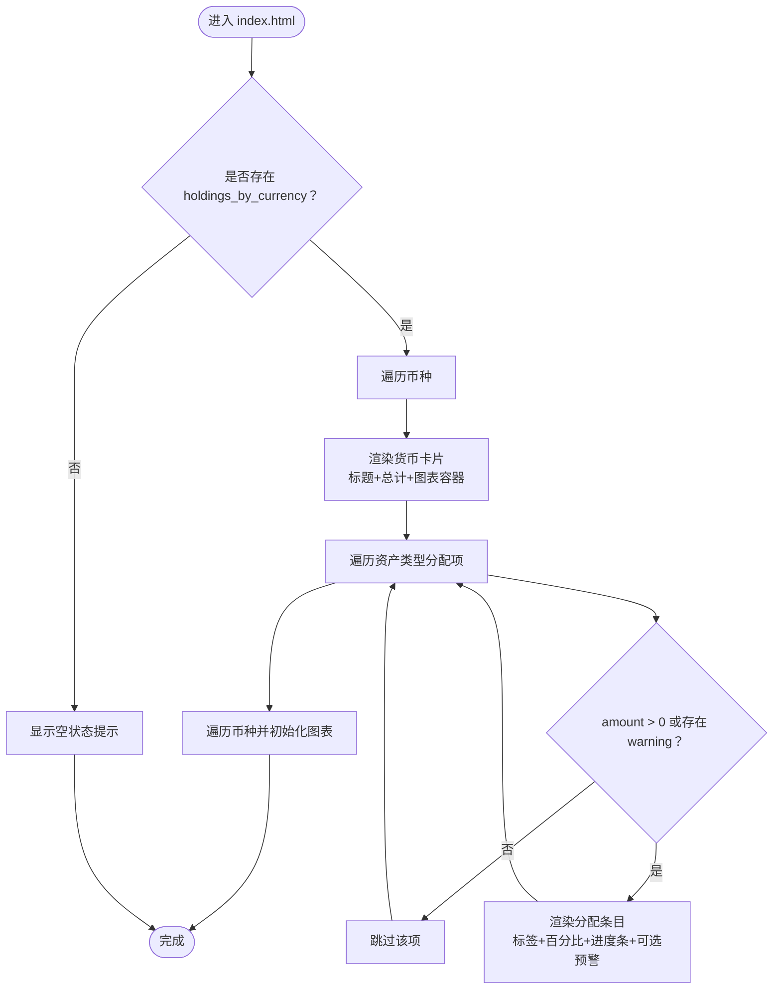
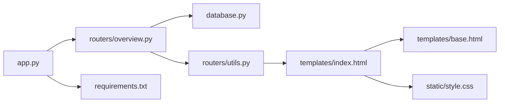

# 主页模板

<cite>
**本文引用的文件**
- [templates/index.html](file://templates/index.html)
- [templates/base.html](file://templates/base.html)
- [routers/overview.py](file://routers/overview.py)
- [routers/utils.py](file://routers/utils.py)
- [database.py](file://database.py)
- [app.py](file://app.py)
- [static/style.css](file://static/style.css)
- [config.py](file://config.py)
- [requirements.txt](file://requirements.txt)
</cite>

## 目录
1. [简介](#简介)
2. [项目结构](#项目结构)
3. [核心组件](#核心组件)
4. [架构总览](#架构总览)
5. [详细组件分析](#详细组件分析)
6. [依赖关系分析](#依赖关系分析)
7. [性能考量](#性能考量)
8. [故障排查指南](#故障排查指南)
9. [结论](#结论)
10. [附录](#附录)

## 简介
本文件为投资日志管理系统主页模板（index.html）的详细技术文档。目标是帮助开发者与使用者理解：
- 模板的功能定位与数据展示需求
- 投资组合概览信息的渲染方式
- 数据绑定模式、条件显示逻辑与循环处理机制
- 布局设计、信息层次结构与用户体验考虑
- 数据格式要求、错误处理与空值处理策略
- 模板定制指南与性能优化建议

## 项目结构
该系统采用 FastAPI + Jinja2 模板的后端渲染方案，主页通过路由返回 index.html，并由数据库查询结果驱动页面内容。

图表来源
- [app.py](file://app.py#L1-L34)
- [routers/overview.py](file://routers/overview.py#L1-L28)
- [routers/utils.py](file://routers/utils.py#L1-L4)
- [templates/index.html](file://templates/index.html#L1-L90)
- [templates/base.html](file://templates/base.html#L1-L27)
- [database.py](file://database.py#L732-L785)
- [static/style.css](file://static/style.css#L1-L800)

章节来源
- [app.py](file://app.py#L1-L34)
- [routers/overview.py](file://routers/overview.py#L1-L28)
- [routers/utils.py](file://routers/utils.py#L1-L4)
- [templates/index.html](file://templates/index.html#L1-L90)
- [templates/base.html](file://templates/base.html#L1-L27)
- [database.py](file://database.py#L732-L785)
- [static/style.css](file://static/style.css#L1-L800)

## 核心组件
- 路由器：负责接收请求并调用模板渲染，传入页面所需上下文数据。
- 模板引擎：使用 Jinja2 渲染 index.html。
- 数据层：提供按币种分组的投资组合汇总数据，包含资产类型占比与配置区间预警。
- 基础模板：提供导航栏、标题占位与全局样式脚本。
- 样式表：定义主页布局、卡片、图表容器与响应式网格等样式。

章节来源
- [routers/overview.py](file://routers/overview.py#L8-L17)
- [routers/utils.py](file://routers/utils.py#L1-L4)
- [database.py](file://database.py#L732-L785)
- [templates/base.html](file://templates/base.html#L1-L27)
- [static/style.css](file://static/style.css#L276-L376)

## 架构总览
主页请求从 FastAPI 路由进入，经数据库查询得到按币种分组的数据，再交由 Jinja2 模板渲染输出 HTML。模板内嵌 JavaScript 使用 Chart.js 绘制每个币种的资产类型饼图。

图表来源
- [routers/overview.py](file://routers/overview.py#L8-L17)
- [database.py](file://database.py#L732-L785)
- [routers/utils.py](file://routers/utils.py#L1-L4)
- [templates/index.html](file://templates/index.html#L48-L82)

## 详细组件分析

### 模板数据绑定与渲染流程
- 上下文变量
  - request：当前请求对象，用于基础模板高亮导航。
  - holdings_by_currency：按币种分组的汇总数据，包含每种资产类型的金额与百分比，以及配置区间预警。
  - asset_type_labels：资产类型标签映射，用于显示中文标签。
- 条件显示
  - 当存在 holdings_by_currency 时渲染货币卡片与图表；否则显示“暂无持仓”的空状态提示。
- 循环处理
  - 外层遍历币种，内层遍历该币种下的资产类型分配项。
  - 分配项仅在 amount > 0 或存在 warning 时显示，以避免空条目与冗余警告。
- 图表初始化
  - 将 holdings_by_currency 与 asset_type_labels 以 JSON 形式注入到页面脚本中。
  - 遍历每个币种，过滤出 amount > 0 的分配项，生成对应 Canvas 并初始化 Doughnut 图。

图表来源
- [templates/index.html](file://templates/index.html#L8-L82)

章节来源
- [templates/index.html](file://templates/index.html#L1-L90)

### 数据模型与格式要求
- holdings_by_currency 结构
  - 键：币种代码（如 CNY/USD/HKD）
  - 值：包含 total 与 allocations 的字典
    - total：该币种下所有资产的总成本
    - allocations：列表，元素为资产类型分配项
      - asset_type：资产类型代码（stock/bond/metal/cash）
      - label：资产类型中文标签
      - amount：该资产类型的总成本
      - percent：占该币种总成本的百分比
      - min_percent/max_percent：配置区间边界
      - warning：当占比低于或高于区间时的提示文本
- asset_type_labels
  - 映射资产类型代码到中文标签
- 渲染约束
  - 模板对币种货币符号进行条件渲染（CNY/USD/HK$），并在无数据时显示空状态链接

章节来源
- [database.py](file://database.py#L732-L785)
- [templates/index.html](file://templates/index.html#L8-L82)

### 布局设计与信息层次
- 页面结构
  - 导航栏：顶部固定，包含各页面链接，当前页自动高亮。
  - 主体内容：最大宽度限制、居中、内边距统一。
  - 货币卡片网格：自适应列数，每张卡片包含币种标题、总额、图表容器与分配列表。
- 信息层次
  - 一级标题：Portfolio Holdings
  - 二级标题：币种名称
  - 三级信息：总额、资产类型标签、百分比、进度条、配置区间范围、可选预警
- 响应式设计
  - 在小屏设备上，货币卡片与图表网格自动换行，表格与表单也相应调整间距与字体大小。

章节来源
- [templates/base.html](file://templates/base.html#L1-L27)
- [static/style.css](file://static/style.css#L276-L376)
- [static/style.css](file://static/style.css#L236-L275)

### 用户体验考虑
- 即时反馈：无持仓时提供“添加交易”引导链接，降低用户困惑。
- 视觉警示：当资产类型占比超出配置区间时，条目背景高亮并显示警告文本，便于快速识别风险。
- 可读性：百分比与进度条直观展示占比，中文标签提升可读性。
- 交互性：图表使用 Doughnut 类型，支持响应式与缩放，增强可视化体验。

章节来源
- [templates/index.html](file://templates/index.html#L84-L88)
- [templates/index.html](file://templates/index.html#L37-L39)
- [templates/index.html](file://templates/index.html#L63-L81)
- [static/style.css](file://static/style.css#L323-L376)

### 错误处理与空值处理
- 空数据分支
  - 当 holdings_by_currency 为空时，渲染空状态提示与引导链接。
- 过滤逻辑
  - 分配项仅在 amount > 0 或存在 warning 时显示，避免渲染无效条目。
- 安全性
  - 模板对货币符号进行安全的条件判断，防止未知币种导致异常。
- 前端健壮性
  - JS 初始化时先过滤 amount > 0 的分配项，避免空数据导致图表初始化失败。

章节来源
- [templates/index.html](file://templates/index.html#L8-L82)
- [templates/index.html](file://templates/index.html#L84-L88)

### 模板定制指南
- 自定义资产类型标签
  - 修改 asset_type_labels 映射，即可改变中文标签显示。
- 调整货币符号
  - 在模板中修改货币符号判断逻辑，适配更多币种。
- 改变图表样式
  - 调整颜色映射与 Chart.js 配置，如 legend 显示、响应式选项等。
- 扩展卡片布局
  - 在 CSS 中调整 .currency-charts 与 .currency-card 的网格与间距，适配不同屏幕尺寸。
- 添加新字段
  - 若需显示更多指标（如 P/L），可在数据库查询中扩展并传入模板上下文，然后在模板中渲染。

章节来源
- [templates/index.html](file://templates/index.html#L14-L16)
- [templates/index.html](file://templates/index.html#L50-L56)
- [templates/index.html](file://templates/index.html#L63-L81)
- [static/style.css](file://static/style.css#L276-L317)

## 依赖关系分析
- 应用启动与静态资源
  - 应用启动时初始化数据库，挂载静态文件目录，以便样式与脚本加载。
- 路由与模板
  - 概览路由负责查询数据并渲染 index.html，模板继承 base.html 并插入内容块。
- 数据查询
  - get_holdings_by_currency 提供按币种与资产类型分组的成本汇总，并计算占比与配置区间预警。
- 第三方库
  - Chart.js 用于绘制饼图，Jinja2 用于模板渲染。

图表来源
- [app.py](file://app.py#L15-L29)
- [routers/overview.py](file://routers/overview.py#L1-L28)
- [database.py](file://database.py#L732-L785)
- [routers/utils.py](file://routers/utils.py#L1-L4)
- [templates/index.html](file://templates/index.html#L1-L90)
- [templates/base.html](file://templates/base.html#L1-L27)
- [static/style.css](file://static/style.css#L1-L800)
- [requirements.txt](file://requirements.txt#L1-L6)

章节来源
- [app.py](file://app.py#L1-L34)
- [routers/overview.py](file://routers/overview.py#L1-L28)
- [database.py](file://database.py#L732-L785)
- [routers/utils.py](file://routers/utils.py#L1-L4)
- [templates/index.html](file://templates/index.html#L1-L90)
- [templates/base.html](file://templates/base.html#L1-L27)
- [static/style.css](file://static/style.css#L1-L800)
- [requirements.txt](file://requirements.txt#L1-L6)

## 性能考量
- 模板渲染开销
  - 模板仅进行简单的循环与条件判断，开销极低。
- 数据查询效率
  - get_holdings_by_currency 在数据库层面聚合成本与资产类型，减少 Python 层重复计算。
- 图表初始化
  - JS 仅在存在有效分配项时初始化图表，避免空数据场景的无效渲染。
- 静态资源
  - 样式与脚本通过静态文件服务提供，建议启用浏览器缓存与压缩（部署时）。
- 建议
  - 对于大量币种与资产类型的情况，可考虑前端分页或懒加载图表。
  - 若数据量增长，可在数据库层增加索引或物化视图以优化查询。

[本节为通用性能建议，不直接分析具体文件]

## 故障排查指南
- 页面空白或未渲染
  - 检查数据库是否初始化成功，确认 get_holdings_by_currency 是否返回数据。
  - 确认模板路径与模板引擎配置正确。
- 图表不显示
  - 检查 JS 注入的 holdings_by_currency 是否包含 amount > 0 的分配项。
  - 确认 Chart.js 已正确加载且 Canvas 元素存在。
- 导航高亮异常
  - 检查 request.url.path 与导航链接的匹配逻辑。
- 样式错乱
  - 确认静态文件挂载路径与样式文件路径一致，检查媒体查询断点设置。

章节来源
- [app.py](file://app.py#L15-L29)
- [routers/overview.py](file://routers/overview.py#L8-L17)
- [templates/base.html](file://templates/base.html#L14-L20)
- [templates/index.html](file://templates/index.html#L48-L82)
- [static/style.css](file://static/style.css#L256-L275)

## 结论
主页模板通过清晰的数据绑定与条件渲染，实现了投资组合按币种与资产类型的概览展示。模板继承基础布局，结合 CSS 网格与响应式设计，提供了良好的用户体验。配合数据库侧的聚合查询与前端图表初始化，整体具备较好的可维护性与扩展性。建议在生产环境中关注静态资源缓存与图表懒加载策略，以进一步提升性能。

[本节为总结性内容，不直接分析具体文件]

## 附录
- 关键实现位置参考
  - 模板渲染与上下文传递：[routers/overview.py](file://routers/overview.py#L8-L17)
  - 数据查询与汇总：[database.py](file://database.py#L732-L785)
  - 模板继承与内容块：[templates/base.html](file://templates/base.html#L1-L27)、[templates/index.html](file://templates/index.html#L1-L90)
  - 样式与响应式：[static/style.css](file://static/style.css#L276-L376)
  - 应用启动与静态资源挂载：[app.py](file://app.py#L15-L29)
  - 第三方依赖：[requirements.txt](file://requirements.txt#L1-L6)