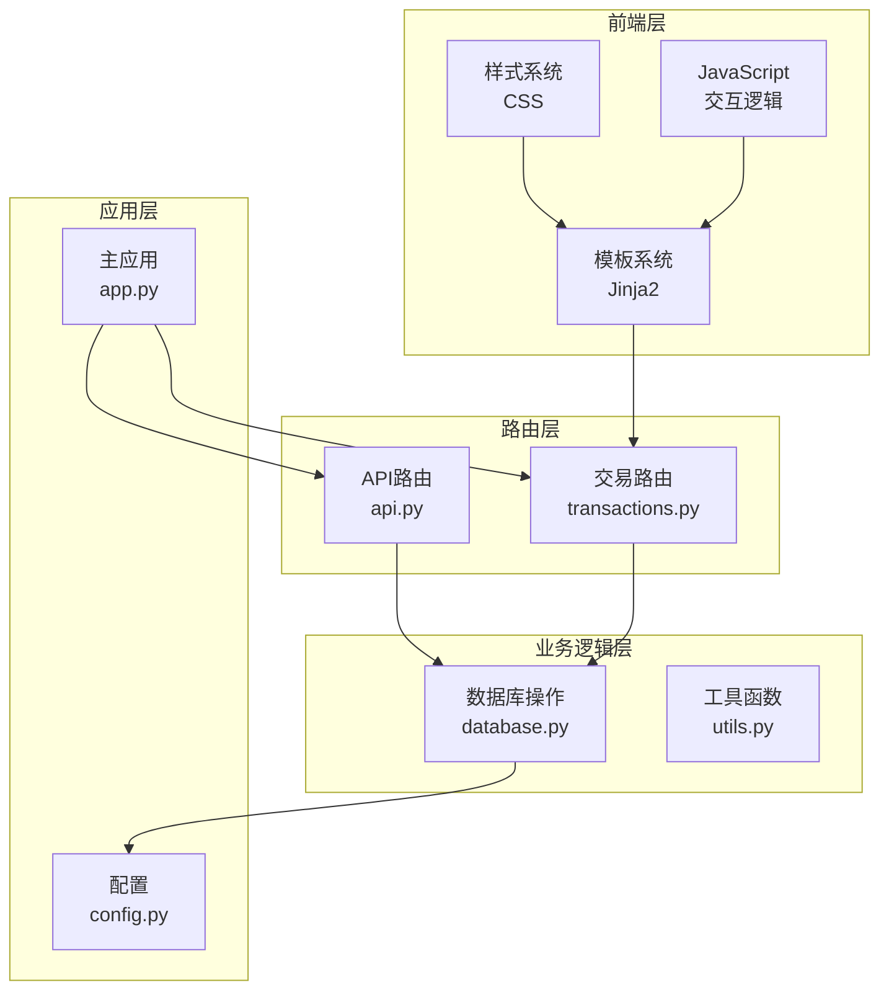
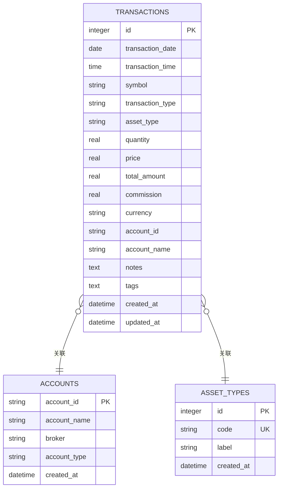
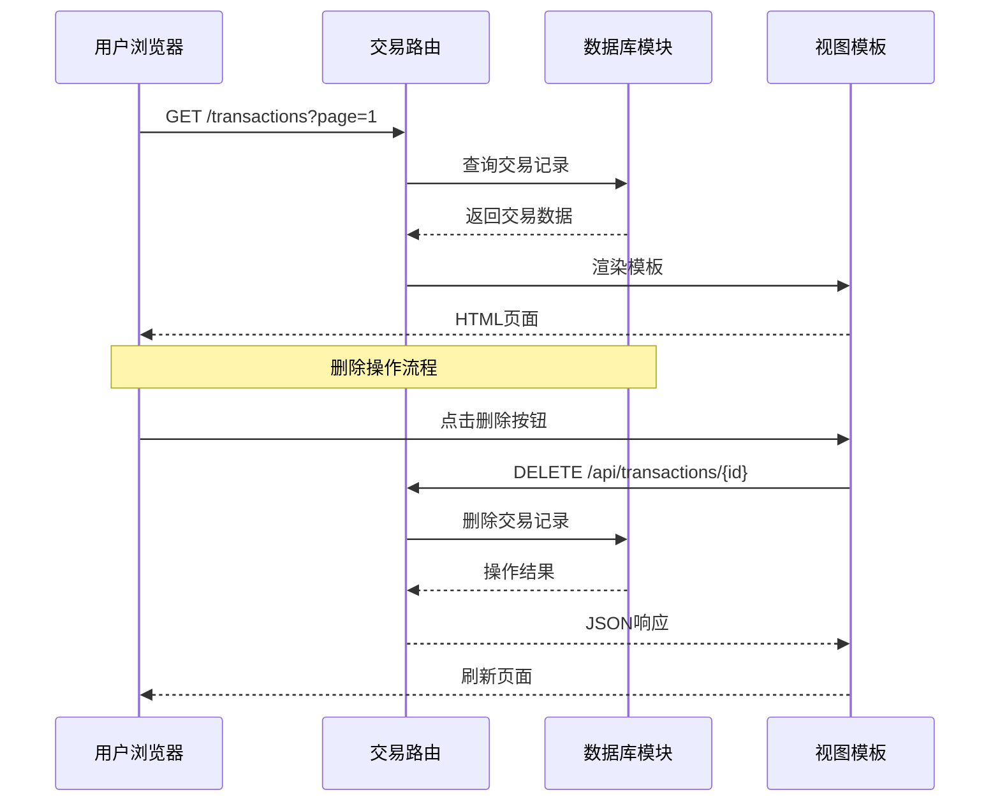
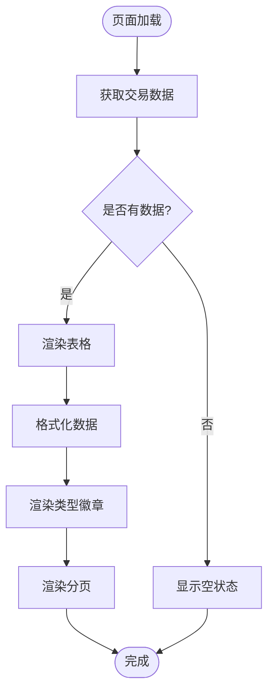
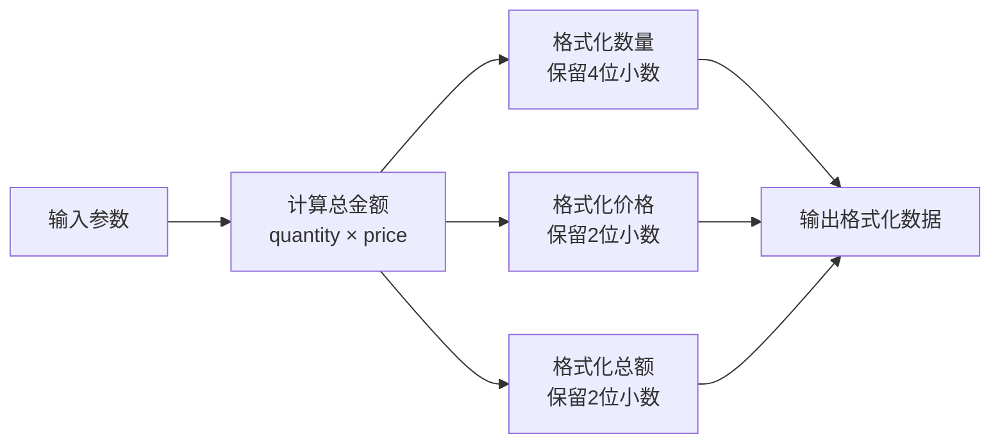
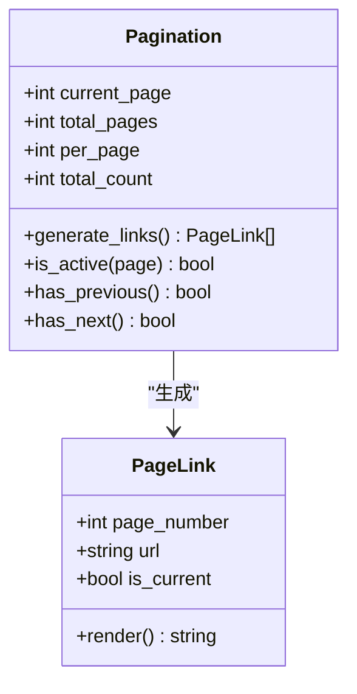
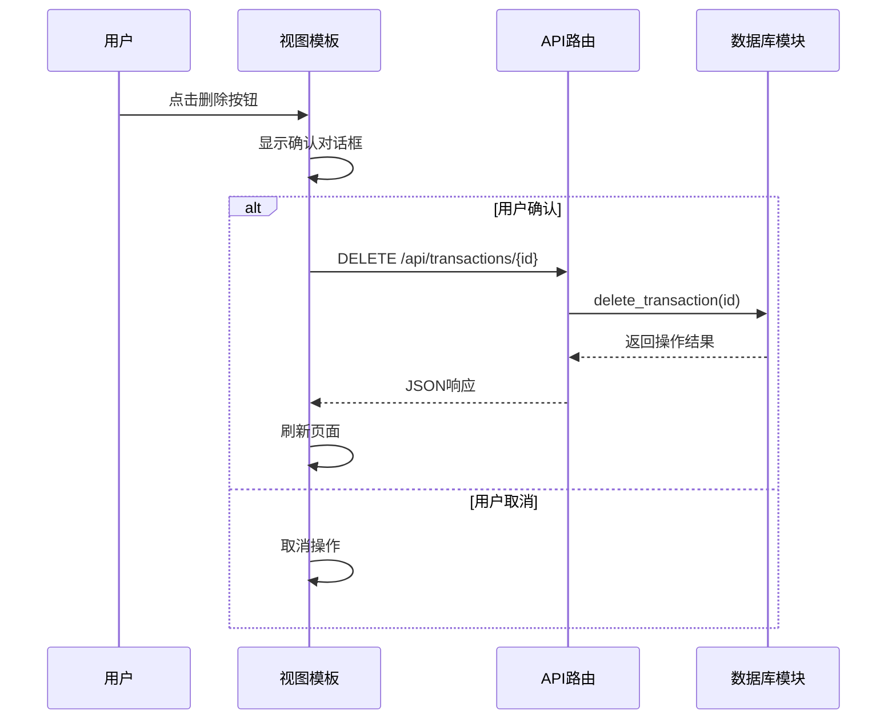
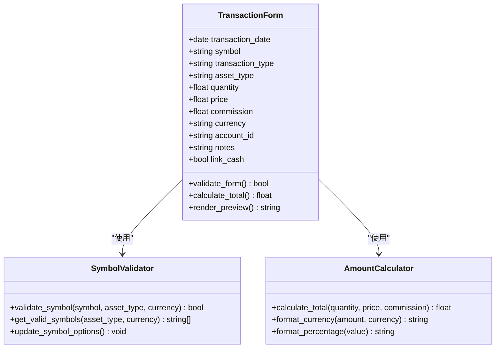
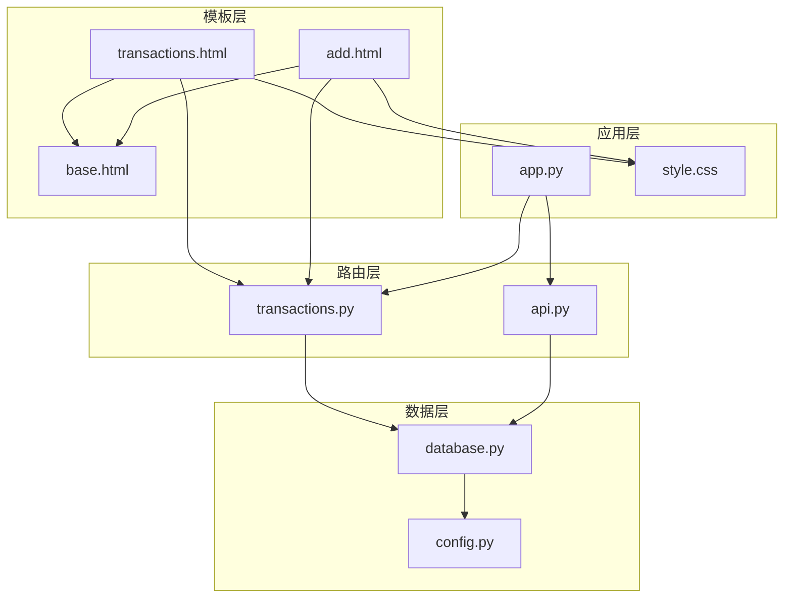

# 交易记录模板

<cite>
**本文档引用的文件**
- [templates/transactions.html](file://templates/transactions.html)
- [routers/transactions.py](file://routers/transactions.py)
- [routers/api.py](file://routers/api.py)
- [database.py](file://database.py)
- [templates/base.html](file://templates/base.html)
- [static/style.css](file://static/style.css)
- [templates/add.html](file://templates/add.html)
- [app.py](file://app.py)
</cite>

## 目录
1. [简介](#简介)
2. [项目结构](#项目结构)
3. [核心组件](#核心组件)
4. [架构概览](#架构概览)
5. [详细组件分析](#详细组件分析)
6. [依赖关系分析](#依赖关系分析)
7. [性能考虑](#性能考虑)
8. [故障排除指南](#故障排除指南)
9. [结论](#结论)

## 简介

投资日志管理系统中的交易记录模板是用户管理投资交易的核心界面。该模板提供了完整的交易历史列表展示、筛选功能、分页机制以及交互式操作能力。系统支持多种交易类型（买入、卖出、分红、拆股等），并具备实时金额计算、货币格式化和资产类型标识等功能。

## 项目结构

系统采用基于FastAPI的现代Web应用架构，主要由以下层次组成：

**图表来源**
- [app.py](file://app.py#L1-L34)
- [routers/transactions.py](file://routers/transactions.py#L1-L75)
- [routers/api.py](file://routers/api.py#L1-L67)

**章节来源**
- [app.py](file://app.py#L1-L34)
- [templates/base.html](file://templates/base.html#L1-L27)

## 核心组件

### 交易记录模板核心功能

交易记录模板作为用户界面的核心组件，提供了以下关键功能：

1. **交易历史列表展示**：以表格形式展示所有交易记录
2. **实时筛选功能**：支持按多种条件筛选交易记录
3. **分页导航**：支持大数据量的分页浏览
4. **交互式操作**：提供删除等直接操作功能
5. **数据格式化**：自动格式化日期、金额和货币显示

### 数据模型结构

**图表来源**
- [database.py](file://database.py#L28-L84)
- [database.py](file://database.py#L94-L102)
- [database.py](file://database.py#L130-L136)

**章节来源**
- [database.py](file://database.py#L28-L84)
- [database.py](file://database.py#L94-L102)

## 架构概览

系统采用MVC架构模式，通过FastAPI框架实现RESTful API和模板渲染：

**图表来源**
- [routers/transactions.py](file://routers/transactions.py#L10-L28)
- [routers/api.py](file://routers/api.py#L59-L67)
- [templates/transactions.html](file://templates/transactions.html#L82-L89)

## 详细组件分析

### 交易记录表渲染组件

交易记录模板的核心渲染逻辑如下：

**图表来源**
- [templates/transactions.html](file://templates/transactions.html#L29-L51)
- [templates/transactions.html](file://templates/transactions.html#L53-L80)

#### 交易类型标识系统

系统使用颜色编码的徽章来标识不同的交易类型：

| 交易类型 | 颜色代码 | CSS类名 | 描述 |
|---------|---------|--------|------|
| BUY | 绿色 | badge-buy | 买入操作 |
| SELL | 红色 | badge-sell | 卖出操作 |
| DIVIDEND | 蓝色 | badge-dividend | 分红收入 |
| SPLIT | 黄色 | badge-split | 股票拆分 |
| TRANSFER_IN | 紫色 | badge-transfer_in | 转入资金 |
| TRANSFER_OUT | 紫色 | badge-transfer_out | 转出资金 |
| ADJUST | 黄色 | badge-adjust | 价值调整 |

#### 金额计算和格式化

系统实现了自动化的金额计算和格式化机制：

**图表来源**
- [templates/transactions.html](file://templates/transactions.html#L36-L38)
- [database.py](file://database.py#L214-L219)

**章节来源**
- [templates/transactions.html](file://templates/transactions.html#L34-L38)
- [database.py](file://database.py#L214-L219)

### 分页机制实现

系统采用服务端分页策略，支持高效的大数据量浏览：

**图表来源**
- [templates/transactions.html](file://templates/transactions.html#L53-L80)
- [routers/transactions.py](file://routers/transactions.py#L13-L19)

#### 分页算法细节

分页系统实现了智能的页码生成逻辑：

1. **当前页前后各显示2页**：提供上下文导航
2. **首尾页始终显示**：确保可直达
3. **禁用状态处理**：上一页/下一页按钮的启用/禁用状态
4. **动态URL生成**：根据当前页生成相应的链接

**章节来源**
- [templates/transactions.html](file://templates/transactions.html#L64-L72)

### 搜索过滤功能

系统支持多维度的交易记录搜索和过滤：

| 过滤条件 | 参数名称 | 类型 | 用途 |
|---------|---------|------|------|
| 交易日期范围 | start_date, end_date | date | 按时间范围筛选 |
| 交易类型 | transaction_type | string | 按操作类型筛选 |
| 资产类型 | asset_type | string | 按资产类别筛选 |
| 货币类型 | currency | string | 按货币单位筛选 |
| 账户ID | account_id | string | 按账户筛选 |
| 股票代码 | symbol | string | 按股票代码筛选 |

**章节来源**
- [routers/api.py](file://routers/api.py#L18-L31)
- [database.py](file://database.py#L331-L378)

### 批量操作处理

系统提供了直接的单条记录删除操作，虽然没有传统意义上的"批量操作"，但删除功能设计简洁高效：

**图表来源**
- [templates/transactions.html](file://templates/transactions.html#L82-L89)
- [routers/api.py](file://routers/api.py#L59-L67)

**章节来源**
- [templates/transactions.html](file://templates/transactions.html#L82-L89)
- [routers/api.py](file://routers/api.py#L59-L67)

### 交易详情查看界面

系统通过添加交易页面提供详细的交易信息录入和验证：

**图表来源**
- [templates/add.html](file://templates/add.html#L8-L103)
- [templates/add.html](file://templates/add.html#L111-L257)

#### 表单验证和错误处理

添加交易表单实现了多层次的验证机制：

1. **客户端验证**：实时金额计算和格式化
2. **服务器端验证**：数据库约束检查
3. **类型特定验证**：不同交易类型的特殊规则
4. **货币验证**：支持的货币类型限制

**章节来源**
- [templates/add.html](file://templates/add.html#L111-L257)
- [database.py](file://database.py#L64-L84)

## 依赖关系分析

系统各组件之间的依赖关系清晰明确：

**图表来源**
- [app.py](file://app.py#L11-L29)
- [routers/transactions.py](file://routers/transactions.py#L1-L8)
- [routers/api.py](file://routers/api.py#L1-L6)

### 组件耦合度分析

- **低耦合高内聚**：每个组件职责明确，相互依赖关系简单
- **清晰的数据流**：从路由到数据库再到模板的数据传递路径
- **可扩展性**：新增功能时对现有组件影响最小

**章节来源**
- [app.py](file://app.py#L11-L29)
- [routers/transactions.py](file://routers/transactions.py#L1-L8)

## 性能考虑

### 数据库优化策略

1. **索引优化**：为常用查询字段建立索引
2. **分页查询**：避免一次性加载大量数据
3. **查询优化**：使用参数化查询防止SQL注入
4. **连接池管理**：合理管理数据库连接

### 前端性能优化

1. **懒加载**：仅在需要时加载JavaScript
2. **缓存策略**：利用浏览器缓存静态资源
3. **响应式设计**：适配不同设备屏幕尺寸
4. **异步操作**：删除等操作采用异步处理

## 故障排除指南

### 常见问题及解决方案

#### 交易记录无法显示

**可能原因**：
- 数据库连接失败
- 查询参数错误
- 权限不足

**解决步骤**：
1. 检查数据库初始化状态
2. 验证查询参数格式
3. 确认用户权限设置

#### 删除操作失败

**可能原因**：
- 事务ID不存在
- 数据库约束冲突
- 网络连接中断

**解决步骤**：
1. 验证事务ID有效性
2. 检查相关联的数据
3. 重试网络请求

#### 格式化显示异常

**可能原因**：
- 数值格式错误
- 货币符号缺失
- CSS样式冲突

**解决步骤**：
1. 检查数值计算逻辑
2. 验证货币配置
3. 审查CSS样式定义

**章节来源**
- [routers/api.py](file://routers/api.py#L59-L67)
- [database.py](file://database.py#L316-L324)

## 结论

交易记录模板作为投资日志管理系统的核心界面，成功实现了以下目标：

1. **功能完整性**：提供了交易记录的完整生命周期管理
2. **用户体验**：简洁直观的界面设计和流畅的操作体验
3. **数据准确性**：严格的验证机制确保数据质量
4. **可维护性**：清晰的架构设计便于后续扩展

系统通过合理的分层架构、完善的错误处理机制和优化的性能策略，为用户提供了一个可靠、高效的交易记录管理平台。未来可以考虑增加更多高级筛选功能、导出功能和报表生成功能，进一步提升系统的实用性。