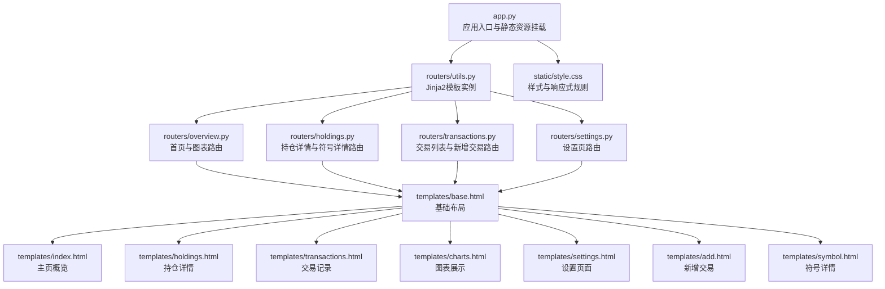
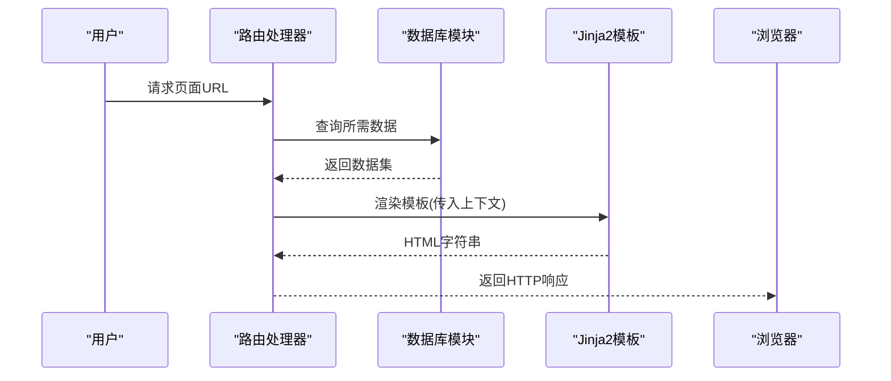
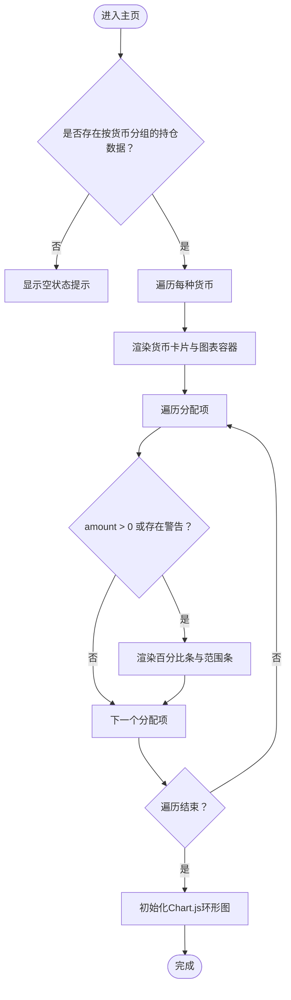
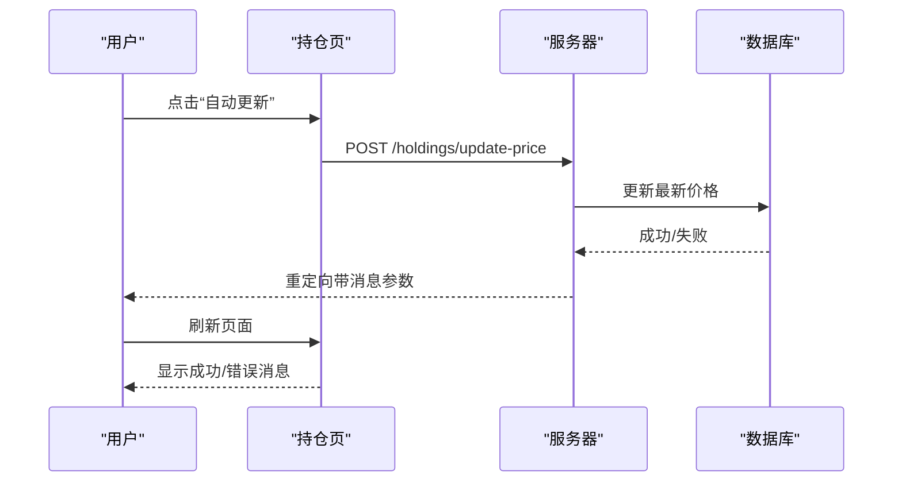
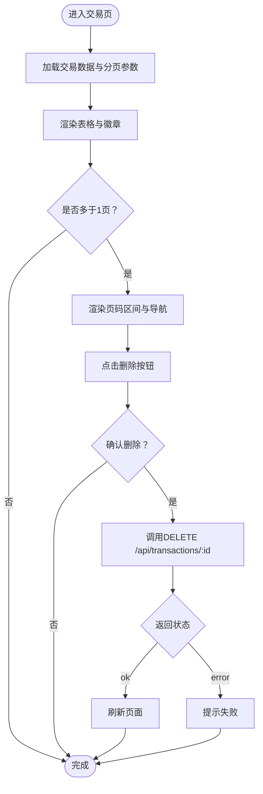
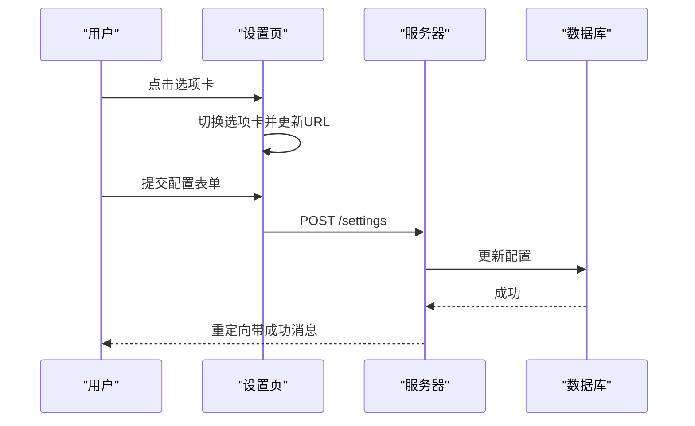
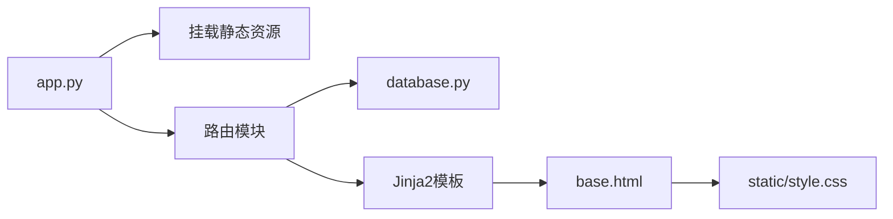

# 前端模板系统

<cite>
**本文档引用的文件**
- [app.py](file://app.py)
- [routers/utils.py](file://routers/utils.py)
- [routers/overview.py](file://routers/overview.py)
- [routers/holdings.py](file://routers/holdings.py)
- [routers/transactions.py](file://routers/transactions.py)
- [routers/settings.py](file://routers/settings.py)
- [database.py](file://database.py)
- [templates/base.html](file://templates/base.html)
- [templates/index.html](file://templates/index.html)
- [templates/holdings.html](file://templates/holdings.html)
- [templates/transactions.html](file://templates/transactions.html)
- [templates/charts.html](file://templates/charts.html)
- [templates/settings.html](file://templates/settings.html)
- [templates/add.html](file://templates/add.html)
- [templates/symbol.html](file://templates/symbol.html)
- [static/style.css](file://static/style.css)
</cite>

## 目录
1. [简介](#简介)
2. [项目结构](#项目结构)
3. [核心组件](#核心组件)
4. [架构总览](#架构总览)
5. [详细组件分析](#详细组件分析)
6. [依赖关系分析](#依赖关系分析)
7. [性能考量](#性能考量)
8. [故障排查指南](#故障排查指南)
9. [结论](#结论)
10. [附录](#附录)

## 简介
本文件系统性地解析投资日志管理系统的Jinja2模板体系，覆盖模板继承机制、页面模板功能与数据绑定、条件显示与循环处理、静态资源与样式集成、JavaScript脚本嵌入、响应式设计与跨浏览器兼容性、性能优化策略，以及模板自定义与最佳实践。目标是帮助开发者在保持一致用户体验的同时，构建可维护、高性能的前端界面。

## 项目结构
系统采用FastAPI + Jinja2模板的后端渲染架构：路由层负责业务逻辑与数据查询，模板层负责页面渲染，静态资源通过FastAPI挂载提供。

**图示来源**
- [app.py](file://app.py#L1-L34)
- [routers/utils.py](file://routers/utils.py#L1-L4)
- [routers/overview.py](file://routers/overview.py#L1-L28)
- [routers/holdings.py](file://routers/holdings.py#L1-L207)
- [routers/transactions.py](file://routers/transactions.py#L1-L75)
- [routers/settings.py](file://routers/settings.py#L1-L148)
- [templates/base.html](file://templates/base.html#L1-L27)
- [static/style.css](file://static/style.css#L1-L991)

**章节来源**
- [app.py](file://app.py#L1-L34)
- [routers/utils.py](file://routers/utils.py#L1-L4)

## 核心组件
- 模板引擎与目录
  - 使用Jinja2Templates加载模板目录，统一由路由层调用渲染。
- 静态资源
  - FastAPI挂载静态目录，模板中通过相对路径引用CSS与CDN脚本。
- 数据绑定
  - 路由函数从数据库模块查询数据，传入模板上下文；模板使用变量、过滤器与控制结构进行渲染。
- 导航与布局
  - base.html提供导航栏与内容块占位，各页面通过extends继承并填充content块。

**章节来源**
- [routers/utils.py](file://routers/utils.py#L1-L4)
- [app.py](file://app.py#L15-L16)
- [templates/base.html](file://templates/base.html#L1-L27)

## 架构总览
模板系统围绕“基础布局 + 页面模板”的继承模型展开，路由层负责数据准备，模板层负责UI呈现与交互。

**图示来源**
- [routers/overview.py](file://routers/overview.py#L8-L27)
- [routers/holdings.py](file://routers/holdings.py#L13-L100)
- [routers/transactions.py](file://routers/transactions.py#L10-L43)
- [routers/settings.py](file://routers/settings.py#L11-L61)
- [database.py](file://database.py#L158-L200)

## 详细组件分析

### 基础布局与导航（base.html）
- 继承机制
  - 子模板通过extends继承base.html，重写title与content块。
- 导航高亮
  - 通过请求路径判断当前活动页签，动态添加active类。
- 资源引用
  - 引入本地样式与Chart.js CDN脚本，确保图表渲染可用。
- 内容占位
  - main区域使用block content作为子模板插入点。

**章节来源**
- [templates/base.html](file://templates/base.html#L1-L27)

### 主页概览（index.html）
- 功能概述
  - 展示按货币分组的持仓概览，包含小计、分配条与警告提示。
- 数据绑定
  - 接收holdings_by_currency与资产类型标签映射，用于渲染图表与文本。
- 条件与循环
  - 当存在数据时渲染卡片网格；对每种货币渲染一个环形图；对分配项进行过滤与范围标注。
- 图表渲染
  - 将数据转为JSON传递给JavaScript，使用Chart.js绘制多色环形图。
- 空状态
  - 无数据时显示引导信息与跳转链接。

**图示来源**
- [templates/index.html](file://templates/index.html#L8-L82)

**章节来源**
- [templates/index.html](file://templates/index.html#L1-L90)

### 持仓详情（holdings.html）
- 功能概述
  - 展示按货币分组的明细表格，支持自动/手动价格更新与快捷交易。
- 数据绑定
  - 接收按符号分组的持仓数据、资产类型标签、货币列表与消息参数。
- 表格渲染
  - 表头包含关键指标；行内计算成本、市值、未实现盈亏与百分比。
- 交互元素
  - 自动更新：触发异步请求更新最新价并刷新页面。
  - 手动更新：弹出模态框输入价格并提交。
  - 快捷交易：弹出模态框填写交易类型、数量、价格等，提交后重定向到持仓页。
- 消息提示
  - 支持成功/错误消息的显示与关闭按钮。

**图示来源**
- [routers/holdings.py](file://routers/holdings.py#L102-L148)
- [templates/holdings.html](file://templates/holdings.html#L187-L266)

**章节来源**
- [templates/holdings.html](file://templates/holdings.html#L1-L274)
- [routers/holdings.py](file://routers/holdings.py#L13-L100)

### 交易记录（transactions.html）
- 功能概述
  - 分页展示交易历史，支持删除操作与快速跳转。
- 数据绑定
  - 接收交易列表、总数、当前页与总页数。
- 分页逻辑
  - 计算总页数并在视图中渲染页码区间与首尾页链接。
- 删除交互
  - 通过fetch调用API删除交易，删除成功后刷新页面。

**图示来源**
- [templates/transactions.html](file://templates/transactions.html#L53-L89)

**章节来源**
- [templates/transactions.html](file://templates/transactions.html#L1-L91)
- [routers/transactions.py](file://routers/transactions.py#L10-L28)

### 图表展示（charts.html）
- 功能概述
  - 按货币展示各符号的市场价值占比环形图。
- 数据绑定
  - 接收按符号分组的持仓数据与资产类型标签映射。
- 图表渲染
  - 使用Chart.js绘制环形图，启用工具提示以显示百分比。
- 空状态
  - 无数据时显示引导信息与跳转链接。

**章节来源**
- [templates/charts.html](file://templates/charts.html#L1-L104)
- [routers/overview.py](file://routers/overview.py#L19-L27)

### 设置页面（settings.html）
- 功能概述
  - 提供三类设置：资产配置区间、账户管理、资产类型管理。
- 数据绑定
  - 接收货币列表、资产类型、账户列表、设置映射与消息参数。
- 选项卡切换
  - 使用JavaScript切换选项卡并更新URL参数，无需刷新。
- 表单提交
  - 分别处理保存配置、新增/删除资产类型、新增/删除账户。

**图示来源**
- [templates/settings.html](file://templates/settings.html#L181-L200)
- [routers/settings.py](file://routers/settings.py#L63-L86)

**章节来源**
- [templates/settings.html](file://templates/settings.html#L1-L202)
- [routers/settings.py](file://routers/settings.py#L11-L61)

### 新增交易（add.html）
- 功能概述
  - 提供交易录入表单，支持根据交易类型动态调整字段与符号选择。
- 数据绑定
  - 接收账户列表、资产类型、货币列表与现有持仓数据。
- 动态交互
  - 根据交易类型切换符号输入方式（输入框或下拉），并联动价格与币种影响总额预览。
- 符号筛选
  - 基于资产类型与币种过滤唯一符号集合，填充datalist与select。
- 总额计算
  - 数量与价格变化实时计算总额并以货币符号前缀显示。

**章节来源**
- [templates/add.html](file://templates/add.html#L1-L259)
- [routers/transactions.py](file://routers/transactions.py#L30-L43)

### 符号详情（symbol.html）
- 功能概述
  - 展示指定符号的持有摘要与交易历史，支持年份筛选。
- 数据绑定
  - 接收符号、币种、持有信息、交易列表、年份列表与选中年份。
- 价值调整
  - 提供调整总价值的表单，支持备注。
- 年份筛选
  - 渲染年份按钮，点击切换年份并保留查询参数。

**章节来源**
- [templates/symbol.html](file://templates/symbol.html#L1-L105)
- [routers/holdings.py](file://routers/holdings.py#L32-L76)

## 依赖关系分析
- 应用启动与静态资源
  - 应用启动时初始化数据库，挂载静态资源目录，路由模块统一使用Jinja2模板实例。
- 路由到模板
  - 各路由模块从数据库模块读取数据，构造上下文并渲染对应模板。
- 模板到样式
  - base.html引入本地样式文件，配合媒体查询实现响应式布局。

**图示来源**
- [app.py](file://app.py#L15-L29)
- [routers/utils.py](file://routers/utils.py#L1-L4)
- [database.py](file://database.py#L22-L151)
- [templates/base.html](file://templates/base.html#L7-L8)
- [static/style.css](file://static/style.css#L1-L991)

**章节来源**
- [app.py](file://app.py#L1-L34)
- [routers/utils.py](file://routers/utils.py#L1-L4)
- [database.py](file://database.py#L1-L200)

## 性能考量
- 模板渲染
  - 控制循环与条件分支，避免在模板中执行复杂计算；将计算逻辑前置到路由层。
- 图表渲染
  - 仅在存在有效数据时初始化Chart.js实例，减少不必要的DOM与脚本开销。
- 静态资源
  - 使用CDN加载Chart.js，减少本地带宽占用；CSS采用媒体查询实现响应式，降低额外脚本依赖。
- 分页与数据量
  - 交易列表采用分页，限制单页数据量，提升首屏渲染速度。
- 缓存与复用
  - 在路由层缓存资产类型标签映射等只读数据，减少重复查询。

[本节为通用指导，不直接分析具体文件，故无“章节来源”]

## 故障排查指南
- 模板无法找到
  - 确认Jinja2Templates目录设置正确，且模板文件位于templates目录。
- 导航高亮异常
  - 检查请求路径匹配逻辑，确保与导航链接路径一致。
- 图表不显示
  - 确认数据已传递至模板并转换为JSON；检查Chart.js是否成功加载。
- 交易删除失败
  - 检查API端点与权限；确认前端fetch调用的URL与方法正确。
- 设置页选项卡状态不同步
  - 检查JavaScript切换逻辑与URL参数更新，确保事件绑定正确。

**章节来源**
- [templates/base.html](file://templates/base.html#L14-L20)
- [templates/index.html](file://templates/index.html#L48-L82)
- [templates/transactions.html](file://templates/transactions.html#L82-L89)
- [templates/settings.html](file://templates/settings.html#L181-L200)

## 结论
该模板系统通过清晰的继承结构与路由驱动的数据绑定，实现了从主页概览到交易管理的完整前端体验。配合响应式样式与轻量级交互，既保证了良好的跨设备体验，也便于后续扩展与维护。建议在新模板开发中遵循现有命名与结构规范，优先在路由层完成数据聚合与格式化，保持模板简洁易读。

[本节为总结性内容，不直接分析具体文件，故无“章节来源”]

## 附录

### 模板数据绑定清单（关键页面）
- 主页概览
  - holdings_by_currency, asset_type_labels, currencies
- 持仓详情
  - holdings_by_symbol, asset_type_labels, currencies, message, message_type
- 交易记录
  - transactions, current_page, total_pages, total_count, per_page
- 图表展示
  - holdings_by_symbol, asset_type_labels
- 设置页面
  - currencies, asset_types, accounts, settings_map, message, message_type, active_tab
- 新增交易
  - accounts, today, currencies, asset_types, holdings
- 符号详情
  - symbol, currency, holding, transactions, selected_year, years, asset_type_labels

**章节来源**
- [routers/overview.py](file://routers/overview.py#L11-L27)
- [routers/holdings.py](file://routers/holdings.py#L19-L30)
- [routers/transactions.py](file://routers/transactions.py#L11-L28)
- [routers/settings.py](file://routers/settings.py#L18-L61)
- [routers/transactions.py](file://routers/transactions.py#L31-L43)
- [routers/holdings.py](file://routers/holdings.py#L32-L76)

### 最佳实践与自定义指南
- 继承与复用
  - 所有页面均应继承base.html，仅在title与content块中定制。
- 数据上下文
  - 路由层负责准备模板所需的所有数据，模板中仅做展示与简单格式化。
- 条件与循环
  - 使用条件判断避免渲染空数据；对列表进行必要的过滤后再传入模板。
- 交互与脚本
  - 将JavaScript封装为独立函数，事件绑定放在模板末尾或延迟执行，避免阻塞渲染。
- 样式与响应式
  - 使用CSS Grid/Flexbox与媒体查询适配移动端；避免在模板中硬编码样式。
- 可访问性
  - 为按钮与表单控件提供语义化标签与键盘导航支持。
- 安全性
  - 对用户输入进行校验与清理；在模板中使用安全输出，避免XSS风险。

[本节为通用指导，不直接分析具体文件，故无“章节来源”]