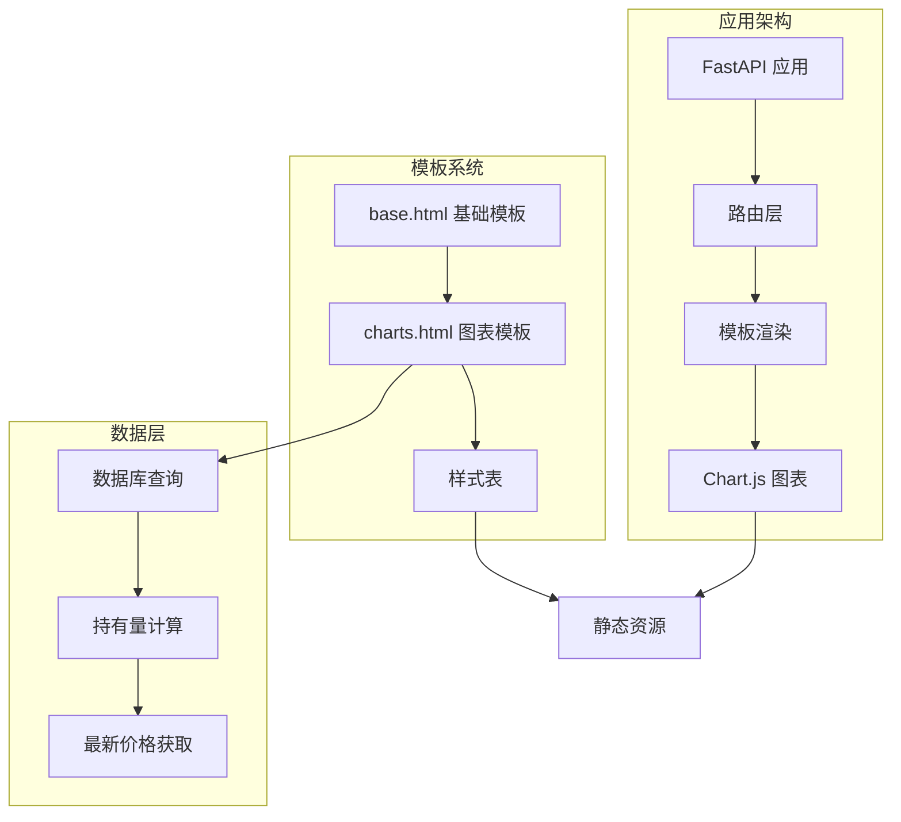
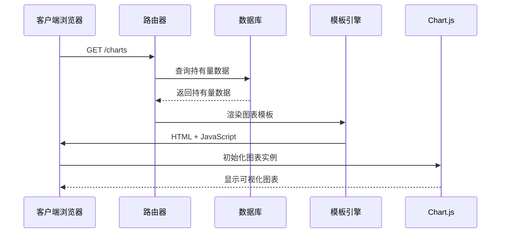
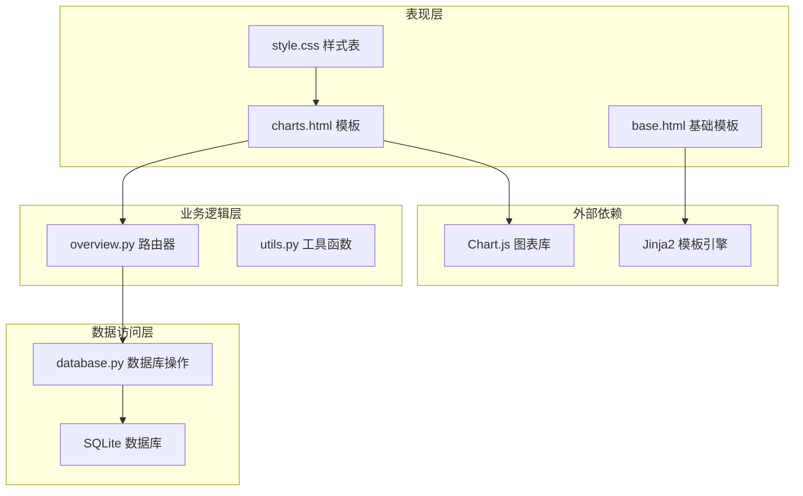
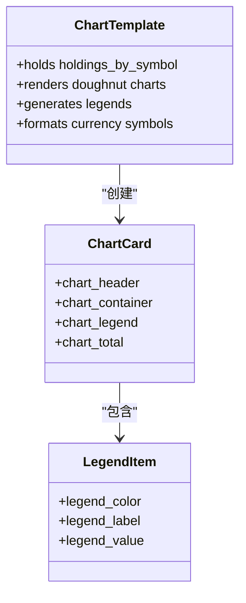
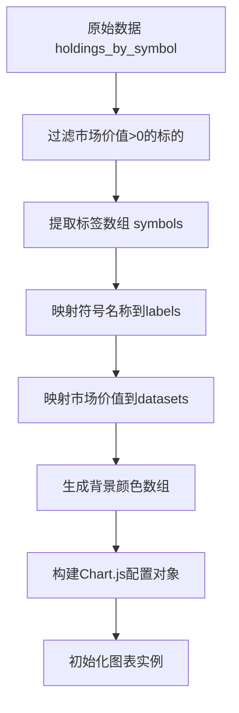
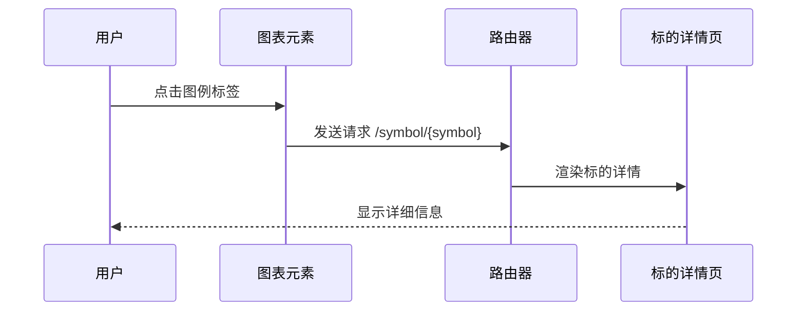
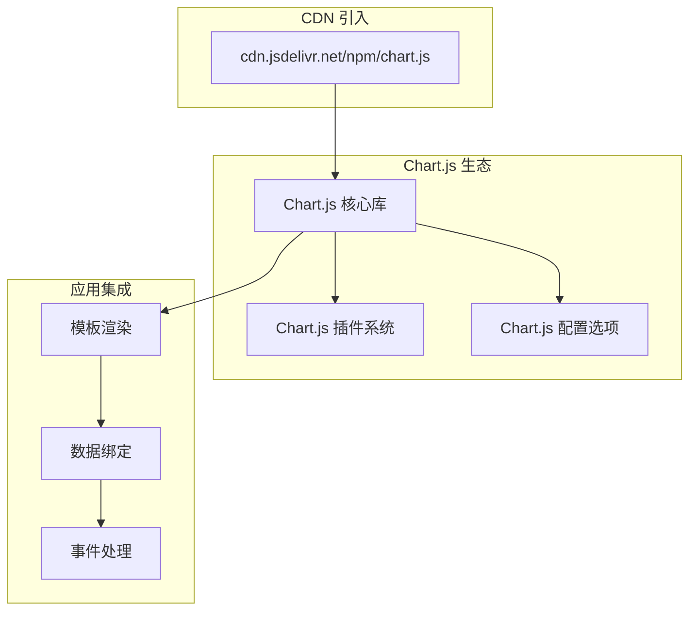
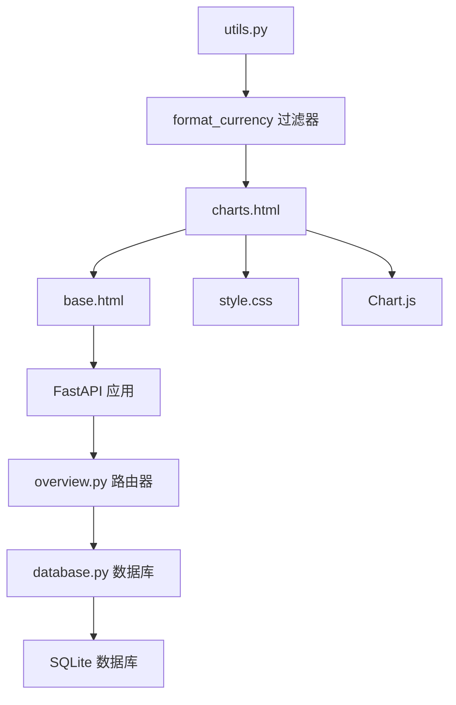
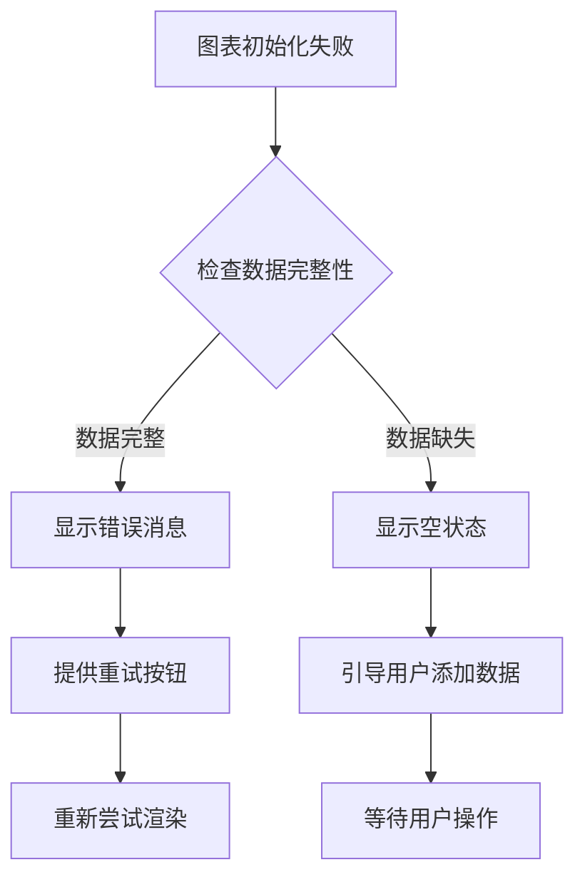

# 图表展示模板

<cite>
**本文档引用的文件**
- [charts.html](file://templates/charts.html)
- [base.html](file://templates/base.html)
- [style.css](file://static/style.css)
- [overview.py](file://routers/overview.py)
- [utils.py](file://routers/utils.py)
- [database.py](file://database.py)
- [app.py](file://app.py)
- [requirements.txt](file://requirements.txt)
</cite>

## 目录
1. [简介](#简介)
2. [项目结构](#项目结构)
3. [核心组件](#核心组件)
4. [架构概览](#架构概览)
5. [详细组件分析](#详细组件分析)
6. [依赖关系分析](#依赖关系分析)
7. [性能考虑](#性能考虑)
8. [故障排除指南](#故障排除指南)
9. [结论](#结论)

## 简介

投资日志管理系统的图表展示模板是整个应用的核心可视化组件之一，专门用于展示投资组合的分布情况和历史趋势。该模板通过Chart.js库实现了直观的饼图可视化，帮助用户快速理解不同货币单位下各投资标的的资产配置比例。

该模板采用响应式设计，支持多种设备访问，并提供了丰富的交互功能，包括悬停提示、颜色编码和动态链接到具体的投资标的详情页面。

## 项目结构

图表展示模板位于模板系统中，与应用的其他组件协同工作：



**图表来源**
- [app.py](file://app.py#L1-L34)
- [base.html](file://templates/base.html#L1-L26)
- [charts.html](file://templates/charts.html#L1-L104)

**章节来源**
- [app.py](file://app.py#L1-L34)
- [base.html](file://templates/base.html#L1-L26)

## 核心组件

### 模板继承体系

图表模板采用模板继承模式，基于基础模板扩展功能：

- **基础模板**: 提供全局布局、导航菜单和Chart.js库引入
- **图表模板**: 实现具体的图表展示逻辑和样式定制
- **样式系统**: 支持响应式布局和主题化设计

### 数据流架构



**图表来源**
- [overview.py](file://routers/overview.py#L19-L27)
- [database.py](file://database.py#L430-L500)
- [charts.html](file://templates/charts.html#L8-L102)

**章节来源**
- [overview.py](file://routers/overview.py#L19-L27)
- [database.py](file://database.py#L430-L500)

## 架构概览

图表展示模板的架构设计体现了清晰的分层原则：



**图表来源**
- [charts.html](file://templates/charts.html#L1-L104)
- [base.html](file://templates/base.html#L1-L26)
- [overview.py](file://routers/overview.py#L1-L28)
- [database.py](file://database.py#L1-L1047)

## 详细组件分析

### 图表模板实现

#### 模板结构设计

图表模板采用了卡片式布局，每个货币单位对应一个独立的图表区域：



**图表来源**
- [charts.html](file://templates/charts.html#L8-L32)
- [charts.html](file://templates/charts.html#L21-L29)

#### 数据转换逻辑

图表模板的核心在于将后端返回的数据转换为Chart.js可识别的格式：



**图表来源**
- [charts.html](file://templates/charts.html#L63-L96)

#### 配置选项详解

图表配置包含了多个关键参数：

| 配置项 | 值 | 作用 |
|--------|-----|------|
| `responsive` | `true` | 启用响应式布局 |
| `maintainAspectRatio` | `true` | 维持宽高比 |
| `legend.display` | `false` | 隐藏图例（使用自定义图例） |
| `tooltip.callbacks.label` | 自定义函数 | 格式化工具提示显示百分比 |

**章节来源**
- [charts.html](file://templates/charts.html#L77-L92)

### 样式系统设计

#### 响应式网格布局

图表模板使用CSS Grid实现响应式布局：

```mermaid
graph LR
A[charts-grid] --> B[grid-template-columns: repeat(auto-fit, minmax(400px, 1fr))]
B --> C[自动适应屏幕宽度]
C --> D[最小400px宽度]
D --> E[最多1fr宽度]
subgraph "移动端适配"
F[768px以下] --> G[grid-template-columns: 1fr]
end
```

**图表来源**
- [style.css](file://static/style.css#L237-L241)
- [style.css](file://static/style.css#L266-L268)

#### 主题色彩系统

模板内置了10种预定义颜色，支持不同数量的图表同时显示：

| 颜色索引 | 颜色值 | 使用场景 |
|----------|--------|----------|
| 0 | #3b82f6 | 蓝色主色调 |
| 1 | #10b981 | 绿色强调色 |
| 2 | #f59e0b | 橙色警告色 |
| 3 | #8b5cf6 | 紫色辅助色 |
| 4 | #ef4444 | 红色警示色 |
| 5 | #06b6d4 | 青色补充色 |
| 6 | #ec4899 | 粉色装饰色 |
| 7 | #84cc16 | 黄绿色点缀 |
| 8 | #f97316 | 深橙色强调 |
| 9 | #6366f1 | 浅蓝色辅助 |

**章节来源**
- [charts.html](file://templates/charts.html#L35-L46)
- [charts.html](file://templates/charts.html#L58-L61)

### 交互功能实现

#### 动态链接系统

每个图表都集成了智能链接功能，允许用户直接跳转到具体的投资标的详情：



**图表来源**
- [charts.html](file://templates/charts.html#L25-L26)

#### 工具提示定制

自定义的工具提示回调函数提供了精确的百分比计算：

```mermaid
flowchart TD
A[用户悬停在扇形上] --> B[Chart.js触发回调]
B --> C[获取当前值 context.parsed]
C --> D[计算数据集总和]
D --> E[计算百分比 (value/total)*100]
E --> F[格式化显示结果]
F --> G[显示工具提示]
```

**图表来源**
- [charts.html](file://templates/charts.html#L82-L91)

## 依赖关系分析

### 外部库依赖

图表展示模板主要依赖于以下外部库：



**图表来源**
- [base.html](file://templates/base.html#L8)
- [requirements.txt](file://requirements.txt#L1-L6)

### 内部组件依赖



**图表来源**
- [charts.html](file://templates/charts.html#L1-L104)
- [base.html](file://templates/base.html#L1-L26)
- [overview.py](file://routers/overview.py#L1-L28)
- [database.py](file://database.py#L1-L1047)

**章节来源**
- [requirements.txt](file://requirements.txt#L1-L6)

## 性能考虑

### 渲染优化策略

#### 按需渲染

图表采用按需渲染策略，只对有持仓数据的货币单位创建图表实例：

```javascript
// 只渲染市场价值大于0的标的
const symbols = data.symbols.filter(s => s.market_value > 0);

// 空集合时跳过图表创建
if (symbols.length > 0) {
    // 创建图表实例
}
```

#### 内存管理

- 避免重复创建相同配置的图表实例
- 及时清理不再使用的DOM元素
- 使用事件委托减少内存占用

### 加载状态处理

#### 空状态显示

当没有数据可显示时，模板提供友好的空状态界面：

```html
<div class="empty-state">
    <p>暂无持仓数据。 <a href="/add">添加交易记录</a> 开始使用。</p>
</div>
```

#### 错误恢复策略



## 故障排除指南

### 常见问题诊断

#### 图表不显示

**可能原因**：
1. Chart.js库加载失败
2. 持仓数据为空
3. DOM元素未找到

**解决方案**：
1. 检查网络连接和CDN可用性
2. 验证数据库查询结果
3. 确认canvas元素存在且具有正确ID

#### 颜色显示异常

**可能原因**：
1. 颜色数组索引越界
2. CSS变量未正确定义

**解决方案**：
1. 使用模运算符确保索引有效
2. 检查`:root`中的颜色变量定义

#### 响应式布局问题

**可能原因**：
1. CSS Grid兼容性问题
2. 移动端断点设置不当

**解决方案**：
1. 检查浏览器对Grid的支持
2. 调整媒体查询断点

**章节来源**
- [charts.html](file://templates/charts.html#L63-L96)
- [style.css](file://static/style.css#L256-L274)

## 结论

投资日志管理系统的图表展示模板是一个设计精良的可视化组件，它成功地将复杂的投资数据转化为直观的图表展示。通过合理的架构设计、完善的响应式支持和丰富的交互功能，该模板为用户提供了优秀的数据分析体验。

模板的主要优势包括：

1. **模块化设计**: 清晰的组件分离和职责划分
2. **响应式布局**: 适配各种设备和屏幕尺寸
3. **性能优化**: 按需渲染和内存管理策略
4. **用户体验**: 直观的交互和友好的错误处理
5. **可维护性**: 良好的代码组织和文档化

未来可以考虑的改进方向包括：
- 添加更多的图表类型支持
- 实现实时数据更新机制
- 增强图表的交互性和可定制性
- 优化移动端的触摸交互体验