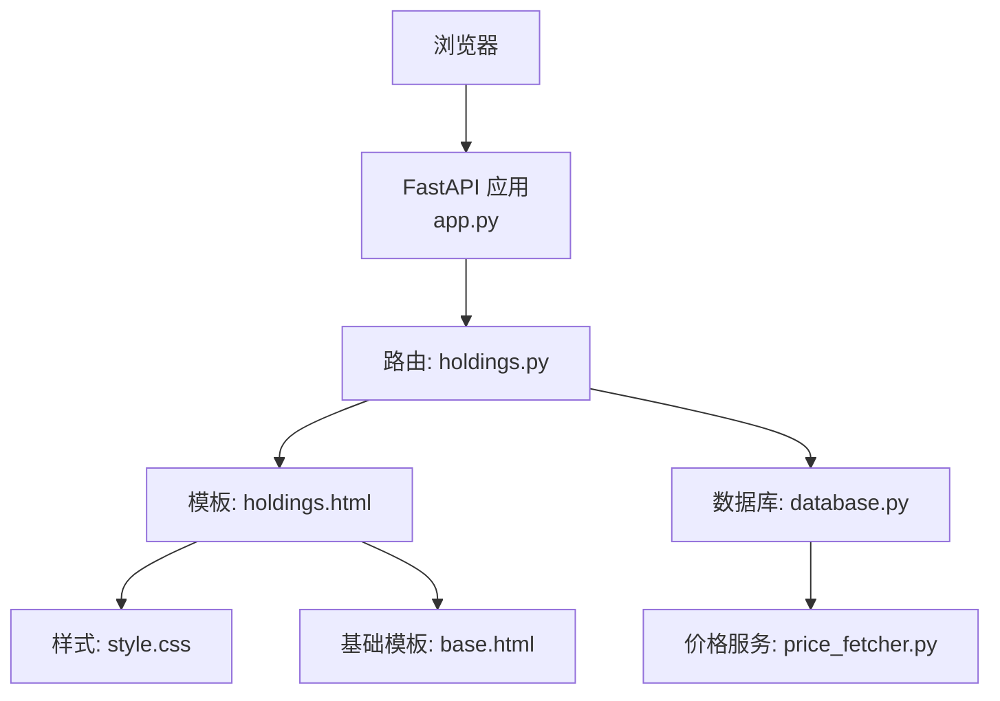
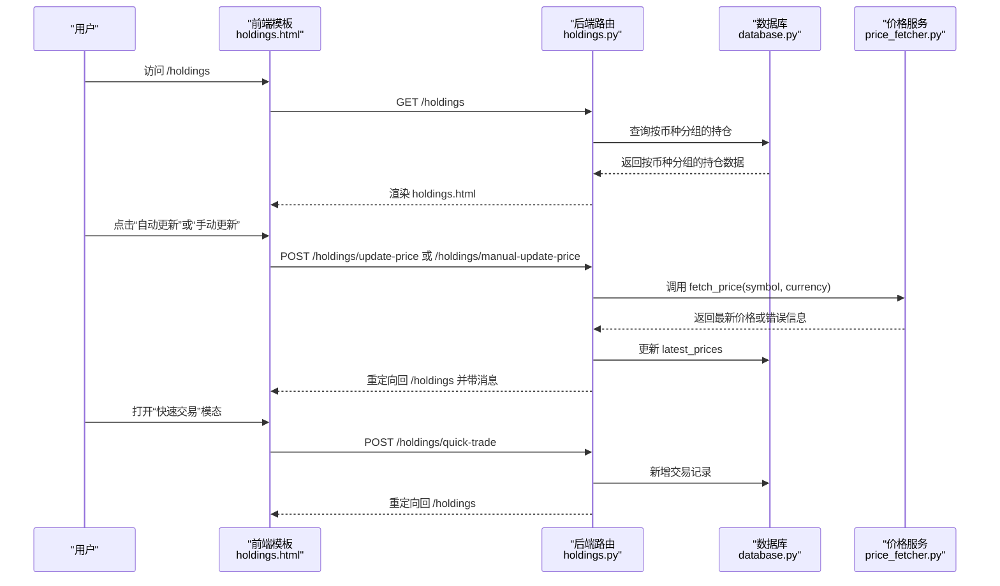
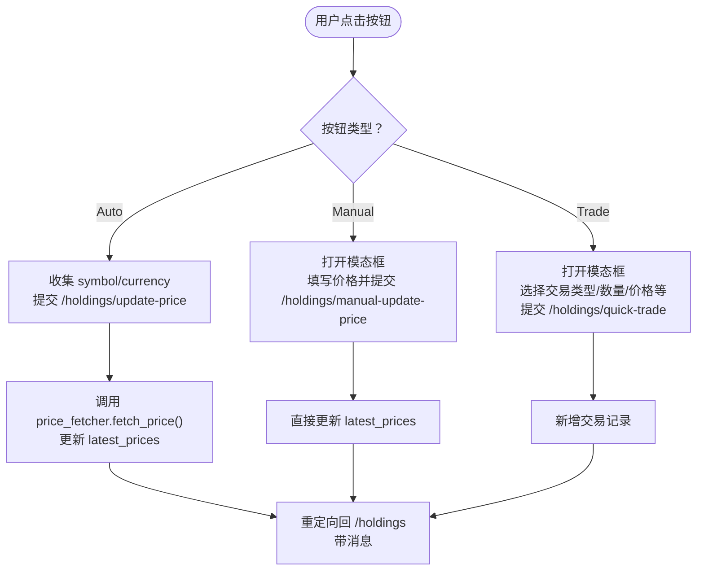
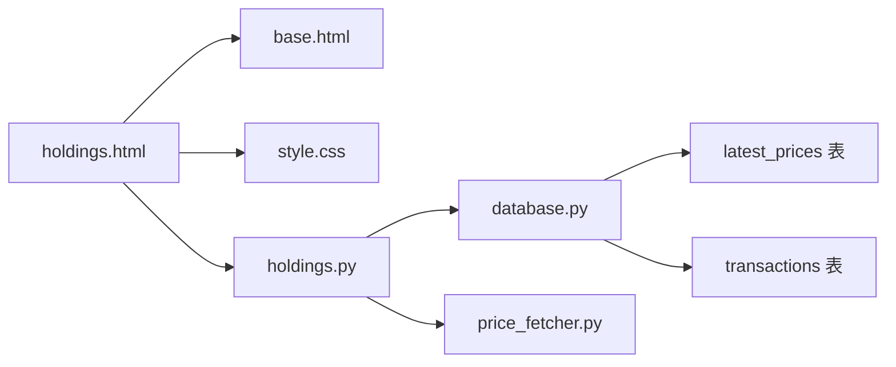

# 持仓模板

<cite>
**本文引用的文件**
- [templates/holdings.html](file://templates/holdings.html)
- [routers/holdings.py](file://routers/holdings.py)
- [database.py](file://database.py)
- [price_fetcher.py](file://price_fetcher.py)
- [static/style.css](file://static/style.css)
- [templates/base.html](file://templates/base.html)
- [templates/symbol.html](file://templates/symbol.html)
- [app.py](file://app.py)
</cite>

## 目录
1. [简介](#简介)
2. [项目结构](#项目结构)
3. [核心组件](#核心组件)
4. [架构总览](#架构总览)
5. [详细组件分析](#详细组件分析)
6. [依赖关系分析](#依赖关系分析)
7. [性能与可用性考虑](#性能与可用性考虑)
8. [故障排查指南](#故障排查指南)
9. [结论](#结论)
10. [附录：模板扩展与自定义字段](#附录模板扩展与自定义字段)

## 简介
本文件面向“投资日志管理系统”的“持仓模板”，系统性解析 holdings.html 的设计目标、数据渲染模式、交互流程、样式与响应式布局，并给出扩展与自定义字段的方法。该模板用于展示按币种分组的持仓明细，支持价格自动更新、手动更新、快速交易等操作；同时提供多币种货币符号与盈亏颜色标识，帮助用户直观掌握资产配置与收益情况。

## 项目结构
- 模板层：templates/holdings.html、templates/base.html、templates/symbol.html 等
- 路由层：routers/holdings.py 提供持仓详情页、价格更新、快速交易等接口
- 数据层：database.py 提供按币种分组的持仓聚合、最新价格查询与更新
- 价格服务：price_fetcher.py 提供多数据源的价格抓取与回退策略
- 样式层：static/style.css 定义表格、按钮、模态框、响应式布局等
- 应用入口：app.py 注册路由并挂载静态资源

图表来源
- [app.py](file://app.py#L1-L34)
- [routers/holdings.py](file://routers/holdings.py#L1-L207)
- [templates/holdings.html](file://templates/holdings.html#L1-L274)
- [database.py](file://database.py#L429-L628)
- [price_fetcher.py](file://price_fetcher.py#L325-L405)
- [static/style.css](file://static/style.css#L1-L991)
- [templates/base.html](file://templates/base.html#L1-L27)

章节来源
- [app.py](file://app.py#L1-L34)
- [templates/base.html](file://templates/base.html#L1-L27)

## 核心组件
- 持仓详情页模板：按币种分组展示各标的的持有数量、成本均价、最新价、市值、未实现盈亏及占比
- 交互控制：自动更新价格、手动更新价格、快速交易弹窗
- 样式与响应式：表格、按钮、模态框、P&L 颜色、移动端适配
- 数据来源：数据库聚合计算（含最新价），价格服务回退抓取

章节来源
- [templates/holdings.html](file://templates/holdings.html#L15-L96)
- [routers/holdings.py](file://routers/holdings.py#L13-L30)
- [database.py](file://database.py#L429-L500)
- [price_fetcher.py](file://price_fetcher.py#L325-L405)
- [static/style.css](file://static/style.css#L432-L511)

## 架构总览
下图展示了从请求到页面渲染、再到价格更新与快速交易提交的端到端流程。

图表来源
- [routers/holdings.py](file://routers/holdings.py#L13-L30)
- [routers/holdings.py](file://routers/holdings.py#L102-L148)
- [routers/holdings.py](file://routers/holdings.py#L149-L177)
- [routers/holdings.py](file://routers/holdings.py#L178-L207)
- [database.py](file://database.py#L429-L500)
- [database.py](file://database.py#L874-L921)
- [price_fetcher.py](file://price_fetcher.py#L325-L405)

## 详细组件分析

### 模板设计与数据渲染
- 币种分组：模板接收按币种分组的数据结构，每个币种区块包含小计与总计行，便于用户快速把握该币种下的资产规模与盈亏
- 表格列：包含标的、类型、份额、平均成本、最新价、成本、市值、未实现盈亏、百分比、操作按钮
- 渲染细节：
  - 多币种货币符号：根据币种动态输出相应货币符号
  - 未实现盈亏与百分比：若无最新价则显示占位符，有则按正负显示颜色
  - 百分比：基于市值计算占总资产的比例
  - 类型标签：通过资产类型映射为中文标签
- 空状态：当没有持仓时显示引导文案

章节来源
- [templates/holdings.html](file://templates/holdings.html#L15-L96)
- [templates/holdings.html](file://templates/holdings.html#L20-L28)
- [templates/holdings.html](file://templates/holdings.html#L48-L92)

### 排序与过滤
- 排序：按成本降序排列各标的，便于优先关注大额持仓
- 过滤：当前模板未提供前端筛选器；币种维度由后端聚合完成，用户可通过不同币种区块查看

章节来源
- [database.py](file://database.py#L446-L500)
- [templates/holdings.html](file://templates/holdings.html#L48-L92)

### 交互逻辑与事件流
- 自动更新价格：
  - 触发：点击“Auto”按钮，读取 data-symbol 与 data-currency
  - 行为：填充隐藏表单并提交至 /holdings/update-price
  - 结果：成功或失败均返回带消息的重定向
- 手动更新价格：
  - 触发：点击“Manual”按钮，打开模态框
  - 行为：填写价格后提交至 /holdings/manual-update-price
- 快速交易：
  - 触发：点击“Trade”按钮，打开模态框
  - 行为：选择交易类型、数量、价格、佣金、备注等，提交至 /holdings/quick-trade
  - 特殊逻辑：根据交易类型与是否为现金标的情况，动态显示“关联现金账户”选项

图表来源
- [templates/holdings.html](file://templates/holdings.html#L74-L90)
- [templates/holdings.html](file://templates/holdings.html#L187-L266)
- [routers/holdings.py](file://routers/holdings.py#L102-L148)
- [routers/holdings.py](file://routers/holdings.py#L149-L177)
- [routers/holdings.py](file://routers/holdings.py#L178-L207)
- [price_fetcher.py](file://price_fetcher.py#L325-L405)
- [database.py](file://database.py#L874-L921)

### 价格更新按钮处理
- 自动更新：调用价格服务，成功后写入最新价并记录操作日志，最后重定向回列表页并显示成功消息
- 手动更新：直接写入最新价并记录操作日志，重定向回列表页并显示成功消息
- 错误处理：失败时记录失败日志并返回错误消息

章节来源
- [routers/holdings.py](file://routers/holdings.py#L102-L148)
- [routers/holdings.py](file://routers/holdings.py#L149-L177)
- [price_fetcher.py](file://price_fetcher.py#L325-L405)
- [database.py](file://database.py#L874-L921)

### 多币种显示与货币符号
- 模板内根据币种动态输出货币符号
- 合计行显示成本、市值、盈亏，分别对应不同币种的货币符号

章节来源
- [templates/holdings.html](file://templates/holdings.html#L20-L28)

### 表格布局与响应式适配
- 表格采用基础样式：悬停高亮、边框分隔、紧凑内边距
- 响应式在小屏设备上：
  - 主容器内边距减少
  - 表格单元格内边距与字体缩小
  - 表单行改为垂直堆叠
- 模态框居中显示，支持点击遮罩关闭

章节来源
- [static/style.css](file://static/style.css#L82-L118)
- [static/style.css](file://static/style.css#L256-L274)
- [static/style.css](file://static/style.css#L692-L762)

### 用户交互反馈
- 成功/失败消息：通过 URL 参数传递消息类型与内容，模板顶部显示提示框，支持手动关闭
- 模态框：交易与价格更新均使用模态框，提供清晰的输入与确认流程

章节来源
- [templates/holdings.html](file://templates/holdings.html#L8-L13)
- [templates/holdings.html](file://templates/holdings.html#L104-L161)
- [templates/holdings.html](file://templates/holdings.html#L163-L185)
- [routers/holdings.py](file://routers/holdings.py#L132-L147)

### 持仓详情链接生成机制
- 模板中为每个标的生成指向 symbol 详情页的链接，携带当前币种参数
- symbol 详情页可查看历史交易、年份筛选、调整价值等

章节来源
- [templates/holdings.html](file://templates/holdings.html#L50)
- [templates/symbol.html](file://templates/symbol.html#L1-L105)
- [routers/holdings.py](file://routers/holdings.py#L32-L76)

## 依赖关系分析
- 模板依赖：
  - base.html 提供导航与基础结构
  - style.css 提供样式与响应式规则
- 后端依赖：
  - holdings.py 路由依赖 database.py 的聚合查询与最新价更新
  - price_fetcher.py 提供多数据源价格抓取
- 数据库：
  - latest_prices 表存储最新价，用于渲染未实现盈亏与市值
  - transactions 表存储交易明细，支撑 symbol 详情页的历史记录

图表来源
- [templates/holdings.html](file://templates/holdings.html#L1-L274)
- [templates/base.html](file://templates/base.html#L1-L27)
- [static/style.css](file://static/style.css#L1-L991)
- [routers/holdings.py](file://routers/holdings.py#L1-L207)
- [database.py](file://database.py#L167-L177)
- [price_fetcher.py](file://price_fetcher.py#L1-L405)

章节来源
- [routers/holdings.py](file://routers/holdings.py#L1-L207)
- [database.py](file://database.py#L167-L177)

## 性能与可用性考虑
- 性能：
  - 价格抓取采用多数据源回退，避免单一服务失败导致整体不可用
  - 最新价以键值缓存形式查询，减少重复 IO
- 可用性：
  - 表格列宽适中，移动端字体与间距优化
  - 模态框提供清晰的输入项与默认值，降低误操作风险
  - 成功/失败消息即时反馈，便于用户确认操作结果

[本节为通用建议，无需特定文件引用]

## 故障排查指南
- 价格更新失败：
  - 检查网络与数据源可用性
  - 查看操作日志记录的错误信息
  - 尝试手动更新价格作为临时方案
- 未实现盈亏显示为占位符：
  - 确认 latest_prices 是否存在对应标的的最新价
  - 检查 symbol 类型是否被价格服务支持（如债券暂不支持）
- 页面无数据：
  - 确认数据库中是否存在交易记录
  - 检查币种参数是否正确传入

章节来源
- [routers/holdings.py](file://routers/holdings.py#L132-L147)
- [price_fetcher.py](file://price_fetcher.py#L343-L351)
- [database.py](file://database.py#L911-L921)

## 结论
holdings.html 模板通过清晰的币种分组与表格布局，结合自动/手动价格更新与快速交易能力，为用户提供完整的持仓概览与便捷操作入口。配合数据库侧的聚合计算与价格服务的多源回退，系统在易用性与稳定性之间取得良好平衡。后续可在保持现有结构的基础上，按需扩展字段与交互能力。

[本节为总结，无需特定文件引用]

## 附录：模板扩展与自定义字段
以下为在不破坏现有结构的前提下，对模板进行扩展与自定义的建议路径。为避免泄露具体代码，仅提供修改位置与数据来源指引。

- 新增列：在模板表格的表头与行中增加对应字段，确保后端数据源也包含该字段
  - 修改位置：[templates/holdings.html](file://templates/holdings.html#L32-L94)
  - 数据来源：[database.py](file://database.py#L429-L500)
- 新增交互按钮：
  - 在 actions 单元格中添加按钮，并在模板脚本中实现对应行为
  - 修改位置：[templates/holdings.html](file://templates/holdings.html#L74-L90)
  - 脚本位置：[templates/holdings.html](file://templates/holdings.html#L187-L266)
- 新增模态框：
  - 在模板底部新增模态框结构，设置隐藏与显示逻辑
  - 修改位置：[templates/holdings.html](file://templates/holdings.html#L98-L185)
- 后端路由扩展：
  - 在 [routers/holdings.py](file://routers/holdings.py#L1-L207) 中新增处理函数，接收表单参数并调用数据库写入
- 数据库字段扩展：
  - 在 [database.py](file://database.py#L22-L188) 中完善表结构与索引，或通过迁移脚本添加字段
- 样式适配：
  - 在 [static/style.css](file://static/style.css#L1-L991) 中补充新按钮、新列的样式与响应式规则

章节来源
- [templates/holdings.html](file://templates/holdings.html#L32-L94)
- [templates/holdings.html](file://templates/holdings.html#L74-L90)
- [templates/holdings.html](file://templates/holdings.html#L98-L185)
- [routers/holdings.py](file://routers/holdings.py#L1-L207)
- [database.py](file://database.py#L22-L188)
- [static/style.css](file://static/style.css#L1-L991)