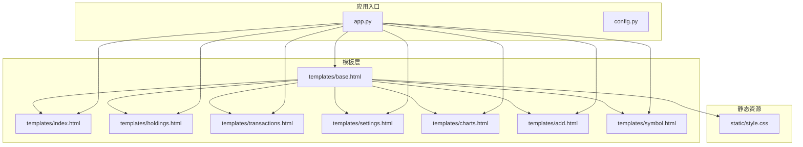
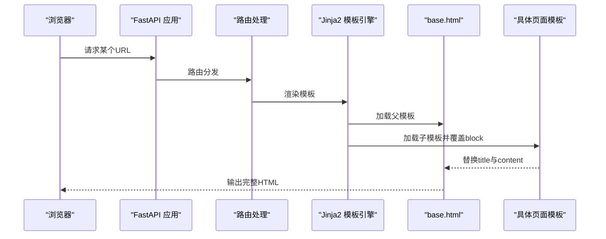
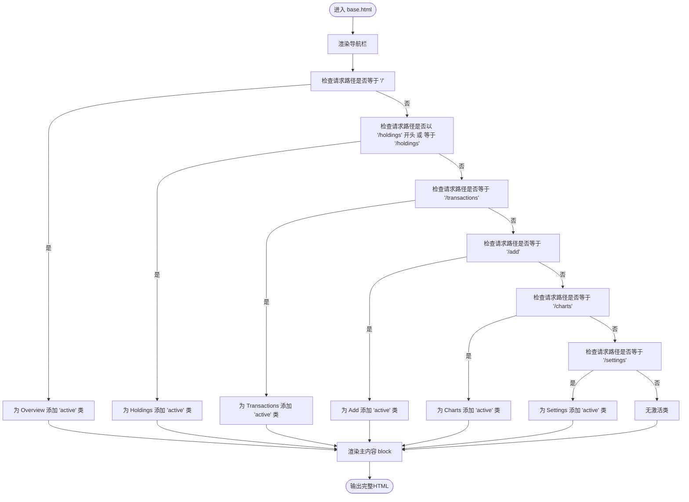
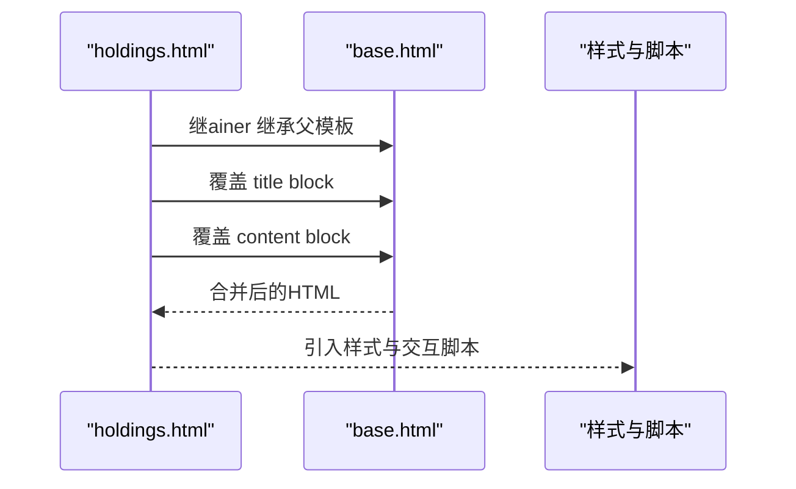
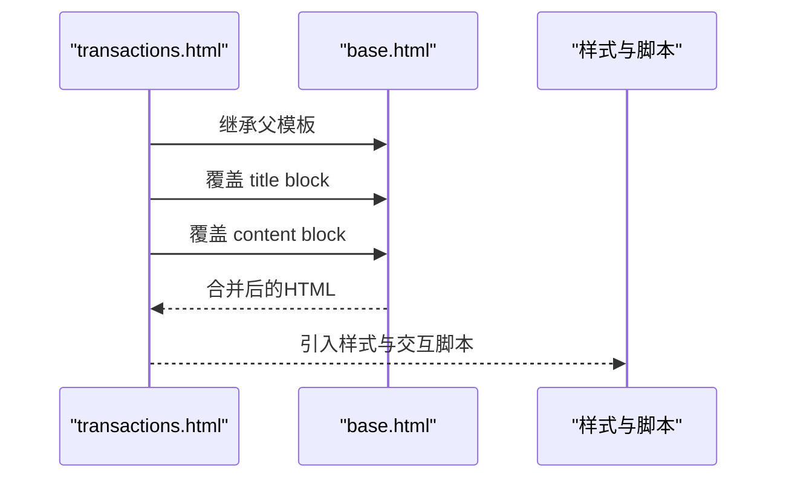
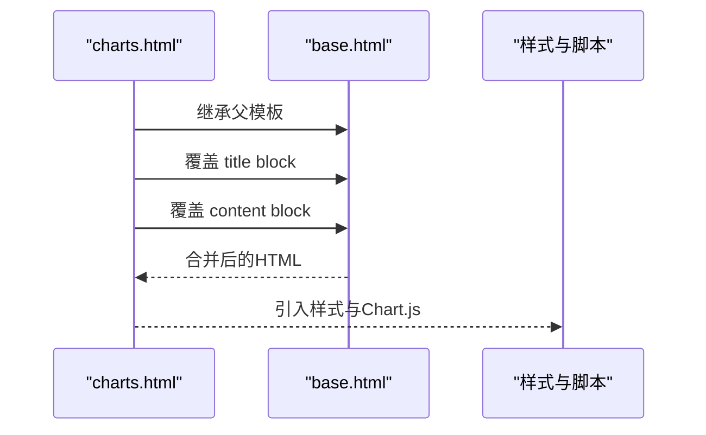
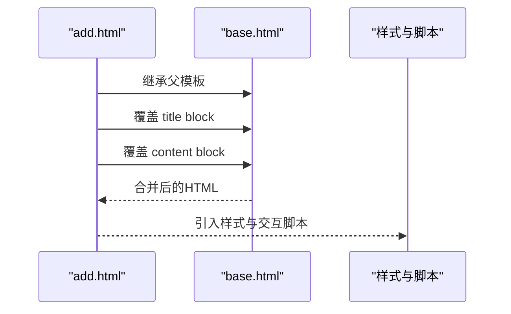
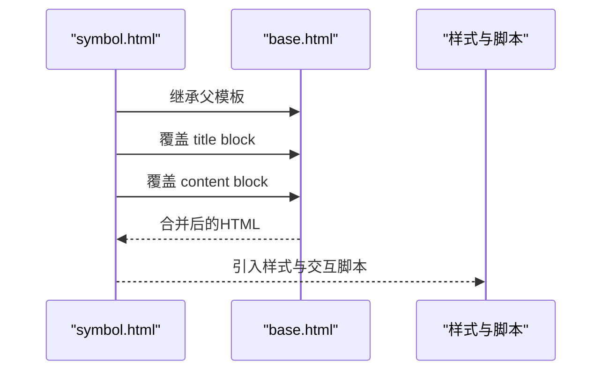
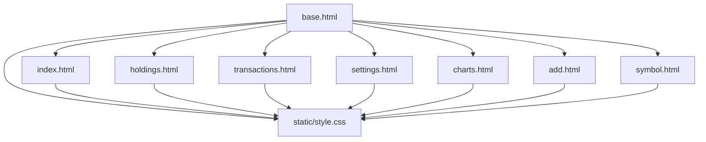

# 模板继承机制

<cite>
**本文引用的文件**
- [templates/base.html](file://templates/base.html)
- [templates/index.html](file://templates/index.html)
- [templates/holdings.html](file://templates/holdings.html)
- [templates/transactions.html](file://templates/transactions.html)
- [templates/settings.html](file://templates/settings.html)
- [templates/charts.html](file://templates/charts.html)
- [templates/add.html](file://templates/add.html)
- [templates/symbol.html](file://templates/symbol.html)
- [static/style.css](file://static/style.css)
- [app.py](file://app.py)
- [config.py](file://config.py)
</cite>

## 目录
1. [简介](#简介)
2. [项目结构](#项目结构)
3. [核心组件](#核心组件)
4. [架构总览](#架构总览)
5. [详细组件分析](#详细组件分析)
6. [依赖关系分析](#依赖关系分析)
7. [性能考量](#性能考量)
8. [故障排查指南](#故障排查指南)
9. [结论](#结论)
10. [附录](#附录)

## 简介
本文件聚焦于投资日志管理系统中的Jinja2模板继承机制，系统以base.html为父模板，其他页面模板通过继承实现统一布局与一致的导航体验。本文将深入解析：
- 父模板设计理念与block定义
- 子模板如何扩展与覆盖父模板内容
- 导航栏动态激活状态的实现（基于请求URL路径与CSS类）
- 继承在保持设计一致性与减少重复代码方面的价值
- 最佳实践与常见问题解决方案

## 项目结构
该系统采用“父模板 + 多个子模板”的组织方式，所有页面共享相同的头部、导航与主体区域，仅在内容区按需替换。静态资源由FastAPI挂载，样式集中于单一CSS文件，便于统一维护。

图表来源
- [templates/base.html](file://templates/base.html#L1-L27)
- [templates/index.html](file://templates/index.html#L1-L90)
- [templates/holdings.html](file://templates/holdings.html#L1-L274)
- [templates/transactions.html](file://templates/transactions.html#L1-L91)
- [templates/settings.html](file://templates/settings.html#L1-L202)
- [templates/charts.html](file://templates/charts.html#L1-L104)
- [templates/add.html](file://templates/add.html#L1-L259)
- [templates/symbol.html](file://templates/symbol.html#L1-L105)
- [static/style.css](file://static/style.css#L1-L800)
- [app.py](file://app.py#L1-L34)
- [config.py](file://config.py#L1-L24)

章节来源
- [app.py](file://app.py#L1-L34)
- [config.py](file://config.py#L1-L24)

## 核心组件
- 父模板：base.html
  - 定义了全局HTML骨架、标题块、主内容块以及导航栏
  - 导航栏包含Overview、Holdings、Transactions、Add、Charts、Settings六个链接
  - 使用请求对象的URL路径进行当前页激活判断，为每个导航项动态添加CSS类
- 子模板：index.html、holdings.html、transactions.html、settings.html、charts.html、add.html、symbol.html
  - 通过继承base.html，重写title与content两个关键block
  - 在content中填充各自页面的业务数据与交互逻辑

章节来源
- [templates/base.html](file://templates/base.html#L1-L27)
- [templates/index.html](file://templates/index.html#L1-L90)
- [templates/holdings.html](file://templates/holdings.html#L1-L274)
- [templates/transactions.html](file://templates/transactions.html#L1-L91)
- [templates/settings.html](file://templates/settings.html#L1-L202)
- [templates/charts.html](file://templates/charts.html#L1-L104)
- [templates/add.html](file://templates/add.html#L1-L259)
- [templates/symbol.html](file://templates/symbol.html#L1-L105)

## 架构总览
模板继承在本系统中的作用：
- 设计一致性：所有页面共享同一导航、标题与基础样式，确保用户界面风格统一
- 代码复用：避免在每个页面重复编写HTML骨架与导航逻辑
- 可维护性：修改导航或布局只需在父模板中进行，子模板自动受益

图表来源
- [templates/base.html](file://templates/base.html#L1-L27)
- [templates/index.html](file://templates/index.html#L1-L90)
- [templates/holdings.html](file://templates/holdings.html#L1-L274)
- [templates/transactions.html](file://templates/transactions.html#L1-L91)
- [templates/settings.html](file://templates/settings.html#L1-L202)
- [templates/charts.html](file://templates/charts.html#L1-L104)
- [templates/add.html](file://templates/add.html#L1-L259)
- [templates/symbol.html](file://templates/symbol.html#L1-L105)
- [app.py](file://app.py#L1-L34)

## 详细组件分析

### 父模板：base.html 的设计理念与实现原理
- HTML骨架与资源加载
  - 定义标准HTML5结构，引入样式表与Chart.js脚本
  - 通过block定义可被子模板覆盖的区域
- 导航栏与动态激活
  - 导航项使用a标签指向固定路径
  - 激活逻辑基于请求URL路径与导航项路径的精确匹配或前缀匹配
  - 当匹配成功时，为导航项添加CSS类，从而触发样式高亮
- 内容替换机制
  - 主体区域通过block声明占位符，子模板负责填充实际内容

图表来源
- [templates/base.html](file://templates/base.html#L11-L21)

章节来源
- [templates/base.html](file://templates/base.html#L1-L27)
- [static/style.css](file://static/style.css#L14-L38)

### 子模板：index.html 的继承与内容覆盖
- 继承语法：通过extends声明继承base.html
- 标题覆盖：重写title block，设置页面专属标题
- 内容覆盖：重写content block，渲染持有情况、图表与交互脚本
- 数据绑定：通过模板变量传递持有数据、资产类型标签等信息
- 图表集成：使用Chart.js按货币维度绘制饼图

图表来源
- [templates/index.html](file://templates/index.html#L1-L90)
- [templates/base.html](file://templates/base.html#L6-L24)
- [static/style.css](file://static/style.css#L236-L274)

章节来源
- [templates/index.html](file://templates/index.html#L1-L90)
- [templates/base.html](file://templates/base.html#L1-L27)

### 子模板：holdings.html 的继承与内容覆盖
- 继承语法：通过extends声明继承base.html
- 标题覆盖：重写title block，设置页面专属标题
- 内容覆盖：重写content block，渲染持有明细、表格、模态框与交互脚本
- 动作按钮：提供快速交易、手动更新价格等操作
- 分页与弹窗：包含模态框与分页控件

图表来源
- [templates/holdings.html](file://templates/holdings.html#L1-L274)
- [templates/base.html](file://templates/base.html#L6-L24)
- [static/style.css](file://static/style.css#L692-L761)

章节来源
- [templates/holdings.html](file://templates/holdings.html#L1-L274)
- [templates/base.html](file://templates/base.html#L1-L27)

### 子模板：transactions.html 的继承与内容覆盖
- 继承语法：通过extends声明继承base.html
- 标题覆盖：重写title block，设置页面专属标题
- 内容覆盖：重写content block，渲染交易列表、分页与删除交互
- API交互：通过异步调用删除交易记录

图表来源
- [templates/transactions.html](file://templates/transactions.html#L1-L91)
- [templates/base.html](file://templates/base.html#L6-L24)
- [static/style.css](file://static/style.css#L763-L800)

章节来源
- [templates/transactions.html](file://templates/transactions.html#L1-L91)
- [templates/base.html](file://templates/base.html#L1-L27)

### 子模板：settings.html 的继承与内容覆盖
- 继承语法：通过extends声明继承base.html
- 标题覆盖：重写title block，设置页面专属标题
- 内容覆盖：重写content block，渲染设置面板、标签页与表单
- 标签页切换：通过JavaScript控制标签页显示与URL参数同步

图表来源
- [templates/settings.html](file://templates/settings.html#L1-L202)
- [templates/base.html](file://templates/base.html#L6-L24)
- [static/style.css](file://static/style.css#L377-L418)

章节来源
- [templates/settings.html](file://templates/settings.html#L1-L202)
- [templates/base.html](file://templates/base.html#L1-L27)

### 子模板：charts.html 的继承与内容覆盖
- 继承语法：通过extends声明继承base.html
- 标题覆盖：重写title block，设置页面专属标题
- 内容覆盖：重写content block，渲染图表网格、颜色变量与交互脚本
- 图表集成：使用Chart.js按货币维度绘制饼图

图表来源
- [templates/charts.html](file://templates/charts.html#L1-L104)
- [templates/base.html](file://templates/base.html#L6-L24)
- [static/style.css](file://static/style.css#L34-L54)

章节来源
- [templates/charts.html](file://templates/charts.html#L1-L104)
- [templates/base.html](file://templates/base.html#L1-L27)

### 子模板：add.html 的继承与内容覆盖
- 继承语法：通过extends声明继承base.html
- 标题覆盖：重写title block，设置页面专属标题
- 内容覆盖：重写content block，渲染交易录入表单、符号选择与计算预览
- 交互逻辑：根据交易类型动态切换输入控件与联动逻辑

图表来源
- [templates/add.html](file://templates/add.html#L1-L259)
- [templates/base.html](file://templates/base.html#L6-L24)
- [static/style.css](file://static/style.css#L182-L234)

章节来源
- [templates/add.html](file://templates/add.html#L1-L259)
- [templates/base.html](file://templates/base.html#L1-L27)

### 子模板：symbol.html 的继承与内容覆盖
- 继承语法：通过extends声明继承base.html
- 标题覆盖：重写title block，设置页面专属标题
- 内容覆盖：重写content block，渲染符号详情、调整价值表单与历史交易
- 年份筛选：支持按年份过滤交易记录

图表来源
- [templates/symbol.html](file://templates/symbol.html#L1-L105)
- [templates/base.html](file://templates/base.html#L6-L24)
- [static/style.css](file://static/style.css#L512-L624)

章节来源
- [templates/symbol.html](file://templates/symbol.html#L1-L105)
- [templates/base.html](file://templates/base.html#L1-L27)

## 依赖关系分析
- 模板依赖
  - 所有子模板均依赖base.html，形成树形继承关系
  - 子模板之间相互独立，不直接互相依赖
- 样式依赖
  - 所有页面共享static/style.css，导航激活状态依赖该CSS中的类选择器
- 应用依赖
  - app.py负责挂载静态资源与包含各路由模块，模板渲染由FastAPI与Jinja2共同完成

图表来源
- [templates/base.html](file://templates/base.html#L1-L27)
- [templates/index.html](file://templates/index.html#L1-L90)
- [templates/holdings.html](file://templates/holdings.html#L1-L274)
- [templates/transactions.html](file://templates/transactions.html#L1-L91)
- [templates/settings.html](file://templates/settings.html#L1-L202)
- [templates/charts.html](file://templates/charts.html#L1-L104)
- [templates/add.html](file://templates/add.html#L1-L259)
- [templates/symbol.html](file://templates/symbol.html#L1-L105)
- [static/style.css](file://static/style.css#L14-L38)

章节来源
- [app.py](file://app.py#L1-L34)
- [config.py](file://config.py#L1-L24)

## 性能考量
- 模板渲染开销
  - 继承层级较浅，渲染成本低
  - 避免在模板中执行复杂逻辑，将计算移至后端路由或工具函数
- 样式与脚本
  - 共享样式文件，减少HTTP请求数量
  - 图表库按需加载，避免不必要的资源消耗
- 数据传递
  - 通过模板上下文传递必要数据，避免在模板中进行数据库查询

## 故障排查指南
- 导航未激活
  - 现象：点击导航项后无高亮效果
  - 排查要点：确认请求URL路径与base.html中的匹配条件一致；检查CSS类名是否正确
  - 相关文件：[templates/base.html](file://templates/base.html#L14-L19)，[static/style.css](file://static/style.css#L35-L38)
- 标题未更新
  - 现象：页面标题仍为默认值
  - 排查要点：确认子模板已重写title block；检查block语法是否正确
  - 相关文件：[templates/index.html](file://templates/index.html#L3)，[templates/holdings.html](file://templates/holdings.html#L3)，[templates/transactions.html](file://templates/transactions.html#L3)，[templates/settings.html](file://templates/settings.html#L3)，[templates/charts.html](file://templates/charts.html#L3)，[templates/add.html](file://templates/add.html#L3)，[templates/symbol.html](file://templates/symbol.html#L3)
- 样式异常
  - 现象：导航或内容区域样式错乱
  - 排查要点：确认base.html中引入的样式文件路径正确；检查CSS类名与模板中的类名一致
  - 相关文件：[templates/base.html](file://templates/base.html#L7)，[static/style.css](file://static/style.css#L14-L44)
- 图表不显示
  - 现象：图表容器为空或报错
  - 排查要点：确认Chart.js已正确引入；检查模板中传递的数据格式与脚本逻辑
  - 相关文件：[templates/base.html](file://templates/base.html#L8)，[templates/index.html](file://templates/index.html#L48-L82)，[templates/charts.html](file://templates/charts.html#L56-L96)

章节来源
- [templates/base.html](file://templates/base.html#L7-L21)
- [static/style.css](file://static/style.css#L14-L44)
- [templates/index.html](file://templates/index.html#L3-L82)
- [templates/holdings.html](file://templates/holdings.html#L3-L274)
- [templates/transactions.html](file://templates/transactions.html#L3-L91)
- [templates/settings.html](file://templates/settings.html#L3-L202)
- [templates/charts.html](file://templates/charts.html#L3-L104)
- [templates/add.html](file://templates/add.html#L3-L259)
- [templates/symbol.html](file://templates/symbol.html#L3-L105)

## 结论
本系统通过Jinja2模板继承实现了高度一致的UI设计与高效的代码复用。base.html作为父模板，统一承载导航与基础结构；各子模板专注于自身内容与交互，既保证了视觉一致性，又提升了开发效率。通过合理的block划分与CSS类命名约定，导航栏的动态激活状态得以稳定实现。建议在后续迭代中继续遵循“父模板不变、子模板覆盖”的原则，确保架构清晰、易于维护。

## 附录
- 最佳实践
  - 保持父模板简洁，仅放置通用结构与导航
  - 子模板仅覆盖必要block，避免过度定制破坏一致性
  - 使用语义化类名，确保样式与模板的强关联
  - 将复杂逻辑移至后端，模板中仅做展示
- 常见问题
  - 忘记重写title block导致标题不更新
  - CSS类名拼写错误导致导航未激活
  - 模板中引入外部资源路径错误导致样式丢失
  - 图表脚本依赖的数据格式不正确导致渲染失败