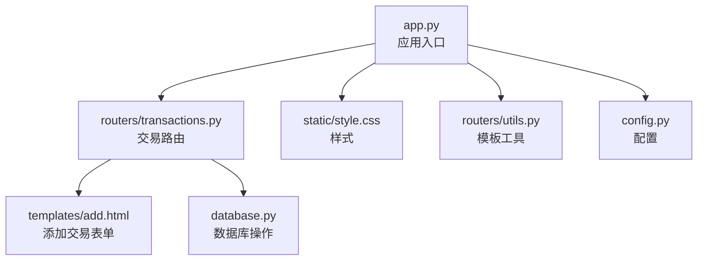
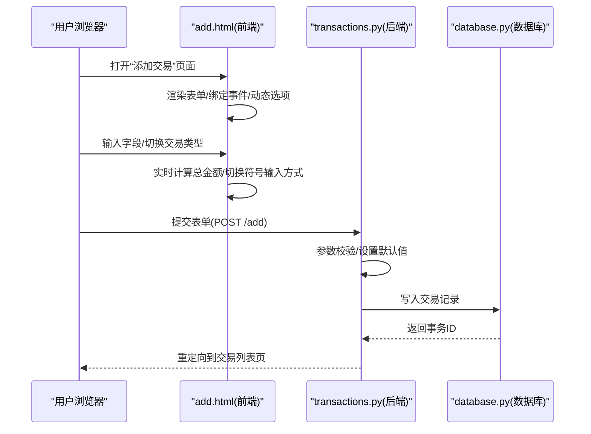
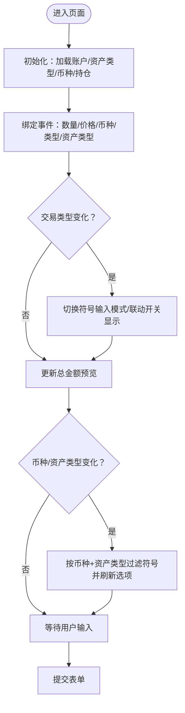
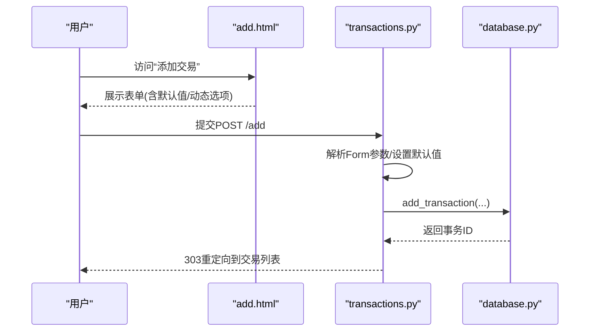
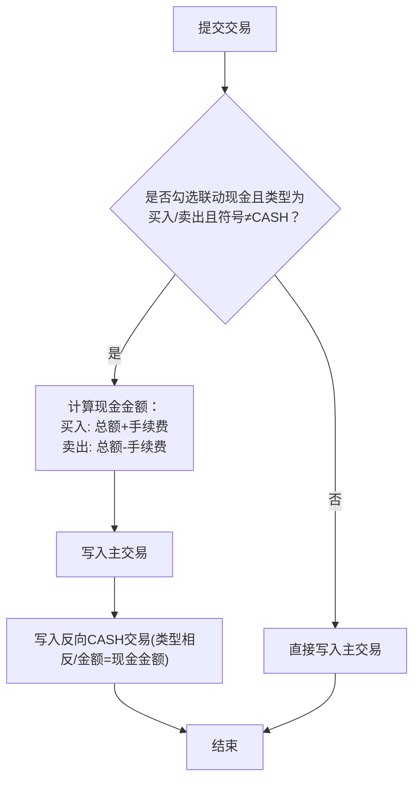
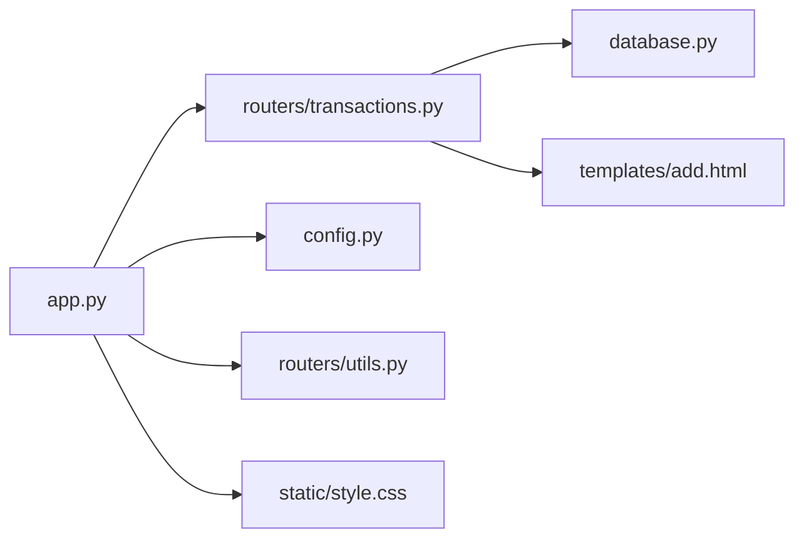

# 添加交易模板

<cite>
**本文引用的文件**
- [templates/add.html](file://templates/add.html)
- [routers/transactions.py](file://routers/transactions.py)
- [database.py](file://database.py)
- [app.py](file://app.py)
- [config.py](file://config.py)
- [routers/utils.py](file://routers/utils.py)
- [static/style.css](file://static/style.css)
- [requirements.txt](file://requirements.txt)
</cite>

## 目录
1. [简介](#简介)
2. [项目结构](#项目结构)
3. [核心组件](#核心组件)
4. [架构总览](#架构总览)
5. [详细组件分析](#详细组件分析)
6. [依赖关系分析](#依赖关系分析)
7. [性能考量](#性能考量)
8. [故障排查指南](#故障排查指南)
9. [结论](#结论)
10. [附录](#附录)

## 简介
本文件面向“投资日志管理系统”的“添加交易”页面（add.html）进行深入文档化，围绕以下目标展开：
- 设计目标与表单处理机制：解释页面如何通过前后端协作完成交易信息录入。
- 表单字段与数据验证：明确各字段的验证规则、默认值与动态选项生成策略。
- 交互与计算：交易类型选择、日期时间控件、金额输入的处理方式及实时预览。
- 提交流程与反馈：从表单提交到数据库写入、重定向与日志记录的完整链路。
- 定制指南与体验优化：提供可操作的定制建议与用户体验优化点，帮助用户高效完成交易录入。

## 项目结构
该系统采用 FastAPI + Jinja2 模板的轻量级 Web 架构，前端模板位于 templates 目录，路由控制器位于 routers 目录，业务逻辑与数据库操作集中在 database.py，应用入口在 app.py，样式位于 static/style.css。

图表来源
- [app.py](file://app.py#L1-L34)
- [routers/transactions.py](file://routers/transactions.py#L1-L75)
- [templates/add.html](file://templates/add.html#L1-L259)
- [database.py](file://database.py#L1-L120)
- [routers/utils.py](file://routers/utils.py#L1-L14)
- [config.py](file://config.py#L1-L24)
- [static/style.css](file://static/style.css#L1-L120)

章节来源
- [app.py](file://app.py#L1-L34)
- [routers/transactions.py](file://routers/transactions.py#L1-L75)
- [templates/add.html](file://templates/add.html#L1-L259)
- [database.py](file://database.py#L1-L120)
- [routers/utils.py](file://routers/utils.py#L1-L14)
- [config.py](file://config.py#L1-L24)
- [static/style.css](file://static/style.css#L1-L120)

## 核心组件
- 前端模板：add.html 负责渲染表单、绑定交互事件、动态生成符号选项并实时计算总金额。
- 后端路由：transactions.py 提供 GET 页面与 POST 提交处理，负责参数接收、默认值设定与重定向。
- 数据库层：database.py 负责初始化表结构、插入交易记录、处理“现金联动”等业务逻辑。
- 应用入口：app.py 注册路由、挂载静态资源、启动数据库初始化。
- 模板工具：routers/utils.py 提供 Jinja2 过滤器，用于格式化货币显示。
- 配置：config.py 统一管理数据库路径等配置项。

章节来源
- [templates/add.html](file://templates/add.html#L1-L259)
- [routers/transactions.py](file://routers/transactions.py#L30-L75)
- [database.py](file://database.py#L195-L262)
- [app.py](file://app.py#L13-L34)
- [routers/utils.py](file://routers/utils.py#L1-L14)
- [config.py](file://config.py#L17-L24)

## 架构总览
下图展示“添加交易”从用户交互到数据库写入的关键流程。

图表来源
- [templates/add.html](file://templates/add.html#L8-L103)
- [routers/transactions.py](file://routers/transactions.py#L30-L75)
- [database.py](file://database.py#L195-L262)

## 详细组件分析

### 表单设计目标与布局
- 目标：以最少步骤完成交易录入，降低误操作风险，提供即时反馈。
- 布局：采用响应式两列栅格，关键字段（日期、类型、资产类型、币种、账户、数量、价格、手续费、备注、是否联动现金）分组排列，提升可读性与易用性。
- 默认值：日期默认为当天；币种默认为人民币；资产类型默认为“股票”；手续费默认为 0；备注为空。
- 动态选项：资产类型来自数据库；币种来自常量集合；符号选项根据当前资产类型与币种从现有持仓中筛选并去重生成。

章节来源
- [templates/add.html](file://templates/add.html#L8-L103)
- [routers/transactions.py](file://routers/transactions.py#L30-L43)
- [database.py](file://database.py#L701-L708)

### 字段与验证规则
- 日期：必填，使用 HTML5 date 控件，默认值为当天 ISO 字符串。
- 交易类型：必填，枚举值包括买入、卖出、收入（现金）、股息、拆合股、资金转入、资金转出、调整。
- 资产类型：必填，来源于数据库资产类型表，默认“股票”。
- 币种：必填，来源于常量集合，默认“CNY”。
- 账户：必填，来源于账户表，需选择已有账户。
- 数量：必填，数值型，步进精度支持到 0.0001，最小值 0。
- 价格：必填，数值型，步进精度到 0.01，最小值 0。
- 手续费：可选，数值型，步进精度到 0.01，默认 0。
- 备注：可选文本域。
- 是否联动现金：可选复选框，仅在特定交易类型下可见。

章节来源
- [templates/add.html](file://templates/add.html#L11-L87)
- [routers/transactions.py](file://routers/transactions.py#L45-L58)
- [database.py](file://database.py#L34-L46)

### 动态选项生成与交互逻辑
- 符号输入模式切换：
  - 收入(INCOME)：符号输入框只读且固定为“CASH”，价格固定为 1.0，不显示“联动现金”。
  - 受限类型(SELL/DIVIDEND/SPLIT/TRANSFER_OUT/ADJUST)：隐藏文本输入，显示下拉选择，要求必选。
  - 组合类型(BUY/TRANSFER_IN)：显示文本输入，允许手动输入或使用 datalist 下拉提示；若从“CASH”切换，清空输入。
  - 其他类型：回退为文本输入模式。
- 符号选项过滤：
  - 根据资产类型与币种从现有持仓中筛选唯一符号，排序后填充 datalist 与 select。
- 总金额预览：
  - 实时计算：数量 × 价格，按币种符号格式化显示。
- 事件绑定：
  - 数量/价格/币种变更触发总金额更新；
  - 交易类型变更触发符号输入模式与联动开关显示；
  - 资产类型变更触发符号选项刷新。

图表来源
- [templates/add.html](file://templates/add.html#L111-L257)

章节来源
- [templates/add.html](file://templates/add.html#L111-L257)

### 表单提交流程与后端处理
- GET /add：返回 add.html，注入账户、资产类型、币种、今日日期与持仓数据。
- POST /add：接收表单字段，设置默认值，调用数据库写入方法，记录日志并重定向至交易列表页。

图表来源
- [routers/transactions.py](file://routers/transactions.py#L30-L75)
- [database.py](file://database.py#L195-L262)

章节来源
- [routers/transactions.py](file://routers/transactions.py#L30-L75)

### 数据库写入与“现金联动”
- 写入逻辑：
  - 对于收入(INCOME)类型，强制符号为“CASH”，资产类型为“cash”，价格为 1.0。
  - 计算总金额：未覆盖时为 quantity × price。
  - 插入 transactions 表，包含日期、时间、符号、类型、资产类型、数量、价格、总金额、手续费、币种、账户等字段。
- 现金联动：
  - 当勾选“联动现金”且交易类型为买入或卖出且符号非“CASH”时，自动追加一笔反向的“CASH”交易：
    - 买入：卖出“CASH”，金额为总金额 + 手续费；
    - 卖出：买入“CASH”，金额为总金额 - 手续费。
  - 注意：追加的现金交易不再触发二次联动，避免循环。

图表来源
- [database.py](file://database.py#L239-L262)

章节来源
- [database.py](file://database.py#L195-L262)

### 错误处理与成功反馈
- 前端层面：
  - HTML5 原生必填校验与数值范围限制，减少无效提交。
  - JavaScript 在类型切换与币种变化时即时刷新选项，降低用户误选概率。
- 后端层面：
  - 使用 FastAPI 的 Form(...) 接收参数，缺失时会触发请求错误。
  - 日志记录每笔新增交易的关键信息，便于审计与问题定位。
- 用户反馈：
  - 成功提交后重定向到交易列表页，无额外弹窗，保持简洁。

章节来源
- [templates/add.html](file://templates/add.html#L11-L87)
- [routers/transactions.py](file://routers/transactions.py#L45-L75)
- [database.py](file://database.py#L212-L218)

### 表单定制指南
- 字段顺序与分组：
  - 将“日期、类型、资产类型、币种、账户”置于首行，确保用户快速确认关键上下文。
  - “数量、价格、手续费”相邻放置，便于计算总金额。
- 默认值策略：
  - 日期默认当天；币种默认 CNY；资产类型默认 stock；手续费默认 0；备注留空。
- 动态选项优化：
  - 优先使用 datalist 提升输入效率；当需要严格约束时切换为下拉选择。
  - 对于“收入”类交易，固定符号与价格，避免误配。
- 交互增强：
  - 增加键盘快捷键支持（如 Tab 切换、Enter 提交）。
  - 在移动端适配更宽的触摸区域与字体大小。
- 可访问性：
  - 为每个输入控件提供清晰的标签与辅助文本。
  - 保证颜色对比度满足 WCAG 要求（当前样式已具备基础对比度）。

章节来源
- [templates/add.html](file://templates/add.html#L8-L103)
- [static/style.css](file://static/style.css#L182-L235)

## 依赖关系分析
- 应用入口依赖所有路由器模块，并挂载静态资源。
- 交易路由依赖数据库模块与模板工具，提供页面渲染与表单提交处理。
- 数据库模块提供表结构初始化、交易写入与“现金联动”等核心能力。
- 模板工具提供货币格式化过滤器，配合前端展示。

图表来源
- [app.py](file://app.py#L13-L34)
- [routers/transactions.py](file://routers/transactions.py#L1-L75)
- [database.py](file://database.py#L1-L120)
- [routers/utils.py](file://routers/utils.py#L1-L14)
- [config.py](file://config.py#L1-L24)
- [static/style.css](file://static/style.css#L1-L120)

章节来源
- [app.py](file://app.py#L13-L34)
- [routers/transactions.py](file://routers/transactions.py#L1-L75)
- [database.py](file://database.py#L1-L120)
- [routers/utils.py](file://routers/utils.py#L1-L14)
- [config.py](file://config.py#L1-L24)
- [static/style.css](file://static/style.css#L1-L120)

## 性能考量
- 前端计算：总金额在客户端实时计算，减少服务器压力，但需注意大数运算精度与小数点处理。
- 数据库索引：transactions 表已建立多字段索引，查询与统计性能良好。
- 事务写入：一次主交易 + 可选一次“CASH”联动交易，写入次数可控。
- 静态资源：CSS 体积较小，建议启用浏览器缓存与压缩。

## 故障排查指南
- 提交失败（422/404）：
  - 检查必填字段是否填写完整；确认交易类型、资产类型、币种、账户是否在有效范围内。
  - 若使用 datalist，确认输入值与现有符号一致。
- 金额异常：
  - 检查数量与价格的步进精度与最小值设置；确认币种符号映射正确。
- 现金联动未生效：
  - 确认交易类型为买入或卖出且符号非“CASH”；检查是否勾选“联动现金”。
- 页面显示异常：
  - 检查静态资源是否正确挂载；确认浏览器缓存清理后重试。
- 日志与审计：
  - 查看后端日志中新增交易记录，核对关键字段一致性。

章节来源
- [routers/transactions.py](file://routers/transactions.py#L45-L75)
- [database.py](file://database.py#L239-L262)
- [app.py](file://app.py#L15-L16)

## 结论
“添加交易”模板通过前后端协同，实现了高可用的交易录入体验：清晰的字段布局、智能的动态选项与实时计算、严谨的默认值与校验规则，以及完善的“现金联动”业务逻辑。结合本文提供的定制建议与优化点，可进一步提升用户效率与系统稳定性。

## 附录
- 快速参考
  - 页面入口：GET /add
  - 提交地址：POST /add
  - 关键字段：日期、类型、资产类型、币种、账户、数量、价格、手续费、备注、联动现金
  - 默认值：日期=当天；币种=CNY；资产类型=stock；手续费=0；备注=空
  - 依赖库：FastAPI、Jinja2、python-multipart、akshare

章节来源
- [requirements.txt](file://requirements.txt#L1-L6)
- [routers/transactions.py](file://routers/transactions.py#L30-L75)
- [database.py](file://database.py#L701-L708)