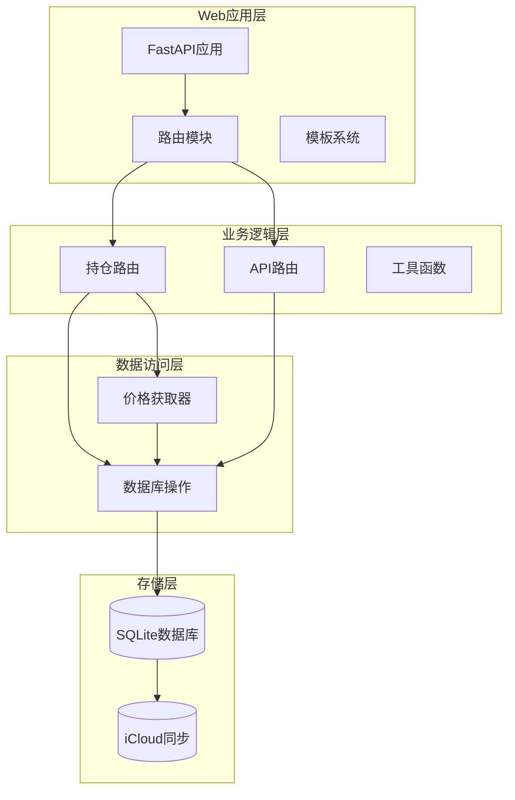
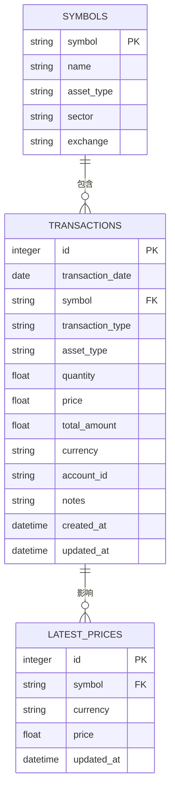
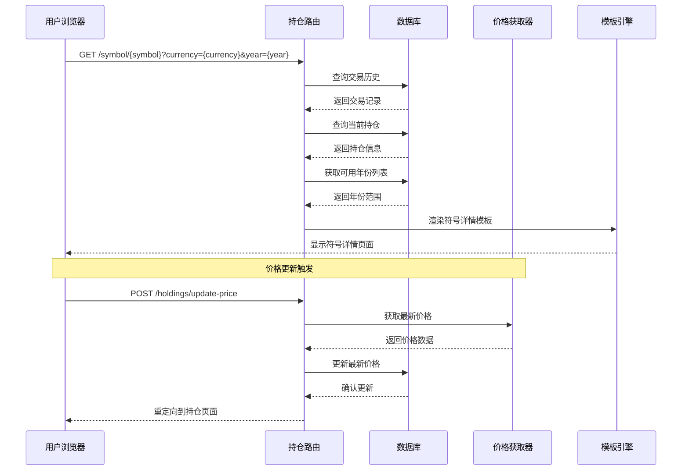
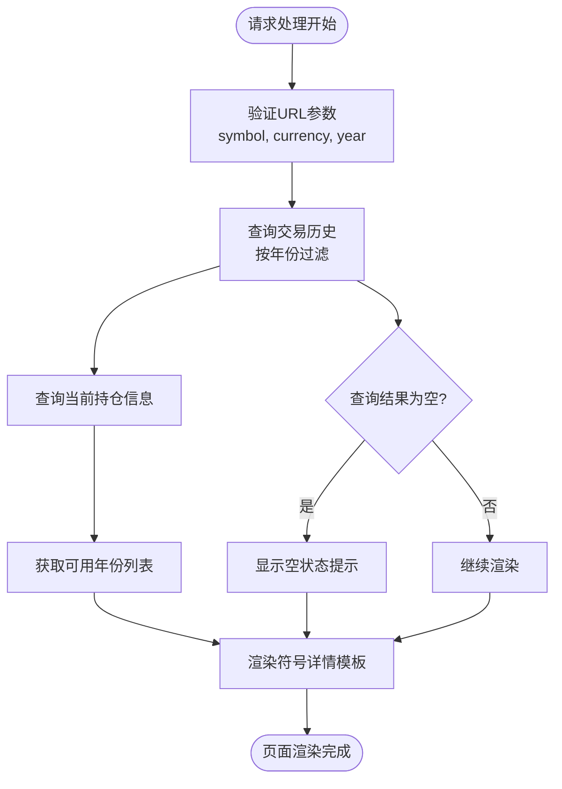
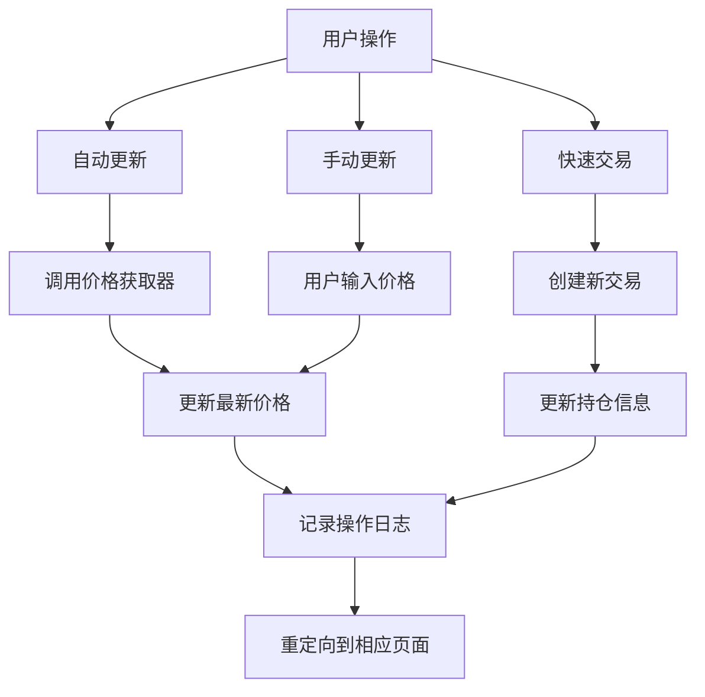
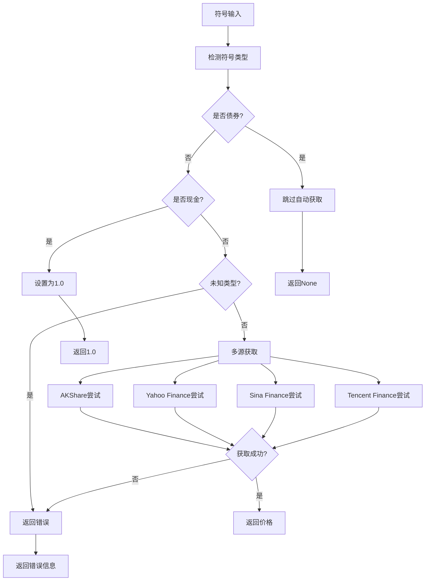
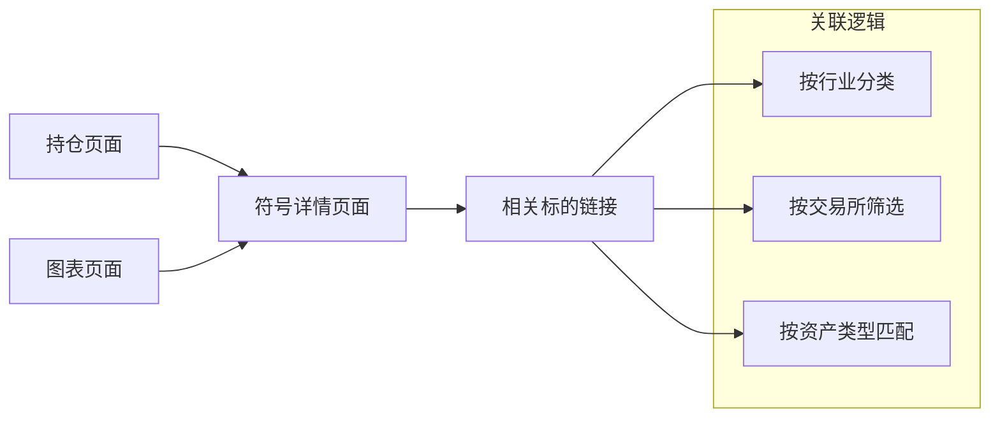
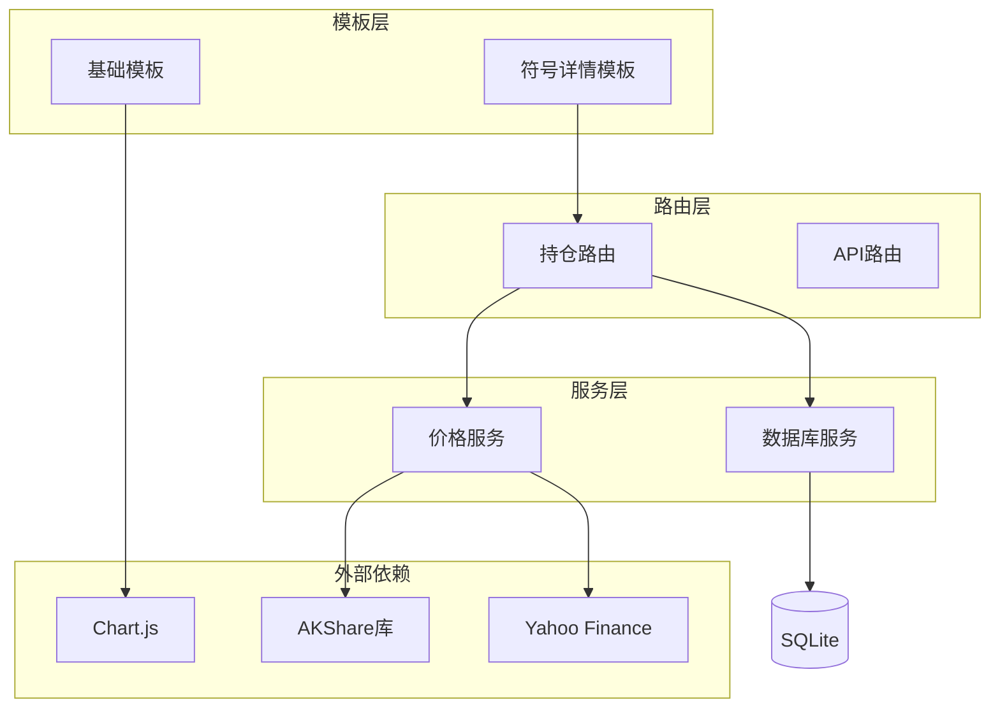
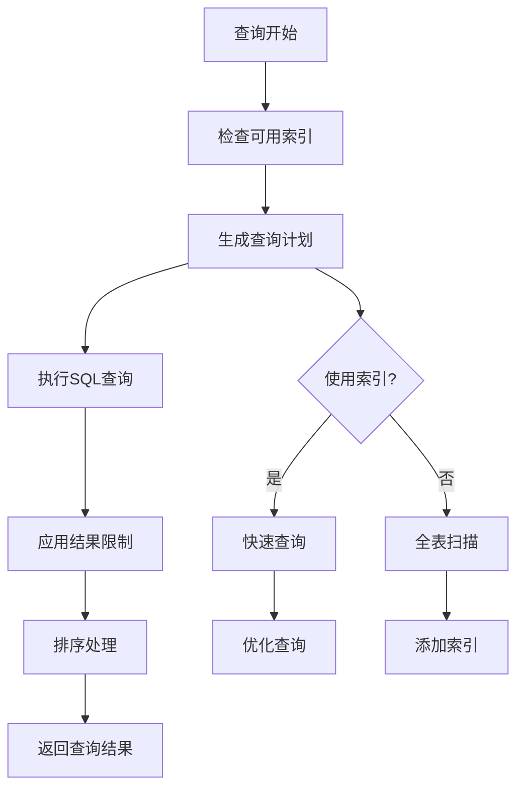
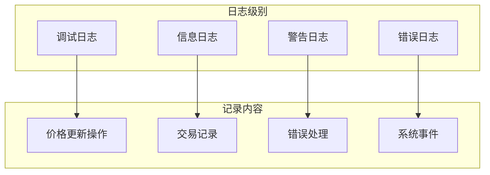

# 符号详情模板

<cite>
**本文档引用的文件**
- [templates/symbol.html](file://templates/symbol.html)
- [routers/holdings.py](file://routers/holdings.py)
- [database.py](file://database.py)
- [price_fetcher.py](file://price_fetcher.py)
- [templates/holdings.html](file://templates/holdings.html)
- [templates/base.html](file://templates/base.html)
- [templates/charts.html](file://templates/charts.html)
- [static/style.css](file://static/style.css)
- [app.py](file://app.py)
- [config.py](file://config.py)
</cite>

## 目录
1. [简介](#简介)
2. [项目结构](#项目结构)
3. [核心组件](#核心组件)
4. [架构概览](#架构概览)
5. [详细组件分析](#详细组件分析)
6. [依赖关系分析](#依赖关系分析)
7. [性能考虑](#性能考虑)
8. [故障排除指南](#故障排除指南)
9. [结论](#结论)

## 简介

符号详情模板是投资日志管理系统中的关键界面组件，负责展示单个投资标的的完整信息。该模板不仅提供符号的基本信息展示，还集成了交易历史查询、价格更新机制和多市场数据处理功能。通过清晰的布局设计和丰富的交互功能，为用户提供全面的投资组合洞察。

## 项目结构

投资日志管理系统采用模块化架构设计，主要由以下核心组件构成：

**图表来源**
- [app.py](file://app.py#L13-L29)
- [routers/holdings.py](file://routers/holdings.py#L11-L11)
- [database.py](file://database.py#L22-L188)

**章节来源**
- [app.py](file://app.py#L1-L34)
- [config.py](file://config.py#L1-L24)

## 核心组件

### 符号详情模板架构

符号详情模板采用响应式设计，包含以下主要功能模块：

1. **头部导航区域**：显示符号名称、货币标识和返回链接
2. **持仓摘要区域**：展示当前持有情况的统计信息
3. **价格调整区域**：允许用户手动调整资产价值
4. **交易历史区域**：分页展示详细的交易记录
5. **年份筛选功能**：支持按年份过滤交易历史

### 数据模型关系

**图表来源**
- [database.py](file://database.py#L105-L177)

**章节来源**
- [templates/symbol.html](file://templates/symbol.html#L1-L105)
- [database.py](file://database.py#L105-L177)

## 架构概览

符号详情页面的完整工作流程如下：

**图表来源**
- [routers/holdings.py](file://routers/holdings.py#L32-L76)
- [routers/holdings.py](file://routers/holdings.py#L102-L147)

## 详细组件分析

### 符号详情模板实现

#### 基本信息渲染机制

符号详情模板通过Jinja2模板引擎实现动态内容渲染：

**图表来源**
- [routers/holdings.py](file://routers/holdings.py#L32-L76)

#### 交易历史分页展示

模板实现了完整的交易历史展示功能：

| 字段 | 类型 | 显示格式 | 功能 |
|------|------|----------|------|
| 日期 | Date | YYYY-MM-DD | 交易发生日期 |
| 类型 | Enum | 带颜色徽章 | 买入/卖出/分红等 |
| 数量 | Float | 右对齐 | 交易数量 |
| 价格 | Float | 右对齐 | 单价 |
| 总额 | Float | 右对齐 | 数量×单价 |
| 备注 | String | 文本 | 交易说明 |

#### 价格更新触发机制

系统提供了多种价格更新方式：

**图表来源**
- [routers/holdings.py](file://routers/holdings.py#L102-L147)
- [price_fetcher.py](file://price_fetcher.py#L325-L402)

**章节来源**
- [templates/symbol.html](file://templates/symbol.html#L64-L103)
- [routers/holdings.py](file://routers/holdings.py#L32-L76)

### 多市场数据处理逻辑

系统支持四种主要市场的价格数据获取：

| 市场类型 | 符号示例 | 数据源优先级 | 特殊处理 |
|----------|----------|--------------|----------|
| A股 | 600xxx, SH600xxx | AKShare → Yahoo → Sina → Tencent | 需要市场前缀转换 |
| 港股 | 00001.HK, 00001 | AKShare → Yahoo → Sina → Tencent | 添加.HK后缀 |
| 美股 | AAPL, MSFT | AKShare → Yahoo → Sina → Tencent | 直接使用 |
| 黄金 | AU, GOLD | AKShare → Yahoo | 价格单位转换 |

#### 价格获取流程

**图表来源**
- [price_fetcher.py](file://price_fetcher.py#L36-L66)
- [price_fetcher.py](file://price_fetcher.py#L325-L402)

**章节来源**
- [price_fetcher.py](file://price_fetcher.py#L1-L405)

### 符号搜索功能实现

虽然符号详情模板本身不直接提供搜索功能，但系统通过以下方式实现符号相关功能：

1. **持仓页面链接**：从持仓页面可直接跳转到符号详情
2. **图表页面导航**：从图表页面可快速访问符号详情
3. **货币切换**：支持不同货币下的符号详情展示

### 相关标的推荐机制

系统通过以下方式提供相关标的关联：

**图表来源**
- [templates/holdings.html](file://templates/holdings.html#L48-L92)
- [templates/charts.html](file://templates/charts.html#L22-L28)

### 用户自定义标记功能

系统支持用户自定义标记的实现方式：

1. **标签字段**：在交易记录中预留标签字段
2. **备注功能**：通过交易备注记录用户标记
3. **资产类型分类**：通过资产类型实现基本分类标记

**章节来源**
- [database.py](file://database.py#L33-L47)
- [templates/symbol.html](file://templates/symbol.html#L14-L34)

## 依赖关系分析

### 组件耦合度分析

**图表来源**
- [templates/base.html](file://templates/base.html#L8)
- [routers/holdings.py](file://routers/holdings.py#L1-L10)
- [price_fetcher.py](file://price_fetcher.py#L23-L33)

### 数据流依赖

符号详情页面的数据流遵循以下模式：

1. **请求接收**：路由层接收HTTP请求并解析参数
2. **数据查询**：数据库层执行多表查询获取所需数据
3. **业务处理**：路由层进行数据聚合和计算
4. **模板渲染**：模板引擎生成最终HTML输出
5. **响应返回**：Web服务器返回完整的HTML页面

**章节来源**
- [routers/holdings.py](file://routers/holdings.py#L32-L76)
- [database.py](file://database.py#L331-L378)

## 性能考虑

### 查询优化策略

1. **索引优化**：数据库表已建立多个复合索引以加速查询
2. **分页机制**：交易历史默认限制500条记录，支持分页加载
3. **缓存策略**：最新价格数据存储在独立表中，避免重复查询
4. **条件过滤**：按年份和货币精确过滤减少数据传输

### 前端性能优化

1. **懒加载**：Chart.js图表按需加载，提高初始页面速度
2. **CSS优化**：样式文件经过压缩，减少网络传输
3. **模板缓存**：Jinja2模板编译后缓存，提升渲染效率
4. **静态资源**：Chart.js CDN加载，利用浏览器缓存

### 数据库性能优化

**图表来源**
- [database.py](file://database.py#L179-L186)

**章节来源**
- [database.py](file://database.py#L179-L186)
- [static/style.css](file://static/style.css#L1-L200)

## 故障排除指南

### 常见问题诊断

1. **符号详情页面空白**
   - 检查数据库连接是否正常
   - 验证符号是否存在且大小写正确
   - 确认货币参数有效

2. **价格更新失败**
   - 检查网络连接状态
   - 验证数据源可用性
   - 查看操作日志获取详细错误信息

3. **交易历史显示异常**
   - 检查数据库表结构完整性
   - 验证查询参数格式
   - 确认权限设置正确

### 调试工具使用

系统提供了完善的日志记录机制：

**图表来源**
- [routers/holdings.py](file://routers/holdings.py#L87-L147)
- [database.py](file://database.py#L829-L851)

**章节来源**
- [routers/holdings.py](file://routers/holdings.py#L87-L147)
- [database.py](file://database.py#L829-L851)

## 结论

符号详情模板作为投资日志管理系统的核心界面组件，成功实现了以下目标：

1. **功能完整性**：提供了符号基本信息展示、交易历史查询、价格更新等核心功能
2. **用户体验**：通过清晰的界面设计和响应式布局提升了用户操作体验
3. **技术架构**：采用模块化设计，具有良好的可维护性和扩展性
4. **性能表现**：通过多种优化策略确保了系统的高效运行

该模板为用户提供了全面的投资标的视图，是构建投资组合管理系统的理想起点。通过持续的功能增强和性能优化，可以进一步提升系统的实用价值和用户体验。