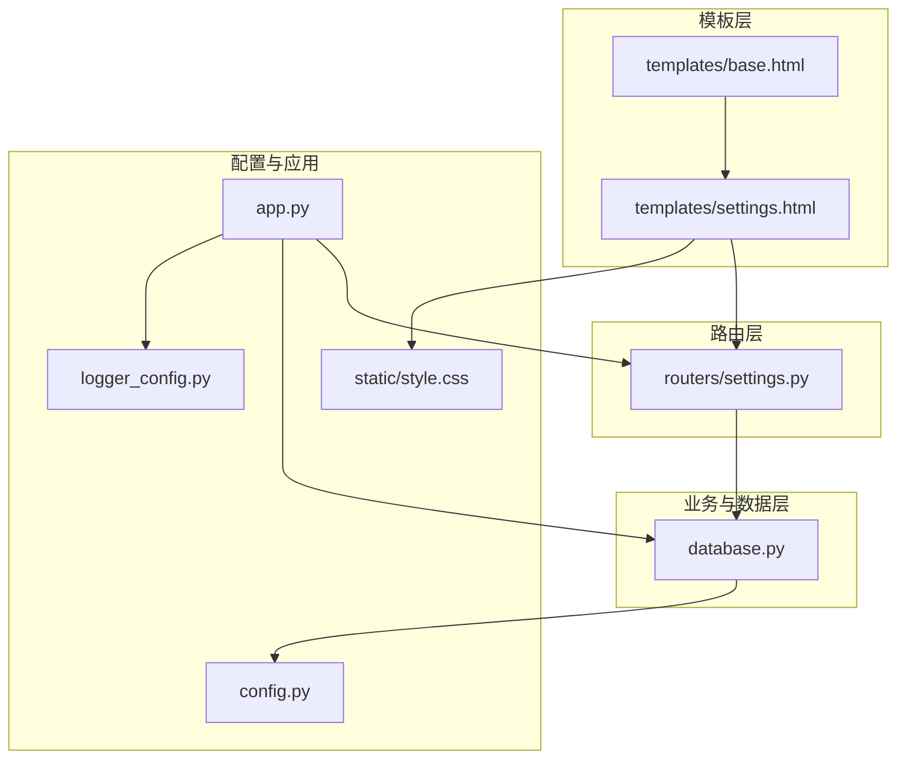
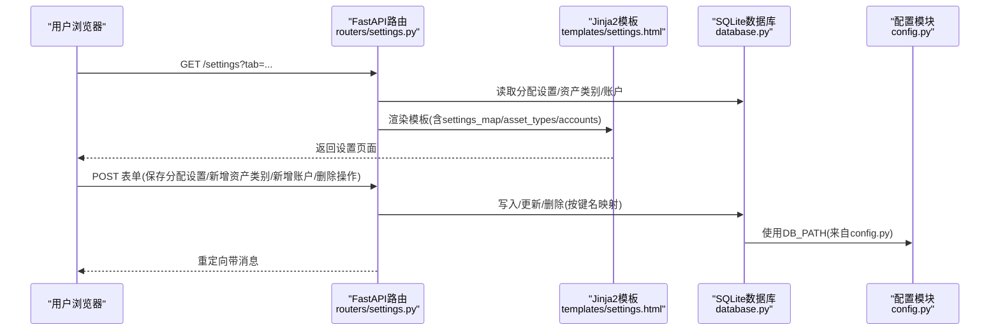
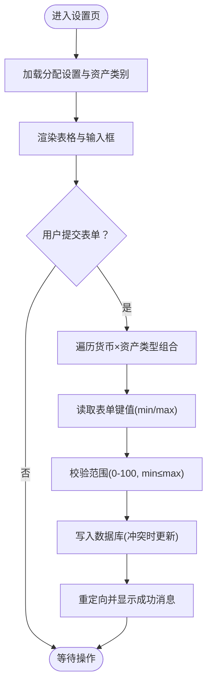
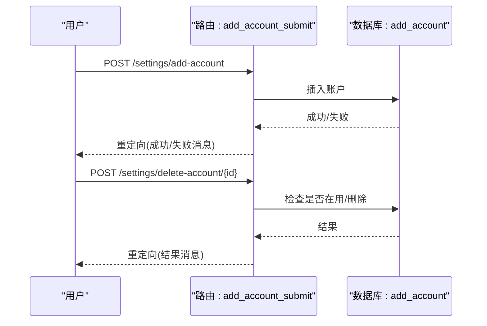
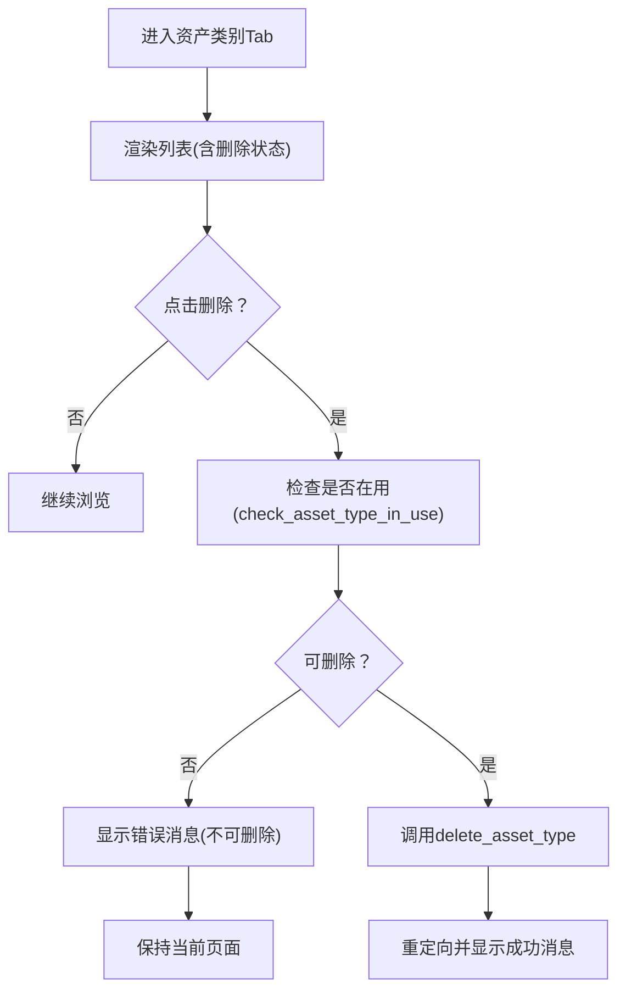
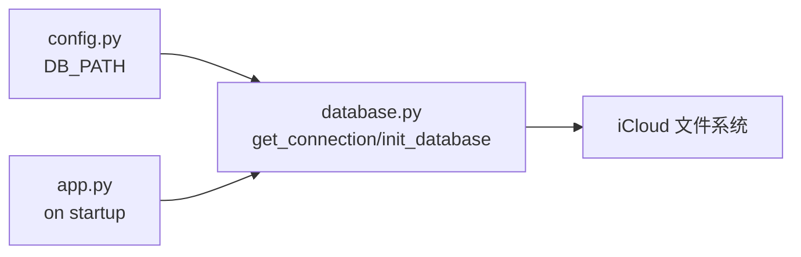
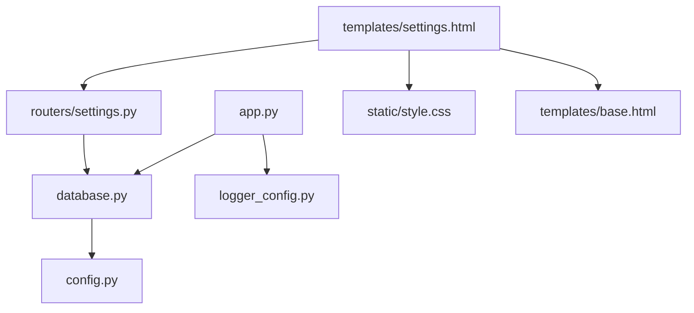

# 设置模板

<cite>
**本文引用的文件**
- [settings.html](file://templates/settings.html)
- [settings.py](file://routers/settings.py)
- [database.py](file://database.py)
- [config.py](file://config.py)
- [app.py](file://app.py)
- [style.css](file://static/style.css)
- [base.html](file://templates/base.html)
- [logger_config.py](file://logger_config.py)
</cite>

## 目录
1. [简介](#简介)
2. [项目结构](#项目结构)
3. [核心组件](#核心组件)
4. [架构总览](#架构总览)
5. [详细组件分析](#详细组件分析)
6. [依赖关系分析](#依赖关系分析)
7. [性能与可用性考虑](#性能与可用性考虑)
8. [故障排查指南](#故障排查指南)
9. [结论](#结论)
10. [附录：扩展与安全建议](#附录扩展与安全建议)

## 简介
本文件面向投资日志管理系统的“设置模板”，系统化阐述 settings.html 的配置管理功能与界面设计，覆盖以下主题：
- 账户设置、数据同步与系统参数的配置界面
- 设置项的数据绑定、验证规则与保存机制
- iCloud 同步配置、数据库连接设置与日志级别调整
- 设置变更的即时生效机制、配置导入导出与重置默认值的处理逻辑
- 设置模板的扩展指南与安全配置建议

## 项目结构
设置模板位于模板目录，配合路由层进行表单提交与持久化；数据库模块负责实际的存储与校验；配置模块集中管理数据库路径与 iCloud 同步路径；样式文件提供统一的视觉与交互体验。

图表来源
- [settings.html](file://templates/settings.html#L1-L202)
- [settings.py](file://routers/settings.py#L1-L148)
- [database.py](file://database.py#L1-L1047)
- [config.py](file://config.py#L1-L24)
- [app.py](file://app.py#L1-L34)
- [style.css](file://static/style.css#L1-L995)
- [base.html](file://templates/base.html#L1-L27)
- [logger_config.py](file://logger_config.py#L1-L54)

章节来源
- [settings.html](file://templates/settings.html#L1-L202)
- [settings.py](file://routers/settings.py#L1-L148)
- [database.py](file://database.py#L1-L1047)
- [config.py](file://config.py#L1-L24)
- [app.py](file://app.py#L1-L34)
- [style.css](file://static/style.css#L1-L995)
- [base.html](file://templates/base.html#L1-L27)
- [logger_config.py](file://logger_config.py#L1-L54)

## 核心组件
- 设置页面模板：提供三类设置的 Tab 切换界面，分别为“资产配置”、“账户管理”、“资产类别管理”。模板通过表单字段名与后端键名一一对应，完成数据绑定。
- 设置路由处理器：负责渲染页面、接收表单提交并调用数据库模块执行写入或删除等操作，同时返回带消息的重定向响应。
- 数据库模块：提供分配设置、账户、资产类别等的增删改查与约束校验，并在查询时用于计算持有情况与警告信息。
- 配置模块：集中定义 iCloud 数据库路径，支持本地开发环境覆盖。
- 应用启动：在启动时初始化数据库，确保表结构与默认数据存在。

章节来源
- [settings.html](file://templates/settings.html#L15-L201)
- [settings.py](file://routers/settings.py#L11-L148)
- [database.py](file://database.py#L711-L767)
- [config.py](file://config.py#L10-L23)
- [app.py](file://app.py#L18-L22)

## 架构总览
设置模板的请求-处理-持久化流程如下：

图表来源
- [settings.py](file://routers/settings.py#L11-L148)
- [settings.html](file://templates/settings.html#L27-L177)
- [database.py](file://database.py#L711-L767)
- [config.py](file://config.py#L17-L23)

## 详细组件分析

### 页面布局与交互
- Tab 切换：页面提供三个 Tab（资产配置、账户管理、资产类别），切换时通过 JavaScript 更新 URL 参数且不刷新页面，提升用户体验。
- 消息提示：当保存成功或失败时，路由层通过查询参数传递消息与类型，模板渲染后显示提示框，支持手动关闭。
- 表单结构：每个 Tab 下的表单均以 POST 提交至对应的路由端点，字段命名严格遵循模板中的 name 属性，便于后端解析。

章节来源
- [settings.html](file://templates/settings.html#L15-L201)

### 资产配置（Allocation）设置
- 数据绑定：模板为每种货币与资产类型的组合生成两个输入框（最小百分比、最大百分比），字段名为“{currency}_{asset_type}_min/max”，与后端遍历键名一致。
- 默认值与范围：输入框限制在 0-100，步进为 0.1；未设置时使用占位符与空值回显。
- 保存机制：后端遍历所有货币与资产类型，从表单读取 min/max 并调用数据库写入接口，最终重定向回设置页并显示成功消息。
- 即时生效：持有情况与警告计算在查询时基于最新分配设置动态生成，无需额外刷新。

图表来源
- [settings.html](file://templates/settings.html#L27-L66)
- [settings.py](file://routers/settings.py#L63-L86)
- [database.py](file://database.py#L726-L752)

章节来源
- [settings.html](file://templates/settings.html#L27-L66)
- [settings.py](file://routers/settings.py#L63-L86)
- [database.py](file://database.py#L726-L752)

### 账户管理（Accounts）
- 列表展示：显示账户 ID、名称、券商、类型以及可删除状态。
- 新增账户：表单要求账户 ID、名称必填，券商与类型可选；提交后调用数据库插入，若重复则返回错误消息。
- 删除账户：仅当账户无交易记录时允许删除；若存在交易则提示不可删除。

图表来源
- [settings.py](file://routers/settings.py#L118-L147)
- [database.py](file://database.py#L637-L695)

章节来源
- [settings.html](file://templates/settings.html#L69-L129)
- [settings.py](file://routers/settings.py#L118-L147)
- [database.py](file://database.py#L637-L695)

### 资产类别管理（Asset Types）
- 列表展示：显示代码、标签及删除状态；若被使用（存在交易记录）则禁用删除并给出提示。
- 新增资产类别：要求代码由字母或下划线组成，标签必填；提交后插入数据库，若重复则返回错误消息。
- 删除资产类别：若存在交易记录则禁止删除；否则成功删除并提示。

图表来源
- [settings.html](file://templates/settings.html#L131-L179)
- [settings.py](file://routers/settings.py#L101-L115)
- [database.py](file://database.py#L964-L996)
- [database.py](file://database.py#L1034-L1041)

章节来源
- [settings.html](file://templates/settings.html#L131-L179)
- [settings.py](file://routers/settings.py#L101-L115)
- [database.py](file://database.py#L964-L996)
- [database.py](file://database.py#L1034-L1041)

### 数据绑定、验证与保存机制
- 数据绑定：模板字段名与后端键名严格一致，确保表单提交能被正确解析。
- 验证规则：
  - 分配设置：范围 0-100，且最小值不大于最大值；非法值会被拒绝。
  - 资产类别新增：代码需满足正则模式（字母或下划线）。
  - 账户新增：账户 ID 与名称必填；代码重复或账户重复会触发错误。
- 保存机制：后端逐项写入数据库，使用“插入冲突时更新”的策略保证幂等；删除操作前先做依赖检查。

章节来源
- [settings.html](file://templates/settings.html#L44-L55)
- [settings.html](file://templates/settings.html#L169-L174)
- [settings.py](file://routers/settings.py#L63-L86)
- [database.py](file://database.py#L726-L752)
- [database.py](file://database.py#L943-L962)
- [database.py](file://database.py#L637-L657)

### iCloud 同步配置与数据库连接
- iCloud 路径：配置模块在 macOS 上定位 iCloud 应用目录，并在其中创建数据库文件，实现自动同步与备份。
- 开发覆盖：可通过环境变量覆盖数据库路径，便于本地开发与测试。
- 应用启动：应用启动时初始化数据库，确保表结构与默认数据存在。

图表来源
- [config.py](file://config.py#L10-L23)
- [database.py](file://database.py#L15-L22)
- [app.py](file://app.py#L18-L22)

章节来源
- [config.py](file://config.py#L10-L23)
- [database.py](file://database.py#L15-L22)
- [app.py](file://app.py#L18-L22)

### 日志级别与运行日志
- 日志配置：日志模块按天轮转，保留最近 7 天的日志文件，控制台与文件双通道输出。
- 应用启动：应用启动事件中记录初始化信息，便于追踪问题。

章节来源
- [logger_config.py](file://logger_config.py#L14-L53)
- [app.py](file://app.py#L18-L22)

### 设置变更的即时生效机制
- 持仓与分配计算：在查询持有情况时，系统会读取最新的分配设置并计算各资产类型的占比，从而实时显示是否超出设定范围。
- 模板渲染：模板根据数据库返回的分配结果直接渲染警告信息，无需额外刷新。

章节来源
- [database.py](file://database.py#L769-L822)

### 配置导入导出与重置默认值
- 导入/导出：当前代码未提供专门的导入导出接口。如需实现，可在路由层增加 CSV/JSON 导入/导出端点，并在数据库层提供批量写入/读取能力。
- 重置默认值：分配设置采用“插入冲突时更新”的策略，可视为对默认值的覆盖；若需完全重置，可在路由层提供一键清空并重新写入默认值的端点。

章节来源
- [database.py](file://database.py#L742-L748)

## 依赖关系分析
- 模板依赖：设置页面依赖基础模板与样式文件；路由依赖数据库模块与模板引擎。
- 数据依赖：数据库模块依赖配置模块提供的 DB_PATH；应用启动依赖数据库初始化。
- 日志依赖：路由层与应用启动均使用日志模块。

图表来源
- [settings.html](file://templates/settings.html#L1-L202)
- [settings.py](file://routers/settings.py#L1-L148)
- [database.py](file://database.py#L1-L1047)
- [config.py](file://config.py#L1-L24)
- [app.py](file://app.py#L1-L34)
- [style.css](file://static/style.css#L1-L995)
- [base.html](file://templates/base.html#L1-L27)
- [logger_config.py](file://logger_config.py#L1-L54)

章节来源
- [settings.html](file://templates/settings.html#L1-L202)
- [settings.py](file://routers/settings.py#L1-L148)
- [database.py](file://database.py#L1-L1047)
- [config.py](file://config.py#L1-L24)
- [app.py](file://app.py#L1-L34)
- [style.css](file://static/style.css#L1-L995)
- [base.html](file://templates/base.html#L1-L27)
- [logger_config.py](file://logger_config.py#L1-L54)

## 性能与可用性考虑
- 表单提交：每次保存分配设置会遍历所有货币与资产类型组合，提交量固定，性能开销可忽略。
- 查询计算：分配警告在查询持有情况时计算，避免额外缓存；若数据量增大，可考虑在数据库层增加索引或物化视图。
- 用户体验：Tab 切换无刷新、消息提示明确，有助于减少误操作与提高效率。

## 故障排查指南
- 保存失败：检查表单字段是否完整、数值是否在 0-100 且最小值不大于最大值；查看路由层返回的消息类型与内容。
- 账户/资产类别无法删除：确认是否存在交易记录；路由层会在删除前进行依赖检查并返回相应错误消息。
- iCloud 同步异常：确认 iCloud 应用目录存在且可写；必要时通过环境变量覆盖 DB_PATH 进行本地验证。
- 日志定位：查看日志目录下的按天轮转文件，结合应用启动与路由层日志定位问题。

章节来源
- [settings.py](file://routers/settings.py#L88-L115)
- [settings.py](file://routers/settings.py#L118-L147)
- [database.py](file://database.py#L670-L695)
- [database.py](file://database.py#L964-L996)
- [config.py](file://config.py#L17-L23)
- [logger_config.py](file://logger_config.py#L14-L53)

## 结论
设置模板通过清晰的三段式界面与严格的前后端数据绑定，实现了对分配设置、账户与资产类别的全生命周期管理。结合 iCloud 数据库路径与日志配置，系统具备良好的同步与可观测性。后续可在路由层扩展导入导出与一键重置能力，进一步提升运维效率与可维护性。

## 附录：扩展与安全建议
- 扩展建议
  - 导入导出：新增 CSV/JSON 导入/导出端点，支持分配设置、账户与资产类别的批量迁移。
  - 一键重置：提供重置默认值端点，清空现有设置并写入预设值。
  - 权限控制：为设置页面增加登录态校验与权限控制，防止未授权修改。
  - 审计日志：为关键设置变更增加审计日志记录，便于追溯。
- 安全建议
  - 输入校验：对所有外部输入进行严格校验与白名单过滤，避免注入风险。
  - 路径隔离：确保 DB_PATH 不指向系统关键目录，避免意外覆盖。
  - 环境变量：生产环境谨慎使用环境变量覆盖 DB_PATH，建议通过配置文件管理。
  - 日志脱敏：避免在日志中输出敏感信息（如账户号、交易明细），必要时进行脱敏处理。