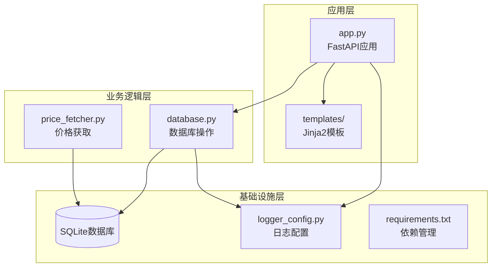
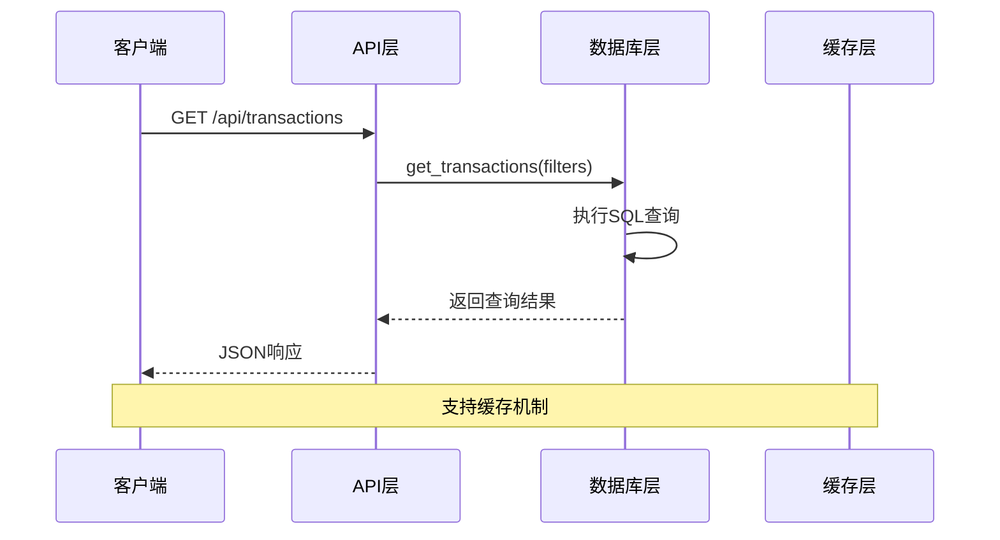
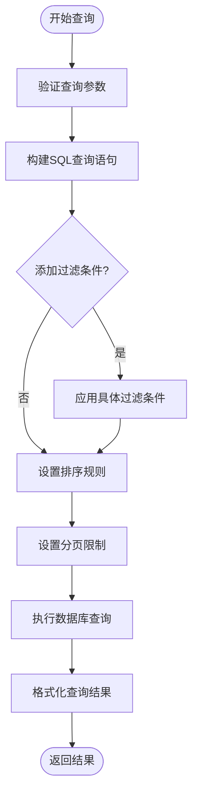
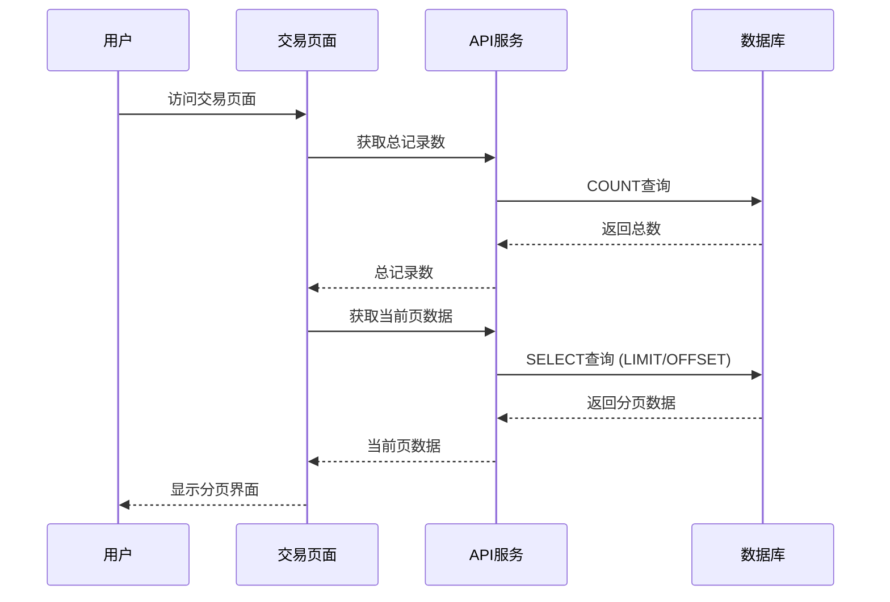
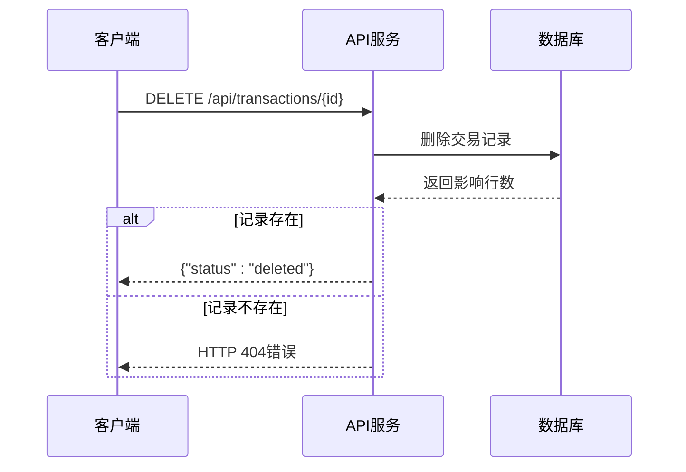
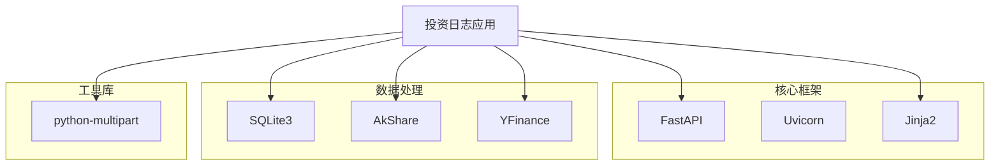
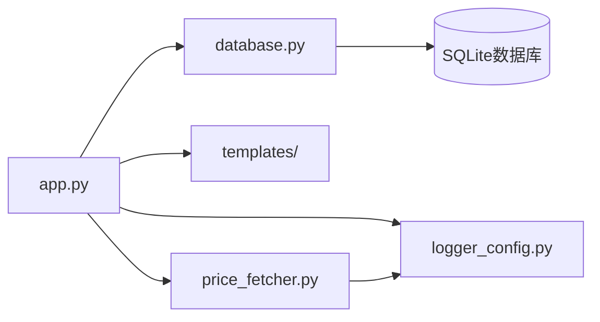

# 交易查询与过滤功能

<cite>
**本文档引用的文件**
- [app.py](file://app.py)
- [database.py](file://database.py)
- [templates/transactions.html](file://templates/transactions.html)
- [price_fetcher.py](file://price_fetcher.py)
- [logger_config.py](file://logger_config.py)
- [requirements.txt](file://requirements.txt)
</cite>

## 目录
1. [简介](#简介)
2. [项目结构](#项目结构)
3. [核心组件](#核心组件)
4. [架构概览](#架构概览)
5. [详细组件分析](#详细组件分析)
6. [依赖关系分析](#依赖关系分析)
7. [性能考虑](#性能考虑)
8. [故障排除指南](#故障排除指南)
9. [结论](#结论)

## 简介

投资日志系统的交易查询与过滤功能是整个应用的核心模块之一，负责提供灵活的交易记录检索能力。该功能支持多种查询条件，包括股票代码、账户ID、交易类型、日期范围等，并提供了完整的分页查询机制和性能优化策略。

系统采用SQLite作为数据存储后端，通过FastAPI提供RESTful API接口，配合Jinja2模板引擎生成用户界面。查询功能经过精心设计，既满足了基本的数据检索需求，又考虑了大数据集的处理效率。

## 项目结构

投资日志系统采用清晰的分层架构，主要包含以下核心文件：



**图表来源**
- [app.py](file://app.py#L1-L50)
- [database.py](file://database.py#L1-L50)

**章节来源**
- [app.py](file://app.py#L1-L50)
- [database.py](file://database.py#L1-L50)
- [requirements.txt](file://requirements.txt#L1-L6)

## 核心组件

### 查询接口设计

系统提供了两种主要的查询接口：

1. **HTML页面查询**：用于Web界面展示，支持分页显示
2. **RESTful API查询**：用于程序化访问，支持灵活的过滤条件

### 数据库查询函数

核心查询功能由`database.py`中的`get_transactions()`函数实现，支持以下过滤条件：

- 股票代码 (symbol)
- 账户ID (account_id)  
- 交易类型 (transaction_type)
- 货币类型 (currency)
- 年份筛选 (year)
- 日期范围 (start_date, end_date)
- 分页控制 (limit, offset)

**章节来源**
- [database.py](file://database.py#L262-L309)
- [app.py](file://app.py#L407-L421)

## 架构概览

系统采用经典的三层架构模式，查询功能贯穿各个层次：



**图表来源**
- [app.py](file://app.py#L407-L421)
- [database.py](file://database.py#L262-L309)

## 详细组件分析

### 交易查询API

#### 接口定义

系统提供统一的交易查询API，支持多种查询参数：

**HTTP方法**: GET
**路径**: `/api/transactions`

**查询参数**:
- `symbol`: 股票代码 (可选)
- `account_id`: 账户ID (可选)  
- `transaction_type`: 交易类型 (可选)
- `limit`: 结果数量限制 (默认100)

**返回格式**:
```json
[
  {
    "id": 1,
    "transaction_date": "2024-01-15",
    "symbol": "AAPL",
    "transaction_type": "BUY",
    "quantity": 10,
    "price": 150.0,
    "total_amount": 1500.0,
    "account_id": "ACC001",
    "currency": "USD"
  }
]
```

#### 查询实现流程



**图表来源**
- [database.py](file://database.py#L278-L304)

**章节来源**
- [app.py](file://app.py#L407-L421)
- [database.py](file://database.py#L262-L309)

### 分页查询机制

#### 前端分页实现

系统在Web界面中实现了完整的分页功能：



**图表来源**
- [app.py](file://app.py#L48-L66)
- [database.py](file://database.py#L903-L937)

#### 分页参数配置

- **每页记录数**: 100条
- **偏移量计算**: `(page - 1) * per_page`
- **总页数计算**: `(total_count + per_page - 1) // per_page`

**章节来源**
- [app.py](file://app.py#L48-L66)
- [templates/transactions.html](file://templates/transactions.html#L53-L80)

### 过滤条件详解

#### 支持的过滤类型

系统支持以下多种过滤条件的组合使用：

| 过滤条件 | 参数名 | 类型 | 描述 |
|---------|--------|------|------|
| 股票代码 | symbol | 字符串 | 精确匹配股票代码 |
| 账户ID | account_id | 字符串 | 精确匹配账户标识 |
| 交易类型 | transaction_type | 字符串 | 精确匹配交易类型 |
| 货币类型 | currency | 字符串 | 精确匹配货币代码 |
| 年份筛选 | year | 整数 | 基于交易日期的年份过滤 |
| 开始日期 | start_date | 日期 | 交易日期大于等于此值 |
| 结束日期 | end_date | 日期 | 交易日期小于等于此值 |

#### SQL查询构建逻辑

```mermaid
flowchart LR
Query["SELECT * FROM transactions WHERE 1=1"] --> Params["参数列表"]
Params --> Symbol{"symbol存在?"}
Symbol --> |是| AddSymbol["AND symbol = ?"]
Symbol --> |否| Account{"account_id存在?"}
AddSymbol --> Account
Account --> |是| AddAccount["AND account_id = ?"]
Account --> |否| Type{"transaction_type存在?"}
AddAccount --> Type
Type --> |是| AddType["AND transaction_type = ?"]
Type --> |否| Currency{"currency存在?"}
AddType --> Currency
Currency --> |是| AddCurrency["AND currency = ?"]
Currency --> |否| Year{"year存在?"}
AddCurrency --> Year
Year --> |是| AddYear["AND strftime('%Y', transaction_date) = ?"]
Year --> |否| DateRange{"日期范围?"}
AddYear --> DateRange
DateRange --> |是| AddDateRange["AND transaction_date BETWEEN ? AND ?"]
DateRange --> |否| Order["ORDER BY transaction_date DESC"]
AddDateRange --> Order
Order --> Limit["LIMIT ? OFFSET ?"]
```



**图表来源**
- [database.py](file://database.py#L278-L304)

**章节来源**
- [database.py](file://database.py#L262-L309)

### 排序规则

查询结果按照以下优先级进行排序：

1. **主要排序**: `transaction_date DESC` (按日期降序)
2. **次要排序**: `id DESC` (按ID降序)

这种排序规则确保最新的交易记录优先显示，同时保持同一天内交易的稳定排序。

**章节来源**
- [database.py](file://database.py#L303-L304)

### 错误处理机制

系统实现了完善的错误处理机制：

#### API错误处理



**图表来源**
- [app.py](file://app.py#L450-L458)

#### 日志记录

系统使用结构化日志记录所有重要操作：

- **信息级别**: 交易添加、价格更新等正常操作
- **警告级别**: 删除不存在的交易等异常情况
- **调试级别**: 价格获取过程中的详细信息

**章节来源**
- [app.py](file://app.py#L450-L458)
- [logger_config.py](file://logger_config.py#L1-L54)

## 依赖关系分析

### 外部依赖

系统依赖以下外部库：



**图表来源**
- [requirements.txt](file://requirements.txt#L1-L6)

### 内部模块依赖



**图表来源**
- [app.py](file://app.py#L1-L20)
- [database.py](file://database.py#L1-L20)

**章节来源**
- [requirements.txt](file://requirements.txt#L1-L6)
- [app.py](file://app.py#L1-L20)

## 性能考虑

### 索引优化策略

系统在数据库层面实现了多维度索引优化：

| 索引名称 | 列组合 | 用途 | 性能提升 |
|---------|--------|------|----------|
| idx_symbol | symbol | 股票代码查询 | 高频股票搜索 |
| idx_date | transaction_date | 日期范围查询 | 交易历史分析 |
| idx_account | account_id | 账户筛选 | 账户管理功能 |
| idx_type | transaction_type | 交易类型过滤 | 报表统计 |
| idx_currency | currency | 货币类型筛选 | 多币种支持 |
| idx_asset_type | asset_type | 资产类型查询 | 投资组合分析 |

### 查询性能优化

#### 1. 分页查询优化
- 使用LIMIT和OFFSET避免一次性加载大量数据
- 每页固定100条记录，平衡内存使用和网络传输
- 先查询COUNT再查询数据，避免重复扫描

#### 2. 索引利用策略
- WHERE子句中的过滤条件会自动利用相应索引
- 复合查询条件优先使用最有效的索引
- 避免在WHERE子句中对列进行函数操作

#### 3. 数据库连接管理
- 使用row_factory提供字典式结果访问
- 合理管理数据库连接生命周期
- 避免连接泄漏和资源浪费

### 大数据集处理策略

对于大规模交易数据，系统采用了以下策略：

1. **分页加载**: 默认每页100条记录，支持无限滚动
2. **索引优化**: 为常用查询字段建立索引
3. **查询限制**: 默认限制返回100条记录，防止内存溢出
4. **缓存机制**: 对热点数据进行缓存

**章节来源**
- [database.py](file://database.py#L140-L147)
- [app.py](file://app.py#L48-L66)

## 故障排除指南

### 常见问题及解决方案

#### 1. 查询结果为空

**可能原因**:
- 过滤条件过于严格
- 数据库中没有匹配的记录
- 时间范围设置不当

**解决方法**:
- 检查过滤参数是否正确
- 尝试放宽查询条件
- 验证数据是否存在

#### 2. 性能问题

**症状**: 查询响应缓慢

**诊断步骤**:
- 检查数据库索引是否完整
- 分析查询执行计划
- 监控数据库连接状态

**优化建议**:
- 使用更精确的过滤条件
- 减少查询范围
- 考虑数据归档策略

#### 3. 分页显示异常

**症状**: 分页链接显示不正确或数据重复

**检查要点**:
- 确认COUNT查询和数据查询使用相同的过滤条件
- 验证LIMIT和OFFSET参数计算
- 检查排序字段的一致性

**章节来源**
- [app.py](file://app.py#L48-L66)
- [database.py](file://database.py#L903-L937)

### 日志分析

系统提供了详细的日志记录，可用于问题诊断：

#### 关键日志类型

| 日志级别 | 用途 | 示例内容 |
|---------|------|----------|
| INFO | 正常操作 | "Transaction added: BUY 10 AAPL @ 150 USD" |
| WARNING | 异常情况 | "Transaction not found for deletion: id=123" |
| DEBUG | 详细信息 | "Price update requested: AAPL USD" |

**章节来源**
- [logger_config.py](file://logger_config.py#L1-L54)
- [app.py](file://app.py#L96-L110)

## 结论

投资日志系统的交易查询与过滤功能经过精心设计，具有以下特点：

### 优势特性

1. **灵活的查询接口**: 支持多种过滤条件的组合使用
2. **高效的分页机制**: 通过索引和分页策略优化大数据集处理
3. **完善的错误处理**: 提供清晰的错误反馈和日志记录
4. **良好的扩展性**: 模块化设计便于功能扩展和维护

### 性能表现

- **查询速度**: 通过索引优化和合理的查询设计，保证了良好的响应性能
- **内存使用**: 分页查询避免了大结果集的内存占用
- **并发处理**: 基于FastAPI的异步处理能力支持高并发访问

### 改进建议

1. **缓存机制**: 可以考虑添加查询结果缓存，提高频繁查询的性能
2. **全文搜索**: 对于复杂的文本搜索需求，可以考虑添加全文搜索引擎
3. **查询统计**: 添加查询使用统计，帮助优化查询性能
4. **数据可视化**: 增加更多图表和报表功能，提升用户体验

该查询系统为投资日志应用提供了坚实的基础，能够满足日常交易记录管理和分析的各种需求。