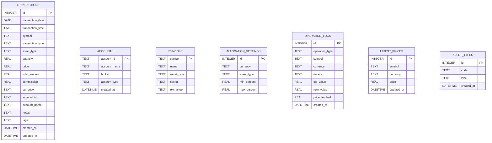

# 交易管理功能

<cite>
**本文档引用的文件**
- [app.py](file://app.py)
- [database.py](file://database.py)
- [templates/transactions.html](file://templates/transactions.html)
- [templates/add.html](file://templates/add.html)
- [templates/symbol.html](file://templates/symbol.html)
- [templates/base.html](file://templates/base.html)
- [requirements.txt](file://requirements.txt)
</cite>

## 目录
1. [简介](#简介)
2. [项目结构](#项目结构)
3. [核心组件](#核心组件)
4. [架构概览](#架构概览)
5. [详细组件分析](#详细组件分析)
6. [依赖关系分析](#依赖关系分析)
7. [性能考虑](#性能考虑)
8. [故障排除指南](#故障排除指南)
9. [结论](#结论)
10. [附录](#附录)

## 简介

投资日志系统的交易管理功能是一个基于FastAPI和SQLite的Web应用，专门用于跟踪和管理各种金融交易活动。该系统支持多种交易类型，包括买入、卖出、分红、拆股、转账和资产调整等操作，为用户提供完整的投资组合管理解决方案。

系统采用现代化的Web技术栈，结合了Python后端处理、Jinja2模板渲染和前端交互功能，提供了直观易用的用户界面和强大的数据管理能力。

## 项目结构

该项目采用清晰的模块化组织结构，主要包含以下核心组件：


**图表来源**
- [app.py](file://app.py#L1-L50)
- [database.py](file://database.py#L1-L50)

**章节来源**
- [app.py](file://app.py#L1-L50)
- [database.py](file://database.py#L1-L50)
- [requirements.txt](file://requirements.txt#L1-L6)

## 核心组件

### 应用程序入口点

主应用程序文件负责定义所有HTTP端点、路由处理和业务逻辑协调。系统启动时会自动初始化数据库并建立必要的表结构。

### 数据库管理模块

数据库模块提供了完整的CRUD操作接口，包括交易记录的增删改查、账户管理、资产类型管理和分配设置等功能。所有数据操作都通过SQLite数据库进行持久化存储。

### 模板渲染系统

使用Jinja2模板引擎渲染HTML页面，提供响应式的用户界面。模板系统支持条件渲染、循环遍历和数据格式化等功能。

**章节来源**
- [app.py](file://app.py#L19-L30)
- [database.py](file://database.py#L20-L50)

## 架构概览

系统采用经典的三层架构设计，实现了清晰的关注点分离：


**图表来源**
- [app.py](file://app.py#L36-L110)
- [database.py](file://database.py#L156-L255)

系统的核心优势在于其模块化设计，每个组件都有明确的职责边界，便于维护和扩展。

**章节来源**
- [app.py](file://app.py#L36-L110)
- [database.py](file://database.py#L156-L255)

## 详细组件分析

### 交易数据模型

交易系统的核心数据模型定义在SQLite数据库中，具有以下关键字段：



**图表来源**
- [database.py](file://database.py#L25-L146)

#### 交易类型分类机制

系统支持七种主要的交易类型，每种类型都有特定的业务含义和会计处理方式：

| 交易类型 | 描述 | 会计处理 | 用途 |
|---------|------|----------|------|
| BUY | 买入交易 | 增加持有量，增加成本 | 资产购买 |
| SELL | 卖出交易 | 减少持有量，减少成本 | 资产出售 |
| DIVIDEND | 分红收入 | 记录收入，不影响持有量 | 收益获取 |
| SPLIT | 拆股 | 数量按比例调整，单价相应调整 | 公司拆分 |
| TRANSFER_IN | 转入交易 | 增加持有量，不改变成本 | 资产转移 |
| TRANSFER_OUT | 转出交易 | 减少持有量，不改变成本 | 资产转移 |
| ADJUST | 价值调整 | 记录价值变化，不影响数量 | 重估调整 |

#### 资产类型管理系统

系统支持四种基础资产类型，每种类型都有对应的中文标签：

- **stock**: 股票 - 股权类投资工具
- **bond**: 债券 - 固定收益类投资工具  
- **metal**: 贵金属 - 商品类投资工具
- **cash**: 现金 - 流动性资产

**章节来源**
- [database.py](file://database.py#L25-L46)
- [database.py](file://database.py#L605-L612)

### 交易CRUD操作实现

#### 添加交易功能

添加交易是系统最核心的功能之一，通过统一的API端点处理各种类型的交易输入：


**图表来源**
- [app.py](file://app.py#L83-L110)
- [database.py](file://database.py#L156-L193)

添加交易时的关键验证逻辑包括：
- 日期格式验证和转换
- 符号名称的大写标准化
- 数值字段的范围检查
- 交易类型的完整性验证
- 货币代码的有效性检查

#### 查看交易历史

交易历史页面提供分页浏览功能，支持多种过滤条件：


**图表来源**
- [app.py](file://app.py#L48-L66)
- [database.py](file://database.py#L903-L937)

分页机制采用固定大小的页面（默认100条记录），通过OFFSET和LIMIT实现高效的数据检索。

#### 删除交易功能

系统提供安全的交易删除机制，通过RESTful API实现：


**图表来源**
- [templates/transactions.html](file://templates/transactions.html#L82-L89)
- [app.py](file://app.py#L433-L441)
- [database.py](file://database.py#L247-L255)

删除操作包含完整的错误处理和日志记录机制，确保数据操作的可追溯性。

**章节来源**
- [app.py](file://app.py#L48-L110)
- [database.py](file://database.py#L156-L255)

### 交易表单验证逻辑

交易表单采用客户端和服务端双重验证机制：

#### 客户端验证特性

表单模板集成了JavaScript验证功能，提供实时反馈：

- **符号输入**: 自动转换为大写字母
- **数量和价格**: 支持小数输入，限制最小值为0
- **货币选择**: 下拉菜单提供预定义选项
- **总金额计算**: 实时显示计算结果

#### 服务端验证流程


**图表来源**
- [app.py](file://app.py#L83-L110)
- [templates/add.html](file://templates/add.html#L92-L109)

**章节来源**
- [templates/add.html](file://templates/add.html#L1-L111)
- [app.py](file://app.py#L83-L110)

### 查询过滤功能

系统提供灵活的查询过滤机制，支持多维度的数据检索：

#### 过滤条件支持

| 过滤类型 | 参数名 | 说明 | 默认值 |
|---------|--------|------|--------|
| 符号过滤 | symbol | 证券代码 | None |
| 账户过滤 | account_id | 账户标识 | None |
| 类型过滤 | transaction_type | 交易类型 | None |
| 货币过滤 | currency | 货币代码 | None |
| 年份过滤 | year | 交易年份 | None |
| 日期范围 | start_date/end_date | 日期范围 | None |
| 结果限制 | limit | 返回数量限制 | 100 |

#### 查询优化策略

数据库层通过索引优化提升查询性能：
- `idx_symbol`: 提升符号查询速度
- `idx_date`: 支持时间范围查询
- `idx_account`: 加速账户过滤
- `idx_type`: 优化类型筛选
- `idx_currency`: 支持货币分组
- `idx_asset_type`: 加速资产类型查询

**章节来源**
- [database.py](file://database.py#L262-L309)
- [database.py](file://database.py#L140-L146)

### API接口文档

系统提供RESTful API接口，支持前后端分离的应用场景：

#### 交易管理API

| 端点 | 方法 | 功能 | 请求参数 | 响应数据 |
|------|------|------|----------|----------|
| `/api/transactions` | GET | 获取交易列表 | symbol, account_id, transaction_type, limit | 交易数组 |
| `/api/transactions/{id}` | DELETE | 删除指定交易 | - | {"status": "deleted"} |
| `/api/holdings` | GET | 获取当前持仓 | account_id | 持仓数组 |
| `/api/holdings-by-currency` | GET | 按货币分组的持仓 | - | 汇总数据 |
| `/api/portfolio-history` | GET | 投资组合历史 | - | 时间序列数据 |

#### 使用示例

**获取交易列表**
```bash
curl "http://localhost:8000/api/transactions?symbol=AAPL&limit=50"
```

**删除交易**
```bash
curl -X DELETE "http://localhost:8000/api/transactions/123"
```

**获取持仓信息**
```bash
curl "http://localhost:8000/api/holdings?account_id=broker-001"
```

**章节来源**
- [app.py](file://app.py#L390-L441)

## 依赖关系分析

系统依赖关系清晰明确，各组件间耦合度低，便于维护和扩展：


**图表来源**
- [requirements.txt](file://requirements.txt#L1-L6)
- [app.py](file://app.py#L7-L17)

**章节来源**
- [requirements.txt](file://requirements.txt#L1-L6)

## 性能考虑

### 数据库性能优化

系统采用多项性能优化策略：

1. **索引优化**: 为常用查询字段建立索引，提升查询效率
2. **分页机制**: 限制单次查询返回的数据量，避免内存溢出
3. **连接池**: 使用SQLite的连接复用机制
4. **查询缓存**: 对频繁访问的数据进行缓存

### 内存管理

- 使用生成器模式处理大量数据
- 及时关闭数据库连接
- 合理控制模板渲染的数据量

### 网络优化

- 静态资源缓存
- 压缩传输内容
- 异步处理长耗时操作

## 故障排除指南

### 常见问题及解决方案

#### 数据库初始化失败

**症状**: 应用启动时报数据库相关错误
**原因**: 数据库文件权限问题或SQLite版本不兼容
**解决方法**: 
1. 检查数据库文件权限
2. 确认SQLite版本满足要求
3. 重新初始化数据库

#### 交易添加失败

**症状**: 添加交易后无响应或报错
**原因**: 表单验证失败或数据库约束冲突
**解决方法**:
1. 检查必填字段是否完整
2. 验证数值格式和范围
3. 确认交易类型和货币代码有效

#### 查询结果异常

**症状**: 交易查询结果不正确或缺失
**原因**: 查询参数错误或索引失效
**解决方法**:
1. 检查查询参数格式
2. 清理并重建数据库索引
3. 验证数据完整性

**章节来源**
- [database.py](file://database.py#L20-L50)
- [app.py](file://app.py#L25-L30)

## 结论

投资日志系统的交易管理功能展现了现代Web应用的良好实践，具有以下显著特点：

1. **模块化设计**: 清晰的组件分离和职责划分
2. **数据完整性**: 强类型约束和全面的验证机制
3. **用户体验**: 直观的界面和流畅的操作体验
4. **可扩展性**: 灵活的架构支持未来功能扩展
5. **性能优化**: 多层次的性能优化策略

该系统为个人投资者提供了完整的交易管理解决方案，既适合日常使用，也为进一步的功能增强奠定了坚实基础。

## 附录

### 开发指南

#### 新增交易类型

如需添加新的交易类型，需要修改以下位置：
1. 数据库表结构定义
2. 交易类型枚举验证
3. 业务逻辑处理分支
4. 前端表单选项

#### 批量操作开发

建议的批量操作实现方案：
1. **批量导入**: CSV文件上传和解析
2. **批量删除**: 多选删除功能
3. **批量更新**: 统一修改属性
4. **数据导出**: 支持多种格式导出

#### 性能监控

建议实施的监控指标：
- 数据库查询响应时间
- API端点吞吐量
- 内存使用情况
- 错误率统计