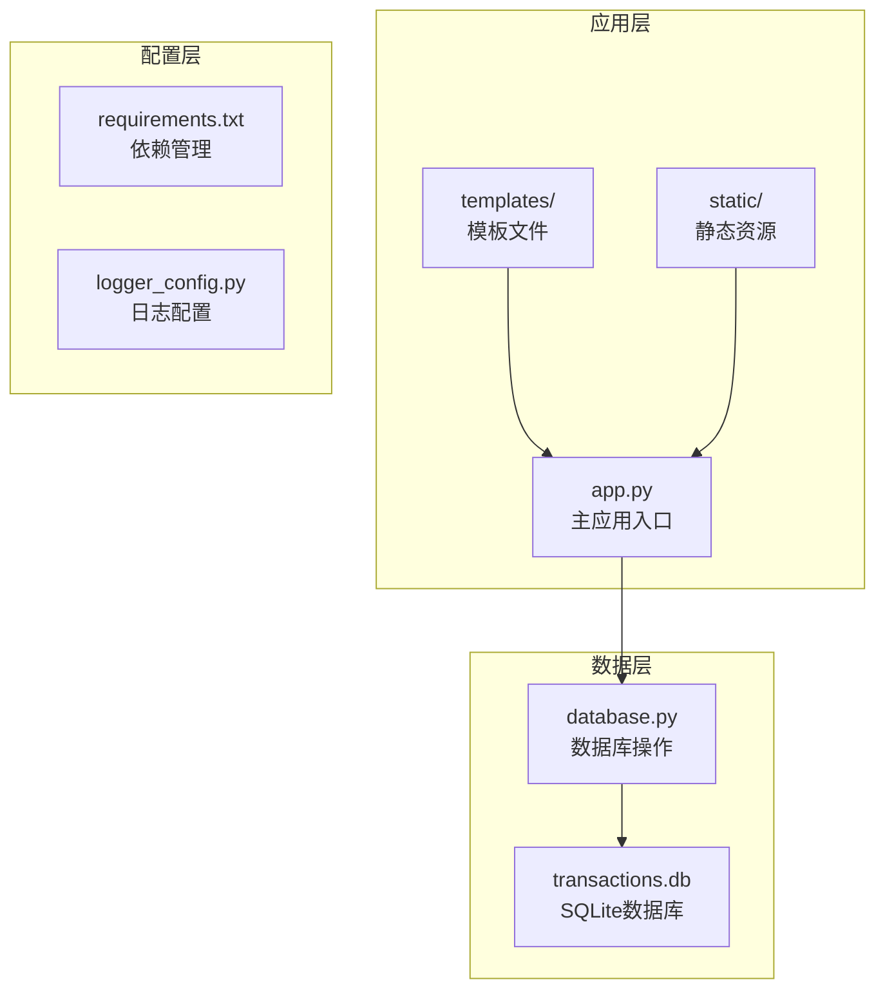
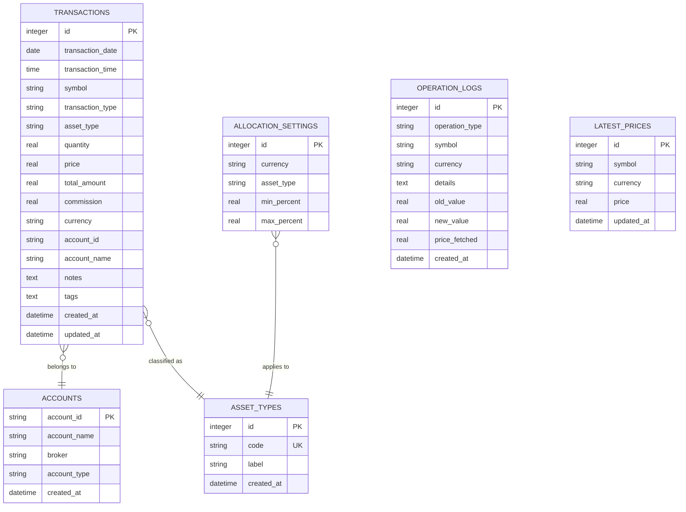
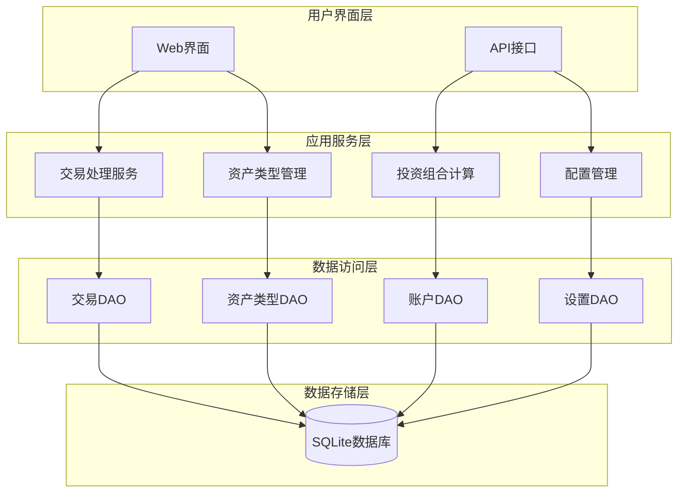
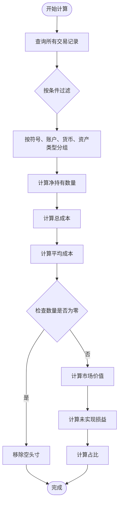
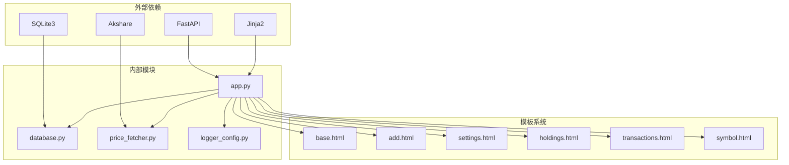

# 交易类型分类管理

<cite>
**本文档引用的文件**
- [app.py](file://app.py)
- [database.py](file://database.py)
- [requirements.txt](file://requirements.txt)
- [templates/settings.html](file://templates/settings.html)
- [templates/add.html](file://templates/add.html)
- [templates/holdings.html](file://templates/holdings.html)
- [templates/transactions.html](file://templates/transactions.html)
- [templates/symbol.html](file://templates/symbol.html)
- [templates/base.html](file://templates/base.html)
</cite>

## 目录
1. [简介](#简介)
2. [项目结构](#项目结构)
3. [核心组件](#核心组件)
4. [架构概览](#架构概览)
5. [详细组件分析](#详细组件分析)
6. [依赖关系分析](#依赖关系分析)
7. [性能考虑](#性能考虑)
8. [故障排除指南](#故障排除指南)
9. [结论](#结论)
10. [附录](#附录)

## 简介

投资日志系统的交易类型分类管理是一个核心功能模块，负责管理和处理各种金融交易类型。该系统支持多种交易类型，包括买入、卖出、分红、拆股、转账等，并提供了完整的会计处理、投资组合影响分析和数据存储管理功能。

系统采用FastAPI框架构建，使用SQLite作为数据存储后端，通过Jinja2模板引擎提供Web界面。交易类型管理不仅涉及数据存储，还包括业务逻辑验证、会计处理规则和投资组合计算等多个方面。

## 项目结构

项目采用清晰的分层架构设计，主要包含以下核心目录和文件：

**图表来源**
- [app.py](file://app.py#L1-L50)
- [database.py](file://database.py#L1-L50)

**章节来源**
- [app.py](file://app.py#L1-L50)
- [database.py](file://database.py#L1-L50)
- [requirements.txt](file://requirements.txt#L1-L6)

## 核心组件

### 交易类型定义

系统支持以下七种主要交易类型，每种类型都有特定的业务含义和会计处理规则：

| 交易类型 | 编码 | 中文名称 | 业务含义 |
|---------|------|----------|----------|
| 买入 | BUY | 买入 | 购买证券或资产 |
| 卖出 | SELL | 卖出 | 出售证券或资产 |
| 分红 | DIVIDEND | 分红 | 收到投资收益 |
| 拆股 | SPLIT | 拆股 | 股票分割调整 |
| 转账入 | TRANSFER_IN | 转账入 | 资产转入 |
| 转出 | TRANSFER_OUT | 转出 | 资产转出 |
| 调整 | ADJUST | 调整 | 价值调整 |

### 数据存储结构

交易数据存储在SQLite数据库中，采用规范化设计确保数据完整性和查询效率：

**图表来源**
- [database.py](file://database.py#L25-L146)

**章节来源**
- [database.py](file://database.py#L25-L146)

## 架构概览

系统采用MVC架构模式，结合RESTful API设计原则：

**图表来源**
- [app.py](file://app.py#L36-L121)
- [database.py](file://database.py#L156-L310)

**章节来源**
- [app.py](file://app.py#L36-L121)
- [database.py](file://database.py#L156-L310)

## 详细组件分析

### 交易类型会计处理

每种交易类型都有特定的会计处理规则，用于正确计算投资组合的价值和收益：

#### 买入交易 (BUY)
- **资产影响**: 增加持有的证券数量
- **成本计算**: 总金额 = 数量 × 价格 + 手续费
- **会计分录**: 借记投资资产，贷记银行存款

#### 卖出交易 (SELL)
- **资产影响**: 减少持有的证券数量
- **收益计算**: 实现收益 = 总收入 - (成本 + 手续费)
- **会计分录**: 借记银行存款，贷记投资资产，确认收益

#### 分红交易 (DIVIDEND)
- **现金流影响**: 正面现金流
- **收益性质**: 投资收益而非资本增值
- **会计处理**: 记录为投资收益

#### 拆股交易 (SPLIT)
- **数量调整**: 股份数量按比例增加
- **价格调整**: 股价按比例减少
- **总价值不变**: 保持投资总价值恒定

#### 转账交易 (TRANSFER_IN/TRANSFER_OUT)
- **内部转移**: 不改变总资产规模
- **会计处理**: 资产内部结构调整

#### 价值调整 (ADJUST)
- **用途**: 处理汇率变动、估值差异等
- **会计处理**: 记录为未实现损益

### 投资组合影响分析

系统通过复杂的SQL查询实现准确的投资组合计算：

**图表来源**
- [database.py](file://database.py#L312-L358)

**章节来源**
- [database.py](file://database.py#L312-L358)

### 交易类型配置管理

资产类型管理系统提供了灵活的配置能力：

#### 默认资产类型
系统预定义了四种基础资产类型：
- 股票 (stock)
- 债券 (bond)  
- 贵金属 (metal)
- 现金 (cash)

#### 动态配置机制
- **唯一性约束**: 资产类型代码必须唯一
- **国际化支持**: 支持中英文标签
- **完整性检查**: 删除前验证是否有相关交易

#### 配置验证规则
- 代码格式: 只允许字母和下划线
- 标签长度: 必须非空
- 唯一性: 代码和标签都必须唯一

**章节来源**
- [database.py](file://database.py#L831-L901)
- [templates/settings.html](file://templates/settings.html#L15-L63)

### 数据存储格式

交易数据采用标准化的存储格式，确保数据一致性和可查询性：

#### 字段规范
- **标识字段**: 自增主键ID
- **时间字段**: 日期和可选时间戳
- **数值字段**: 使用REAL类型确保精度
- **文本字段**: 使用TEXT类型支持任意长度
- **枚举字段**: 使用CHECK约束限制有效值

#### 约束条件
- **交易类型**: 必须在预定义集合内
- **资产类型**: 必须在预定义集合内  
- **货币类型**: 必须在预定义集合内
- **唯一约束**: 符号+货币组合唯一

**章节来源**
- [database.py](file://database.py#L25-L46)

### 业务规则和约束条件

系统实现了多层次的业务规则验证：

#### 输入验证
- **必填字段**: 日期、符号、类型、数量、价格、账户
- **数值范围**: 数量和价格必须大于等于0
- **格式要求**: 符号转换为大写，货币代码标准化

#### 业务逻辑验证
- **持仓检查**: 卖出前必须有足够持仓
- **汇率处理**: 多币种交易的汇率转换
- **时间约束**: 交易日期不能晚于当前日期

#### 数据完整性约束
- **外键约束**: 账户存在性检查
- **唯一性约束**: 资产类型代码唯一
- **一致性约束**: 交易金额与数量价格的一致性

**章节来源**
- [app.py](file://app.py#L83-L110)
- [database.py](file://database.py#L156-L193)

## 依赖关系分析

系统各组件之间的依赖关系清晰明确：

**图表来源**
- [requirements.txt](file://requirements.txt#L1-L6)
- [app.py](file://app.py#L7-L17)

**章节来源**
- [requirements.txt](file://requirements.txt#L1-L6)
- [app.py](file://app.py#L7-L17)

## 性能考虑

系统在设计时充分考虑了性能优化：

### 数据库优化
- **索引策略**: 在常用查询字段上建立索引
- **查询优化**: 使用参数化查询防止SQL注入
- **连接池**: 复用数据库连接减少开销

### 内存管理
- **流式处理**: 大数据集采用分页处理
- **缓存机制**: 最新价格数据缓存
- **对象复用**: 模板对象复用减少GC压力

### 网络优化
- **静态资源**: 静态文件单独部署
- **压缩传输**: 启用Gzip压缩
- **CDN支持**: 静态资源CDN加速

## 故障排除指南

### 常见问题诊断

#### 交易添加失败
**症状**: 添加交易后无响应或报错
**可能原因**:
- 数据库连接异常
- 字段验证失败
- 外键约束冲突

**解决步骤**:
1. 检查数据库连接状态
2. 验证输入数据格式
3. 查看错误日志

#### 报表数据不准确
**症状**: 投资组合报表显示异常
**可能原因**:
- 交易数据重复
- 资产类型配置错误
- 价格数据缺失

**解决步骤**:
1. 清理重复交易
2. 检查资产类型配置
3. 更新价格数据

#### 性能问题
**症状**: 页面加载缓慢
**可能原因**:
- 查询过于复杂
- 缺少必要索引
- 数据量过大

**解决步骤**:
1. 优化查询语句
2. 添加数据库索引
3. 实施数据归档

**章节来源**
- [app.py](file://app.py#L236-L261)
- [database.py](file://database.py#L156-L193)

## 结论

投资日志系统的交易类型分类管理模块设计合理，功能完善。系统通过标准化的数据模型、严格的业务规则验证和高效的查询算法，为用户提供了一个可靠的金融交易管理平台。

主要优势包括：
- **模块化设计**: 清晰的职责分离便于维护
- **数据完整性**: 多层次约束确保数据质量
- **扩展性强**: 支持自定义资产类型和交易类型
- **用户体验**: 直观的Web界面和API接口

未来可以考虑的功能增强：
- 更丰富的图表分析功能
- 移动端适配
- 多用户权限管理
- 交易策略回测功能

## 附录

### 开发指南

#### 新增交易类型步骤
1. 在数据库中添加新的交易类型枚举值
2. 更新前端表单选项
3. 添加相应的业务逻辑处理
4. 更新测试用例

#### 扩展开发最佳实践
- 遵循单一职责原则
- 保持向后兼容性
- 充分的单元测试覆盖
- 详细的文档注释

#### 配置管理建议
- 定期备份数据库
- 监控系统性能指标
- 实施日志轮转策略
- 建立监控告警机制