# 交易表单验证与处理

<cite>
**本文档引用的文件**
- [app.py](file://app.py)
- [database.py](file://database.py)
- [price_fetcher.py](file://price_fetcher.py)
- [logger_config.py](file://logger_config.py)
- [templates/add.html](file://templates/add.html)
- [templates/base.html](file://templates/base.html)
- [templates/transactions.html](file://templates/transactions.html)
- [templates/settings.html](file://templates/settings.html)
</cite>

## 目录
1. [简介](#简介)
2. [项目结构](#项目结构)
3. [核心组件](#核心组件)
4. [架构概览](#架构概览)
5. [详细组件分析](#详细组件分析)
6. [依赖关系分析](#依赖关系分析)
7. [性能考虑](#性能考虑)
8. [故障排除指南](#故障排除指南)
9. [结论](#结论)
10. [附录](#附录)

## 简介

投资日志系统的交易表单验证与处理模块负责管理用户的交易记录输入，包括表单字段验证、数据类型转换、错误处理和用户反馈机制。该系统采用FastAPI作为后端框架，结合Jinja2模板引擎提供完整的前端表单界面，通过SQLite数据库存储交易数据。

系统的核心功能包括：
- 交易表单的客户端和服务器端验证
- 数据类型转换和清理
- 错误消息生成和用户反馈
- 交易数据的持久化存储
- 实时价格获取和验证

## 项目结构

投资日志系统采用模块化的文件组织结构，主要包含以下组件：

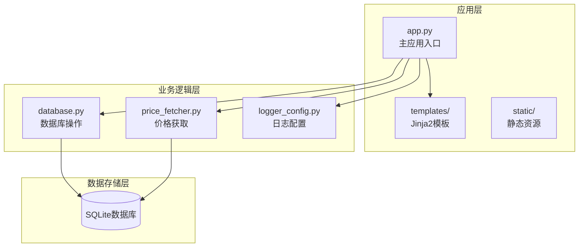

**图表来源**
- [app.py](file://app.py#L1-L50)
- [database.py](file://database.py#L1-L50)

**章节来源**
- [app.py](file://app.py#L1-L50)
- [database.py](file://database.py#L1-L50)

## 核心组件

### 表单验证组件

交易表单验证系统由多个层次组成，确保数据的完整性和一致性：

#### 客户端验证
- HTML5原生验证：required属性、pattern匹配、min/max约束
- JavaScript实时计算：数量×价格=总金额
- 字符串预处理：符号转换为大写

#### 服务器端验证
- FastAPI表单参数验证
- 数据类型转换和范围检查
- 数据库约束验证
- 业务逻辑验证

**章节来源**
- [templates/add.html](file://templates/add.html#L10-L80)
- [app.py](file://app.py#L83-L110)

### 数据处理组件

#### 数据类型转换
- 日期：ISO格式字符串转换为date对象
- 数值：字符串转换为float类型
- 字符串：统一转换为大写格式
- 可选参数：提供默认值

#### 数据清理
- 符号标准化：转换为大写字母
- 空值处理：None值转换
- 格式统一：货币符号映射

**章节来源**
- [app.py](file://app.py#L97-L108)
- [database.py](file://database.py#L174-L193)

### 错误处理组件

#### 错误分类
- 输入验证错误：格式不正确或超出范围
- 业务逻辑错误：违反系统规则
- 数据库错误：存储失败或约束冲突
- 外部服务错误：价格获取失败

#### 用户反馈机制
- URL参数传递消息
- 成功/错误消息类型
- 页面重定向到相应页面

**章节来源**
- [app.py](file://app.py#L247-L261)
- [templates/settings.html](file://templates/settings.html#L8-L13)

## 架构概览

系统采用分层架构设计，清晰分离关注点：

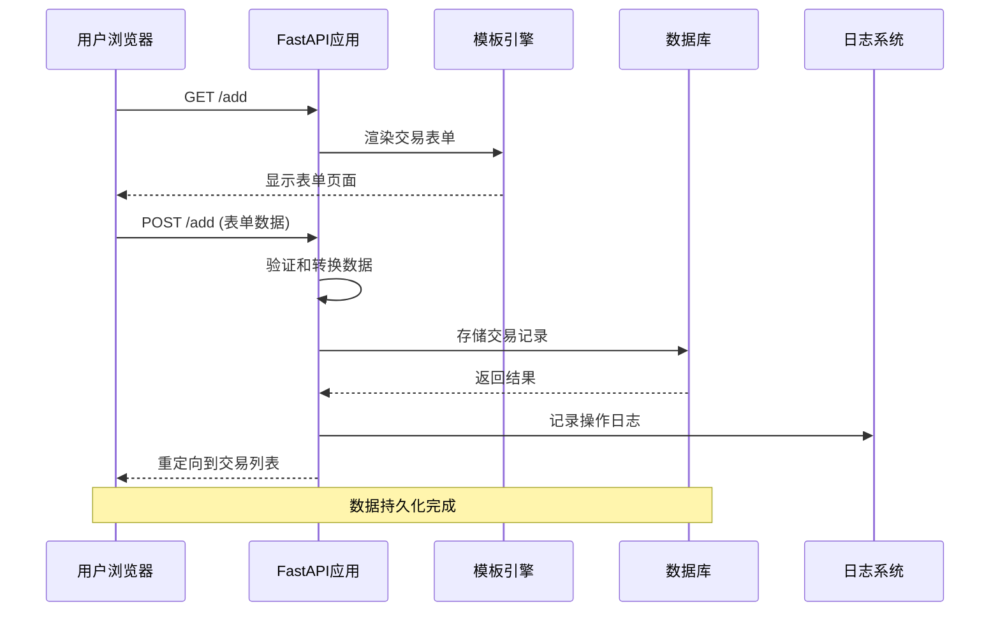

**图表来源**
- [app.py](file://app.py#L69-L110)
- [database.py](file://database.py#L156-L193)

## 详细组件分析

### 交易表单组件

#### 表单字段设计

交易表单包含以下核心字段：

| 字段名 | 类型 | 必填 | 默认值 | 验证规则 |
|--------|------|------|--------|----------|
| transaction_date | date | 是 | 当前日期 | ISO格式验证 |
| symbol | string | 是 | - | 大写转换，长度限制 |
| transaction_type | enum | 是 | - | BUY/SELL/DIVIDEND等 |
| asset_type | enum | 是 | stock | 股票/债券/贵金属等 |
| currency | enum | 是 | CNY | CNY/USD/HKD |
| quantity | float | 是 | - | ≥0，精度到0.0001 |
| price | float | 是 | - | ≥0，精度到0.01 |
| account_id | string | 是 | - | 账户列表选择 |
| commission | float | 否 | 0 | ≥0，精度到0.01 |
| notes | string | 否 | 空 | 最大长度限制 |

#### 字段标签和帮助文本

表单使用清晰的标签和辅助信息：

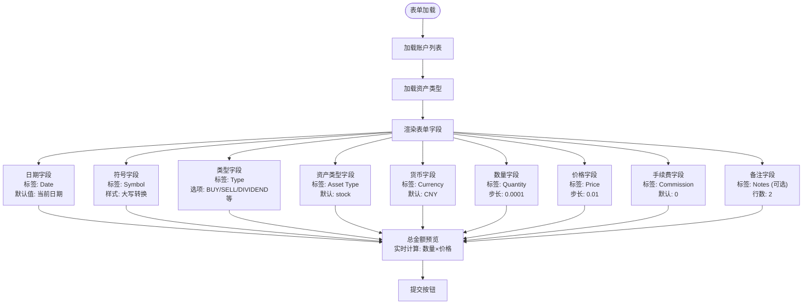

**图表来源**
- [templates/add.html](file://templates/add.html#L8-L90)

**章节来源**
- [templates/add.html](file://templates/add.html#L8-L90)

### 验证规则组件

#### 必填字段检查

系统通过多种方式确保必填字段的完整性：

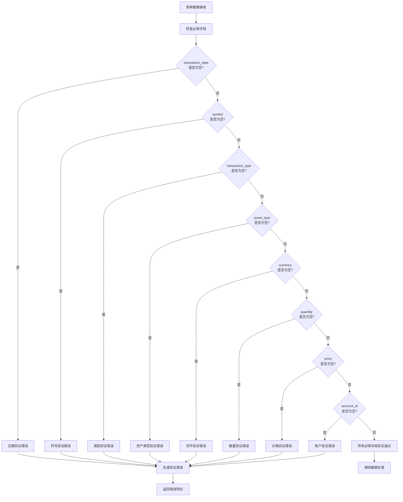

**图表来源**
- [app.py](file://app.py#L83-L110)

#### 数值范围验证

数值字段采用严格的范围控制：

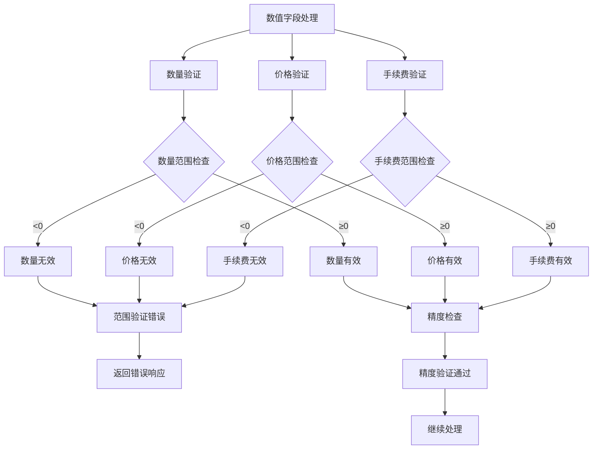

**图表来源**
- [templates/add.html](file://templates/add.html#L67-L76)

#### 日期格式验证

日期字段采用ISO 8601标准格式：

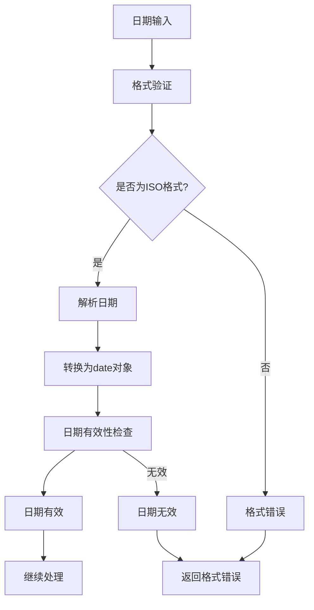

**图表来源**
- [app.py](file://app.py#L98)

#### 字符串长度限制

字符串字段采用多层验证策略：

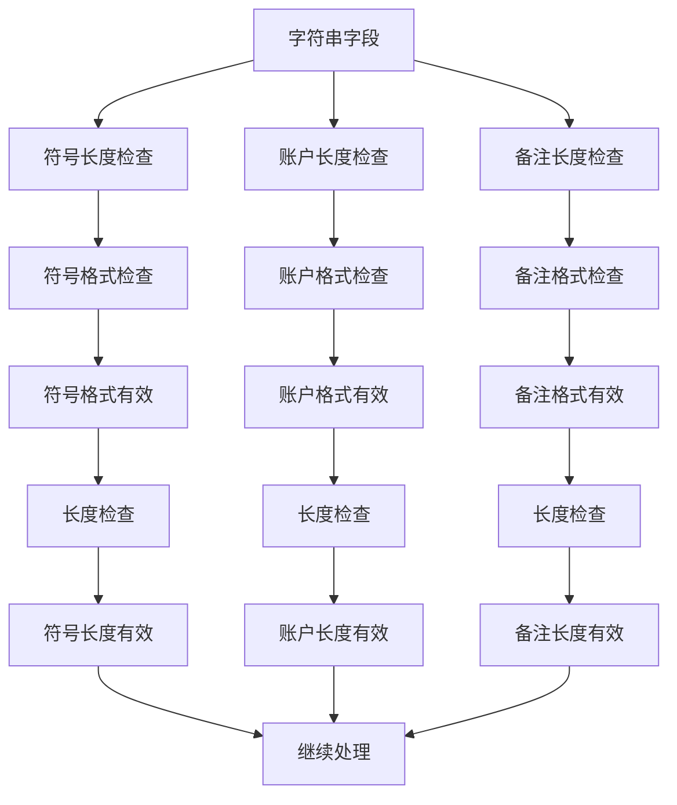

**图表来源**
- [templates/add.html](file://templates/add.html#L16)

### 数据预处理与清理组件

#### 预处理流程

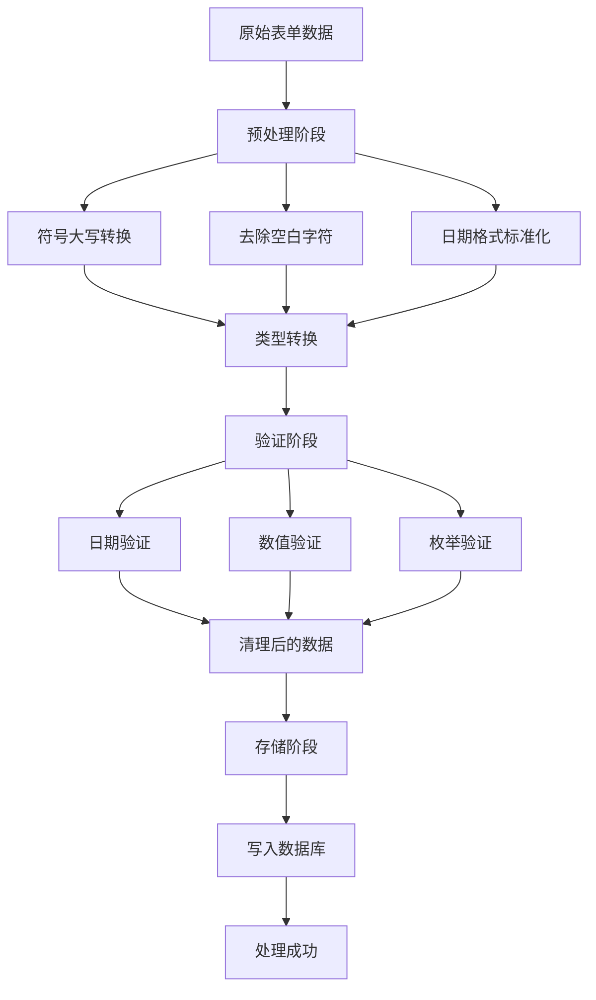

**图表来源**
- [app.py](file://app.py#L97-L108)
- [database.py](file://database.py#L174-L193)

#### 安全过滤机制

系统实施多层次的安全防护：

1. **输入过滤**：所有字符串输入转换为大写，去除多余空白
2. **类型约束**：强制数据类型转换，防止类型混淆攻击
3. **范围限制**：数值字段设置合理上下限
4. **枚举验证**：仅允许预定义的有效值
5. **SQL注入防护**：使用参数化查询，避免直接拼接SQL

**章节来源**
- [database.py](file://database.py#L174-L193)

### 错误处理与用户反馈组件

#### 错误消息生成

系统采用统一的错误处理策略：

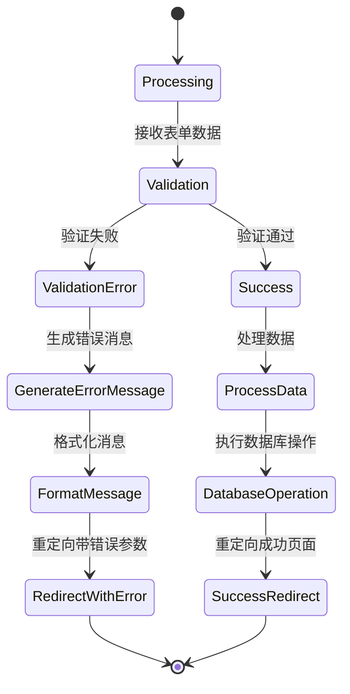

**图表来源**
- [app.py](file://app.py#L247-L261)

#### 用户反馈机制

系统提供多种用户反馈方式：

1. **URL参数传递**：通过查询参数传递消息内容
2. **消息类型区分**：成功/错误消息类型标识
3. **模板消息显示**：Jinja2模板条件渲染
4. **自动消失提醒**：JavaScript控制的消息自动隐藏

**章节来源**
- [templates/settings.html](file://templates/settings.html#L8-L13)

### 表单扩展与自定义验证

#### 扩展开发指南

系统提供了灵活的扩展接口：

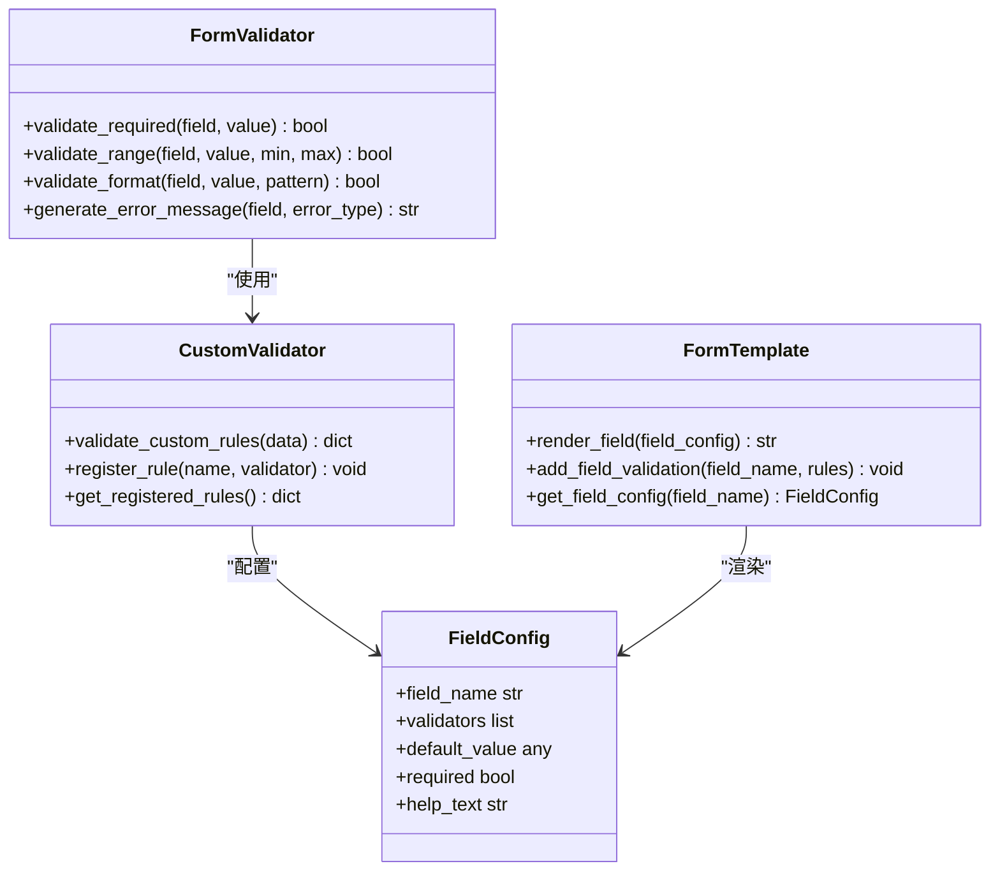

**图表来源**
- [app.py](file://app.py#L83-L110)
- [templates/add.html](file://templates/add.html#L8-L90)

#### 自定义验证规则开发步骤

1. **定义验证规则**：在CustomValidator类中注册新的验证函数
2. **配置字段规则**：在FieldConfig中指定验证器
3. **模板集成**：在表单模板中应用验证规则
4. **错误处理**：实现相应的错误消息生成
5. **测试验证**：编写单元测试确保规则正确性

**章节来源**
- [app.py](file://app.py#L83-L110)

## 依赖关系分析

系统各组件之间的依赖关系如下：

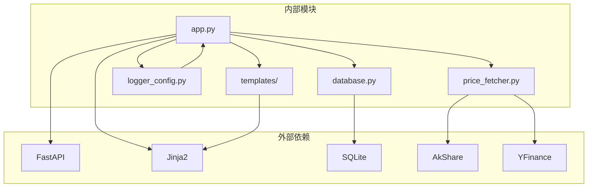

**图表来源**
- [app.py](file://app.py#L7-L17)
- [price_fetcher.py](file://price_fetcher.py#L22-L34)

**章节来源**
- [app.py](file://app.py#L7-L17)
- [price_fetcher.py](file://price_fetcher.py#L22-L34)

## 性能考虑

### 验证性能优化

1. **延迟验证**：仅在必要时执行昂贵的验证操作
2. **缓存机制**：缓存常用的验证结果
3. **批量处理**：对相似的验证规则进行批量处理
4. **异步验证**：对于网络依赖的验证使用异步处理

### 数据处理性能

1. **批量插入**：使用事务批量处理多个交易
2. **索引优化**：为常用查询字段建立索引
3. **查询优化**：使用参数化查询减少编译开销
4. **连接池**：复用数据库连接减少创建成本

## 故障排除指南

### 常见问题诊断

#### 表单验证失败

**症状**：表单提交后立即返回错误页面
**排查步骤**：
1. 检查必填字段是否填写完整
2. 验证数值字段是否在允许范围内
3. 确认日期格式是否符合ISO标准
4. 查看浏览器控制台是否有JavaScript错误

#### 数据库操作失败

**症状**：交易记录无法保存
**排查步骤**：
1. 检查数据库连接状态
2. 验证表结构是否正确
3. 查看数据库约束冲突
4. 检查磁盘空间和权限

#### 价格获取失败

**症状**：实时价格更新失败
**排查步骤**：
1. 检查网络连接状态
2. 验证第三方API可用性
3. 查看日志中的错误信息
4. 尝试手动调用价格获取函数

**章节来源**
- [app.py](file://app.py#L247-L261)
- [logger_config.py](file://logger_config.py#L14-L53)

## 结论

投资日志系统的交易表单验证与处理模块实现了完整的数据验证生命周期，从客户端预验证到服务器端深度验证，再到数据库持久化和用户反馈。系统采用分层架构设计，确保了代码的可维护性和扩展性。

主要优势包括：
- 多层次验证确保数据质量
- 清晰的错误处理和用户反馈
- 灵活的扩展机制支持自定义验证
- 完善的日志记录便于问题追踪
- 优雅的降级处理保证系统稳定性

建议的改进方向：
- 增加更详细的字段帮助文本
- 实现更复杂的业务规则验证
- 添加批量操作功能
- 优化移动端用户体验

## 附录

### 配置选项参考

#### 表单字段配置

| 字段 | 配置项 | 默认值 | 说明 |
|------|--------|--------|------|
| transaction_date | required | 是 | 日期字段，必填 |
| symbol | required, uppercase | 是 | 股票代码，必填 |
| transaction_type | required, enum | 是 | 交易类型，必填 |
| asset_type | required, enum | 是 | 资产类型，默认stock |
| currency | required, enum | 是 | 货币类型，默认CNY |
| quantity | required, number | 是 | 数量，≥0，精度0.0001 |
| price | required, number | 是 | 价格，≥0，精度0.01 |
| account_id | required | 是 | 账户ID，必填 |
| commission | optional, number | 0 | 手续费，≥0，精度0.01 |
| notes | optional | 空 | 备注，可选 |

#### 验证规则摘要

- **必填字段**：transaction_date, symbol, transaction_type, asset_type, currency, quantity, price, account_id
- **数值范围**：quantity≥0, price≥0, commission≥0
- **精度要求**：quantity精确到小数点后4位，price和commission精确到小数点后2位
- **枚举限制**：transaction_type和asset_type必须在预定义集合内
- **格式要求**：日期必须为ISO 8601格式