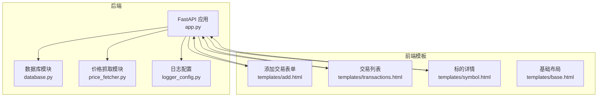
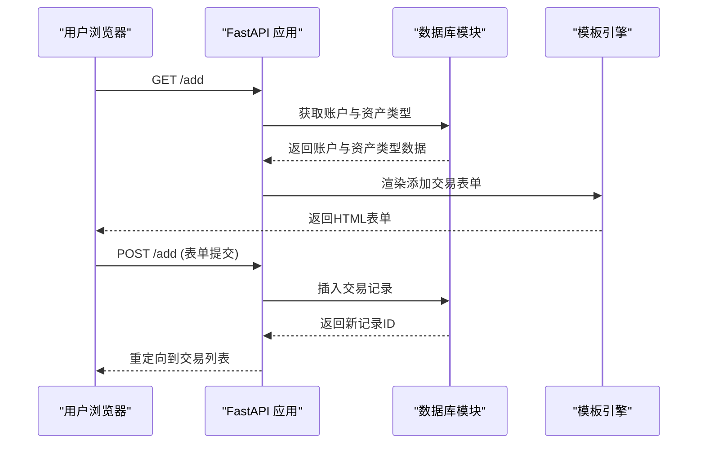
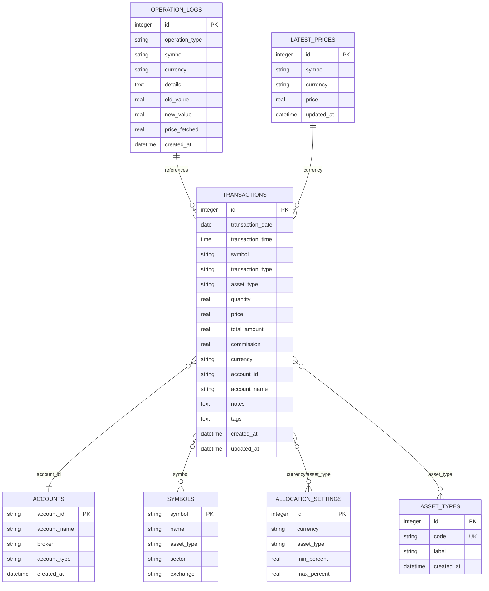
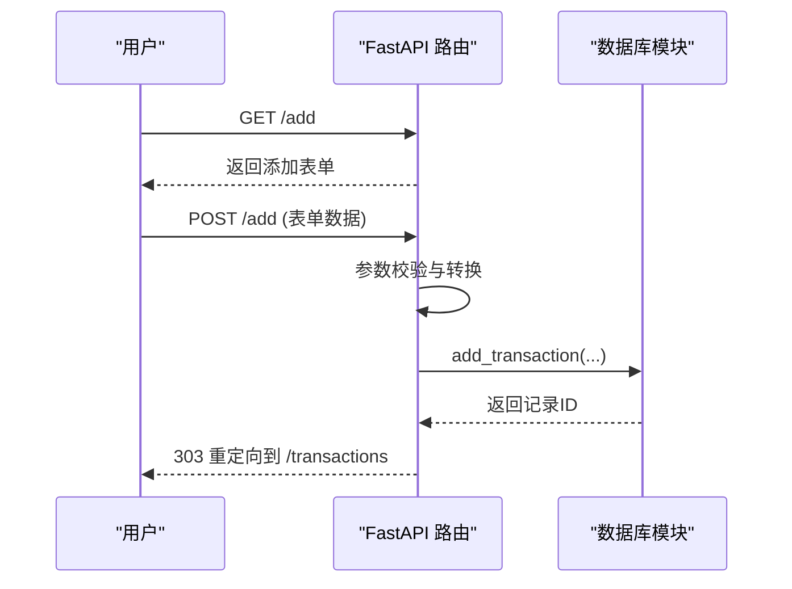
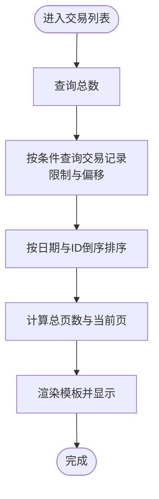
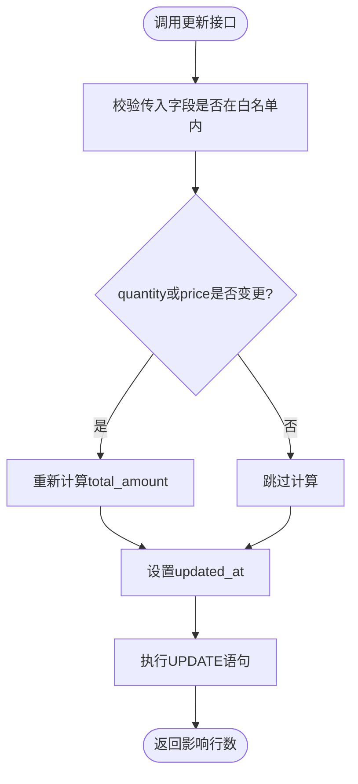
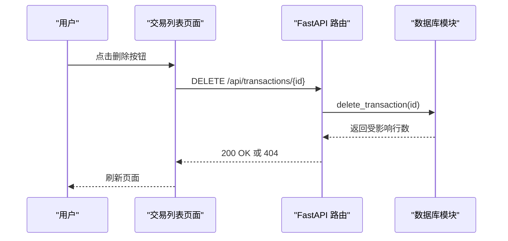
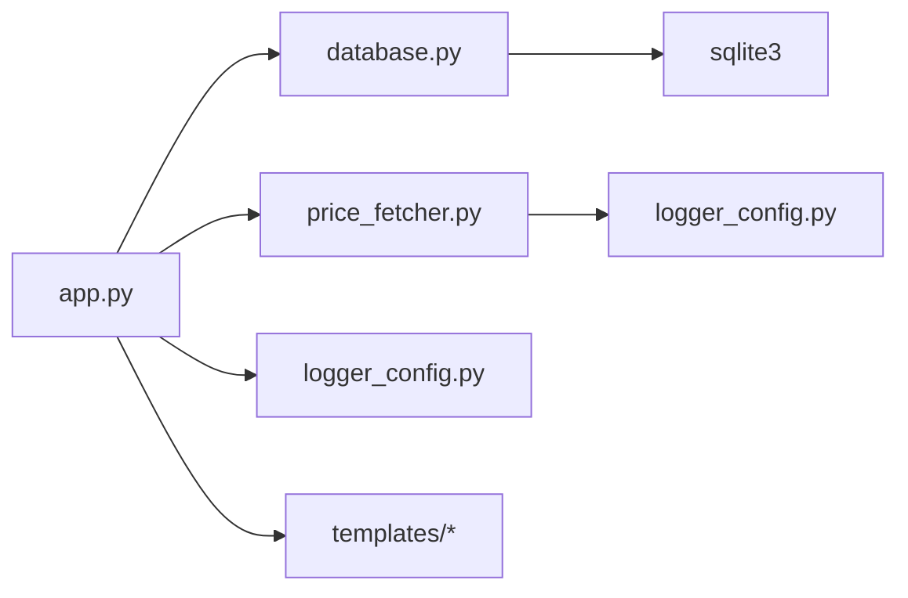

# 交易记录CRUD操作

<cite>
**本文档引用的文件**
- [app.py](file://app.py)
- [database.py](file://database.py)
- [templates/add.html](file://templates/add.html)
- [templates/transactions.html](file://templates/transactions.html)
- [templates/symbol.html](file://templates/symbol.html)
- [templates/base.html](file://templates/base.html)
- [price_fetcher.py](file://price_fetcher.py)
- [logger_config.py](file://logger_config.py)
- [requirements.txt](file://requirements.txt)
</cite>

## 目录
1. [简介](#简介)
2. [项目结构](#项目结构)
3. [核心组件](#核心组件)
4. [架构总览](#架构总览)
5. [详细组件分析](#详细组件分析)
6. [依赖关系分析](#依赖关系分析)
7. [性能考虑](#性能考虑)
8. [故障排除指南](#故障排除指南)
9. [结论](#结论)
10. [附录](#附录)

## 简介
本文件面向投资日志系统的交易记录CRUD操作，系统基于FastAPI + SQLite构建，提供交易记录的创建、读取、更新、删除功能，以及交易历史的分页与过滤、删除安全检查、API接口与前端模板集成、以及扩展到批量操作与数据导入导出的开发建议。本文档同时给出数据模型定义、字段约束与索引设计说明，并提供API接口文档与使用示例。

## 项目结构
系统采用前后端分离的Web应用模式：
- 后端：FastAPI应用负责路由、业务逻辑与数据库交互
- 数据层：SQLite数据库，通过独立模块封装CRUD与查询
- 前端：Jinja2模板渲染页面，提供表单与列表展示
- 工具模块：价格抓取器用于实时价格获取，日志模块用于运行时记录

图表来源
- [app.py](file://app.py#L1-L462)
- [database.py](file://database.py#L1-L944)
- [templates/add.html](file://templates/add.html#L1-L111)
- [templates/transactions.html](file://templates/transactions.html#L1-L91)
- [templates/symbol.html](file://templates/symbol.html#L1-L105)
- [templates/base.html](file://templates/base.html#L1-L27)
- [price_fetcher.py](file://price_fetcher.py#L1-L398)
- [logger_config.py](file://logger_config.py#L1-L54)

章节来源
- [app.py](file://app.py#L1-L462)
- [database.py](file://database.py#L1-L944)
- [templates/base.html](file://templates/base.html#L1-L27)

## 核心组件
- FastAPI应用与路由：提供HTML页面与REST API端点，负责参数解析、调用数据库模块、模板渲染与重定向
- 数据库模块：封装SQLite初始化、交易CRUD、查询与统计、账户与资产类型管理、价格与操作日志
- 前端模板：提供交易添加表单、交易列表与分页、标的详情与年份筛选
- 价格抓取模块：多数据源回退的价格获取工具，支持A股、港股、美股与黄金
- 日志模块：配置文件轮转日志，便于问题追踪

章节来源
- [app.py](file://app.py#L1-L462)
- [database.py](file://database.py#L1-L944)
- [templates/add.html](file://templates/add.html#L1-L111)
- [templates/transactions.html](file://templates/transactions.html#L1-L91)
- [templates/symbol.html](file://templates/symbol.html#L1-L105)
- [price_fetcher.py](file://price_fetcher.py#L1-L398)
- [logger_config.py](file://logger_config.py#L1-L54)

## 架构总览
系统采用“控制器-服务-数据访问”的分层架构：
- 控制器层：FastAPI路由处理HTTP请求，进行参数校验与业务编排
- 服务层：数据库模块封装事务与查询逻辑
- 数据访问层：SQLite连接与SQL执行
- 前端层：Jinja2模板渲染HTML页面
- 外部集成：价格抓取模块提供外部数据源

图表来源
- [app.py](file://app.py#L69-L111)
- [database.py](file://database.py#L156-L194)

## 详细组件分析

### 数据模型与字段约束
交易记录表transactions的核心字段与约束如下：
- 主键与时间戳：id自增主键；created_at与updated_at默认当前时间
- 交易日期与时间：transaction_date必填；transaction_time可选
- 标的与类型：symbol必填；transaction_type枚举约束；asset_type默认stock且枚举约束
- 数量与价格：quantity与price必须为非负数；total_amount由quantity*price计算
- 费用与货币：commission默认0；currency枚举约束
- 账户关联：account_id必填；account_name可选
- 其他：notes、tags可选

索引设计：
- idx_symbol、idx_date、idx_account、idx_type、idx_currency、idx_asset_type 提升查询性能

图表来源
- [database.py](file://database.py#L25-L147)

章节来源
- [database.py](file://database.py#L25-L147)

### 创建交易（新增）
- 表单处理：/add GET返回表单，/add POST接收表单字段并调用数据库插入
- 字段处理：日期字符串转换为date对象；symbol统一大写；quantity与price为浮点数；commission默认0；notes为空则置None
- 存储流程：计算total_amount，插入transactions表，返回新记录ID
- 完成后重定向至交易列表

图表来源
- [app.py](file://app.py#L83-L111)
- [database.py](file://database.py#L156-L194)

章节来源
- [app.py](file://app.py#L83-L111)
- [database.py](file://database.py#L156-L194)
- [templates/add.html](file://templates/add.html#L1-L111)

### 读取交易（列表与详情）
- 交易列表：/transactions 支持分页（每页100条），按日期与ID倒序排序
- 查询过滤：支持symbol、account_id、transaction_type、currency、year、start_date、end_date
- 标的详情：/symbol/{symbol} 支持年份筛选与持有信息展示
- 列表页面：/transactions 包含分页导航与删除按钮，删除通过API触发

图表来源
- [app.py](file://app.py#L48-L66)
- [database.py](file://database.py#L262-L310)

章节来源
- [app.py](file://app.py#L48-L66)
- [database.py](file://database.py#L262-L310)
- [templates/transactions.html](file://templates/transactions.html#L1-L91)
- [templates/symbol.html](file://templates/symbol.html#L1-L105)

### 更新交易（修改）
- 接口：/api/transactions/{id} PUT（在当前代码中未直接暴露PUT路由，但数据库模块提供update_transaction函数）
- 字段白名单：仅允许更新指定字段；若quantity或price变更，自动重新计算total_amount
- 时间戳：更新时写入updated_at

图表来源
- [database.py](file://database.py#L206-L245)

章节来源
- [database.py](file://database.py#L206-L245)

### 删除交易（删除）
- 接口：/api/transactions/{id} DELETE
- 安全检查：当前实现为直接删除，未进行前置校验（如是否存在相关持仓或衍生记录）
- 事务处理：未使用显式事务块；SQLite在单条DELETE语句上具备原子性
- 前端删除：交易列表页面通过JavaScript调用DELETE API并刷新页面

图表来源
- [app.py](file://app.py#L449-L457)
- [database.py](file://database.py#L247-L256)
- [templates/transactions.html](file://templates/transactions.html#L82-L89)

章节来源
- [app.py](file://app.py#L449-L457)
- [database.py](file://database.py#L247-L256)
- [templates/transactions.html](file://templates/transactions.html#L82-L89)

### 查看交易历史的分页与过滤
- 分页：每页固定100条，根据总数计算总页数，模板渲染分页控件
- 过滤：支持按标的、账户、类型、币种、年份、起止日期过滤
- 年度筛选：标的详情页支持按年份筛选交易历史

章节来源
- [app.py](file://app.py#L48-L66)
- [app.py](file://app.py#L144-L188)
- [database.py](file://database.py#L262-L310)
- [database.py](file://database.py#L903-L938)
- [templates/transactions.html](file://templates/transactions.html#L53-L80)
- [templates/symbol.html](file://templates/symbol.html#L64-L73)

### 添加交易表单处理、数据验证与存储
- 表单字段：交易日期、标的、交易类型、资产类型、币种、账户、数量、价格、佣金、备注
- 前端验证：HTML5约束（required、step、min）与实时金额预览
- 后端验证：FastAPI Form参数解析与类型转换；数据库层约束（CHECK、NOT NULL、UNIQUE）
- 存储：统一大写标的；计算总额；记录创建时间；可选字段为空则置None

章节来源
- [templates/add.html](file://templates/add.html#L1-L111)
- [app.py](file://app.py#L83-L111)
- [database.py](file://database.py#L156-L194)

### 删除交易的安全检查与事务处理
- 安全检查：当前未实现前置校验（如是否有关联持仓或衍生记录）
- 事务处理：未使用显式事务；单条DELETE具备原子性
- 建议：在删除前查询是否存在相关记录，或在数据库层增加外键约束与级联策略

章节来源
- [app.py](file://app.py#L449-L457)
- [database.py](file://database.py#L247-L256)

### API接口文档
- 获取交易列表：GET /api/transactions?symbol=&account_id=&transaction_type=&limit=
- 获取交易详情：GET /api/holdings?account_id=
- 获取按币种汇总：GET /api/holdings-by-currency
- 获取组合历史：GET /api/portfolio-history
- 删除交易：DELETE /api/transactions/{id}

使用示例（以curl为例）：
- 获取交易列表：curl "http://localhost:8000/api/transactions?symbol=AAPL&limit=50"
- 删除交易：curl -X DELETE "http://localhost:8000/api/transactions/123"

章节来源
- [app.py](file://app.py#L406-L457)

### 批量操作与数据导入导出开发指南
- 批量新增：在数据库模块中扩展批量插入函数，使用executemany或事务批处理
- 导入：提供CSV/Excel解析与校验，逐条调用add_transaction
- 导出：按过滤条件查询并输出CSV/Excel
- 注意：批量操作应使用事务包裹，确保一致性与回滚能力

章节来源
- [database.py](file://database.py#L156-L194)

## 依赖关系分析
- 应用依赖：FastAPI、Jinja2、python-multipart、uvicorn（可选）、akshare（可选）
- 模块依赖：app.py依赖database.py、price_fetcher.py、logger_config.py
- 数据库依赖：database.py依赖sqlite3与typing；模板依赖Jinja2

图表来源
- [app.py](file://app.py#L1-L18)
- [database.py](file://database.py#L1-L18)
- [price_fetcher.py](file://price_fetcher.py#L1-L21)
- [logger_config.py](file://logger_config.py#L1-L54)

章节来源
- [app.py](file://app.py#L1-L18)
- [requirements.txt](file://requirements.txt#L1-L6)

## 性能考虑
- 索引优化：已建立多字段索引，建议结合查询模式评估是否需要复合索引
- 分页：固定每页100条，避免一次性加载大量数据
- 查询：WHERE子句按选择性从高到低排列，减少扫描范围
- 日志：文件轮转保留7天，避免日志过大影响I/O

章节来源
- [database.py](file://database.py#L140-L147)
- [app.py](file://app.py#L48-L66)
- [logger_config.py](file://logger_config.py#L14-L50)

## 故障排除指南
- 交易添加失败：检查表单字段是否符合约束（如枚举值、数值范围、唯一性）
- 交易列表为空：确认过滤条件是否过于严格，或数据库中确实无匹配记录
- 删除失败：确认交易ID是否存在；当前实现未做前置校验，若存在关联记录可能需要先清理
- 价格更新失败：检查网络与数据源可用性；查看日志中的错误信息

章节来源
- [app.py](file://app.py#L449-L457)
- [price_fetcher.py](file://price_fetcher.py#L321-L398)
- [logger_config.py](file://logger_config.py#L14-L50)

## 结论
本系统提供了完整的交易记录CRUD能力，配合分页与过滤、价格抓取与日志记录，满足日常投资记录管理需求。建议后续增强删除前的安全检查与事务处理，完善批量导入导出能力，并根据实际查询模式进一步优化索引与查询计划。

## 附录
- 快速启动：安装依赖后运行uvicorn，访问 http://127.0.0.1:8000
- 开发建议：在删除接口前增加前置校验；为批量操作引入事务；为查询接口增加缓存与限流