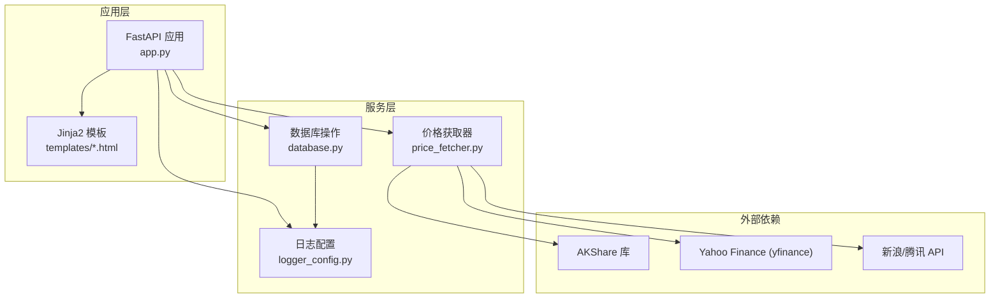
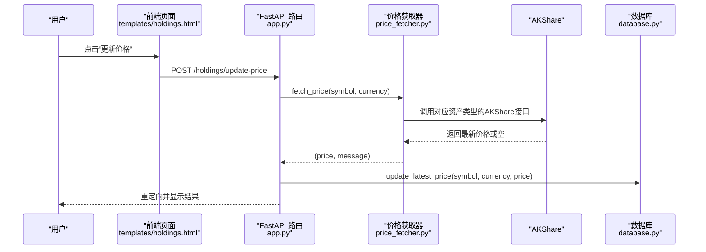
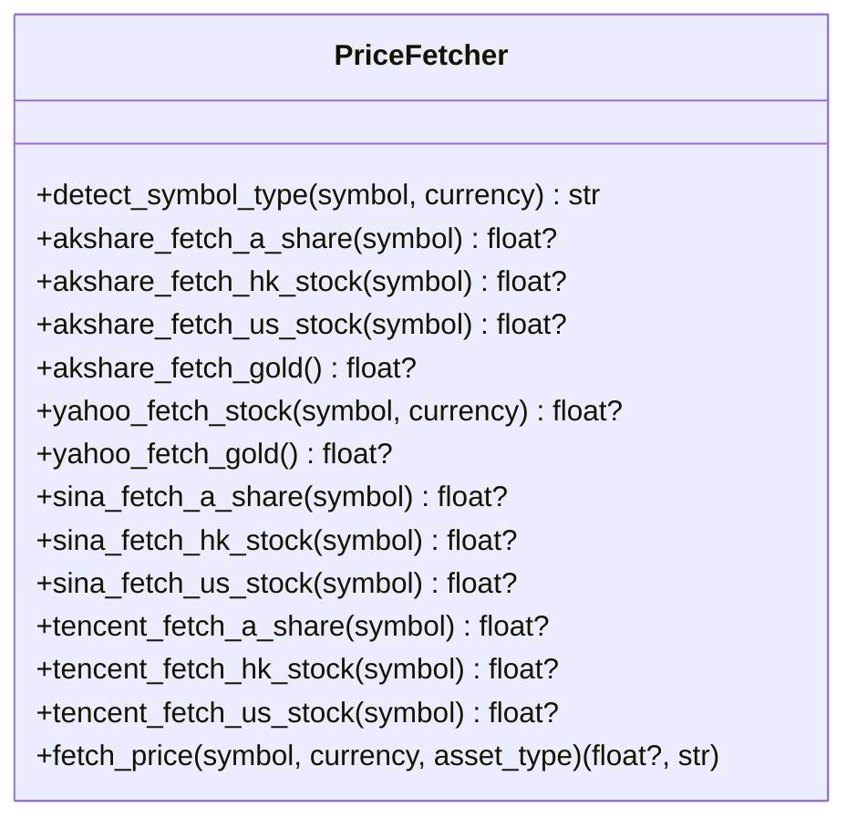
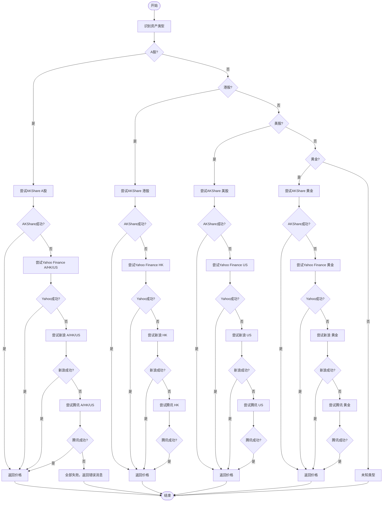
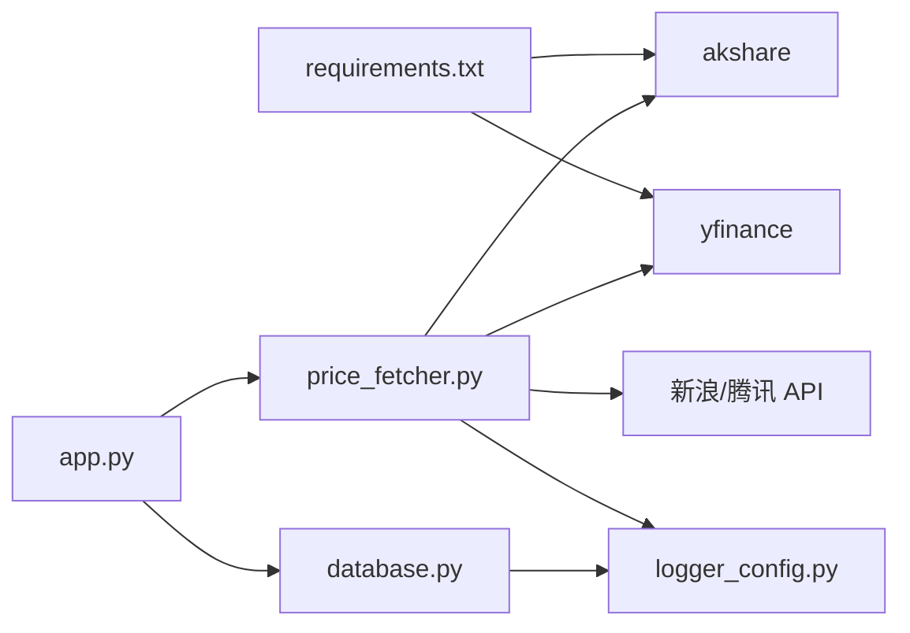

# AKShare数据源集成

<cite>
**本文档引用的文件**
- [app.py](file://app.py)
- [price_fetcher.py](file://price_fetcher.py)
- [database.py](file://database.py)
- [logger_config.py](file://logger_config.py)
- [requirements.txt](file://requirements.txt)
- [templates/holdings.html](file://templates/holdings.html)
- [templates/symbol.html](file://templates/symbol.html)
</cite>

## 目录
1. [简介](#简介)
2. [项目结构](#项目结构)
3. [核心组件](#核心组件)
4. [架构总览](#架构总览)
5. [详细组件分析](#详细组件分析)
6. [依赖关系分析](#依赖关系分析)
7. [性能考虑](#性能考虑)
8. [故障排除指南](#故障排除指南)
9. [结论](#结论)
10. [附录](#附录)

## 简介
本文件面向投资日志系统中AKShare数据源的集成与使用，重点说明AKShare在A股、港股、美股、黄金等资产类型上的接口调用方式，解释数据获取函数的实现逻辑（包括股票代码格式转换、数据筛选与价格提取）、异常处理与日志记录策略，并提供安装配置指南与常见问题解决方案。同时给出API调用示例与返回数据格式说明，帮助开发者与用户正确使用与维护该功能模块。

## 项目结构
该项目采用FastAPI + SQLite + Jinja2模板的轻量级Web应用架构：
- 应用入口与路由：app.py
- 数据获取与多源回退：price_fetcher.py
- 数据持久化与查询：database.py
- 日志配置：logger_config.py
- 前端模板：templates/*.html
- 依赖声明：requirements.txt

图表来源
- [app.py](file://app.py#L1-L464)
- [price_fetcher.py](file://price_fetcher.py#L1-L398)
- [database.py](file://database.py#L1-L951)
- [logger_config.py](file://logger_config.py#L1-L54)

章节来源
- [app.py](file://app.py#L1-L464)
- [requirements.txt](file://requirements.txt#L1-L6)

## 核心组件
- AKShare数据获取器：负责根据资产类型选择合适的AKShare接口，完成A股、港股、美股、黄金的价格抓取。
- 多源回退机制：当AKShare不可用或获取失败时，依次尝试Yahoo Finance、新浪、腾讯等备用数据源。
- 价格存储与查询：通过数据库表latest_prices缓存最新价格，供前端展示与计算使用。
- 异常处理与日志：统一的日志配置，记录价格获取过程中的错误与警告，便于排障。
- Web接口：提供从页面触发的价格更新请求，调用价格获取器并写入数据库。

章节来源
- [price_fetcher.py](file://price_fetcher.py#L1-L398)
- [database.py](file://database.py#L113-L147)
- [logger_config.py](file://logger_config.py#L1-L54)
- [app.py](file://app.py#L216-L262)

## 架构总览
AKShare数据源集成在系统中的位置如下：

图表来源
- [templates/holdings.html](file://templates/holdings.html#L85-L89)
- [app.py](file://app.py#L216-L262)
- [price_fetcher.py](file://price_fetcher.py#L321-L394)
- [database.py](file://database.py#L779-L800)

## 详细组件分析

### 1) AKShare接口调用与资产类型识别
- 资产类型识别：detect_symbol_type根据符号格式与货币代码判断A股、港股、美股、黄金、债券等类型。
- A股（CNY + 6位数字或SH/SZ前缀）：使用AKShare的A股实时行情接口，按代码匹配最新价。
- 港股（HKD或以0开头的5位数字）：使用AKShare港股实时行情接口，代码需补零至5位。
- 美股（USD或纯字母）：使用AKShare美股实时行情接口，支持精确匹配与模糊匹配。
- 黄金：使用AKShare黄金基准价格接口，取最新价格。

章节来源
- [price_fetcher.py](file://price_fetcher.py#L36-L62)
- [price_fetcher.py](file://price_fetcher.py#L69-L130)

### 2) 数据获取函数实现逻辑
- 代码格式转换
  - A股：去除SH/SZ前缀，直接使用6位代码。
  - 港股：将输入补齐为5位数字，再进行匹配。
  - 美股：统一转为大写，支持包含关系匹配。
- 数据筛选与价格提取
  - 通过DataFrame过滤目标代码行，取“最新价”列作为返回值。
  - 若未找到匹配行，返回None表示获取失败。
- 异常处理
  - 每个接口函数内部捕获异常并记录调试日志，避免影响整体流程。
- 返回值
  - 函数返回float价格或None；上层统一包装为元组(价格, 消息)。

章节来源
- [price_fetcher.py](file://price_fetcher.py#L69-L130)

### 3) 多源回退策略
- 优先级顺序：AKShare（主）→ Yahoo Finance → 新浪 → 腾讯。
- 对于A股、港股、美股分别定义四套获取函数，形成完整的回退链路。
- 当任一服务返回None或抛出异常时，记录错误并尝试下一个服务。
- 所有服务失败时，返回综合错误消息。

章节来源
- [price_fetcher.py](file://price_fetcher.py#L345-L394)

### 4) Web接口与数据库集成
- 页面触发：前端点击“更新价格”，提交POST到/holdings/update-price。
- 后端处理：调用price_fetcher.fetch_price获取价格与消息；若成功则更新latest_prices表并记录操作日志。
- 成功/失败反馈：重定向到持有页面并携带消息参数，前端显示成功或错误信息。

章节来源
- [templates/holdings.html](file://templates/holdings.html#L85-L89)
- [app.py](file://app.py#L216-L262)
- [database.py](file://database.py#L779-L800)

### 5) 类图：价格获取器与相关函数

图表来源
- [price_fetcher.py](file://price_fetcher.py#L36-L394)

### 6) 流程图：价格获取与回退

图表来源
- [price_fetcher.py](file://price_fetcher.py#L321-L394)

## 依赖关系分析
- 外部库依赖
  - AKShare：主要数据源，用于A股、港股、美股、黄金实时价格。
  - yfinance：备用数据源，用于美股、港股、黄金的补充。
  - 新浪/腾讯API：备用数据源，用于A股、港股、美股的补充。
- 内部模块依赖
  - app.py依赖price_fetcher与database模块，负责页面交互与数据持久化。
  - price_fetcher依赖logger_config进行日志记录。
  - database提供latest_prices表用于缓存最新价格。

图表来源
- [requirements.txt](file://requirements.txt#L1-L6)
- [app.py](file://app.py#L15-L17)
- [price_fetcher.py](file://price_fetcher.py#L22-L34)
- [logger_config.py](file://logger_config.py#L1-L54)

章节来源
- [requirements.txt](file://requirements.txt#L1-L6)
- [app.py](file://app.py#L15-L17)
- [price_fetcher.py](file://price_fetcher.py#L22-L34)

## 性能考虑
- 缓存策略：通过latest_prices表缓存最新价格，减少重复网络请求。
- 回退链路：优先使用AKShare，其次为Yahoo Finance，最后为新浪/腾讯，确保在不同网络环境下均有可用数据源。
- 日志级别：INFO级别记录关键事件，DEBUG级别记录异常细节，避免过多日志影响性能。
- 数据库索引：对transactions表的关键字段建立索引，提升查询效率。

章节来源
- [database.py](file://database.py#L140-L147)
- [logger_config.py](file://logger_config.py#L22-L38)

## 故障排除指南
- AKShare不可用
  - 现象：返回None且记录调试日志。
  - 排查：确认AKShare是否安装；检查网络连通性；查看日志文件。
- 股票代码格式不匹配
  - 现象：AKShare未找到对应行，返回None。
  - 排查：A股需去除SH/SZ前缀；港股需补零至5位；美股需大写。
- Yahoo Finance获取失败
  - 现象：返回None或异常。
  - 排查：检查yfinance安装；确认目标市场与代码格式；查看日志。
- 新浪/腾讯API失败
  - 现象：HTTP请求超时或解析失败。
  - 排查：检查网络与反爬策略；确认接口URL与编码。
- 日志定位
  - 日志目录：logs/，按日期轮转，保留7天。
  - 关键日志：价格获取开始、各服务尝试、成功/失败消息。

章节来源
- [price_fetcher.py](file://price_fetcher.py#L82-L84)
- [price_fetcher.py](file://price_fetcher.py#L166-L168)
- [price_fetcher.py](file://price_fetcher.py#L214-L216)
- [logger_config.py](file://logger_config.py#L14-L50)

## 结论
AKShare数据源集成在本系统中承担了核心价格数据来源的角色，配合多源回退机制与完善的日志记录，能够在多种网络与环境条件下稳定获取A股、港股、美股、黄金的实时价格。通过数据库缓存与前端页面联动，实现了从页面触发到价格更新的完整闭环。建议在生产环境中持续监控日志与网络状况，确保数据获取的稳定性与准确性。

## 附录

### 安装与配置指南
- 安装依赖
  - 使用pip安装项目依赖，确保AKShare版本满足要求。
- 运行应用
  - 使用uvicorn运行FastAPI应用，默认监听本地端口。
- 配置日志
  - 日志文件位于logs/目录，按日期轮转，保留7天。

章节来源
- [requirements.txt](file://requirements.txt#L1-L6)
- [app.py](file://app.py#L461-L464)
- [logger_config.py](file://logger_config.py#L14-L50)

### API调用示例与返回数据格式
- 触发价格更新
  - 方法：POST /holdings/update-price
  - 参数：symbol（标的代码），currency（货币）
  - 成功响应：重定向至持有页面，携带成功消息参数。
  - 失败响应：重定向至持有页面，携带错误消息参数。
- 返回数据格式
  - fetch_price返回元组：(价格: float或None, 消息: str)
  - 更新价格成功后，数据库latest_prices表插入或更新对应记录。

章节来源
- [templates/holdings.html](file://templates/holdings.html#L85-L89)
- [app.py](file://app.py#L216-L262)
- [price_fetcher.py](file://price_fetcher.py#L321-L394)
- [database.py](file://database.py#L779-L800)

### 常见问题与解决方案
- 问：为什么某些股票无法获取价格？
  - 答：检查资产类型识别是否正确、代码格式是否符合要求、是否被备用数据源覆盖。
- 问：如何查看错误详情？
  - 答：查看logs/app.log文件，关注DEBUG级别的异常信息。
- 问：如何切换或新增数据源？
  - 答：在fetch_price函数中扩展回退链路，增加新的fetch_*函数并在相应分支中调用。

章节来源
- [price_fetcher.py](file://price_fetcher.py#L321-L394)
- [logger_config.py](file://logger_config.py#L14-L50)