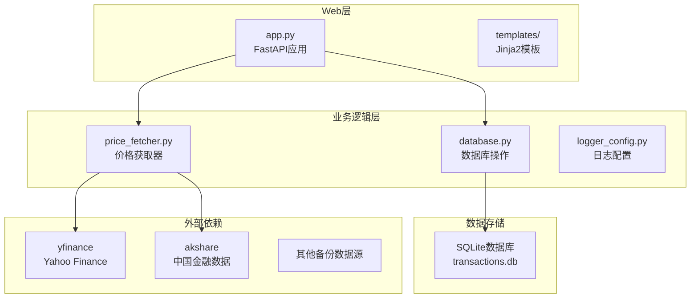
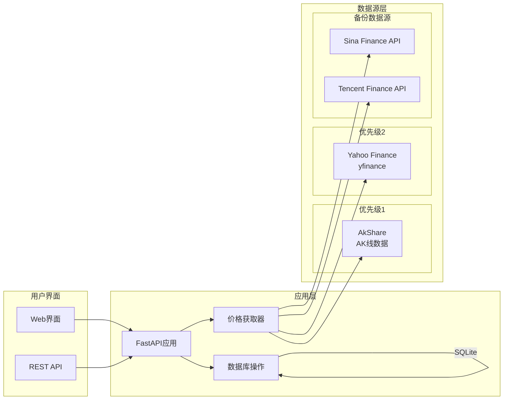
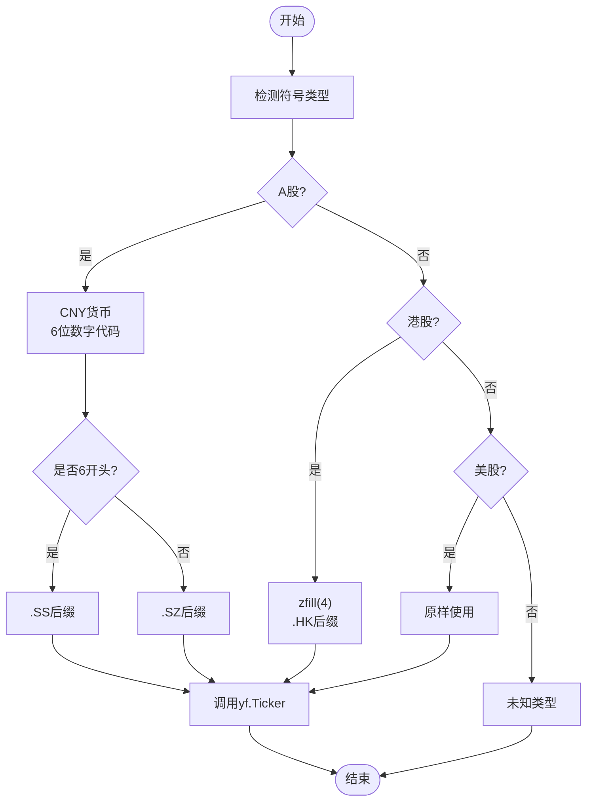
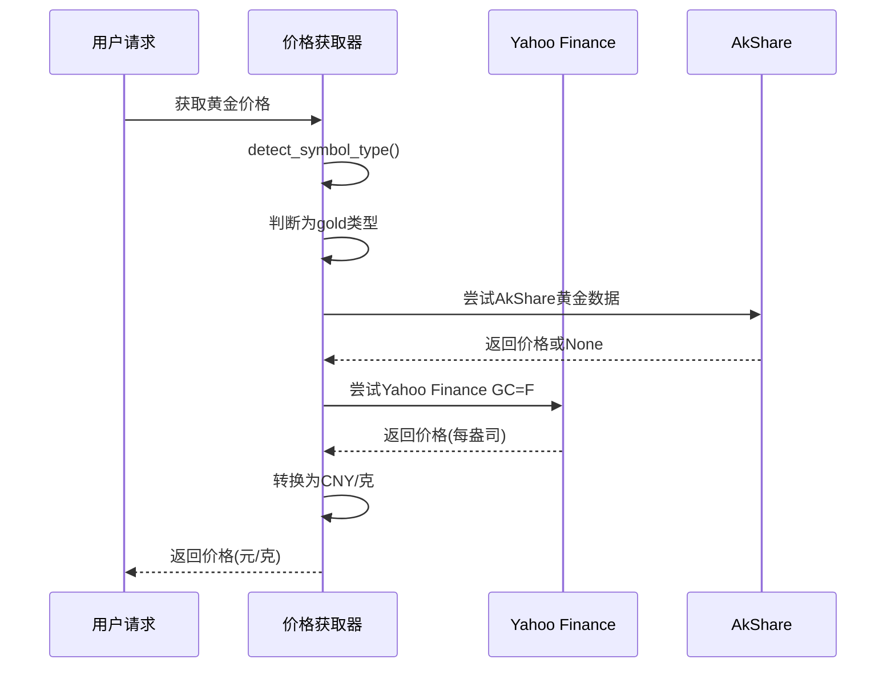
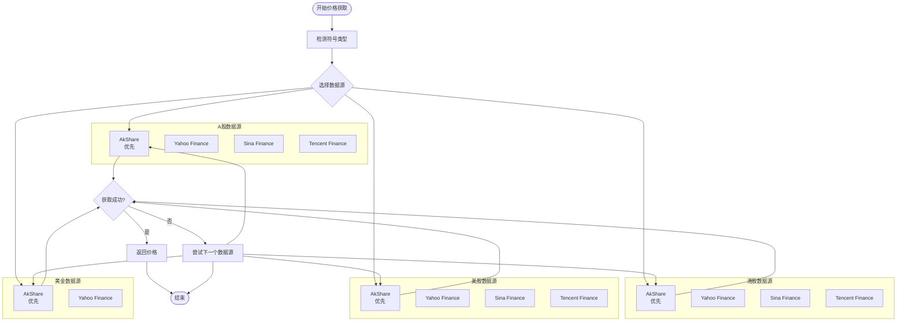
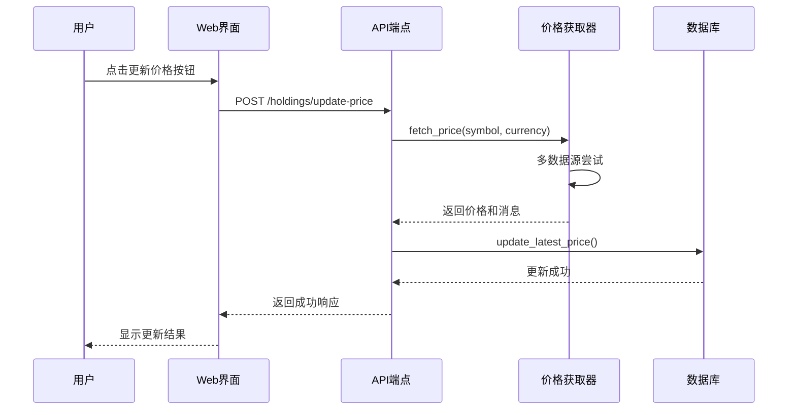
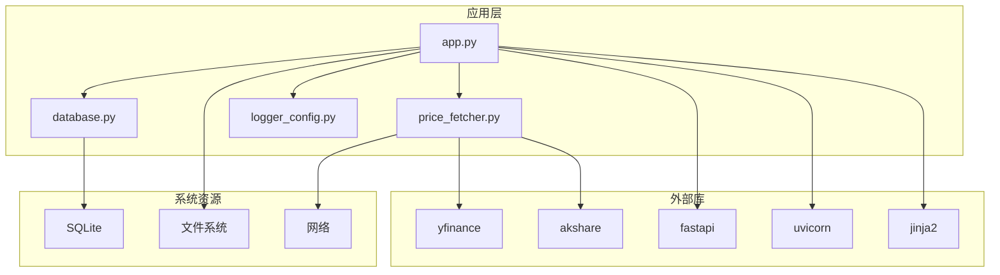

# Yahoo Finance数据源集成

<cite>
**本文档引用的文件**
- [app.py](file://app.py)
- [price_fetcher.py](file://price_fetcher.py)
- [database.py](file://database.py)
- [requirements.txt](file://requirements.txt)
- [logger_config.py](file://logger_config.py)
- [templates/holdings.html](file://templates/holdings.html)
</cite>

## 目录
1. [简介](#简介)
2. [项目结构](#项目结构)
3. [核心组件](#核心组件)
4. [架构概览](#架构概览)
5. [详细组件分析](#详细组件分析)
6. [依赖关系分析](#依赖关系分析)
7. [性能考虑](#性能考虑)
8. [故障排除指南](#故障排除指南)
9. [结论](#结论)

## 简介

本项目是一个基于FastAPI的投资日志系统，集成了Yahoo Finance数据源来获取实时股价数据。系统支持多种资产类型的数据获取，包括美股、港股、A股以及黄金等贵金属。通过多数据源回退机制，确保在各种网络环境下都能稳定获取市场数据。

系统采用模块化设计，主要包含以下核心功能：
- Web界面管理投资交易记录
- 多数据源价格获取与回退
- 实时持仓计算与分析
- 资产配置监控与告警
- 操作日志记录与追踪

## 项目结构

项目采用清晰的分层架构，主要文件组织如下：

**图表来源**
- [app.py](file://app.py#L1-L50)
- [price_fetcher.py](file://price_fetcher.py#L1-L30)
- [database.py](file://database.py#L1-L30)

**章节来源**
- [app.py](file://app.py#L1-L50)
- [requirements.txt](file://requirements.txt#L1-L6)

## 核心组件

### 价格获取器模块

价格获取器是系统的核心组件，负责从多个数据源获取实时价格数据。它实现了智能的符号类型检测和多数据源回退机制。

### 数据库模块

数据库模块提供了完整的交易记录管理功能，包括交易增删改查、持仓计算、资产配置分析等核心业务逻辑。

### Web应用层

Web应用层基于FastAPI构建，提供RESTful API和HTML页面，支持用户交互式的价格更新和交易管理。

**章节来源**
- [price_fetcher.py](file://price_fetcher.py#L1-L50)
- [database.py](file://database.py#L1-L50)
- [app.py](file://app.py#L1-L50)

## 架构概览

系统采用多数据源架构，通过智能回退机制确保数据获取的可靠性：

**图表来源**
- [price_fetcher.py](file://price_fetcher.py#L1-L20)
- [app.py](file://app.py#L15-L20)

## 详细组件分析

### Yahoo Finance集成实现

Yahoo Finance作为重要的数据源之一，在系统中承担着美股和港股价格获取的关键角色。其集成实现具有以下特点：

#### 符号格式转换逻辑

Yahoo Finance对不同市场的股票代码有特定的格式要求：

**图表来源**
- [price_fetcher.py](file://price_fetcher.py#L136-L168)

#### 股票代码格式转换规则

系统实现了精确的股票代码格式转换逻辑：

**A股代码转换规则：**
- 6位数字代码：以6开头的代码转换为`.SS`后缀（上海证券交易所）
- 6位数字代码：以其他数字开头的代码转换为`.SZ`后缀（深圳证券交易所）
- 支持`SH`或`SZ`前缀的完整代码格式

**港股代码转换规则：**
- 数字代码：使用`zfill(4)`填充至4位长度
- 添加`.HK`后缀标识香港交易所

**美股代码转换规则：**
- 字母代码：直接使用原样
- 支持不同货币环境下的美股代码

**章节来源**
- [price_fetcher.py](file://price_fetcher.py#L136-L168)

### 黄金价格获取特殊处理

黄金作为贵金属投资的重要组成部分，系统对其价格获取进行了专门的处理：

#### 黄金代码识别与处理

**图表来源**
- [price_fetcher.py](file://price_fetcher.py#L171-L185)

#### 黄金价格转换机制

Yahoo Finance提供的黄金价格以每盎司为单位，系统需要进行货币和重量单位的转换：

**转换公式：**
- 1盎司 = 31.1035克
- 价格(元/克) = 价格(美元/盎司) ÷ 31.1035 × 汇率(美元/人民币)

**章节来源**
- [price_fetcher.py](file://price_fetcher.py#L171-L185)

### 多数据源回退机制

系统实现了完整的多数据源回退机制，确保在任何情况下都能获取到价格数据：

**图表来源**
- [price_fetcher.py](file://price_fetcher.py#L318-L394)

**章节来源**
- [price_fetcher.py](file://price_fetcher.py#L318-L394)

### 异常处理与错误恢复策略

系统实现了完善的异常处理机制，确保在各种网络和数据异常情况下都能优雅地处理：

#### 错误分类与处理

**网络异常处理：**
- 超时设置：所有HTTP请求都有10秒超时限制
- 连接重试：网络不稳定时自动重试
- 超时异常：捕获并记录详细的超时信息

**数据解析异常：**
- JSON解析错误：跳过有问题的数据源
- 格式不匹配：使用备用数据源
- 缺失字段：记录警告但不影响整体流程

**服务可用性检测：**
- 动态库检测：运行时检查yfinance和akshare是否可用
- 降级策略：当高级数据源不可用时自动切换到备份数据源

**章节来源**
- [price_fetcher.py](file://price_fetcher.py#L23-L33)
- [price_fetcher.py](file://price_fetcher.py#L72-L84)

### Web界面集成

系统通过Web界面提供用户友好的价格更新体验：

#### 价格更新流程

**图表来源**
- [app.py](file://app.py#L216-L261)
- [price_fetcher.py](file://price_fetcher.py#L321-L394)

**章节来源**
- [app.py](file://app.py#L216-L261)
- [templates/holdings.html](file://templates/holdings.html#L85-L89)

## 依赖关系分析

系统依赖关系清晰，各模块职责明确：

**图表来源**
- [requirements.txt](file://requirements.txt#L1-L6)
- [app.py](file://app.py#L7-L17)

**章节来源**
- [requirements.txt](file://requirements.txt#L1-L6)

## 性能考虑

### 数据缓存策略

系统实现了多层次的数据缓存机制：

**内存缓存：**
- 最新价格缓存：避免重复查询相同符号
- 资产类型映射缓存：减少数据库查询次数

**数据库缓存：**
- 最新价格表：存储每个符号的最新价格
- 操作日志表：记录所有价格更新历史

### 网络优化

**连接池管理：**
- 限制并发请求数量
- 合理设置超时时间
- 实现请求重试机制

**数据预加载：**
- 应用启动时预加载常用数据
- 批量处理价格更新请求

### 内存管理

**垃圾回收：**
- 及时释放不再使用的对象
- 避免内存泄漏
- 监控内存使用情况

## 故障排除指南

### 常见问题诊断

**Yahoo Finance连接失败：**
1. 检查网络连接是否正常
2. 验证yfinance库版本兼容性
3. 查看防火墙设置是否阻止访问

**价格获取失败：**
1. 确认股票代码格式正确
2. 检查目标市场是否开放交易
3. 验证货币代码是否匹配

**数据源切换频繁：**
1. 检查AkShare数据源可用性
2. 验证备份数据源配置
3. 查看日志文件获取详细错误信息

### 日志分析

系统提供了详细的日志记录功能，便于问题诊断：

**日志级别：**
- INFO：正常操作记录
- WARNING：潜在问题警告
- ERROR：严重错误记录

**日志内容：**
- 数据获取尝试过程
- 错误原因和解决建议
- 性能指标和统计数据

**章节来源**
- [logger_config.py](file://logger_config.py#L14-L53)
- [price_fetcher.py](file://price_fetcher.py#L82-L84)

## 结论

本项目成功实现了Yahoo Finance数据源的深度集成，为投资日志系统提供了可靠的价格数据支持。通过多数据源回退机制和完善的异常处理策略，系统能够在各种复杂环境下稳定运行。

主要优势包括：
- **高可用性**：多数据源回退确保数据获取的可靠性
- **灵活性**：支持多种资产类型和货币环境
- **可扩展性**：模块化设计便于添加新的数据源
- **易维护性**：清晰的日志记录和错误处理机制

未来可以考虑的改进方向：
- 添加更多数据源支持
- 实现更智能的价格预测算法
- 优化大数据量场景下的性能表现
- 增强移动端用户体验