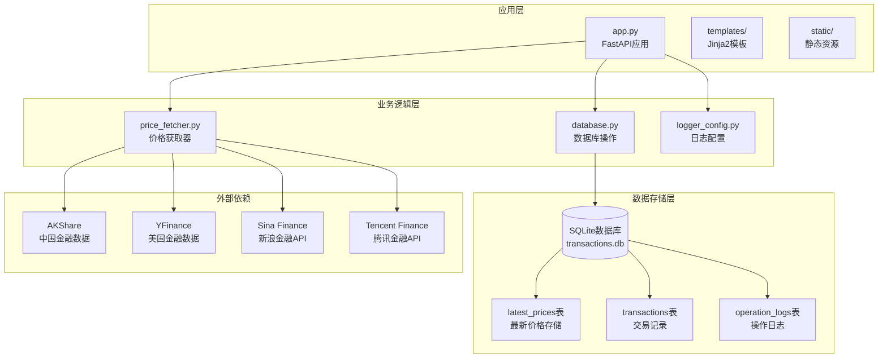
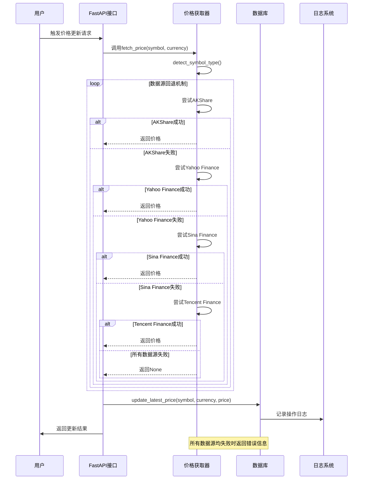
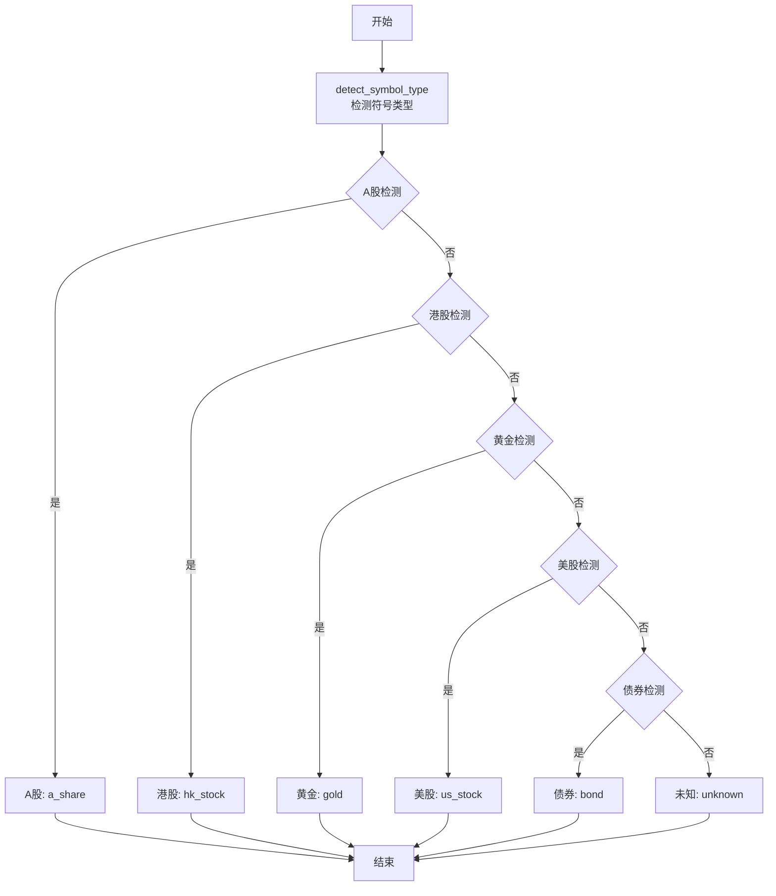
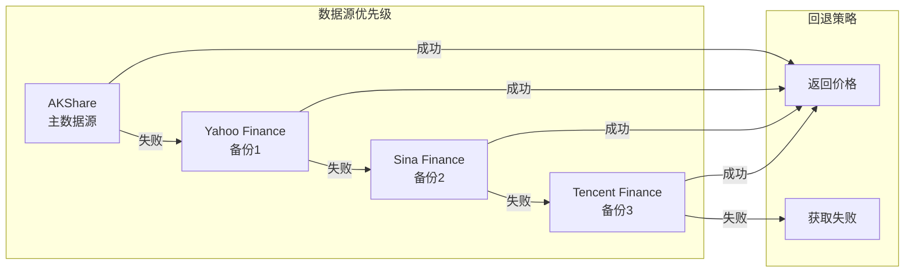
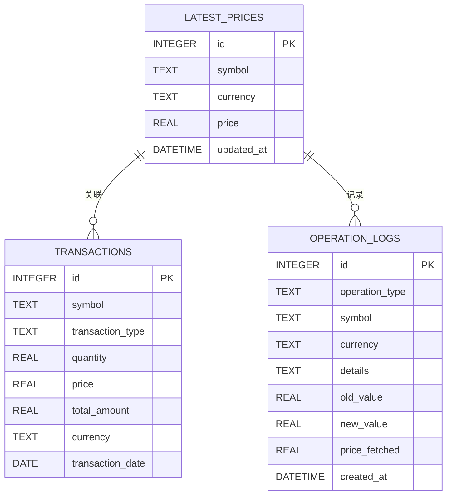
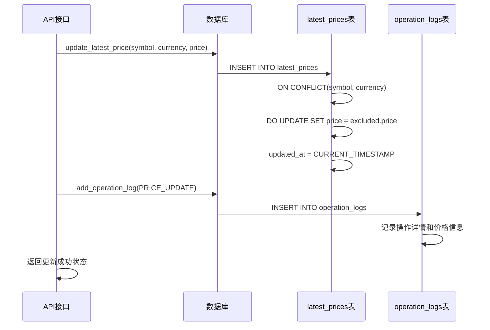
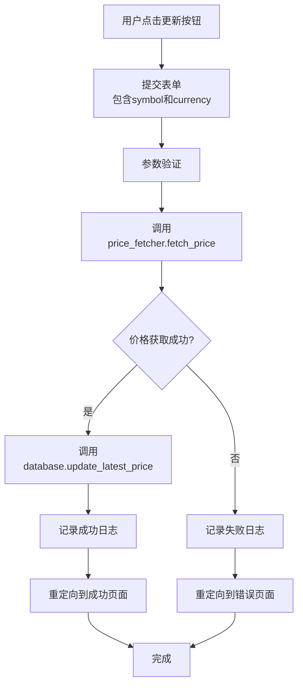
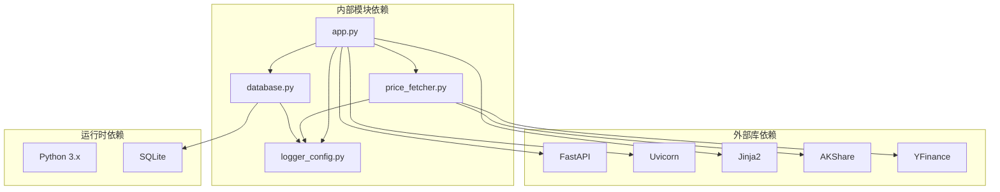
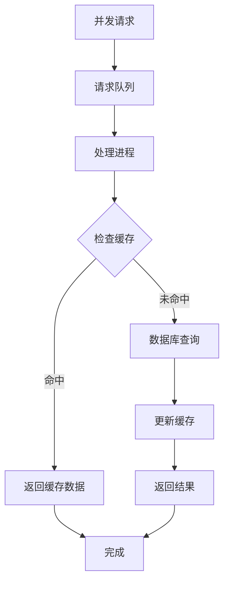

# 价格更新工作流程

<cite>
**本文档引用的文件**
- [app.py](file://app.py)
- [price_fetcher.py](file://price_fetcher.py)
- [database.py](file://database.py)
- [logger_config.py](file://logger_config.py)
- [requirements.txt](file://requirements.txt)
</cite>

## 目录
1. [简介](#简介)
2. [项目结构](#项目结构)
3. [核心组件](#核心组件)
4. [架构概览](#架构概览)
5. [详细组件分析](#详细组件分析)
6. [依赖关系分析](#依赖关系分析)
7. [性能考虑](#性能考虑)
8. [故障排除指南](#故障排除指南)
9. [结论](#结论)

## 简介

本文档详细说明了投资日志系统中的价格更新工作流程。该系统提供了从触发价格更新到最终数据存储的完整流程，包括定时任务调度机制、手动更新触发方式、价格获取器的调用逻辑和回退机制执行过程。系统支持多种数据源（AKShare、Yahoo Finance、新浪金融、腾讯金融），具有完善的错误处理和日志记录功能。

## 项目结构

投资日志项目采用模块化设计，主要包含以下核心文件：

**图表来源**
- [app.py](file://app.py#L1-L50)
- [price_fetcher.py](file://price_fetcher.py#L1-L50)
- [database.py](file://database.py#L20-L150)

**章节来源**
- [app.py](file://app.py#L1-L50)
- [price_fetcher.py](file://price_fetcher.py#L1-L50)
- [database.py](file://database.py#L20-L150)

## 核心组件

### 应用入口点 (FastAPI)
- 提供Web界面和REST API接口
- 处理用户请求和页面渲染
- 集成价格更新功能

### 价格获取器
- 支持多数据源回退机制
- 自动识别股票类型（A股、港股、美股、黄金）
- 统一的价格获取接口

### 数据库管理层
- SQLite数据库操作
- 价格数据存储和查询
- 操作日志记录

### 日志系统
- 基于TimedRotatingFileHandler的日志轮转
- 控制台和文件双重输出
- 7天日志保留策略

**章节来源**
- [app.py](file://app.py#L15-L29)
- [price_fetcher.py](file://price_fetcher.py#L1-L30)
- [database.py](file://database.py#L13-L18)
- [logger_config.py](file://logger_config.py#L14-L54)

## 架构概览

价格更新工作流程采用分层架构设计，确保各组件职责清晰分离：

**图表来源**
- [app.py](file://app.py#L216-L262)
- [price_fetcher.py](file://price_fetcher.py#L321-L394)
- [database.py](file://database.py#L779-L800)

## 详细组件分析

### 价格获取器组件

价格获取器是整个价格更新系统的核心组件，负责从多个数据源获取实时价格信息。

#### 符号类型检测机制

**图表来源**
- [price_fetcher.py](file://price_fetcher.py#L36-L62)

#### 多数据源回退机制

价格获取器实现了四层数据源回退机制，确保在任何情况下都能获取到价格信息：

**图表来源**
- [price_fetcher.py](file://price_fetcher.py#L346-L374)
- [price_fetcher.py](file://price_fetcher.py#L375-L394)

#### 各数据源实现细节

每个数据源都有专门的实现函数：

| 数据源 | 主要功能 | 特殊处理 | 错误处理 |
|--------|----------|----------|----------|
| AKShare | A股、港股、美股、黄金价格 | 直接从数据库表获取 | 异常捕获和日志记录 |
| Yahoo Finance | 美股和港股价格 | 符号格式转换 | 网络异常处理 |
| Sina Finance | A股和港股价格 | GBK编码解码 | 超时和解析错误 |
| Tencent Finance | A股和港股价格 | 简单字符串解析 | 网络请求异常 |

**章节来源**
- [price_fetcher.py](file://price_fetcher.py#L321-L394)

### 数据库存储组件

数据库层负责价格数据的持久化存储和查询操作。

#### 最新价格表结构

**图表来源**
- [database.py](file://database.py#L128-L138)
- [database.py](file://database.py#L25-L46)
- [database.py](file://database.py#L113-L126)

#### 价格更新存储流程

**图表来源**
- [database.py](file://database.py#L779-L800)
- [database.py](file://database.py#L733-L755)

**章节来源**
- [database.py](file://database.py#L779-L825)

### Web接口组件

Web接口层提供用户交互和手动触发价格更新的功能。

#### 手动价格更新流程

**图表来源**
- [app.py](file://app.py#L216-L262)

**章节来源**
- [app.py](file://app.py#L216-L262)

## 依赖关系分析

系统依赖关系清晰，各组件间耦合度适中：

**图表来源**
- [requirements.txt](file://requirements.txt#L1-L6)
- [app.py](file://app.py#L7-L17)

**章节来源**
- [requirements.txt](file://requirements.txt#L1-L6)

## 性能考虑

### 并发处理策略

系统采用以下并发处理策略：

1. **连接池管理**: 每个数据库操作都创建独立的连接，避免连接竞争
2. **异步I/O**: 使用异步HTTP客户端减少等待时间
3. **缓存机制**: 利用SQLite的内置缓存提高查询性能
4. **批量操作**: 对于大量数据更新采用批量插入

### 性能优化建议

1. **索引优化**
   - 为常用查询字段建立索引
   - 考虑在symbol和currency组合上建立复合索引

2. **内存管理**
   - 实现价格数据的LRU缓存
   - 定期清理过期的缓存数据

3. **网络优化**
   - 实现连接复用
   - 设置合理的超时时间
   - 添加重试机制

4. **数据库优化**
   - 使用PRAGMA设置优化参数
   - 定期进行数据库维护

### 并发控制

## 故障排除指南

### 常见问题及解决方案

#### 1. 数据源访问失败

**症状**: 价格获取失败，返回错误信息

**原因分析**:
- 网络连接问题
- 数据源API限制
- 符号格式不正确

**解决步骤**:
1. 检查网络连接状态
2. 验证符号格式是否符合要求
3. 查看日志文件了解具体错误信息

#### 2. 数据库连接问题

**症状**: 无法更新价格或查询历史数据

**解决步骤**:
1. 检查数据库文件是否存在
2. 验证数据库权限设置
3. 确认磁盘空间充足

#### 3. 日志记录异常

**症状**: 日志文件未生成或无法写入

**解决步骤**:
1. 检查logs目录权限
2. 验证磁盘空间
3. 确认文件系统可用性

### 调试工具和方法

#### 日志分析
- 查看`logs/app.log`文件了解系统运行状态
- 关注ERROR级别日志获取错误详情
- 使用INFO级别日志跟踪正常流程

#### 数据验证
- 使用SQLite命令行工具检查数据完整性
- 验证最新价格表的数据一致性
- 检查操作日志的完整性

#### 性能监控
- 监控数据库查询响应时间
- 分析网络请求延迟
- 跟踪内存使用情况

**章节来源**
- [logger_config.py](file://logger_config.py#L14-L54)
- [database.py](file://database.py#L13-L18)

## 结论

投资日志系统的价格更新工作流程设计合理，具有以下特点：

1. **可靠性**: 多数据源回退机制确保价格获取的高可用性
2. **可扩展性**: 模块化设计便于添加新的数据源和功能
3. **可观测性**: 完善的日志记录系统便于问题诊断和性能监控
4. **易用性**: 简洁的Web界面支持手动价格更新操作

通过本文档的详细分析，用户可以全面理解价格更新的完整流程，包括触发机制、数据获取、存储策略和故障处理等方面。系统的设计充分考虑了实际使用场景的需求，在保证功能完整性的同时，也注重了性能和可靠性。