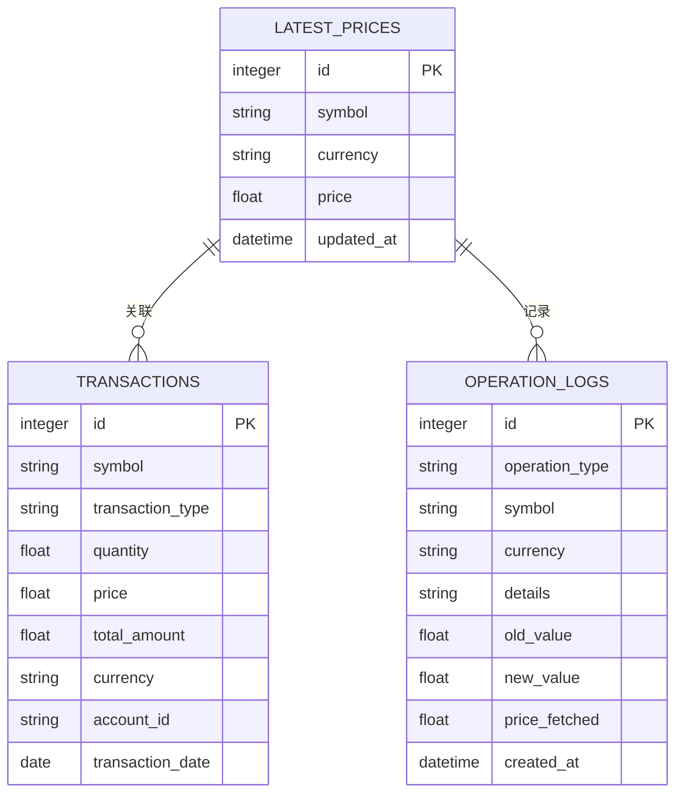

# 价格管理功能

<cite>
**本文档引用的文件**
- [app.py](file://app.py)
- [price_fetcher.py](file://price_fetcher.py)
- [database.py](file://database.py)
- [logger_config.py](file://logger_config.py)
- [requirements.txt](file://requirements.txt)
- [templates/holdings.html](file://templates/holdings.html)
- [templates/symbol.html](file://templates/symbol.html)
</cite>

## 目录
1. [简介](#简介)
2. [项目结构](#项目结构)
3. [核心组件](#核心组件)
4. [架构概览](#架构概览)
5. [详细组件分析](#详细组件分析)
6. [依赖关系分析](#依赖关系分析)
7. [性能考虑](#性能考虑)
8. [故障排除指南](#故障排除指南)
9. [结论](#结论)
10. [附录](#附录)

## 简介

投资日志系统的价格管理功能是一个完整的多数据源价格获取和管理系统。该系统支持实时价格获取、错误处理和重试机制、价格更新流程和缓存策略，并提供了丰富的API接口用于价格管理和查询。

系统集成了四个主要的数据源：AKShare（主数据源）、Yahoo Finance、新浪和腾讯，实现了智能的回退机制，确保在各种网络环境下都能获取到可靠的价格数据。

## 项目结构

投资日志系统采用模块化设计，主要包含以下核心模块：


**图表来源**
- [app.py](file://app.py#L1-L50)
- [price_fetcher.py](file://price_fetcher.py#L1-L30)
- [database.py](file://database.py#L1-L50)

**章节来源**
- [app.py](file://app.py#L1-L50)
- [price_fetcher.py](file://price_fetcher.py#L1-L30)
- [database.py](file://database.py#L1-L50)

## 核心组件

### 价格获取器 (PriceFetcher)

价格获取器是系统的核心组件，负责从多个数据源获取实时价格信息。它实现了智能的符号类型检测和多级回退机制。

### 数据库管理层 (Database Manager)

数据库管理层提供了完整的交易记录、持仓信息、最新价格和操作日志的管理功能。特别设计了`latest_prices`表来存储实时价格缓存。

### 应用接口层 (Web Interface)

应用接口层基于FastAPI构建，提供了RESTful API和HTML页面，支持用户交互和程序调用两种方式。

**章节来源**
- [price_fetcher.py](file://price_fetcher.py#L321-L395)
- [database.py](file://database.py#L128-L138)
- [app.py](file://app.py#L216-L262)

## 架构概览

系统采用分层架构设计，实现了清晰的关注点分离：


**图表来源**
- [app.py](file://app.py#L216-L262)
- [price_fetcher.py](file://price_fetcher.py#L321-L395)
- [database.py](file://database.py#L779-L800)

## 详细组件分析

### 价格获取器实现

#### 符号类型检测

价格获取器首先需要识别不同类型的金融产品：


**图表来源**
- [price_fetcher.py](file://price_fetcher.py#L36-L62)

#### 多数据源回退机制

系统实现了四层数据源回退机制：

```mermaid
graph LR
subgraph "数据源优先级"
Primary[AKShare<br/>主数据源]
Backup1[Yahoo Finance<br/>备份1]
Backup2[Sina Finance<br/>备份2]
Backup3[Tencent Finance<br/>备份3]
end
subgraph "回退策略"
AShare[A股)<br/>AKShare → Yahoo → Sina → Tencent]
HKStock[港股]<br/>AKShare → Yahoo → Sina → Tencent]
USStock[美股]<br/>AKShare → Yahoo → Sina → Tencent]
Gold[黄金]<br/>AKShare → Yahoo]
end
Primary --> AShare
Primary --> HKStock
Primary --> USStock
Primary --> Gold
Backup1 --> AShare
Backup2 --> AShare
Backup3 --> AShare
```

**图表来源**
- [price_fetcher.py](file://price_fetcher.py#L348-L374)

#### 实时价格获取流程

每个数据源都有专门的获取函数，实现了统一的错误处理和日志记录：

**章节来源**
- [price_fetcher.py](file://price_fetcher.py#L321-L395)

### 数据库设计与缓存策略

#### 最新价格表设计

系统专门为价格缓存设计了独立的表结构：



**图表来源**
- [database.py](file://database.py#L128-L138)

#### 缓存更新策略

缓存更新采用了乐观锁和时间戳机制：

**章节来源**
- [database.py](file://database.py#L779-L800)

### Web接口与用户交互

#### 价格更新API

系统提供了完整的API接口用于价格管理：

**章节来源**
- [app.py](file://app.py#L216-L262)

#### 前端集成

前端通过隐藏表单和JavaScript实现了无缝的价格更新体验：

**章节来源**
- [templates/holdings.html](file://templates/holdings.html#L85-L89)
- [templates/holdings.html](file://templates/holdings.html#L142-L150)

## 依赖关系分析

### 外部依赖管理

系统对外部依赖进行了精心管理，确保功能完整性和可维护性：


**图表来源**
- [requirements.txt](file://requirements.txt#L1-L6)

### 内部模块依赖


**图表来源**
- [app.py](file://app.py#L15-L17)
- [price_fetcher.py](file://price_fetcher.py#L20)
- [database.py](file://database.py#L7-L11)

**章节来源**
- [requirements.txt](file://requirements.txt#L1-L6)
- [app.py](file://app.py#L15-L17)

## 性能考虑

### 缓存优化策略

系统采用了多层次的缓存策略来提升性能：

1. **内存缓存**: `get_all_latest_prices()`方法提供了完整的缓存字典
2. **数据库缓存**: `latest_prices`表实现了持久化缓存
3. **索引优化**: 为常用查询字段建立了索引

### 错误处理与重试机制

系统实现了智能的错误处理和重试机制：

- **超时控制**: 每个HTTP请求都有10秒超时限制
- **异常捕获**: 所有外部服务调用都包含异常处理
- **回退策略**: 自动切换到下一个可用数据源
- **日志记录**: 详细的错误日志便于问题诊断

### 并发安全

系统通过以下机制确保并发安全性：

- **原子操作**: 使用SQLite的ON CONFLICT机制保证数据一致性
- **连接管理**: 每个操作都创建独立的数据库连接
- **事务隔离**: 关键操作都在事务中执行

## 故障排除指南

### 常见问题诊断

#### 数据源不可用

当AKShare或Yahoo Finance不可用时，系统会自动回退到其他数据源：

1. 检查网络连接状态
2. 验证数据源API的可用性
3. 查看日志文件中的详细错误信息

#### 价格获取失败

如果所有数据源都失败，系统会返回具体的错误信息：

1. 检查符号格式是否正确
2. 验证货币代码的有效性
3. 确认目标资产类型是否受支持

#### 数据库连接问题

如果遇到数据库相关问题：

1. 检查数据库文件权限
2. 验证SQLite版本兼容性
3. 查看数据库锁定状态

**章节来源**
- [price_fetcher.py](file://price_fetcher.py#L375-L394)
- [logger_config.py](file://logger_config.py#L14-L50)

## 结论

投资日志系统的价格管理功能是一个设计精良、功能完整的解决方案。通过多数据源集成、智能回退机制、完善的缓存策略和健壮的错误处理，系统能够在各种环境下稳定地提供实时价格服务。

系统的主要优势包括：
- **高可用性**: 四层数据源回退机制确保服务稳定性
- **高性能**: 多层次缓存策略减少重复请求
- **易扩展**: 模块化设计便于添加新的数据源
- **可观测性**: 完善的日志记录便于问题诊断

## 附录

### API接口文档

#### 价格更新接口

**POST** `/holdings/update-price`
- **参数**: `symbol` (字符串), `currency` (字符串)
- **响应**: 重定向到持有详情页面，包含成功或错误消息

**章节来源**
- [app.py](file://app.py#L216-L262)

### 开发指南

#### 新数据源集成步骤

1. **添加导入语句**: 在`price_fetcher.py`顶部添加数据源导入
2. **实现获取函数**: 创建`data_source_fetch_symbol_type()`函数
3. **注册到回退列表**: 在`fetch_price()`函数中添加新数据源
4. **测试验证**: 编写单元测试验证功能正确性
5. **更新文档**: 添加数据源使用说明

#### 价格获取器扩展

系统设计支持灵活扩展，可以通过以下方式增强功能：

- **添加新的资产类型**: 在`detect_symbol_type()`中添加识别逻辑
- **优化回退策略**: 调整数据源优先级和条件
- **改进错误处理**: 添加更精细的异常处理机制
- **增强缓存策略**: 实现更智能的缓存失效和更新机制

**章节来源**
- [price_fetcher.py](file://price_fetcher.py#L321-L395)