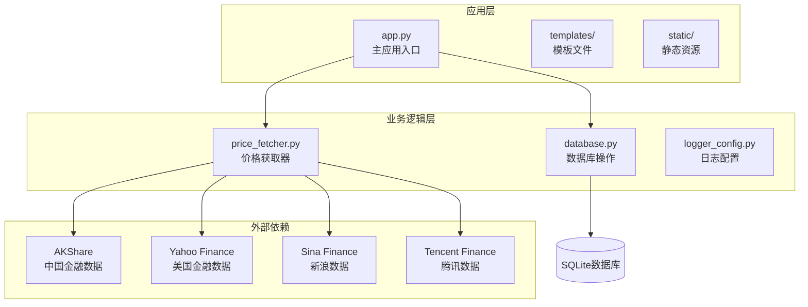
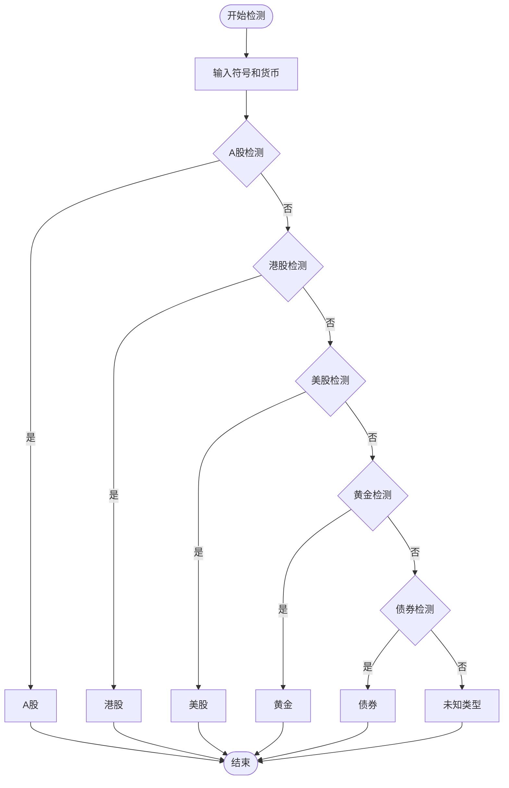
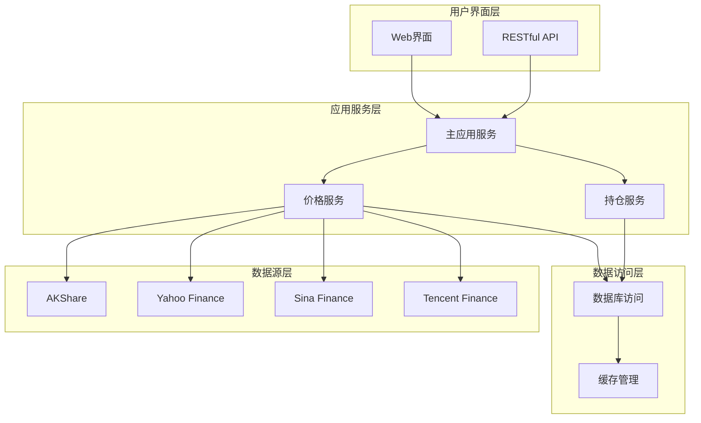
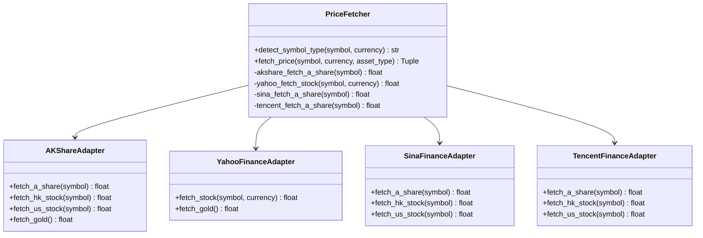
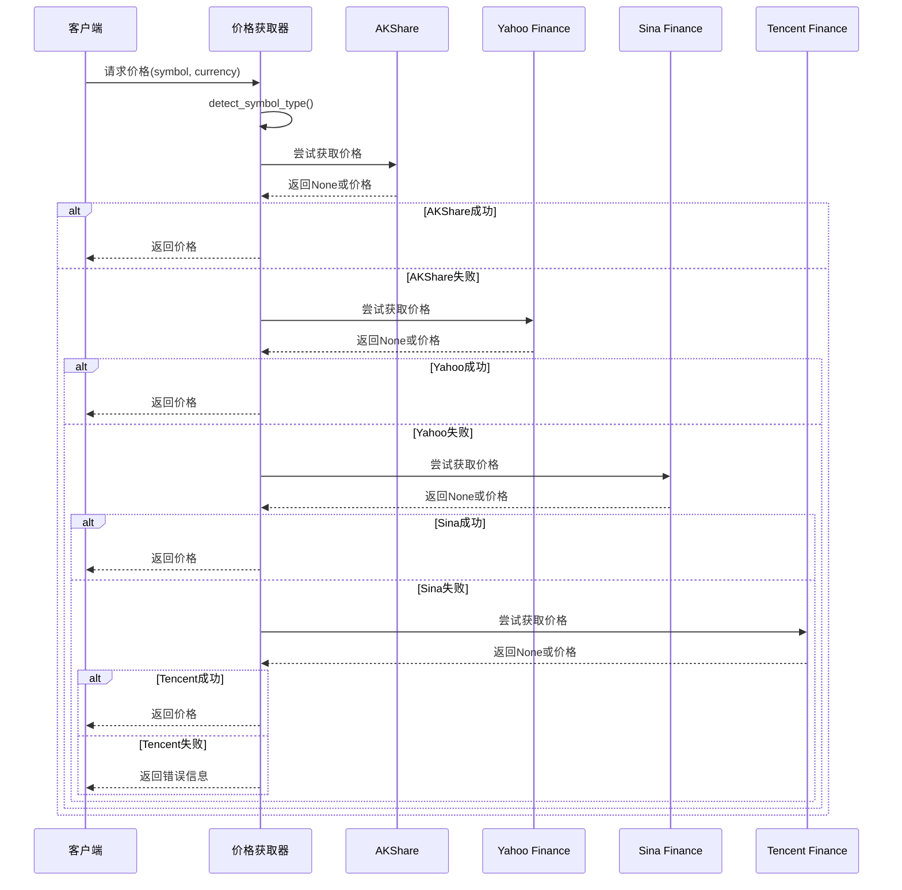
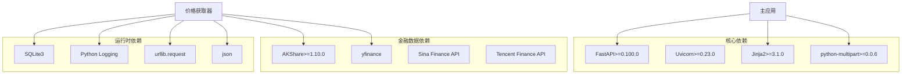

# 多数据源定价策略

<cite>
**本文档引用的文件**
- [app.py](file://app.py)
- [price_fetcher.py](file://price_fetcher.py)
- [database.py](file://database.py)
- [logger_config.py](file://logger_config.py)
- [requirements.txt](file://requirements.txt)
</cite>

## 目录
1. [简介](#简介)
2. [项目结构](#项目结构)
3. [核心组件](#核心组件)
4. [架构概览](#架构概览)
5. [详细组件分析](#详细组件分析)
6. [依赖关系分析](#依赖关系分析)
7. [性能考虑](#性能考虑)
8. [故障排除指南](#故障排除指南)
9. [结论](#结论)

## 简介

投资日志系统的多数据源定价策略是一个高度集成的金融数据获取和管理解决方案。该系统实现了四种主要数据源的优先级排序和智能回退机制，支持A股、港股、美股、黄金等多种资产类型的实时价格获取。

系统的核心优势在于其容错设计：当主要数据源失效时，能够自动切换到备用数据源，确保投资组合管理的连续性和可靠性。这种设计特别适用于中国市场复杂的金融数据环境，其中不同数据源在不同时间点的可用性可能存在差异。

## 项目结构

项目采用模块化架构设计，每个核心功能都封装在独立的模块中：

**图表来源**
- [app.py](file://app.py#L1-L50)
- [price_fetcher.py](file://price_fetcher.py#L1-L30)
- [database.py](file://database.py#L1-L30)

**章节来源**
- [app.py](file://app.py#L1-L50)
- [requirements.txt](file://requirements.txt#L1-L6)

## 核心组件

### 数据源优先级体系

系统实现了严格的四层数据源优先级体系：

1. **AKShare（主要数据源）** - 优先级最高，专门针对中国市场的A股和港股数据
2. **Yahoo Finance** - 第二优先级，支持全球主要市场的股票和黄金数据
3. **Sina Finance API** - 第三优先级，作为A股数据的备份方案
4. **Tencent Finance API** - 最后优先级，提供A股和港股的额外备份

### 符号类型检测机制

系统通过智能的符号类型检测算法识别不同类型的金融产品：

**图表来源**
- [price_fetcher.py](file://price_fetcher.py#L36-L63)

**章节来源**
- [price_fetcher.py](file://price_fetcher.py#L36-L63)

## 架构概览

系统采用分层架构设计，确保了良好的可维护性和扩展性：

**图表来源**
- [app.py](file://app.py#L19-L30)
- [price_fetcher.py](file://price_fetcher.py#L321-L395)

## 详细组件分析

### 价格获取器组件

价格获取器是整个系统的核心组件，负责协调多个数据源的访问和回退机制：

#### 主要功能特性

1. **智能回退机制**：当当前数据源无法获取数据时，自动切换到下一个优先级的数据源
2. **异常处理**：对每个数据源调用进行独立的异常捕获和处理
3. **日志记录**：详细记录每次数据获取尝试的结果和错误信息
4. **格式转换**：统一不同数据源返回的价格格式

#### 数据源适配器

**图表来源**
- [price_fetcher.py](file://price_fetcher.py#L321-L395)

#### 回退机制实现

系统实现了智能的回退策略，确保在任何情况下都能获取到价格数据：

**图表来源**
- [price_fetcher.py](file://price_fetcher.py#L375-L394)

**章节来源**
- [price_fetcher.py](file://price_fetcher.py#L321-L395)

### 符号类型检测机制

系统实现了精确的符号类型检测算法，能够准确识别不同类型的金融产品：

#### A股检测规则

- **交易所前缀**：以"SH"或"SZ"开头的代码
- **数字代码**：6位纯数字代码（如600000、000001）
- **市场特征**：人民币计价的中国A股市场

#### 港股检测规则

- **数字代码**：5位数字代码，通常以0开头（如00005、00700）
- **货币特征**：港币计价的香港股市
- **格式验证**：使用zfill()方法确保5位数字格式

#### 美股检测规则

- **字母代码**：纯大写字母组成的股票代码
- **货币特征**：美元计价的美国股市
- **长度限制**：通常为1-5个字符

#### 黄金检测规则

- **标识符检测**：包含"AU"或"GOLD"关键字
- **商品特征**：贵金属类投资产品
- **价格基准**：以盎司为单位的国际金价

**章节来源**
- [price_fetcher.py](file://price_fetcher.py#L36-L63)

### 数据源适配器实现

#### AKShare适配器

AKShare作为主要数据源，提供了最全面的中国金融市场数据支持：

- **A股数据**：通过`stock_zh_a_spot_em()`获取实时行情
- **港股数据**：通过`stock_hk_spot_em()`获取港股报价
- **美股数据**：通过`stock_us_spot_em()`获取美股信息
- **黄金数据**：通过`spot_golden_benchmark_sge()`获取黄金价格

#### Yahoo Finance适配器

Yahoo Finance提供了全球主要市场的数据支持：

- **股票格式转换**：A股需要添加".SS"或".SZ"后缀
- **港股格式转换**：添加".HK"后缀
- **黄金数据**：使用"GC=F"作为黄金期货代码
- **汇率转换**：将美元金价转换为人民币计价

#### Sina Finance适配器

Sina Finance作为备份数据源，提供了稳定的A股和港股数据：

- **HTTP请求**：使用GET请求获取实时行情
- **编码处理**：正确处理GBK编码的响应数据
- **字段解析**：解析逗号分隔的行情数据字符串
- **超时控制**：设置10秒超时防止阻塞

#### Tencent Finance适配器

Tencent Finance提供了额外的备份选项：

- **URL格式**：使用"http://qt.gtimg.cn/q="前缀
- **字段解析**：解析"~"分隔的数据格式
- **实时性**：提供接近实时的市场数据
- **稳定性**：作为最后的备选数据源

**章节来源**
- [price_fetcher.py](file://price_fetcher.py#L69-L315)

### 错误处理和回退策略

系统实现了多层次的错误处理机制：

1. **数据源可用性检查**：在启动时检测各数据源的可用性
2. **异常捕获**：对每个数据源调用进行独立的异常处理
3. **回退机制**：当当前数据源失败时自动切换到下一个
4. **日志记录**：详细记录每次失败的原因和时间
5. **用户反馈**：向用户提供清晰的错误信息

**章节来源**
- [price_fetcher.py](file://price_fetcher.py#L22-L34)
- [price_fetcher.py](file://price_fetcher.py#L375-L394)

## 依赖关系分析

系统对外部依赖的管理体现了良好的软件工程实践：

**图表来源**
- [requirements.txt](file://requirements.txt#L1-L6)
- [price_fetcher.py](file://price_fetcher.py#L22-L34)

**章节来源**
- [requirements.txt](file://requirements.txt#L1-L6)

## 性能考虑

### 数据获取优化

1. **并发处理**：系统采用异步处理模式，避免阻塞用户界面
2. **缓存机制**：通过数据库缓存最近的价格数据，减少重复请求
3. **连接池**：合理管理数据库连接，避免资源泄漏
4. **超时控制**：为网络请求设置合理的超时时间

### 内存管理

1. **流式处理**：对于大量数据的处理采用流式方式
2. **及时释放**：确保网络请求和数据库连接及时关闭
3. **垃圾回收**：利用Python的垃圾回收机制管理内存

### 扩展性设计

1. **插件架构**：新的数据源可以轻松集成到现有框架中
2. **配置驱动**：通过配置文件管理数据源参数
3. **接口抽象**：定义清晰的接口规范，便于测试和维护

## 故障排除指南

### 常见问题及解决方案

#### 数据源不可用

**症状**：价格获取失败，返回"数据源不可用"错误

**原因分析**：
- 缺少必要的Python包
- 网络连接问题
- 数据源API变更

**解决步骤**：
1. 检查requirements.txt中的依赖是否正确安装
2. 验证网络连接状态
3. 查看日志文件了解具体错误信息

#### 符号识别失败

**症状**：返回"无法识别标的类型"错误

**原因分析**：
- 符号格式不符合预期
- 货币代码不匹配
- 新增的金融产品类型未支持

**解决步骤**：
1. 验证符号格式是否正确
2. 检查货币代码是否在支持范围内
3. 更新符号类型检测逻辑

#### 数据获取超时

**症状**：网络请求超时，影响用户体验

**解决步骤**：
1. 检查网络连接质量
2. 调整超时参数
3. 实施重试机制

**章节来源**
- [price_fetcher.py](file://price_fetcher.py#L375-L394)
- [logger_config.py](file://logger_config.py#L14-L54)

### 日志分析

系统提供了详细的日志记录功能，有助于问题诊断：

1. **调试日志**：记录详细的执行过程和参数
2. **警告日志**：记录潜在问题但不影响功能的事件
3. **错误日志**：记录影响功能的严重问题
4. **操作日志**：记录用户的重要操作行为

**章节来源**
- [logger_config.py](file://logger_config.py#L14-L54)

## 结论

投资日志系统的多数据源定价策略展现了现代金融数据处理的最佳实践。通过精心设计的优先级体系、智能的符号类型检测机制和可靠的回退策略，系统能够在复杂多变的金融环境中提供稳定可靠的价格数据服务。

### 主要优势

1. **高可用性**：四层数据源回退机制确保服务的连续性
2. **准确性**：智能符号检测算法提高了数据识别的准确性
3. **可扩展性**：模块化设计便于新功能的添加和现有功能的改进
4. **可观测性**：完善的日志记录系统便于问题诊断和性能监控

### 技术亮点

- **容错设计**：每个数据源都有明确的失败处理策略
- **性能优化**：合理的超时控制和资源管理
- **用户体验**：及时的错误反馈和友好的用户界面
- **维护友好**：清晰的代码结构和详细的文档说明

这个系统为个人投资者和小型投资机构提供了一个强大而灵活的金融数据管理解决方案，能够满足多样化的投资组合管理需求。