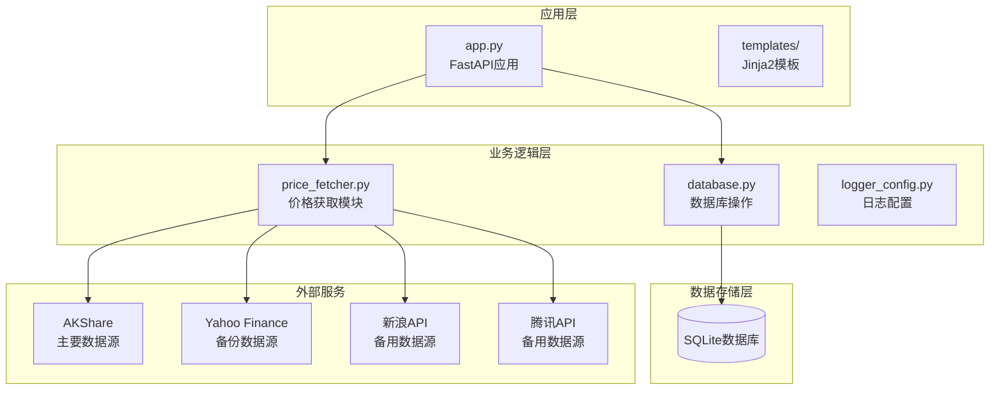
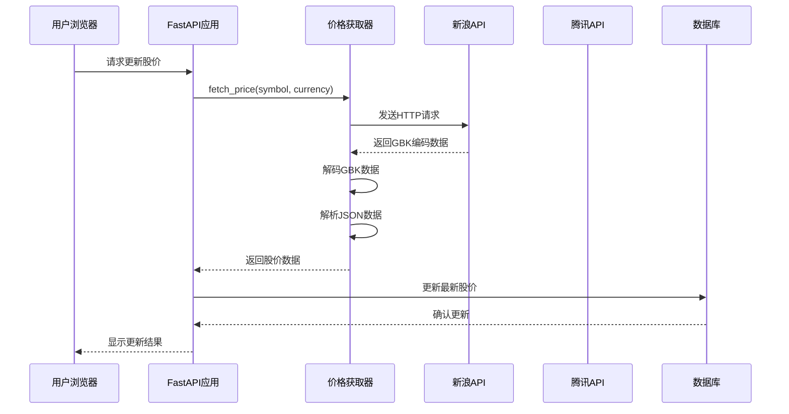
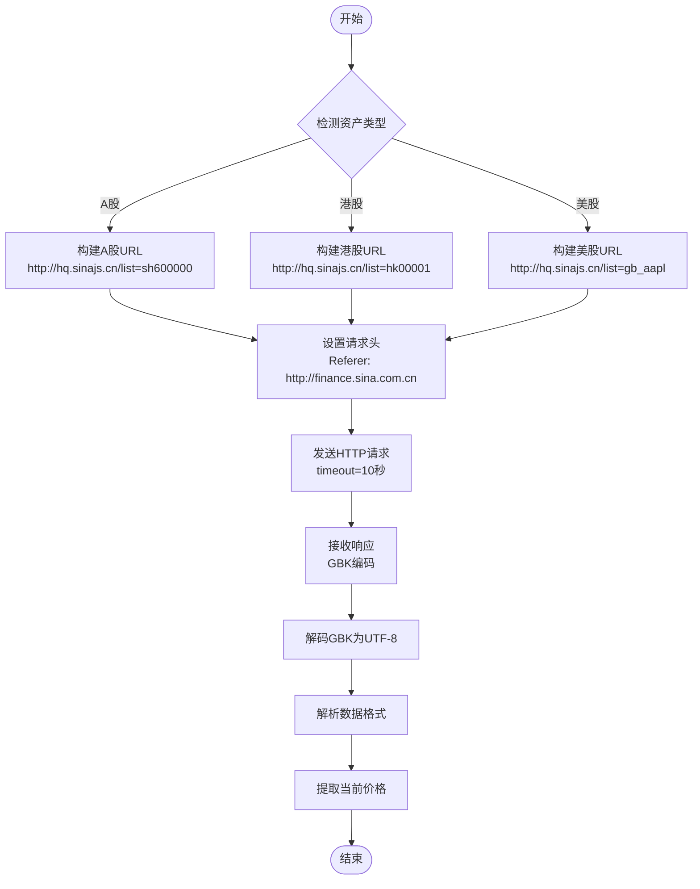
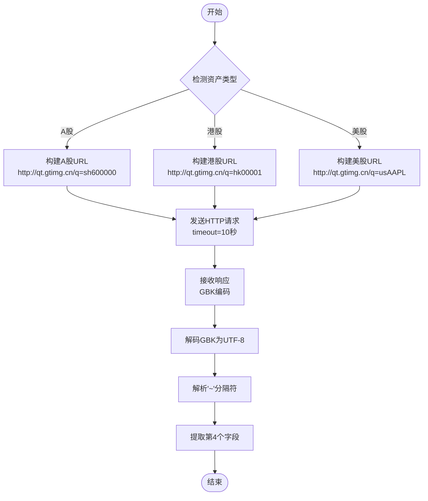
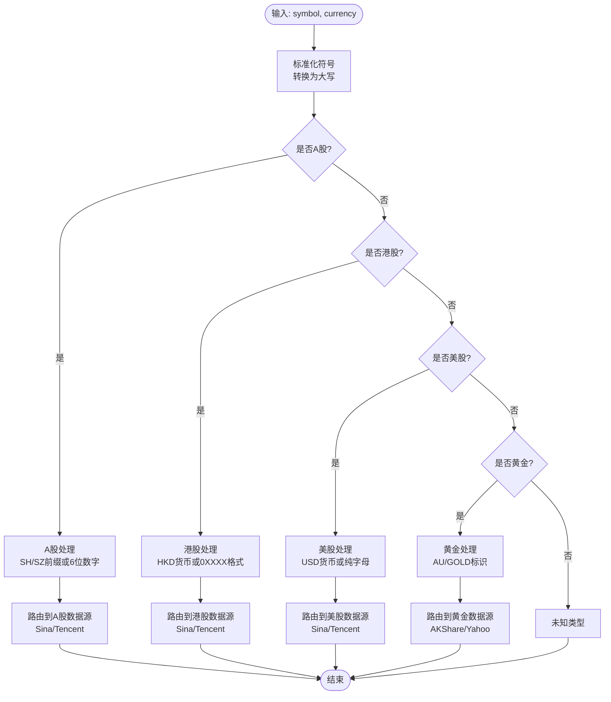
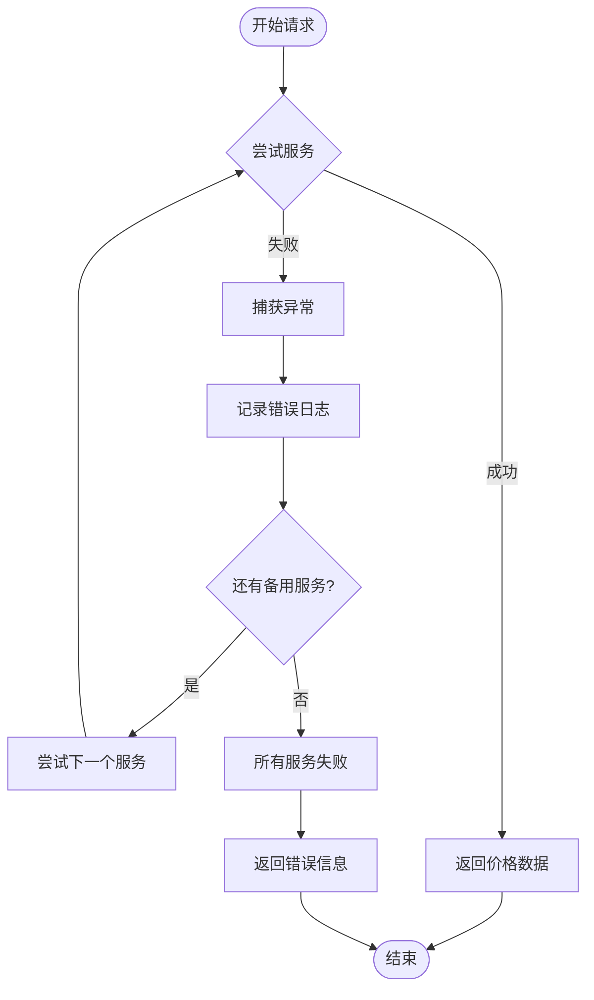
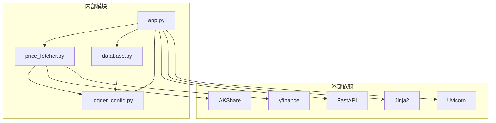

# 新浪和腾讯API数据源集成

<cite>
**本文档引用的文件**
- [app.py](file://app.py)
- [price_fetcher.py](file://price_fetcher.py)
- [database.py](file://database.py)
- [logger_config.py](file://logger_config.py)
- [requirements.txt](file://requirements.txt)
- [templates/holdings.html](file://templates/holdings.html)
</cite>

## 目录
1. [简介](#简介)
2. [项目结构](#项目结构)
3. [核心组件](#核心组件)
4. [架构概览](#架构概览)
5. [详细组件分析](#详细组件分析)
6. [依赖关系分析](#依赖关系分析)
7. [性能考虑](#性能考虑)
8. [故障排除指南](#故障排除指南)
9. [结论](#结论)

## 简介

本项目是一个基于Python的投资日志管理系统，集成了多个金融数据源以获取实时股价信息。本文档重点分析新浪和腾讯API数据源在系统中的集成实现，包括HTTP请求构建、响应解析、数据提取等完整流程。

系统采用多层架构设计，通过FastAPI提供Web界面和REST API，使用SQLite作为数据存储，实现了完整的投资组合管理功能。其中，价格获取模块支持AKShare、Yahoo Finance、新浪和腾讯四种数据源，并具备智能回退机制。

## 项目结构

项目采用模块化设计，主要包含以下核心模块：



**图表来源**
- [app.py](file://app.py#L1-L50)
- [price_fetcher.py](file://price_fetcher.py#L1-L50)
- [database.py](file://database.py#L1-L50)

**章节来源**
- [app.py](file://app.py#L1-L50)
- [requirements.txt](file://requirements.txt#L1-L6)

## 核心组件

### 价格获取模块 (Price Fetcher)

价格获取模块是系统的核心组件，负责从多个数据源获取实时股价信息。该模块实现了智能回退机制，确保在主数据源不可用时能够自动切换到备用数据源。

主要功能特性：
- 支持A股、港股、美股、黄金等多种资产类型
- 多数据源回退机制
- 统一的错误处理和日志记录
- GBK编码处理和数据解析

**章节来源**
- [price_fetcher.py](file://price_fetcher.py#L1-L50)

### 数据库模块 (Database)

数据库模块提供完整的交易记录管理和投资组合计算功能。系统使用SQLite作为数据存储，支持多种资产类型和货币。

关键功能：
- 交易记录的增删改查操作
- 投资组合持有情况计算
- 最新股价跟踪
- 操作日志记录

**章节来源**
- [database.py](file://database.py#L1-L150)

### Web应用 (FastAPI)

Web应用层提供用户界面和API端点，支持交互式的价格更新和交易管理功能。

**章节来源**
- [app.py](file://app.py#L1-L100)

## 架构概览

系统采用分层架构设计，各层职责明确，耦合度低：



**图表来源**
- [app.py](file://app.py#L216-L262)
- [price_fetcher.py](file://price_fetcher.py#L192-L254)
- [database.py](file://database.py#L779-L800)

## 详细组件分析

### 新浪API数据源集成

#### HTTP请求构建

新浪API采用简单的HTTP GET请求方式，支持多种资产类型的查询：



**图表来源**
- [price_fetcher.py](file://price_fetcher.py#L192-L254)

#### 数据格式解析

新浪API返回的数据采用特定的字符串格式，需要进行精确解析：

| 字段 | 位置 | 描述 | 示例 |
|------|------|------|------|
| 名称 | 第1个 | 股票名称 | `"中国平安"` |
| 开盘价 | 第2个 | 当日开盘价 | `"12.34"` |
| 昨收价 | 第3个 | 昨日收盘价 | `"12.10"` |
| 当前价 | 第4个 | 当前价格 | `"12.34"` |
| 最高价 | 第5个 | 当日最高价 | `"12.40"` |
| 最低价 | 第6个 | 当日最低价 | `"12.20"` |

**章节来源**
- [price_fetcher.py](file://price_fetcher.py#L203-L216)

### 腾讯API数据源集成

#### HTTP请求构建

腾讯API同样采用HTTP GET请求，但使用不同的数据格式：



**图表来源**
- [price_fetcher.py](file://price_fetcher.py#L260-L315)

#### 数据格式解析

腾讯API使用'~'字符作为字段分隔符，格式更加简洁：

| 字段 | 位置 | 描述 | 示例 |
|------|------|------|------|
| 完整字符串 | 第1个 | 包含所有字段的字符串 | `"v_sh600000~1~中国平安~12.34~..."` |
| 代码 | 第2个 | 股票代码 | `"sh600000"` |
| 名称 | 第3个 | 股票名称 | `"中国平安"` |
| 当前价 | 第4个 | 当前价格 | `"12.34"` |
| 开盘价 | 第5个 | 当日开盘价 | `"12.10"` |

**章节来源**
- [price_fetcher.py](file://price_fetcher.py#L270-L282)

### 资产类型识别和路由

系统实现了智能的资产类型识别机制，根据符号格式和货币类型自动选择合适的数据源：



**图表来源**
- [price_fetcher.py](file://price_fetcher.py#L36-L62)

**章节来源**
- [price_fetcher.py](file://price_fetcher.py#L36-L62)

### 错误处理和异常捕获

系统实现了完善的错误处理机制，确保在各种异常情况下都能提供有意义的反馈：



**图表来源**
- [price_fetcher.py](file://price_fetcher.py#L375-L395)

**章节来源**
- [price_fetcher.py](file://price_fetcher.py#L375-L395)

## 依赖关系分析

系统依赖关系清晰，各模块职责明确：



**图表来源**
- [requirements.txt](file://requirements.txt#L1-L6)
- [app.py](file://app.py#L7-L17)

**章节来源**
- [requirements.txt](file://requirements.txt#L1-L6)

## 性能考虑

### 超时设置优化

系统在HTTP请求中设置了合理的超时时间，平衡了响应速度和可靠性：

- **新浪API**: 10秒超时
- **腾讯API**: 10秒超时  
- **AKShare**: 无显式超时限制
- **Yahoo Finance**: 无显式超时限制

### 缓存策略

系统实现了多层缓存机制：

1. **数据库缓存**: `latest_prices`表存储最新股价
2. **内存缓存**: 在应用运行期间缓存最近查询结果
3. **浏览器缓存**: 前端页面缓存减少重复请求

### 并发处理

系统支持并发请求处理，但需要注意以下限制：
- SQLite默认支持单进程写入
- 建议在高并发场景下考虑连接池优化

## 故障排除指南

### 常见问题诊断

#### 1. 新浪API访问失败

**症状**: 返回"价格获取失败: 所有数据源均不可用"

**排查步骤**:
1. 检查网络连接状态
2. 验证新浪服务器可访问性
3. 查看日志文件获取详细错误信息

**解决方案**:
- 切换到腾讯API数据源
- 检查防火墙设置
- 验证代理配置

#### 2. 编码问题

**症状**: 中文显示为乱码

**排查步骤**:
1. 检查响应内容的编码格式
2. 验证GBK解码过程
3. 确认UTF-8输出设置

**解决方案**:
- 确保正确使用GBK解码
- 检查模板渲染编码设置
- 验证数据库存储编码

#### 3. 数据解析错误

**症状**: 无法提取有效价格数据

**排查步骤**:
1. 检查API响应格式变化
2. 验证数据字段索引
3. 确认数值格式转换

**解决方案**:
- 更新数据解析逻辑
- 添加格式兼容性检查
- 实现更健壮的错误恢复

### 日志分析

系统提供了详细的日志记录功能，便于问题诊断：

**关键日志类型**:
- `INFO`: 正常操作记录
- `WARNING`: 警告信息
- `ERROR`: 错误详情
- `DEBUG`: 详细调试信息

**日志位置**: `logs/app.log`

**章节来源**
- [logger_config.py](file://logger_config.py#L1-L54)

### API调用示例

#### 成功响应格式

**新浪API响应示例**:
```
var hq_str_sh600000="中国平安,12.34,12.10,12.34,12.40,12.20,...";
```

**腾讯API响应示例**:
```
v_sh600000="1~中国平安~600000~12.34~12.10~...";
```

#### 错误响应处理

当API调用失败时，系统会返回结构化的错误信息：
- 具体的错误原因
- 已尝试的服务列表
- 建议的解决方案

**章节来源**
- [price_fetcher.py](file://price_fetcher.py#L391-L394)

## 结论

新浪和腾讯API数据源集成在本系统中发挥了重要作用，提供了可靠的备用数据源支持。通过智能回退机制和完善的错误处理，系统能够在主数据源不可用时自动切换到备用方案，确保服务的连续性和稳定性。

### 主要优势

1. **多数据源冗余**: 提供了至少两个独立的数据源，提高了系统的可靠性
2. **智能路由**: 自动识别资产类型并选择最合适的API
3. **统一接口**: 对外提供一致的API接口，简化了上层调用
4. **完善的错误处理**: 提供详细的错误信息和回退机制

### 改进建议

1. **增加更多数据源**: 考虑集成更多主流金融数据提供商
2. **实现连接池**: 优化HTTP请求的连接复用
3. **增强缓存策略**: 实现更智能的缓存失效机制
4. **监控告警**: 添加数据源可用性监控和告警功能

通过持续优化和扩展，该数据源集成方案能够为用户提供更加稳定和可靠的投资数据服务。