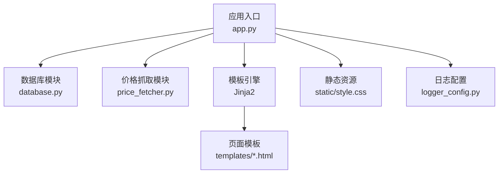
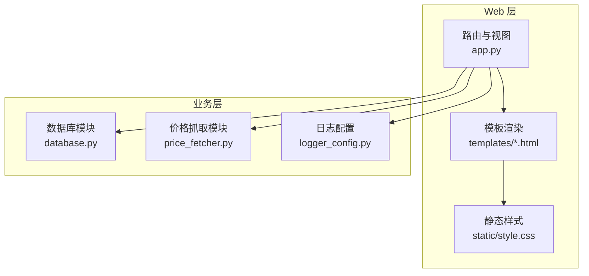
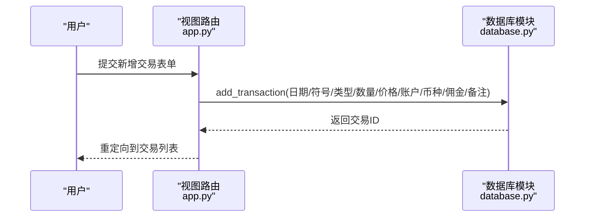
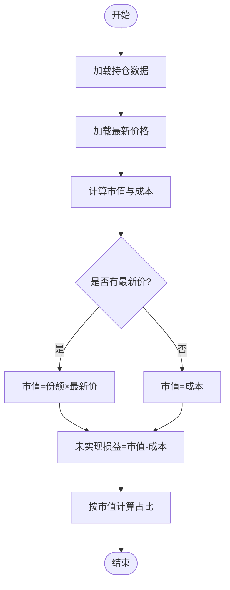
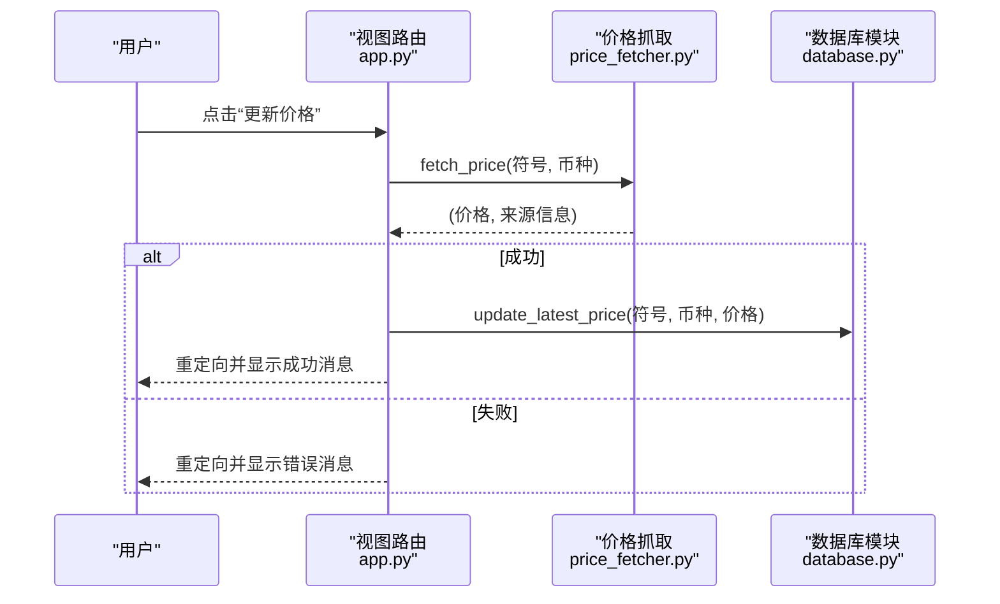
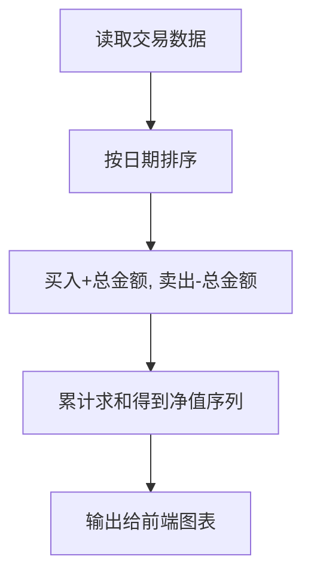
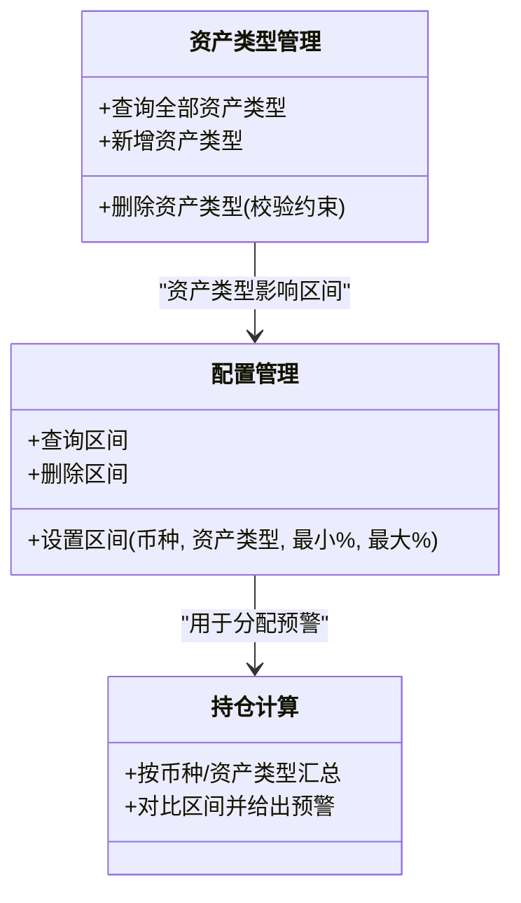
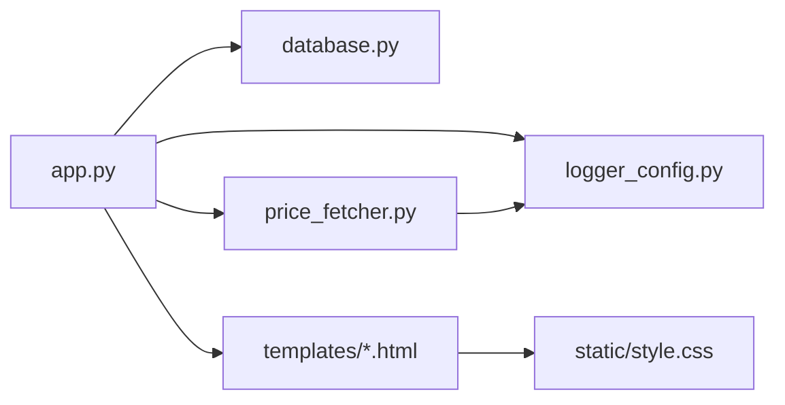

# 功能模块详解

<cite>
**本文引用的文件**
- [app.py](file://app.py)
- [database.py](file://database.py)
- [price_fetcher.py](file://price_fetcher.py)
- [logger_config.py](file://logger_config.py)
- [requirements.txt](file://requirements.txt)
- [templates/base.html](file://templates/base.html)
- [templates/index.html](file://templates/index.html)
- [templates/holdings.html](file://templates/holdings.html)
- [templates/settings.html](file://templates/settings.html)
- [templates/charts.html](file://templates/charts.html)
- [templates/symbol.html](file://templates/symbol.html)
- [templates/transactions.html](file://templates/transactions.html)
- [templates/add.html](file://templates/add.html)
- [static/style.css](file://static/style.css)
</cite>

## 目录
1. [简介](#简介)
2. [项目结构](#项目结构)
3. [核心组件](#核心组件)
4. [架构总览](#架构总览)
5. [详细组件分析](#详细组件分析)
6. [依赖关系分析](#依赖关系分析)
7. [性能考量](#性能考量)
8. [故障排查指南](#故障排查指南)
9. [结论](#结论)
10. [附录](#附录)

## 简介
本系统是一个基于 FastAPI 的投资日志管理平台，提供交易记录、持仓统计、价格获取、图表分析与系统设置等功能。后端以 SQLite 存储交易与配置，前端采用 Jinja2 模板渲染页面，并通过 Chart.js 展示可视化图表。系统支持多币种与多资产类型，具备实时价格抓取与回退机制，以及灵活的资产类型扩展能力。

## 项目结构
- 应用入口与路由：app.py
- 数据访问层：database.py（事务、持仓、账户、配置、日志、价格）
- 实时价格抓取：price_fetcher.py（多源回退策略）
- 日志配置：logger_config.py
- 前端模板：templates/*.html
- 样式表：static/style.css
- 依赖声明：requirements.txt

**图示来源**
- [app.py](file://app.py#L1-L444)
- [database.py](file://database.py#L1-L944)
- [price_fetcher.py](file://price_fetcher.py#L1-L398)
- [logger_config.py](file://logger_config.py#L1-L54)
- [templates/base.html](file://templates/base.html#L1-L27)
- [static/style.css](file://static/style.css#L1-L934)

**章节来源**
- [app.py](file://app.py#L1-L444)
- [database.py](file://database.py#L1-L944)
- [price_fetcher.py](file://price_fetcher.py#L1-L398)
- [logger_config.py](file://logger_config.py#L1-L54)
- [requirements.txt](file://requirements.txt#L1-L6)

## 核心组件
- 交易管理：CRUD 操作、分页查询、删除 API、交易类型分类（买入/卖出/分红/拆股/转账/调整等）
- 持仓管理：按币种与资产类型汇总、成本均价计算、市价与未实现盈亏、百分比与图表
- 价格管理：多源回退抓取（AKShare、Yahoo Finance、新浪、腾讯）、缓存最新价、操作日志
- 报表分析：按日期累计组合价值、按符号/币种的头寸分布饼图
- 系统设置：资产类型增删改、目标配置区间、分配预警
- 前端交互：仪表盘、持仓明细、图表页、交易列表、添加交易、符号详情与调整

**章节来源**
- [app.py](file://app.py#L36-L444)
- [database.py](file://database.py#L156-L944)
- [price_fetcher.py](file://price_fetcher.py#L321-L398)
- [templates/index.html](file://templates/index.html#L1-L90)
- [templates/holdings.html](file://templates/holdings.html#L1-L177)
- [templates/charts.html](file://templates/charts.html#L1-L104)
- [templates/transactions.html](file://templates/transactions.html#L1-L91)
- [templates/add.html](file://templates/add.html#L1-L111)
- [templates/symbol.html](file://templates/symbol.html#L1-L105)
- [templates/settings.html](file://templates/settings.html#L1-L104)

## 架构总览
系统采用“Web 路由 + 模板渲染 + 数据库 + 外部数据源”的分层架构。路由负责请求处理与重定向；模板负责页面渲染；数据库模块封装 SQL；价格抓取模块负责外部数据拉取与回退；日志模块统一记录运行信息。

**图示来源**
- [app.py](file://app.py#L1-L444)
- [database.py](file://database.py#L1-L944)
- [price_fetcher.py](file://price_fetcher.py#L1-L398)
- [logger_config.py](file://logger_config.py#L1-L54)
- [templates/base.html](file://templates/base.html#L1-L27)
- [static/style.css](file://static/style.css#L1-L934)

## 详细组件分析

### 交易管理模块
- 功能要点
  - 新增交易：接收表单参数，计算总金额，写入 transactions 表
  - 查询交易：支持按符号、账户、类型、币种、年份、时间范围过滤，分页返回
  - 更新交易：动态更新字段，必要时重新计算总金额与更新时间戳
  - 删除交易：按 ID 删除，提供 API 返回状态
  - 交易类型：BUY/SELL/DIVIDEND/SPLIT/TRANSFER_IN/TRANSFER_OUT/ADJUST
- 计算逻辑
  - 总金额 = 数量 × 单价（可覆盖）
  - 更新时若数量或单价变化，自动重算总金额
- 历史查询机制
  - 支持年份筛选与日期范围筛选
  - 分页查询，后端计算总数与总页数
- API 接口
  - GET /api/transactions：带过滤条件的交易列表
  - DELETE /api/transactions/{id}：删除交易并返回状态

**图示来源**
- [app.py](file://app.py#L83-L111)
- [database.py](file://database.py#L156-L194)

**章节来源**
- [app.py](file://app.py#L48-L111)
- [database.py](file://database.py#L156-L256)
- [templates/transactions.html](file://templates/transactions.html#L1-L91)

### 持仓管理模块
- 计算逻辑
  - 按符号/账户/币种/资产类型聚合
  - 持有份额 = 买入/转入 + 拆股 - 卖出/转出 ± 调整（仅份额变动）
  - 成本合计 = 买入金额 + 佣金 - 卖出金额 + 佣金 ± 调整（仅价值变动）
  - 平均成本 = 成本合计 / 持有份额（份额>0）
  - 市场价值 = 持有份额 × 最新价（若有）
  - 未实现损益 = 市场价值 - 成本合计
  - 百分比 = 符号市值 / 总市值 × 100
- 详情展示
  - 按币种分组，显示总成本、总市值、总盈亏
  - 每个符号显示份额、均价、成本、市价、市值、盈亏与占比
  - 支持跳转到符号详情页查看历史
- 调整机制
  - 通过 ADJUST 类型交易记录价值调整，差额作为交易金额
  - 支持在符号详情页直接提交调整

**图示来源**
- [database.py](file://database.py#L312-L431)
- [database.py](file://database.py#L434-L481)
- [templates/holdings.html](file://templates/holdings.html#L15-L83)
- [templates/symbol.html](file://templates/symbol.html#L36-L57)

**章节来源**
- [database.py](file://database.py#L312-L481)
- [templates/holdings.html](file://templates/holdings.html#L1-L177)
- [templates/symbol.html](file://templates/symbol.html#L1-L105)

### 价格管理模块
- 实时获取策略
  - 首先根据标的类型与币种选择优先服务
  - 依次尝试 AKShare、Yahoo Finance、新浪、腾讯，遇空值或异常则回退
  - 对 A/HK/US 股票与黄金分别适配不同抓取函数
- 更新流程
  - 触发更新后调用抓取函数，成功则写入 latest_prices 表
  - 记录操作日志（含来源与价格）
  - 成功/失败分别重定向并携带消息
- 数据结构
  - latest_prices：(symbol, currency) → price, updated_at
  - operation_logs：记录每次价格更新/失败事件

**图示来源**
- [app.py](file://app.py#L216-L262)
- [price_fetcher.py](file://price_fetcher.py#L321-L398)
- [database.py](file://database.py#L779-L800)
- [database.py](file://database.py#L733-L773)

**章节来源**
- [price_fetcher.py](file://price_fetcher.py#L36-L398)
- [app.py](file://app.py#L216-L262)
- [database.py](file://database.py#L779-L800)
- [database.py](file://database.py#L733-L773)

### 报表分析模块
- 组合净值曲线
  - 从交易表按日期聚合：买入计入、卖出扣减
  - 计算累计净值序列用于折线/柱状图
- 符号与币种分布
  - 按币种/符号计算市值占比，生成饼图
  - 支持点击符号进入详情页
- 图表生成算法
  - 使用 Chart.js 渲染，数据来自后端 API 或模板传入的聚合结果

**图示来源**
- [app.py](file://app.py#L404-L428)
- [templates/index.html](file://templates/index.html#L48-L82)
- [templates/charts.html](file://templates/charts.html#L56-L97)

**章节来源**
- [app.py](file://app.py#L404-L428)
- [templates/index.html](file://templates/index.html#L1-L90)
- [templates/charts.html](file://templates/charts.html#L1-L104)

### 系统设置模块
- 资产类型管理
  - 列表展示、新增、删除（受约束：存在交易则不可删除）
  - 与交易表的 asset_type 字段关联
- 配置管理
  - 为每种币种设置各类资产的目标区间（最小/最大百分比）
  - 在持仓页按区间显示预警提示
- 资产管理机制
  - 通过 allocation_settings 表存储区间
  - 通过 operation_logs 记录关键操作

**图示来源**
- [database.py](file://database.py#L828-L944)
- [database.py](file://database.py#L605-L727)
- [templates/settings.html](file://templates/settings.html#L1-L104)

**章节来源**
- [database.py](file://database.py#L605-L727)
- [database.py](file://database.py#L828-L944)
- [templates/settings.html](file://templates/settings.html#L1-L104)

### 前端与交互
- 导航与布局：base.html 提供通用导航与样式引入
- 页面功能
  - 仪表盘：按币种展示资产配置与预警
  - 持仓明细：显示各符号的市值、盈亏与占比
  - 图表页：按币种展示符号占比饼图
  - 交易列表：分页展示并支持删除
  - 添加交易：表单预填账户与资产类型
  - 符号详情：显示持有概况与交易历史，支持价值调整
  - 设置页：资产类型管理与配置区间编辑
- 交互细节
  - 快速交易弹窗、确认删除、价格更新确认
  - 自动计算总金额预览

**章节来源**
- [templates/base.html](file://templates/base.html#L1-L27)
- [templates/index.html](file://templates/index.html#L1-L90)
- [templates/holdings.html](file://templates/holdings.html#L1-L177)
- [templates/charts.html](file://templates/charts.html#L1-L104)
- [templates/transactions.html](file://templates/transactions.html#L1-L91)
- [templates/add.html](file://templates/add.html#L1-L111)
- [templates/symbol.html](file://templates/symbol.html#L1-L105)
- [templates/settings.html](file://templates/settings.html#L1-L104)
- [static/style.css](file://static/style.css#L1-L934)

## 依赖关系分析
- 运行时依赖
  - FastAPI、Uvicorn、Jinja2、python-multipart
  - 可选库：akshare、yfinance（用于价格抓取）
- 内部模块依赖
  - app.py 依赖 database.py 与 price_fetcher.py
  - 模板依赖静态样式与 Chart.js
  - 日志模块被 app 与 price_fetcher 共同使用

**图示来源**
- [app.py](file://app.py#L1-L18)
- [database.py](file://database.py#L1-L18)
- [price_fetcher.py](file://price_fetcher.py#L1-L21)
- [logger_config.py](file://logger_config.py#L1-L54)
- [templates/base.html](file://templates/base.html#L1-L27)
- [static/style.css](file://static/style.css#L1-L934)

**章节来源**
- [requirements.txt](file://requirements.txt#L1-L6)
- [app.py](file://app.py#L1-L18)

## 性能考量
- 数据库索引
  - 已建立 symbol、date、account、type、currency、asset_type 等索引，提升查询效率
- 查询优化
  - 分页查询与总数计算分离，避免一次性加载大量数据
  - 交易历史查询支持年份与日期范围过滤
- 前端渲染
  - Chart.js 在客户端渲染，数据通过 API 或模板传入，减少服务端压力
- 价格抓取
  - 多源回退降低单点故障风险；成功后写入缓存表，避免重复抓取

[本节为通用建议，无需特定文件引用]

## 故障排查指南
- 价格获取失败
  - 检查网络与外部数据源可用性
  - 查看 operation_logs 中的失败记录与错误摘要
  - 确认符号格式与币种匹配（A/HK/US/黄金）
- 交易删除失败
  - 确认交易 ID 是否存在
  - 查看后端日志中的警告信息
- 资产类型删除受限
  - 若存在相关交易记录则不可删除，需先清理或迁移

**章节来源**
- [database.py](file://database.py#L733-L773)
- [app.py](file://app.py#L431-L439)
- [database.py](file://database.py#L868-L901)
- [logger_config.py](file://logger_config.py#L1-L54)

## 结论
该系统以简洁的分层设计实现了完整的投资日志管理闭环：从交易录入、持仓计算、价格抓取到报表展示与配置管理。通过多源回退的价格抓取与清晰的资产类型体系，满足多币种、多市场的资产管理需求。前端模板与图表库提供了直观的可视化体验。建议后续可考虑引入更细粒度的权限控制、批量导入导出与更丰富的技术分析指标。

[本节为总结性内容，无需特定文件引用]

## 附录

### API 接口清单与使用示例
- 获取当前持仓
  - 方法：GET
  - 路径：/api/holdings
  - 参数：account_id（可选）
  - 示例：curl "http://127.0.0.1:8000/api/holdings?account_id=broker-001"
- 按币种汇总与预警
  - 方法：GET
  - 路径：/api/holdings-by-currency
  - 示例：curl "http://127.0.0.1:8000/api/holdings-by-currency"
- 查询交易
  - 方法：GET
  - 路径：/api/transactions
  - 参数：symbol、account_id、transaction_type、limit
  - 示例：curl "http://127.0.0.1:8000/api/transactions?symbol=AAPL&limit=50"
- 组合净值历史
  - 方法：GET
  - 路径：/api/portfolio-history
  - 示例：curl "http://127.0.0.1:8000/api/portfolio-history"
- 删除交易
  - 方法：DELETE
  - 路径：/api/transactions/{transaction_id}
  - 示例：curl -X DELETE "http://127.0.0.1:8000/api/transactions/123"

**章节来源**
- [app.py](file://app.py#L376-L439)

### 开发与扩展指南
- 新增资产类型
  - 通过设置页新增或调用数据库接口
  - 注意删除前检查是否存在相关交易
- 扩展价格源
  - 在 price_fetcher.py 中新增抓取函数与类型检测分支
  - 将新服务加入回退链路
- 自定义报表
  - 在 app.py 中新增 API 返回所需数据
  - 在模板中使用 Chart.js 渲染
- 配置区间扩展
  - 在设置页中维护新的币种/资产类型组合区间
  - 在持仓汇总逻辑中体现预警提示

**章节来源**
- [database.py](file://database.py#L828-L944)
- [price_fetcher.py](file://price_fetcher.py#L321-L398)
- [templates/settings.html](file://templates/settings.html#L1-L104)
- [templates/index.html](file://templates/index.html#L1-L90)