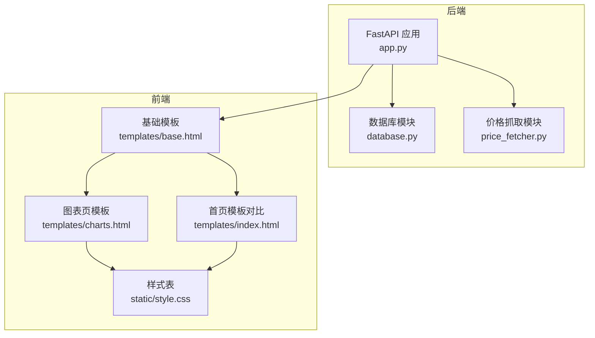
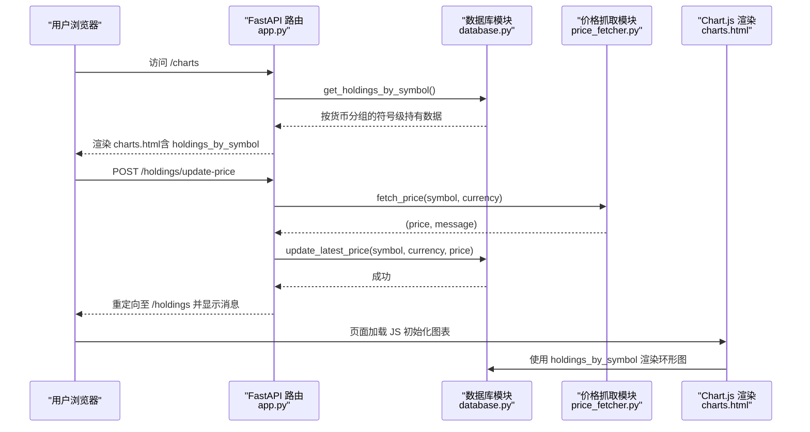
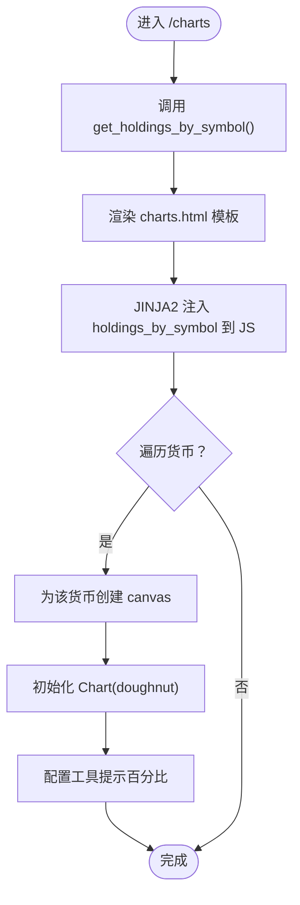
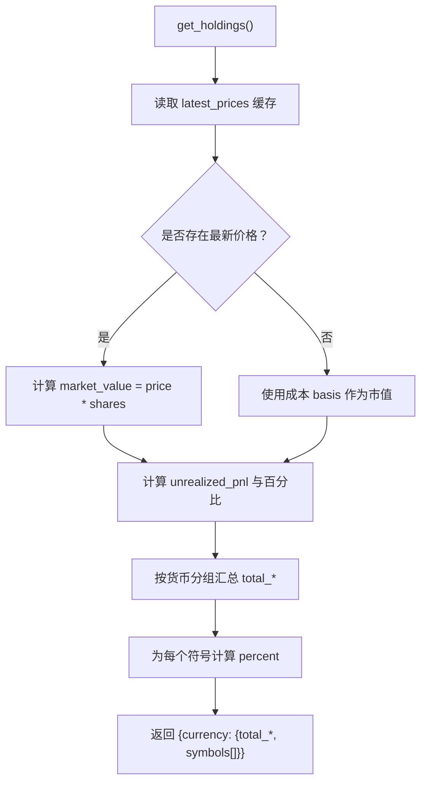
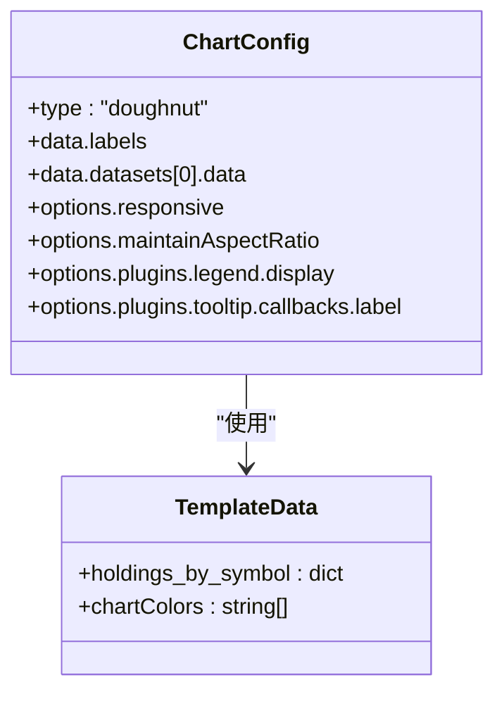
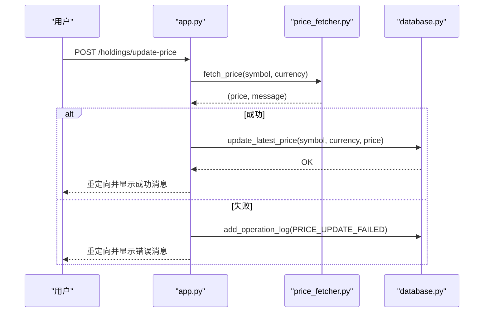
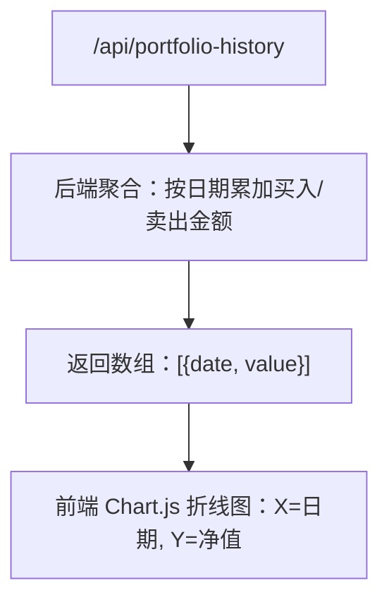

# 投资组合图表

<cite>
**本文引用的文件**
- [app.py](file://app.py)
- [database.py](file://database.py)
- [price_fetcher.py](file://price_fetcher.py)
- [templates/base.html](file://templates/base.html)
- [templates/charts.html](file://templates/charts.html)
- [templates/index.html](file://templates/index.html)
- [static/style.css](file://static/style.css)
- [requirements.txt](file://requirements.txt)
</cite>

## 目录
1. [简介](#简介)
2. [项目结构](#项目结构)
3. [核心组件](#核心组件)
4. [架构总览](#架构总览)
5. [组件详解](#组件详解)
6. [依赖关系分析](#依赖关系分析)
7. [性能与可扩展性](#性能与可扩展性)
8. [故障排查指南](#故障排查指南)
9. [结论](#结论)
10. [附录：API与模板使用示例](#附录api与模板使用示例)

## 简介
本文件聚焦于投资日志系统的“投资组合图表”功能，系统通过 FastAPI 提供后端服务，使用 Chart.js 在前端渲染图表。图表页面按货币分组展示各符号的持仓市值占比（环形图），并提供交互式图例与工具提示。数据由数据库聚合计算，实时价格通过价格抓取模块获取并缓存，支持多数据源回退策略。

## 项目结构
- 后端入口与路由：app.py
- 数据访问层：database.py（持有量聚合、最新价格管理、设置与日志）
- 价格抓取模块：price_fetcher.py（多数据源回退）
- 前端模板与样式：templates/*.html、static/style.css
- 依赖声明：requirements.txt



**图表来源**
- [app.py](file://app.py#L113-L121)
- [database.py](file://database.py#L361-L431)
- [price_fetcher.py](file://price_fetcher.py#L321-L394)
- [templates/base.html](file://templates/base.html#L1-L27)
- [templates/charts.html](file://templates/charts.html#L1-L104)
- [templates/index.html](file://templates/index.html#L1-L90)
- [static/style.css](file://static/style.css#L243-L757)

**章节来源**
- [app.py](file://app.py#L113-L121)
- [templates/base.html](file://templates/base.html#L1-L27)

## 核心组件
- 图表页面路由与数据准备：/charts 路由调用数据库聚合函数，返回按货币分组的符号级持有量与市值信息。
- 数据库聚合：
  - get_holdings_by_symbol：按货币分组，计算每个符号的总份额、成本、最新价格、市值、未实现盈亏与百分比。
  - get_all_latest_prices：批量获取最新价格字典，用于图表数据生成。
- Chart.js 集成：在 charts.html 中通过 JINJA2 变量注入数据，初始化环形图，配置响应式与工具提示。
- 实时价格追踪：/holdings/update-price 触发价格抓取，写入 latest_prices 表，随后可在图表页刷新显示最新值。
- API 接口：/api/portfolio-history 提供累计净值序列，可用于折线图展示收益曲线。

**章节来源**
- [app.py](file://app.py#L113-L121)
- [database.py](file://database.py#L361-L431)
- [database.py](file://database.py#L815-L824)
- [templates/charts.html](file://templates/charts.html#L56-L97)
- [app.py](file://app.py#L216-L262)
- [price_fetcher.py](file://price_fetcher.py#L321-L394)
- [app.py](file://app.py#L424-L448)

## 架构总览
图表功能的数据流从数据库到模板再到 Chart.js，实时价格通过独立的价格抓取流程更新缓存表。



**图表来源**
- [app.py](file://app.py#L113-L121)
- [app.py](file://app.py#L216-L262)
- [database.py](file://database.py#L361-L431)
- [database.py](file://database.py#L779-L800)
- [price_fetcher.py](file://price_fetcher.py#L321-L394)
- [templates/charts.html](file://templates/charts.html#L56-L97)

## 组件详解

### 图表页面与模板绑定
- 路由：/charts 返回模板 charts.html，并传入 holdings_by_symbol 与资产类型标签映射。
- 模板结构：
  - 使用基础模板引入 Chart.js。
  - 通过 JINJA2 注入 holdings_by_symbol 到 JS 变量，再遍历每种货币生成一个 canvas。
  - 仅当符号市值大于 0 时创建图表实例，避免空数据。
  - 工具提示回调计算百分比，便于快速判断占比。
- 样式：定义了图表卡片、图例项、颜色变量等样式类，确保图表布局与主题一致。



**图表来源**
- [app.py](file://app.py#L113-L121)
- [templates/charts.html](file://templates/charts.html#L8-L97)
- [templates/base.html](file://templates/base.html#L8)

**章节来源**
- [app.py](file://app.py#L113-L121)
- [templates/charts.html](file://templates/charts.html#L1-L104)
- [templates/base.html](file://templates/base.html#L1-L27)
- [static/style.css](file://static/style.css#L243-L757)

### 数据聚合与按符号分组
- get_holdings_by_symbol：
  - 先调用 get_holdings 获取符号级总份额与成本。
  - 读取 latest_prices 缓存，计算每个符号的最新价格与市值。
  - 计算未实现盈亏与百分比，按市场价值降序排列。
  - 结果按货币分组，包含 total_cost、total_market_value、symbols 列表。
- get_all_latest_prices：
  - 返回 (symbol, currency) -> 行 的字典，便于 O(1) 查找最新价格。
- 依赖资产类型标签映射，用于前端显示。



**图表来源**
- [database.py](file://database.py#L361-L431)
- [database.py](file://database.py#L815-L824)

**章节来源**
- [database.py](file://database.py#L361-L431)
- [database.py](file://database.py#L815-L824)

### Chart.js 集成与配置
- 引入方式：基础模板直接引入 CDN 版本的 Chart.js。
- 图表类型：环形图（doughnut），适合展示占比。
- 数据源：JS 从 JINJA2 注入的 holdings_by_symbol 中提取 labels 与 datasets。
- 配置要点：
  - responsive 与 maintainAspectRatio：自适应容器尺寸。
  - legend.display=false：使用自定义图例。
  - tooltip.callbacks.label：显示百分比而非绝对值，提升可读性。
- 颜色方案：模板内定义颜色变量与随机取模，保证不同符号颜色区分度。



**图表来源**
- [templates/base.html](file://templates/base.html#L8)
- [templates/charts.html](file://templates/charts.html#L68-L94)

**章节来源**
- [templates/base.html](file://templates/base.html#L1-L27)
- [templates/charts.html](file://templates/charts.html#L56-L97)

### 实时价格追踪与动态更新
- 触发路径：/holdings/update-price 接收表单参数，调用 price_fetcher.fetch_price 获取最新价格。
- 写入缓存：成功后调用 database.update_latest_price 写入 latest_prices 表。
- 日志记录：写入 operation_logs，便于审计。
- 图表刷新：由于 charts.html 使用 JINJA2 注入的静态数据，若需即时反映新价格，建议：
  - 采用 AJAX 请求 /api/holdings-by-currency 或重新渲染 /charts。
  - 或在页面中增加手动刷新按钮触发异步更新。



**图表来源**
- [app.py](file://app.py#L216-L262)
- [price_fetcher.py](file://price_fetcher.py#L321-L394)
- [database.py](file://database.py#L779-L800)

**章节来源**
- [app.py](file://app.py#L216-L262)
- [price_fetcher.py](file://price_fetcher.py#L321-L394)
- [database.py](file://database.py#L779-L800)

### 折线图与历史净值（扩展建议）
- 当前 API：/api/portfolio-history 返回按日期累加的净值序列，适合折线图展示收益曲线。
- 建议：
  - 在图表页新增折线图选项卡或切换按钮。
  - 使用相同的时间序列数据，绘制累计净值随时间变化的折线图。
  - 可叠加“基准”或“年化收益”辅助线，增强可视化效果。



**图表来源**
- [app.py](file://app.py#L424-L448)

**章节来源**
- [app.py](file://app.py#L424-L448)

## 依赖关系分析
- 运行时依赖：FastAPI、Jinja2、python-multipart、Chart.js（CDN）、可选 akshare/yfinance。
- 模块耦合：
  - app.py 依赖 database.py 与 price_fetcher.py。
  - charts.html 依赖 base.html 与 database.py 提供的数据。
  - style.css 为图表与页面提供统一视觉风格。

```mermaid
graph LR
app["app.py"] --> db["database.py"]
app --> pf["price_fetcher.py"]
charts["templates/charts.html"] --> base["templates/base.html"]
charts --> db
base --> chartjs["Chart.js(CDN)"]
style["static/style.css"] --> charts
```

**图表来源**
- [app.py](file://app.py#L1-L20)
- [database.py](file://database.py#L1-L20)
- [price_fetcher.py](file://price_fetcher.py#L1-L20)
- [templates/base.html](file://templates/base.html#L8)
- [templates/charts.html](file://templates/charts.html#L1-L104)
- [static/style.css](file://static/style.css#L243-L757)

**章节来源**
- [requirements.txt](file://requirements.txt#L1-L6)
- [app.py](file://app.py#L1-L20)

## 性能与可扩展性
- 数据聚合复杂度：
  - get_holdings_by_symbol 对 holdings 与 latest_prices 进行一次遍历，时间复杂度近似 O(n+m)，空间复杂度 O(m)。
  - 若符号数量较多，建议对 latest_prices 建立索引或缓存热点符号。
- 图表渲染：
  - 每个货币创建一个 Chart 实例，DOM 操作与 Canvas 渲染成本与符号数线性相关。
  - 可考虑懒加载或虚拟滚动，减少一次性渲染压力。
- 价格抓取：
  - 多数据源回退策略会增加网络请求次数，建议：
    - 限制并发抓取频率。
    - 对失败的符号进行重试队列与指数退避。
    - 将常用符号加入本地缓存，降低重复抓取概率。
- API 扩展：
  - /api/portfolio-history 可按时间窗口裁剪，避免超大数据集传输。
  - 可增加分页或分段加载，提升前端交互流畅度。

[本节为通用性能建议，无需特定文件引用]

## 故障排查指南
- 图表不显示或空白
  - 检查 holdings_by_symbol 是否为空；确认数据库中存在有效持有数据。
  - 确认模板中 JS 能正确读取 JINJA2 注入的变量。
- 价格未更新
  - 确认 /holdings/update-price 路由是否被调用且返回成功。
  - 检查 latest_prices 表是否写入成功。
  - 若使用 CDN Chart.js，请检查网络与跨域策略。
- 价格抓取失败
  - 查看 operation_logs 中的失败记录。
  - 检查外部数据源可用性与网络状况。
  - 确认已安装并启用 akshare/yfinance（如需要）。

**章节来源**
- [app.py](file://app.py#L216-L262)
- [database.py](file://database.py#L779-L800)
- [database.py](file://database.py#L733-L772)
- [templates/base.html](file://templates/base.html#L8)

## 结论
该图表功能通过清晰的前后端职责划分，实现了按货币分组的符号级占比展示。数据库聚合提供准确的市值与百分比，Chart.js 提供直观的可视化体验。结合实时价格抓取与缓存机制，系统具备良好的可维护性与扩展性。后续可在折线图、交互式筛选与多维度分析方面进一步增强。

[本节为总结性内容，无需特定文件引用]

## 附录：API与模板使用示例

### 图表页面路由与数据
- 路由：GET /charts
- 返回：JINJA2 模板 charts.html
- 模板变量：
  - holdings_by_symbol：按货币分组的符号级持有数据
  - asset_type_labels：资产类型标签映射

**章节来源**
- [app.py](file://app.py#L113-L121)
- [templates/charts.html](file://templates/charts.html#L1-L104)

### 实时价格更新 API
- 路由：POST /holdings/update-price
- 表单字段：symbol, currency
- 行为：调用 price_fetcher.fetch_price，成功则写入 latest_prices，失败记录 operation_logs

**章节来源**
- [app.py](file://app.py#L216-L262)
- [price_fetcher.py](file://price_fetcher.py#L321-L394)
- [database.py](file://database.py#L779-L800)

### 历史净值 API（折线图数据）
- 路由：GET /api/portfolio-history
- 返回：按日期累加的净值序列，格式为数组对象，包含 date 与 value 字段

**章节来源**
- [app.py](file://app.py#L424-L448)

### 模板变量绑定与图表初始化
- 模板：charts.html
- 关键点：
  - JINJA2 注入 holdings_by_symbol
  - JS 遍历货币，过滤市值>0的符号，初始化 doughnut 图
  - 工具提示回调计算百分比

**章节来源**
- [templates/charts.html](file://templates/charts.html#L56-L97)

### 开发与定制指南
- 新增图表类型
  - 在 charts.html 中新增 canvas 与初始化逻辑，选择合适的 Chart.js 类型（柱状、面积、散点等）。
  - 如需后端数据支撑，可在 app.py 中新增 API 并在模板中注入。
- 动态更新机制
  - 建议在页面中增加“刷新”按钮，通过 AJAX 调用 /api/holdings-by-currency 获取最新数据并重新渲染。
- 主题与样式
  - 修改 static/style.css 中的图表相关样式类，保持与整体设计一致。
- 多数据源扩展
  - 在 price_fetcher.py 中新增 fetch 函数与优先级列表，完善回退策略。

**章节来源**
- [templates/charts.html](file://templates/charts.html#L1-L104)
- [static/style.css](file://static/style.css#L243-L757)
- [price_fetcher.py](file://price_fetcher.py#L321-L394)