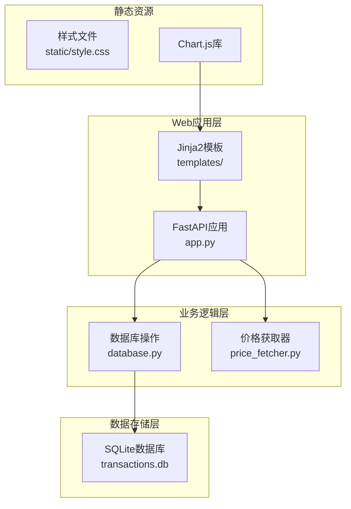
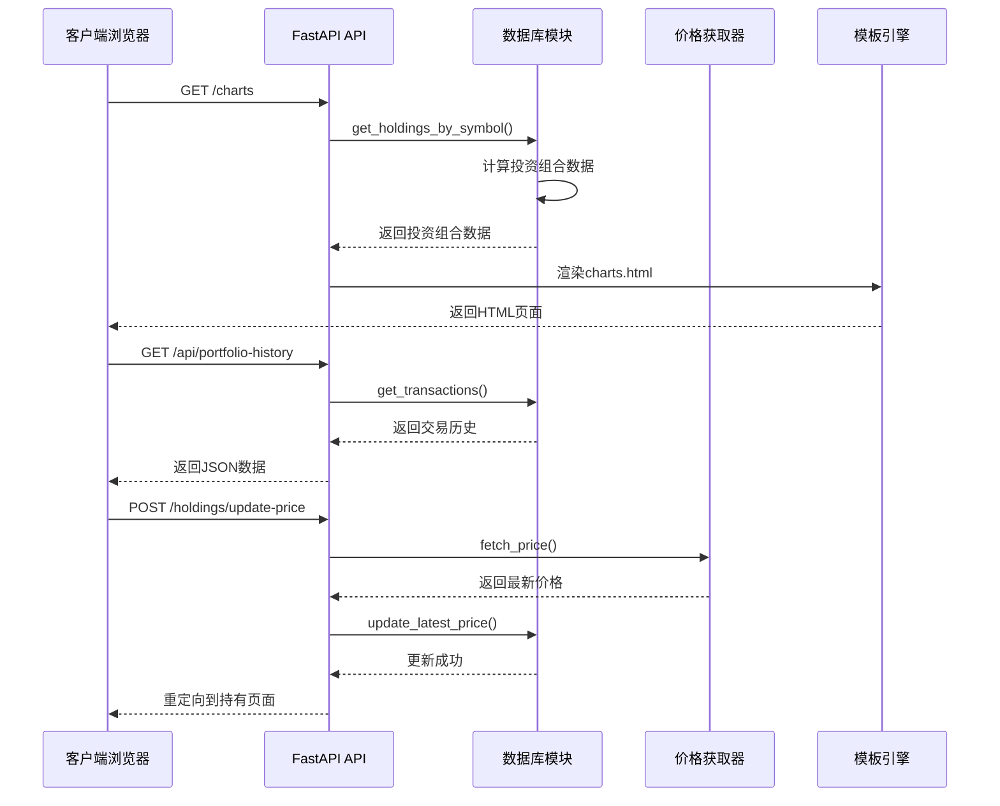
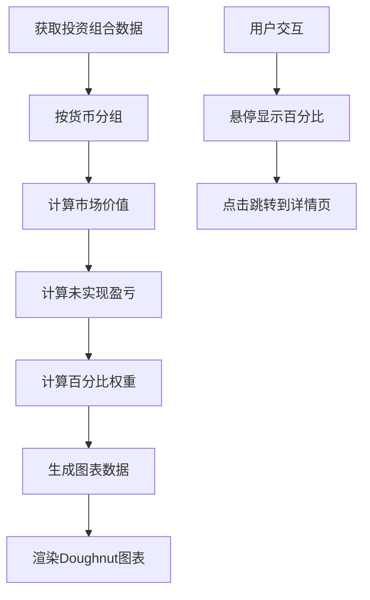
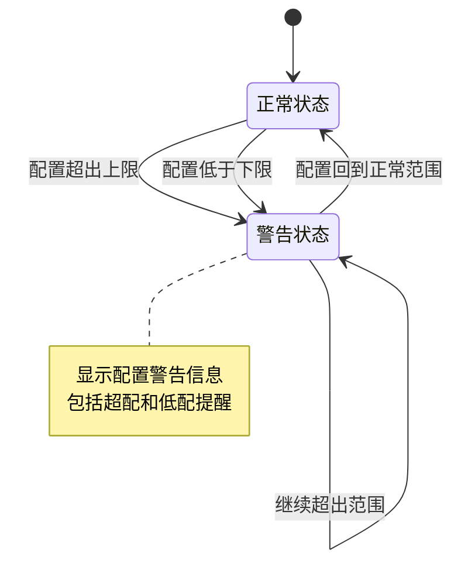
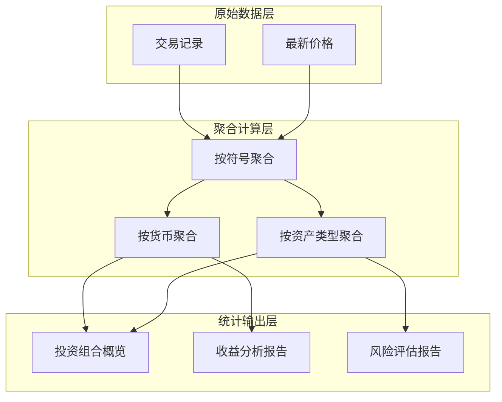
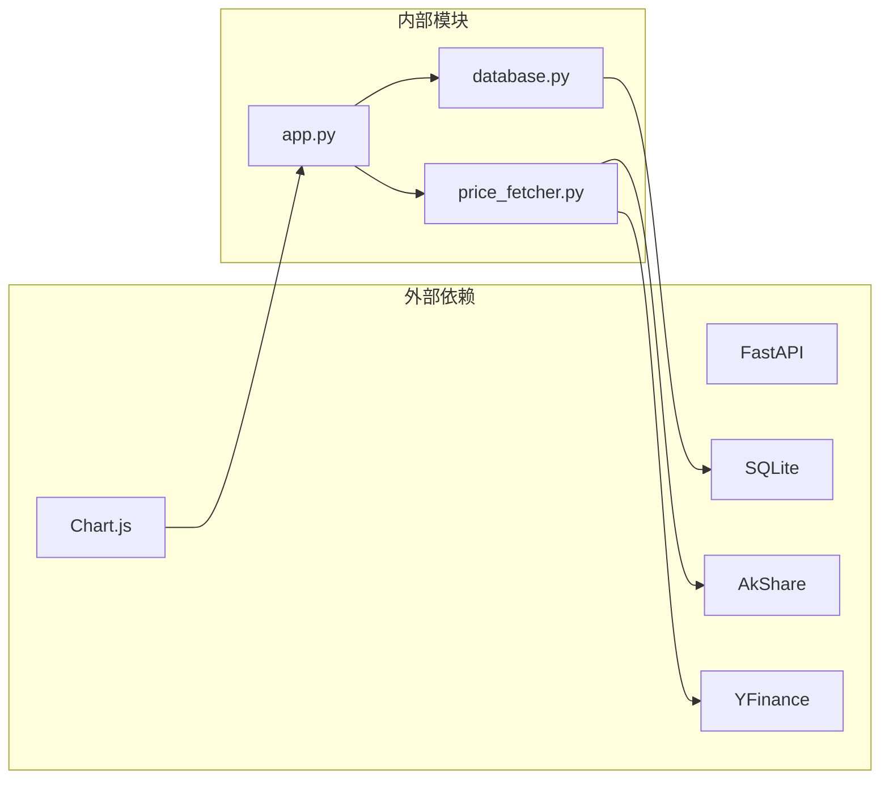

# 报表分析功能

<cite>
**本文档引用的文件**
- [app.py](file://app.py)
- [database.py](file://database.py)
- [price_fetcher.py](file://price_fetcher.py)
- [templates/charts.html](file://templates/charts.html)
- [templates/base.html](file://templates/base.html)
- [requirements.txt](file://requirements.txt)
</cite>

## 目录
1. [简介](#简介)
2. [项目结构](#项目结构)
3. [核心组件](#核心组件)
4. [架构概览](#架构概览)
5. [详细组件分析](#详细组件分析)
6. [依赖关系分析](#依赖关系分析)
7. [性能考虑](#性能考虑)
8. [故障排除指南](#故障排除指南)
9. [结论](#结论)
10. [附录](#附录)

## 简介

投资日志系统的报表分析功能旨在为用户提供全面的投资组合分析能力。该系统目前实现了基础的投资组合图表生成功能，能够显示按货币分组的投资组合持仓情况，并提供基本的收益分析功能。系统通过FastAPI提供RESTful API接口，使用SQLite作为数据存储，支持多货币和多种资产类型的管理。

## 项目结构

投资日志系统采用模块化的Python架构设计，主要包含以下核心组件：



**图表来源**
- [app.py](file://app.py#L1-L50)
- [database.py](file://database.py#L1-L50)
- [price_fetcher.py](file://price_fetcher.py#L1-L30)

**章节来源**
- [app.py](file://app.py#L1-L50)
- [database.py](file://database.py#L1-L50)
- [requirements.txt](file://requirements.txt#L1-L6)

## 核心组件

### 数据库模块 (database.py)

数据库模块是整个系统的核心，负责处理所有数据持久化操作。它提供了完整的交易记录管理、投资组合计算、资产类型管理和价格跟踪功能。

**主要功能特性：**
- 交易记录的增删改查操作
- 投资组合的实时计算和汇总
- 多货币支持和汇率处理
- 资产类型动态管理
- 最新价格跟踪和缓存

**章节来源**
- [database.py](file://database.py#L1-L200)
- [database.py](file://database.py#L312-L431)

### 应用程序接口 (app.py)

FastAPI应用程序提供了RESTful API接口，支持前端页面渲染和数据交互。系统包含多个路由端点，用于处理不同的业务场景。

**核心API端点：**
- `/api/holdings` - 获取当前投资组合
- `/api/holdings-by-currency` - 按货币分组的投资组合
- `/api/transactions` - 获取交易历史
- `/api/portfolio-history` - 投资组合历史数据

**章节来源**
- [app.py](file://app.py#L378-L431)

### 价格获取模块 (price_fetcher.py)

价格获取模块实现了多数据源的价格获取功能，支持A股、港股、美股和黄金等多种资产类型的价格查询。

**数据源支持：**
- AKShare（主数据源）
- Yahoo Finance
- 新浪财经API
- 腾讯财经API

**章节来源**
- [price_fetcher.py](file://price_fetcher.py#L1-L120)
- [price_fetcher.py](file://price_fetcher.py#L321-L395)

## 架构概览

系统采用分层架构设计，确保了良好的可维护性和扩展性：



**图表来源**
- [app.py](file://app.py#L113-L121)
- [app.py](file://app.py#L406-L430)
- [app.py](file://app.py#L216-L261)

## 详细组件分析

### 投资组合图表生成算法

系统实现了基于Chart.js的交互式投资组合图表，能够直观展示不同货币下的资产配置情况。

#### 数据处理流程



**图表来源**
- [database.py](file://database.py#L361-L431)
- [templates/charts.html](file://templates/charts.html#L56-L96)

#### 图表生成算法实现

系统通过以下步骤生成投资组合图表：

1. **数据聚合**：从数据库获取所有投资组合信息，按货币进行分组
2. **价值计算**：结合持仓数量和最新市场价格计算每只股票的市场价值
3. **收益计算**：计算未实现盈亏和盈亏百分比
4. **权重分配**：根据市场价值计算各资产的占比权重
5. **可视化渲染**：使用Chart.js创建环形图，支持交互式悬停效果

**章节来源**
- [database.py](file://database.py#L361-L431)
- [templates/charts.html](file://templates/charts.html#L10-L32)

### 收益分析计算方法

系统实现了基础的收益分析功能，主要包括以下指标：

#### 未实现盈亏计算

```mermaid
flowchart TD
A[获取持仓信息] --> B[获取最新价格]
B --> C[计算市场价值]
C --> D[计算成本基础]
D --> E[未实现盈亏 = 市场价值 - 成本基础]
E --> F[盈亏百分比 = (未实现盈亏/成本基础) × 100%]
G[按货币汇总] --> H[总市值]
H --> I[总成本]
I --> J[总未实现盈亏]
J --> K[总盈亏百分比]
```

**图表来源**
- [database.py](file://database.py#L394-L401)
- [database.py](file://database.py#L424-L429)

#### 收益分析指标

系统当前支持的收益分析指标：

1. **未实现盈亏 (Unrealized P&L)**：基于当前市场价格计算的潜在收益
2. **盈亏百分比**：未实现盈亏占成本基础的比例
3. **资产配置权重**：各资产在总投资组合中的占比

**章节来源**
- [database.py](file://database.py#L394-L418)

### 风险评估功能实现

当前系统实现了基础的风险评估功能，主要体现在资产配置监控方面：

#### 资产配置监控



**图表来源**
- [database.py](file://database.py#L708-L714)

#### 风险评估机制

系统通过以下方式实现风险评估：

1. **配置范围设置**：允许用户为不同货币和资产类型设置目标配置范围
2. **实时监控**：系统自动计算当前配置与目标范围的偏差
3. **预警机制**：当配置超出设定范围时显示警告信息

**章节来源**
- [database.py](file://database.py#L673-L726)

### 报表数据聚合和统计方法

系统实现了多层次的数据聚合功能，支持从不同维度对投资组合数据进行统计分析。

#### 多层次聚合结构



**图表来源**
- [database.py](file://database.py#L312-L431)
- [database.py](file://database.py#L673-L726)

#### 统计方法实现

系统采用SQL聚合查询实现高效的数据统计：

1. **成本计算**：使用CASE语句区分买入、卖出、调整等不同类型交易的成本影响
2. **数量汇总**：通过SUM函数计算各资产的总持仓数量
3. **价值计算**：结合最新价格和持仓数量计算市场价值
4. **百分比计算**：基于总价值计算各资产的配置权重

**章节来源**
- [database.py](file://database.py#L317-L358)
- [database.py](file://database.py#L361-L431)

## 依赖关系分析

系统依赖关系清晰，各模块职责明确：



**图表来源**
- [requirements.txt](file://requirements.txt#L1-L6)
- [app.py](file://app.py#L15-L16)

**章节来源**
- [requirements.txt](file://requirements.txt#L1-L6)

## 性能考虑

系统在设计时充分考虑了性能优化：

### 数据库优化策略

1. **索引优化**：为常用查询字段建立索引，包括symbol、transaction_date、account_id等
2. **查询优化**：使用参数化查询防止SQL注入，避免全表扫描
3. **连接池管理**：合理管理数据库连接，避免连接泄漏

### 缓存机制

1. **价格缓存**：最新价格存储在latest_prices表中，减少重复查询
2. **模板缓存**：Jinja2模板编译后缓存，提高页面渲染速度

### API性能优化

1. **分页查询**：交易列表支持分页，避免大量数据传输
2. **条件过滤**：API支持多种过滤条件，减少不必要的数据处理

## 故障排除指南

### 常见问题及解决方案

#### 价格获取失败

**问题现象**：更新价格时出现错误提示

**可能原因**：
1. 网络连接问题
2. 数据源API限制
3. 资产类型不支持

**解决步骤**：
1. 检查网络连接状态
2. 验证资产代码格式
3. 查看操作日志了解具体错误

#### 数据库连接问题

**问题现象**：系统启动时报数据库连接错误

**解决步骤**：
1. 检查SQLite文件权限
2. 验证数据库文件完整性
3. 确认数据库初始化完成

#### 图表显示异常

**问题现象**：投资组合图表无法正常显示

**解决步骤**：
1. 检查Chart.js库加载状态
2. 验证数据格式正确性
3. 查看浏览器控制台错误信息

**章节来源**
- [price_fetcher.py](file://price_fetcher.py#L391-L394)
- [app.py](file://app.py#L249-L261)

## 结论

投资日志系统的报表分析功能已经实现了基础的投资组合图表生成功能和基本的收益分析能力。系统具有以下优势：

1. **模块化设计**：清晰的分层架构便于维护和扩展
2. **多数据源支持**：灵活的价格获取机制
3. **实时计算**：基于最新价格的投资组合计算
4. **用户友好**：直观的图表界面和交互体验

然而，系统在高级分析功能方面仍有改进空间，特别是在风险评估和复杂收益指标计算方面。

## 附录

### API接口文档

#### 投资组合相关API

| 接口 | 方法 | 描述 | 参数 |
|------|------|------|------|
| `/api/holdings` | GET | 获取当前投资组合 | account_id (可选) |
| `/api/holdings-by-currency` | GET | 按货币分组的投资组合 | 无 |
| `/api/portfolio-history` | GET | 投资组合历史数据 | 无 |

#### 交易相关API

| 接口 | 方法 | 描述 | 参数 |
|------|------|------|------|
| `/api/transactions` | GET | 获取交易历史 | symbol, account_id, transaction_type, limit |
| `/api/transactions/{transaction_id}` | DELETE | 删除交易记录 | transaction_id |

### 开发指南

#### 自定义报表开发

要扩展报表功能，建议按照以下步骤进行：

1. **添加新的数据查询函数**：在database.py中实现新的聚合查询
2. **创建API端点**：在app.py中添加对应的API路由
3. **开发前端界面**：创建新的HTML模板和JavaScript图表
4. **集成测试**：确保新功能与现有系统兼容

#### 分析指标扩展

要添加新的分析指标，可以：

1. **扩展数据库查询**：在SQL查询中添加新的计算逻辑
2. **更新数据模型**：修改返回的数据结构以包含新指标
3. **实现计算算法**：在Python代码中实现具体的计算逻辑
4. **创建可视化组件**：开发相应的图表和UI组件