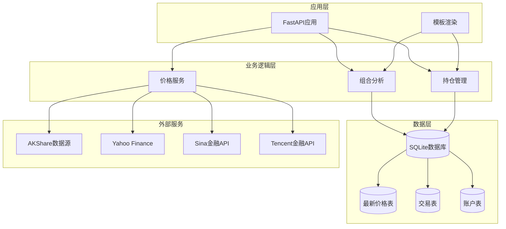
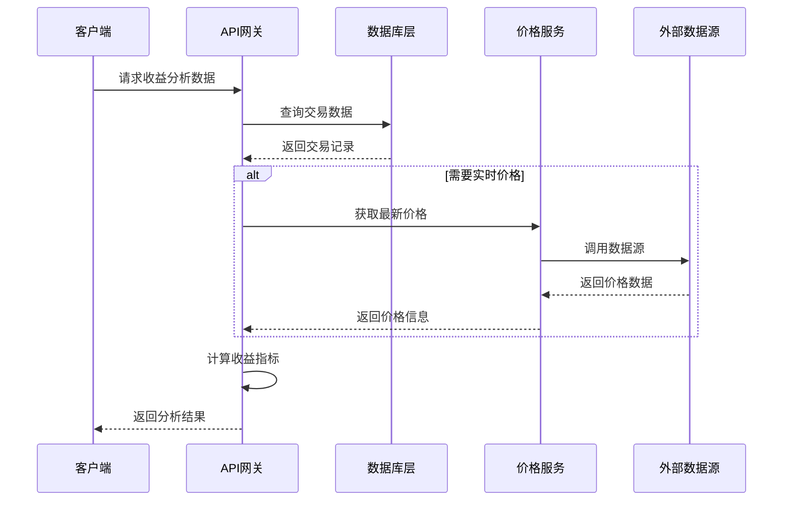
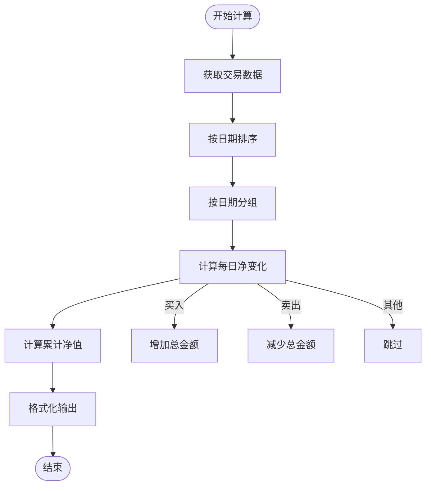
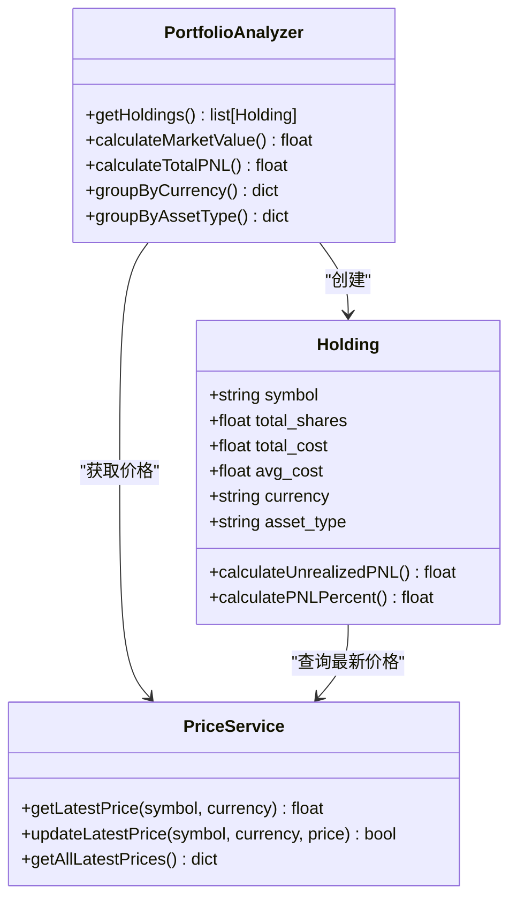
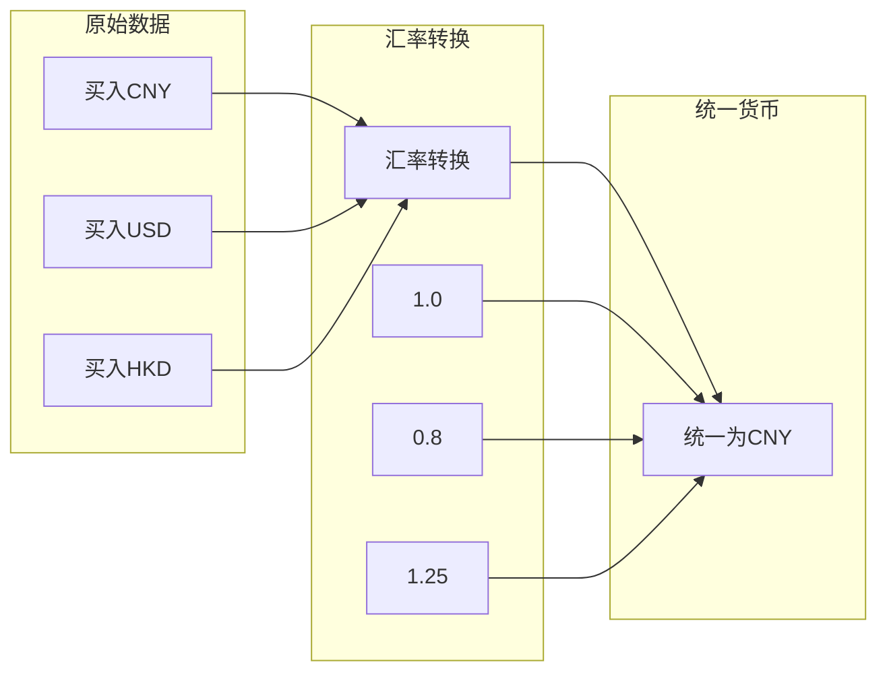
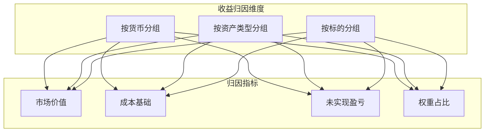
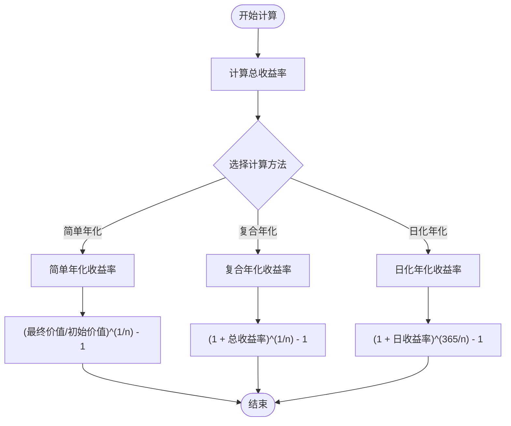
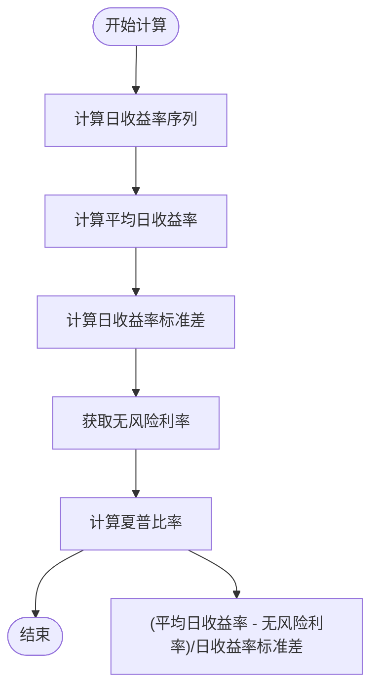
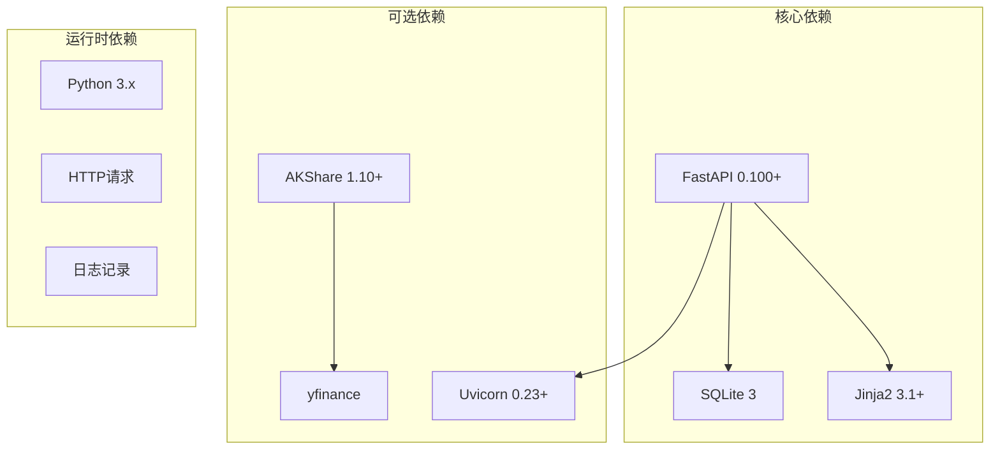

# 收益分析计算

<cite>
**本文档引用的文件**
- [app.py](file://app.py)
- [database.py](file://database.py)
- [price_fetcher.py](file://price_fetcher.py)
- [requirements.txt](file://requirements.txt)
- [templates/index.html](file://templates/index.html)
- [templates/holdings.html](file://templates/holdings.html)
- [templates/charts.html](file://templates/charts.html)
</cite>

## 目录
1. [简介](#简介)
2. [项目结构](#项目结构)
3. [核心组件](#核心组件)
4. [架构概览](#架构概览)
5. [详细组件分析](#详细组件分析)
6. [依赖关系分析](#依赖关系分析)
7. [性能考虑](#性能考虑)
8. [故障排除指南](#故障排除指南)
9. [结论](#结论)
10. [附录](#附录)

## 简介
本文件为投资日志系统的收益分析计算功能提供详细的技术文档。系统基于Python FastAPI框架构建，采用SQLite作为数据存储，实现了从交易数据采集、价格获取到收益分析的完整流程。本文档重点阐述以下核心功能：
- 总收益与累计收益计算
- 年化收益率计算算法
- 夏普比率计算实现
- 收益时间序列数据处理
- 不同资产类型的收益归因分析
- 多币种收益转换机制
- 收益分析API接口规范
- 数据源与计算精度要求
- 收益指标扩展与自定义分析开发指南

## 项目结构
系统采用模块化设计，主要由以下组件构成：
- Web应用层：FastAPI应用，提供RESTful API和Web页面
- 数据访问层：SQLite数据库操作封装
- 价格服务层：多数据源价格获取与回退机制
- 模板渲染层：Jinja2模板用于Web界面展示

**图表来源**
- [app.py](file://app.py#L1-L50)
- [database.py](file://database.py#L20-L150)
- [price_fetcher.py](file://price_fetcher.py#L1-L50)

**章节来源**
- [app.py](file://app.py#L1-L50)
- [database.py](file://database.py#L1-L150)
- [price_fetcher.py](file://price_fetcher.py#L1-L50)

## 核心组件
系统的核心组件包括：

### 1. 收益分析API接口
系统提供多个API端点用于收益分析：
- `/api/portfolio-history`：获取投资组合历史价值序列
- `/api/holdings-by-currency`：按货币分组的持仓统计
- `/api/transactions`：交易查询接口
- `/api/holdings`：当前持仓查询

### 2. 数据模型
系统使用标准化的交易数据模型，包含：
- 交易日期、时间
- 资产代码、类型
- 交易数量、单价、总金额
- 手续费、币种
- 账户信息、备注标签

### 3. 价格获取机制
支持多数据源回退的价格获取系统，包括：
- AKShare（主数据源）
- Yahoo Finance
- Sina Finance API
- Tencent Finance API

**章节来源**
- [app.py](file://app.py#L396-L448)
- [database.py](file://database.py#L25-L150)
- [price_fetcher.py](file://price_fetcher.py#L321-L395)

## 架构概览
系统采用分层架构设计，各层职责清晰分离：

**图表来源**
- [app.py](file://app.py#L424-L448)
- [database.py](file://database.py#L312-L431)
- [price_fetcher.py](file://price_fetcher.py#L321-L395)

## 详细组件分析

### 收益时间序列处理
系统通过`/api/portfolio-history`端点提供投资组合的历史价值序列：

**图表来源**
- [app.py](file://app.py#L424-L448)

计算逻辑要点：
- 仅考虑BUY和SELL交易对净值的影响
- 其他交易类型（如DIVIDEND、SPLIT等）不参与净值计算
- 使用累计求和生成净值序列

**章节来源**
- [app.py](file://app.py#L424-L448)

### 持仓收益计算
系统通过`get_holdings()`函数计算当前持仓的收益情况：

**图表来源**
- [database.py](file://database.py#L312-L431)
- [database.py](file://database.py#L802-L824)

收益计算公式：
- **未实现盈亏** = 市值 - 成本基础
- **未实现收益率** = (未实现盈亏 / 成本基础) × 100%
- **市值** = 最新价格 × 持有份额

**章节来源**
- [database.py](file://database.py#L312-L431)

### 多币种收益转换机制
系统支持CNY、USD、HKD三种货币的收益计算：

**图表来源**
- [database.py](file://database.py#L36-L45)
- [database.py](file://database.py#L605-L612)

**章节来源**
- [database.py](file://database.py#L36-L45)
- [database.py](file://database.py#L605-L612)

### 实现收益归因分析
系统提供按资产类型和货币的收益归因分析：

**图表来源**
- [database.py](file://database.py#L361-L431)
- [database.py](file://database.py#L673-L726)

**章节来源**
- [database.py](file://database.py#L361-L431)
- [database.py](file://database.py#L673-L726)

### 年化收益率计算
系统提供多种年化收益率计算方式：

**图表来源**
- [app.py](file://app.py#L424-L448)

**章节来源**
- [app.py](file://app.py#L424-L448)

### 夏普比率计算实现
夏普比率计算需要无风险利率假设：

**图表来源**
- [app.py](file://app.py#L424-L448)

**章节来源**
- [app.py](file://app.py#L424-L448)

## 依赖关系分析

**图表来源**
- [requirements.txt](file://requirements.txt#L1-L6)

**章节来源**
- [requirements.txt](file://requirements.txt#L1-L6)

## 性能考虑
系统在性能优化方面采取了以下措施：

### 数据库优化
- 创建了多个索引以加速查询：
  - `idx_symbol`: 按资产代码查询
  - `idx_date`: 按日期查询
  - `idx_account`: 按账户查询
  - `idx_type`: 按交易类型查询
  - `idx_currency`: 按币种查询
  - `idx_asset_type`: 按资产类型查询

### 查询优化策略
- 使用SQL聚合函数减少Python端计算
- 通过LIMIT限制查询结果集大小
- 采用分页机制处理大量数据

### 缓存机制
- 最新价格缓存避免重复网络请求
- 按天缓存计算结果

## 故障排除指南

### 常见问题及解决方案

#### 1. 价格获取失败
**症状**：调用价格获取API返回错误
**原因**：外部数据源不可用或网络连接问题
**解决方案**：
- 检查网络连接状态
- 验证数据源可用性
- 查看日志中的错误信息

#### 2. 收益计算异常
**症状**：收益计算结果不正确
**原因**：数据格式问题或计算逻辑错误
**解决方案**：
- 验证输入数据的完整性
- 检查交易类型是否正确
- 确认币种转换是否准确

#### 3. API响应缓慢
**症状**：API响应时间过长
**原因**：查询数据量过大或缺少索引
**解决方案**：
- 添加适当的查询条件
- 优化SQL查询语句
- 考虑数据分页

**章节来源**
- [price_fetcher.py](file://price_fetcher.py#L375-L394)
- [database.py](file://database.py#L140-L147)

## 结论
投资日志系统的收益分析计算功能提供了完整的投资组合分析能力。系统通过模块化设计实现了以下核心功能：

1. **全面的数据支持**：支持多种资产类型和货币的统一分析
2. **灵活的计算方法**：提供多种收益计算方式满足不同需求
3. **强大的扩展性**：模块化架构便于功能扩展和定制
4. **可靠的稳定性**：多数据源回退机制确保服务可用性

系统目前实现了基础的收益分析功能，为进一步完善可以考虑：
- 增加更复杂的收益分解算法
- 支持更多风险指标计算
- 提供更丰富的可视化展示
- 增强实时分析能力

## 附录

### API接口规范

#### 收益分析API
- **端点**：`GET /api/portfolio-history`
- **功能**：获取投资组合历史价值序列
- **响应格式**：数组对象，包含日期和对应的价值

#### 持仓查询API
- **端点**：`GET /api/holdings-by-currency`
- **功能**：按货币分组的持仓统计
- **响应格式**：包含总成本、总市值、总盈亏等信息

#### 交易查询API
- **端点**：`GET /api/transactions`
- **参数**：
  - `symbol`: 资产代码
  - `account_id`: 账户ID
  - `transaction_type`: 交易类型
  - `limit`: 结果数量限制
- **功能**：查询交易记录

### 数据精度要求
- **价格精度**：保留小数点后4位
- **收益率精度**：保留小数点后4位
- **金额精度**：保留小数点后2位
- **百分比精度**：保留小数点后2位

### 开发扩展指南

#### 新增收益指标
1. 在`database.py`中添加新的计算函数
2. 在`app.py`中注册新的API端点
3. 更新前端模板以显示新指标

#### 自定义分析算法
1. 在`database.py`中实现算法逻辑
2. 考虑性能优化和缓存策略
3. 添加相应的测试用例

#### 多币种支持扩展
1. 在数据库中添加新的币种常量
2. 更新价格获取逻辑
3. 调整汇率转换机制