# 数据聚合统计

<cite>
**本文档引用的文件**
- [app.py](file://app.py)
- [database.py](file://database.py)
- [price_fetcher.py](file://price_fetcher.py)
- [requirements.txt](file://requirements.txt)
- [index.html](file://templates/index.html)
- [holdings.html](file://templates/holdings.html)
- [charts.html](file://templates/charts.html)
</cite>

## 目录
1. [简介](#简介)
2. [项目结构](#项目结构)
3. [核心组件](#核心组件)
4. [架构概览](#架构概览)
5. [详细组件分析](#详细组件分析)
6. [依赖关系分析](#依赖关系分析)
7. [性能考虑](#性能考虑)
8. [故障排除指南](#故障排除指南)
9. [结论](#结论)

## 简介

投资日志系统是一个基于FastAPI的Web应用程序，专门用于跟踪和管理个人投资组合。该系统的核心功能是数据聚合统计，能够对投资组合进行多维度的数据汇总和分析，包括按货币、资产类型、时间维度的统计分析。

系统采用SQLite作为数据存储，通过RESTful API提供数据访问，并使用Jinja2模板引擎渲染前端页面。数据聚合统计功能涵盖了实时价格更新、历史数据计算、分配比例分析等多个方面。

## 项目结构

投资日志系统的整体架构采用分层设计，主要包含以下模块：

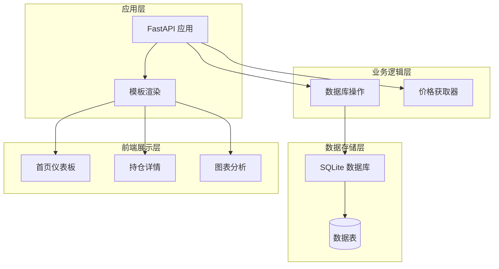

**图表来源**
- [app.py](file://app.py#L19-L29)
- [database.py](file://database.py#L20-L149)

**章节来源**
- [app.py](file://app.py#L1-L463)
- [database.py](file://database.py#L1-L951)

## 核心组件

### 数据库模块 (database.py)

数据库模块是整个系统的核心，负责所有数据操作和聚合统计功能。主要包含以下核心功能：

#### 数据表结构
系统包含多个核心数据表：
- **transactions**: 交易记录表，存储所有买卖、分红等交易信息
- **accounts**: 账户信息表
- **symbols**: 股票代码信息表  
- **allocation_settings**: 资产配置设置表
- **asset_types**: 资产类型表
- **operation_logs**: 操作日志表
- **latest_prices**: 最新价格表

#### 关键聚合函数

##### 持仓计算函数
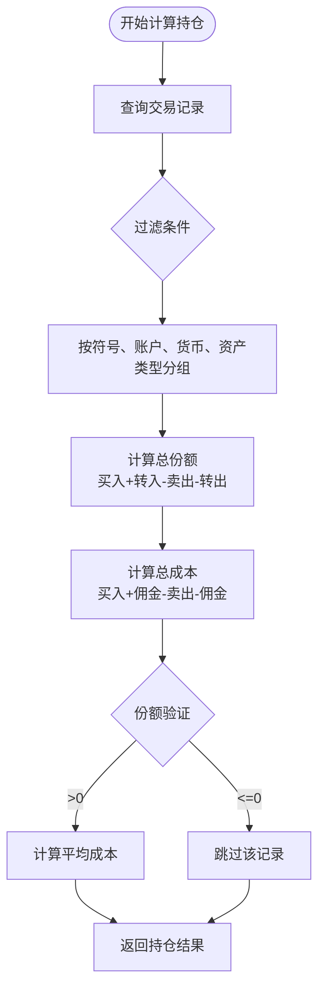

**图表来源**
- [database.py](file://database.py#L312-L358)

##### 货币维度聚合
系统支持按货币维度的持仓聚合，计算每个货币下的资产分布情况。

**章节来源**
- [database.py](file://database.py#L312-L726)

### API端点 (app.py)

应用层提供了完整的RESTful API接口，支持各种数据查询和统计功能：

#### 主要API端点
- `/api/holdings`: 获取当前持仓
- `/api/holdings-by-currency`: 按货币聚合的持仓
- `/api/transactions`: 获取交易记录
- `/api/portfolio-history`: 投资组合历史数据
- `/api/transactions/{id}`: 删除交易记录

#### 实时更新机制
系统通过独立的价格获取模块实现数据的实时更新，支持多种数据源的回退机制。

**章节来源**
- [app.py](file://app.py#L395-L458)

### 价格获取模块 (price_fetcher.py)

价格获取模块实现了多数据源的价格获取功能，支持以下市场：

#### 支持的市场类型
- **A股**: 上海、深圳交易所
- **港股**: 香港交易所  
- **美股**: 纽约、纳斯达克交易所
- **黄金**: 以金条形式的投资

#### 多级回退机制
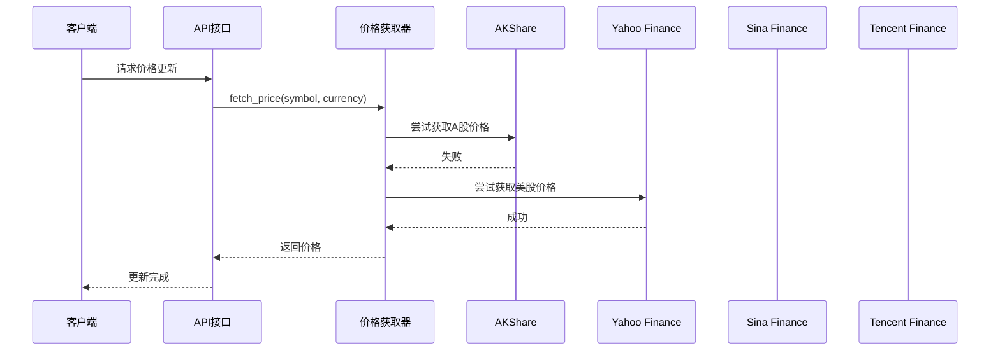

**图表来源**
- [price_fetcher.py](file://price_fetcher.py#L321-L394)

**章节来源**
- [price_fetcher.py](file://price_fetcher.py#L1-L398)

## 架构概览

系统采用典型的三层架构设计，各层职责明确：

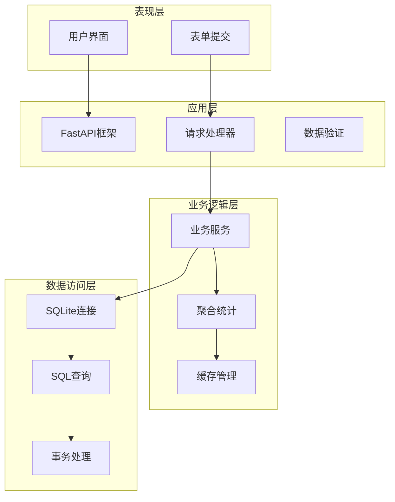

**图表来源**
- [app.py](file://app.py#L1-L463)
- [database.py](file://database.py#L13-L149)

## 详细组件分析

### 数据聚合算法

#### 持仓数据聚合
系统通过SQL聚合查询实现持仓数据的实时计算：

```sql
SELECT 
    symbol,
    account_id,
    currency,
    asset_type,
    SUM(CASE 
        WHEN transaction_type IN ('BUY', 'TRANSFER_IN') THEN quantity
        WHEN transaction_type IN ('SELL', 'TRANSFER_OUT') THEN -quantity
        ELSE 0
    END) as total_shares,
    SUM(CASE 
        WHEN transaction_type = 'BUY' THEN total_amount + commission
        WHEN transaction_type = 'SELL' THEN -(total_amount - commission)
        ELSE 0
    END) as total_cost
FROM transactions
GROUP BY symbol, account_id, currency, asset_type
HAVING total_shares > 0 OR total_cost != 0
```

**章节来源**
- [database.py](file://database.py#L317-L343)

#### 时间维度聚合
系统支持按日期的时间序列数据聚合，用于生成投资组合历史图表：

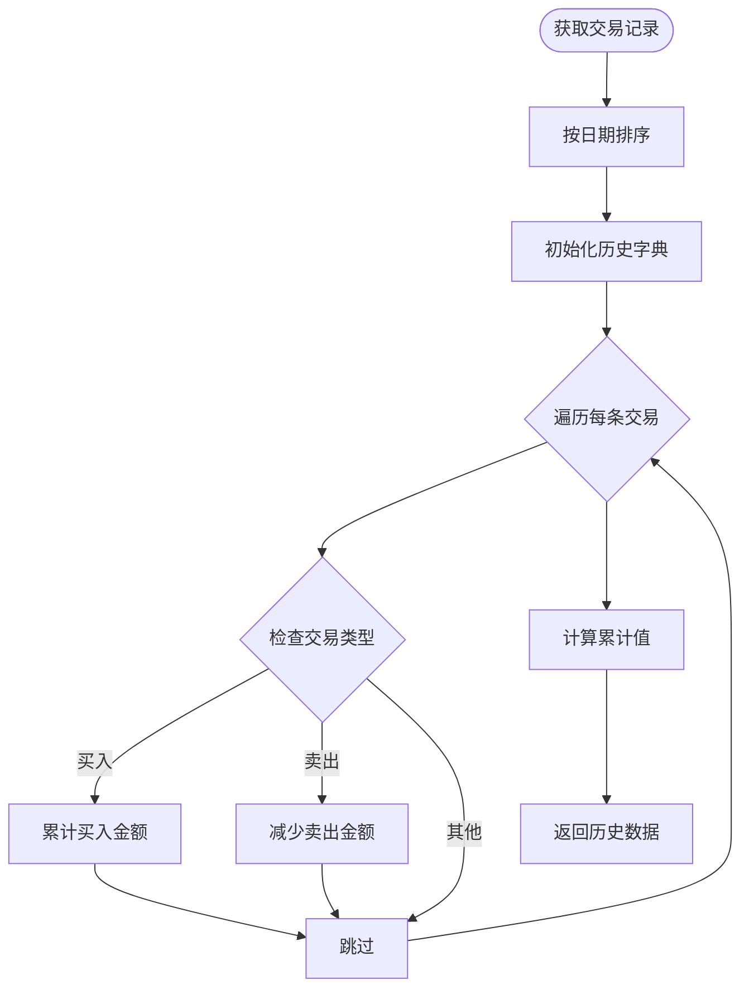

**图表来源**
- [app.py](file://app.py#L423-L447)

**章节来源**
- [app.py](file://app.py#L423-L447)

### 统计方法

#### 分配比例统计
系统支持按资产类型的配置比例分析：

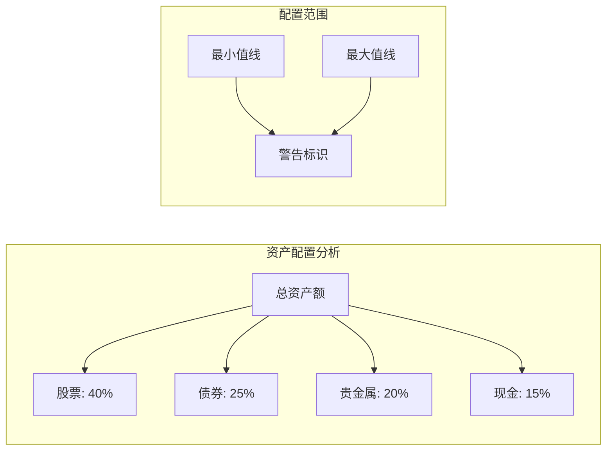

**图表来源**
- [database.py](file://database.py#L673-L726)

#### 盈亏分析
系统提供未实现盈亏的计算功能：

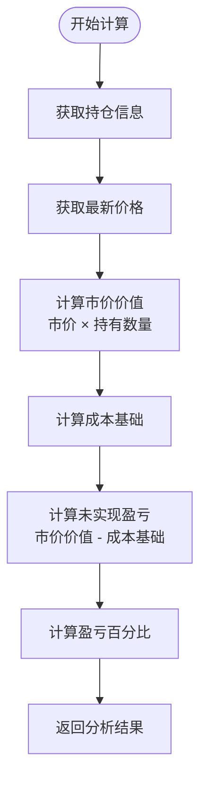

**图表来源**
- [database.py](file://database.py#L361-L431)

**章节来源**
- [database.py](file://database.py#L361-L431)

### 缓存策略

#### 实时价格缓存
系统采用SQLite的latest_prices表作为价格缓存：

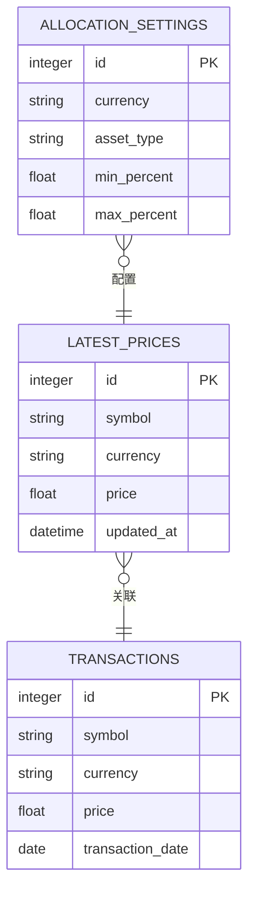

**图表来源**
- [database.py](file://database.py#L128-L138)
- [database.py](file://database.py#L779-L800)

#### 查询结果缓存
系统通过数据库索引实现查询性能优化：

**章节来源**
- [database.py](file://database.py#L140-L146)

### 性能优化方案

#### SQL查询优化
系统通过以下方式优化SQL查询性能：

1. **索引策略**
   - symbol列索引：加速符号查询
   - transaction_date列索引：加速时间范围查询
   - account_id列索引：加速账户筛选
   - transaction_type列索引：加速交易类型筛选
   - currency列索引：加速货币筛选
   - asset_type列索引：加速资产类型筛选

2. **查询优化技术**
   - 使用参数化查询防止SQL注入
   - 合理使用LIMIT和OFFSET实现分页
   - 通过strftime函数优化日期查询

#### 批量处理流程
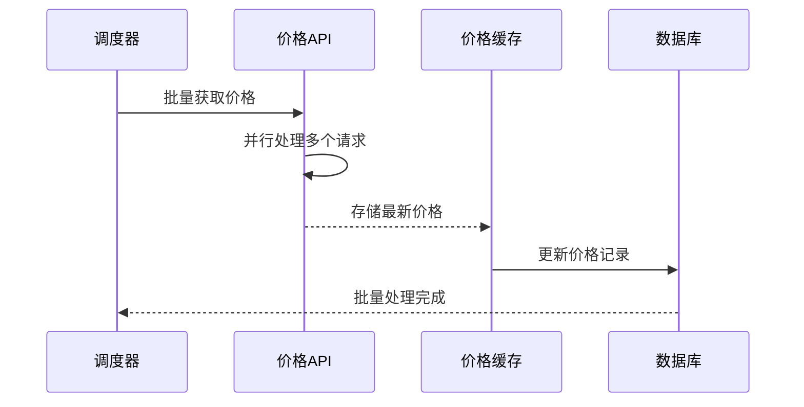

**图表来源**
- [price_fetcher.py](file://price_fetcher.py#L321-L394)

**章节来源**
- [database.py](file://database.py#L140-L146)

### 实时更新机制

#### 价格更新流程
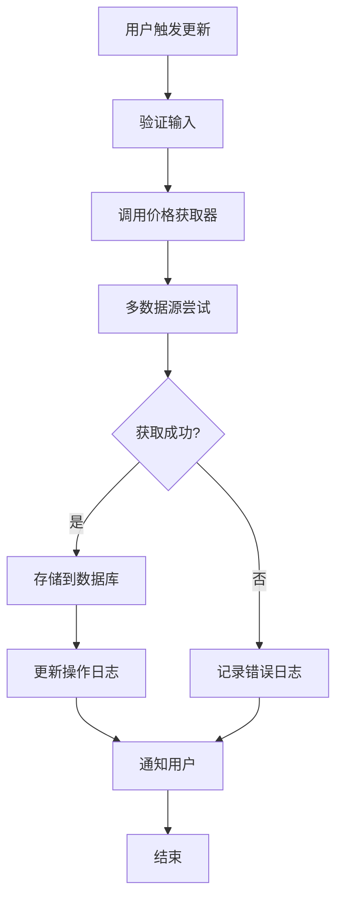

**图表来源**
- [app.py](file://app.py#L216-L262)

#### 批量处理流程
系统支持批量价格更新，通过循环处理多个资产的实时价格：

**章节来源**
- [app.py](file://app.py#L216-L262)

### API接口设计

#### RESTful API规范
系统遵循RESTful设计原则，提供标准的HTTP接口：

| 端点 | 方法 | 功能 | 响应格式 |
|------|------|------|----------|
| `/api/holdings` | GET | 获取当前持仓 | JSON数组 |
| `/api/holdings-by-currency` | GET | 按货币聚合的持仓 | JSON对象 |
| `/api/transactions` | GET | 获取交易记录 | JSON数组 |
| `/api/portfolio-history` | GET | 投资组合历史 | JSON数组 |
| `/api/transactions/{id}` | DELETE | 删除交易记录 | JSON对象 |

#### 响应数据结构
系统API返回统一格式的JSON响应，包含数据主体和状态信息。

**章节来源**
- [app.py](file://app.py#L395-L458)

### 导出格式

#### 数据导出能力
系统目前主要通过API接口提供数据访问，支持JSON格式的数据输出。虽然没有专门的导出功能，但可以通过API接口获取所有统计数据。

#### 自定义导出格式
开发者可以基于现有的API接口实现自定义的数据导出功能，支持CSV、Excel等格式。

## 依赖关系分析

系统采用模块化设计，各组件之间的依赖关系清晰：

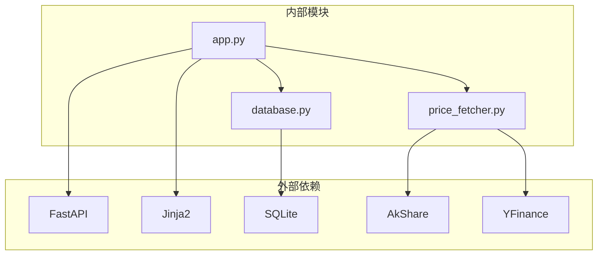

**图表来源**
- [requirements.txt](file://requirements.txt#L1-L6)
- [app.py](file://app.py#L7-L17)

**章节来源**
- [requirements.txt](file://requirements.txt#L1-L6)

## 性能考虑

### 数据库性能优化

#### 索引策略
系统在关键查询字段上建立了适当的索引，以提高查询性能：

1. **高频查询字段索引**
   - symbol: 加速符号搜索
   - transaction_date: 加速时间范围查询
   - account_id: 加速账户筛选
   - transaction_type: 加速交易类型过滤

2. **复合索引考虑**
   - 可考虑为常用查询组合建立复合索引
   - 如(symbol, transaction_date)、(account_id, currency)等

#### 查询优化建议
1. **分页查询**
   - 对大量数据的查询使用LIMIT和OFFSET
   - 设置合理的分页大小避免内存溢出

2. **缓存策略**
   - 对频繁访问的统计数据建立应用层缓存
   - 使用Redis或内存缓存提高响应速度

### 前端性能优化

#### 图表渲染优化
系统使用Chart.js进行数据可视化，通过以下方式优化性能：

1. **懒加载策略**
   - 仅在需要时渲染图表
   - 使用Intersection Observer实现视口内才渲染

2. **数据压缩**
   - 对大量数据进行采样处理
   - 使用虚拟滚动技术处理长列表

## 故障排除指南

### 常见问题及解决方案

#### 价格获取失败
当价格获取器无法从任何数据源获取价格时，系统会记录详细的错误信息：

1. **检查网络连接**
2. **验证数据源可用性**
3. **查看日志文件获取具体错误信息**

#### 数据库连接问题
如果遇到数据库连接异常：

1. **检查数据库文件权限**
2. **确认SQLite版本兼容性**
3. **验证磁盘空间充足**

#### API响应超时
对于API响应缓慢的问题：

1. **检查服务器资源使用情况**
2. **优化SQL查询语句**
3. **考虑增加数据库索引**

**章节来源**
- [price_fetcher.py](file://price_fetcher.py#L375-L394)

## 结论

投资日志系统的数据聚合统计功能展现了良好的架构设计和实现质量。系统通过模块化的数据库设计、高效的SQL查询优化、灵活的API接口设计，实现了全面的投资组合数据分析功能。

### 主要优势

1. **完整的统计功能**：涵盖持仓、收益、配置比例等多维度分析
2. **实时数据更新**：支持多数据源的价格获取和缓存管理
3. **良好的性能表现**：通过索引优化和查询优化保证响应速度
4. **可扩展的设计**：模块化架构便于功能扩展和维护

### 改进建议

1. **增强缓存机制**：引入应用层缓存提高重复查询性能
2. **扩展导出功能**：增加CSV、Excel等格式的数据导出能力
3. **完善监控系统**：添加性能监控和错误追踪功能
4. **优化移动端体验**：改进移动端的界面适配和交互体验

该系统为个人投资者提供了完整、准确、实时的投资组合管理解决方案，具有良好的实用价值和扩展潜力。