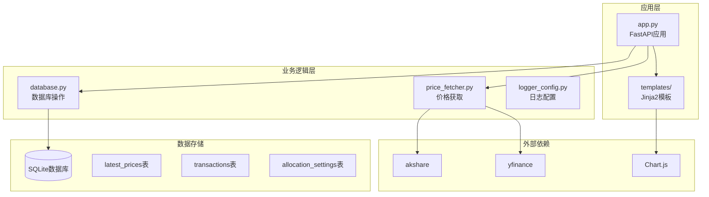
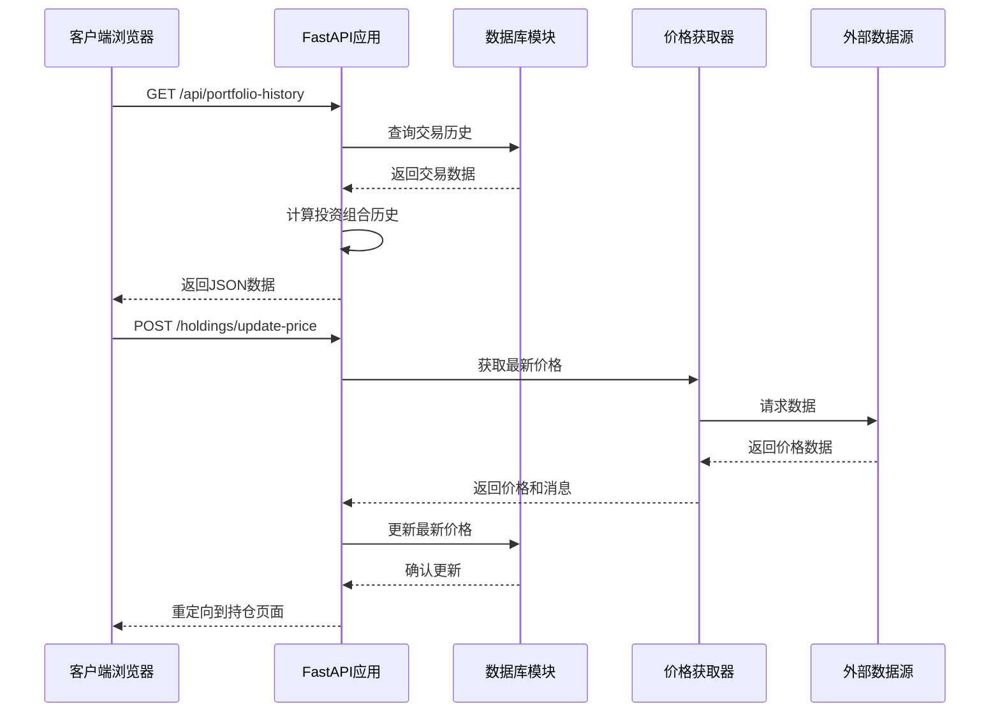
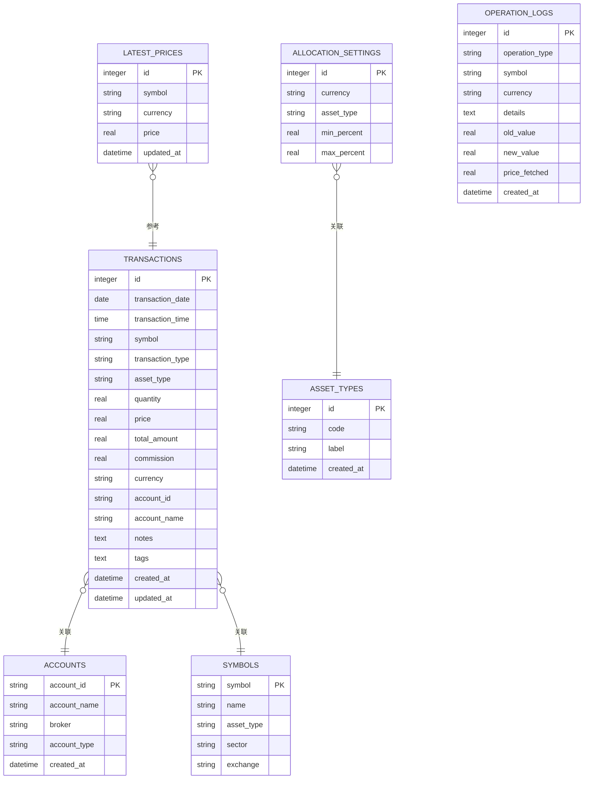
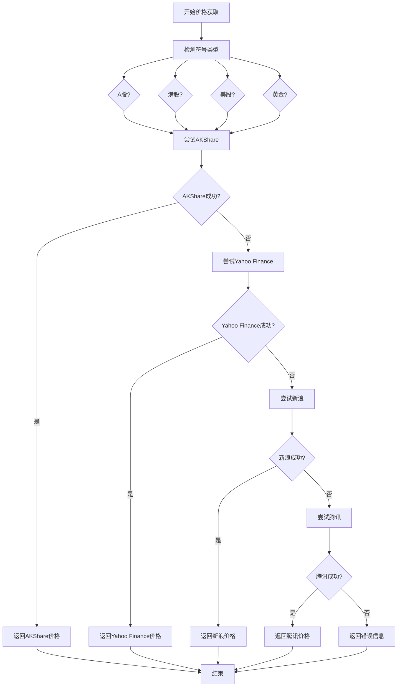
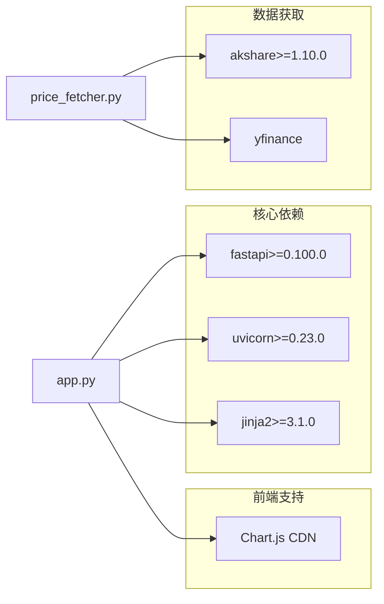
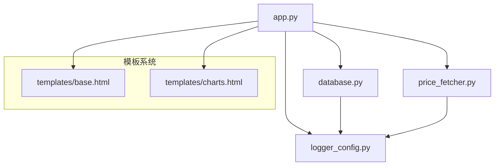
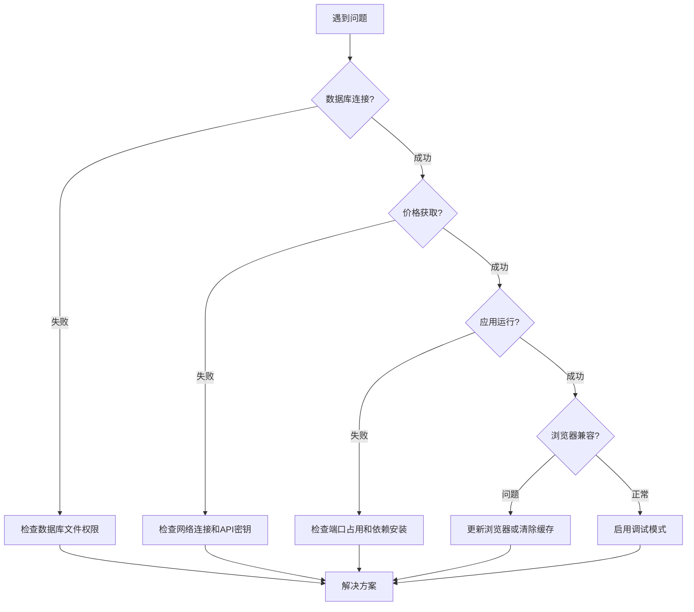

# 风险评估分析

<cite>
**本文档引用的文件**
- [app.py](file://app.py)
- [database.py](file://database.py)
- [price_fetcher.py](file://price_fetcher.py)
- [logger_config.py](file://logger_config.py)
- [requirements.txt](file://requirements.txt)
- [templates/base.html](file://templates/base.html)
- [templates/charts.html](file://templates/charts.html)
</cite>

## 目录
1. [简介](#简介)
2. [项目结构](#项目结构)
3. [核心组件](#核心组件)
4. [架构概览](#架构概览)
5. [详细组件分析](#详细组件分析)
6. [依赖关系分析](#依赖关系分析)
7. [性能考虑](#性能考虑)
8. [故障排除指南](#故障排除指南)
9. [结论](#结论)

## 简介

投资日志系统是一个基于FastAPI的Web应用程序，用于跟踪和管理个人投资交易。该系统提供了完整的交易记录、持仓管理、价格获取和可视化功能。虽然当前版本没有内置的风险评估分析功能，但系统架构设计良好，具备扩展风险分析模块的能力。

本项目的核心目标是：
- 提供直观的投资组合管理界面
- 支持多币种、多资产类型的交易记录
- 实时价格获取和更新
- 投资组合可视化展示
- 可扩展的风险评估分析功能

## 项目结构

**图表来源**
- [app.py](file://app.py#L1-L50)
- [database.py](file://database.py#L20-L150)
- [price_fetcher.py](file://price_fetcher.py#L1-L50)

**章节来源**
- [app.py](file://app.py#L1-L50)
- [database.py](file://database.py#L1-L150)
- [price_fetcher.py](file://price_fetcher.py#L1-L50)

## 核心组件

### 应用程序入口点
- **FastAPI应用实例**：提供REST API端点和Web页面
- **模板系统**：使用Jinja2渲染HTML页面
- **静态文件服务**：托管CSS样式和JavaScript资源

### 数据库模块
- **事务管理**：完整的CRUD操作支持
- **持仓计算**：实时计算投资组合价值
- **价格管理**：维护最新市场价格缓存
- **设置管理**：支持资产配置范围设置

### 价格获取模块
- **多数据源支持**：AKShare、Yahoo Finance、新浪、腾讯
- **智能回退机制**：多个数据源的容错处理
- **符号类型检测**：自动识别A股、港股、美股、黄金等

**章节来源**
- [app.py](file://app.py#L19-L30)
- [database.py](file://database.py#L13-L150)
- [price_fetcher.py](file://price_fetcher.py#L1-L50)

## 架构概览

**图表来源**
- [app.py](file://app.py#L423-L447)
- [app.py](file://app.py#L216-L262)
- [price_fetcher.py](file://price_fetcher.py#L321-L395)

## 详细组件分析

### 数据库架构设计

**图表来源**
- [database.py](file://database.py#L25-L147)

### 价格获取系统架构

**图表来源**
- [price_fetcher.py](file://price_fetcher.py#L321-L395)

**章节来源**
- [database.py](file://database.py#L20-L150)
- [price_fetcher.py](file://price_fetcher.py#L321-L395)

## 依赖关系分析

### 外部依赖

**图表来源**
- [requirements.txt](file://requirements.txt#L1-L6)

### 内部模块依赖

**图表来源**
- [app.py](file://app.py#L15-L17)
- [database.py](file://database.py#L1-L10)
- [price_fetcher.py](file://price_fetcher.py#L17-L21)

**章节来源**
- [requirements.txt](file://requirements.txt#L1-L6)
- [app.py](file://app.py#L15-L17)

## 性能考虑

### 数据库查询优化
- **索引策略**：在常用查询字段上建立索引（symbol、transaction_date、account_id等）
- **查询参数化**：使用参数化查询防止SQL注入
- **连接池管理**：复用数据库连接减少开销

### 缓存策略
- **价格缓存**：维护latest_prices表作为价格缓存
- **查询结果缓存**：对频繁访问的数据进行内存缓存
- **模板渲染缓存**：避免重复的模板解析

### 异步处理
- **并发请求处理**：利用FastAPI的异步特性处理多个请求
- **非阻塞I/O**：数据库操作和网络请求使用异步模式

## 故障排除指南

### 常见问题诊断

### 日志分析
- **日志级别**：INFO用于正常操作，ERROR用于严重问题
- **日志轮转**：每天生成新日志文件，保留7天历史
- **关键事件**：价格更新、交易添加、错误处理都有详细日志

**章节来源**
- [logger_config.py](file://logger_config.py#L14-L54)

## 结论

投资日志系统是一个设计良好的投资管理工具，具备以下优势：

### 现有功能优势
- **完整的交易管理**：支持多种交易类型和资产类别
- **实时价格监控**：多数据源备份的价格获取系统
- **直观的用户界面**：基于Chart.js的可视化展示
- **可扩展的架构**：模块化设计便于功能扩展

### 风险评估功能扩展建议

基于现有架构，可以轻松集成以下风险评估功能：

#### 波动率计算
- **历史波动率**：基于日收益率的标准差计算
- **隐含波动率**：通过期权定价模型反推
- **移动窗口分析**：不同时间窗口的波动率对比

#### 最大回撤分析
- **滚动最大回撤**：动态跟踪投资组合的最大回撤
- **时间窗口选择**：支持1个月、3个月、6个月、1年等窗口
- **回撤持续时间**：分析回撤从开始到恢复的时间

#### 风险价值(VaR)计算
- **历史模拟法**：基于历史收益率分布
- **蒙特卡洛模拟**：随机模拟未来价格路径
- **参数化方法**：假设收益率正态分布

#### 压力测试
- **情景分析**：极端市场条件下的投资组合表现
- **敏感性分析**：关键变量变化对投资组合的影响
- **流动性风险测试**：评估在流动性紧张时的损失

#### 时间序列分析
- **趋势识别**：技术分析指标的应用
- **周期性分析**：季节性和经济周期影响
- **异常检测**：识别异常价格变动

该系统为风险评估分析提供了坚实的基础，通过模块化扩展可以轻松集成专业的风险管理功能。