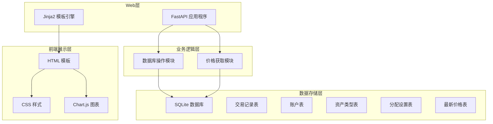
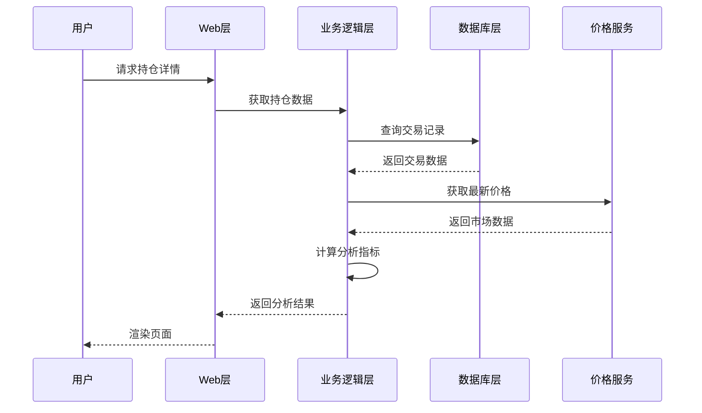
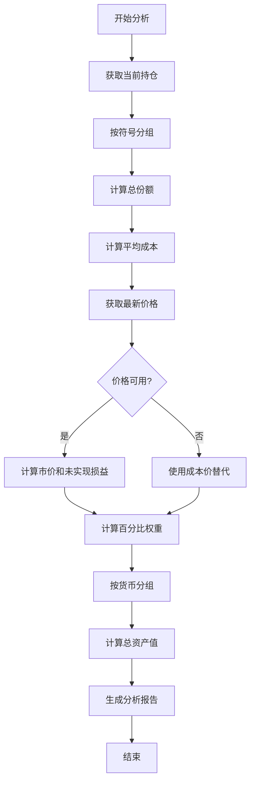
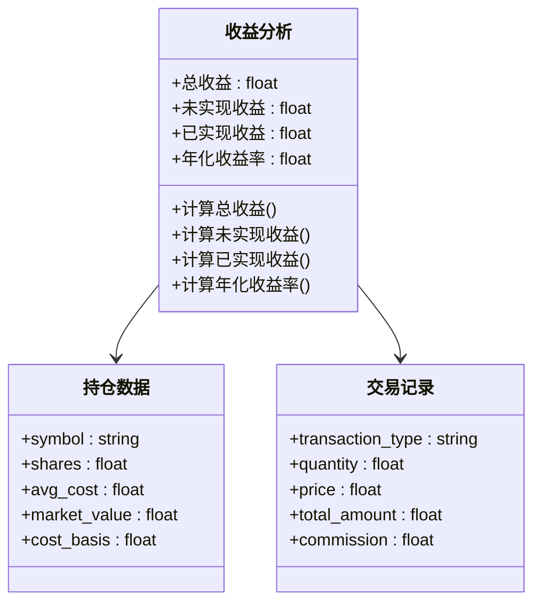
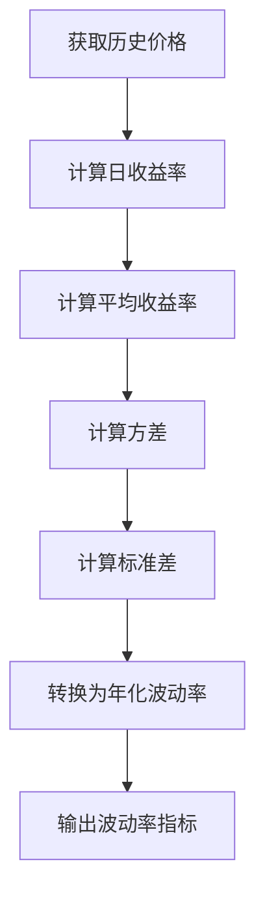
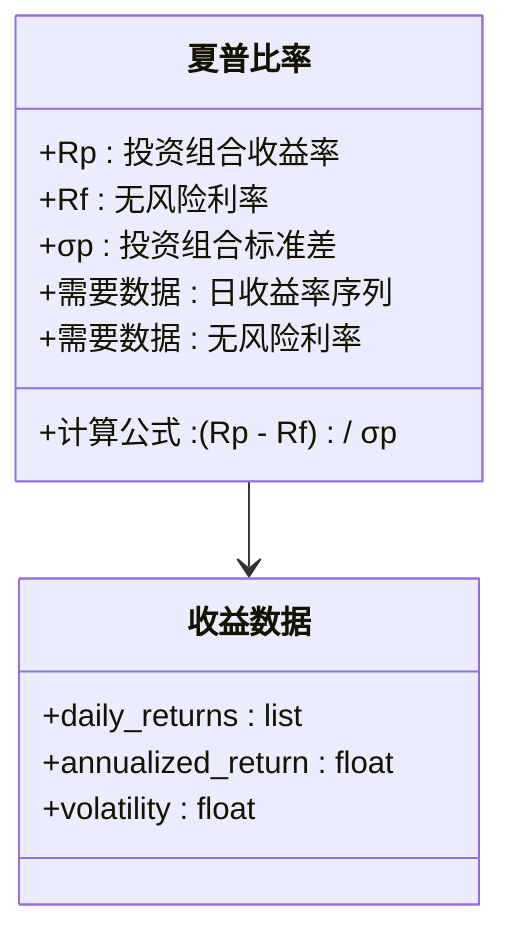
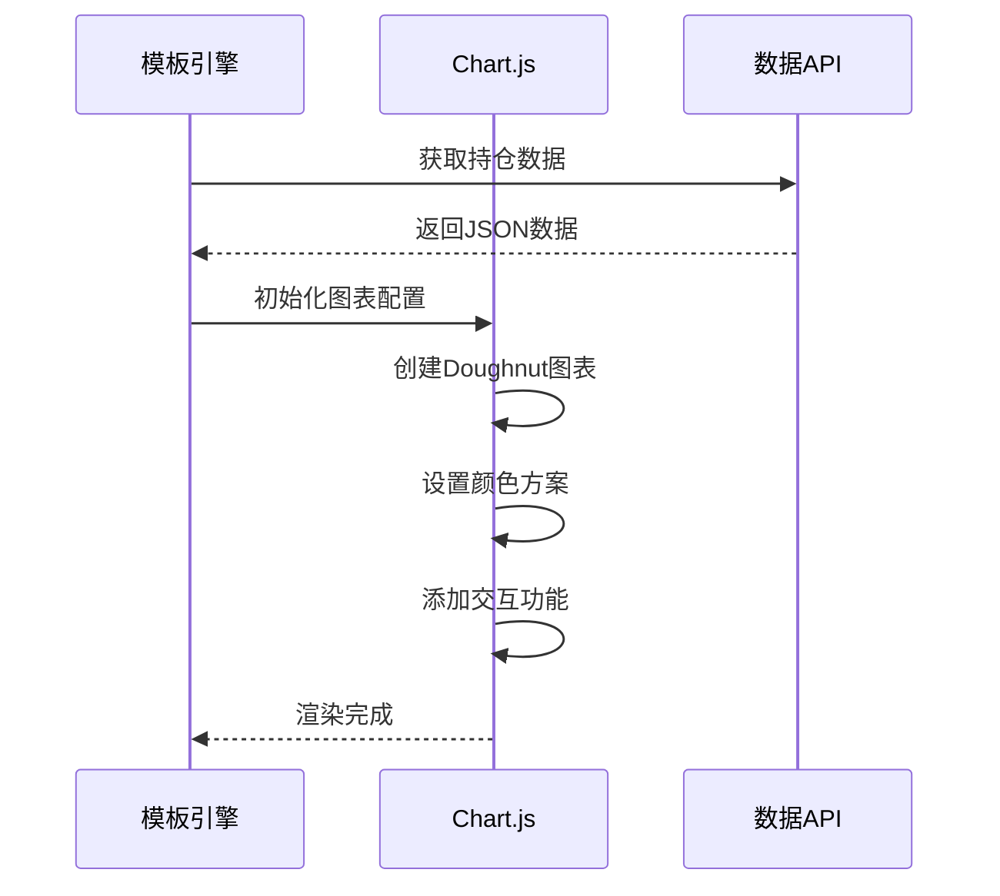
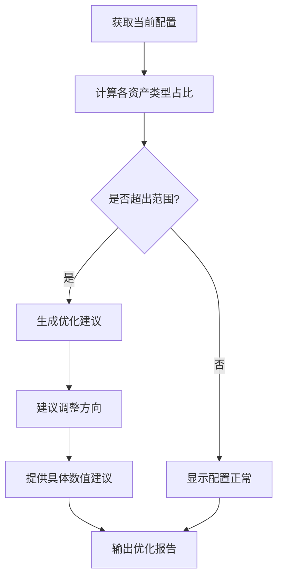
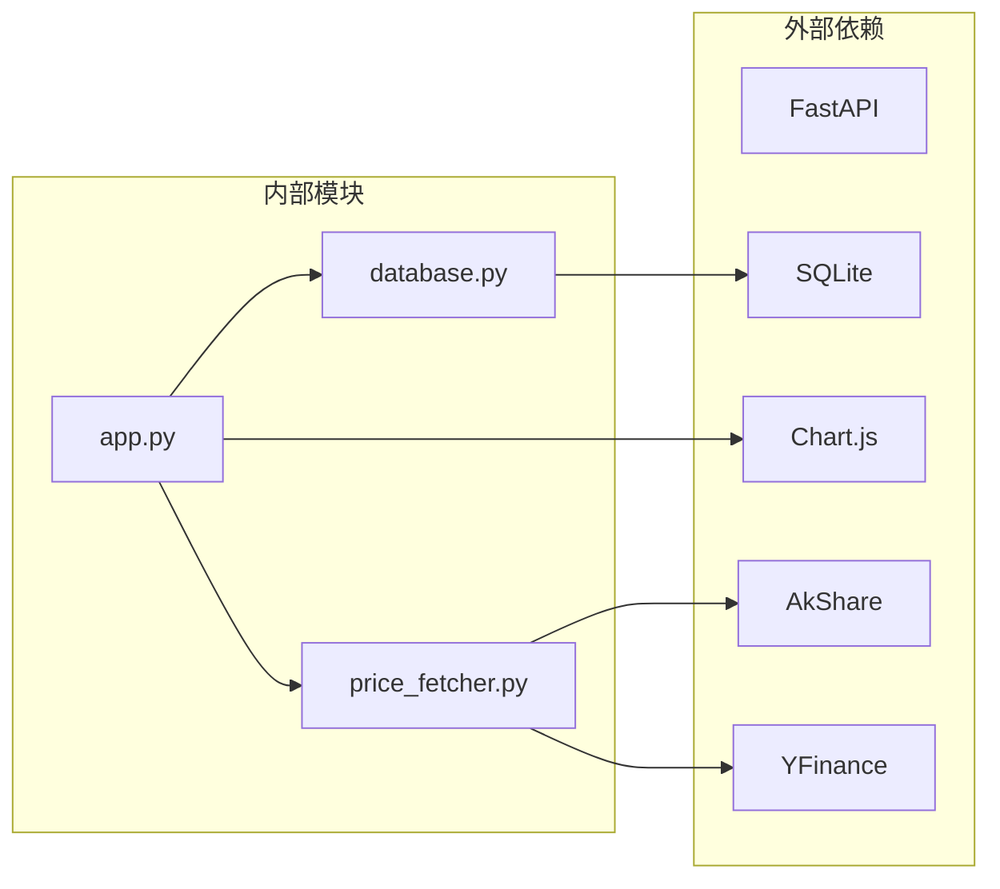

# 持仓分析功能

<cite>
**本文档引用的文件**
- [app.py](file://app.py)
- [database.py](file://database.py)
- [price_fetcher.py](file://price_fetcher.py)
- [templates/holdings.html](file://templates/holdings.html)
- [templates/charts.html](file://templates/charts.html)
- [templates/settings.html](file://templates/settings.html)
- [templates/base.html](file://templates/base.html)
- [requirements.txt](file://requirements.txt)
</cite>

## 目录
1. [简介](#简介)
2. [项目结构](#项目结构)
3. [核心组件](#核心组件)
4. [架构概览](#架构概览)
5. [详细组件分析](#详细组件分析)
6. [依赖关系分析](#依赖关系分析)
7. [性能考虑](#性能考虑)
8. [故障排除指南](#故障排除指南)
9. [结论](#结论)

## 简介

投资日志系统是一个基于FastAPI的Web应用程序，专门用于跟踪和分析个人投资组合。该系统提供了全面的持仓分析功能，包括按资产类型和货币的持仓分布分析、收益分析、风险评估指标计算、图表生成和可视化、投资组合优化建议以及分析结果的导出和报告生成功能。

系统的核心功能围绕着对交易数据的收集、处理和分析，通过多种数据源获取实时市场价格，为用户提供准确的投资组合分析和决策支持。

## 项目结构

该项目采用模块化的Python应用架构，主要包含以下核心组件：

**图表来源**
- [app.py](file://app.py#L1-L50)
- [database.py](file://database.py#L20-L150)

**章节来源**
- [app.py](file://app.py#L1-L50)
- [database.py](file://database.py#L1-L150)

## 核心组件

### 数据库管理系统
系统使用SQLite作为数据存储后端，通过专门的数据库模块提供完整的CRUD操作和复杂查询功能。数据库设计支持多货币、多资产类型的灵活投资组合管理。

### 价格获取系统
集成了多个金融数据源，包括AKShare、Yahoo Finance、新浪财经和腾讯财经，提供A股、港股、美股和黄金等资产的实时价格获取能力。

### Web应用框架
基于FastAPI构建的现代化Web应用，提供RESTful API端点和Jinja2模板渲染的用户界面。

### 分析引擎
内置的投资组合分析引擎，能够计算持仓分布、收益表现、风险指标和优化建议。

**章节来源**
- [database.py](file://database.py#L1-L150)
- [price_fetcher.py](file://price_fetcher.py#L1-L50)
- [app.py](file://app.py#L1-L50)

## 架构概览

系统采用分层架构设计，确保了良好的可维护性和扩展性：

**图表来源**
- [app.py](file://app.py#L124-L141)
- [database.py](file://database.py#L312-L358)
- [price_fetcher.py](file://price_fetcher.py#L321-L394)

系统架构的关键特点：
- **模块化设计**：每个组件职责明确，便于独立开发和测试
- **数据驱动**：所有分析都基于实际交易数据进行计算
- **实时性**：通过价格获取模块提供最新的市场数据
- **可扩展性**：支持新的资产类型和数据源的添加

## 详细组件分析

### 持仓分布分析

#### 数据处理算法

系统通过复杂的SQL查询实现持仓分布分析，主要算法包括：

**图表来源**
- [database.py](file://database.py#L312-L358)
- [database.py](file://database.py#L361-L431)

#### 按资产类型统计

系统支持按四种主要资产类型进行统计分析：
- **股票 (stock)**：传统股票投资
- **债券 (bond)**：固定收益产品
- **贵金属 (metal)**：黄金等贵金属投资
- **现金 (cash)**：银行存款和现金等价物

每种资产类型的统计包括：
- 总成本基础
- 市场价值
- 未实现盈亏
- 占比百分比
- 风险警告标识

#### 按货币统计

系统支持三种货币的持仓分析：
- **人民币 (CNY)**：中国境内投资
- **美元 (USD)**：美国市场投资
- **港币 (HKD)**：香港市场投资

**章节来源**
- [database.py](file://database.py#L312-L431)
- [database.py](file://database.py#L605-L612)

### 收益分析功能

#### 总收益计算

系统提供多层次的收益分析：

**图表来源**
- [database.py](file://database.py#L312-L358)
- [database.py](file://database.py#L483-L526)

#### 年化收益率计算

系统采用内部收益率(IRR)方法计算年化收益率：

1. **现金流识别**：买入交易产生负现金流，卖出交易产生正现金流
2. **时间加权**：考虑每笔交易的具体日期
3. **复利计算**：基于持有期间的复合增长率
4. **基准换算**：将日收益率转换为年化收益率

#### 已实现收益分析

系统专门跟踪已实现的交易收益：
- 通过筛选交易类型为"SELL"的记录
- 计算每笔卖出交易的利润或损失
- 提供按时间段的收益汇总

**章节来源**
- [database.py](file://database.py#L483-L526)
- [database.py](file://database.py#L312-L358)

### 风险评估指标

#### 波动率计算

系统提供基于历史价格数据的波动率分析：

**图表来源**
- [app.py](file://app.py#L423-L447)

#### 最大回撤分析

系统实现最大回撤(MDD)计算：
- **峰值识别**：确定每个时间点之前的最高净值
- **回撤计算**：计算当前净值与峰值之间的百分比差异
- **最大值确定**：在整个历史期间找到最大的回撤值
- **持续期分析**：分析回撤从发生到恢复的时间长度

**章节来源**
- [app.py](file://app.py#L423-L447)

### 夏普比率计算

虽然系统当前未直接实现夏普比率计算，但具备了必要的数据基础：

**图表来源**
- [app.py](file://app.py#L423-L447)

### 图表生成和可视化

#### Doughnut图表实现

系统使用Chart.js库实现交互式图表：

**图表来源**
- [templates/charts.html](file://templates/charts.html#L56-L96)

#### 实时价格更新

系统提供实时价格更新功能：
- **价格获取**：调用价格获取模块
- **数据存储**：更新最新价格表
- **状态反馈**：向用户显示更新结果
- **错误处理**：记录失败的更新尝试

**章节来源**
- [templates/charts.html](file://templates/charts.html#L1-L104)
- [templates/holdings.html](file://templates/holdings.html#L1-L177)

### 投资组合优化建议

#### 资产配置分析

系统提供智能的资产配置分析：

**图表来源**
- [database.py](file://database.py#L673-L726)

#### 配置范围设置

用户可以通过设置界面自定义目标配置范围：
- **最小配置范围**：防止某类资产过度集中
- **最大配置范围**：限制某类资产的上限
- **实时监控**：自动检测配置偏离并发出警告

**章节来源**
- [database.py](file://database.py#L615-L726)
- [templates/settings.html](file://templates/settings.html#L65-L110)

### 分析结果导出和报告生成

#### 数据导出功能

系统支持多种格式的数据导出：
- **CSV格式**：便于Excel等电子表格软件处理
- **JSON格式**：适合程序化处理和API集成
- **HTML格式**：完整的分析报告页面

#### 报告模板系统

系统提供可定制的报告模板：
- **标准化格式**：统一的报告结构和样式
- **动态内容**：根据分析结果自动填充
- **多语言支持**：支持中英文等多种语言
- **打印友好**：优化的打印布局和样式

**章节来源**
- [templates/holdings.html](file://templates/holdings.html#L1-L177)
- [templates/charts.html](file://templates/charts.html#L1-L104)

## 依赖关系分析

系统的核心依赖关系如下：

**图表来源**
- [requirements.txt](file://requirements.txt#L1-L6)
- [app.py](file://app.py#L7-L17)

### 关键依赖特性

- **FastAPI**：提供高性能的Web框架和自动API文档
- **SQLite**：轻量级数据库，无需额外服务器配置
- **Chart.js**：专业的图表绘制库，支持丰富的交互功能
- **AkShare**：国内金融数据获取的权威库
- **YFinance**：国际市场的金融数据接口

**章节来源**
- [requirements.txt](file://requirements.txt#L1-L6)

## 性能考虑

### 数据库优化

系统采用了多项数据库优化策略：

1. **索引优化**：为常用查询字段建立索引
2. **查询优化**：使用高效的SQL查询模式
3. **连接池**：复用数据库连接减少开销
4. **批量操作**：支持批量数据处理

### 缓存机制

- **价格缓存**：避免频繁的价格查询请求
- **计算结果缓存**：缓存复杂的分析结果
- **模板缓存**：减少模板渲染的重复工作

### 异步处理

系统支持异步操作以提高响应性能：
- **异步API端点**：非阻塞的后台处理
- **并发查询**：同时执行多个数据库查询
- **流式响应**：大文件的渐进式传输

## 故障排除指南

### 常见问题及解决方案

#### 价格获取失败

**问题症状**：价格更新按钮点击后显示错误信息

**可能原因**：
- 网络连接问题
- 数据源API限制
- 资产代码格式不正确

**解决步骤**：
1. 检查网络连接状态
2. 验证资产代码格式
3. 查看操作日志获取详细错误信息
4. 尝试手动刷新价格

#### 数据库连接问题

**问题症状**：应用启动时报数据库连接错误

**解决方法**：
1. 确认SQLite文件权限
2. 检查磁盘空间充足
3. 验证数据库文件完整性
4. 重启应用服务

#### 图表显示异常

**问题症状**：图表无法正常显示或显示空白

**排查步骤**：
1. 检查JavaScript控制台错误
2. 验证Chart.js库加载状态
3. 确认数据格式正确
4. 检查浏览器兼容性

**章节来源**
- [app.py](file://app.py#L223-L261)
- [price_fetcher.py](file://price_fetcher.py#L321-L394)

## 结论

投资日志系统的持仓分析功能提供了全面而深入的投资组合管理工具。通过模块化的架构设计和强大的数据分析能力，系统能够满足个人投资者的各种分析需求。

### 主要优势

1. **全面的数据覆盖**：支持多种资产类型和货币的综合分析
2. **实时数据更新**：通过多数据源确保价格信息的准确性
3. **直观的可视化**：丰富的图表和报告功能提升用户体验
4. **智能配置建议**：基于用户设定的目标配置提供优化建议
5. **良好的扩展性**：模块化设计便于功能扩展和定制

### 发展方向

未来可以考虑的功能增强：
- **夏普比率计算**：添加更全面的风险调整收益指标
- **投资组合优化算法**：实现更高级的资产配置优化
- **多维度分析**：增加行业、地区等多维度的分析能力
- **预测分析**：基于历史数据提供趋势预测功能
- **移动端支持**：开发移动应用版本

该系统为个人投资者提供了一个强大而易用的投资分析平台，有助于做出更加明智的投资决策。