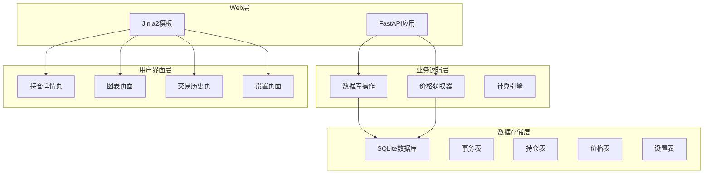
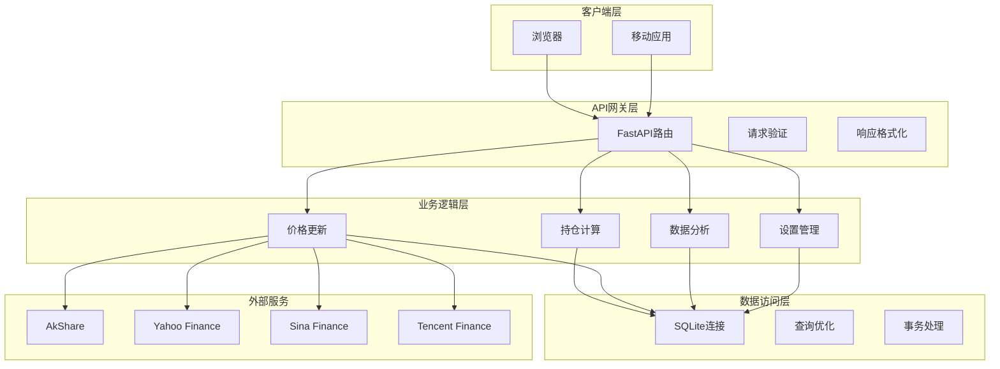
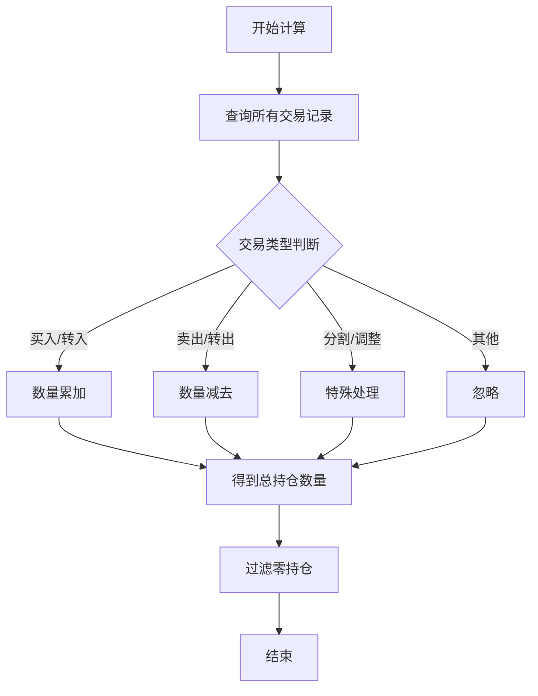
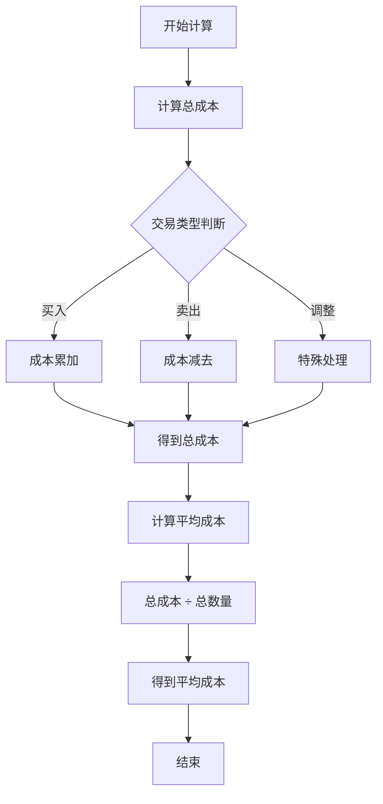
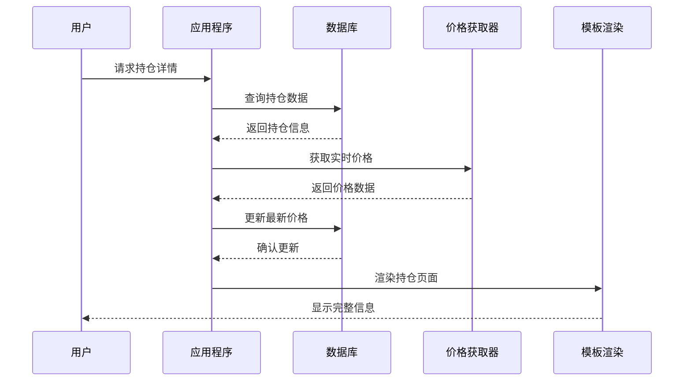
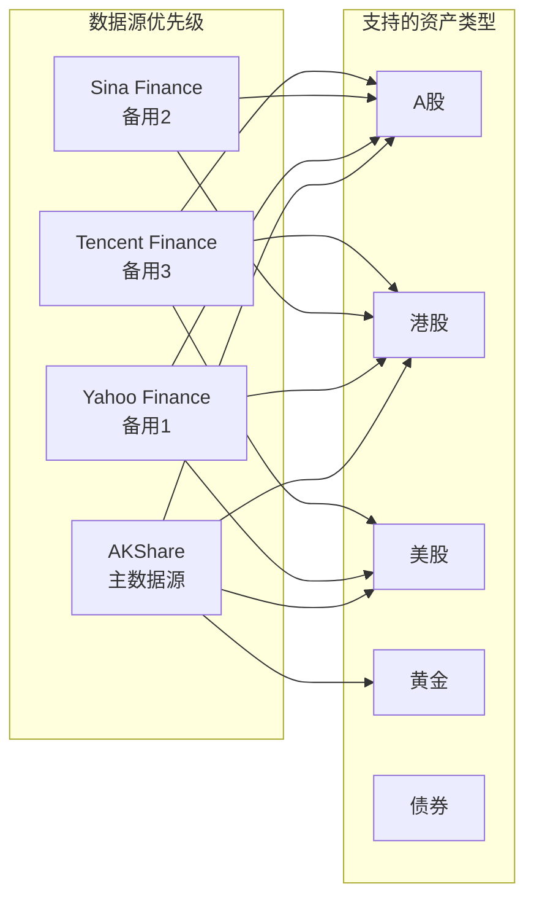
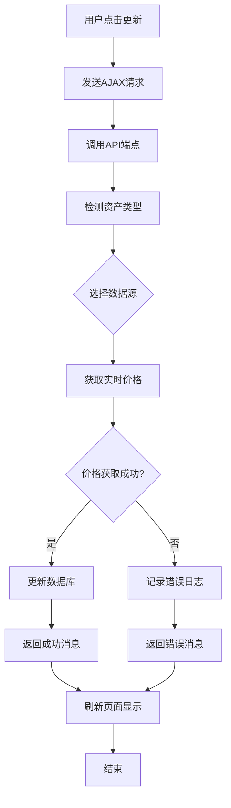
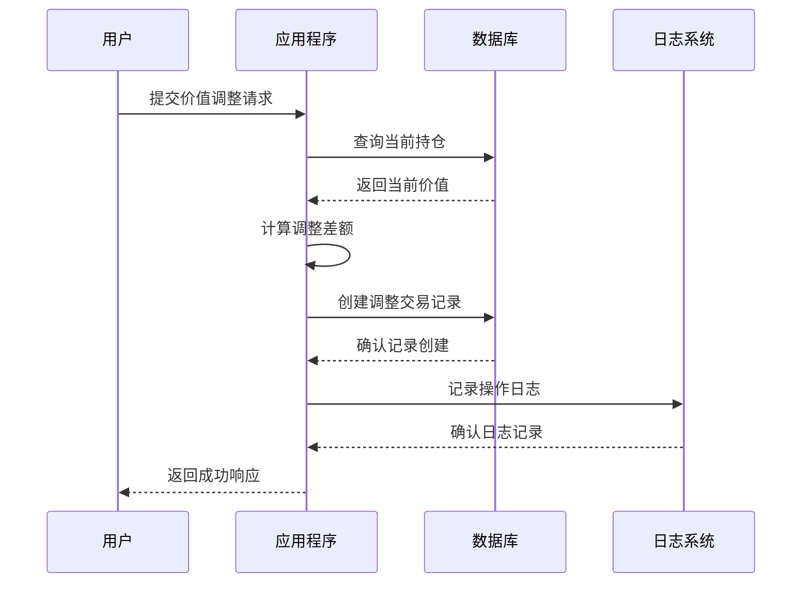
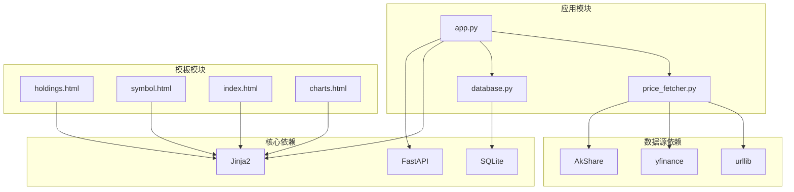

# 持仓管理功能

<cite>
**本文档引用的文件**
- [app.py](file://app.py)
- [database.py](file://database.py)
- [price_fetcher.py](file://price_fetcher.py)
- [templates/holdings.html](file://templates/holdings.html)
- [templates/symbol.html](file://templates/symbol.html)
- [templates/index.html](file://templates/index.html)
- [templates/charts.html](file://templates/charts.html)
- [templates/transactions.html](file://templates/transactions.html)
- [templates/settings.html](file://templates/settings.html)
- [requirements.txt](file://requirements.txt)
</cite>

## 目录
1. [简介](#简介)
2. [项目结构](#项目结构)
3. [核心组件](#核心组件)
4. [架构概览](#架构概览)
5. [详细组件分析](#详细组件分析)
6. [依赖关系分析](#依赖关系分析)
7. [性能考虑](#性能考虑)
8. [故障排除指南](#故障排除指南)
9. [结论](#结论)
10. [附录](#附录)

## 简介

投资日志系统是一个基于FastAPI的Web应用程序，专门用于跟踪和管理个人投资组合。该系统提供了完整的持仓管理功能，包括实时价格更新、持仓计算、分析报告和数据导出等核心功能。

本系统支持多种资产类型（股票、债券、贵金属、现金）和多币种（人民币、美元、港币），能够自动计算持仓数量、成本价、当前价值和盈亏情况，并提供直观的可视化界面。

## 项目结构

投资日志系统采用模块化设计，主要由以下组件构成：

**图表来源**
- [app.py](file://app.py#L19-L29)
- [database.py](file://database.py#L25-L149)

**章节来源**
- [app.py](file://app.py#L1-L446)
- [database.py](file://database.py#L1-L944)

## 核心组件

### 数据库模块
数据库模块负责所有数据持久化操作，包括事务记录、持仓计算、价格管理和设置配置。

### Web应用层
Web应用层提供REST API端点和HTML页面，处理用户请求并返回相应的响应。

### 价格获取模块
价格获取模块集成了多个数据源，支持A股、港股、美股和黄金等多种资产类型的实时价格获取。

### 模板渲染层
模板渲染层使用Jinja2模板系统，提供动态内容生成和用户界面展示。

**章节来源**
- [database.py](file://database.py#L1-L944)
- [app.py](file://app.py#L1-L446)
- [price_fetcher.py](file://price_fetcher.py#L1-L398)

## 架构概览

系统采用分层架构设计，确保关注点分离和代码可维护性：

**图表来源**
- [app.py](file://app.py#L36-L122)
- [database.py](file://database.py#L13-L18)
- [price_fetcher.py](file://price_fetcher.py#L22-L34)

## 详细组件分析

### 持仓计算引擎

持仓计算是系统的核心功能，负责从原始交易数据中提取和计算关键指标。

#### 持仓数量计算逻辑

持仓数量通过累加不同交易类型的数量来计算：

**图表来源**
- [database.py](file://database.py#L317-L343)

#### 成本价计算算法

平均成本价通过总成本除以总数量来计算：

**图表来源**
- [database.py](file://database.py#L329-L356)

#### 当前价值计算流程

当前价值计算结合了实时价格和历史成本：

**图表来源**
- [app.py](file://app.py#L124-L141)
- [app.py](file://app.py#L216-L261)

**章节来源**
- [database.py](file://database.py#L312-L431)

### 持仓详情展示功能

系统提供了多层次的持仓展示功能，支持按符号和货币分组显示。

#### 按货币分组的展示

系统支持三种货币的持仓展示：人民币(CNY)、美元(USD)、港币(HKD)。每个货币类别都显示：

- 总成本
- 市场价值
- 实现收益/亏损
- 资产类型分布

#### 按符号分组的详细视图

每个符号的详细页面包含：

- 基本信息：总份额、平均成本、总价值
- 价值调整功能
- 交易历史记录
- 年度筛选功能

**章节来源**
- [templates/holdings.html](file://templates/holdings.html#L15-L83)
- [templates/symbol.html](file://templates/symbol.html#L14-L62)

### 价格获取和更新机制

系统实现了多级价格获取机制，确保价格数据的准确性和可靠性。

#### 多数据源支持

**图表来源**
- [price_fetcher.py](file://price_fetcher.py#L7-L12)
- [price_fetcher.py](file://price_fetcher.py#L36-L62)

#### 自动价格更新流程

**图表来源**
- [app.py](file://app.py#L216-L261)
- [price_fetcher.py](file://price_fetcher.py#L321-L394)

**章节来源**
- [price_fetcher.py](file://price_fetcher.py#L1-L398)

### 持仓调整机制

系统提供了灵活的持仓调整功能，支持手动调整资产价值和快速交易。

#### 手动价值调整

手动调整功能允许用户直接修改某只股票的总价值：

**图表来源**
- [app.py](file://app.py#L191-L213)
- [database.py](file://database.py#L434-L480)

#### 快速交易功能

快速交易功能允许用户在持仓页面直接进行买卖操作：

**章节来源**
- [app.py](file://app.py#L191-L291)
- [database.py](file://database.py#L434-L480)

### 持仓分析功能

系统提供了丰富的分析功能，包括资产配置分析、收益分析和趋势分析。

#### 资产配置分析

系统支持按资产类型进行配置分析，包括：

- 按货币分组的资产类型分布
- 配置范围警告
- 可视化图表展示

#### 收益分析

系统提供多种收益分析维度：

- 实现收益/亏损（基于卖出交易）
- 未实现收益/亏损（基于当前市场价格）
- 年化收益率计算

**章节来源**
- [templates/index.html](file://templates/index.html#L8-L46)
- [templates/charts.html](file://templates/charts.html#L8-L32)

### API接口文档

系统提供了完整的REST API接口，支持前端JavaScript调用和第三方集成。

#### 持仓相关API

| 接口 | 方法 | 描述 | 参数 | 返回值 |
|------|------|------|------|--------|
| `/api/holdings` | GET | 获取当前持仓 | `account_id` (可选) | 持仓列表 |
| `/api/holdings-by-currency` | GET | 按货币分组的持仓 | 无 | 分组后的持仓数据 |
| `/api/transactions` | GET | 获取交易记录 | `symbol`, `account_id`, `transaction_type`, `limit` | 交易列表 |

#### 价格和分析API

| 接口 | 方法 | 描述 | 参数 | 返回值 |
|------|------|------|------|--------|
| `/api/portfolio-history` | GET | 获取投资组合历史 | 无 | 时间序列数据 |
| `/api/transactions/{transaction_id}` | DELETE | 删除交易记录 | `transaction_id` | 删除状态 |

**章节来源**
- [app.py](file://app.py#L378-L441)

## 依赖关系分析

系统依赖关系清晰，各模块职责明确：

**图表来源**
- [requirements.txt](file://requirements.txt#L1-L6)
- [app.py](file://app.py#L7-L17)

**章节来源**
- [requirements.txt](file://requirements.txt#L1-L6)
- [app.py](file://app.py#L1-L446)

## 性能考虑

系统在设计时充分考虑了性能优化：

### 数据库优化
- 使用索引优化常用查询字段
- 采用分页机制处理大量数据
- 连接池管理减少连接开销

### 缓存策略
- 最新价格缓存避免重复网络请求
- 模板渲染结果缓存
- API响应缓存机制

### 前端优化
- 懒加载图表组件
- 异步数据加载
- 减少DOM操作

## 故障排除指南

### 常见问题及解决方案

#### 价格获取失败
**症状**: 价格更新按钮点击后显示错误信息
**原因**: 网络连接问题或数据源不可用
**解决**: 检查网络连接，确认数据源可用性

#### 持仓计算异常
**症状**: 持仓数量或成本价显示异常
**原因**: 交易记录格式错误或数据损坏
**解决**: 检查交易记录完整性，修复数据格式

#### 页面加载缓慢
**症状**: 页面响应时间过长
**原因**: 数据量过大或数据库查询效率低
**解决**: 实施分页，优化查询索引

**章节来源**
- [price_fetcher.py](file://price_fetcher.py#L375-L394)
- [database.py](file://database.py#L140-L147)

## 结论

投资日志系统的持仓管理功能设计合理，实现了以下目标：

1. **完整性**: 支持多种资产类型和货币，覆盖主要投资场景
2. **准确性**: 通过多数据源验证确保价格准确性
3. **易用性**: 直观的用户界面和丰富的交互功能
4. **可扩展性**: 模块化设计便于功能扩展和维护

系统通过精确的持仓计算算法、灵活的调整机制和强大的分析功能，为用户提供了一个全面的投资组合管理解决方案。

## 附录

### 开发指南

#### 环境搭建
1. 安装Python 3.8+
2. 安装依赖包：`pip install -r requirements.txt`
3. 启动应用：`uvicorn app:app --reload`

#### 数据库初始化
首次运行时会自动创建必要的数据库表和索引。

#### 扩展建议
- 添加更多数据源支持
- 实现数据导出功能
- 增强移动端适配
- 添加通知提醒功能