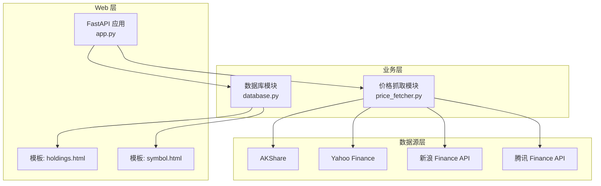
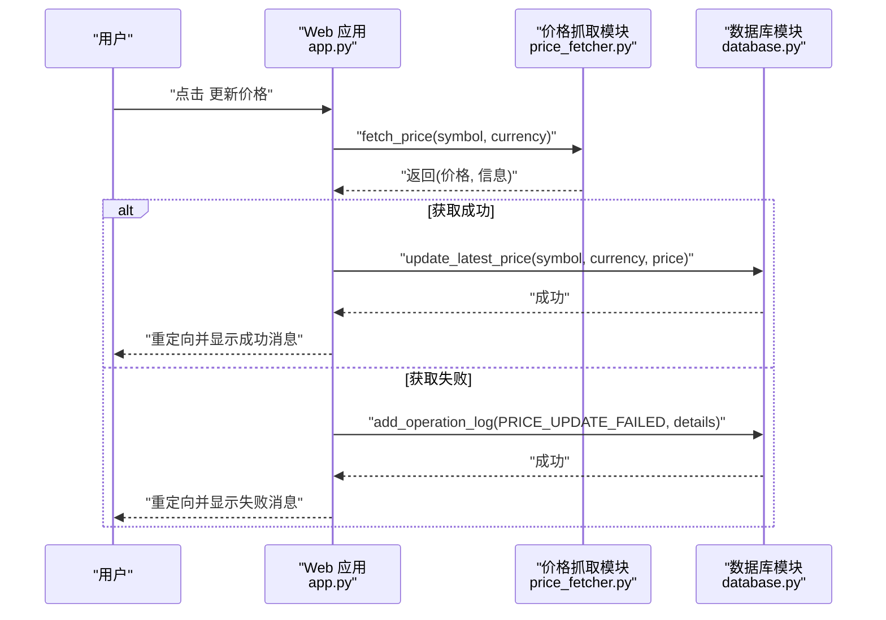
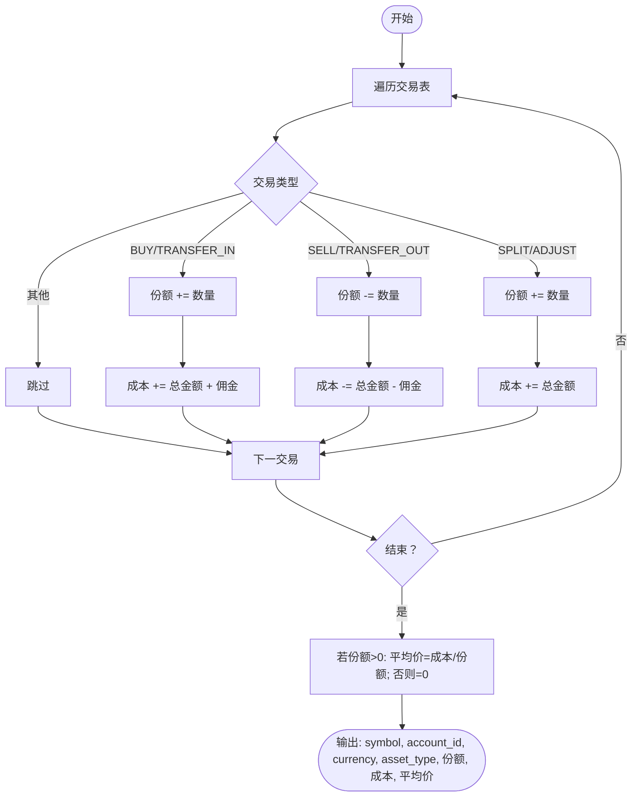
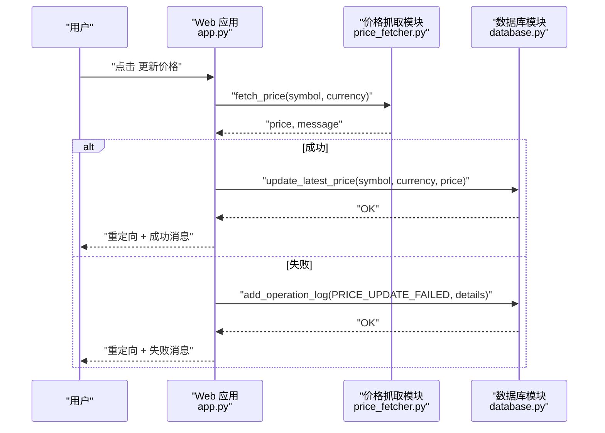
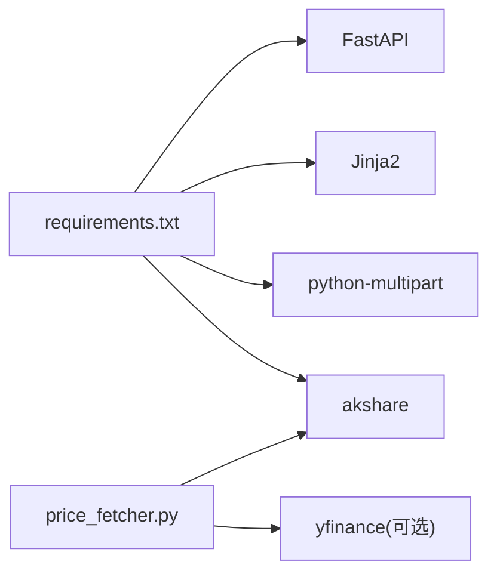

# 持仓计算逻辑

<cite>
**本文引用的文件**
- [app.py](file://app.py)
- [database.py](file://database.py)
- [price_fetcher.py](file://price_fetcher.py)
- [requirements.txt](file://requirements.txt)
- [templates/holdings.html](file://templates/holdings.html)
- [templates/symbol.html](file://templates/symbol.html)
</cite>

## 目录
1. [简介](#简介)
2. [项目结构](#项目结构)
3. [核心组件](#核心组件)
4. [架构总览](#架构总览)
5. [详细组件分析](#详细组件分析)
6. [依赖关系分析](#依赖关系分析)
7. [性能考量](#性能考量)
8. [故障排查指南](#故障排查指南)
9. [结论](#结论)

## 简介
本文件聚焦于投资日志系统的“持仓计算逻辑”，围绕以下目标展开：
- 持仓数量计算：基于买入与卖出交易的合并逻辑
- 成本价计算：加权平均成本与先进先出(FIFO)的实现现状与替代方案
- 当前价值计算：实时价格获取与存储、汇率转换策略
- 收益计算：未实现收益与已实现收益的区分与计算
- 数据结构设计：持仓数据模型与字段含义
- 计算精度与异常处理：数值精度控制与错误恢复

## 项目结构
系统采用分层架构：
- Web 层：FastAPI 应用负责路由与页面渲染
- 业务层：数据库模块封装交易、持仓、价格、设置等核心逻辑
- 数据源层：价格抓取模块对接多数据源（AKShare、Yahoo Finance、新浪、腾讯）

图表来源
- [app.py](file://app.py#L1-L464)
- [database.py](file://database.py#L1-L944)
- [price_fetcher.py](file://price_fetcher.py#L1-L398)

章节来源
- [app.py](file://app.py#L1-L464)
- [database.py](file://database.py#L1-L944)
- [price_fetcher.py](file://price_fetcher.py#L1-L398)

## 核心组件
- 持仓计算核心：通过 SQL 聚合统计各标的的持有份额与成本
- 实时价格管理：维护 latest_prices 表，支持按标的与币种查询与更新
- 价格抓取服务：多数据源回退机制，统一返回最新价格
- 页面渲染：模板中展示未实现收益、百分比等指标

章节来源
- [database.py](file://database.py#L312-L358)
- [database.py](file://database.py#L361-L431)
- [database.py](file://database.py#L779-L824)
- [price_fetcher.py](file://price_fetcher.py#L321-L394)
- [templates/holdings.html](file://templates/holdings.html#L1-L177)
- [templates/symbol.html](file://templates/symbol.html#L1-L105)

## 架构总览
系统的关键流程包括：
- 用户在“持仓详情”页面触发“更新价格”
- 后端调用价格抓取模块，从多个数据源获取最新价格
- 将价格写入数据库的 latest_prices 表，并记录操作日志
- 前端重新加载页面，使用最新价格计算当前市值与未实现收益

图表来源
- [app.py](file://app.py#L216-L262)
- [price_fetcher.py](file://price_fetcher.py#L321-L394)
- [database.py](file://database.py#L779-L824)

## 详细组件分析

### 持仓数量与成本计算（加权平均成本）
- 持仓数量：对每笔交易按类型进行加减，买入与转入增加份额，卖出与转出减少份额；拆分与调整交易单独处理
- 成本计算：将买入交易的成本（含佣金）累加，卖出交易的成本（扣佣金）累减；最终得到总成本
- 平均价：总成本除以总份额（若份额大于零），否则为 0

图表来源
- [database.py](file://database.py#L312-L358)

章节来源
- [database.py](file://database.py#L312-L358)

### FIFO 算法实现现状与替代方案
- 现状：系统采用“加权平均成本”而非严格 FIFO。SQL 聚合直接给出总份额与总成本，未保留逐笔成交的时间序列
- 替代方案（建议）：
  - 在交易表中引入“成交时间戳”，并在查询时按时间排序
  - 使用窗口函数或临时表维护“批次”队列，实现 FIFO 出库与结转
  - 对于需要精确税务/会计口径的场景，建议引入独立的“FIFO 计算引擎”

章节来源
- [database.py](file://database.py#L312-L358)

### 当前价值计算与实时价格获取
- 价值计算：当前价值 = 最新价格 × 持有份额
- 未实现收益：当前价值 − 成本
- 百分比：未实现收益 ÷ 成本 × 100
- 实时价格来源：
  - 多数据源回退：AKShare → Yahoo Finance → 新浪 → 腾讯
  - 自动获取失败时记录操作日志，前端显示失败原因
- 存储与查询：
  - latest_prices 表按 (symbol, currency) 唯一键存储最新价格与更新时间
  - 持仓汇总时按符号与币种匹配最新价格，若无价格则使用成本作为市值

图表来源
- [app.py](file://app.py#L216-L262)
- [price_fetcher.py](file://price_fetcher.py#L321-L394)
- [database.py](file://database.py#L779-L824)

章节来源
- [database.py](file://database.py#L361-L431)
- [database.py](file://database.py#L779-L824)
- [price_fetcher.py](file://price_fetcher.py#L321-L394)

### 已实现收益与未实现收益
- 未实现收益：当前市值与成本之差
- 已实现收益：仅来自“卖出”交易的损益，系统提供查询接口用于导出卖单明细
- 分类展示：模板中对未实现收益与百分比进行格式化显示

章节来源
- [database.py](file://database.py#L361-L431)
- [database.py](file://database.py#L483-L526)
- [templates/holdings.html](file://templates/holdings.html#L48-L81)

### 持仓数据结构与字段含义
- 持仓聚合结果字段（由 get_holdings 返回）：
  - symbol：标的代码
  - account_id：账户标识
  - currency：币种
  - asset_type：资产类型
  - total_shares：总份额（仅保留 > 0 的组合）
  - total_cost：总成本（含/扣佣金）
  - avg_cost：平均成本（total_cost / total_shares）
- 持仓汇总结果字段（由 get_holdings_by_symbol 返回）：
  - symbol、asset_type、account_id、total_shares、avg_cost、cost_basis
  - latest_price、price_updated_at、market_value、unrealized_pnl、pnl_percent、percent

章节来源
- [database.py](file://database.py#L312-L358)
- [database.py](file://database.py#L361-L431)

### 计算精度与异常处理
- 精度控制：
  - 价格与金额保留两位小数
  - 份额保留四位小数
  - 百分比保留两位小数
- 异常处理：
  - 价格抓取失败时记录操作日志并返回错误信息
  - 价格缺失时，市值使用成本代替，未实现收益与百分比标记为空
  - 交易更新时若涉及数量或价格变更，自动重算 total_amount

章节来源
- [templates/holdings.html](file://templates/holdings.html#L21-L28)
- [templates/holdings.html](file://templates/holdings.html#L52-L72)
- [database.py](file://database.py#L225-L231)
- [database.py](file://database.py#L394-L401)

## 依赖关系分析
- 运行时依赖：FastAPI、Jinja2、python-multipart、akshare
- 价格抓取依赖：yfinance（可选，若未安装则回退到其他数据源）

图表来源
- [requirements.txt](file://requirements.txt#L1-L6)
- [price_fetcher.py](file://price_fetcher.py#L22-L33)

章节来源
- [requirements.txt](file://requirements.txt#L1-L6)
- [price_fetcher.py](file://price_fetcher.py#L22-L33)

## 性能考量
- 查询优化：
  - 交易表建立多索引（symbol、date、account、type、currency、asset_type），提升过滤与排序效率
  - 聚合查询按 symbol、account_id、currency、asset_type 分组，避免全表扫描
- I/O 优化：
  - 价格抓取采用多数据源回退，降低单点故障风险
  - 最新价格缓存于 latest_prices 表，避免重复请求
- 前端展示：
  - 模板中对数值进行格式化，减少前端复杂计算

章节来源
- [database.py](file://database.py#L140-L147)
- [database.py](file://database.py#L779-L824)

## 故障排查指南
- 价格更新失败：
  - 检查网络与数据源可用性
  - 查看操作日志表中的失败记录
  - 确认 symbol 类型识别是否正确（A股/HK/US/黄金）
- 未实现收益显示为“-”：
  - 确认 latest_prices 中是否存在对应记录
  - 若无价格，系统会使用成本作为市值
- 持仓为 0：
  - 买入与卖出抵消或仅剩调整/拆分交易导致份额为 0，SQL HAVING 条件过滤掉
- 交易修改后金额异常：
  - 更新 quantity 或 price 时会自动重算 total_amount

章节来源
- [app.py](file://app.py#L216-L262)
- [database.py](file://database.py#L733-L773)
- [database.py](file://database.py#L312-L358)
- [database.py](file://database.py#L225-L231)

## 结论
- 系统采用“加权平均成本”进行成本核算，满足大多数个人投资者的日常需求
- 未实现收益与百分比计算清晰直观，便于资产配置与绩效评估
- 实时价格抓取具备多数据源回退能力，提升了稳定性
- 若需满足严格 FIFO 会计要求，可在现有基础上扩展批次队列与 FIFO 计算引擎