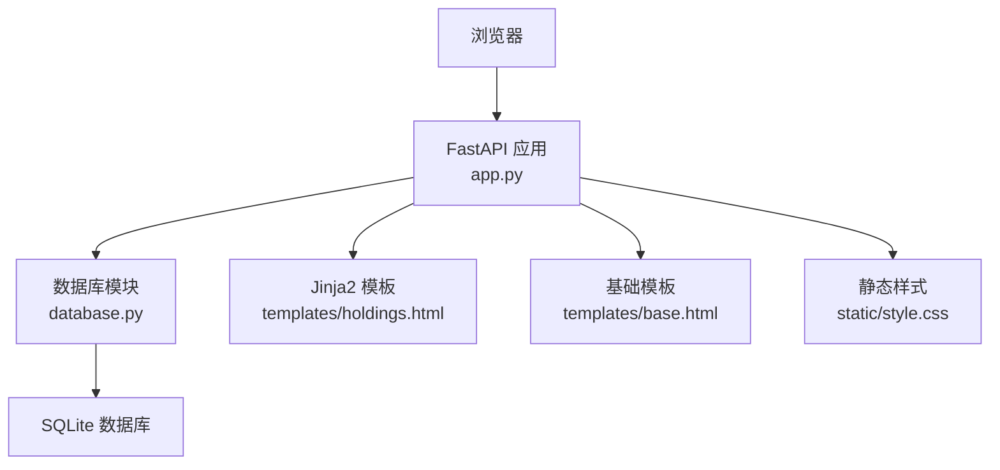
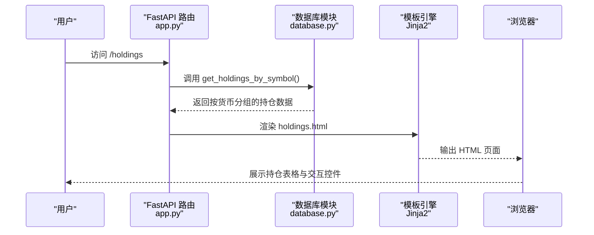
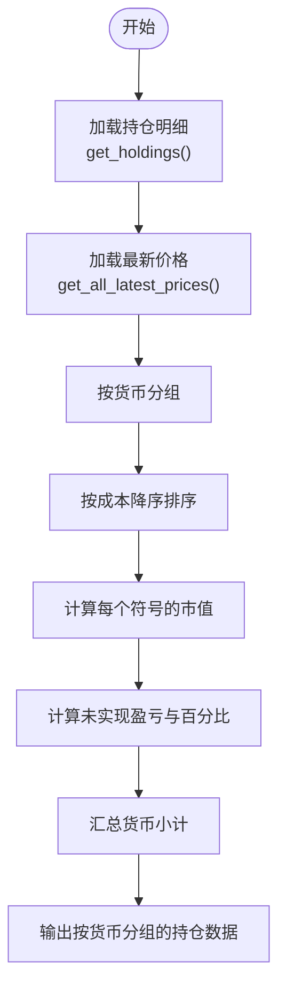
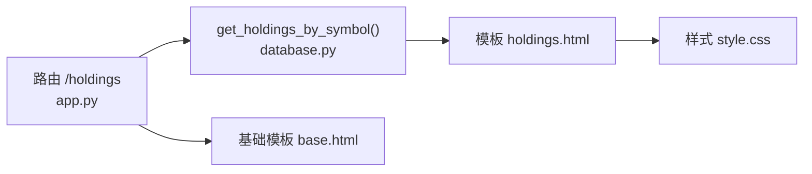

# 持仓详情展示

<cite>
**本文档引用的文件**
- [app.py](file://app.py)
- [database.py](file://database.py)
- [templates/holdings.html](file://templates/holdings.html)
- [templates/symbol.html](file://templates/symbol.html)
- [templates/base.html](file://templates/base.html)
- [static/style.css](file://static/style.css)
</cite>

## 目录
1. [简介](#简介)
2. [项目结构](#项目结构)
3. [核心组件](#核心组件)
4. [架构总览](#架构总览)
5. [详细组件分析](#详细组件分析)
6. [依赖关系分析](#依赖关系分析)
7. [性能考虑](#性能考虑)
8. [故障排除指南](#故障排除指南)
9. [结论](#结论)
10. [附录](#附录)

## 简介
本文件针对投资日志系统的“持仓详情展示”功能进行深入文档化，重点覆盖：
- 按货币与符号分组的显示逻辑与数据聚合流程
- 持仓表格列定义与字段含义（数量、成本价、当前价、市值、收益等）
- 持仓状态标识与颜色编码规则
- 分页机制与大数据集处理策略
- 响应式布局设计与用户体验优化
- 自定义显示选项与过滤功能的实现指南

## 项目结构
系统采用前后端分离的轻量级架构：后端使用 FastAPI 提供 API 与页面渲染，前端模板使用 Jinja2，样式通过静态 CSS 文件管理。持仓详情页面位于 `/holdings`，支持按货币分组展示各符号的持仓明细。

图表来源
- [app.py](file://app.py#L1-L464)
- [database.py](file://database.py#L1-L951)
- [templates/holdings.html](file://templates/holdings.html#L1-L177)
- [templates/base.html](file://templates/base.html#L1-L27)
- [static/style.css](file://static/style.css#L1-L934)

章节来源
- [app.py](file://app.py#L1-L464)
- [database.py](file://database.py#L1-L951)
- [templates/holdings.html](file://templates/holdings.html#L1-L177)
- [templates/base.html](file://templates/base.html#L1-L27)
- [static/style.css](file://static/style.css#L1-L934)

## 核心组件
- 后端路由与页面渲染：负责加载持仓详情页面，调用数据库模块计算分组与聚合数据，并传递给模板渲染。
- 数据库模块：提供持仓查询、最新价格查询、资产类型映射、分配设置等能力，支撑前端展示。
- 模板层：定义持仓表格列、颜色编码、交互按钮与模态框等前端元素。
- 静态样式：提供响应式布局、颜色体系、按钮与表格样式，确保在桌面与移动端的良好体验。

章节来源
- [app.py](file://app.py#L124-L142)
- [database.py](file://database.py#L361-L431)
- [templates/holdings.html](file://templates/holdings.html#L32-L82)
- [static/style.css](file://static/style.css#L432-L511)

## 架构总览
持仓详情页面的请求-响应流程如下：

图表来源
- [app.py](file://app.py#L124-L142)
- [database.py](file://database.py#L361-L431)
- [templates/holdings.html](file://templates/holdings.html#L1-L177)

## 详细组件分析

### 按货币与符号分组的数据聚合
- 分组策略
  - 先按货币分组，再对每种货币内的符号进行排序与百分比计算。
  - 排序依据为“成本”，降序排列，便于突出高价值头寸。
- 关键计算
  - 成本总计：每种货币下所有持仓的成本之和。
  - 市值总计：基于最新价格计算的市场价值之和。
  - 未实现盈亏：按市值减去成本计算；若无最新价格则使用成本。
  - 百分比：按单个符号的市值占该货币总市值的比例计算。
- 数据来源
  - 持仓明细来自数据库的汇总查询，包含数量、平均成本、账户信息等。
  - 最新价格来自独立的“最新价格表”，用于实时或手动更新。

图表来源
- [database.py](file://database.py#L361-L431)
- [database.py](file://database.py#L815-L824)

章节来源
- [database.py](file://database.py#L361-L431)
- [database.py](file://database.py#L815-L824)

### 持仓表格列定义与字段含义
- 列定义
  - 符号：链接到该符号的详情页，便于查看交易历史与调整价值。
  - 类型：资产类型标签，使用不同颜色区分股票、债券、贵金属、现金等。
  - 数量：持有份额，保留四位小数，便于精确展示。
  - 平均成本：总成本除以持有数量，保留两位小数。
  - 最新价格：若可获取则显示，否则显示占位符。
  - 成本基准：总成本，保留两位小数。
  - 市值：最新价格乘以数量；若无价格则等于成本。
  - 未实现盈亏：按市值减成本计算，正负分别使用绿色与红色。
  - 百分比：该符号市值占该货币总市值的百分比。
  - 操作：提供“更新价格”和“快速交易”两个按钮。
- 字段来源
  - 表格数据由后端聚合函数返回，模板层负责格式化与展示。

章节来源
- [templates/holdings.html](file://templates/holdings.html#L32-L82)
- [database.py](file://database.py#L361-L431)

### 持仓状态标识与颜色编码规则
- 资产类型标签
  - 使用不同背景色区分资产类型，便于快速识别。
- 未实现盈亏颜色
  - 正值使用绿色，负值使用红色，直观反映收益状况。
- 货币小计与百分比条
  - 货币小计区域展示成本、市值与盈亏，百分比条用于可视化占比。

章节来源
- [templates/holdings.html](file://templates/holdings.html#L48-L82)
- [static/style.css](file://static/style.css#L141-L144)
- [static/style.css](file://static/style.css#L471-L484)
- [static/style.css](file://static/style.css#L486-L497)

### 分页机制与大数据集处理策略
- 当前实现
  - 交易列表页面采用分页，每页固定条目数，支持跳转至指定页。
- 大数据集处理建议
  - 对于持仓详情页面，当前未实现分页；如数据量较大，建议：
    - 在后端增加分页参数与偏移量控制；
    - 前端增加“加载更多”或“搜索/筛选”入口；
    - 对热点符号优先加载，非热点延迟加载。
- 事务列表分页参考
  - 交易列表分页参数与计算方式可作为持仓分页的参考实现。

章节来源
- [app.py](file://app.py#L48-L66)
- [database.py](file://database.py#L262-L310)

### 响应式布局设计与用户体验优化
- 响应式网格与表格
  - 在窄屏设备上，表格单元格内边距与字体大小缩小，保证可读性。
  - 设置了最小列宽与断点，确保在移动设备上仍能良好显示。
- 模态框与交互
  - 快速交易弹窗提供简洁的下单界面，减少页面跳转。
  - 更新价格按钮支持一键刷新最新价格，提升操作效率。
- 导航与页面结构
  - 统一的导航栏与基础模板，确保跨页面一致的用户体验。

章节来源
- [static/style.css](file://static/style.css#L256-L274)
- [templates/holdings.html](file://templates/holdings.html#L91-L140)
- [templates/base.html](file://templates/base.html#L1-L27)

### 自定义显示选项与过滤功能实现指南
- 可扩展方向
  - 支持按资产类型、货币、账户等维度进行筛选。
  - 支持按时间范围、交易类型等条件过滤交易历史。
  - 支持自定义排序（如按市值、未实现盈亏、百分比）。
- 实现建议
  - 在后端路由中增加查询参数，调用数据库模块的过滤查询函数。
  - 在模板中增加筛选表单与重定向逻辑，保持 URL 友好。
  - 对高频筛选项可考虑在前端缓存结果，减少重复请求。

章节来源
- [app.py](file://app.py#L124-L142)
- [database.py](file://database.py#L262-L310)

## 依赖关系分析
- 路由依赖
  - `/holdings` 路由依赖数据库模块的分组与聚合函数。
- 模板依赖
  - 持仓页面依赖基础模板与样式文件，确保统一风格。
- 数据依赖
  - 持仓数据依赖交易表与最新价格表；资产类型标签依赖资产类型表。

图表来源
- [app.py](file://app.py#L124-L142)
- [database.py](file://database.py#L361-L431)
- [templates/holdings.html](file://templates/holdings.html#L1-L177)
- [templates/base.html](file://templates/base.html#L1-L27)
- [static/style.css](file://static/style.css#L1-L934)

章节来源
- [app.py](file://app.py#L124-L142)
- [database.py](file://database.py#L361-L431)
- [templates/holdings.html](file://templates/holdings.html#L1-L177)
- [templates/base.html](file://templates/base.html#L1-L27)
- [static/style.css](file://static/style.css#L1-L934)

## 性能考虑
- 查询优化
  - 为交易表建立多索引（符号、日期、账户、类型、货币、资产类型），有助于提高分组与过滤查询性能。
- 缓存策略
  - 将最新价格存储在独立表中，避免每次计算都访问外部接口；可定期批量更新。
- 前端渲染
  - 对于大量数据，建议采用虚拟滚动或分页，减少一次性渲染压力。
- 数据聚合
  - 在数据库层面完成聚合与排序，减少 Python 层面的重复计算。

章节来源
- [database.py](file://database.py#L140-L147)
- [database.py](file://database.py#L779-L824)

## 故障排除指南
- 无法显示最新价格
  - 检查最新价格表是否正确写入；确认更新价格接口返回成功消息。
- 未实现盈亏显示为占位符
  - 确认是否存在对应符号与货币的最新价格；若无价格，系统会回退到成本计算。
- 颜色不生效
  - 检查样式文件是否正确加载；确认类名与 CSS 规则匹配。
- 分页异常
  - 检查分页参数与总数计算逻辑；确保偏移量与每页条数一致。

章节来源
- [app.py](file://app.py#L216-L262)
- [database.py](file://database.py#L779-L824)
- [templates/holdings.html](file://templates/holdings.html#L54-L72)
- [static/style.css](file://static/style.css#L471-L484)

## 结论
本系统通过清晰的分组与聚合逻辑，结合响应式设计与交互优化，实现了直观易用的持仓详情展示。建议在未来版本中引入分页、筛选与排序等高级功能，进一步提升大数据场景下的可用性与性能表现。

## 附录
- 相关页面与功能
  - 持仓详情：/holdings
  - 符号详情：/symbol/{symbol}
  - 交易列表：/transactions
  - 图表分析：/charts
  - 设置页面：/settings

章节来源
- [app.py](file://app.py#L36-L188)
- [templates/symbol.html](file://templates/symbol.html#L1-L105)