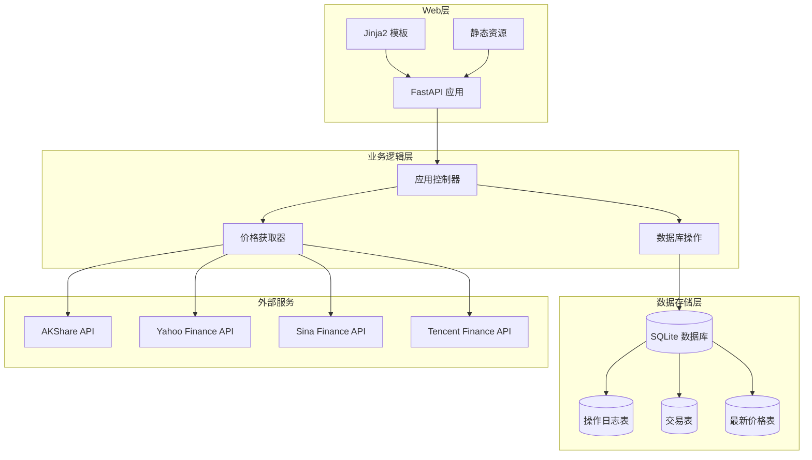
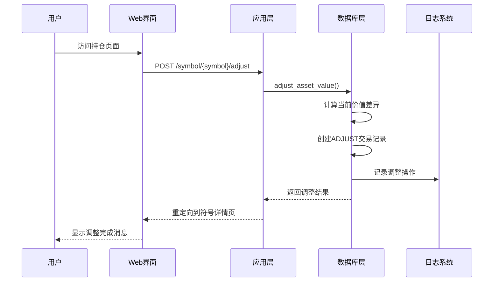
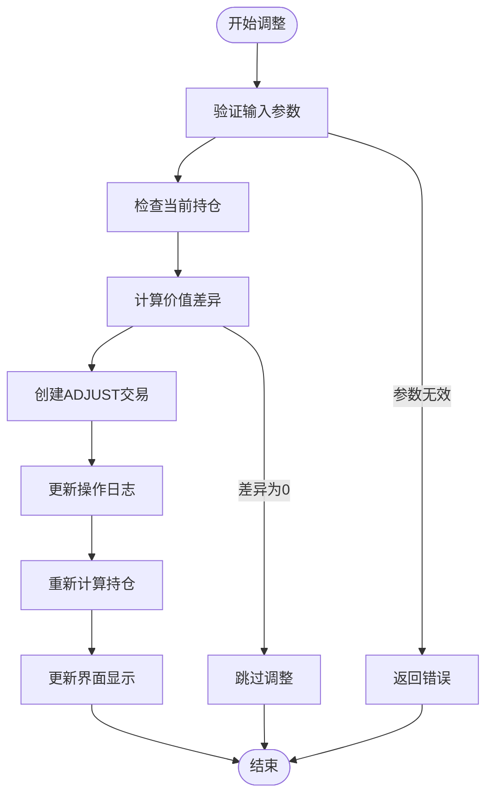
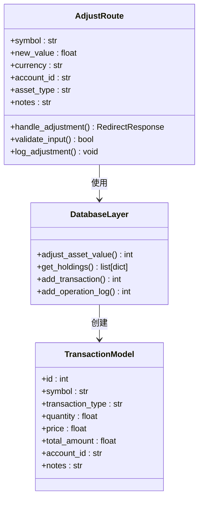
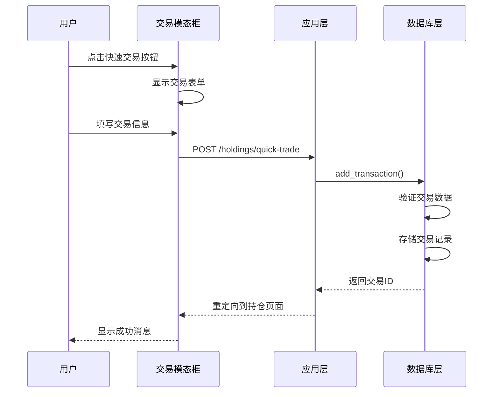
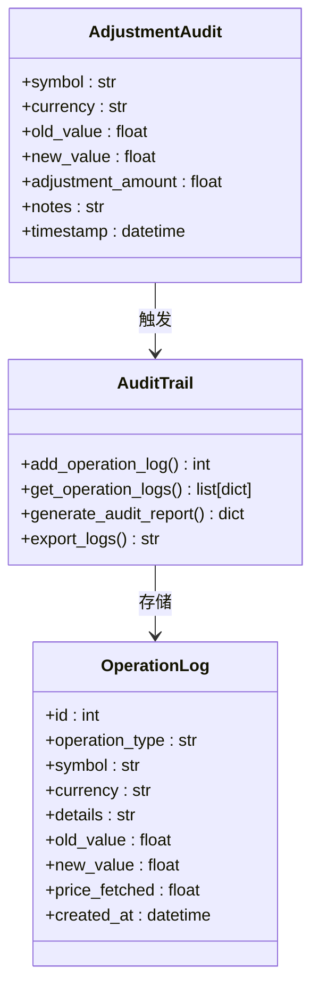
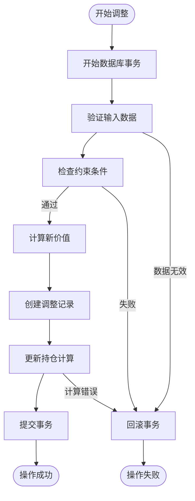
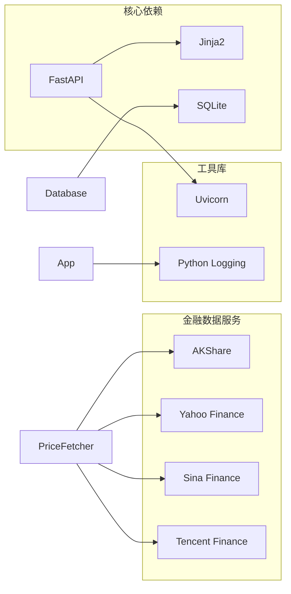
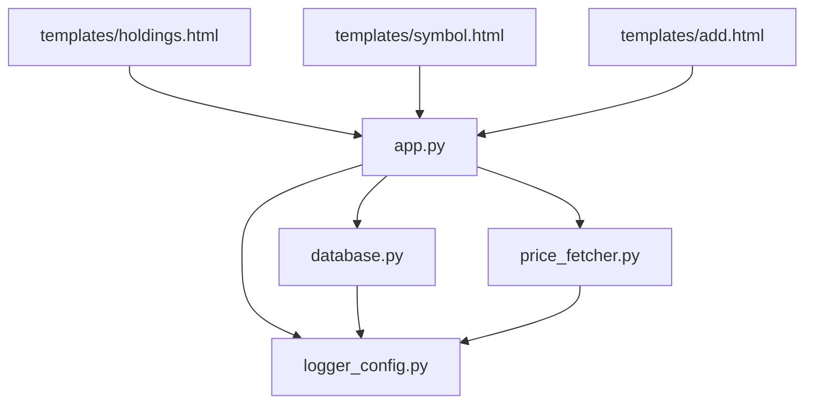

# 持仓调整机制

<cite>
**本文档引用的文件**
- [app.py](file://app.py)
- [database.py](file://database.py)
- [templates/holdings.html](file://templates/holdings.html)
- [templates/symbol.html](file://templates/symbol.html)
- [templates/add.html](file://templates/add.html)
- [price_fetcher.py](file://price_fetcher.py)
- [logger_config.py](file://logger_config.py)
- [requirements.txt](file://requirements.txt)
</cite>

## 目录
1. [简介](#简介)
2. [项目结构](#项目结构)
3. [核心组件](#核心组件)
4. [架构概览](#架构概览)
5. [详细组件分析](#详细组件分析)
6. [依赖关系分析](#依赖关系分析)
7. [性能考虑](#性能考虑)
8. [故障排除指南](#故障排除指南)
9. [结论](#结论)

## 简介

投资日志系统的持仓调整机制是一个关键功能模块，允许用户对现有投资组合进行手动价值调整。该机制通过创建特殊的"ADJUST"交易类型来记录价值变化，确保投资组合数据的准确性和完整性。本文档深入分析了手动调整资产价值的功能实现、快速交易功能、日志记录和审计功能，以及调整操作对持仓计算的影响和数据一致性保证。

## 项目结构

投资日志系统采用典型的Web应用架构，主要由以下组件构成：

**图表来源**
- [app.py](file://app.py#L1-L50)
- [database.py](file://database.py#L20-L150)
- [price_fetcher.py](file://price_fetcher.py#L1-L50)

**章节来源**
- [app.py](file://app.py#L1-L50)
- [database.py](file://database.py#L1-L150)

## 核心组件

### 调整功能核心实现

系统的核心调整功能通过以下关键组件实现：

1. **调整路由处理**：在应用层定义专门的调整路由
2. **数据库调整函数**：实现具体的调整逻辑
3. **模板界面**：提供用户友好的调整界面
4. **日志记录**：完整的操作审计功能

### 快速交易功能

系统提供了便捷的快速交易功能，允许用户直接从持仓页面进行买卖操作：

- 一键交易按钮
- 批量操作支持
- 实时价格更新
- 交易确认机制

**章节来源**
- [app.py](file://app.py#L191-L214)
- [database.py](file://database.py#L434-L481)
- [templates/holdings.html](file://templates/holdings.html#L74-L140)

## 架构概览

投资日志系统的持仓调整机制采用分层架构设计，确保功能的模块化和可维护性：

**图表来源**
- [app.py](file://app.py#L191-L214)
- [database.py](file://database.py#L434-L481)

### 数据流分析

调整操作的数据流遵循严格的处理流程：

**图表来源**
- [database.py](file://database.py#L434-L481)
- [app.py](file://app.py#L191-L214)

## 详细组件分析

### 调整功能实现

#### 路由定义和请求处理

调整功能通过专门的路由处理用户请求：

**图表来源**
- [app.py](file://app.py#L191-L214)
- [database.py](file://database.py#L434-L481)

#### 调整算法实现

调整算法的核心逻辑如下：

1. **当前价值查询**：从数据库获取当前持仓的总成本
2. **差异计算**：新价值减去当前价值得到调整金额
3. **交易创建**：创建类型为"ADJUST"的特殊交易记录
4. **日志记录**：记录完整的调整操作信息

**章节来源**
- [database.py](file://database.py#L434-L481)
- [app.py](file://app.py#L191-L214)

### 快速交易功能

#### 一键买卖实现

快速交易功能提供了便捷的一键操作：

**图表来源**
- [templates/holdings.html](file://templates/holdings.html#L91-L140)
- [app.py](file://app.py#L264-L292)

#### 批量操作支持

系统支持多种批量操作模式：

- **单个符号批量**：对特定符号进行多次调整
- **多账户批量**：跨多个账户执行相同调整
- **条件批量**：基于特定条件筛选后批量调整

**章节来源**
- [templates/holdings.html](file://templates/holdings.html#L91-L140)
- [app.py](file://app.py#L264-L292)

### 日志记录和审计

#### 完整的操作审计

系统实现了全面的操作审计功能：

**图表来源**
- [database.py](file://database.py#L733-L773)
- [app.py](file://app.py#L200-L209)

#### 审计功能特性

- **完整追踪**：记录所有调整操作的详细信息
- **时间戳**：精确的时间记录和排序
- **关联查询**：支持按符号、日期、用户等维度查询
- **导出功能**：支持审计报告的导出和分享

**章节来源**
- [database.py](file://database.py#L733-L773)
- [logger_config.py](file://logger_config.py#L1-L54)

### 数据一致性保证

#### 事务处理机制

系统通过多种机制确保数据一致性：

**图表来源**
- [database.py](file://database.py#L434-L481)

#### 约束和验证

系统实施了多层次的数据验证：

1. **数据库级约束**：使用SQLite的CHECK约束确保数据完整性
2. **应用级验证**：在Python层进行业务逻辑验证
3. **前端验证**：提供实时的用户输入验证反馈

**章节来源**
- [database.py](file://database.py#L32-L46)
- [database.py](file://database.py#L605-L612)

## 依赖关系分析

### 外部依赖

系统依赖于多个外部库和服务：

**图表来源**
- [requirements.txt](file://requirements.txt#L1-L6)
- [price_fetcher.py](file://price_fetcher.py#L22-L34)

### 内部模块依赖

系统内部模块之间的依赖关系清晰明确：

**图表来源**
- [app.py](file://app.py#L15-L17)
- [database.py](file://database.py#L1-L17)

**章节来源**
- [requirements.txt](file://requirements.txt#L1-L6)
- [app.py](file://app.py#L15-L17)

## 性能考虑

### 查询优化

系统采用了多种查询优化策略：

1. **索引优化**：为常用查询字段建立索引
2. **查询缓存**：缓存频繁访问的数据
3. **分页处理**：大量数据的分页显示
4. **连接池**：数据库连接的复用

### 并发处理

系统支持并发操作的处理：

- **线程安全**：数据库操作的线程安全保证
- **锁机制**：关键操作的互斥锁
- **重试机制**：网络异常的自动重试

## 故障排除指南

### 常见问题及解决方案

#### 调整操作失败

**问题症状**：
- 调整后持仓没有变化
- 系统返回错误信息

**可能原因**：
1. 输入值无效或格式错误
2. 数据库连接问题
3. 权限不足

**解决步骤**：
1. 检查输入值是否符合要求
2. 验证数据库连接状态
3. 确认用户权限设置

#### 价格获取失败

**问题症状**：
- 一键更新价格功能失效
- 价格显示为"-"或错误

**解决步骤**：
1. 检查网络连接
2. 验证外部API可用性
3. 查看日志文件获取详细错误信息

**章节来源**
- [price_fetcher.py](file://price_fetcher.py#L375-L395)

### 调试技巧

1. **启用详细日志**：查看`logs/app.log`文件
2. **数据库检查**：使用SQLite命令行工具检查数据
3. **浏览器开发者工具**：调试前端JavaScript代码

## 结论

投资日志系统的持仓调整机制是一个设计精良的功能模块，具有以下特点：

1. **功能完整性**：提供了完整的手动调整、快速交易和审计功能
2. **数据一致性**：通过事务处理和多重验证确保数据准确性
3. **用户体验**：直观的界面设计和便捷的操作流程
4. **可扩展性**：模块化的架构便于功能扩展和维护

该系统为投资管理提供了强大的技术支持，能够满足专业投资者和普通用户的多样化需求。通过持续的优化和改进，系统将继续提升其性能和可靠性。