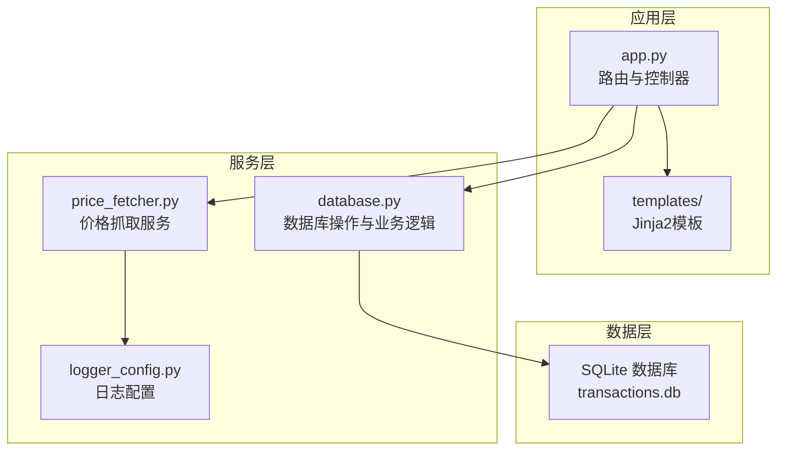
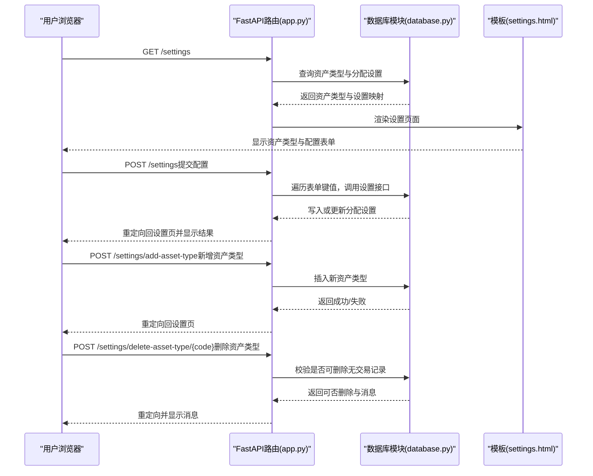
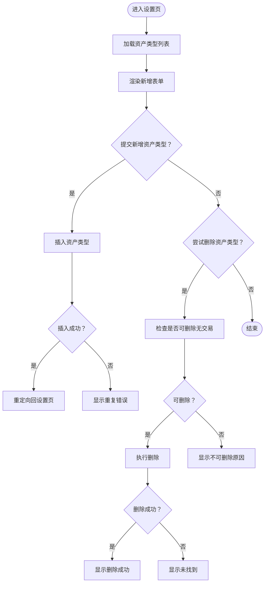
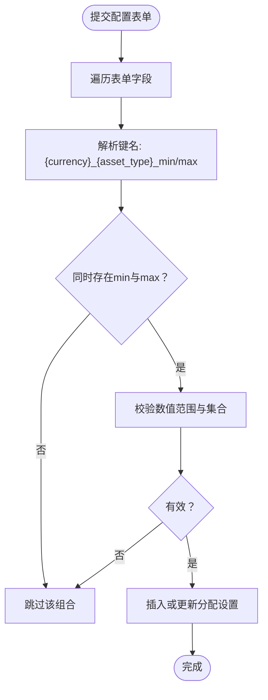
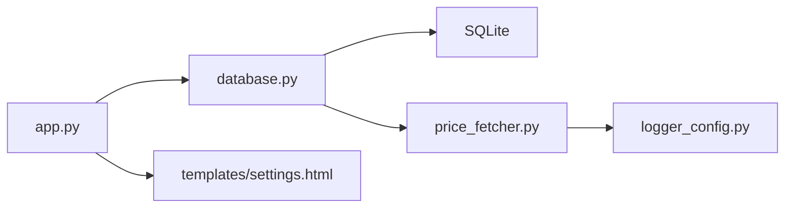

# 系统设置功能

<cite>
**本文引用的文件**
- [app.py](file://app.py)
- [database.py](file://database.py)
- [templates/settings.html](file://templates/settings.html)
- [templates/base.html](file://templates/base.html)
- [price_fetcher.py](file://price_fetcher.py)
- [logger_config.py](file://logger_config.py)
- [requirements.txt](file://requirements.txt)
</cite>

## 目录
1. [简介](#简介)
2. [项目结构](#项目结构)
3. [核心组件](#核心组件)
4. [架构总览](#架构总览)
5. [详细组件分析](#详细组件分析)
6. [依赖关系分析](#依赖关系分析)
7. [性能考量](#性能考量)
8. [故障排查指南](#故障排查指南)
9. [结论](#结论)
10. [附录](#附录)

## 简介
本文件面向“投资日志系统”的“系统设置”功能，围绕以下目标进行深入说明：
- 资产类型管理：新增、查询、删除与验证规则
- 配置比例设置：按货币与资产类型维度的范围管理
- 账户管理与用户偏好：账户信息维护与界面导航
- 设置数据持久化与验证机制：数据库表结构、约束与业务校验
- 系统设置相关的API接口文档与使用示例
- 设置迁移与备份恢复的开发指南

## 项目结构
系统采用前后端分离的Web应用模式，后端基于FastAPI，前端使用Jinja2模板渲染，数据存储采用SQLite。设置功能主要分布在应用路由、数据库模块与模板页面中。

图表来源
- [app.py](file://app.py#L1-L456)
- [database.py](file://database.py#L1-L944)
- [templates/settings.html](file://templates/settings.html#L1-L111)
- [price_fetcher.py](file://price_fetcher.py#L1-L398)
- [logger_config.py](file://logger_config.py#L1-L54)

章节来源
- [app.py](file://app.py#L1-L456)
- [database.py](file://database.py#L1-L944)
- [templates/settings.html](file://templates/settings.html#L1-L111)
- [templates/base.html](file://templates/base.html#L1-L27)

## 核心组件
- 应用路由与控制器（app.py）
  - 提供设置页GET与POST处理、资产类型管理的增删、配置比例提交等
- 数据库模块（database.py）
  - 定义与初始化数据库表（含资产类型、分配设置、账户、操作日志、最新价格）
  - 实现资产类型管理、分配设置读写、持有情况统计与告警
- 模板页面（templates/settings.html）
  - 展示资产类型列表、新增表单、按货币与资产类型分组的配置表单
- 价格抓取服务（price_fetcher.py）
  - 支持多数据源的价格获取，用于资产价值调整与价格更新
- 日志配置（logger_config.py）
  - 统一日志输出，便于追踪设置变更与错误

章节来源
- [app.py](file://app.py#L294-L382)
- [database.py](file://database.py#L605-L726)
- [templates/settings.html](file://templates/settings.html#L15-L110)
- [price_fetcher.py](file://price_fetcher.py#L321-L394)
- [logger_config.py](file://logger_config.py#L14-L53)

## 架构总览
设置功能在系统中的交互流程如下：

图表来源
- [app.py](file://app.py#L294-L382)
- [database.py](file://database.py#L831-L901)
- [templates/settings.html](file://templates/settings.html#L15-L110)

## 详细组件分析

### 资产类型管理
- 功能概述
  - 新增资产类型：通过表单提交代码与标签，写入资产类型表
  - 删除资产类型：检查是否存在交易记录，若无则允许删除
  - 列表展示：在设置页以表格形式列出资产类型，并标注是否可删除及原因
- 数据模型与约束
  - 表结构：资产类型表包含唯一代码与标签
  - 默认资产类型：启动时初始化默认资产类型集合
- 验证规则
  - 新增时：代码需满足正则格式要求；插入冲突返回失败
  - 删除时：若存在交易记录则禁止删除，并返回具体原因
- 控制流图

图表来源
- [app.py](file://app.py#L360-L382)
- [database.py](file://database.py#L847-L901)

章节来源
- [app.py](file://app.py#L360-L382)
- [database.py](file://database.py#L831-L901)
- [templates/settings.html](file://templates/settings.html#L15-L63)

### 配置比例设置（按货币与资产类型）
- 功能概述
  - 在设置页按货币分组展示每种资产类型的最小/最大百分比配置
  - 提交后遍历表单字段，调用设置接口保存
- 数据模型与约束
  - 分配设置表：唯一键为货币+资产类型，确保每组合仅有一条记录
  - 默认范围：最小0%，最大100%
- 验证规则
  - 货币与资产类型必须在预定义集合内
  - 最小值不得小于0，最大值不得大于100，且最小值不得大于最大值
  - 使用数据库ON CONFLICT策略进行更新或插入
- 计算与告警
  - 持仓按货币与资产类型汇总，计算占比并与设置范围对比，生成告警信息

图表来源
- [app.py](file://app.py#L334-L357)
- [database.py](file://database.py#L615-L656)
- [database.py](file://database.py#L673-L726)

章节来源
- [app.py](file://app.py#L294-L357)
- [database.py](file://database.py#L605-L726)
- [templates/settings.html](file://templates/settings.html#L65-L110)

### 账户管理与用户偏好
- 账户管理
  - 提供账户列表与新增账户接口，用于交易与持有统计的归属
- 用户偏好
  - 导航栏在基础模板中定义，设置页位于导航末尾，便于快速访问

章节来源
- [database.py](file://database.py#L568-L598)
- [templates/base.html](file://templates/base.html#L11-L20)

### 设置数据的持久化与验证机制
- 持久化
  - SQLite数据库：事务表、账户表、符号表、分配设置表、资产类型表、操作日志表、最新价格表
  - 初始化：启动时创建表与索引，必要时添加列，初始化默认资产类型
- 验证机制
  - 数据库级约束：CHECK与UNIQUE保证货币与资产类型集合、唯一性
  - 业务级校验：设置范围校验、资产类型新增/删除校验
  - 日志记录：所有关键操作均有日志输出，便于审计与排错

章节来源
- [database.py](file://database.py#L20-L149)
- [database.py](file://database.py#L630-L656)
- [database.py](file://database.py#L868-L900)
- [logger_config.py](file://logger_config.py#L14-L53)

### 系统设置相关的API接口文档
- 页面接口
  - GET /settings：返回设置页，包含资产类型列表与配置映射
  - POST /settings：提交配置表单，批量保存各货币与资产类型的最小/最大百分比
  - POST /settings/add-asset-type：新增资产类型
  - POST /settings/delete-asset-type/{code}：删除资产类型（带校验）
- 数据接口
  - GET /api/holdings：获取当前持有情况
  - GET /api/holdings-by-currency：获取按货币与资产类型汇总的持有情况与告警
  - GET /api/transactions：获取交易列表（支持过滤）
  - GET /api/portfolio-history：获取投资组合历史累计值
  - DELETE /api/transactions/{transaction_id}：删除指定交易
- 使用示例
  - 获取设置页：浏览器访问 /settings
  - 提交配置：填写最小/最大百分比后点击“保存”，系统将批量保存
  - 新增资产类型：在“新增资产类型”表单中输入代码与标签并提交
  - 删除资产类型：点击对应删除按钮，若提示不可删除则先清理相关交易

章节来源
- [app.py](file://app.py#L294-L382)
- [app.py](file://app.py#L388-L451)

## 依赖关系分析
- 组件耦合
  - app.py依赖database.py提供的数据访问函数
  - database.py依赖sqlite3标准库与外部库（如akshare/yfinance），但通过条件导入降低耦合
  - 模板依赖app.py传入的数据上下文
- 外部依赖
  - FastAPI、Uvicorn、Jinja2、python-multipart、akshare、yfinance

图表来源
- [app.py](file://app.py#L1-L17)
- [database.py](file://database.py#L1-L11)
- [price_fetcher.py](file://price_fetcher.py#L1-L21)
- [logger_config.py](file://logger_config.py#L1-L54)

章节来源
- [requirements.txt](file://requirements.txt#L1-L6)
- [app.py](file://app.py#L1-L17)
- [database.py](file://database.py#L1-L11)
- [price_fetcher.py](file://price_fetcher.py#L1-L21)
- [logger_config.py](file://logger_config.py#L1-L54)

## 性能考量
- 数据库索引
  - 对常用查询字段建立索引，提升交易查询与汇总性能
- 查询优化
  - 汇总计算在内存中完成，避免复杂SQL聚合
- 并发与一致性
  - 使用SQLite事务保证设置更新的原子性
- 日志与监控
  - 统一日志输出，便于定位性能瓶颈与异常

[本节为通用建议，无需特定文件来源]

## 故障排查指南
- 设置保存无效
  - 检查表单字段命名是否符合“{currency}_{asset_type}_min/max”
  - 确认数值范围与集合约束是否满足
- 资产类型删除失败
  - 查看是否存在交易记录导致不可删除
  - 清理相关交易后再试
- 价格更新失败
  - 检查网络与第三方数据源可用性
  - 查看日志中错误摘要
- 日志查看
  - 日志文件位于logs目录，按日期轮转保留7天

章节来源
- [app.py](file://app.py#L334-L357)
- [database.py](file://database.py#L868-L900)
- [price_fetcher.py](file://price_fetcher.py#L375-L394)
- [logger_config.py](file://logger_config.py#L14-L53)

## 结论
系统设置功能通过清晰的表单与严格的校验，实现了资产类型与配置比例的灵活管理，并与持有汇总与告警机制紧密集成。数据库层的约束与业务层的校验共同保障了数据一致性与用户体验。建议在后续版本中增加设置导出/导入能力与更丰富的告警可视化。

[本节为总结性内容，无需特定文件来源]

## 附录

### 开发指南：设置迁移与备份恢复
- 备份
  - 直接复制SQLite数据库文件transactions.db即可完成备份
- 迁移
  - 新增列：若需要扩展设置项，可在初始化函数中添加ALTER语句并兼容旧版本
  - 数据迁移：对于结构变更，编写一次性迁移脚本，读取旧数据并写入新结构
- 恢复
  - 停止服务后替换transactions.db为备份文件，重启服务
- 注意事项
  - 迁移前务必备份
  - 在生产环境执行迁移前先在测试环境验证

章节来源
- [database.py](file://database.py#L20-L149)