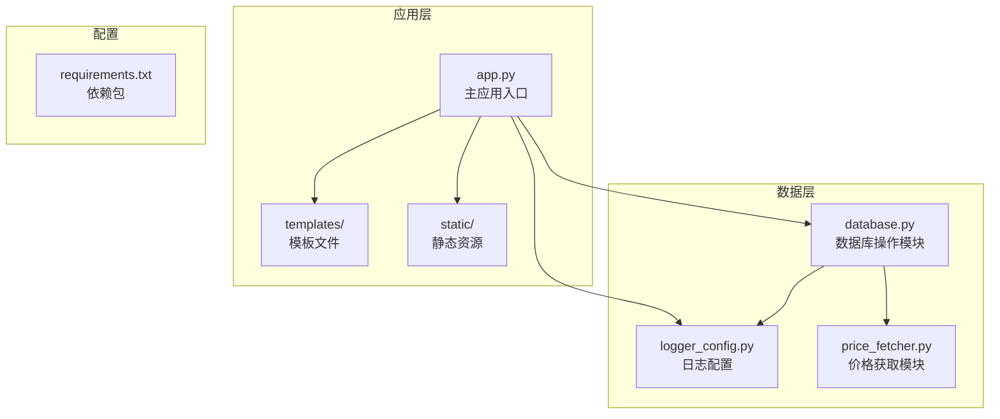
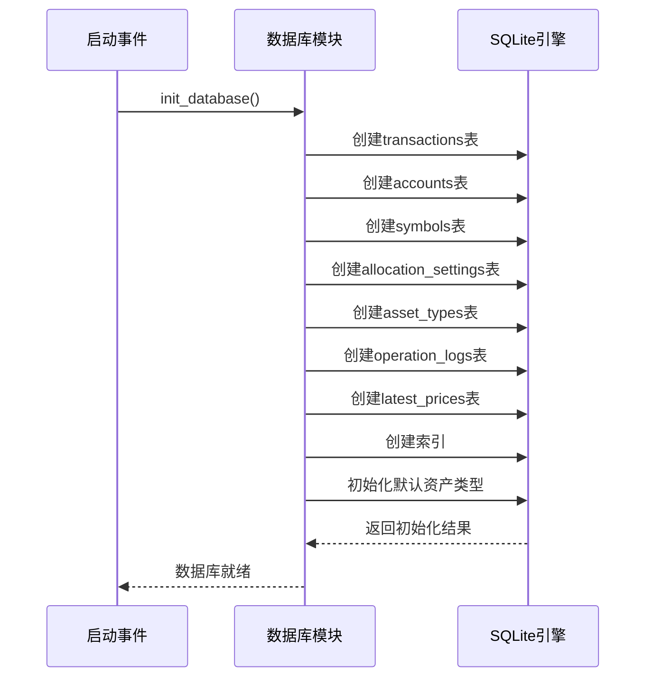
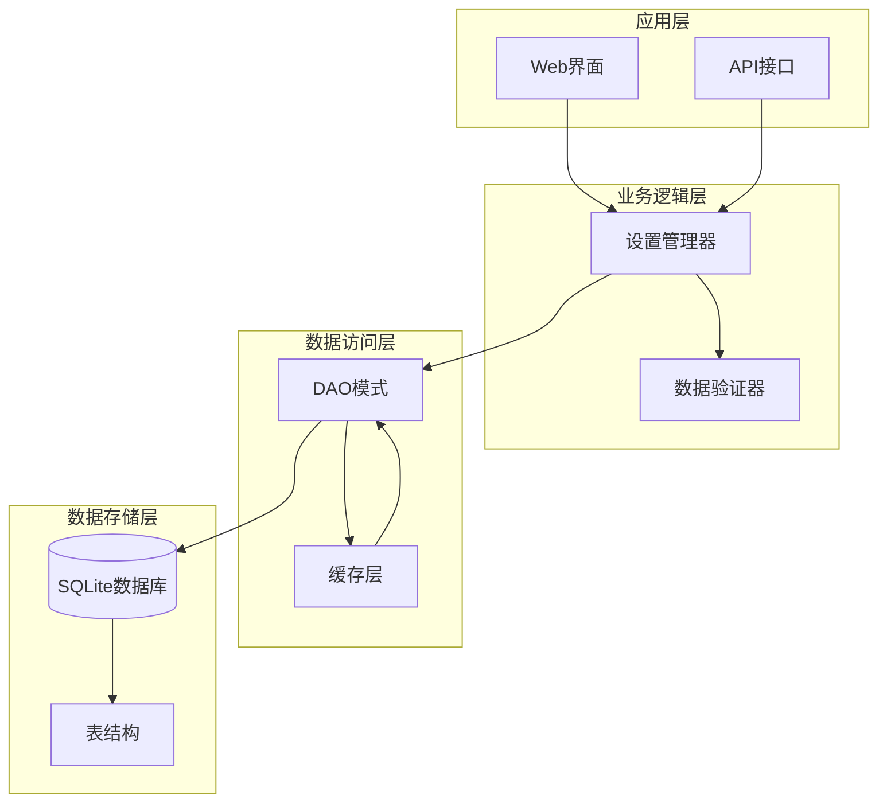
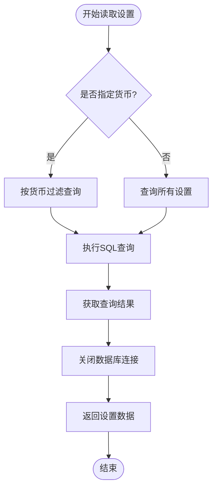
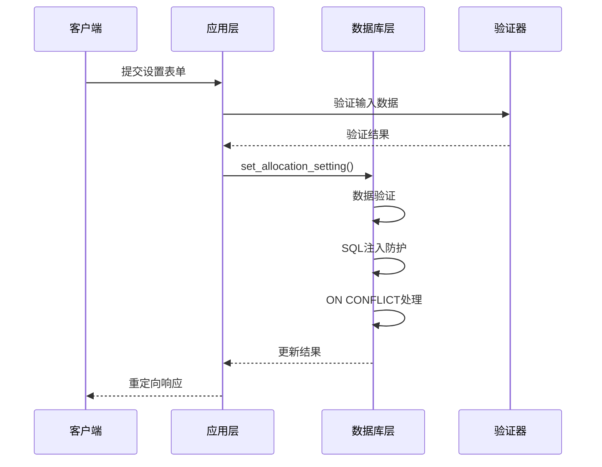
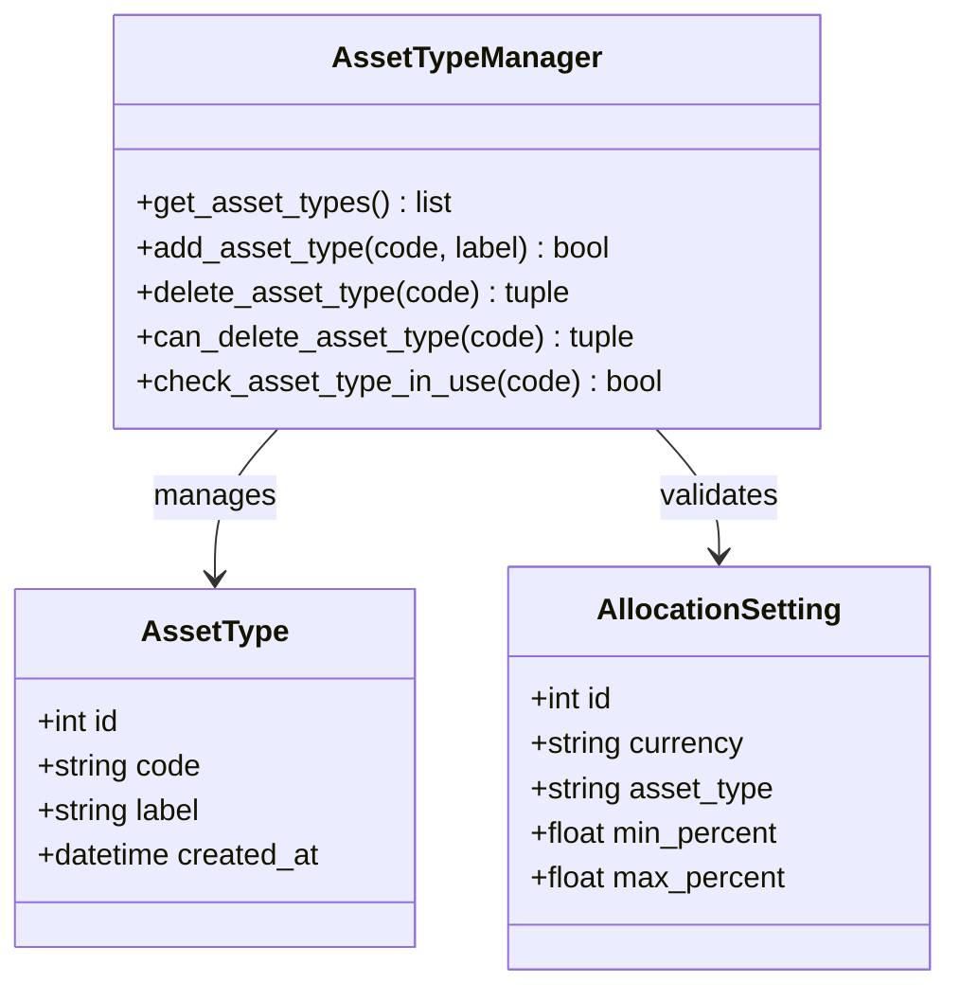
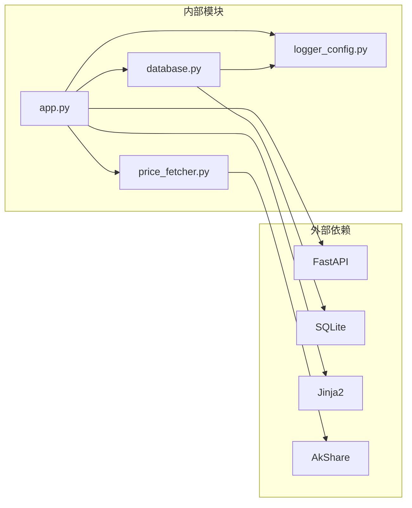
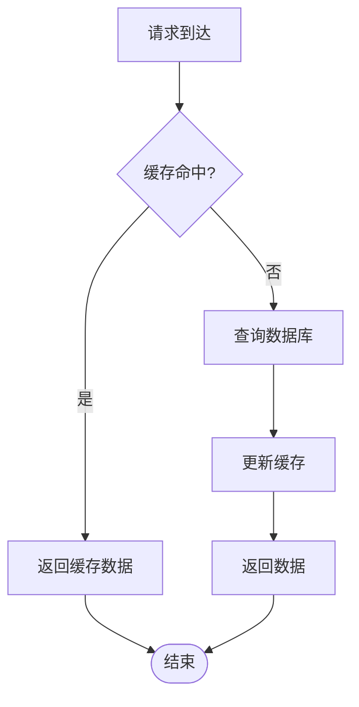
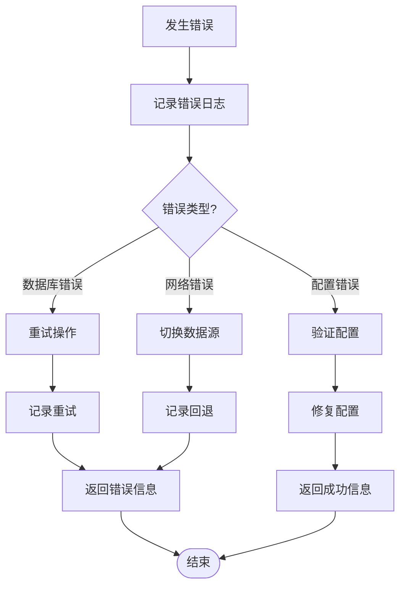

# 设置数据持久化

<cite>
**本文档引用的文件**
- [app.py](file://app.py)
- [database.py](file://database.py)
- [templates/settings.html](file://templates/settings.html)
- [logger_config.py](file://logger_config.py)
- [price_fetcher.py](file://price_fetcher.py)
- [requirements.txt](file://requirements.txt)
</cite>

## 目录
1. [简介](#简介)
2. [项目结构](#项目结构)
3. [核心组件](#核心组件)
4. [架构概览](#架构概览)
5. [详细组件分析](#详细组件分析)
6. [依赖关系分析](#依赖关系分析)
7. [性能考虑](#性能考虑)
8. [故障排除指南](#故障排除指南)
9. [结论](#结论)

## 简介

本文件专注于投资日志系统的设置数据持久化功能，深入分析设置数据在数据库中的存储结构、表设计、读取更新删除操作实现、缓存机制、性能优化策略、事务处理和一致性保证，以及迁移和备份恢复方案。投资日志系统使用SQLite作为后端数据库，通过FastAPI提供Web界面，支持资产配置管理、分配设置等功能。

## 项目结构

投资日志系统采用模块化设计，主要文件组织如下：

**图表来源**
- [app.py](file://app.py#L1-L50)
- [database.py](file://database.py#L1-L50)

**章节来源**
- [app.py](file://app.py#L1-L50)
- [database.py](file://database.py#L1-L50)
- [requirements.txt](file://requirements.txt#L1-L6)

## 核心组件

### 数据库初始化与连接

系统在启动时自动初始化数据库，建立必要的表结构和索引：

**图表来源**
- [database.py](file://database.py#L20-L149)

### 设置数据表结构

系统使用专门的`allocation_settings`表存储配置数据：

| 字段名 | 数据类型 | 约束条件 | 描述 |
|--------|----------|----------|------|
| id | INTEGER | PRIMARY KEY AUTOINCREMENT | 主键标识符 |
| currency | TEXT | CHECK(currency IN ('CNY','USD','HKD')) | 货币代码 |
| asset_type | TEXT | NOT NULL | 资产类型代码 |
| min_percent | REAL | DEFAULT 0 | 最小配置百分比 |
| max_percent | REAL | DEFAULT 100 | 最大配置百分比 |

**章节来源**
- [database.py](file://database.py#L76-L86)

## 架构概览

设置数据持久化采用分层架构设计，确保数据访问的一致性和可靠性：

**图表来源**
- [app.py](file://app.py#L294-L358)
- [database.py](file://database.py#L615-L671)

## 详细组件分析

### 设置数据读取操作

设置数据的读取通过`get_allocation_settings`函数实现，支持按货币过滤：

**图表来源**
- [database.py](file://database.py#L615-L627)

**章节来源**
- [database.py](file://database.py#L615-L627)
- [app.py](file://app.py#L294-L331)

### 设置数据更新操作

设置数据的更新通过`set_allocation_setting`函数实现，包含完整的数据验证：

**图表来源**
- [app.py](file://app.py#L334-L357)
- [database.py](file://database.py#L630-L656)

**章节来源**
- [app.py](file://app.py#L334-L357)
- [database.py](file://database.py#L630-L656)

### 设置数据删除操作

设置数据的删除通过`delete_allocation_setting`函数实现：

**章节来源**
- [database.py](file://database.py#L659-L671)

### 资产类型管理

系统支持动态资产类型的增删改查操作：

**图表来源**
- [database.py](file://database.py#L831-L901)
- [database.py](file://database.py#L615-L671)

**章节来源**
- [database.py](file://database.py#L831-L901)

### Web界面集成

设置页面通过Jinja2模板渲染，支持动态表单生成：

**章节来源**
- [templates/settings.html](file://templates/settings.html#L65-L109)

## 依赖关系分析

系统各组件之间的依赖关系如下：

**图表来源**
- [requirements.txt](file://requirements.txt#L1-L6)
- [app.py](file://app.py#L7-L17)

**章节来源**
- [requirements.txt](file://requirements.txt#L1-L6)
- [app.py](file://app.py#L7-L17)

## 性能考虑

### 数据库性能优化

1. **索引策略**：为常用查询字段建立索引，包括符号、日期、账户、类型、货币等
2. **连接池管理**：使用Row工厂提高查询效率
3. **批量操作**：支持批量插入和更新操作

### 缓存机制

系统采用多层缓存策略：

**章节来源**
- [database.py](file://database.py#L13-L17)
- [database.py](file://database.py#L140-L146)

### 并发控制

系统通过以下机制保证并发安全：
- SQLite的内置锁机制
- 事务隔离级别设置
- 连接池管理

## 故障排除指南

### 常见问题及解决方案

1. **数据库连接失败**
   - 检查数据库文件权限
   - 验证SQLite安装完整性
   - 确认数据库路径正确性

2. **设置数据验证失败**
   - 检查货币代码有效性
   - 验证百分比范围(0-100)
   - 确认资产类型存在

3. **Web界面显示异常**
   - 检查模板文件完整性
   - 验证Jinja2配置
   - 确认静态文件路径

### 错误处理最佳实践

**章节来源**
- [logger_config.py](file://logger_config.py#L14-L53)
- [price_fetcher.py](file://price_fetcher.py#L321-L394)

## 结论

投资日志系统的设置数据持久化功能具有以下特点：

1. **结构化设计**：采用清晰的表结构和约束条件，确保数据完整性
2. **安全性保障**：实现输入验证、SQL注入防护和事务处理
3. **性能优化**：通过索引、缓存和连接池提升查询效率
4. **可扩展性**：支持动态资产类型管理和灵活的配置选项
5. **可靠性**：完善的错误处理和日志记录机制

该系统为投资日志提供了稳定可靠的设置数据管理能力，支持用户自定义资产配置和监控需求。