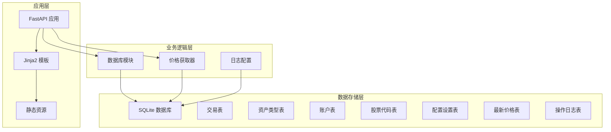
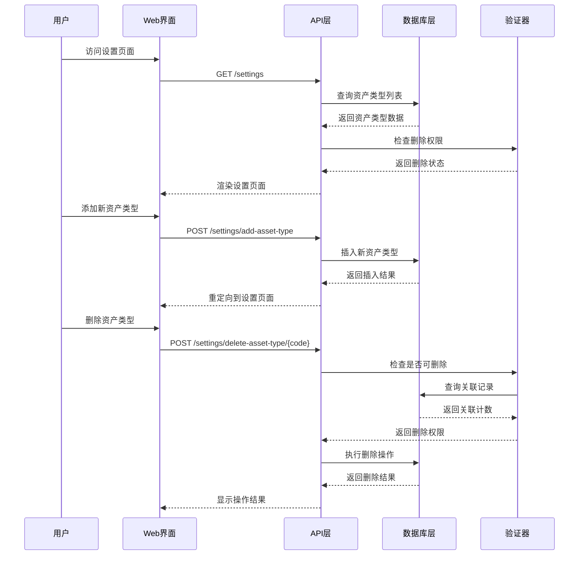
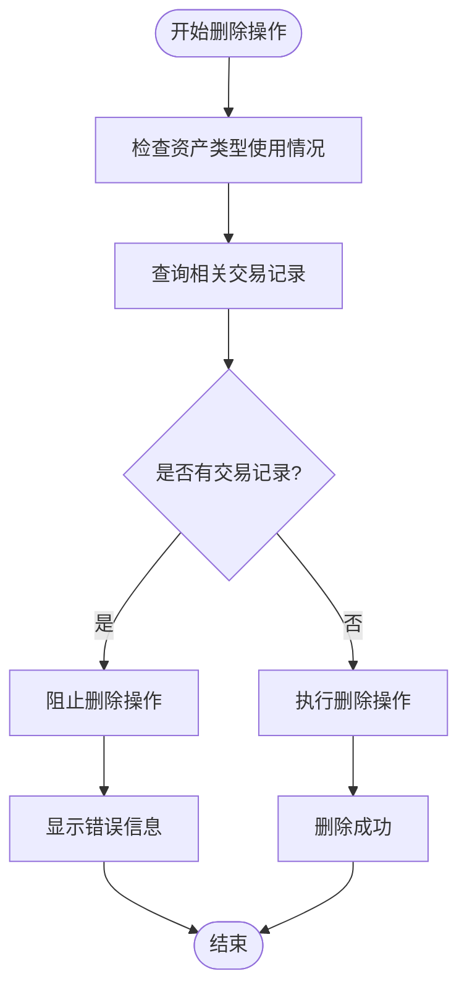
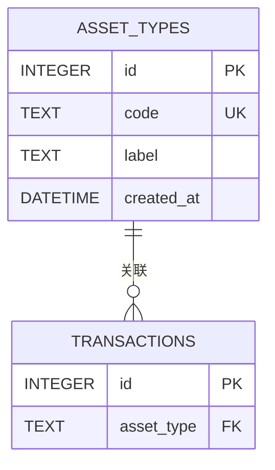
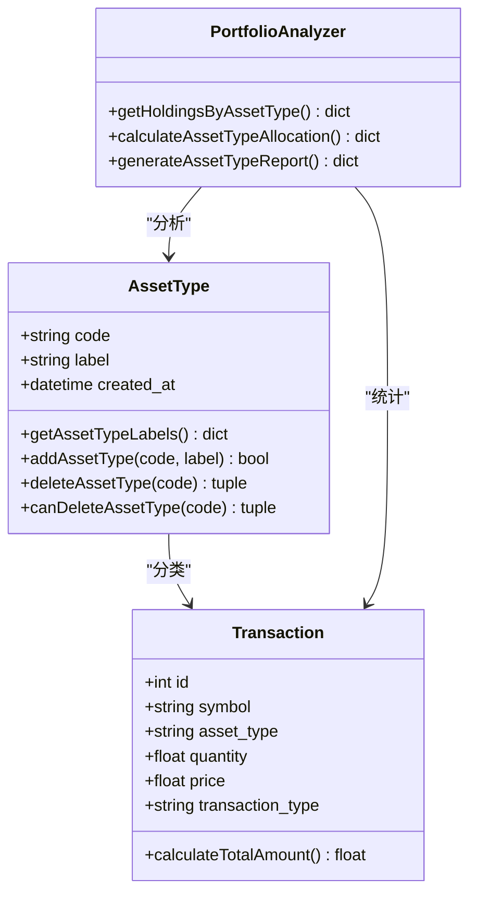
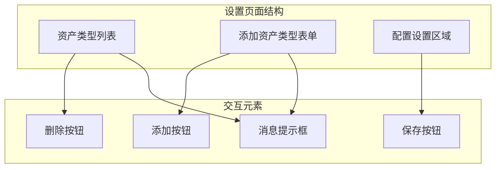
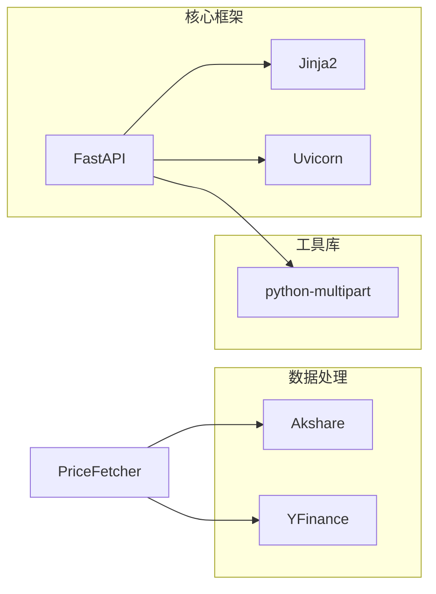
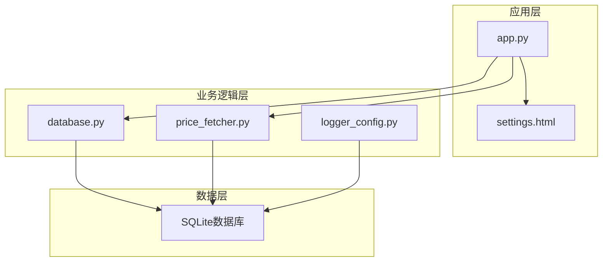

# 资产类型管理

<cite>
**本文档引用的文件**
- [app.py](file://app.py)
- [database.py](file://database.py)
- [price_fetcher.py](file://price_fetcher.py)
- [templates/settings.html](file://templates/settings.html)
- [templates/base.html](file://templates/base.html)
- [static/style.css](file://static/style.css)
- [logger_config.py](file://logger_config.py)
- [requirements.txt](file://requirements.txt)
</cite>

## 目录
1. [简介](#简介)
2. [项目结构](#项目结构)
3. [核心组件](#核心组件)
4. [架构概览](#架构概览)
5. [详细组件分析](#详细组件分析)
6. [依赖关系分析](#依赖关系分析)
7. [性能考虑](#性能考虑)
8. [故障排除指南](#故障排除指南)
9. [结论](#结论)
10. [附录](#附录)

## 简介

投资日志系统的资产类型管理功能是整个投资管理系统的核心基础设施之一。该功能允许用户定义、管理和维护不同类型的资产类别，如股票、债券、贵金属和现金等。资产类型不仅决定了交易记录的分类方式，还直接影响着投资组合的分析、报告生成和风险控制等功能。

本系统采用SQLite作为数据存储后端，通过FastAPI提供RESTful API接口，配合Jinja2模板引擎构建直观的Web界面。资产类型管理功能实现了完整的CRUD操作，包括资产类型的增删改查，以及安全的删除机制来防止误删正在使用的资产类型。

## 项目结构

投资日志系统采用简洁而清晰的分层架构设计：



**图表来源**
- [app.py](file://app.py#L1-L50)
- [database.py](file://database.py#L20-L150)

**章节来源**
- [app.py](file://app.py#L1-L50)
- [database.py](file://database.py#L1-L150)

## 核心组件

### 资产类型数据模型

资产类型系统基于以下核心数据结构：

| 字段名 | 类型 | 描述 | 约束 |
|--------|------|------|------|
| id | INTEGER | 主键标识 | 自增 |
| code | TEXT | 资产类型代码 | 唯一，非空 |
| label | TEXT | 资产类型标签 | 非空 |
| created_at | DATETIME | 创建时间 | 默认当前时间 |

### 默认资产类型

系统初始化时会自动创建以下默认资产类型：
- stock: 股票
- bond: 债券  
- metal: 贵金属
- cash: 现金

这些默认类型满足了大多数投资场景的需求，同时保持了系统的灵活性。

**章节来源**
- [database.py](file://database.py#L88-L112)
- [database.py](file://database.py#L605-L612)

## 架构概览

资产类型管理功能在整个系统架构中扮演着关键角色，连接着多个核心模块：



**图表来源**
- [app.py](file://app.py#L294-L390)
- [database.py](file://database.py#L828-L901)

**章节来源**
- [app.py](file://app.py#L294-L390)
- [database.py](file://database.py#L828-L901)

## 详细组件分析

### 资产类型管理API接口

#### 获取资产类型列表
- **端点**: `GET /settings`
- **功能**: 返回所有资产类型及其删除状态信息
- **响应**: 包含资产类型列表、删除权限检查结果

#### 添加资产类型
- **端点**: `POST /settings/add-asset-type`
- **参数**: 
  - code: 资产类型代码（唯一标识符）
  - label: 资产类型标签（显示名称）
- **返回**: 成功或失败的状态信息

#### 删除资产类型
- **端点**: `POST /settings/delete-asset-type/{code}`
- **参数**: code: 资产类型代码
- **安全检查**: 删除前检查是否存在关联的交易记录

#### 资产类型删除安全检查机制

系统实现了严格的资产类型删除安全检查机制，确保不会误删正在使用的资产类型：



**图表来源**
- [database.py](file://database.py#L868-L883)
- [app.py](file://app.py#L375-L390)

**章节来源**
- [app.py](file://app.py#L361-L390)
- [database.py](file://database.py#L868-L901)

### 资产类型数据存储结构

#### 数据库表结构

资产类型信息存储在独立的`asset_types`表中：



**图表来源**
- [database.py](file://database.py#L88-L97)
- [database.py](file://database.py#L25-L46)

#### 数据验证规则

系统实施了多层次的数据验证机制：

1. **数据库约束**:
   - `code`字段唯一性约束
   - `code`字段非空约束
   - `label`字段非空约束

2. **业务逻辑验证**:
   - 删除前检查关联记录
   - 资产类型代码格式验证（字母和下划线）

3. **前端验证**:
   - 表单输入验证
   - 实时反馈机制

**章节来源**
- [database.py](file://database.py#L88-L97)
- [database.py](file://database.py#L868-L883)
- [templates/settings.html](file://templates/settings.html#L54-L58)

### 资产类型在系统中的作用

#### 与交易记录的关系

资产类型是交易记录的重要分类维度，影响着交易记录的查询、统计和分析：



**图表来源**
- [database.py](file://database.py#L831-L901)
- [database.py](file://database.py#L312-L358)
- [database.py](file://database.py#L673-L726)

#### 与其他模块的集成

资产类型管理功能与以下模块紧密集成：

1. **交易管理模块**: 为每笔交易指定资产类型
2. **投资组合分析模块**: 按资产类型进行分组统计
3. **配置管理模块**: 支持按资产类型设置目标配置范围
4. **报表生成模块**: 提供资产类型维度的报表输出

**章节来源**
- [app.py](file://app.py#L69-L80)
- [app.py](file://app.py#L124-L141)
- [app.py](file://app.py#L294-L331)

### 资产类型管理界面

#### 设置页面布局

资产类型管理界面采用响应式设计，支持多种设备访问：



**图表来源**
- [templates/settings.html](file://templates/settings.html#L15-L63)
- [templates/settings.html](file://templates/settings.html#L65-L109)

**章节来源**
- [templates/settings.html](file://templates/settings.html#L1-L111)
- [static/style.css](file://static/style.css#L377-L418)

## 依赖关系分析

### 外部依赖

系统依赖以下主要外部库：



**图表来源**
- [requirements.txt](file://requirements.txt#L1-L6)

### 内部模块依赖



**图表来源**
- [app.py](file://app.py#L1-L20)
- [database.py](file://database.py#L1-L20)

**章节来源**
- [requirements.txt](file://requirements.txt#L1-L6)
- [app.py](file://app.py#L1-L20)
- [database.py](file://database.py#L1-L20)

## 性能考虑

### 数据库优化策略

1. **索引优化**: 在`asset_types`表上建立了唯一索引，确保查询效率
2. **查询优化**: 使用参数化查询防止SQL注入攻击
3. **连接管理**: 实现了连接池管理，避免频繁建立数据库连接

### 缓存机制

系统实现了多级缓存策略：
- **内存缓存**: 资产类型标签映射缓存
- **数据库缓存**: 最新价格缓存
- **页面缓存**: 频繁访问的页面内容缓存

### 并发处理

系统采用以下并发处理策略：
- **事务隔离**: 使用SQLite的ACID特性保证数据一致性
- **锁机制**: 在高并发场景下自动处理锁竞争
- **重试机制**: 对于临时性错误提供自动重试

## 故障排除指南

### 常见问题及解决方案

#### 资产类型删除失败

**问题症状**: 尝试删除资产类型时提示"该资产类别下有开仓资产，不允许删除"

**原因分析**:
1. 资产类型仍有未平仓的交易记录
2. 资产类型被其他模块引用
3. 数据库约束冲突

**解决步骤**:
1. 检查相关交易记录：`SELECT COUNT(*) FROM transactions WHERE asset_type = ?`
2. 平仓所有相关头寸
3. 重新尝试删除操作

#### 资产类型重复添加

**问题症状**: 添加资产类型时提示"添加失败，代码可能已存在"

**解决方法**:
1. 检查现有资产类型：`SELECT * FROM asset_types WHERE code = ?`
2. 使用不同的资产类型代码
3. 确保代码的唯一性

#### 页面加载缓慢

**性能优化建议**:
1. 检查数据库索引是否完整
2. 优化查询语句
3. 启用数据库连接池
4. 实施适当的缓存策略

**章节来源**
- [app.py](file://app.py#L375-L390)
- [database.py](file://database.py#L868-L901)

## 结论

投资日志系统的资产类型管理功能通过精心设计的架构和严格的验证机制，为用户提供了一个强大而灵活的资产管理平台。该功能不仅满足了基本的资产类型管理需求，还通过完善的删除安全检查机制确保了数据的完整性和安全性。

系统的主要优势包括：
- **模块化设计**: 清晰的分层架构便于维护和扩展
- **安全性保障**: 多层次的安全检查防止误操作
- **用户体验**: 直观的Web界面和实时反馈机制
- **性能优化**: 合理的数据库设计和缓存策略

未来可以考虑的功能扩展包括：
- 支持资产类型的层级结构
- 增加资产类型的历史变更追踪
- 实现资产类型的导入导出功能
- 提供更丰富的资产类型分析报表

## 附录

### 开发指南

#### 新增资产类型扩展

要为系统添加新的资产类型，需要完成以下步骤：

1. **数据库层面**:
   ```sql
   INSERT INTO asset_types (code, label) VALUES ('new_type', '新类型');
   ```

2. **应用层面**:
   - 更新默认资产类型列表
   - 添加相应的标签映射
   - 更新相关的业务逻辑

3. **界面层面**:
   - 更新设置页面的显示逻辑
   - 添加必要的表单验证规则

#### 自定义开发最佳实践

1. **遵循现有模式**: 参考现有的资产类型实现模式
2. **保持向后兼容**: 确保新增功能不影响现有功能
3. **完善测试**: 为新功能编写充分的单元测试
4. **文档更新**: 及时更新相关技术文档

#### API使用示例

以下是一些常见的API使用示例：

1. **获取所有资产类型**:
   ```
   GET /settings
   ```

2. **添加新资产类型**:
   ```
   POST /settings/add-asset-type
   Content-Type: application/x-www-form-urlencoded
   
   code=etf&label=ETF
   ```

3. **删除资产类型**:
   ```
   POST /settings/delete-asset-type/etf
   ```

**章节来源**
- [database.py](file://database.py#L831-L866)
- [app.py](file://app.py#L361-L390)