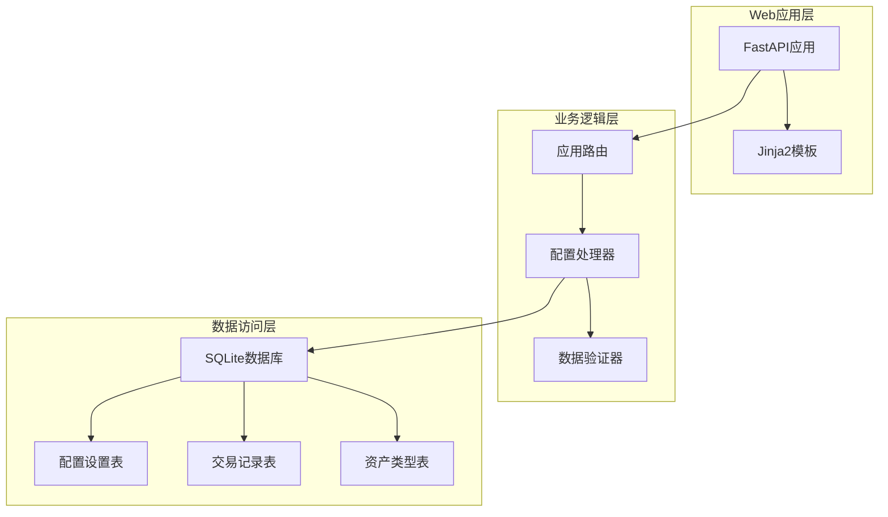
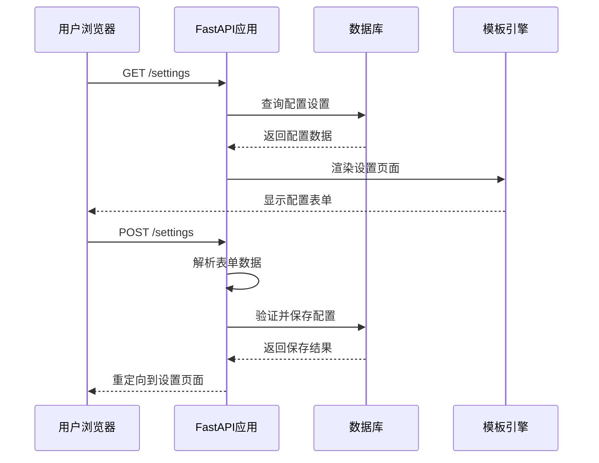
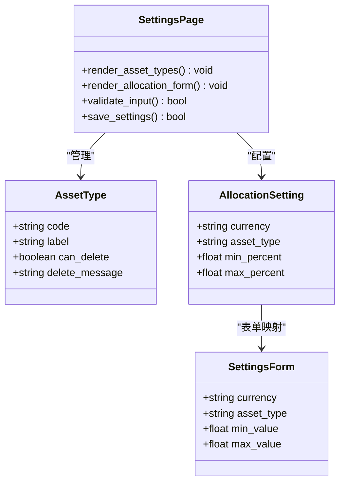
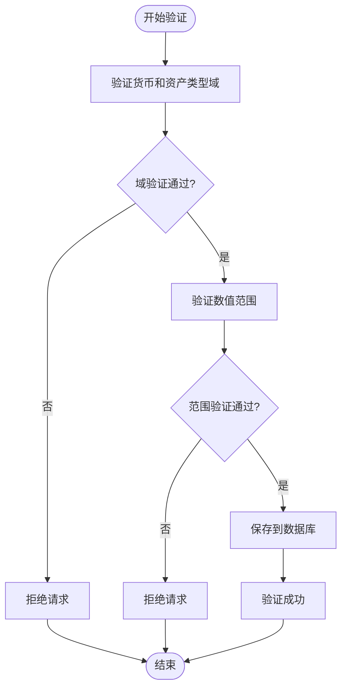
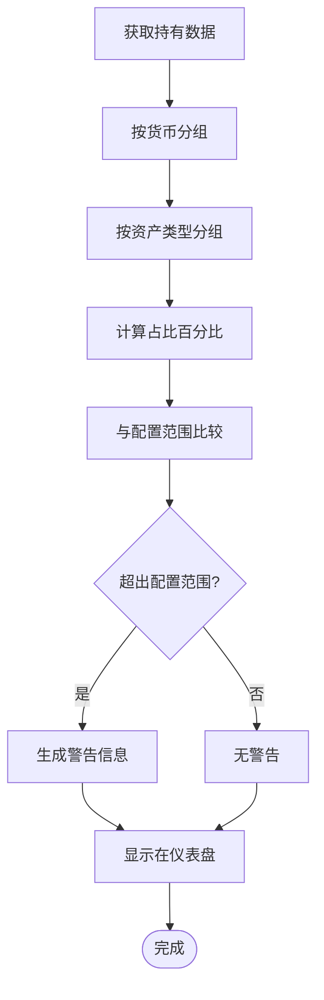
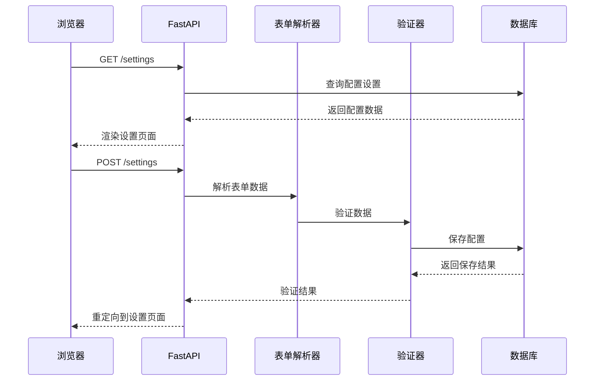
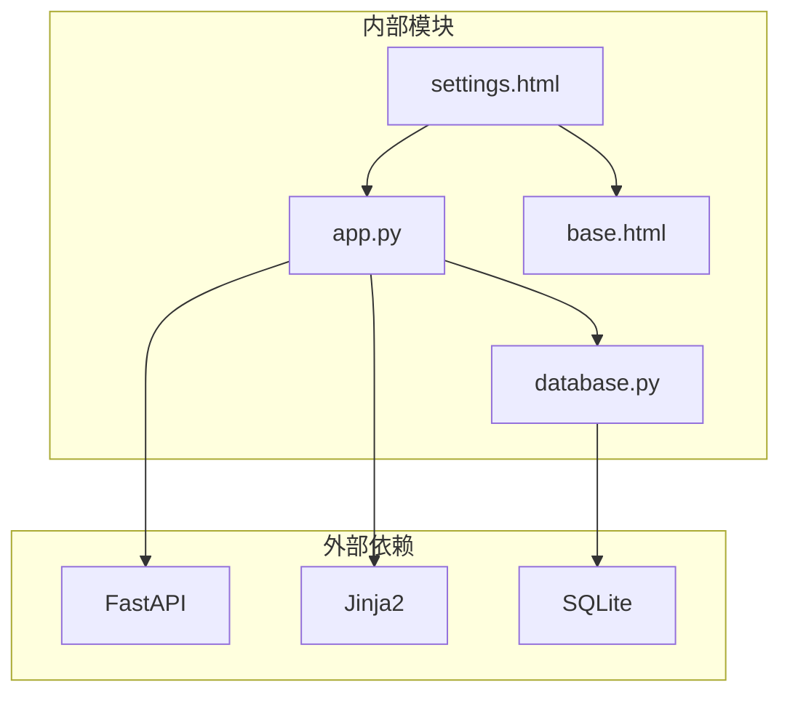

# 配置比例设置

<cite>
**本文档引用的文件**
- [app.py](file://app.py)
- [database.py](file://database.py)
- [templates/settings.html](file://templates/settings.html)
- [templates/base.html](file://templates/base.html)
- [templates/index.html](file://templates/index.html)
- [requirements.txt](file://requirements.txt)
</cite>

## 目录
1. [简介](#简介)
2. [项目结构](#项目结构)
3. [核心组件](#核心组件)
4. [架构概览](#架构概览)
5. [详细组件分析](#详细组件分析)
6. [依赖关系分析](#依赖关系分析)
7. [性能考虑](#性能考虑)
8. [故障排除指南](#故障排除指南)
9. [结论](#结论)
10. [附录](#附录)

## 简介
本文件详细说明投资日志系统的配置比例设置功能，包括资产配置比例的管理机制、按货币和资产类型的配置范围设置、最小值和最大值配置的数据验证和约束规则、配置比例在投资组合分析中的作用和影响、配置设置的持久化存储和读取机制，以及配置比例设置的表单处理逻辑和数据流转过程。同时提供配置比例调整和优化的实践指南。

## 项目结构
投资日志系统采用模块化设计，主要由以下部分组成：
- Web应用层：基于FastAPI构建，提供REST接口和Jinja2模板渲染
- 数据库层：SQLite数据库，包含交易记录、账户信息、资产类型、最新价格等表
- 模板层：Jinja2模板用于前端页面渲染
- 配置层：专门的配置比例设置功能



**图表来源**
- [app.py](file://app.py#L19-L463)
- [database.py](file://database.py#L20-L149)

**章节来源**
- [app.py](file://app.py#L1-L463)
- [database.py](file://database.py#L1-L150)
- [requirements.txt](file://requirements.txt#L1-L6)

## 核心组件
配置比例设置功能的核心组件包括：

### 数据模型
系统支持三种货币（CNY、USD、HKD）和四种资产类型（stock、bond、metal、cash），通过allocation_settings表实现配置比例的持久化存储。

### 验证规则
- 货币验证：必须在预定义的货币列表中
- 资产类型验证：必须在预定义的资产类型列表中  
- 数值范围验证：最小值≥0，最大值≤100，且最小值≤最大值
- 唯一性约束：同一货币和资产类型的组合唯一

### 处理流程
1. 用户通过设置页面输入配置比例
2. 表单提交到后端进行验证
3. 验证通过后写入数据库
4. 在投资组合分析中应用配置比例进行警告检查

**章节来源**
- [database.py](file://database.py#L605-L656)
- [database.py](file://database.py#L673-L726)

## 架构概览
配置比例设置功能的完整架构如下：



**图表来源**
- [app.py](file://app.py#L294-L357)
- [database.py](file://database.py#L615-L656)

## 详细组件分析

### 设置页面组件
设置页面包含两个主要部分：资产类型管理和配置比例设置。

#### 资产类型管理
- 显示现有资产类型列表
- 支持添加新的资产类型
- 提供删除功能，但会检查是否被使用

#### 配置比例设置表单
- 按货币分组显示配置表单
- 每个货币包含四种资产类型的配置项
- 输入字段具有数值范围限制（0-100）



**图表来源**
- [templates/settings.html](file://templates/settings.html#L15-L109)
- [app.py](file://app.py#L294-L357)

**章节来源**
- [templates/settings.html](file://templates/settings.html#L1-L111)
- [app.py](file://app.py#L294-L357)

### 数据验证组件
配置比例设置的数据验证包含多层保护机制：

#### 后端验证规则
1. **域验证**：检查货币和资产类型是否在允许列表中
2. **数值验证**：确保最小值≥0，最大值≤100，且最小值≤最大值
3. **冲突处理**：使用ON CONFLICT处理重复配置

#### 前端验证规则
- HTML5数字输入控件的min、max、step属性
- 占位符提供默认值建议



**图表来源**
- [database.py](file://database.py#L630-L656)

**章节来源**
- [database.py](file://database.py#L630-L656)
- [templates/settings.html](file://templates/settings.html#L87-L98)

### 投资组合分析集成
配置比例设置在投资组合分析中发挥关键作用：

#### 分析流程
1. 计算每个货币下的资产配置总金额
2. 计算各资产类型的占比百分比
3. 与配置范围进行比较
4. 生成警告信息

#### 警告机制
- 当占比低于最小值时显示"低于最小配置"警告
- 当占比高于最大值时显示"超过最大配置"警告
- 在仪表盘中可视化显示配置范围



**图表来源**
- [database.py](file://database.py#L673-L726)
- [templates/index.html](file://templates/index.html#L24-L43)

**章节来源**
- [database.py](file://database.py#L673-L726)
- [templates/index.html](file://templates/index.html#L1-L90)

### 持久化存储机制
配置比例设置采用SQLite数据库进行持久化存储：

#### 数据表结构
```sql
CREATE TABLE allocation_settings (
    id INTEGER PRIMARY KEY AUTOINCREMENT,
    currency TEXT NOT NULL CHECK(currency IN ('CNY', 'USD', 'HKD')),
    asset_type TEXT NOT NULL,
    min_percent REAL DEFAULT 0,
    max_percent REAL DEFAULT 100,
    UNIQUE(currency, asset_type)
);
```

#### 存储策略
- 使用UNIQUE约束确保每种货币-资产类型的配置唯一性
- 使用ON CONFLICT子句实现更新而非插入
- 默认值设置确保配置完整性

**章节来源**
- [database.py](file://database.py#L76-L86)
- [database.py](file://database.py#L646-L652)

### 表单处理逻辑
配置比例设置的表单处理遵循标准的MVC模式：

#### 请求处理流程
1. **GET请求**：渲染设置页面，加载现有配置
2. **POST请求**：解析表单数据，执行验证，保存配置
3. **重定向**：成功后返回设置页面并显示成功消息

#### 数据流转


**图表来源**
- [app.py](file://app.py#L294-L357)
- [app.py](file://app.py#L334-L357)

**章节来源**
- [app.py](file://app.py#L294-L357)

## 依赖关系分析



**图表来源**
- [requirements.txt](file://requirements.txt#L1-L6)
- [app.py](file://app.py#L7-L17)
- [database.py](file://database.py#L7-L11)

**章节来源**
- [requirements.txt](file://requirements.txt#L1-L6)
- [app.py](file://app.py#L7-L17)
- [database.py](file://database.py#L7-L11)

## 性能考虑
配置比例设置功能的性能特点：

### 数据库查询优化
- 使用索引优化常见查询模式
- 批量操作减少数据库往返次数
- 连接池管理提高并发性能

### 缓存策略
- 配置数据在内存中缓存
- 最新价格数据单独缓存
- 减少重复的数据库查询

### 前端性能
- 使用AJAX异步更新配置
- 避免不必要的页面刷新
- 合理的错误处理和用户反馈

## 故障排除指南

### 常见问题及解决方案

#### 配置无法保存
**症状**：提交配置后没有变化或出现错误
**可能原因**：
- 数值超出允许范围（0-100）
- 货币或资产类型不在允许列表中
- 数据库连接问题

**解决步骤**：
1. 检查输入数值是否在0-100范围内
2. 确认货币和资产类型选择正确
3. 查看应用日志获取详细错误信息

#### 配置不生效
**症状**：设置的配置在分析中不显示
**可能原因**：
- 配置范围设置过于严格
- 投资组合数据不足
- 缓存问题

**解决步骤**：
1. 检查配置范围是否合理
2. 确保有足够的交易数据
3. 刷新页面或清除浏览器缓存

#### 删除资产类型失败
**症状**：尝试删除资产类型时报错
**可能原因**：
- 该资产类型仍有交易记录
- 数据库约束冲突

**解决步骤**：
1. 检查该资产类型下的所有交易记录
2. 先删除相关交易再尝试删除资产类型
3. 查看具体的错误消息了解失败原因

**章节来源**
- [app.py](file://app.py#L374-L389)
- [database.py](file://database.py#L868-L900)

## 结论
投资日志系统的配置比例设置功能提供了完整的资产配置管理能力。通过多层验证机制确保数据完整性，通过灵活的配置选项满足不同用户的投资策略需求。系统的设计充分考虑了易用性和可维护性，为用户提供直观的配置界面和准确的投资组合分析结果。

## 附录

### 配置比例设置实践指南

#### 合理的配置范围建议
- **股票类资产**：40%-80%
- **债券类资产**：10%-40%  
- **贵金属**：0%-10%
- **现金**：0%-20%

#### 调整策略
1. **定期审查**：每季度检查一次配置比例
2. **动态平衡**：根据市场变化调整配置
3. **风险控制**：设置合理的上下限避免过度集中
4. **目标导向**：根据投资目标调整配置比例

#### 最佳实践
- 保持配置范围的合理性
- 定期监控配置偏离情况
- 建立配置变更的审计机制
- 提供清晰的配置说明和帮助信息