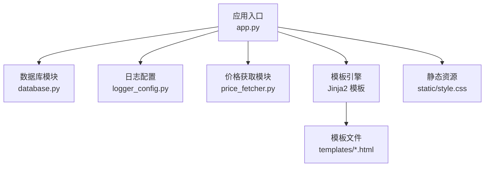
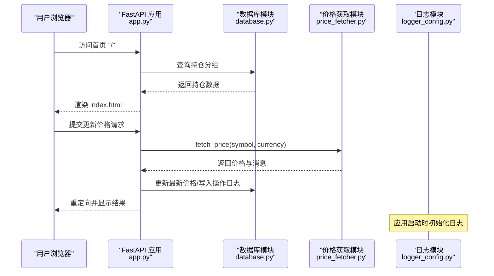
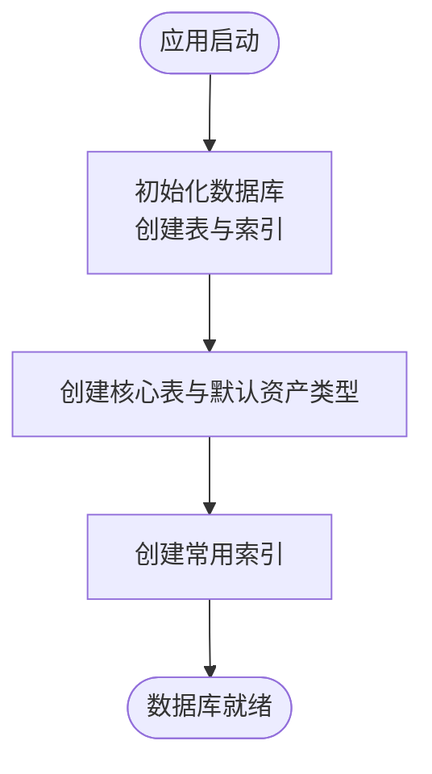
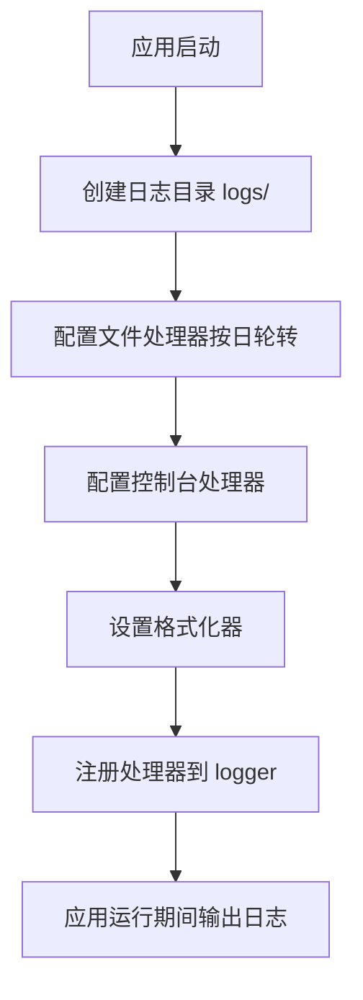
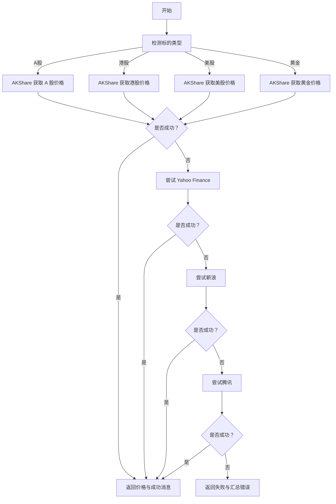
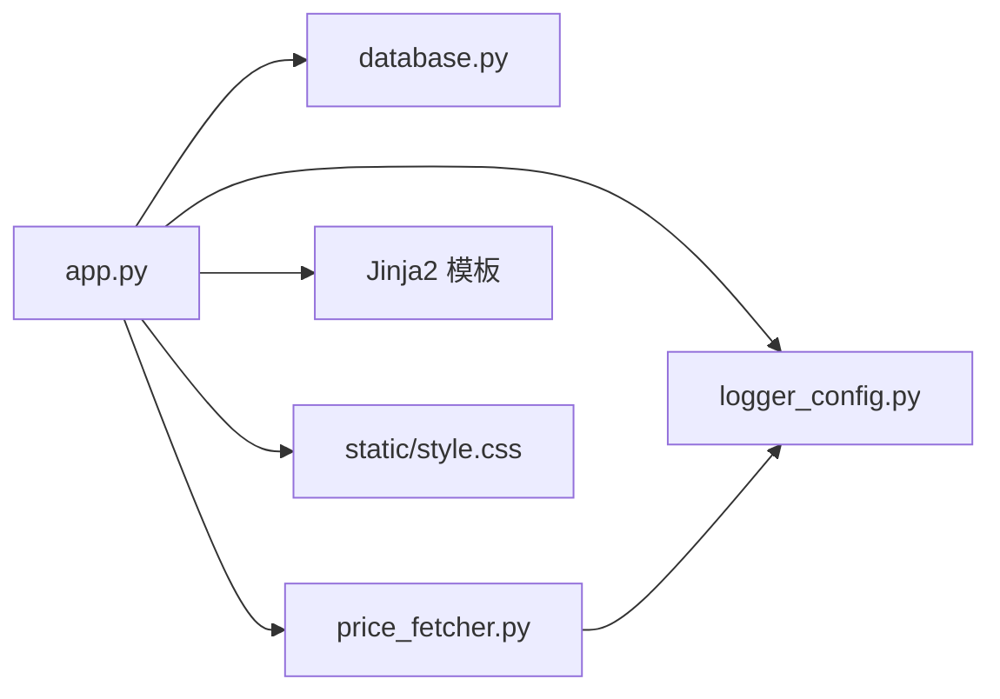

# 安装与配置

<cite>
**本文引用的文件**
- [app.py](file://app.py)
- [database.py](file://database.py)
- [logger_config.py](file://logger_config.py)
- [price_fetcher.py](file://price_fetcher.py)
- [requirements.txt](file://requirements.txt)
- [templates/base.html](file://templates/base.html)
- [templates/index.html](file://templates/index.html)
- [static/style.css](file://static/style.css)
</cite>

## 目录
1. [简介](#简介)
2. [项目结构](#项目结构)
3. [核心组件](#核心组件)
4. [架构总览](#架构总览)
5. [详细组件分析](#详细组件分析)
6. [依赖关系分析](#依赖关系分析)
7. [性能考虑](#性能考虑)
8. [故障排除指南](#故障排除指南)
9. [结论](#结论)
10. [附录](#附录)

## 简介
本指南面向首次部署 invest-log 的用户，提供从环境准备、依赖安装、数据库初始化、日志系统配置，到开发与生产环境差异化的完整安装与配置流程。文档同时覆盖常见问题排查与最佳实践，帮助新手快速完成部署与基础配置。

## 项目结构
项目采用“后端服务 + 模板渲染 + 静态资源”的典型结构：
- 后端：FastAPI 应用入口与路由逻辑
- 数据层：SQLite 数据库初始化与查询封装
- 日志：基于 Python logging 的定时轮转日志
- 前端：Jinja2 模板与静态样式
- 价格获取：多数据源回退的价格抓取模块

图表来源
- [app.py](file://app.py#L1-L444)
- [database.py](file://database.py#L1-L944)
- [logger_config.py](file://logger_config.py#L1-L54)
- [price_fetcher.py](file://price_fetcher.py#L1-L398)
- [templates/base.html](file://templates/base.html#L1-L27)
- [static/style.css](file://static/style.css)

章节来源
- [app.py](file://app.py#L1-L444)
- [database.py](file://database.py#L1-L944)
- [logger_config.py](file://logger_config.py#L1-L54)
- [price_fetcher.py](file://price_fetcher.py#L1-L398)
- [templates/base.html](file://templates/base.html#L1-L27)
- [static/style.css](file://static/style.css)

## 核心组件
- FastAPI 应用与路由：提供网页与 API 接口，挂载静态资源与模板目录
- 数据库模块：负责 SQLite 初始化、事务与持仓计算、设置与日志管理
- 日志模块：每日轮转，保留最近 7 天日志
- 价格获取模块：多数据源回退（AKShare、Yahoo Finance、新浪、腾讯）
- 模板与静态资源：Jinja2 模板与样式文件

章节来源
- [app.py](file://app.py#L1-L444)
- [database.py](file://database.py#L1-L944)
- [logger_config.py](file://logger_config.py#L1-L54)
- [price_fetcher.py](file://price_fetcher.py#L1-L398)
- [templates/base.html](file://templates/base.html#L1-L27)
- [static/style.css](file://static/style.css)

## 架构总览
应用启动时会进行数据库初始化，并在每次请求中通过模板渲染页面或返回 JSON 数据。价格获取功能支持多数据源回退，日志系统按天轮转。

图表来源
- [app.py](file://app.py#L25-L29)
- [app.py](file://app.py#L216-L262)
- [database.py](file://database.py#L779-L800)
- [price_fetcher.py](file://price_fetcher.py#L321-L394)
- [logger_config.py](file://logger_config.py#L14-L50)

## 详细组件分析

### 环境与依赖安装
- Python 版本要求
  - 使用 pip 安装依赖前，请确认本地 Python 版本满足各依赖的最低要求。建议使用 Python 3.9+。
- 快速安装步骤
  1) 创建虚拟环境并激活
  2) 安装依赖：pip install -r requirements.txt
  3) 运行应用：python app.py 或 uvicorn 运行器启动
- 依赖说明
  - FastAPI：Web 框架与路由
  - Uvicorn：ASGI 服务器（标准变体）
  - Jinja2：模板渲染
  - python-multipart：表单解析
  - akshare：主要 A 股/港股/美股/黄金价格数据源
  - 其他可选：yfinance（备用美股/港股数据）、网络请求库（内置 urllib）

章节来源
- [requirements.txt](file://requirements.txt#L1-L6)
- [app.py](file://app.py#L441-L444)

### 数据库初始化与配置
- 初始化流程
  - 应用启动时触发数据库初始化，创建以下表与索引：
    - transactions：交易记录
    - accounts：账户信息
    - symbols：标的元数据
    - allocation_settings：资产配置区间
    - asset_types：资产类型定义（默认包含 stock/bond/metal/cash）
    - operation_logs：操作日志
    - latest_prices：最新价格缓存
  - 自动创建常用索引以优化查询
- 数据库路径
  - 默认使用当前工作目录下的 transactions.db 文件；如需自定义路径，可在调用数据库函数时传入 db_path 参数
- 表结构要点
  - 交易类型包含 BUY/SELL/DIVIDEND/SPLIT/TRANSFER_IN/TRANSFER_OUT/ADJUST
  - 货币支持 CNY/USD/HKD
  - 资产类型支持 stock/bond/metal/cash
- 建议
  - 生产环境建议将数据库文件放置在持久化存储卷中，并定期备份
  - 如需迁移或升级，注意保留现有数据并谨慎执行 ALTER 操作

图表来源
- [database.py](file://database.py#L20-L149)

章节来源
- [database.py](file://database.py#L20-L149)

### 日志系统配置与轮转机制
- 日志配置
  - 日志目录：logs（不存在则自动创建）
  - 输出目标：文件与控制台双通道
  - 轮转策略：按午夜轮转，保留最近 7 天日志
  - 编码：UTF-8
  - 格式：时间-名称-级别-消息
- 使用方式
  - 应用启动时自动初始化日志；后续通过 logger 实例输出 INFO/WARNING/ERROR 等级别日志
- 生产建议
  - 将日志目录映射到持久化存储
  - 结合系统日志收集工具统一采集
  - 控制日志量，避免磁盘占用过高

图表来源
- [logger_config.py](file://logger_config.py#L14-L50)

章节来源
- [logger_config.py](file://logger_config.py#L1-L54)

### 开发环境与生产环境配置差异
- 开发环境
  - 使用内置 Uvicorn 在本地 127.0.0.1:8000 运行
  - 可开启调试模式（如需要），便于查看错误堆栈
  - 日志级别建议 INFO，便于观察业务日志
- 生产环境
  - 使用反向代理（如 Nginx）与 WSGI/ASGI 服务器（如 Uvicorn/Hypercorn）组合部署
  - 将静态资源与模板目录置于可访问路径
  - 数据库文件置于持久化卷，定期备份
  - 日志目录映射到持久化存储，结合日志收集系统集中管理
  - 价格获取模块依赖外部数据源，需确保网络可达与超时合理设置

章节来源
- [app.py](file://app.py#L441-L444)
- [logger_config.py](file://logger_config.py#L14-L50)

### 前端模板与静态资源
- 模板引擎
  - 使用 Jinja2，模板目录为 templates
  - base.html 提供通用导航与布局，其他页面继承该模板
- 静态资源
  - 静态文件目录 static，挂载到 /static
  - 样式文件 style.css 由 base.html 引用
- 页面要点
  - index.html 展示按货币分组的持仓与资产配置图
  - holdings.html/symbol.html/charts.html 等页面用于详情与图表展示

章节来源
- [app.py](file://app.py#L21-L23)
- [templates/base.html](file://templates/base.html#L1-L27)
- [templates/index.html](file://templates/index.html#L1-L90)
- [static/style.css](file://static/style.css)

### 价格获取与多数据源回退
- 支持标的类型
  - A 股（SH/SZ/6 位数字）、港股（0xxxx）、美股（字母）、黄金（AU/GOLD）
- 回退顺序
  - AKShare（主源）→ Yahoo Finance（备用）→ 新浪/腾讯（备援）
- 错误处理
  - 每个数据源失败会记录调试日志并继续尝试下一个
  - 所有数据源失败时返回错误消息
- 性能与稳定性
  - 建议对频繁调用进行节流或缓存
  - 网络超时与异常需在调用方处理

图表来源
- [price_fetcher.py](file://price_fetcher.py#L321-L394)

章节来源
- [price_fetcher.py](file://price_fetcher.py#L1-L398)

## 依赖关系分析
应用模块之间的依赖关系如下：

图表来源
- [app.py](file://app.py#L1-L17)
- [price_fetcher.py](file://price_fetcher.py#L20-L34)
- [logger_config.py](file://logger_config.py#L1-L54)

章节来源
- [app.py](file://app.py#L1-L17)
- [price_fetcher.py](file://price_fetcher.py#L1-L34)
- [logger_config.py](file://logger_config.py#L1-L54)

## 性能考虑
- 数据库
  - 已创建常用索引（symbol/date/account/type/currency/asset_type），建议避免在大表上进行全表扫描
  - 分页查询（每页 100 条）减少一次性加载压力
- 日志
  - 按日轮转，避免单文件过大；生产环境建议落盘到高性能存储
- 网络与价格获取
  - 多数据源回退提升可用性，但会增加请求次数；建议对热点标的做本地缓存
- 部署
  - 生产环境建议使用反向代理与多进程/多实例部署，提高并发与容错能力

[本节为通用指导，无需列出具体文件来源]

## 故障排除指南
- 依赖安装失败
  - 确认 Python 版本满足 requirements.txt 中的最低要求
  - 若安装 akshare/yfinance 失败，可先跳过这些可选依赖，仅安装基础依赖，再根据需要单独安装
- 数据库初始化失败
  - 检查当前工作目录是否有写权限
  - 确认 SQLite 可用且无文件锁冲突
- 日志目录无法创建
  - 确认 logs 目录可写；若部署在受限环境，可手动创建并赋权
- 价格获取失败
  - 检查网络连通性与 DNS 解析
  - 观察日志中关于各数据源的错误提示，逐个排除
  - 对于 A 股/港股/美股符号格式不正确的情况，确认输入符合预期格式
- 静态资源或模板 404
  - 确认静态文件目录与模板目录路径正确
  - 生产环境需确保反向代理正确转发 /static 与模板渲染路径
- 启动后页面空白或报错
  - 查看控制台日志与 logs/app.log，定位错误位置
  - 确认数据库已初始化成功

章节来源
- [requirements.txt](file://requirements.txt#L1-L6)
- [database.py](file://database.py#L20-L149)
- [logger_config.py](file://logger_config.py#L11-L12)
- [price_fetcher.py](file://price_fetcher.py#L321-L394)
- [app.py](file://app.py#L21-L23)

## 结论
通过本指南，您可以在本地快速完成依赖安装、数据库初始化与日志配置，并理解开发与生产环境的差异。建议在生产环境中进一步完善日志、监控与备份策略，确保系统稳定运行。

[本节为总结性内容，无需列出具体文件来源]

## 附录
- 快速验证清单
  - Python 环境与版本满足要求
  - requirements.txt 依赖安装完成
  - 数据库初始化成功（transactions.db 存在）
  - 日志目录 logs 可写
  - 静态资源与模板可访问
  - 价格获取功能可正常回退
  - 应用可通过 127.0.0.1:8000 访问

[本节为通用附录，无需列出具体文件来源]