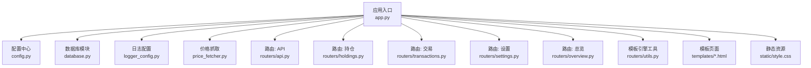
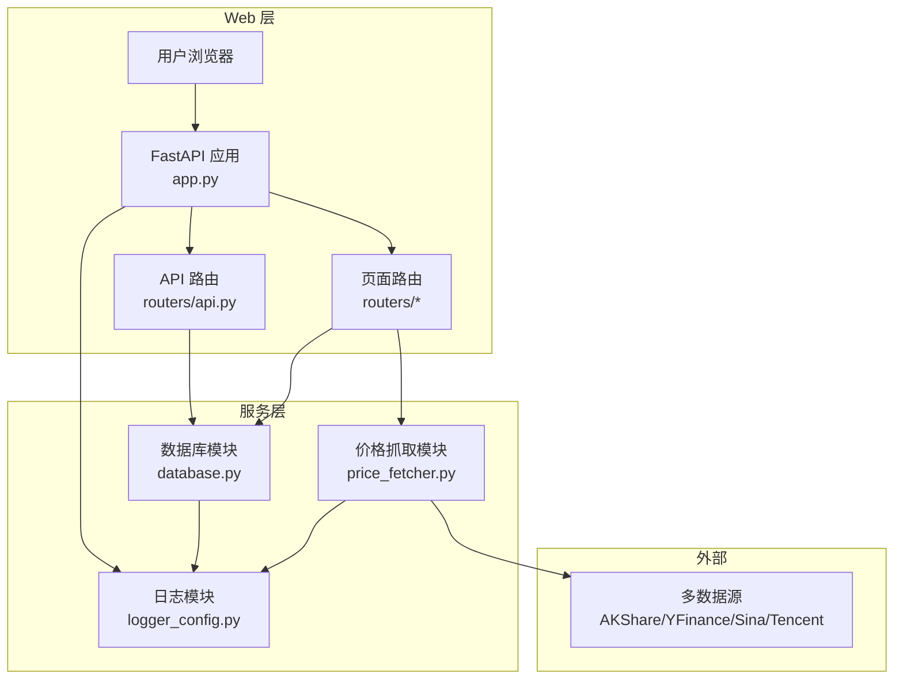
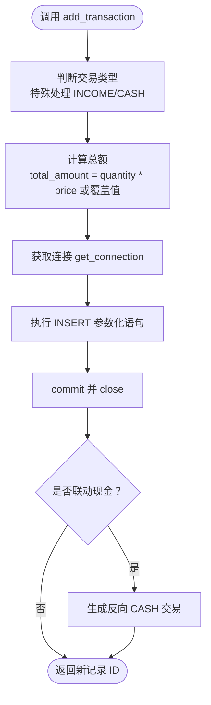
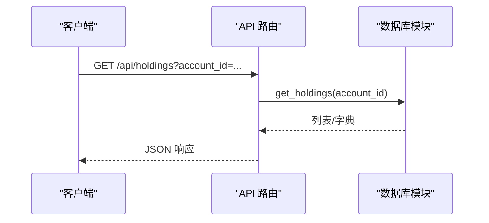
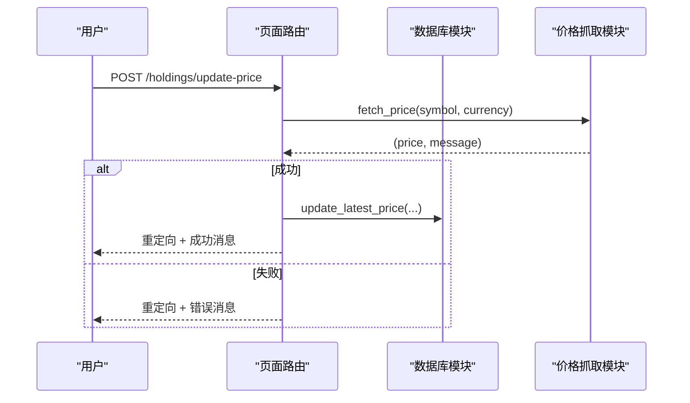
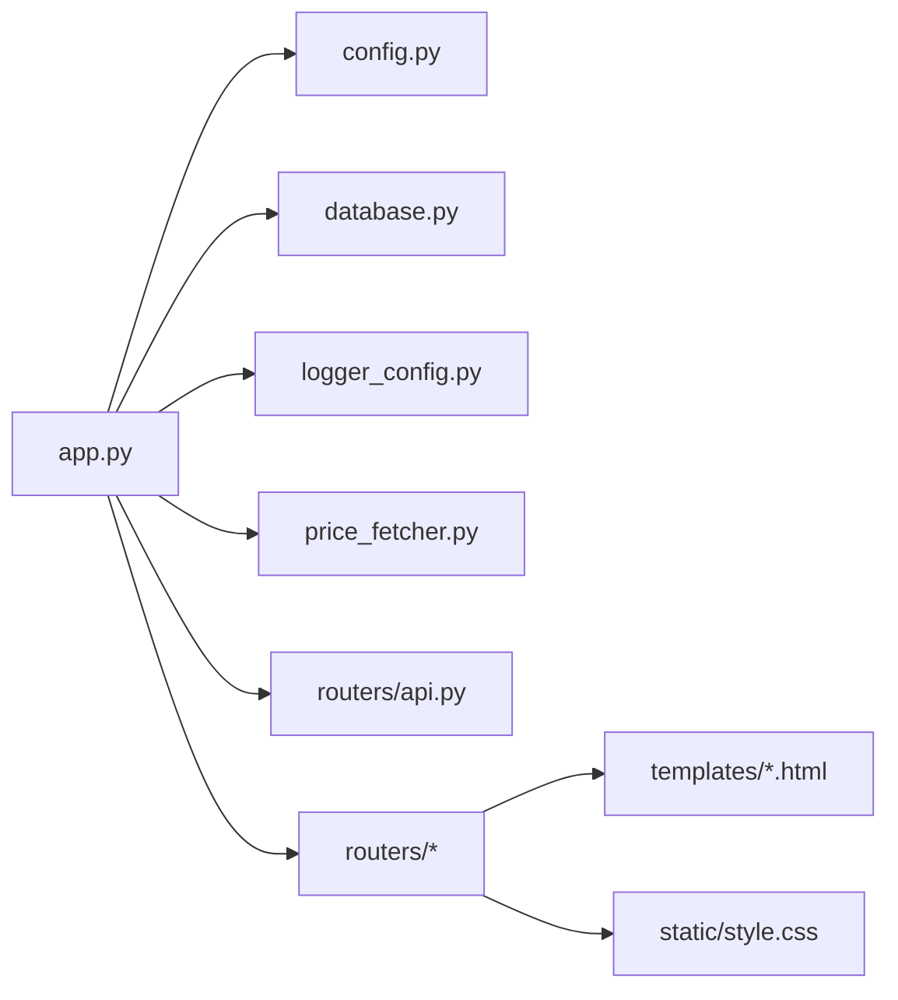

# 代码规范与最佳实践

<cite>
**本文引用的文件**
- [app.py](file://app.py)
- [config.py](file://config.py)
- [database.py](file://database.py)
- [logger_config.py](file://logger_config.py)
- [price_fetcher.py](file://price_fetcher.py)
- [requirements.txt](file://requirements.txt)
- [routers/api.py](file://routers/api.py)
- [routers/holdings.py](file://routers/holdings.py)
- [routers/transactions.py](file://routers/transactions.py)
- [routers/settings.py](file://routers/settings.py)
- [routers/overview.py](file://routers/overview.py)
- [routers/utils.py](file://routers/utils.py)
- [templates/base.html](file://templates/base.html)
- [templates/index.html](file://templates/index.html)
</cite>

## 目录
1. [引言](#引言)
2. [项目结构](#项目结构)
3. [核心组件](#核心组件)
4. [架构总览](#架构总览)
5. [详细组件分析](#详细组件分析)
6. [依赖关系分析](#依赖关系分析)
7. [性能考量](#性能考量)
8. [故障排查指南](#故障排查指南)
9. [结论](#结论)
10. [附录：代码规范与最佳实践清单](#附录代码规范与最佳实践清单)

## 引言
本文件面向投资日志管理系统，系统采用 FastAPI + SQLite + Jinja2 模板的轻量级架构，提供交易记录、持仓计算、价格抓取与设置管理等能力。本文从 Python 代码风格、模块组织、数据库操作、API 开发规范、安全与性能、可维护性等方面，给出统一的规范与最佳实践，并结合现有实现进行逐项说明与改进建议。

## 项目结构
项目采用按功能路由分层的组织方式，核心入口在应用主文件，业务逻辑集中在数据库模块，API 路由按页面功能拆分，模板与静态资源分离。

图表来源
- [app.py](file://app.py#L1-L34)
- [config.py](file://config.py#L1-L24)
- [database.py](file://database.py#L1-L151)
- [logger_config.py](file://logger_config.py#L1-L54)
- [price_fetcher.py](file://price_fetcher.py#L1-L405)
- [routers/api.py](file://routers/api.py#L1-L67)
- [routers/holdings.py](file://routers/holdings.py#L1-L207)
- [routers/transactions.py](file://routers/transactions.py#L1-L75)
- [routers/settings.py](file://routers/settings.py#L1-L148)
- [routers/overview.py](file://routers/overview.py#L1-L28)
- [routers/utils.py](file://routers/utils.py#L1-L4)
- [templates/base.html](file://templates/base.html#L1-L27)
- [templates/index.html](file://templates/index.html#L1-L90)

章节来源
- [app.py](file://app.py#L1-L34)
- [requirements.txt](file://requirements.txt#L1-L6)

## 核心组件
- 应用入口与生命周期
  - 启动事件初始化数据库，挂载静态资源，注册各路由。
- 配置中心
  - 统一管理数据库路径，支持本地覆盖环境变量。
- 数据库模块
  - 提供连接、建表、索引、增删改查、汇总统计、价格与日志表维护等。
- 日志模块
  - 每日轮转日志，保留 7 天，控制台与文件双输出。
- 价格抓取模块
  - 多源回退的价格获取器，支持 A 股、港股、美股、黄金等。
- 路由与页面
  - API 路由提供数据接口；页面路由负责渲染 HTML 并处理表单提交。
- 模板与静态资源
  - 基于 Jinja2 的页面模板与样式资源。

章节来源
- [app.py](file://app.py#L13-L34)
- [config.py](file://config.py#L17-L24)
- [database.py](file://database.py#L15-L151)
- [logger_config.py](file://logger_config.py#L14-L54)
- [price_fetcher.py](file://price_fetcher.py#L36-L405)
- [routers/api.py](file://routers/api.py#L1-L67)
- [routers/holdings.py](file://routers/holdings.py#L1-L207)
- [routers/transactions.py](file://routers/transactions.py#L1-L75)
- [routers/settings.py](file://routers/settings.py#L1-L148)
- [routers/overview.py](file://routers/overview.py#L1-L28)
- [routers/utils.py](file://routers/utils.py#L1-L4)
- [templates/base.html](file://templates/base.html#L1-L27)
- [templates/index.html](file://templates/index.html#L1-L90)

## 架构总览
系统采用“Web 入口 + 路由 + 数据库 + 外部服务”的分层架构。API 路由与页面路由共享数据库模块，价格抓取模块独立于业务路由，通过日志模块统一记录运行状态。

图表来源
- [app.py](file://app.py#L7-L29)
- [routers/api.py](file://routers/api.py#L1-L67)
- [routers/holdings.py](file://routers/holdings.py#L1-L207)
- [database.py](file://database.py#L15-L151)
- [price_fetcher.py](file://price_fetcher.py#L22-L405)
- [logger_config.py](file://logger_config.py#L14-L54)

## 详细组件分析

### 数据库模块（database.py）分析
- 连接与工厂
  - 使用 row_factory 返回字典式结果，便于模板渲染与序列化。
- 初始化流程
  - 建表、索引、默认资产类型初始化、约束校验。
- 事务与更新
  - 所有写操作显式 commit/close，避免连接泄漏。
- 查询与聚合
  - 支持多条件过滤、分页、按货币/资产类型分组、百分比与损益计算。
- 安全性
  - 关键写入使用参数化 SQL，避免拼接注入。
- 可维护性
  - 功能按主题分段注释清晰，函数职责单一。

图表来源
- [database.py](file://database.py#L158-L225)

章节来源
- [database.py](file://database.py#L15-L151)
- [database.py](file://database.py#L158-L225)
- [database.py](file://database.py#L294-L341)
- [database.py](file://database.py#L344-L390)
- [database.py](file://database.py#L393-L463)
- [database.py](file://database.py#L466-L512)
- [database.py](file://database.py#L515-L593)
- [database.py](file://database.py#L596-L658)
- [database.py](file://database.py#L664-L730)
- [database.py](file://database.py#L732-L785)
- [database.py](file://database.py#L792-L800)

### API 路由（routers/api.py）分析
- 接口职责
  - 持仓查询、按货币分组、交易列表、组合历史、删除交易。
- 错误处理
  - 删除不存在记录时抛出 HTTP 404，确保客户端明确失败原因。
- 响应格式
  - 直接返回数据库查询结果，保持简洁一致的数据契约。

图表来源
- [routers/api.py](file://routers/api.py#L8-L11)
- [database.py](file://database.py#L344-L390)

章节来源
- [routers/api.py](file://routers/api.py#L1-L67)

### 页面路由（routers/holdings.py、transactions.py、settings.py、overview.py）分析
- 页面渲染
  - 使用 Jinja2 模板渲染，传递上下文数据与消息。
- 表单提交
  - 使用 Form(...) 接收表单字段，完成业务写入或价格更新。
- 重定向
  - 成功/失败后通过 RedirectResponse 返回上一页并携带消息。
- 日志记录
  - 对关键操作记录 INFO/WARNING 级日志，便于审计。

图表来源
- [routers/holdings.py](file://routers/holdings.py#L102-L147)
- [price_fetcher.py](file://price_fetcher.py#L325-L401)
- [database.py](file://database.py#L1-L151)

章节来源
- [routers/holdings.py](file://routers/holdings.py#L1-L207)
- [routers/transactions.py](file://routers/transactions.py#L1-L75)
- [routers/settings.py](file://routers/settings.py#L1-L148)
- [routers/overview.py](file://routers/overview.py#L1-L28)

### 模板与静态资源
- 模板继承
  - base.html 提供导航与通用结构，子页面扩展内容块。
- 前端交互
  - 使用 Chart.js 渲染饼图，将后端数据以 JSON 形式注入。

章节来源
- [templates/base.html](file://templates/base.html#L1-L27)
- [templates/index.html](file://templates/index.html#L1-L90)

## 依赖关系分析
- 应用依赖
  - FastAPI、Uvicorn、Jinja2、python-multipart、AkShare。
- 内部耦合
  - 路由层仅依赖数据库模块与日志模块；价格抓取模块独立，降低耦合度。
- 外部依赖
  - AKShare、yfinance、Sina/Tencent API，需注意网络超时与异常处理。

图表来源
- [app.py](file://app.py#L7-L11)
- [requirements.txt](file://requirements.txt#L1-L6)

章节来源
- [requirements.txt](file://requirements.txt#L1-L6)
- [app.py](file://app.py#L7-L11)

## 性能考量
- 数据库
  - 已建立常用字段索引，建议对高频查询（如 symbol、date、account_id、type、currency、asset_type）持续监控慢查询。
  - 分页查询限制每页数量，避免一次性加载过多数据。
- 网络请求
  - 价格抓取采用多源回退，建议增加超时与重试策略，避免阻塞页面响应。
- 渲染
  - 模板渲染在服务器端完成，建议对大列表分页或懒加载，减少首屏压力。

## 故障排查指南
- 启动与数据库
  - 若启动时报数据库相关错误，检查 DB_PATH 是否可写，确认初始化脚本是否执行。
- API 返回 404
  - 删除交易接口若返回 404，确认 transaction_id 是否存在。
- 价格更新失败
  - 查看日志中 price_fetcher 的错误信息，确认网络与第三方 API 可用性。
- 日志定位
  - 日志目录位于 logs，每日轮转，保留 7 天，便于问题复盘。

章节来源
- [logger_config.py](file://logger_config.py#L14-L54)
- [routers/api.py](file://routers/api.py#L59-L67)
- [price_fetcher.py](file://price_fetcher.py#L325-L401)

## 结论
本项目在结构上清晰、职责分明，数据库与路由层分离良好，API 与页面路由共用同一数据层，具备良好的可扩展性。建议在现有基础上进一步完善参数校验、异常处理与测试覆盖，以提升健壮性与可维护性。

## 附录：代码规范与最佳实践清单

### Python 代码风格与命名规范
- 遵循 PEP 8
  - 缩进、空行、行宽、命名等遵循官方规范。
- 函数与变量命名
  - 函数名使用小写下划线，如 get_holdings、update_latest_price。
  - 常量使用全大写，如 CURRENCIES、ASSET_TYPES。
- 类设计
  - 当前模块以函数为主，无类设计；如需扩展，建议使用类封装状态与行为，保持单一职责。
- 注释与文档字符串
  - 为公共函数提供简明 docstring，说明输入、输出与副作用。

章节来源
- [database.py](file://database.py#L15-L151)
- [routers/api.py](file://routers/api.py#L1-L67)

### 模块导入顺序与组织
- 导入顺序
  - 标准库 → 第三方库 → 项目内模块；同组内按字母排序。
- 路由组织
  - 将页面路由与 API 路由分离，保持单一职责；模板与静态资源分离。

章节来源
- [app.py](file://app.py#L7-L11)
- [routers/utils.py](file://routers/utils.py#L1-L4)

### 数据库操作最佳实践
- SQL 注入防护
  - 所有写入与查询使用参数化语句，避免字符串拼接。
- 连接管理
  - 显式 commit/close，避免连接泄漏；必要时引入连接池。
- 事务处理
  - 对需要一致性的复合操作（如联动现金交易）建议封装在事务中，当前实现为多次独立提交，可评估合并。
- 索引与查询
  - 已建立常用索引；对高频过滤字段持续监控执行计划。

章节来源
- [database.py](file://database.py#L15-L151)
- [database.py](file://database.py#L158-L225)
- [database.py](file://database.py#L294-L341)

### API 开发规范
- 错误处理
  - 对不存在资源返回 404；对参数错误返回 422/400；统一异常转换。
- 参数验证
  - 在路由层对必填参数进行类型转换与校验，必要时使用 Pydantic 模型。
- 响应格式
  - 统一返回 JSON；对列表/对象结构保持稳定字段名与类型。
- 日志记录
  - 记录关键操作与错误，便于审计与排错。

章节来源
- [routers/api.py](file://routers/api.py#L59-L67)
- [routers/holdings.py](file://routers/holdings.py#L102-L147)

### 安全性检查清单
- 输入校验
  - 对 symbol、account_id、currency、asset_type 等字段进行白名单校验。
- 权限与鉴权
  - 当前为本地应用，建议在部署时增加访问控制与认证机制。
- 日志敏感信息
  - 避免在日志中输出敏感数据（如账户号、密码），当前实现未涉及敏感字段。

章节来源
- [database.py](file://database.py#L664-L671)
- [price_fetcher.py](file://price_fetcher.py#L325-L401)

### 性能优化建议
- 查询优化
  - 对高频查询添加复合索引；对大数据集使用分页与缓存。
- 网络优化
  - 价格抓取增加超时与重试；对失败重试设置指数退避。
- 渲染优化
  - 大列表分页或懒加载；模板中避免复杂计算，尽量在后端完成。

章节来源
- [price_fetcher.py](file://price_fetcher.py#L22-L405)
- [routers/holdings.py](file://routers/holdings.py#L102-L147)

### 可维护性评估
- 单元测试
  - 建议为数据库函数与路由添加单元测试，覆盖正常与异常分支。
- 文档与注释
  - 为关键函数补充更详细的注释与示例，便于协作与演进。
- 版本与兼容
  - 对数据库结构变更增加迁移脚本，避免破坏现有数据。

章节来源
- [database.py](file://database.py#L22-L151)
- [requirements.txt](file://requirements.txt#L1-L6)

### 代码示例与反面案例（路径指引）
- 正面案例
  - 参数化插入与更新：参见 [database.py](file://database.py#L186-L196)、[database.py](file://database.py#L270-L275)
  - 统一错误响应：参见 [routers/api.py](file://routers/api.py#L62-L66)
  - 日志记录：参见 [routers/holdings.py](file://routers/holdings.py#L107-L130)
- 反面案例（建议改进）
  - 未显式关闭连接：当前多数写操作已 close，但可统一在上下文中使用 with/finally 确保释放。
  - 缺少参数校验：建议在路由层对 Form(...) 字段进行类型与范围校验。
  - 事务一致性：联动现金交易为多次提交，建议封装为单事务。

章节来源
- [database.py](file://database.py#L186-L200)
- [routers/api.py](file://routers/api.py#L62-L66)
- [routers/holdings.py](file://routers/holdings.py#L107-L130)