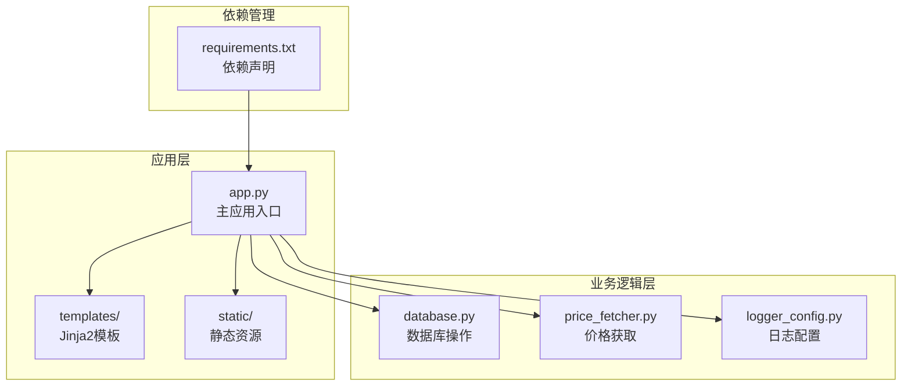
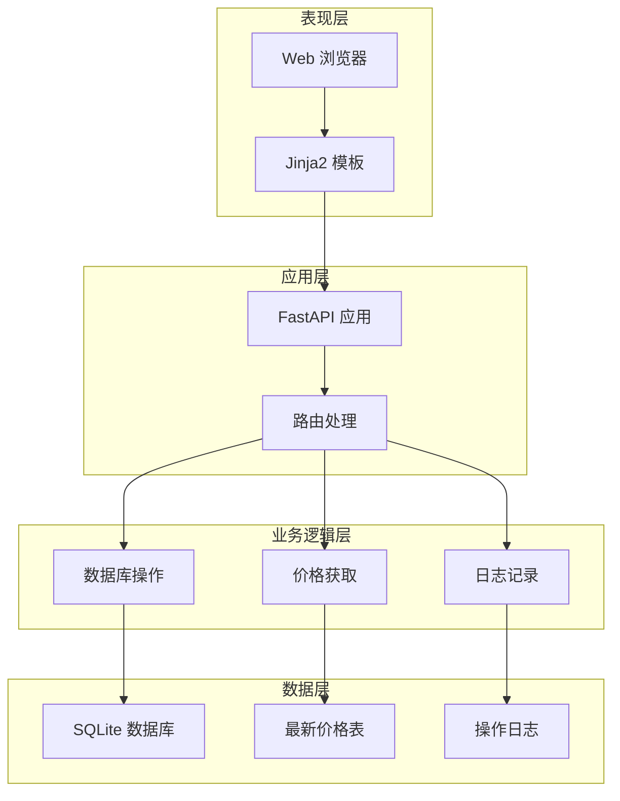
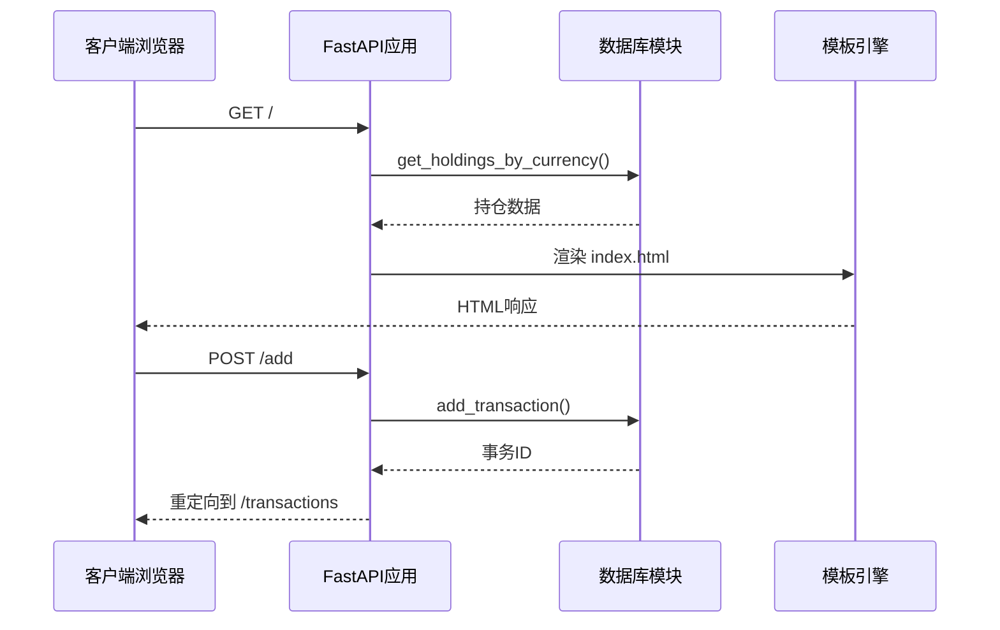
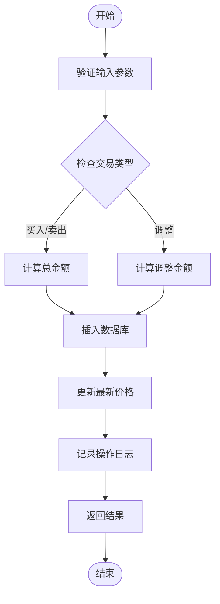
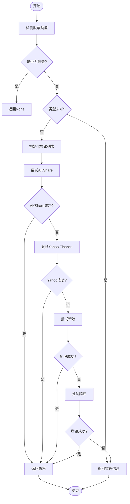
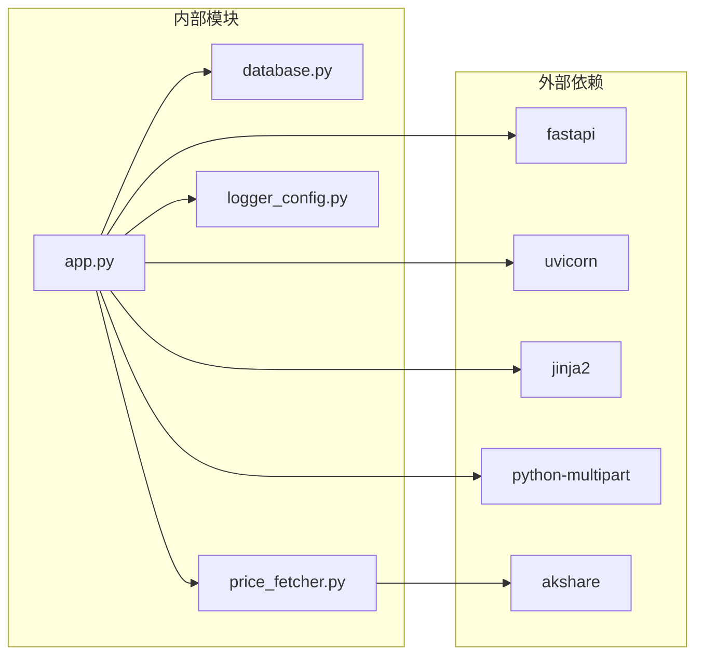

# 代码贡献规范

<cite>
**本文档引用的文件**
- [app.py](file://app.py)
- [database.py](file://database.py)
- [price_fetcher.py](file://price_fetcher.py)
- [logger_config.py](file://logger_config.py)
- [requirements.txt](file://requirements.txt)
- [templates/base.html](file://templates/base.html)
- [templates/index.html](file://templates/index.html)
- [static/style.css](file://static/style.css)
</cite>

## 目录
1. [简介](#简介)
2. [项目结构](#项目结构)
3. [核心组件](#核心组件)
4. [架构概览](#架构概览)
5. [详细组件分析](#详细组件分析)
6. [依赖关系分析](#依赖关系分析)
7. [性能考虑](#性能考虑)
8. [故障排除指南](#故障排除指南)
9. [结论](#结论)

## 简介

Invest Log 是一个基于 Python 的投资交易记录管理系统，使用 FastAPI 构建 Web 应用程序，提供投资组合跟踪、交易记录管理和实时价格获取功能。本项目采用 SQLite 数据库存储交易数据，支持多币种（CNY、USD、HKD）和多种资产类型（股票、债券、贵金属、现金）的投资管理。

## 项目结构

项目采用模块化的文件组织方式，主要分为以下几个部分：

**图表来源**
- [app.py](file://app.py#L1-L50)
- [database.py](file://database.py#L1-L50)
- [price_fetcher.py](file://price_fetcher.py#L1-L50)
- [logger_config.py](file://logger_config.py#L1-L50)

**章节来源**
- [app.py](file://app.py#L1-L50)
- [requirements.txt](file://requirements.txt#L1-L6)

## 核心组件

### 应用程序核心

应用程序使用 FastAPI 框架构建，提供了完整的 Web 服务功能：

- **路由系统**：包含 HTML 页面路由和 API 路由
- **模板渲染**：使用 Jinja2 模板引擎
- **静态资源**：CSS 样式和 JavaScript 文件
- **数据库集成**：SQLite 数据库操作
- **价格服务**：多数据源价格获取

### 数据库模块

数据库模块提供了完整的交易记录管理功能：

- **事务管理**：增删改查操作
- **持仓计算**：实时持仓和盈亏计算
- **价格跟踪**：最新价格存储和查询
- **设置管理**：资产配置范围设置

### 价格获取模块

价格获取模块实现了多数据源的价格获取机制：

- **多源支持**：AKShare、Yahoo Finance、新浪、腾讯
- **智能回退**：主数据源失败时自动切换
- **格式识别**：自动识别不同市场的股票代码格式

**章节来源**
- [app.py](file://app.py#L19-L446)
- [database.py](file://database.py#L13-L150)
- [price_fetcher.py](file://price_fetcher.py#L1-L120)

## 架构概览

系统采用分层架构设计，各层职责明确：

**图表来源**
- [app.py](file://app.py#L25-L446)
- [database.py](file://database.py#L20-L150)
- [price_fetcher.py](file://price_fetcher.py#L321-L398)

## 详细组件分析

### 应用程序路由系统

应用程序定义了完整的路由体系，包括页面路由和 API 路由：

**图表来源**
- [app.py](file://app.py#L36-L110)
- [database.py](file://database.py#L156-L194)

### 数据库操作流程

数据库模块提供了完整的 CRUD 操作和复杂查询：

**图表来源**
- [database.py](file://database.py#L156-L194)
- [database.py](file://database.py#L434-L481)

### 价格获取算法

价格获取模块实现了智能的数据源选择和回退机制：

**图表来源**
- [price_fetcher.py](file://price_fetcher.py#L321-L398)

**章节来源**
- [app.py](file://app.py#L36-L446)
- [database.py](file://database.py#L156-L481)
- [price_fetcher.py](file://price_fetcher.py#L321-L398)

## 依赖关系分析

项目依赖关系清晰，模块间耦合度适中：

**图表来源**
- [requirements.txt](file://requirements.txt#L1-L6)
- [app.py](file://app.py#L7-L17)

**章节来源**
- [requirements.txt](file://requirements.txt#L1-L6)

## 性能考虑

### 数据库优化

- **索引策略**：为常用查询字段建立索引（symbol、transaction_date、account_id）
- **查询优化**：使用参数化查询防止 SQL 注入
- **连接管理**：使用连接池减少连接开销

### 缓存机制

- **价格缓存**：最新价格存储在独立表中，避免重复网络请求
- **模板缓存**：Jinja2 模板编译后缓存
- **静态资源**：浏览器缓存静态 CSS 和 JavaScript 文件

### 异步处理

- **并发支持**：FastAPI 基于异ync/await，支持高并发请求
- **数据库连接**：每个请求使用独立的数据库连接

## 故障排除指南

### 常见问题及解决方案

**数据库连接问题**
- 检查数据库文件权限
- 验证 SQLite 版本兼容性
- 确认数据库表结构完整性

**价格获取失败**
- 检查网络连接
- 验证数据源可用性
- 查看日志文件获取详细错误信息

**模板渲染错误**
- 检查模板语法
- 验证变量传递正确性
- 确认静态资源路径

**章节来源**
- [logger_config.py](file://logger_config.py#L14-L54)
- [price_fetcher.py](file://price_fetcher.py#L376-L394)

## 结论

Invest Log 项目展现了良好的软件工程实践，具有以下特点：

- **清晰的架构设计**：分层架构使代码结构清晰易维护
- **完善的错误处理**：多层次的异常处理确保系统稳定性
- **可扩展的设计**：模块化设计便于功能扩展
- **用户友好的界面**：简洁直观的 Web 界面

建议在后续开发中重点关注：
- 添加单元测试覆盖关键业务逻辑
- 实现更完善的 API 文档
- 增强数据导入导出功能
- 优化移动端用户体验