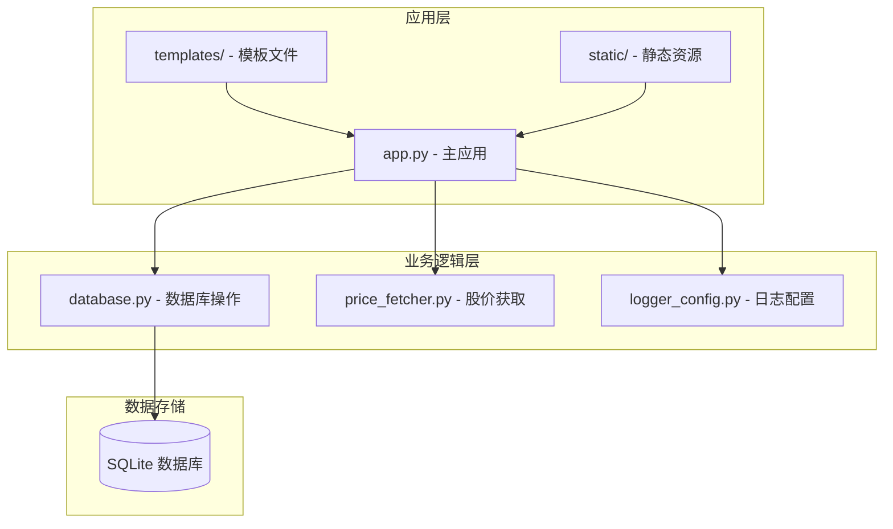
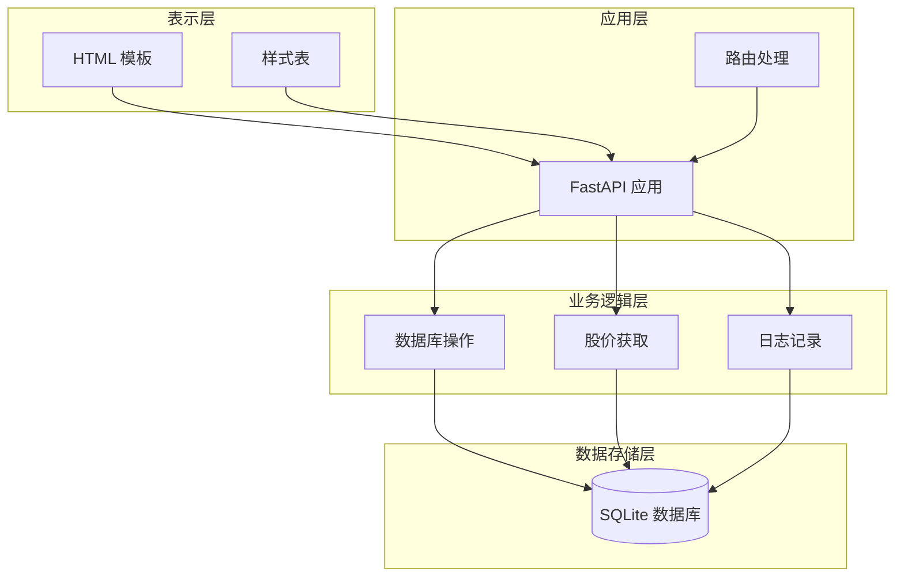
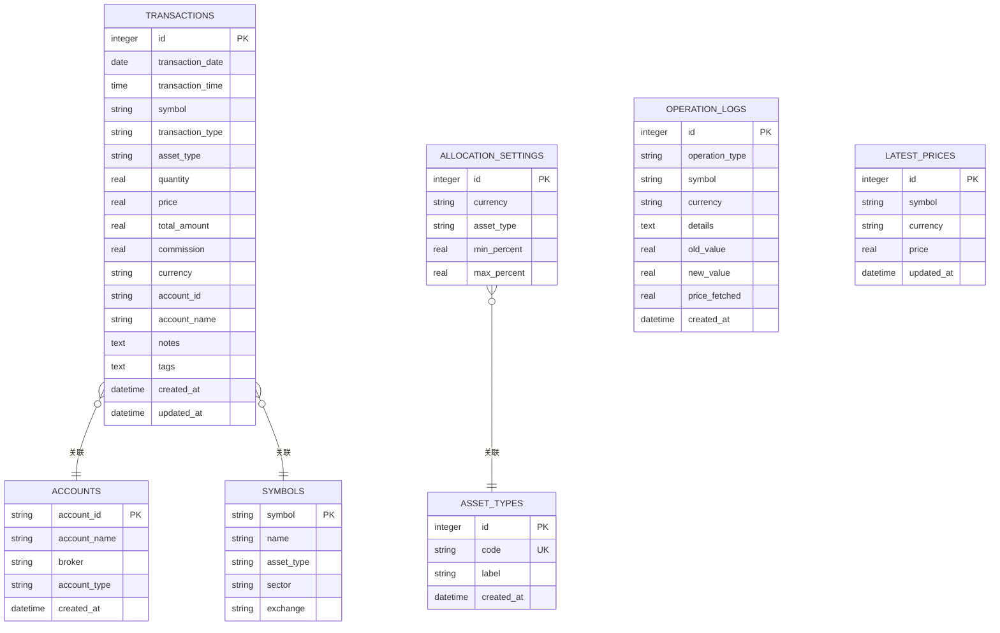
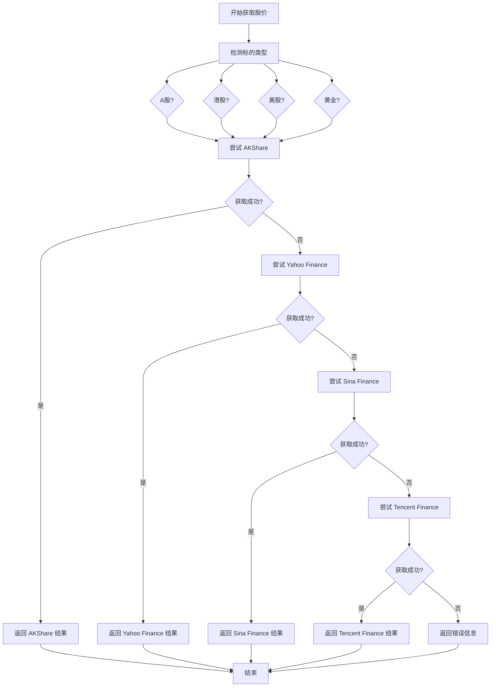
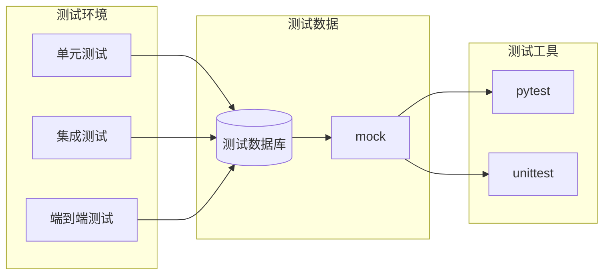
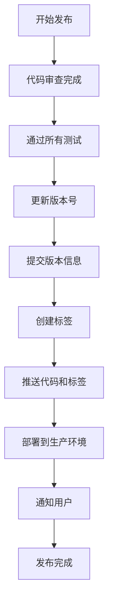

# 开发者指南

<cite>
**本文档中引用的文件**
- [app.py](file://app.py)
- [database.py](file://database.py)
- [price_fetcher.py](file://price_fetcher.py)
- [logger_config.py](file://logger_config.py)
- [requirements.txt](file://requirements.txt)
- [templates/base.html](file://templates/base.html)
- [templates/index.html](file://templates/index.html)
- [templates/transactions.html](file://templates/transactions.html)
- [templates/add.html](file://templates/add.html)
- [templates/holdings.html](file://templates/holdings.html)
- [templates/symbol.html](file://templates/symbol.html)
- [templates/charts.html](file://templates/charts.html)
- [templates/settings.html](file://templates/settings.html)
- [static/style.css](file://static/style.css)
</cite>

## 目录
1. [简介](#简介)
2. [项目结构](#项目结构)
3. [核心组件](#核心组件)
4. [架构概览](#架构概览)
5. [详细组件分析](#详细组件分析)
6. [测试策略](#测试策略)
7. [扩展开发指南](#扩展开发指南)
8. [代码审查标准](#代码审查标准)
9. [调试技巧](#调试技巧)
10. [版本控制最佳实践](#版本控制最佳实践)
11. [性能分析与优化](#性能分析与优化)
12. [社区贡献](#社区贡献)
13. [故障排除指南](#故障排除指南)
14. [结论](#结论)

## 简介

Invest Log 是一个基于 Python 的投资交易记录管理系统，使用 FastAPI 构建 Web 应用程序，提供实时股价获取、投资组合管理和财务分析功能。该系统支持多币种（CNY、USD、HKD）、多种资产类型（股票、债券、贵金属、现金）和多账户管理。

## 项目结构

项目采用模块化设计，主要分为以下几个核心部分：



**图表来源**
- [app.py](file://app.py#L1-L444)
- [database.py](file://database.py#L1-L944)
- [price_fetcher.py](file://price_fetcher.py#L1-L398)

**章节来源**
- [app.py](file://app.py#L1-L444)
- [database.py](file://database.py#L1-L944)
- [price_fetcher.py](file://price_fetcher.py#L1-L398)

## 核心组件

### 应用程序入口点

主应用程序使用 FastAPI 框架构建，提供 RESTful API 和 HTML 页面渲染功能。

**章节来源**
- [app.py](file://app.py#L1-L444)

### 数据库模块

数据库模块负责所有数据持久化操作，使用 SQLite 作为后端存储。

**章节来源**
- [database.py](file://database.py#L1-L944)

### 股价获取模块

支持多数据源的股价获取功能，包括 AKShare、Yahoo Finance、新浪和腾讯金融 API。

**章节来源**
- [price_fetcher.py](file://price_fetcher.py#L1-L398)

## 架构概览

系统采用分层架构设计，确保关注点分离和可维护性：



**图表来源**
- [app.py](file://app.py#L1-L444)
- [database.py](file://database.py#L1-L944)
- [price_fetcher.py](file://price_fetcher.py#L1-L398)

## 详细组件分析

### 应用程序路由架构

应用程序定义了多个路由组，分别处理不同的功能模块：

```mermaid
graph LR
subgraph "页面路由"
IDX[GET / - 首页]
TRX[GET /transactions - 交易列表]
ADD[GET /add - 添加交易]
CHARTS[GET /charts - 图表]
HOLD[GET /holdings - 持仓详情]
SYMBOL[GET /symbol/{symbol} - 标的详情]
SETTINGS[GET /settings - 设置]
end
subgraph "API 路由"
API_HOLD[GET /api/holdings - 持仓数据]
API_TRX[GET /api/transactions - 交易数据]
API_PORTF[GET /api/portfolio-history - 投资组合历史]
API_DEL[DELETE /api/transactions/{id} - 删除交易]
end
subgraph "表单提交路由"
ADD_SUB[POST /add - 提交交易]
UPDATE_PRICE[POST /holdings/update-price - 更新价格]
QUICK_TRADE[POST /holdings/quick-trade - 快速交易]
ADJUST_VAL[POST /symbol/{symbol}/adjust - 调整价值]
SETTINGS_SUB[POST /settings - 设置提交]
ADD_ASSET_TYPE[POST /settings/add-asset-type - 添加资产类型]
DEL_ASSET_TYPE[POST /settings/delete-asset-type/{code} - 删除资产类型]
end
```

**图表来源**
- [app.py](file://app.py#L36-L370)

**章节来源**
- [app.py](file://app.py#L36-L370)

### 数据库设计模式

数据库采用关系型设计，支持复杂的查询和分析功能：



**图表来源**
- [database.py](file://database.py#L25-L147)

**章节来源**
- [database.py](file://database.py#L25-L147)

### 股价获取策略

系统实现了多数据源的股价获取策略，确保高可用性和准确性：



**图表来源**
- [price_fetcher.py](file://price_fetcher.py#L321-L394)

**章节来源**
- [price_fetcher.py](file://price_fetcher.py#L321-L394)

## 测试策略

### 单元测试

建议为以下模块编写单元测试：

#### 数据库操作测试
- 交易 CRUD 操作验证
- 查询功能测试（按日期、类型、账户等过滤）
- 持仓计算准确性验证
- 数据完整性约束测试

#### API 接口测试
- REST API 端点响应验证
- HTTP 状态码正确性
- 请求参数验证
- 错误处理测试

#### 股价获取测试
- 多数据源可用性测试
- 异常情况处理
- 数据格式验证
- 性能基准测试

### 集成测试

#### 端到端工作流测试
- 完整的交易记录流程
- 股价更新流程
- 报告生成流程
- 用户界面交互测试

#### 数据一致性测试
- 数据库事务完整性
- 缓存同步验证
- 多用户并发访问
- 数据备份恢复

### 测试环境配置



## 扩展开发指南

### 新功能添加流程

#### 1. 需求分析
- 明确功能需求和用户场景
- 评估对现有架构的影响
- 设计数据库变更方案

#### 2. 数据库迁移
```python
# 示例：添加新的配置表
cursor.execute("""
    CREATE TABLE IF NOT EXISTS new_feature_settings (
        id INTEGER PRIMARY KEY AUTOINCREMENT,
        feature_name TEXT NOT NULL,
        enabled BOOLEAN DEFAULT FALSE,
        created_at DATETIME DEFAULT CURRENT_TIMESTAMP
    )
""")
```

#### 3. API 接口开发
- 在 `app.py` 中添加新的路由
- 实现请求处理逻辑
- 添加适当的错误处理

#### 4. 前端集成
- 创建或修改 HTML 模板
- 更新 JavaScript 功能
- 添加必要的 CSS 样式

### 插件开发

#### 股价数据源插件
```python
class PriceSourcePlugin:
    def __init__(self, name: str):
        self.name = name
    
    def fetch_price(self, symbol: str, currency: str) -> Optional[float]:
        """获取股价的核心方法"""
        raise NotImplementedError
    
    def is_available(self) -> bool:
        """检查数据源可用性"""
        return True
```

#### 报告插件
```python
class ReportPlugin:
    def generate_report(self, data: dict) -> str:
        """生成报告内容"""
        raise NotImplementedError
    
    def export_format(self) -> str:
        """导出格式类型"""
        return "html"
```

### 第三方集成

#### 新数据源集成步骤
1. **依赖安装**：在 `requirements.txt` 中添加新依赖
2. **模块创建**：实现新的数据源适配器
3. **配置管理**：添加配置项和验证逻辑
4. **错误处理**：实现异常处理和重试机制

#### API 集成示例
```python
# 添加新的外部 API 集成
def integrate_external_api():
    """集成第三方 API 的示例函数"""
    # 实现 API 认证
    # 处理 API 响应
    # 错误处理和重试
    pass
```

## 代码审查标准

### 代码质量标准

#### 1. 代码风格
- 遵循 PEP 8 编码规范
- 函数和变量命名清晰语义化
- 适当的注释和文档字符串
- 一致的缩进和格式

#### 2. 错误处理
```python
def safe_database_operation():
    """安全的数据库操作示例"""
    try:
        # 数据库操作
        pass
    except sqlite3.Error as e:
        logger.error(f"数据库操作失败: {e}")
        raise ValueError("数据库操作失败")
    except Exception as e:
        logger.error(f"未知错误: {e}")
        raise
```

#### 3. 性能考虑
- 避免 N+1 查询问题
- 合理使用数据库索引
- 实现适当的缓存策略
- 优化复杂查询

### 审查清单

#### 功能审查
- [ ] 功能是否满足需求规格
- [ ] 边界条件是否正确处理
- [ ] 错误情况是否妥善处理
- [ ] 性能是否符合要求

#### 代码质量审查
- [ ] 代码是否易于理解和维护
- [ ] 是否有适当的单元测试
- [ ] 文档是否完整准确
- [ ] 是否遵循团队编码规范

#### 安全审查
- [ ] SQL 注入防护
- [ ] 输入验证和清理
- [ ] 权限控制
- [ ] 敏感信息保护

## 调试技巧

### 开发环境调试

#### 1. 日志配置
```python
# 在 logger_config.py 中配置不同级别的日志
logger.setLevel(logging.DEBUG)  # 开发环境
logger.setLevel(logging.INFO)   # 生产环境
```

#### 2. 调试工具
- 使用 `uvicorn` 的调试模式运行应用
- 利用浏览器开发者工具检查网络请求
- 使用数据库查看器检查数据状态

#### 3. 常见问题诊断
```python
# 调试数据库连接问题
def debug_db_connection():
    try:
        conn = sqlite3.connect("transactions.db")
        print("数据库连接成功")
        conn.close()
    except sqlite3.Error as e:
        print(f"数据库连接失败: {e}")

# 调试 API 请求
def debug_api_request():
    import http.client
    http.client.HTTPConnection.debuglevel = 1
```

### 性能调试

#### 1. 数据库性能分析
```python
# 分析慢查询
def analyze_slow_queries():
    conn = sqlite3.connect("transactions.db")
    cursor = conn.cursor()
    
    # 启用查询分析
    cursor.execute("PRAGMA profile=on")
    
    # 执行可疑查询
    cursor.execute("EXPLAIN QUERY PLAN SELECT * FROM transactions WHERE symbol=?", ("AAPL",))
    
    # 获取执行计划
    plan = cursor.fetchall()
    print(plan)
    
    conn.close()
```

#### 2. 内存使用监控
```python
import psutil
import os

def monitor_memory_usage():
    process = psutil.Process(os.getpid())
    memory_info = process.memory_info()
    print(f"内存使用: {memory_info.rss / 1024 / 1024:.2f} MB")
```

## 版本控制最佳实践

### 分支管理策略

#### Git 工作流程
```mermaid
gitgraph
commit id: "初始提交"
branch develop
checkout develop
commit id: "添加基础功能"
branch feature/new-feature
checkout feature/new-feature
commit id: "实现新功能"
commit id: "添加测试"
checkout develop
merge feature/new-feature
commit id: "合并新功能"
checkout develop
tag v1.0.0
```

#### 分支命名规范
- `feature/` - 新功能开发
- `bugfix/` - 错误修复
- `hotfix/` - 紧急修复
- `release/` - 发布准备

### 提交消息规范

#### 格式要求
```
<type>(<scope>): <subject>

<body>

<footer>
```

#### 类型说明
- `feat`: 新功能
- `fix`: 错误修复
- `docs`: 文档更新
- `style`: 代码格式调整
- `refactor`: 代码重构
- `test`: 测试添加
- `chore`: 构建过程或辅助工具变动

### 版本发布流程



## 性能分析与优化

### 数据库优化

#### 1. 索引优化
```sql
-- 为常用查询字段创建索引
CREATE INDEX idx_symbol ON transactions(symbol);
CREATE INDEX idx_date ON transactions(transaction_date);
CREATE INDEX idx_account ON transactions(account_id);
CREATE INDEX idx_type ON transactions(transaction_type);
CREATE INDEX idx_currency ON transactions(currency);
```

#### 2. 查询优化
```python
# 优化的查询示例
def optimized_query():
    # 使用参数化查询避免 SQL 注入
    query = """
        SELECT symbol, SUM(quantity) as total_shares, 
               SUM(total_amount) as total_cost
        FROM transactions 
        WHERE account_id = ? AND transaction_type IN ('BUY', 'SELL')
        GROUP BY symbol
        HAVING total_shares > 0
    """
    cursor.execute(query, (account_id,))
    return cursor.fetchall()
```

### 应用性能优化

#### 1. 缓存策略
```python
import time
from functools import lru_cache

@lru_cache(maxsize=128)
def cached_price_lookup(symbol: str, currency: str):
    """缓存常用的股价查询"""
    return fetch_price(symbol, currency)
```

#### 2. 异步处理
```python
import asyncio
import aiohttp

async def async_price_fetch(symbols: list):
    """异步获取多个股价"""
    async with aiohttp.ClientSession() as session:
        tasks = [fetch_price_async(session, symbol) for symbol in symbols]
        return await asyncio.gather(*tasks)
```

### 内存管理

#### 1. 连接池管理
```python
class DatabaseManager:
    def __init__(self):
        self.connection_pool = []
        self.max_pool_size = 10
    
    def get_connection(self):
        if self.connection_pool:
            return self.connection_pool.pop()
        return sqlite3.connect("transactions.db")
    
    def release_connection(self, conn):
        if len(self.connection_pool) < self.max_pool_size:
            self.connection_pool.append(conn)
        else:
            conn.close()
```

#### 2. 大数据处理
```python
def process_large_dataset(batch_size: int = 1000):
    """分批处理大数据集"""
    offset = 0
    while True:
        batch = get_transactions_batch(offset, batch_size)
        if not batch:
            break
        
        # 处理批次数据
        process_batch(batch)
        
        offset += batch_size
```

## 社区贡献

### 贡献指南

#### 1. 如何参与
- Fork 项目仓库
- 创建功能分支
- 提交代码更改
- 发起 Pull Request

#### 2. 代码贡献要求
- 遵循项目编码规范
- 添加相应的测试用例
- 更新相关文档
- 提供清晰的提交信息

#### 3. 行为准则
- 尊重其他贡献者
- 保持建设性的讨论
- 关注代码质量和用户体验
- 避免引入不必要的复杂性

### 支持渠道

#### 1. 技术支持
- GitHub Issues
- 邮件联系
- 社区论坛

#### 2. 功能请求
- 在 Issues 中提出新功能建议
- 提供详细的使用场景
- 讨论实现方案和影响

#### 3. 社区交流
- GitHub Discussions
- 社交媒体
- 技术博客

## 故障排除指南

### 常见问题解决

#### 1. 数据库连接问题
```python
def troubleshoot_db_connection():
    """数据库连接问题排查"""
    try:
        # 检查数据库文件是否存在
        if not Path("transactions.db").exists():
            print("数据库文件不存在，需要初始化")
            init_database()
            return
        
        # 检查数据库权限
        conn = sqlite3.connect("transactions.db")
        conn.close()
        
    except PermissionError:
        print("数据库文件权限不足")
    except sqlite3.OperationalError as e:
        print(f"数据库操作错误: {e}")
```

#### 2. 股价获取失败
```python
def troubleshoot_price_fetch():
    """股价获取问题排查"""
    # 检查网络连接
    try:
        response = requests.get("https://api.example.com", timeout=10)
        response.raise_for_status()
    except requests.RequestException as e:
        print(f"网络连接失败: {e}")
        return
    
    # 检查数据源可用性
    if not AKSHARE_AVAILABLE:
        print("AKShare 未安装，需要安装: pip install akshare")
    if not YFINANCE_AVAILABLE:
        print("yfinance 未安装，需要安装: pip install yfinance")
```

#### 3. API 错误处理
```python
@app.exception_handler(Exception)
async def global_exception_handler(request, exc):
    """全局异常处理"""
    logger.error(f"请求失败: {request.url} - 错误: {exc}")
    
    if isinstance(exc, HTTPException):
        return JSONResponse(
            status_code=exc.status_code,
            content={"detail": exc.detail}
        )
    
    return JSONResponse(
        status_code=500,
        content={"detail": "服务器内部错误"}
    )
```

### 性能问题诊断

#### 1. 内存泄漏检测
```python
import tracemalloc

def detect_memory_leaks():
    """检测内存泄漏"""
    tracemalloc.start()
    
    # 执行可疑代码
    suspicious_operations()
    
    current, peak = tracemalloc.get_traced_memory()
    print(f"当前内存使用: {current / 1024 / 1024:.2f} MB")
    print(f"峰值内存使用: {peak / 1024 / 1024:.2f} MB")
    
    tracemalloc.stop()
```

#### 2. 数据库性能监控
```python
def monitor_database_performance():
    """监控数据库性能"""
    conn = sqlite3.connect("transactions.db")
    cursor = conn.cursor()
    
    # 获取数据库大小
    cursor.execute("PRAGMA page_size")
    page_size = cursor.fetchone()[0]
    cursor.execute("PRAGMA page_count")
    page_count = cursor.fetchone()[0]
    db_size = page_size * page_count / 1024 / 1024
    print(f"数据库大小: {db_size:.2f} MB")
    
    # 检查表统计信息
    cursor.execute("ANALYZE")
    cursor.execute("PRAGMA integrity_check")
    result = cursor.fetchone()[0]
    print(f"数据库完整性: {result}")
    
    conn.close()
```

## 结论

Invest Log 项目提供了一个功能完整、架构清晰的投资交易记录管理系统。通过模块化的代码设计、完善的数据库架构和灵活的扩展机制，该项目为个人投资者提供了强大的资产管理工具。

### 主要优势

1. **模块化设计**：清晰的关注点分离，便于维护和扩展
2. **多数据源支持**：确保股价获取的可靠性和准确性
3. **用户友好界面**：直观的 Web 界面和丰富的可视化功能
4. **可扩展性**：支持插件和自定义功能开发
5. **性能优化**：合理的数据库设计和缓存策略

### 未来发展建议

1. **增强数据分析功能**：添加更复杂的财务指标计算
2. **移动端支持**：开发响应式设计或移动应用
3. **多用户支持**：实现用户账户和权限管理
4. **导入导出功能**：支持 CSV 和 Excel 文件格式
5. **自动化功能**：添加定期备份和数据同步

通过遵循本文档中的开发指南和最佳实践，开发者可以有效地贡献代码、扩展功能并维护系统的长期健康发展。